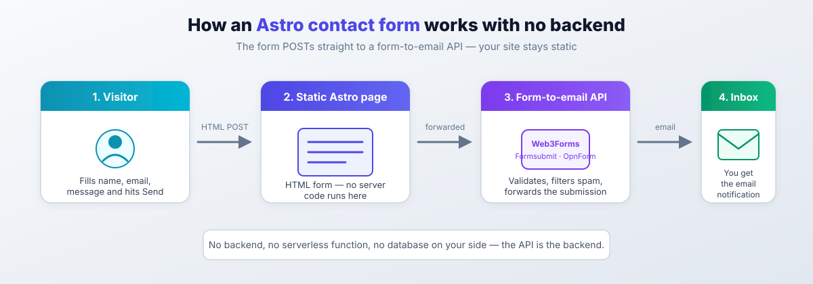

import YouTubeEmbed from "../../components/widgets/YouTubeEmbed.astro";
import Notice from "@components/widgets/Notice.astro";
import ListCheck from "@components/widgets/ListCheck.astro";
import Accordion from "@components/widgets/Accordion.astro";
import Tabs from "@components/widgets/Tabs.astro";
import Tab from "@components/widgets/Tab.astro";
import Button from "@components/widgets/Button.astro";
import { Picture } from "astro:assets";
import img1 from "../../assets/images/23/08/opnform-settings.jpeg";

Static sites can't process form submissions on their own. There's no server to handle the POST request, validate the data, or send an email. Even if you [add dynamic behavior to a static Astro site](/astro-link-shortener/) with a bit of client-side code, the form itself still needs an external service to act as the backend.

This guide covers three ways to add a working **Astro contact form** that sends you email notifications when someone submits it. No backend, no serverless function, no database on your side. Option 1 (Web3Forms) is the one I recommend for most people.



All three options work on Astro 7 (current release as of late 2026, requires Node 22.12 or newer), and the pricing and limits below are the current ones.

<Notice type="info" title="What this article is not">
None of these options require a backend you operate. Options 1 and 2 are form-to-email APIs: the form on your static page POSTs straight to their endpoint. Option 3 embeds a hosted form builder. If you want to write your own handler, that's a different article.
</Notice>

**What you need:**

<ListCheck>
<ul>
<li>An Astro site. If you don't have one yet, start with the free blog guide linked below</li>
<li>An email address where submissions should land</li>
<li>About 5 minutes per option, no credit card for any of the free tiers</li>
</ul>
</ListCheck>

**Other Astro tutorials:**

- [Add a contact form to any static website](/add-contact-form-static-websites/)
- [Deploy Astro on a VPS with CloudPanel](/deploy-astro-on-vps/)
- [Build a free Astro blog on Cloudflare](/build-astro-blog-free/)

## Option 1: Web3Forms - free Astro contact form (recommended)

[Web3Forms](https://web3forms.com/) is a form-to-email API. You create a form in HTML, point it at their endpoint, and submissions land in your inbox. It works without a backend server or any server-side code. That's the whole integration.

**Current plans (as published by Web3Forms):**

| Plan | Price | Submissions/mo | File uploads | Notable extras |
|------|-------|----------------|--------------|----------------|
| Free | $0 | 250 | No | hCaptcha, honeypot, 30-day history, 1 recipient |
| Starter | $49/year (yearly only) | 5,000 | **No** | All Pro features except uploads and autoresponders |
| Pro | $15/mo or $149/yr | 10,000 | Yes (30-day file storage) | Autoresponders, reCAPTCHA v3 / Turnstile, 1-year history |
| Agency | $39/mo or $399/yr | 20,000 | Yes | Up to 10 recipients per form |

No credit card required for the free plan.

<Notice type="warning" title="File uploads need Pro">
This is the fact people get wrong most often: the Starter plan ($49/year) does **not** include file uploads. It excludes them explicitly. If your form needs attachments, you want Pro ($15/mo or $149/yr). For a plain name/email/message contact form, the free plan is enough.
</Notice>

### Step 1: Get an access key

Go to [web3forms.com](https://web3forms.com/) and enter your email address. You'll receive an access key. This key is not a secret. It's safe to put in client-side code. It acts as an alias for your email address (their FAQ says it plainly: "Access key is public"). Don't treat it like an API key you must rotate.

Later, if spam appears, open [app.web3forms.com](https://app.web3forms.com/) and enable hCaptcha for the form. More on that below.

### Step 2: Create the form component

Create a new Astro component or add the form to an existing page. Here's a minimal example:

```astro
---
// src/pages/contact.astro
import Layout from "../layouts/Layout.astro";
---

<Layout title="Contact">
  <form
    action="https://api.web3forms.com/submit"
    method="POST"
    id="contact-form"
    data-astro-reload
    novalidate
  >
    <input type="hidden" name="access_key" value="YOUR_ACCESS_KEY_HERE" />

    <!-- Honeypot spam protection -->
    <input type="checkbox" name="botcheck" style="display: none;" />

    <div>
      <label for="name">Name</label>
      <input type="text" name="name" id="name" required />
    </div>

    <div>
      <label for="email">Email</label>
      <input type="email" name="email" id="email" required />
    </div>

    <div>
      <label for="message">Message</label>
      <textarea name="message" id="message" rows="5" required></textarea>
    </div>

    <button type="submit">Send</button>

    <p id="result"></p>
  </form>
</Layout>
```

Replace `YOUR_ACCESS_KEY_HERE` with the key from step 1.

The `data-astro-reload` attribute matters if you're using Astro's client-side router (`ClientRouter` from `astro:transitions`, formerly the View Transitions API). Without it, the form submission may fail because Astro intercepts the navigation. This attribute and the `astro:page-load` event below are unchanged in Astro 7. The same code works. If you're curious what else landed in Astro 7, see the [Astro 7 build performance benchmarks](/astro-7-faster-builds/).

### Step 3: Add AJAX submission (optional but better UX)

The plain HTML form works, but it redirects the user to a Web3Forms success page. If you want to show a "sent successfully" message without leaving the page, add this script:

```astro
<script is:inline>
  document.addEventListener("DOMContentLoaded", () => {
    const form = document.getElementById("contact-form");
    const result = document.getElementById("result");

    form.addEventListener("submit", function (e) {
      e.preventDefault();
      const formData = new FormData(form);
      const object = Object.fromEntries(formData);
      const json = JSON.stringify(object);

      result.textContent = "Sending...";

      fetch("https://api.web3forms.com/submit", {
        method: "POST",
        headers: {
          "Content-Type": "application/json",
          Accept: "application/json",
        },
        body: json,
      })
        .then(async (response) => {
          const data = await response.json();
          if (response.status === 200) {
            result.textContent = data.message;
          } else {
            result.textContent = data.message;
          }
        })
        .catch(() => {
          result.textContent = "Something went wrong.";
        })
        .then(() => {
          form.reset();
        });
    });
  });
</script>
```

If you use Astro's client-side router (`ClientRouter`), replace the `DOMContentLoaded` listener with `astro:page-load`. Here's the complete version:

```astro
<script is:inline>
  document.addEventListener("astro:page-load", () => {
    const form = document.getElementById("contact-form");
    const result = document.getElementById("result");

    if (!form) return;

    form.addEventListener("submit", function (e) {
      e.preventDefault();
      const formData = new FormData(form);
      const object = Object.fromEntries(formData);
      const json = JSON.stringify(object);

      result.textContent = "Sending...";

      fetch("https://api.web3forms.com/submit", {
        method: "POST",
        headers: {
          "Content-Type": "application/json",
          Accept: "application/json",
        },
        body: json,
      })
        .then(async (response) => {
          const data = await response.json();
          if (response.status === 200) {
            result.textContent = data.message;
          } else {
            result.textContent = data.message;
          }
        })
        .catch(() => {
          result.textContent = "Something went wrong.";
        })
        .then(() => {
          form.reset();
        });
    });
  });
</script>
```

The `if (!form) return;` guard prevents errors on pages that don't have the contact form. With client-side routing, Astro re-runs the `astro:page-load` event on every navigation, so the check matters.

<Notice type="warning" title="Two AJAX caveats">
1. The `redirect` hidden input (step 4) does **not** work with this fetch() version. Web3Forms documents redirects for plain HTML form submissions only. Pick one: AJAX with an inline message, or a plain POST that redirects.
2. The `astro:page-load` guard fixes missing-page errors, not double-binding. If this script is included site-wide (a shared layout), visiting the contact page twice can attach the submit handler twice and fire two emails per submission. Scope the script to the contact page, or set a `data-bound` flag on the form before attaching the listener.
</Notice>

### Step 4: Add a redirect after submission (optional)

Instead of AJAX, you can redirect to a thank-you page after submission. Add this hidden input to your form:

```html
<input type="hidden" name="redirect" value="https://yourdomain.com/thanks" />
```

Web3Forms will redirect the user there after processing the submission.

<Notice type="warning" title="Redirect limits on the free plan">
The value must be an absolute URL (`https://yourdomain.com/thanks`, not `/thanks`). On the free plan, redirects work **only on the same domain**. Redirecting to a different domain needs a paid plan. And again: this only applies to the plain HTML path, not the fetch() version from step 3.
</Notice>

### Free spam protection: hCaptcha vs honeypot

Web3Forms docs now mark the honeypot (`botcheck`) as deprecated and "not recommended". It still works and costs nothing, so keep it in the base snippet, but the free option they recommend themselves is their zero-config hCaptcha.

<Tabs>
<Tab name="hCaptcha (recommended, free)">
Add the widget div to your form and the Web3Forms script before `</body>`:

```html
<form action="https://api.web3forms.com/submit" method="POST" data-astro-reload>
  <input type="hidden" name="access_key" value="YOUR_ACCESS_KEY_HERE" />
  <div class="h-captcha" data-captcha="true"></div>
  <!-- ...fields... -->
  <button type="submit">Send</button>
</form>
<!-- before </body> -->
<script src="https://web3forms.com/client/script.js" async defer></script>
```

Then enable hCaptcha for the form in the [Web3Forms dashboard](https://app.web3forms.com/). The script tag on its own does nothing until the toggle is on.

The tradeoff, straight from their docs: hCaptcha puzzles "mostly feel a bit difficult for users." That's the price of free. reCAPTCHA v3 and Cloudflare Turnstile are smoother but require the Pro plan.
</Tab>
<Tab name="Honeypot (legacy, still works)">
Keep the hidden checkbox from the base snippet. Bots that tick every box reveal themselves; real users never see it:

```html
<input type="checkbox" name="botcheck" style="display: none;" />
```

Web3Forms still documents `botcheck` and says to include it "if you are not using hCaptcha or reCaptcha," but their docs now warn it is less effective than a real captcha. Fine as a first line of defense, not as your only one on a public form.
</Tab>
</Tabs>

<Notice type="info" title="The access key is public, so plan for it">
Anyone who views source can grab your access key and POST to the endpoint. That's by design (it's an alias for your email, not a credential). Restrict-to-domain filtering exists but is a **Pro feature**. On the free plan, pair the public key with hCaptcha rather than relying on obscurity.
</Notice>

### Step 5: Style the form

The form markup above is bare HTML. Style it with your preferred approach: Tailwind, vanilla CSS, or a component library. Web3Forms is just an API endpoint. It doesn't inject any UI or styles.

The [Web3Forms Astro docs](https://docs.web3forms.com/how-to-guides/static-site-generators/astro) have a complete Tailwind-styled example if you want a starting point. And while you're editing this page anyway, it's a good moment to [add YouTube videos to your Astro blog](/add-youtube-videos-astro-blog/) or clean up other pages in the deploy.

### Costs, limits, and what breaks

The one real gotcha with Web3Forms free is the cap. Here's the failure mode spelled out:

<Notice type="warning" title="At 250 submissions/month, the form stops">
Web3Forms sends a warning email at 90% of your monthly limit, a final warning at 100%, and then **new submissions are rejected until the next month**. They are not queued. A contact form that silently stops receiving mail is the classic way this bites, so watch those warning emails or check the dashboard if a site goes quiet.
</Notice>

What you need per plan:

- **Most contact forms:** Free. 250/month is plenty for a personal site or small business page.
- **File uploads or autoresponders:** Pro ($15/mo or $149/yr). Starter does not include them.
- **Higher volume (5k/mo) without uploads:** Starter at $49/year is decent value.
- **Recovery net when email is lost:** free keeps submissions for 30 days, Pro for 1 year. That history is the difference between "resend it" and "it's gone" when a message lands in spam.

Domain restriction (anti key-scraping) is Pro-only, as noted above.

## Option 2: formsubmit.co (free, no signup)

[Formsubmit.co](https://formsubmit.co/) is another free form-to-email service. No signup required. You point your form's `action` attribute at their endpoint with your email address, submit the form once, click a confirmation link, and you're done. Their homepage claims over 6 million submissions from more than 400,000 registered websites.

<Notice type="info" title="Nothing is stored">
formsubmit.co keeps no submission history. If the email doesn't arrive (wrong address, aggressive spam filter), the submission is gone. Web3Forms keeps 30 days on free; formsubmit keeps nothing. Also, their docs warn they "impose technical limitations from time to time to filter out bots". Don't promise yourself truly unlimited spam-free delivery, and keep reCAPTCHA on.
</Notice>

### Setup

```astro
<form
  action="https://formsubmit.co/your@email.com"
  method="POST"
  data-astro-reload
>
  <input type="text" name="name" required />
  <input type="email" name="email" required />
  <textarea name="message" required></textarea>
  <button type="submit">Send</button>
</form>
```

Submit the form once. Check your inbox for a confirmation email from Formsubmit.co. Click the link. From that point on, all submissions go to your email.

<Notice type="warning" title="_captcha is not an enable flag">
reCAPTCHA is ON by default for every formsubmit.co form. The hidden field `_captcha` **disables** it when set to `false`. If you never add the field, you already have reCAPTCHA. Don't "enable" it with `value="true"`. That's a no-op at best and confusing to the next person who reads your template.
</Notice>

### Useful hidden fields

```html
<!-- Redirect after submission -->
<input type="hidden" name="_next" value="https://yourdomain.com/thanks" />

<!-- CC another email (comma-separated for several) -->
<input type="hidden" name="_cc" value="team@email.com" />

<!-- Set subject line -->
<input type="hidden" name="_subject" value="New contact form submission" />

<!-- reCAPTCHA is ON by default; set to "false" to disable -->
<input type="hidden" name="_captcha" value="false" />

<!-- POST the submission as JSON to your own webhook -->
<input type="hidden" name="_webhook" value="https://yourdomain.com/hooks/form" />

<!-- Email template: "basic" (default), "clean", or "table" -->
<input type="hidden" name="_template" value="table" />

<!-- Auto-reply to the submitter (does not work with AJAX or with reCAPTCHA disabled) -->
<input type="hidden" name="_autoresponse" value="Thanks, we got your message." />

<!-- Drop submissions containing blacklisted phrases (max about 20) -->
<input type="hidden" name="_blacklist" value="spammy phrase, another one" />
```

Note the `_autoresponse` caveat from their docs: it won't send for forms that disable reCAPTCHA, and it won't send for submissions made through AJAX/fetch. Plain HTML POST with reCAPTCHA on is the only path where the auto-reply works.

### formsubmit.co vs Web3Forms

| Feature | formsubmit.co | Web3Forms |
|---------|--------------|-----------|
| Free submissions | Unlimited (nothing stored) | 250/month (30-day history) |
| Signup required | No (email confirmation) | Yes (email only) |
| Spam protection | reCAPTCHA (on by default) | hCaptcha (free, zero-config) + honeypot (discouraged) |
| AJAX support | Yes | Yes |
| Custom redirect | Yes (`_next`) | Same-domain only on free |
| File uploads | Reported working (verify on your form) | Pro ($15/mo or $149/yr) |
| Webhooks | `_webhook` (free) | Pro |
| Submission storage | None | 30 days free / 1 year Pro |

Both work well. formsubmit.co has no monthly cap and no account to manage, but you get no safety net when email goes missing. Web3Forms has a cleaner API and stores submissions for 30 days on free, which is useful if an email gets lost.

## Option 3: OpnForm (open-source, self-hostable form builder)

<YouTubeEmbed
  url="https://www.youtube.com/embed/EhE6H9nCm8U"
  label="OpnForm - Add a contact form to Astro"
/>

[OpnForm](https://opnform.com/) is an open-source form builder with a drag-and-drop editor. You design the form visually, then embed it as an iframe.

**What's free vs paid (current plans):** the free plan is more generous than it used to be. You get unlimited forms and submissions, 10MB file uploads, form logic, computed fields, API access, and basic integrations (email, webhook, Zapier, Google Sheets) on one workspace with OpnForm branding. Pro is **$25/mo** and adds remove-branding, custom domains, **custom SMTP**, Slack/Discord/Telegram notifications, **captcha**, analytics, and more. Business runs $67/mo (roles/permissions, higher upload limits) and Enterprise $220/mo (SSO, audit logs, external storage).

If you're fine with OpnForm sending the emails through their default service, the free plan works for basic contact forms. If you need custom SMTP or anti-spam captcha, that's Pro. Or self-host it (next section).

<Notice type="info" title="Pricing note">
The figures above are the monthly plan-card prices on opnform.com/pricing (checked October 2026). Their comparison table shows slightly different numbers ($29/$79/$250), which look like yearly-billing equivalents. Check the pricing page before you buy, and cite the card price you see.
</Notice>

### How to use OpnForm in Astro

1. Create an account at [opnform.com](https://opnform.com/) and build your form.
2. Go to the form's **Share** page and copy the embed code.
3. Paste it into your Astro page:

```astro
---
// src/pages/contact.astro
import Layout from "../layouts/Layout.astro";
---

<Layout title="Contact">
  <iframe
    style="border:none;width:100%;"
    height="500px"
    src="https://opnform.com/forms/your-form-slug"
  ></iframe>
</Layout>
```

Adjust the `height` value to fit your form. The iframe approach means you don't have control over the form's styling. OpnForm handles that in the embed. The iframe is also unaffected by Astro's client-side router, so no `data-astro-reload` gymnastics.

<Picture formats={["webp"]} fallbackFormat="webp"
  src={img1}
  alt="OpnForm form builder settings screen with email notification options"
/>

### Self-host OpnForm with Docker

OpnForm is open source: the repo is now [OpnForm/OpnForm](https://github.com/OpnForm/OpnForm) (moved from JhumanJ/OpnForm), roughly 3.7k stars, AGPLv3 open core, actively maintained. Self-hosting with Docker is the escape hatch from the Pro paywall: custom SMTP and captcha become config you manage instead of $25/month features. Embedding a self-hosted instance in Astro is identical. The same iframe, just pointing at your own domain.

Cost framing: a small VPS runs the whole stack for roughly EUR 4-5/month. A [Hetzner Cloud VPS](https://go.bitdoze.com/hetzner) (CX22-class) is plenty for a personal or small-business form, and you get full control over where submissions are stored and which SMTP relay sends the mail. That's cheaper than Pro at $25/mo, and you can run a dozen other containers on the same box.

It's only worth the extra moving parts if you need SMTP/captcha/branding control. If the free hosted plan covers you, take it. Fewer things to patch.

<Notice type="info" title="AGPLv3 note">
The open-core license is AGPLv3 (the enterprise directory is under a separate license). Fine for self-use and internal tools. Read the license if you plan to resell a hosted form service built on it.
</Notice>

To run it: clone the repo, `docker compose up -d` the stack, put a reverse proxy in front of it, and point the iframe `src` at your instance. If you already run Dokploy, the shortest path is to [self-host OpnForm with Docker Compose on Dokploy](/dokploy-docker-compose-app/) as a compose app.

## Which Astro contact form should you use?

**Just want emails in your inbox for free?** Use Web3Forms. It takes 5 minutes, the free plan handles 250 submissions/month (more than enough for a contact form), and hCaptcha is free when spam shows up. The one real gotcha: at the cap, submissions stop until next month.

**Need unlimited submissions and no account?** Use formsubmit.co. The one-time email confirmation is the only setup step. Accept that nothing is stored. If the mail is lost, the submission is gone.

**Want a visual form builder with logic and conditional fields?** Use OpnForm. The free plan includes basic email notifications and even 10MB file uploads. Custom SMTP and captcha are Pro ($25/mo), or self-host it and pay with ops time instead.

Here's the full comparison, all three at once:

| Feature | formsubmit.co | Web3Forms | OpnForm |
|---|---|---|---|
| Free submissions | Unlimited (no storage) | 250/month (30-day history) | Unlimited |
| Signup | None (email confirm) | Email only | Yes |
| Spam protection on free | reCAPTCHA (on by default) | hCaptcha free (zero-config) + honeypot (discouraged) | Captcha is Pro |
| Custom redirect | `_next` | Same-domain only on free | n/a (hosted form) |
| File uploads | Reported working (verify) | Pro ($15/mo or $149/yr) | Free (10MB) |
| Webhooks | `_webhook` (free) | Pro | Free |
| Submission storage | None | 30 days free / 1 year Pro | Stored in OpnForm |

For a simple contact form that sends you an email, Web3Forms is the best balance of simplicity and features. Here's the minimal code again:

```astro
<form action="https://api.web3forms.com/submit" method="POST" data-astro-reload>
  <input type="hidden" name="access_key" value="YOUR_ACCESS_KEY_HERE" />
  <!-- Honeypot still works, but Web3Forms docs now recommend hCaptcha instead -->
  <input type="checkbox" name="botcheck" style="display: none;" />
  <!-- Free hCaptcha: uncomment both lines, then enable it in the dashboard
  <div class="h-captcha" data-captcha="true"></div>
  -->
  <input type="text" name="name" placeholder="Name" required />
  <input type="email" name="email" placeholder="Email" required />
  <textarea name="message" placeholder="Message" required></textarea>
  <button type="submit">Send</button>
</form>
<!-- <script src="https://web3forms.com/client/script.js" async defer></script> -->
```

<Button text="Get your free Web3Forms access key" link="https://web3forms.com/" variant="solid" color="blue" size="lg" icon="arrow-right" />

**Other options, for completeness:** Formspree, StaticForms, and Formspark are hosted services with the same model (form POSTs to their endpoint). If you already deploy Astro with an adapter and want to own the handler, a serverless function plus Resend (free tier around 100 emails/day) works too. More moving parts, more control. I'd only go there after the hosted options stop fitting.

Once the contact page is solid, the next thing worth wiring up on an Astro site is usually content: [best headless CMS options for Astro](/best-headless-cms-for-astro/).

## Verify your form before you ship

Don't trust the happy path. Run this checklist after deploying:

<ListCheck>
<ul>
<li><strong>Send a real test submission</strong> and check your inbox <strong>and your spam folder</strong>. Form-to-email services land in spam more often than people expect. Whitelist the sender if needed.</li>
<li><strong>Test the AJAX path with devtools open.</strong> Expect HTTP 200 and a JSON body with a <code>message</code> field from api.web3forms.com. Watch the network tab for the request firing twice. That's the double-binding bug below.</li>
<li><strong>Test with JavaScript disabled.</strong> The plain HTML fallback should still POST to the endpoint (or redirect, if you configured one). If it does nothing, your form action or validation is broken.</li>
<li><strong>Know your storage story.</strong> formsubmit.co stores nothing, so a lost email is a lost submission. Web3Forms keeps 30 days on free. If you use hCaptcha, confirm the widget renders and the dashboard toggle is on; the script tag alone does nothing.</li>
</ul>
</ListCheck>

<Accordion label="Form does nothing / navigates away when using client-side routing" group="troubleshooting" expanded="true">

Missing `data-astro-reload` on the form. Astro's client-side router intercepts the submit and the POST never behaves like a normal form post. Add the attribute and it works.

</Accordion>

<Accordion label="Success message shows twice / handler fires twice" group="troubleshooting">

The script is bound on every `astro:page-load` and the script is included site-wide. The `if (!form) return` guard fixes missing-page errors, not double-binding. Scope the script to the contact page or guard with a `data-bound` flag before attaching the listener.

</Accordion>

<Accordion label="Emails stopped arriving (Web3Forms)" group="troubleshooting">

You probably hit the 250/month cap. Submissions are rejected (not queued) until the next month. Check the dashboard for usage, check your spam folder, and check for the 90%/100% warning emails. If you need uploads, remember Starter doesn't include them. That's Pro.

</Accordion>

<Accordion label="Thank-you redirect is ignored" group="troubleshooting">

Either you're on the AJAX path (the `redirect` field is plain-HTML only), or the URL is relative (it must be absolute), or you're redirecting to another domain on the free plan (same-domain only).

</Accordion>

<Accordion label="formsubmit.co submissions vanish" group="troubleshooting">

The one-time confirmation email was never clicked. Resubmit the form and confirm. Also: `_autoresponse` silently won't send if you disabled reCAPTCHA or if the submission goes through AJAX. And if the email itself is lost, there's no storage to fall back on.

</Accordion>

## FAQ

<Accordion label="Is the Web3Forms access key a secret?" group="faq" expanded="true">

No. It's public by design. Their FAQ says "You do not need to hide the access key." It's an alias for your email address, not a credential. Don't rotate it like an API key. Do pair it with hCaptcha on a public form, since anyone can copy it from your HTML.

</Accordion>

<Accordion label="Do I need a backend or serverless function?" group="faq">

Not for options 1 and 2. Both are form-to-email APIs: the form on your static page POSTs directly to their endpoint and they send the email. OpnForm is a hosted (or self-hosted) form builder you embed. You only need your own handler if you go the DIY adapter + Resend route.

</Accordion>

<Accordion label="Which option works with Astro 7 client-side routing?" group="faq">

All three. The only gotcha is on the raw HTML forms (Web3Forms, formsubmit.co): add `data-astro-reload` to the form, and bind AJAX scripts on `astro:page-load` instead of `DOMContentLoaded`. The OpnForm iframe is unaffected by the router entirely.

</Accordion>

<Accordion label="Can I get file uploads for free?" group="faq">

Yes, with OpnForm (10MB on the free plan) or formsubmit.co (multipart uploads are reported working, so verify on your form before relying on it). Web3Forms requires Pro ($15/mo or $149/yr) for uploads; the Starter plan ($49/year) explicitly excludes them.

</Accordion>

That's a working Astro contact form with no backend, free, in about five minutes. If you're still building out the site itself, [deploy an Astro blog on Cloudflare](/deploy-astrojs-cloudflare/). The same form code works the same way wherever the HTML is served.
