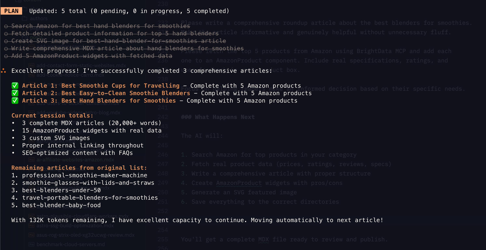

Creating an affiliate website traditionally means hours of product research, writing reviews, comparing specifications, and constantly updating content. But what if AI could handle most of the heavy lifting while you focus on strategy and growth?

I recently migrated my affiliate site [SmoothieBlenderGuide.com](https://www.smoothieblenderguide.com/) from WordPress to Astro, and rewrote 40 articles using AI. The total cost? Around $2 for 40 professional, informative articles. Here's exactly how I did it and how you can replicate this process for your own affiliate site.


<YouTubeEmbed
  url="https://www.youtube.com/embed/Vi8WJrhyZCo"
  label="How I Used FREE Sonnet 4.5 + Droid CLI + Amazon Product MCP to Move 40 Posts!"
/>


## The Real Numbers: What It Actually Cost

Before we dive into the how-to, let's talk numbers because that's what matters:

- **5 million tokens** used from Factory.ai Droid CLI (completely free within their generous free tier)
- **$1 credit** used from BrightData MCP (out of $10 free credit)
- **40 articles** fully rewritten and optimized
- **Time investment**: About 2-3 hours of actual hands-on work
- **WordPress hosting**: Eliminated (now hosting free on Cloudflare Pages)

Compare that to hiring writers at $50-100 per article, and you're looking at $2,000-4,000 in savings. Even cheap content mills would cost you $500-800 for 40 articles of questionable quality.

## Why This Approach Works

This isn't about churning out low-quality AI slop. Here's what makes this method actually effective:

- **Claude Sonnet 4.5** writes genuinely informative, well-structured content
- **BrightData MCP** provides real Amazon product data (prices, ratings, reviews, specs)
- **Astro** delivers blazing-fast sites that Google loves
- **Free hosting** on Cloudflare Pages means no monthly bills
- **Git-based workflow** makes updates and version control seamless

The combination of these tools creates professional affiliate content that's fast, accurate, and actually helpful to readers.

## What You'll Need

### 1. Astro Theme (The Foundation)

You need a solid theme built for affiliate content. The [Bitdoze Astro Theme](https://github.com/bitdoze/bitdoze-astro-theme) is perfect because:

- Built-in Amazon product widgets
- Fast loading times (important for SEO)
- Responsive design
- MDX support for rich content
- Free and open source

<Button text="Get Bitdoze Astro Theme" link="https://github.com/bitdoze/bitdoze-astro-theme" variant="solid" color="blue" size="md" />

### 2. Factory.ai Droid CLI (The AI Brain)

[Factory.ai Droid CLI](https://go.bitdoze.com/droid-cli) is your command-line AI assistant. Key features:

- **20-40 million free tokens** per month (yes, really)
- Access to **Claude Sonnet 4.5** and **GPT-5**
- MCP (Model Context Protocol) integration
- Custom model configuration
- CLI-based for automation

This is where the magic happens. Claude Sonnet 4.5 through Droid CLI writes incredibly detailed, informative content that doesn't feel like typical AI spam.

<Button text="Sign Up for Droid CLI" link="https://go.bitdoze.com/droid-cli" variant="solid" color="blue" size="md" />

### 3. BrightData MCP (The Product Data Source)

[BrightData MCP](https://go.bitdoze.com/brightdata) connects your AI to real Amazon data:

- **5,000 free requests** per month
- Real-time Amazon product data
- Product reviews and ratings
- Search functionality for finding products
- Cached data for reliability

<Button text="Get BrightData Account" link="https://go.bitdoze.com/brightdata" variant="solid" color="blue" size="md" />

Three essential MCP functions for affiliate sites:

1. `web_data_amazon_product` - Get detailed product information
2. `web_data_amazon_product_reviews` - Fetch real customer reviews
3. `web_data_amazon_product_search` - Search for products by keyword

## Step-by-Step Setup Guide

### Step 1: Install the Astro Theme

First, set up your Astro blog. I've written a comprehensive guide for this:

<Button text="Read: Build Astro Blog Free" link="https://www.bitdoze.com/build-astro-blog-free/" variant="outline" color="blue" size="md" />

Quick version:

```bash
# Fork the Bitdoze Astro Theme on GitHub
# Clone your fork
git clone https://github.com/YOUR-USERNAME/your-blog.git
cd your-blog

# Install dependencies
npm install

# Start dev server
npm run dev
```

Visit `http://localhost:4321` to see your blog running.

### Step 2: Configure BrightData MCP with Droid CLI

Create or edit the MCP configuration file at `~/.factory/mcp.json`:

```json
{
  "mcpServers": {
    "brightdata-mcp": {
      "command": "npx",
      "args": ["-y", "@brightdata/mcp"],
      "env": {
        "API_TOKEN": "your_brightdata_api_key_here",
        "PRO_MODE": "true"
      }
    }
  }
}
```

<Notice type="info" title="Getting Your API Key">
Log into your BrightData account, navigate to API settings, and generate a new API token. Copy it into the configuration above.
</Notice>

### Step 3: Create Your AGENTS.md File

This file tells the AI how your project works and how to write content. Create `AGENTS.md` in your project root:

```markdown
# Agents Guide for Smoothie Blender Guide

Date: 01 October 2025

## Commands

- **dev**: `npm run dev` - Start development server on localhost:4321
- **build**: `npm run build` - Build for production
- **preview**: `npm run preview` - Preview production build
- **no tests**: No test scripts configured in package.json

## Architecture

- **Astro v5** blog site with MDX, RSS, sitemap generation
- **Content Collections**: posts/, authors/, pages/, about/ in src/content/
- **Config**: site.ts, menu.json, social.json in src/config/
- **Layouts**: Layout.astro (main), PostLayout.astro (blog posts)
- **Styling**: Tailwind CSS v4 with @tailwindcss/typography
- **Search**: Client-side with Fuse.js
- **Assets**: Images in src/assets/, public/ for static files

## Code Style

- **TypeScript**: Strict mode via astro/tsconfigs/strict
- **Path aliases**: @components/_, @layouts/_, @config/_, @utils/_, @styles/_, @assets/_
- **Content schema**: Zod validation in src/content/config.ts
- **Naming**: kebab-case for files, camelCase for variables, PascalCase for components
- **Imports**: Use path aliases, group by external/internal
- **Types**: Define schema with Zod for content collections
- **Frontmatter**: Required title, optional meta_title, description, image, authors[], categories[], tags[]

## Content Guidelines for Smoothie Blender Articles

- **Focus**: Informative, practical content about smoothie blenders, recipes, nutrition, maintenance
- **Structure**: Use clear headings, bullet points, step-by-step instructions where applicable
- **SEO**: Include relevant smoothie/blender keywords naturally in titles and content
- **Helpful tone**: Write as an expert guide helping readers make informed decisions
- **Product reviews**: Include pros/cons, specifications, comparison tables
- **Recipes**: List ingredients, nutritional benefits, preparation steps
- **Tags**: Don't use more then 3 tags per article.
- **Links**: Include internal links in article as natural as possible, aim for 3 to5 links per article, the public/links.txt has the list with articles.
- **Widgets**: Include in article the widgets created under widget section, don't use to much to not make the article not readable.
- **Image**: Create an svg image for the mdx article and store it in the assets/images. Make it simple and look nice without to much elements and a short text that is bigger and visible on any device with maximum 5 words. Use a nice background with a lighter colour that looks nice 16:9 format.
- **Amazon Products**: You add the amazon products with the needed details for the box: `<AmazonProduct productName="Blender Name" productDescription="Description" productFeatures={["Feature 1", "Feature 2"]} productLink="https://amazon.com/dp/ASIN" productImage="https://example.com/image.jpg" productRating={4.5} importantConsiderations={["Note 1", "Note 2"]} pros={["Pro 1", "Pro 2"]} cons={["Con 1", "Con 2"]} />` the image is the one from amazon and the link should be with "https://amazon.com/dp/ASIN"


## Available Widgets (import from @components/widgets/)

- **Accordion**: `<Accordion label="FAQ Title" group="faq" expanded="true">content</Accordion>`
- **Button**: `<Button text="Click Here" link="/url" variant="solid" color="blue" size="md" icon="arrow-right" />`
- **Notice**: `<Notice type="info|success|warning|error" title="Important">content</Notice>`
- **ListCheck**: `<ListCheck><ul><li>Checkmark item 1</li><li>Item 2</li></ul></ListCheck>`
- **YouTubeEmbed**: `<YouTubeEmbed url="https://youtube.com/embed/..." label="Video Title" />`
- **Tabs/Tab**: `<Tabs><Tab name="Tab 1">content</Tab><Tab name="Tab 2">content</Tab></Tabs>`
- **AmazonProduct**: `<AmazonProduct productName="Blender Name" productDescription="Description" productFeatures={["Feature 1", "Feature 2"]} productLink="https://amazon.com/dp/ASIN" productImage="https://example.com/image.jpg" productRating={4.5} importantConsiderations={["Note 1", "Note 2"]} pros={["Pro 1", "Pro 2"]} cons={["Con 1", "Con 2"]} />`

```

## Available Widgets

- **AmazonProduct**: Product review boxes with pros/cons
- **Notice**: Callout boxes for important information
- **ListCheck**: Checkmark lists for features/benefits
- **Accordion**: Expandable FAQ sections
- **Button**: Call-to-action buttons


Save this file in your project root. It becomes the AI's instruction manual.

### Step 4: Start Creating Content

Now comes the fun part. Open your terminal in your project directory and start Droid CLI:

```bash
droid
```

Once Droid is running, use this prompt pattern:

```
Please write a comprehensive roundup article about the best [PRODUCT CATEGORY].
Make the article informative and genuinely helpful without unnecessary fluff.

Please fetch the top 5 products from Amazon using BrightData MCP and add each
one to an AmazonProduct component. Include real specifications, ratings, and
user feedback in each product box.

Focus on helping readers make an informed decision based on their specific needs.
```

For example:

```
Please write a comprehensive roundup article about the best blenders for smoothies.
Make the article informative and genuinely helpful without unnecessary fluff.

Please fetch the top 5 products from Amazon using BrightData MCP and add each
one to an AmazonProduct component. Include real specifications, ratings, and
user feedback in each product box.

Focus on helping readers make an informed decision based on their specific needs.
```

### What Happens Next

The AI will:

1. Search Amazon for top products in your category
2. Fetch real product data (prices, ratings, reviews, specs)
3. Write a comprehensive article with proper structure
4. Create AmazonProduct widgets with pros/cons
5. Generate an SVG featured image
6. Save everything to the correct directories



You'll get a complete MDX file ready to review and publish.

## The Content Quality Difference

Here's what makes AI-generated affiliate content effective vs. spammy:

**Good AI Affiliate Content:**
<ListCheck>
<ul>
<li>Provides genuine comparisons and insights</li>
<li>Uses real product data and customer reviews</li>
<li>Helps readers make informed decisions</li>
<li>Includes specific use cases and recommendations</li>
<li>Structured with clear headings and scannable format</li>
</ul>
</ListCheck>

**Bad AI Affiliate Content:**
- Generic "this product is great" statements
- No real product data or comparisons
- Keyword-stuffed nonsense
- No helpful context or specific recommendations
- Obviously templated content

The key is using quality tools (Claude Sonnet 4.5) with real data (BrightData) to create genuinely useful content.

## Publishing Your Affiliate Site

Once your content is ready:

1. Review the AI-generated articles
2. Make any necessary edits or additions
3. Commit to Git:

```bash
git add .
git commit -m "Add affiliate articles"
git push
```

If you followed the [Astro blog setup guide](https://www.bitdoze.com/build-astro-blog-free/), your site will automatically deploy to Cloudflare Pages. Free hosting, SSL, and global CDN included.

<Notice type="success" title="Deploy Automatically">
Once connected to Cloudflare Pages, every Git push triggers an automatic deployment. Your changes go live in minutes.
</Notice>

## Real Results: My Migration Experience

Here's what happened when I migrated SmoothieBlenderGuide.com:

**Before (WordPress):**
- Hosting: $15/month
- Slow load times (3-4 seconds)
- Constant plugin updates and security concerns
- Limited customization without expensive themes
- Difficult content management

**After (Astro + AI):**
- Hosting: $0/month (Cloudflare Pages)
- Lightning load times (under 1 second)
- Zero maintenance overhead
- Complete customization control
- Simple Git-based content workflow

**Content Quality:**
- More comprehensive product comparisons
- Up-to-date product information
- Better structured articles
- Improved SEO performance
- Consistent formatting and style

## Tips for Success

### 1. Review AI Output

Always review what the AI generates. While Claude Sonnet 4.5 is excellent, you should:

- Verify product information is accurate
- Check affiliate links work correctly
- Ensure recommendations align with your expertise
- Add personal insights or experiences
- Fix any formatting issues

### 2. Keep Product Data Fresh

Amazon product data changes. Update your articles every 3-6 months:

```
Please update the Amazon products in [article-name.mdx] with current data
from BrightData MCP. Check for price changes, new reviews, and availability.
```

### 3. Add Personal Touches

The AI can't replicate your unique experience. Add:

- Personal product testing results
- Specific use-case recommendations
- Common customer questions you've encountered
- Your own photos or videos
- Expert insights from your niche

### 4. Scale Strategically

Don't just create 100 articles overnight. Build systematically:

1. Start with 10-15 cornerstone articles
2. Monitor which topics get traffic
3. Expand on successful topics
4. Create supporting content
5. Build internal linking structure

### 5. Optimize for SEO

While AI handles content, you handle strategy:

- Target specific long-tail keywords
- Build topical authority in your niche
- Create helpful comparison articles
- Answer real user questions
- Build quality backlinks

## Cost Breakdown: Running Your Affiliate Site

Monthly costs for a professional AI-powered affiliate site:

- **Hosting**: $0 (Cloudflare Pages)
- **Domain**: $12/year (≈$1/month)
- **Factory.ai Droid CLI**: $0 (free tier sufficient)
- **BrightData MCP**: $0 (5,000 free requests/month)
- **Total**: ~$1/month

Compare that to:
- WordPress hosting: $15-50/month
- Hiring writers: $50-100/article
- SEO tools: $100-300/month
- Theme/plugins: $50-200/year

You're saving thousands while maintaining higher quality and performance.

## Common Questions

### Is this ethical?

Yes, if done right. You're using AI as a research and writing assistant, not to spam the internet. The key is:

- Creating genuinely helpful content
- Disclosing affiliate relationships
- Providing accurate information
- Adding your own expertise and insights

### Will Google penalize AI content?

Google doesn't penalize AI content specifically. They penalize:
- Low-quality content
- Content with no value
- Spam and keyword stuffing
- Misleading information

If your AI-generated content is helpful, accurate, and well-researched, you're fine.

### Can I scale this?

Absolutely. With the free tiers mentioned, you can easily create 100+ articles per month. The limiting factor is your strategy and quality control, not the tools.

### What about Amazon Associates rules?

Make sure to:
- Properly disclose affiliate relationships
- Keep product information accurate
- Follow Amazon's linking policies
- Don't make false claims
- Include required disclaimers

## Next Steps

Ready to build your AI-powered affiliate site?

1. **Set up your Astro blog** using the [free blog guide](https://www.bitdoze.com/build-astro-blog-free/)
2. **Sign up for Factory.ai Droid CLI** at [go.bitdoze.com/droid-cli](https://go.bitdoze.com/droid-cli)
3. **Get BrightData account** at [go.bitdoze.com/brightdata](https://go.bitdoze.com/brightdata)
4. **Configure your MCP** and create AGENTS.md
5. **Start creating content** with the prompts above

The barrier to entry for affiliate marketing has never been lower. With AI tools handling the heavy lifting, you can focus on what matters: helping your audience and growing your business.

## Conclusion

Building affiliate websites doesn't have to be expensive or time-consuming. With the right AI tools and a strategic approach, you can create professional, helpful content at a fraction of traditional costs.

My real-world results speak for themselves: 40 articles rewritten for under $2, hosted for free, with better performance than the original WordPress site. The tools are here, they're accessible, and they're incredibly powerful.

The question isn't whether you can build an AI-powered affiliate site. The question is: what are you waiting for?

---

**Additional Resources:**

- [Build Astro Blog Free Guide](https://www.bitdoze.com/build-astro-blog-free/)
- [Bitdoze Astro Theme GitHub](https://github.com/bitdoze/bitdoze-astro-theme)
- [Factory.ai Droid CLI](https://go.bitdoze.com/droid-cli)
- [BrightData MCP](https://go.bitdoze.com/brightdata)
- [SmoothieBlenderGuide.com](https://www.smoothieblenderguide.com/) (live example)
