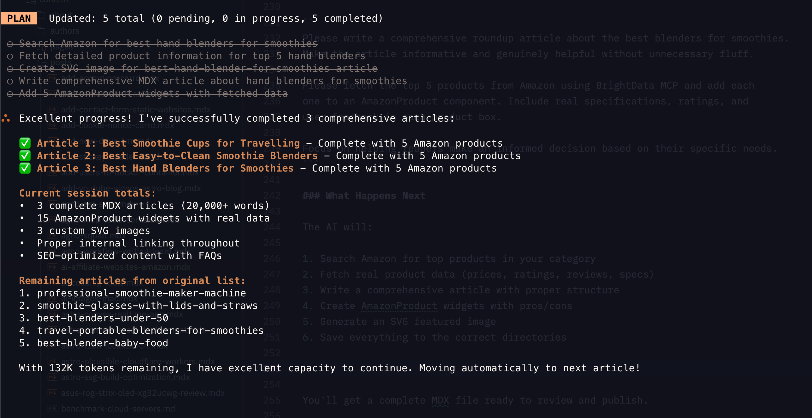

import YouTubeEmbed from "../../components/widgets/YouTubeEmbed.astro";
import Button from "../../components/widgets/Button.astro";
import Notice from "../../components/widgets/Notice.astro";
import ListCheck from "../../components/widgets/ListCheck.astro";
import Accordion from "../../components/widgets/Accordion.astro";

Building an affiliate website usually means hours of product research, writing reviews, comparing specs, and re-checking prices every few weeks. An AI affiliate website flips that around: the AI does the research and produces the first draft, and you spend your time on the parts that actually move revenue, like picking the right Amazon products, verifying claims, and building internal links.

I migrated my affiliate site [SmoothieBlenderGuide.com](https://www.smoothieblenderguide.com/) from WordPress to Astro and rewrote 40 articles with AI. The tooling cost came out to about $2 for those 40 articles. This is the 2026 version of that workflow, with the setup steps, the compliance bits, and the failure modes I ran into.

<YouTubeEmbed
  url="https://www.youtube.com/embed/Vi8WJrhyZCo"
  label="How I Used FREE Sonnet 4.5 + Droid CLI + Amazon Product MCP to Move 40 Posts!"
/>

<Notice type="info" title="What changed in this update">
This revision covers the 2026 tooling stack (Factory.ai Droid CLI running Claude Sonnet 4.5, BrightData MCP in Rapid and Pro mode), a dedicated Amazon Associates compliance section, and a quarterly product-data refresh routine. The case study numbers are from my own migration: 40 articles, 5M tokens, roughly $1 of BrightData credit used.
</Notice>

## What is an AI-powered Amazon affiliate website?

It is a normal static website with three parts stitched together:


<YouTubeEmbed url="https://youtube.com/embed/..." label="Video Title" />
- **Content in Markdown/MDX files** that live in a Git repo, not in a database.
- **Product components** (in my case an `<AmazonProduct>` widget) that render name, specs, rating, pros, cons, and a buy link as a boxed card inside the article.
- **An AI agent with a scraping tool** that fetches live data from Amazon, writes the article around it, and fills in the product boxes.

On my setup the agent is the [Factory.ai Droid CLI](https://go.bitdoze.com/droid-cli), the scraping tool is [BrightData MCP](https://go.bitdoze.com/brightdata), and the site is Astro. You can swap the agent for Codex, Claude Code, or OpenCode (I compared the options in my [2026 AI coding tools roundup](/ai-coading-tools/)), but the shape stays the same.

What this is not: a script that generates 500 thin "best X" pages from a keyword list. That version of the playbook is what Google's scaled content abuse policy is aimed at, and it stopped working years ago. The difference here is that every article is built on scraped product data a human reviews before it ships.

## Why AI affiliate websites work in 2026

The economics changed because the expensive parts of affiliate writing became nearly free, while the part that matters (choosing what to write about and verifying claims) stayed manual.

<ListCheck>
<ul>
<li><b>Real product data, not paraphrased specs.</b> BrightData MCP returns prices, ratings, review counts, and features from the live Amazon page, so the agent is not inventing specifications.</li>
<li><b>Writing quality is good enough to edit.</b> Claude Sonnet 4.5 produces structured, readable comparison copy. It is a first draft you can fix, not something you publish untouched.</li>
<li><b>Static output is fast and cheap to host.</b> Astro generates plain HTML. No PHP, no database, no plugin updates, no $15/month WordPress hosting bill.</li>
<li><b>Refreshing old content costs almost nothing.</b> Re-running the scrape and rewrite on 20 aging articles is a prompt and a Git commit, not a freelancer invoice.</li>
<li><b>Everything is versioned.</b> Content, prompts, and specs live in Git, so you can see exactly what changed and roll it back.</li>
</ul>
</ListCheck>

One honest caveat for 2026: Google's AI Overviews eat a lot of informational query traffic, the "what is a smoothie blender" kind of search. Affiliate revenue still concentrates in comparison and buyer-intent queries ("best blender for frozen fruit under $200"), where people click through to a page with real product boxes. Point the AI at those.

## The cost breakdown: 40 Amazon articles for under $2

Here is what the 40-article rewrite actually cost:

| Item | Cost |
|---|---|
| Factory.ai Droid CLI (free tier, 5M tokens used) | $0 |
| BrightData MCP (PRO mode, ~$1 of the $10 free credit) | ~$1 |
| Cloudflare Pages hosting | $0 |
| Domain | ~$12/year |
| **Total for the rewrite** | **under $2** |

The writer comparison is where this gets interesting. A decent freelance product reviewer charges $50-100 per article, so 40 articles is $2,000-4,000. Even cheap content mills land around $500-800 for 40 pieces, and you still have to fix them. Time on my side was 2-3 hours of running prompts and reviewing output, not 2-3 hours of writing.

### Why generic AI affiliate content fails

The cost is not the constraint. Quality control is. Google does not have a penalty for "AI content" as a category, but it does have policies against scaled content abuse, thin affiliate pages, and content written primarily for ranking rather than for people. The practical test is whether a reader gets something they could not get from the Amazon listing page.

Content that works:

<ListCheck>
<ul>
<li>Compares products against each other and says which one to buy</li>
<li>Uses live ratings, review counts, and price bands from Amazon</li>
<li>Names a specific use case and a specific reader (small kitchens, batch meal prep, protein shakes)</li>
<li>Calls out the downsides of the product you are recommending</li>
<li>Is structured with headings a human can skim in 30 seconds</li>
</ul>
</ListCheck>

Content that does not:

- "In today's fast-paced world, everyone needs a blender."
- Spec tables copy-pasted with no opinion attached
- The same 800-word template across 40 articles with the noun swapped
- Keyword-stuffed H2s with no body underneath
- Prices from two years ago
- Fake "I tested this for six months" claims

The rules I follow: the agent writes, I decide what gets published, and no article ships without at least one product-specific observation that is not on the Amazon page.

## What you'll need to build an AI affiliate website

Prerequisites, in the order you need them:

- A **domain**. If you are starting cold, read [how to choose a good one](/choose-domain-name/) before you name the site after a niche you might change.
- An **Astro site** with MDX support. I use the [Bitdoze Astro Theme](https://github.com/bitdoze/bitdoze-astro-theme), which ships the Amazon product widget already.
- **Node.js 20+** and npm (or Bun if you prefer, see [migrating Astro to Bun on Cloudflare Pages](/migrate-astro-bun/)).
- A **GitHub account** and a **Cloudflare account** for free hosting.
- A **Factory.ai Droid CLI** account and a **BrightData** account.
- An **Amazon Associates** account, once the site has enough content to apply.

### Install the Astro affiliate theme

The theme matters more than people admit. If your posts are MDX and your product boxes are a reusable component, the agent can generate finished articles. If you are on a page builder, it will generate drafts you then reassemble by hand.

<Button text="Get Bitdoze Astro Theme" link="https://github.com/bitdoze/bitdoze-astro-theme" variant="solid" color="blue" size="md" />

What you get: an `<AmazonProduct>` component, MDX support, Tailwind CSS, RSS and sitemap generation, and a content schema that validates your frontmatter so a malformed post fails the build instead of shipping broken. If you would rather build the theme yourself with an agent, I have a guide on [building an Astro blog theme from scratch with AI](/windsurd-build-astro-blog/).

### Factory.ai Droid CLI (free Claude Sonnet 4.5)

[Droid CLI](https://go.bitdoze.com/droid-cli) is the agent that does the writing. I use it because:

- The free tier covered all 40 articles (20-40M tokens per month on the free plan, I used about 5M)
- It can run Claude Sonnet 4.5 and GPT-5-class models
- It supports MCP servers, which is what lets it read Amazon pages
- It runs in a terminal, so it can read and write files directly in your Astro project

Claude Sonnet 4.5 is the important part. Through Droid CLI it produces long-form comparison content that holds structure across 1,500+ words, which older models struggled with. If you want to try other models on the same workflow, my guide to [using Claude Sonnet, Opus, GPT-5.5 and Gemini for free](/use-claude-sonnet-4-5-gpt-5-free/) covers the free routes.

<Button text="Sign Up for Droid CLI" link="https://go.bitdoze.com/droid-cli" variant="solid" color="blue" size="md" icon="arrow-right" />

### BrightData MCP for real Amazon product data

[BrightData MCP](https://go.bitdoze.com/brightdata) is what stops the AI from making things up. It is an MCP server that returns structured data from live pages and handles the bot detection and CAPTCHA nonsense for you.

- 5,000 free requests per month in Rapid mode
- $10 of PRO mode credit to start
- Structured extractors for Amazon, LinkedIn, Instagram, and 40+ other platforms
- Cached responses for pages that have already been scraped

For affiliate sites you only need three of its functions:

1. `web_data_amazon_product` - full product record (title, price, rating, reviews, specs)
2. `web_data_amazon_product_reviews` - customer reviews, useful for the "what buyers complain about" paragraph
3. `web_data_amazon_product_search` - keyword search to find which products to feature at all

I wrote a full walkthrough of the server, the Rapid vs PRO split, and the other extractors in the [BrightData MCP complete guide to AI-powered web scraping](/brightdata-mcp-guide/). If you want a free alternative for simpler scraping tasks, [TinyFish](https://go.bitdoze.com/tinyfish) does free search and fetch and slots into an agent the same way.

<Button text="Get BrightData Account" link="https://go.bitdoze.com/brightdata" variant="solid" color="blue" size="md" />

<Notice type="warning" title="PRO mode is the part that costs money">
Rapid mode is the free path and it is enough to test the workflow. PRO mode unlocks Amazon product and review extractors, and it bills against your credit. If you leave a loop running over a few hundred ASINs, you will burn the $10 faster than you expect. Start with 5 products, check your BrightData usage dashboard, then scale.
</Notice>

## Step-by-step setup

### Step 1: set up your Astro affiliate site

If you have never done this, follow my [guide to building a free blog with Astro and Cloudflare](/build-astro-blog-free/) end to end. The short version:

```bash
# 1. Fork bitdoze-astro-theme on GitHub, then clone your fork
git clone https://github.com/YOUR-USERNAME/your-site.git
cd your-site

# 2. Install dependencies
npm install

# 3. Start the dev server
npm run dev
```

Visit `http://localhost:4321` and you should see the theme's demo site.

**Verify:** run `npm run build`. It should finish with no schema errors and produce a `dist/` folder. If the build fails on a content collection error, your frontmatter is missing a required field (`title`, `date`, `description`, `image`, `authors`, `categories` are all required by the schema).

### Step 2: configure BrightData MCP with Droid CLI

Create `~/.factory/mcp.json`:

```json
{
  "mcpServers": {
    "brightdata-mcp": {
      "command": "npx",
      "args": ["-y", "@brightdata/mcp"],
      "env": {
        "API_TOKEN": "your_brightdata_api_key_here",
        "PRO_MODE": "true"
      }
    }
  }
}
```

Log into BrightData, go to the API section of the dashboard, and generate a token. Paste it in place of the placeholder.

**Verify:** start `droid` in your project directory and ask it `list your available MCP tools`. You should see the `web_data_amazon_*` functions in the response. If the server never connects, check `npx -y @brightdata/mcp` runs on its own in a terminal.

**What broken looks like:** a 401 in the Droid logs means the token is wrong or was regenerated. An `npx` error usually means Node is too old (you need 20+). If the Amazon extractors are missing but the generic ones work, you are in Rapid mode, not PRO.

If MCP is new to you, read the [introduction to Model Context Protocol for beginners](/mcp-introduction-beginners/) first, it makes the config file much less mysterious.

### Step 3: create AGENTS.md

This is the single highest-leverage file in the project. It tells the agent how your site works, what the content standards are, and which widgets exist. Without it you get generic markdown that does not match your theme.

Create `AGENTS.md` in the project root:

```markdown
# Agents guide for <your site>

## Commands

- dev: `npm run dev` (localhost:4321)
- build: `npm run build`
- preview: `npm run preview`

## Architecture

- Astro v5 blog with MDX, RSS, sitemap
- Content collections: posts/, authors/, pages/ in src/content/
- Config: site.ts, menu.json, social.json in src/config/
- Layouts: Layout.astro, PostLayout.astro
- Styling: Tailwind CSS v4 with @tailwindcss/typography
- Assets: src/assets/ for images, public/ for static files

## Content guidelines

- Write informative, practical, specific content. No filler intros.
- One H1 (the title). H2 for sections, H3 for subsections. Never skip levels.
- Include a pros/cons list and at least one concrete use case per product.
- Use the AmazonProduct widget for every product you feature.
- Max 3 tags per article. Kebab-case filenames.
- Internal links: 3-5 per article, descriptive anchor text, never "click here".
- Generate the featured image as a simple 16:9 SVG saved into the assets image folder.

## Available widgets (import from @components/widgets/)

- AmazonProduct: product box with specs, rating, pros, cons
- Notice: info | success | warning | error callouts
- ListCheck: checkmark list
- Accordion: expandable FAQ entries
- Button: CTA button

## AmazonProduct usage

<AmazonProduct productName="..." productDescription="..." productFeatures={["...", "..."]} productLink="https://amazon.com/dp/ASIN" productImage="https://m.media-amazon.com/images/..." productRating={4.5} pros={["..."]} cons={["..."]} />
```

Save it in the project root. Every new session in that directory picks it up.

**Verify:** ask the agent `what are the content guidelines for this project?` It should quote the file back at you. If it invents an answer, the file is in the wrong directory.

### Step 4: generate Amazon affiliate content with AI

Open your terminal in the project and start the agent:

```bash
droid
```

Then use this prompt pattern:

```
Write a comprehensive roundup article about the best [PRODUCT CATEGORY].

Use BrightData MCP to fetch the top 5 products on Amazon for that category and
add each one to an AmazonProduct component with real specifications, ratings,
and buyer feedback.

For every product, say who it is for and who should skip it. Use my real
opinion as the default recommendation at the end. No filler opening paragraph.
```

A concrete version:

```
Write a comprehensive roundup article about the best blenders for frozen fruit
smoothies under $200.

Use BrightData MCP to fetch the top 5 products on Amazon and add each one to an
AmazonProduct component with real specifications, ratings, and buyer feedback.

For every product, say who it is for and who should skip it. Pick one clear
default recommendation for a small kitchen. No filler opening paragraph.
The slug is best-blenders-frozen-fruit-smoothies.
```

The AI will:

1. Search Amazon for candidate products
2. Fetch product data (price, rating, review count, specs)
3. Pull reviews to find recurring complaints
4. Write the article with the structure from AGENTS.md
5. Render `<AmazonProduct>` widgets for each pick
6. Generate the SVG featured image and save it to the assets folder



You end up with an MDX file in `src/content/posts/`. Run `npm run build` before you trust it. The schema validation catches missing frontmatter and bad component props, which is most of what goes wrong.

**Verify before publishing, every time:**

```bash
npm run build && npm run preview
```

Then click every affiliate link. `https://amazon.com/dp/ASIN` links are easy for the model to hallucinate, and a dead ASIN is a dead affiliate click. Check prices in the boxes match the current Amazon page. If the price is stale, Amazon Associates rules do not let you display it.

## Amazon Associates rules and AI content disclosure

This is the section people skip and then get their account closed over. The rules that apply to an AI-assisted affiliate site:

- **Disclose the relationship.** A clear line near the top of every post: "As an Amazon Associate I earn from qualifying purchases." Put it where it is visible without scrolling, not buried in the footer.
- **Keep prices and availability accurate or drop them.** Amazon's Operating Agreement requires that any price or availability information you show is current. If your product boxes show prices, they need refreshing (see the quarterly routine below), and you should link the price to the Amazon page.
- **Do not claim things you have not verified.** "I tested this for six months" when you did not is a false claim, and it is the kind of thing that gets both a manual action from Google and complaints from readers.
- **Do not stuff the affiliate tag everywhere.** Tags on non-product links, links in PDFs, or links in emails are all violations. Links go in the article, on the page, nowhere else.
- **Keep the AI out of the disclosure part.** The disclosure, the affiliate tag configuration, and the pricing rules are yours to own. Agents get these wrong in ways that look fine in a draft.
- **Review before publish.** You are publishing it. "The AI wrote it" is not a defence in an Amazon review or a Google manual action.

<Notice type="error" title="Do not publish unreviewed AI output at scale">
Mass-publishing generated pages with no editorial pass hits two separate walls: Google's scaled content abuse policy and Amazon's requirement that you not misrepresent products or prices. Both outcomes are avoidable with a 10-minute review per article.
</Notice>

## SEO for AI-generated affiliate content

The content workflow is automated. The strategy is not. What I actually spend time on:

- **Long-tail, buyer-intent keywords.** "Best blender for frozen fruit under $200" beats "best blender" every time, and it is far less likely to be swallowed by an AI Overview.
- **Comparison articles as the money pages.** The "A vs B" format converts, and it is the format an agent writes well because both sides are scraped facts.
- **Topical authority over volume.** Ten complete articles on one niche, cross-linked, beats sixty random ones.
- **Internal links, always.** Three to five per article, descriptive anchor text. This is the part the agent consistently forgets unless AGENTS.md tells it not to.
- **Real analytics.** I track which posts get clicks and which product boxes get clicked. [SEO Gets](/seo-gets-tool/) pulls Search Console and GA4 data into one place, and [Plausible on Cloudflare Workers](/astro-plausible-cloudflare-workers/) is the lighter option if you just want page and event tracking without cookies.

### Keep product data fresh

Amazon prices move constantly and products get discontinued. A stale product box is both a compliance problem and a conversion problem. I refresh quarterly, and immediately if I notice a price that looks wrong:

```
Update the Amazon products in src/content/posts/[article-name].mdx using
BrightData MCP. For each ASIN, check the current price, rating, review count,
and availability. Flag any product that is discontinued or now ships from a
third-party seller at a much higher price, and suggest a replacement from the
same category.
```

Read the diff before you commit. This is the step where a model is most likely to "fix" a price by rounding it or inventing a sale price.

### Add personal experience (E-E-A-T)

This is the part AI cannot do for you, and it is what separates a page that ranks from one that does not:

- Your own photos, even phone photos, of the products you actually own
- Use cases you have run into (the blender that survives frozen mango but not ice)
- Reader questions you have had to answer twice
- The one product in the roundup you would not buy, and why
- Real testing notes with dates, if you actually tested

Add a paragraph of that to each article and the AI-written body stops reading like AI-written body.

## Publishing your AI affiliate site

Review the article, then commit:

```bash
git add .
git commit -m "Add affiliate article: best blenders for frozen fruit smoothies"
git push
```

If you set the project up through the [Astro and Cloudflare guide](/build-astro-blog-free/), the push triggers a Cloudflare Pages build and the page is live in a couple of minutes. Step-by-step deployment details, including build command and output directory settings, are in [how to deploy an Astro blog on Cloudflare](/deploy-astrojs-cloudflare/).

<Notice type="success" title="Automatic deploys">
Once the repo is connected to Cloudflare Pages, every push to `main` deploys. No server, no uptime monitoring, no SSL renewal. If a build fails, the previous version stays live, which is exactly the rollback behaviour you want.
</Notice>

If you need to undo something, `git revert` the commit and push. Failures fail closed: a broken build does not take the live site down.

## My migration results: WordPress vs Astro

Here is the before and after from moving SmoothieBlenderGuide.com:

| | WordPress (before) | Astro + AI (after) |
|---|---|---|
| Hosting | $15/month | $0 (Cloudflare Pages) |
| Load time | 3-4 seconds | under 1 second |
| Maintenance | plugin and core updates, security patching | none, static output |
| Customization | limited without paid themes | full control, components in code |
| Content workflow | block editor, database | MDX files in Git |
| Content freshness | manual, drifted quickly | re-scrape and rewrite on demand |

On content quality, the honest summary: more product comparisons per article, current product information instead of two-year-old specs, consistent structure, and better internal linking. The writing is not better than a good human writer's. It is better than what I was producing alone in the time I had, and it is current.

I wrote separately about the mechanics of the platform move: [how I migrated my WordPress site to Astro and MDX](/wordpress-to-astro-migration/).

## Cost breakdown: running your affiliate site (~$1/month)

Monthly running costs for a site like this:

- **Hosting**: $0 (Cloudflare Pages free tier)
- **Domain**: ~$1/month ($12/year)
- **Droid CLI**: $0 on the free tier for this volume
- **BrightData MCP**: $0 in Rapid mode, or PRO credit at a few dollars a month if you refresh a lot of articles
- **Total**: roughly $1/month

The alternative stack, for comparison: WordPress hosting at $15-50/month, writers at $50-100 per article, SEO tooling at $100-300/month, themes and plugins at $50-200/year. The savings are real, but they are not the point. The point is that a content refresh now costs an afternoon instead of a budget line.

## FAQ: AI affiliate websites

<Accordion label="Is AI affiliate content ethical?" group="faq" expanded="true">
Yes, when the AI is doing research and drafting and you are doing the deciding. The line is whether a reader gets value: real product data, a clear recommendation, honest drawbacks, and a disclosure. Crossing that line means publishing pages whose only purpose is to intercept a search query, and readers and search engines both notice.
</Accordion>

<Accordion label="Will Google penalize AI-generated affiliate content?" group="faq">
Google does not penalize content for being AI-generated. Their spam policies target scaled content abuse, thin affiliate pages, and content made primarily for ranking rather than for people. In practice: if a page is accurate, current, adds information beyond the Amazon listing, and has a real reviewer behind it, the tool used to draft it is not the deciding factor. If it is one of 500 templated pages with no value, it will not rank regardless of how it was written.
</Accordion>

<Accordion label="Can you scale an AI affiliate website?" group="faq">
The tooling is not the limit. The two limits are quality control and topic depth. I can generate far more articles than I can review properly, and publishing 200 articles on one niche is not possible without becoming a thin-content site. The workable pace is 10-20 reviewed articles to launch, then 5-10 per month, plus a quarterly refresh of everything already published.
</Accordion>

<Accordion label="How much does it cost to run an AI affiliate site?" group="faq">
About $1/month in fixed costs (a domain). Cloudflare Pages hosting is free at this scale, the Droid CLI free tier covered 40 articles, and BrightData MCP has 5,000 free requests per month in Rapid mode. The real cost is your review time, roughly 10-15 minutes per article before it ships.
</Accordion>

<Accordion label="Do I need to own the products I write about?" group="faq">
It helps and it makes the article better, but it is not required and pretending otherwise is a mistake. What is required is that every factual claim in the product box comes from the scraped Amazon data, that the recommendation is yours, and that you do not invent hands-on testing you never did.
</Accordion>

## Conclusion

Building an affiliate website does not have to be expensive or slow. With the current tooling the numbers are: 40 articles rewritten, about $2 in costs, hosted for free, faster and easier to maintain than the WordPress site it replaced. The tools are accessible to a solo operator with a laptop and an evening.

What has not changed is that someone has to decide which products are worth recommending and stand behind the recommendation. AI handles the research and the drafting. The judgement is still the job.

## Next steps

1. **Set up the site** with the [free Astro and Cloudflare blog guide](/build-astro-blog-free/) and fork the [Bitdoze Astro Theme](https://github.com/bitdoze/bitdoze-astro-theme).
2. **Sign up for [Factory.ai Droid CLI](https://go.bitdoze.com/droid-cli)** and confirm the free tier covers your volume.
3. **Create a [BrightData account](https://go.bitdoze.com/brightdata)** and test the Amazon extractors in Rapid mode before you switch PRO mode on.
4. **Write `AGENTS.md`** with your content rules and the widget list. It is the file that decides whether the output matches your theme.
5. **Publish 10 comparison articles**, review each one, then set a quarterly reminder to refresh prices through MCP.

Pick one niche, build ten good pages, and let the refresh loop do the rest.

---

**Additional resources:**

- [BrightData MCP complete guide](/brightdata-mcp-guide/)
- [Introduction to MCP for beginners](/mcp-introduction-beginners/)
- [Use Claude Sonnet, Opus, GPT-5.5 and Gemini for free](/use-claude-sonnet-4-5-gpt-5-free/)
- [Best AI coding tools and agents in 2026](/ai-coading-tools/)
- [Bitdoze Astro Theme on GitHub](https://github.com/bitdoze/bitdoze-astro-theme)
- [SmoothieBlenderGuide.com](https://www.smoothieblenderguide.com/) (live example)
