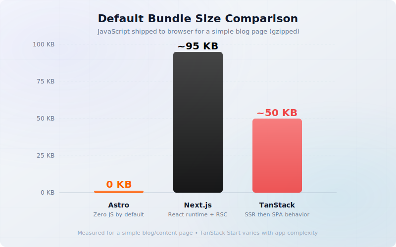
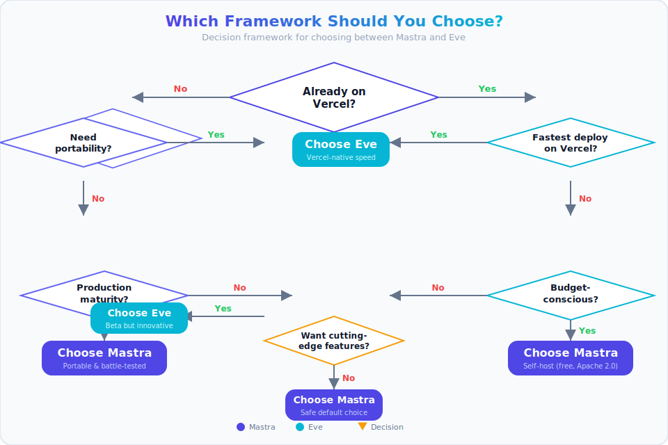

import Button from "@components/widgets/Button.astro";
import Notice from "@components/widgets/Notice.astro";
import ListCheck from "@components/widgets/ListCheck.astro";
import Accordion from "@components/widgets/Accordion.astro";
import Tabs from "@components/widgets/Tabs.astro";
import Tab from "@components/widgets/Tab.astro";

Stop asking "which framework is best." Start asking "what am I building."

The meta-framework space in 2026 has three clear contenders: **Astro** — content-first, zero-JS-by-default, now backed by Cloudflare. **Next.js** — the React full-stack workhorse, RSC-first, Vercel-optimized. **TanStack Start** — the new challenger, developer-control-focused, type-safe everything, Vite-powered.

Every existing comparison covers two of these. This is the first article to put all three side by side with real benchmarks, cost data, and a decision framework. No fanboy advocacy. No false winner.

<ListCheck>
**What you'll get from this article:**
- Real benchmark data across all three frameworks
- Hosting cost breakdowns at 10K, 50K, and 100K monthly visitors
- A decision framework based on project type, not hype
- Honest tradeoffs — each framework loses somewhere
</ListCheck>

## The state of meta-frameworks in 2026

The State of JS 2025 survey painted a clear picture. Astro leads meta-framework satisfaction by a 39-point margin over Next.js. Next.js still dominates usage at 60–70% adoption, but satisfaction is declining. TanStack Start appeared as a write-in option at roughly 4% — not bad for a framework that was still in beta during the survey — and won "Breakthrough of the Year" at the 2026 Open Source Awards.

Three things define the current moment:

### What changed since 2025

Cloudflare acquired The Astro Technology Company on January 16, 2026. Astro remains MIT-licensed and open-source, but now has corporate backing with deep pockets and edge infrastructure. This is the same dynamic Vercel has with Next.js, but on the other side of the aisle.

Next.js 16 shipped in October 2025 with Turbopack as the default bundler, Cache Components (`"use cache"`), React Compiler support, and a new `proxy.ts` replacing `middleware.ts`. Build speeds improved 2–5x over the previous Webpack-based toolchain.

TanStack Start hit v1 RC in September 2025. It's Vite-powered, type-safe by default, and deploys to anything via Nitro. The Inngest team reported an 83% reduction in local development times after migrating from Next.js.

<Notice type="info" title="The 2026 meta-framework scene at a glance">
Three frameworks backed by three different models: Astro → Cloudflare, Next.js → Vercel, TanStack Start → community. Each bet is valid. The question is which bet matches your project.
</Notice>

## Three frameworks, three philosophies

The choice isn't about features. It's about what each framework believes the web is. Astro bets the web is content — optimize for static delivery. Next.js bets the web is applications — optimize for React server rendering. TanStack Start bets the web is data — optimize for type-safe client-server communication.

These are fundamentally different bets, and the tradeoffs flow from them.

### Astro — content first, zero JS by default

Astro uses an islands architecture: pages ship as static HTML by default, and interactive components hydrate only where you explicitly mark them. A typical Astro blog ships 0KB of JavaScript to the browser. Zero.

The framework is also framework-agnostic. You can use React, Vue, Svelte, Solid, Preact, or Lit — even mix them on the same page. Content Collections provide structured, type-safe content management with Zod schemas (Zod 4 in Astro 6).

Astro 6 beta (January 2026) brings significant upgrades: the Vite Environment API for dev/prod parity, Live Content Collections for dynamic data, native CSP support, and build speeds 5x faster than Astro 5.

Notable users include Microsoft, Cloudflare, Digital Ocean, Adobe, Porsche, IKEA, OpenAI, and Google Chrome. You can [deploy an Astro blog on Cloudflare](/deploy-astrojs-cloudflare/) in minutes, and Astro's database layer is surprisingly capable — see how [Astro DB works with Bunny Database](/astro-db-bunny-database/).

<Tabs>
<Tab name="Quick start">
```bash
# Create a new Astro project
npm create astro@latest

# Build
npm run build
```
</Tab>
<Tab name="Island architecture">
```astro
---
import LikeButton from '../components/LikeButton.tsx';
import Comments from '../components/Comments.vue';
---
<article>
  <h1>My Blog Post</h1>
  <p>Static content here — zero JS shipped for this part.</p>
  <LikeButton client:load initialLikes={42} />
  <Comments client:visible postId="123" />
</article>
```
</Tab>
<Tab name="Astro 6 CSP config">
```js
// astro.config.mjs
import { defineConfig } from 'astro/config';
import cloudflare from '@astrojs/cloudflare';
import react from '@astrojs/react';
import tailwind from '@astrojs/tailwind';

export default defineConfig({
  output: 'static',
  adapter: cloudflare(),
  integrations: [react(), tailwind()],
  security: {
    csp: true,
  },
});
```
</Tab>
</Tabs>

### Next.js — the React full-stack default

Next.js is the 800-pound gorilla. At 140K+ GitHub stars and 60–70% meta-framework adoption, it's the default choice for React teams. The App Router, React Server Components, and streaming SSR are all designed to make full-stack React development feel cohesive.

Next.js 16 landed in October 2025 with meaningful improvements. Turbopack is now the default bundler (2–5x faster builds). Cache Components let you opt into caching with `"use cache"` directives instead of relying on the old implicit caching layers. The React Compiler support means automatic memoization in many cases. A new `proxy.ts` replaces the confusing `middleware.ts` pattern.

The pain points are real though. RSC boundaries remain the #1 source of confusion — understanding where code runs (server? client? both?) takes weeks to internalize. The App Router's patterns (layouts, `loading.tsx`, `error.tsx`, parallel routes, intercepting routes) are powerful but dense. And Vercel optimization means self-hosting is always second-class.

```tsx
// app/blog/[slug]/page.tsx
export default async function BlogPost({ params }: { params: { slug: string } }) {
  const post = await getPost(params.slug);
  return (
    <article>
      <h1>{post.title}</h1>
      <div>{post.content}</div>
    </article>
  );
}
```

Next.js 16 Cache Components config:

```ts
// next.config.ts
const nextConfig = {
  cacheComponents: true,
};
export default nextConfig;
```

### TanStack Start — developer control over convention

TanStack Start takes a different approach: client-first with explicit server capabilities. Instead of defaulting to server rendering and letting you opt into client behavior, it does the opposite. You start with a client-rendered React app and add server functions where you need them.

The key features are genuine differentiators. Type-safe file-based routing catches param errors at compile time. `createServerFn` makes server boundaries explicit — no guessing where code runs. Isomorphic loaders work with TanStack Query for efficient data fetching. Search param validation via Zod prevents runtime errors from malformed URLs.

Deployment is framework-agnostic: Vercel, Netlify, Railway, bare Node, Docker, Cloudflare Workers via Nitro presets. No vendor lock-in. You can even build a [TanStack Start todo app with Drizzle](/tanstack-start-bunny-database-drizzle/) to see it in action.

```tsx
import { createServerFn } from '@tanstack/react-start';
import { z } from 'zod';

export const createPost = createServerFn({ method: 'POST' })
  .validator(z.object({ title: z.string().min(1) }))
  .middleware([authMiddleware])
  .handler(async ({ data, context }) => {
    return db.posts.create({ title: data.title });
  });
```

Type-safe route with loader:

```tsx
export const Route = createFileRoute('/dashboard/')({
  loader: async () => {
    const data = await fetchDashboardData();
    return data;
  },
  component: DashboardPage,
});
```

## Performance and bundle size

How much JavaScript each framework ships by default has real consequences. Every kilobyte affects Time to Interactive, Core Web Vitals, and ultimately your SEO rankings and user retention.

### Default bundle sizes compared

Astro ships 0KB by default. Zero. Unless you explicitly add interactive islands, the browser receives pure HTML and CSS. For a typical blog page, that's it.

Next.js ships its React runtime plus page JavaScript. Even with React Server Components reducing what goes to the client, a simple blog page ships roughly 85–95KB gzipped. That's the baseline — it goes up from there as you add client components.

TanStack Start lands somewhere in between. The initial server-rendered response is fast (SSR), then the client takes over as a single-page app. The bundle size depends on your app's complexity, but the core runtime is leaner than Next.js because there's no RSC machinery to ship.



### Build speed benchmarks

Astro 6 processes 100 markdown posts in about 200ms — a 5x improvement over Astro 5's 1000ms. For large content sites, this transforms CI/CD pipelines. The [Astro 7 benchmark on a 743-page site](/astro-7-faster-builds/) shows even more dramatic gains with the Rust compiler.

Next.js 16 with Turbopack is 2–5x faster than the old Webpack builds. It's a massive improvement, though Turbopack still lags behind Vite for HMR speed.

TanStack Start uses Vite natively, which means near-instant HMR during development. Build times for production are competitive with Turbopack.

### Core Web Vitals in practice

For a content/blog site, the numbers are stark:

| Metric | Astro | Next.js | TanStack Start |
|--------|-------|---------|----------------|
| JS shipped | 0KB | ~95KB gzipped | App-dependent |
| Time to Interactive | &lt;100ms | ~1.4s | SSR fast, then SPA |
| Lighthouse score | 100/100 | ~94/100 | ~95-98/100 |

These are for simple content sites. As interactive island count grows in Astro, or as client components increase in the others, the gap narrows. But the baseline advantage is real.

<Notice type="warning" title="Benchmarks are context-dependent">
These numbers are for content/blog sites. Complex app benchmarks look very different. Astro's advantage shrinks as interactive island count grows — a dashboard with 20 React islands ships a lot more JS than a blog with zero.
</Notice>

You can [deploy Astro on a VPS](/deploy-astro-on-vps/) and see these scores immediately in production.

## Developer experience and learning curve

Performance numbers are measurable. DX compounds over months of daily development. The best framework on paper isn't best if your team fights it every sprint.

### Astro's mental model

Astro has the simplest mental model of the three: HTML + CSS + islands. The `.astro` file format uses frontmatter for logic and HTML-like template syntax for markup. If you know HTML, you can read an Astro file.

Framework agnosticism means your team isn't locked into React. A Vue developer can contribute Svelte components to the same Astro project. Content Collections give you type-safe content with schema validation — the best native DX for content management in any framework.

The caveat: once you need heavy interactivity, the island model adds coordination overhead. Islands can't easily share state. You end up managing inter-island communication yourself, which is where frameworks like Next.js and TanStack Start have natural advantages.

If you're learning Astro, check out the [best Astro.js courses](/best-astrojs-online-courses/) for structured learning paths.

### Next.js complexity tax

Next.js pays for its power with complexity. The RSC mental model — understanding the server/client boundary — is the #1 source of confusion for new and experienced developers alike. App Router patterns (layouts, `loading.tsx`, `error.tsx`, parallel routes, intercepting routes) are powerful but dense.

Caching has historically been the worst pain point. Multiple implicit caches with unintuitive invalidation rules. Next.js 16 improves this significantly with Cache Components and clearer APIs like `updateTag` and `revalidateTag`, but the learning curve is still steep.

The tradeoff: once you learn it, the ecosystem depth is hard to beat. More tutorials, more Stack Overflow answers, more third-party integrations, and the largest hiring pool of any meta-framework.

### TanStack Start type safety

TanStack Start feels closest to "plain React" with server capabilities bolted on. There's no new mental model to learn — it's React components, React hooks, and TanStack Query.

The real differentiator is type-safe routing. Compile-time param validation catches URL bugs before they hit production. `createServerFn` makes server boundaries explicit: you define a function, mark it as a server function, and the types tell you exactly what's available. No implicit boundaries, no guessing.

The tradeoff: smaller ecosystem, fewer tutorials, steeper initial setup if you're new to TanStack Query. Best fit for senior teams comfortable with thinner but well-designed primitives.

<Tabs>
<Tab name="Astro">
```astro
---
// Astro: data fetching in frontmatter
const posts = await fetch('https://api.example.com/posts')
  .then(r => r.json());
---
<ul>
  {posts.map(post => <li>{post.title}</li>)}
</ul>
```
</Tab>
<Tab name="Next.js">
```tsx
// Next.js: Server Component — async by default
export default async function PostsPage() {
  const posts = await fetch('https://api.example.com/posts')
    .then(r => r.json());
  return (
    <ul>
      {posts.map(post => <li>{post.title}</li>)}
    </ul>
  );
}
```
</Tab>
<Tab name="TanStack Start">
```tsx
// TanStack Start: route loader
export const Route = createFileRoute('/posts/')({
  loader: async () => {
    const posts = await fetch('https://api.example.com/posts')
      .then(r => r.json());
    return posts;
  },
  component: PostsPage,
});

function PostsPage() {
  const posts = Route.useLoaderData();
  return (
    <ul>
      {posts.map(post => <li key={post.id}>{post.title}</li>)}
    </ul>
  );
}
```
</Tab>
</Tabs>

## Ecosystem and community health

Ecosystem size matters for longevity. Satisfaction matters for daily happiness. Here's how the three stack up:

| Dimension | Astro | Next.js | TanStack Start |
|-----------|-------|---------|----------------|
| GitHub Stars | ~60.9K | ~140.6K | ~14.8K (Router) |
| State of JS Usage | ~25-30% | ~60-70% | ~4% write-in |
| Satisfaction (SoJS) | #1 (39pt lead) | Declining | N/A (too new) |
| Integrations | Growing (Tailwind, MDX, Strapi) | Massive (everything React) | Small but TanStack ecosystem |
| Hiring Pool | Small-medium | Very large | Small |
| Corporate Backing | Cloudflare | Vercel | Community + partners |

<Notice type="info" title="Ecosystem ≠ just star count">
Next.js has the largest ecosystem but Astro's satisfaction lead and Cloudflare backing suggest shifting momentum. TanStack's community is small but passionate — it mirrors where Next.js was in 2017 before it became the default. The "Breakthrough of the Year" award validates real community confidence.
</Notice>

## Cost analysis: hosting at scale

This is the section most framework comparisons skip. Hosting costs are the hidden decision factor — you pick a framework, build your app, and then discover your hosting bill at 50K visitors is $500/month.

### Static content sites (10K–100K visitors)

Astro static deploys are free at any scale. Cloudflare Pages, Netlify, GitHub Pages — all offer free tiers that handle 100K+ monthly visitors without blinking. Pre-rendered HTML is the cheapest thing to serve on the internet.

Next.js on Vercel Hobby ($0) works for small sites, but bandwidth and serverless function limits hit fast. Once you exceed the free tier, Pro starts at $20/month per user plus $20 usage credit. For a simple blog, that's overkill.

TanStack Start can be as cheap as Astro if your site is static-heavy. If you need SSR, standard Node hosting applies — $4–20/month on any VPS.

### Full-stack apps at scale

Here's where it gets expensive. Real-world Vercel pricing data from multiple sources:

| Monthly Active Users | Vercel Cost | Self-Hosted VPS |
|---------------------|-------------|-----------------|
| 10K | $0–50/month | $4–10/month |
| 50K | $230–1,180/month | $10–20/month |
| 100K | $560–2,250/month | $20–40/month |

<Notice type="warning" title="Vercel costs scale fast">
At 50K MAU you could be paying $1,180/month on Vercel Pro. A $20/month Hetzner VPS handles the same traffic. The convenience tax is real — factor this into your framework decision before you build.
</Notice>

Check [Hetzner Cloud pricing](/hetzner-cloud-cost-optimized-plans/) for concrete VPS cost data.

### Self-hosting and Docker

All three frameworks support Docker. The difference is how much the framework fights you.

**Astro**: Static files go anywhere — a CDN, a $4 VPS with Nginx, S3. SSR requires a Node adapter but is straightforward.

**Next.js**: Requires a Node server. Dockerfile from `next start`. Works on any VPS, but some features (image optimization, ISR, middleware) behave differently outside Vercel.

**TanStack Start**: Nitro outputs standard Node. Docker-friendly by design. No platform-specific behavior to worry about.

```dockerfile
# Generic Node Dockerfile — works for all three
FROM node:22-alpine
WORKDIR /app
COPY package*.json ./
RUN npm ci --only=production
COPY . .
RUN npm run build
EXPOSE 3000
CMD ["node", "dist/server.js"]
```

The PaaS middle ground: tools like Coolify, Railway, and Render offer Vercel-like convenience without the Vercel price tag. If you want one-click deploys on your own infrastructure, check [Coolify as a self-hosted alternative](/coolify-install-heroku-alternative/).

## The Cloudflare factor: what Astro's acquisition means

Cloudflare acquired The Astro Technology Company on January 16, 2026. Astro remains MIT-licensed and open-source — that's confirmed in the announcement. But the implications are worth examining.

Cloudflare's incentive is clear: make Astro the best framework on Cloudflare Pages and Workers. This mirrors Vercel's relationship with Next.js. We're heading toward a duopoly: Vercel-optimized vs Cloudflare-optimized.

The risk: will Astro become Cloudflare-first the way Next.js is Vercel-first? Will platform-specific features create soft lock-in?

The reassurance: Astro's island architecture and framework-agnostic philosophy are inherently platform-neutral. Unlike Next.js, which is deeply tied to Vercel's infrastructure (edge functions, image optimization, ISR), Astro's static-first approach means the output is just files. Files go anywhere.

Cloudflare's investment likely means faster development, better edge deployment, more resources, and tighter integration with Workers. For the Astro community, this is a net positive — as long as you keep deploying to non-Cloudflare platforms too.

<Notice type="info" title="The corporate backing dynamic">
Vercel → Next.js: deep integration, but vendor lock-in risk. Cloudflare → Astro: same dynamic, different platform. Community → TanStack Start: no corporate sugar daddy, but maximum independence. Each model has tradeoffs.
</Notice>

You can [deploy an Astro blog on Cloudflare](/deploy-astrojs-cloudflare/) today to see the integration in practice.

## Is TanStack Start production-ready?

The elephant in the room. TanStack Start has been in v1 RC since September 2025 — still not "stable" by semver standards. So can you ship real products on it?

Yes, with caveats. Multiple production SaaS apps run on TanStack Start today. MakerKit ships their SaaS starter on it. Appwrite documented their migration from Next.js. The "Breakthrough of the Year" award at the 2026 Open Source Awards validates community confidence beyond hype.

Key considerations:

<ListCheck>
**TanStack Start production readiness:**
- Type-safe routing — production-ready
- Server functions (`createServerFn`) — production-ready
- Streaming SSR — production-ready
- Docker deployment — production-ready
- TanStack Query integration — battle-tested library
- RSC support — coming as non-breaking v1.x addition (Composite Components model)
- Large plugin ecosystem — not yet
- Enterprise hiring pool — not yet
</ListCheck>

Honest take: if you're a startup shipping fast with a senior team comfortable with TanStack primitives, TanStack Start is viable today. If you need enterprise hiring guarantees, a massive plugin ecosystem, or your team is mostly junior developers, wait 6–12 months for the ecosystem to mature.

## When to choose which framework

There is no universal winner. The right choice depends on what you're building, who's building it, and where it runs.



### Choose Astro when

You're building content sites: blogs, documentation, marketing pages, portfolios. Performance and Core Web Vitals are non-negotiable. You want minimal JavaScript. Your team uses multiple frameworks (React + Vue). Budget is tight — static hosting is free at any scale. You want the simplest mental model with the lowest learning curve.

### Choose Next.js when

You're building complex web applications: SaaS products, e-commerce platforms, dashboards. You need React Server Components, streaming, ISR. Your team is React-only and values ecosystem depth. Vercel deployment is acceptable or preferred. You need the largest hiring pool for scaling your engineering team.

### Choose TanStack Start when

You're building applications with complex client-side state. The RSC mental model creates friction for your team. Type-safe routing is a priority. You want deploy-anywhere flexibility without vendor lock-in. Your team has senior engineers comfortable with thinner but well-designed primitives. You're already invested in the TanStack Query/Router ecosystem.

## Migration considerations

What if you pick wrong? Switching costs are real but manageable.

Astro to Next.js: moderate effort. Rewrite `.astro` templates as React components, adopt the RSC model, move static content logic into Server Components.

Next.js to Astro: moderate effort. Strip server logic, move interactivity into islands, convert App Router pages to Astro pages. Content-heavy sites migrate easier than app-heavy ones.

Next.js to TanStack Start: lower effort. Both are React, but routing patterns and server function approaches differ. You'll rewrite route definitions and replace RSC patterns with loaders + server functions.

TanStack Start to Next.js: moderate effort. Lose type-safe routing, adopt RSC patterns, restructure data fetching around Server Components.

<Notice type="success" title="The best migration is the one you don't need">
Choosing the right framework upfront saves weeks of refactoring. If you're 80% content, start with Astro — you can always add an SPA subdomain later. If you're 80% app, start with Next.js or TanStack Start. Use the decision framework above.
</Notice>

## FAQ

<Accordion label="Which framework is fastest for a typical content site?" group="faq" expanded="true">
Astro, hands down. A typical Astro blog ships 0KB of JavaScript, achieves Time to Interactive under 100ms, and scores 100/100 on Lighthouse out of the box. Next.js ships ~95KB gzipped for the same content, with TTI around 1.4 seconds. The difference is visible to users and to Google's Core Web Vitals.
</Accordion>

<Accordion label="Can TanStack Start realistically replace Next.js for a SaaS product?" group="faq">
Yes, if your team is comfortable with TanStack primitives and you don't need the Next.js ecosystem depth. Multiple SaaS products ship on TanStack Start today (MakerKit, Appwrite). The type-safe routing and explicit server functions are genuinely better DX for many teams. The gap is in ecosystem: fewer third-party integrations, fewer tutorials, smaller hiring pool.
</Accordion>

<Accordion label="Is Astro enough for a project that might grow into an app?" group="faq">
Yes, up to a point. Astro's islands let you add interactivity incrementally — drop in a React widget here, a Svelte component there. But if your project becomes 80%+ interactive, you'll feel the friction of island coordination overhead. At that point, a framework designed for apps (Next.js or TanStack Start) is the better foundation.
</Accordion>

<Accordion label="How do the three compare with a headless CMS?" group="faq">
All three work well with Strapi, Sanity, Contentful, and other headless CMSs. Astro's Content Collections have the best native DX for content fetching — type-safe schemas with Zod validation. Next.js integrates via Server Components and `fetch()`. TanStack Start uses route loaders with TanStack Query caching. All viable; Astro edges ahead on content-specific workflows.
</Accordion>

<Accordion label="What's the cheapest way to host a Next.js app?" group="faq">
Self-host on a Hetzner VPS ($4/month) with Docker. Build with `next build`, run with `next start` in a container. Skip Vercel Pro unless you specifically need their edge features or preview deployments. At 50K+ MAU, the cost difference between Vercel and a VPS is hundreds of dollars per month.
</Accordion>

<Accordion label="Is the Cloudflare acquisition good or bad for Astro?" group="faq">
Good for now. More resources, faster development, MIT license stays. The risk is soft lock-in to Cloudflare-specific features down the road. Mitigation: Astro's static-first output is inherently portable. Keep deploying to non-Cloudflare platforms to keep them honest.
</Accordion>

<Accordion label="When will TanStack Start be stable?" group="faq">
v1 RC has been out since September 2025. A stable release is expected in 2026 but no confirmed date. Production apps already run on the RC without issues. The TanStack Query and Router libraries underneath are battle-tested — it's the framework layer that's still maturing.
</Accordion>

## Verdict

There is no single winner. There are three strong frameworks for three different bets on the web.

**Astro** wins for content sites. Zero JS by default, best Core Web Vitals, free hosting at any scale, and now Cloudflare backing. If you're building a blog, docs site, or marketing page, this is the obvious choice.

**Next.js** wins for complex React applications. The ecosystem depth, hiring pool, and RSC model are unmatched for teams building SaaS products, e-commerce platforms, or enterprise dashboards. Accept the Vercel optimization tax and the learning curve.

**TanStack Start** wins for developer control. Type-safe routing, explicit server boundaries, deploy-anywhere flexibility. Best for senior teams who want thin, well-designed primitives without vendor lock-in. Wait for ecosystem maturity if your team needs guardrails.

The meta-framework space is healthier than it's been in years. Real competition is driving real improvement across all three. Developers now have genuine choices.

<Button text="More dev tools articles" link="/categories/dev-tools/" variant="solid" color="blue" size="lg" icon="arrow-right" />
