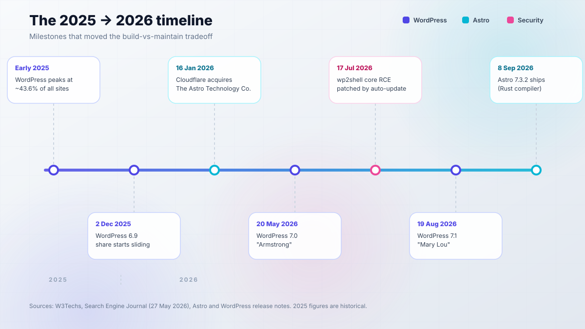
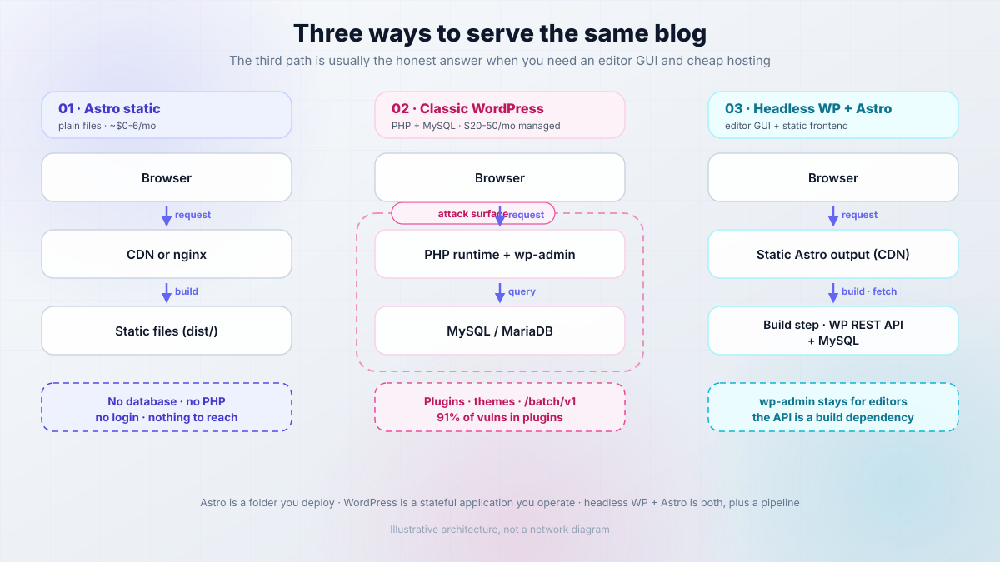
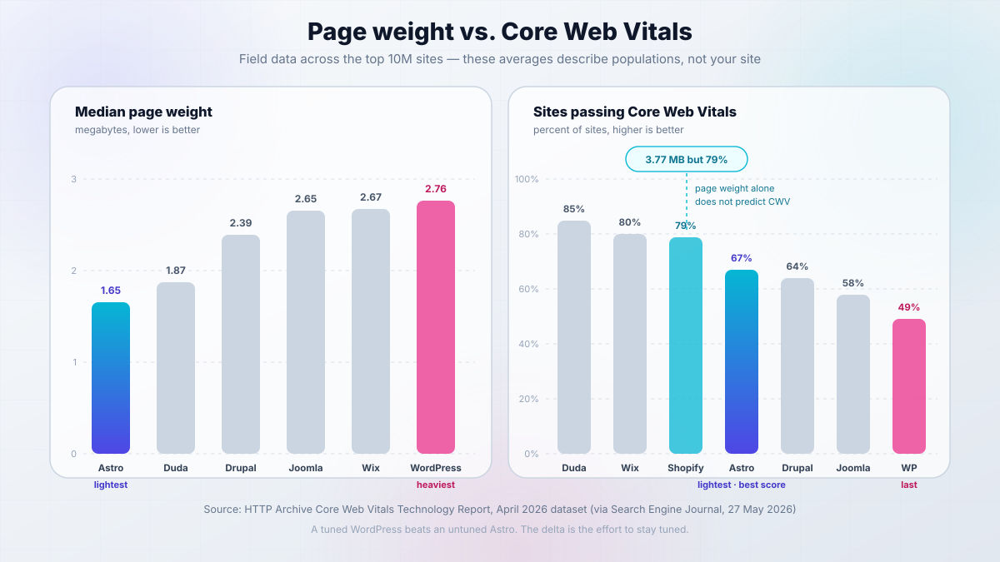
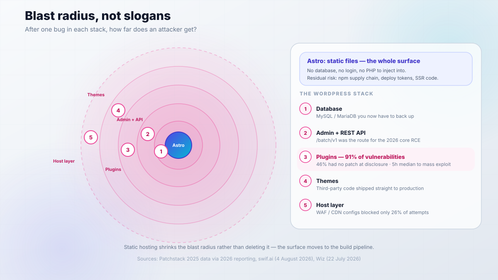
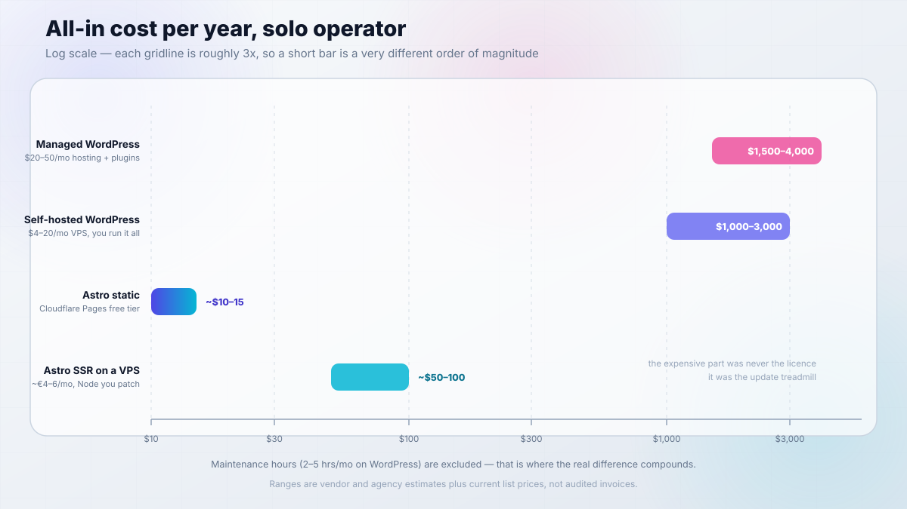
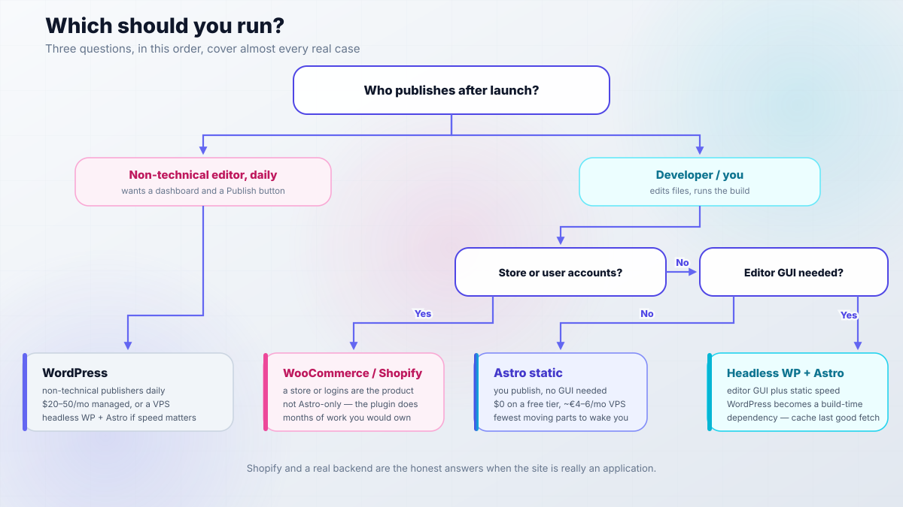

import Button from "@components/widgets/Button.astro";
import Notice from "@components/widgets/Notice.astro";
import ListCheck from "@components/widgets/ListCheck.astro";
import Accordion from "@components/widgets/Accordion.astro";
import Tabs from "@components/widgets/Tabs.astro";
import Tab from "@components/widgets/Tab.astro";

Here is the question that actually decides this, and it is not "which one is faster". It is: after you launch, who updates the site, and how often?

If the answer is "me, in a text editor, a few times a month", Astro wins on nearly every axis that matters to an operator: cost, attack surface, and how many moving parts can wake you up. If the answer is "a non-technical colleague who expects a dashboard, a media library, and a Publish button", WordPress wins, and pretending otherwise means teaching someone Git against their will.

There are three options here, not two:

1. **Astro as a static site** - build produces plain files, nothing runs on the server.
2. **Classic WordPress** - PHP plus MySQL, wp-admin, plugin ecosystem, update treadmill.
3. **Headless WordPress plus Astro** - editors keep wp-admin, visitors get static pages built at deploy time.

Most comparisons ignore the third one, which is usually the honest answer when you need both an editor GUI and cheap, fast hosting.

Two numbers anchor everything below. WordPress still runs **40.7% of all websites** and **58.9% of sites with a known CMS** (W3Techs, September 2026), so this is not a "WordPress is dead" piece. But its share has fallen for six straight months since its early-2025 peak (Search Engine Journal, 27 May 2026), which is the first sustained decline on record. Meanwhile **Astro 7.3.2** shipped on 8 September 2026, and the framework project now sits inside Cloudflare (acquisition announced 16 January 2026) while staying MIT-licensed and open governance.

What this article is not: a migration tutorial. I already published the [WordPress to Astro migration guide](/wordpress-to-astro-migration/) covering the export, the Markdown conversion, and the redirects. This is the decision layer above it. Every number below carries a source and a date, so you can check whether it still holds when you read it.

<ListCheck>
<ul>
<li>Core Web Vitals field data (HTTP Archive, April 2026 dataset), not vibes</li>
<li>An all-in cost table for one operator, monthly and yearly</li>
<li>Security compared by blast radius, including WordPress core's 2026 pre-auth RCE</li>
<li>The pragmatic third path: headless WordPress plus Astro</li>
<li>Shortest viable setup for each path, with verify steps and rollback</li>
<li>A decision tree you can run in 60 seconds</li>
</ul>
</ListCheck>

## The 2026 landscape: what actually changed

Three shifts matter, and each has a date attached.

**1. WordPress market share flipped direction.** Historical context first, because a lot of "2025" numbers are still circulating as current: WordPress peaked somewhere around 43.6% of all websites in early 2025. By December 2025 it was at 43.20%, and by 27 May 2026 it was 41.90% - six consecutive monthly drops (Search Engine Journal, 27 May 2026; The Register, 3 June 2026). As of September 2026, W3Techs puts it at 40.7% of all websites, still more than seven times the next CMS (Shopify at 5.3%). Version distribution tells you something about the install base too: roughly 68% of sites are on the 7.x line, ~25% on 6.x, and about 1.7% still on 4.x or older.

**2. Cloudflare bought The Astro Technology Company.** Announced 16 January 2026. The detail that matters for your decision is what did *not* change: Astro remains open source under an MIT license with open governance, and the code still deploys anywhere, from Cloudflare Pages to a €4/mo VPS to a GitHub Pages repo. Cloudflare also acquired VoidZero (the Vite and Rolldown people) on 4 June 2026, which is a strong hint about where the build tooling is heading.

**3. Astro 7 shipped with a Rust compiler.** Astro 7.0 landed in June 2026 with a Rust-based compiler, Vite 8, Advanced Routing, and route caching. The published benchmarks on a MacBook Pro M4 Pro are worth quoting because they explain the upgrade pressure: docs.astro.build (6,313 pages) went from 114.54s to 73.53s, astro.build (308 pages) from 62.70s to 24.24s, and developers.cloudflare.com (8,431 pages) from 386.89s to 261.94s. That is a 15-61% build speedup depending on page count. If you want to know why that matters operationally, the [Astro 7 faster builds](/astro-7-faster-builds/) breakdown goes deeper.

On the WordPress side, the current stable line is **WordPress 7.1 "Mary Lou"** (19 August 2026), following 7.0 "Armstrong" (20 May 2026) and 6.9 (2 December 2025). WordPress 7.2 is expected around December 2026. Requirements as published on wordpress.org: **PHP 8.3+ recommended** (7.4 is the floor, don't), **MySQL 8.0+ or MariaDB 10.11+**.

<Notice type="info" title="The 2026 state in one paragraph">
WordPress is still the biggest CMS by a wide margin, but its share has been declining since early 2025. Astro is the rising content-first alternative, now funded by Cloudflare and still portable. The gap that actually decides your migration is not the Lighthouse score. It is operational: a build pipeline that produces static files versus a PHP runtime plus a plugin update treadmill.
</Notice>



### What the Cloudflare acquisition does (and doesn't) change

The obvious objection deserves a straight answer: is Astro now Cloudflare-locked?

No, not in any licensing or governance sense. Both the Astro and Cloudflare announcements say portability is preserved, the project keeps its open governance model, and you can still ship to Netlify, Vercel, Bunny, GitHub Pages, or a self-hosted nginx container. One caveat: GitHub's API reports the license field as `NOASSERTION` rather than `MIT`, because the license file is not in the exact format GitHub auto-detects. The announcement text says MIT. Read the LICENSE file yourself if the wording matters to your compliance review.

What the acquisition *does* change is momentum and ergonomics. Funding is less likely to be a problem. Cloudflare Pages and Workers integration will be the smoothest path, and the framework will likely grow features that assume Workers semantics. That is the same soft lock-in shape you see with Next.js leaning Vercel-first. It is convenient, not a trap, as long as you keep your output portable.

The cheap insurance: if you are running a content site, keep `output: 'static'` and stay adapter-agnostic. A static build has no runtime API to depend on, so moving hosts becomes a DNS change and a re-upload, not a rewrite. For side projects, I would frame it like this: I would happily rent a Hetzner box (see my [Hetzner Cloud review](/hetzner-cloud-review/)) and never think about platform-specific features, because for a blog none of them buy me anything I cannot do in a container.

<Notice type="warning" title="Watch for soft lock-in">
Cloudflare-first features are convenient, but they are the only part of Astro that is not portable. Keep the build static and the output standard, so hosting stays a swappable decision rather than a rewrite.
</Notice>

## What each of these actually is

This is an architectural choice, not a feature checklist. All three options can serve the same blog with the same URLs and the same content. What differs is where the rendering happens, what runs when a visitor hits the page, and who is responsible for keeping that machinery patched.

The fastest way to see it: put the three side by side.

<Tabs>
<Tab name="Astro static">

`npm run build` produces a `dist/` folder of HTML, CSS and JS. You upload it to a CDN, or serve it with nginx, or push it to Cloudflare Pages. There is no database, no login page, no PHP interpreter, and no runtime process to keep alive.

- **Cost:** $0 on a free tier, or ~€4-6/mo on a VPS you control
- **Fails when:** the build fails, or you publish a broken link
- **You own:** comments, forms, search, images, and every piece of logic

</Tab>
<Tab name="Classic WordPress">

PHP plus MySQL behind wp-admin. Editors log in, write, publish. The page is assembled on every request (then hopefully cached). Plugins and themes extend it, which is both the entire value proposition and the entire risk surface.

- **Cost:** $20-50/mo managed, or $4-20/mo self-hosted on a VPS plus your time
- **Fails when:** a plugin update breaks the site, or an instance gets popped
- **You own:** updates, backups, security posture, caching stack

</Tab>
<Tab name="Headless WP + Astro">

WordPress stays the CMS, but visitors never touch it. Astro fetches posts from the WordPress REST or GraphQL API at build time and ships static output to a CDN. Editors get wp-admin; visitors get files.

- **Cost:** WordPress hosting plus a static host, roughly $4-50/mo depending on how you run the CMS
- **Fails when:** the WordPress API is unreachable during a build
- **You own:** two systems, one build pipeline, and the API contract between them

Headless CMS options beyond WordPress are covered in [best headless CMS for Astro](/best-headless-cms-for-astro/) if you would rather not run WordPress at all.

</Tab>
</Tabs>



### WordPress: dynamic CMS, admin GUI, 71,000 plugins

WordPress in 2026 is a PHP application with a MySQL or MariaDB backend, an admin GUI that roughly 68% of its install base is running the current major on, and an ecosystem of **71,000+ free plugins** in the wordpress.org directory (some snapshots count nearer 30,000 actively maintained; adding CodeCanyon brings the practical total past 76,000) plus roughly 15,000 free themes and about 12,900 paid ones.

The ecosystem is the product. WooCommerce alone runs on **29.7% of online stores** (about 4.08 million live stores, 8.1% of all websites). Elementor, Yoast and Contact Form 7 each sit above 10 million installs. If your requirement is "there is probably a plugin for that", WordPress is the only serious answer in this comparison.

The trade is that you are operating a stateful application. PHP 8.3+ and MySQL 8.0+/MariaDB 10.11+ are the requirements to meet, and meeting them is the easy part. If you want the fast version of a WordPress site, the stack that actually delivers it is a caching layer plus a CDN, which is what [speed up WordPress with Cloudflare, Varnish and Redis](/speed-up-wordpress-with-cloudflare-varnish-and-redis/) walks through. Note what you just read: three additional moving parts to get the performance that static hosting has by default.

### Astro: static-first, islands, zero JS by default

Astro is a static-first framework. Pages are `.astro` components or Markdown/MDX in content collections. Interactive bits are "islands" that hydrate individually, so a blog post with one search box does not have to ship the JavaScript of a full app. Server rendering is available through adapters (`@astrojs/node`, Cloudflare, Netlify) when you need dynamic routes, but the default output is files.

Prerequisites are refreshingly small: **Node.js v22.12.0 or newer**, and specifically not an odd-numbered release. v23 is unsupported. You need no database, no PHP, no login system.

```bash
# scaffold a blog from the official template
npm create astro@latest -- --template blog

# build to dist/ and preview the result locally
npm run build
npm run preview
```

The honest limits, because they are the actual cost of the trade: there is no built-in comments, forms or site search. There is no media library GUI. Build times grow with page count, and incremental builds were still experimental as of Astro 7.2. You own all the logic, and the framework will not paper over a decision you did not make. The upside is that the deployment target is a folder. [Deploy an Astro blog for free](/build-astro-blog-free/) covers the zero-cost path end to end.

## Performance: the honest numbers

Everyone says "Astro fast, WordPress slow". That slogan is lazy, and the real data is more interesting, mostly because it includes evidence that complicates the story. Here are the field numbers, and then the counter-example that makes them useful.

### What the data actually says

The HTTP Archive Core Web Vitals Technology Report (April 2026 dataset, via Search Engine Journal, 27 May 2026) is field data from CrUX plus HTTP Archive across the top 10 million sites. That methodology matters: these are real user measurements on real sites, not a lab test on a clean demo install.

- **Median page weight:** Astro **1.65 MB** (lightest of the group), Duda 1.87 MB, Drupal 2.39 MB, Joomla 2.65 MB, Wix 2.67 MB, **WordPress 2.76 MB**, Shopify 3.77 MB.
- **Median Lighthouse audit score:** Astro **68** (highest), Wix 62, Duda 54, Drupal 48, Shopify 47, **WordPress 44**, Joomla 43.
- **Share of sites passing Core Web Vitals:** Duda ~85%, Wix ~80%, Shopify ~79%, **Astro ~67%**, Drupal ~64%, Joomla ~58%, **WordPress ~49%**.



Two things to hold in your head at once. WordPress sites are the heaviest and the least likely to pass CWV among the major platforms. Astro sites are the lightest with the best median Lighthouse score, but pass CWV on only about two thirds of sites. Averages describe populations of sites, not your site.

### Why the gap is smaller than you think

The best evidence against the slogan is a migration write-up from mfyz.com (3 June 2025) that compared an Astro rebuild against a *heavily optimised* WordPress fronted by WP Rocket and Cloudflare edge cache:

- Performance score: **99.1 to 99.5** (+0.4)
- SEO score: **86 to 100** (+14)
- LCP: **0.81s to 0.44s**, TTFB: **83.1ms to 68.3ms**
- Resource size: HTML **-72%**, JS **-60.4%**, CSS **-90.2%**

Read the scores, then read the caveat the author states himself: a well-optimized WordPress can nearly match a static site. The measured gap on an already-tuned WordPress is small. The Shopify counter-example in the HTTP Archive data makes the same point from the other direction: Shopify sites carry the heaviest pages of any platform in that report and still pass CWV on about 79% of sites. Page weight alone does not predict Core Web Vitals.

So the useful framing is not "static is faster". It is: **the delta is small when WordPress is tuned, and the tuning is what you have to keep paying for.** Every plugin update, every theme change, every page-builder edit invalidates the cache and can move the numbers again. A static build's performance is the same after an edit as before it, because the output either built or it did not.

That difference shows up in the cost column too. Someone in a WordPress community I follow was quoted **$2,000** to fix Core Web Vitals on their site, and the scores broke again after the next content edit. Treat that as one anecdote, not a statistic, but it describes the shape of the problem accurately: you are not buying a fix, you are buying a service interval.

<Notice type="warning" title="Don't read these averages as predictions">
68 versus 44 is a comparison of two populations of sites. A tuned WordPress beats an untuned Astro every time. What you are really choosing is how much ongoing effort it takes to stay tuned, and who does that work.
</Notice>

If you want to keep a self-hosted Astro build lean, [Astro SSG build optimization](/astro-ssg-build-optimization/) is the practical companion to this section.

## Security: comparing blast radius, not slogans

"Astro has nothing to hack" is marketing, not fact. The useful question is: after one bug in each stack, what does an attacker reach?

For a static Astro site, the answer is static files, plus whatever the build pipeline can be tricked into shipping. For WordPress, it is a database, an authentication system, an admin API, and a plugin ecosystem where the majority of known vulnerabilities live. That is the entire difference in one sentence.



### WordPress: 91% of vulnerabilities are in plugins, 5 hours to exploitation

The numbers, from Patchstack's 2025 data as reported through 2026: **91% of WordPress vulnerabilities were in plugins**, **46% of those had no patch available at the time of disclosure**, and premium plugins were *more* exploited than free ones, not less. Whatever you paid for a license did not buy you a security review.

The timing is the part that should change your process. The median time from public disclosure to mass exploitation is around **5 hours** (swif.ai, 4 August 2026). Weekly plugin updates are structurally too slow for that window. It does not matter how disciplined you are about your Sunday patch ritual.

Hosting-layer defences are thinner than people assume. Patchstack's pentests found that common WAF and CDN configurations blocked only **26%** of exploit attempts in general, and **12%** of WordPress-specific attacks. A CDN in front of a vulnerable plugin is not a control, it is a speed bump.

### The core RCE that changed the conversation

The standard reassurance is "core is fine, only plugins are risky". That was already oversimplified, and in July 2026 it stopped being true.

**`wp2shell`, CVE-2026-63030**, was a **pre-authentication remote code execution flaw in WordPress core**, combining a REST batch-route confusion issue with SQL injection. It affected **6.9.0 through 6.9.4** and **7.0.0 through 7.0.1**, and was patched in **6.9.5 and 7.0.2 on 17 July 2026**, distributed via forced auto-updates (reported by Wiz, 22 July 2026; Wordfence, 29 July 2026; SOCRadar, 20 July 2026).

Credit where due: the fix came fast, and the forced auto-update mechanism did the right thing. The lesson is not "WordPress is broken". The lesson is that "core is safe" is a talking point, not a guarantee, and that you should verify your version rather than assume.

<Notice type="error" title="Check your WordPress version today">
If you are on 6.9.0-6.9.4 or 7.0.0-7.0.1, update to 6.9.5 or 7.0.2 or later (fixed 17 July 2026). If you cannot update yet, block anonymous access to `/batch/v1` at the proxy layer and treat the site as exposed.
</Notice>

### Astro's smaller surface, and its real risks

Static hosting has no database to exfiltrate, no login to brute force, and no PHP to inject into. That genuinely shrinks the blast radius, and it is the single strongest security argument for static.

But the surface shifts rather than vanishing, and it is worth naming the three places it moves to. First, the **npm supply chain**: a compromised build-time dependency ships straight into your production output, and you will never see a runtime log for it. Second, **CI and deploy credentials**: your GitHub token or Cloudflare API key has write access to the live site. Third, **your own application code**, if you go SSR and start handling sessions, cookies, or user input.

A static site is not secure by architecture. It is secure because there is less code, and the code that remains is code you wrote or reviewed. Keep dependency updates automatic, keep tokens scoped, and keep the deploy path auditable.

<ListCheck>
<ul>
<li>Core and plugins on auto-update, and read the changelog before you trust an update</li>
<li>Remove any plugin that has not been used in the last 30 days - unused plugins are unreachable surface, not zero surface</li>
<li>Two-factor authentication on every admin account, including the ones you forgot about - see <a href="/secure-wordpress-2fa/">secure WordPress with 2FA</a></li>
<li>Off-site backups you have actually restored from, not just taken - options in <a href="/best-free-wordpress-backup-plugins/">best free WordPress backup plugins</a></li>
<li>Restrict anonymous access to <code>/batch/v1</code> if you cannot patch the moment a core advisory lands</li>
</ul>
</ListCheck>

## Total cost of ownership for a solo operator

This is usually why people read these articles. Most comparisons stop at the hosting line item, which is the smallest part of the number. The real total includes plugins, security tooling, cleanup incidents, and the hours you spend maintaining the thing.

<Notice type="info" title="How to read these numbers">
These are vendor and agency estimates plus current hosting list prices, not audited invoices from anyone's books. Treat them as ranges for order-of-magnitude decisions, and re-check current pricing before you commit budget.
</Notice>

### The monthly reality

WordPress hosting, as listed by the hosting industry: shared **$5-15/mo**, managed **$20-50/mo**, premium managed **$50-200+/mo** (1123interactive, 22 January 2026). Managed WordPress on a platform like [Cloudways](https://go.bitdoze.com/cloudways) sits in that middle band and removes some of the server work, which is exactly what you are paying the premium for.

Static Astro hosting is **$0** on Cloudflare Pages, Netlify, Vercel, or GitHub Pages. A VPS where you control everything runs about **€4/mo** on Hetzner-class hardware, or **$4-20/mo** if you self-host WordPress instead (and then you also own the MySQL backups, the PHP upgrades, and the firewall).

Here is the full comparison, including the lines nobody puts in a pricing page.

| Item | WordPress (managed) | WordPress (self-hosted VPS) | Astro (static, free tier) | Astro (SSR on VPS) |
|---|---|---|---|---|
| Hosting | $20-50/mo | $4-20/mo VPS | $0 | ~$4-6/mo VPS |
| DB / runtime | included | MySQL + PHP you manage | none | Node you manage |
| Security surface | large | large | near-zero (no DB, no login, no PHP) | small (no DB) |
| Maintenance | 2-5 hrs/mo | 2-5 hrs/mo plus server | ~0 | server patches + Node |
| Plugins and themes per year | $300-800 | $300-800 | $0 | $0 |
| Attack targets | plugins, admin, `/batch/v1` | same | static files only | your app code |
| Typical all-in per year | $1,500-4,000 | $1,000-3,000 | domain only (~$10-15) | ~$50-100 |

For the VPS rows, the hosts I actually keep on a shortlist: [Hetzner Cloud from about €4/mo](https://go.bitdoze.com/hetzner) for the reference cheap EU box, or [Hostinger KVM VPS](https://go.bitdoze.com/hostinger-vps) if you want NVMe on a budget plan. If you need presence in a specific region, [Vultr](https://go.bitdoze.com/vultr) and [DigitalOcean Droplets](https://go.bitdoze.com/do) are the other two I would consider. If you are comparing plans rather than providers, [Hetzner cost-optimized plans](/hetzner-cloud-cost-optimized-plans/) and [DigitalOcean vs Vultr vs Hetzner](/digitalocean-vs-vultr-vs-hetzner/) go into the details, and [PHP cloud hosting options](/php-cloud-hosting/) covers the WordPress side specifically.

_VPS prices jumped across the board in 2026 — if you're rethinking a rented box, see [what changed and when a mini PC wins](/vps-price-increases/)._



### The hidden costs nobody quotes

The hosting invoice is not the interesting number. These are:

- **Plugins and themes: $300-800/yr.** Premium plugin licenses renew annually and stack fast once you add a form plugin, an SEO plugin, a caching plugin, and a page builder.
- **Security plugins: $100-300/yr.** You are paying a subscription to detect a class of problem that static hosting does not have.
- **Malware cleanup: $200-500 per incident.** Per incident. If the site gets cleaned and reinfected through the same abandoned plugin, you pay twice.
- **Maintenance: 2-5 hrs/mo**, or **$100-300/mo** if you outsource it. That is the honest cost of the treadmill, and it is the line most comparisons omit entirely.
- **All-in for a typical site owner: $1,500-4,000/yr.**

Compare that to a static Astro site: the domain is roughly $10-15/yr, plus optional CDN storage and bandwidth. The expensive part was never the licence. It was the maintenance.

On the caching layer: a static Astro build is already cache-friendly, but if you are fronting a lot of image or asset traffic, [Bunny.net](https://go.bitdoze.com/bunny) is cheap edge bandwidth and works for either path, including sitting in front of an optimised WordPress.

### The "free tier is free" caveat

Free static hosting is genuinely production-grade. I am not going to pretend otherwise. But "free" tiers are metered on two axes you should check before committing: **build minutes** and **bandwidth**.

That matters for a specific pattern. A content site with a headless CMS that triggers a rebuild on every published post can burn build minutes fast, and a site with heavy images or video can burn bandwidth. When you hit either ceiling, the upgrade is usually a paid plan or a small VPS.

The heuristic I would use: a personal blog on a stable publishing cadence fits a free tier comfortably. A high-traffic marketing site with frequent rebuilds, or a team publishing dozens of posts a week, is better served by a €4-6/mo VPS running nginx, where you own the limits instead of renting them.

**Measure your build volume before you commit.** Check the current build-minute and bandwidth caps on whichever platform you pick, since those numbers move.

## Ops burden: who maintains this at 2 AM?

This is the section that decides most real-world cases. Two very different jobs: an update treadmill where the site stays up but the surface keeps changing, versus a build pipeline where the site is static but the toolchain moves.

### The WordPress update treadmill

A realistic cadence for a self-hosted WordPress site:

- **Weekly:** check for plugin and core updates, read advisories, patch anything with an active exploit.
- **Monthly:** apply core and plugin updates with a backup taken first, then verify the site renders.
- **Quarterly:** audit the plugin list, remove anything unused, confirm a backup actually restores.
- **Annually:** a major-version upgrade that will break something, usually a page builder or a plugin that has not kept up.

There is seasonal risk on top of that. Monarx observed malicious uploads to WordPress sites nearly **triple** between November and December 2025, which fits the holiday-season pattern everyone in hosting sees. Q4 is not the month to skip patch cycles.

The compounding problem is page-builder lock-in. Elementor and Divi store layout as their own markup inside post content, so "just swap the theme" becomes a full rebuild, and caching plus a page builder means Core Web Vitals can regress on every content edit. You are not maintaining a website. You are maintaining a website plus a layout engine plus a caching stack, and each can invalidate the others.

Set that calendar against the Astro one and the asymmetry is obvious. If you are self-hosting WordPress in Docker and want part of this automated, [Tugtainer for Docker auto-updates](/tugtainer-docker-autoupdate/) handles container image updates, which takes care of the base layer but not the plugin layer inside the volume.

### The Astro build pipeline

What you actually maintain with Astro static: the Node version, the dependency tree, the build in CI, and the deploy target. That is it. In practice this is close to zero hours in a normal month.

The recurring work is upgrades, and there is one footgun worth knowing before you hit it. **Astro 7's Rust compiler is strict.** It no longer silently corrects malformed HTML, so unclosed tags now produce a build error where older versions guessed at your intent. That is a good change, and it means a migration from an older Astro project or a copied template can fail loudly on markup that used to render fine.

The second change is subtler. Consecutive inline elements no longer get implicit whitespace:

```astro
<!-- renders "HelloWorld" in Astro 7 -->
<span>Hello</span>
<span>World</span>

<!-- explicit space, renders "Hello World" -->
<span>Hello</span>{' '}
<span>World</span>
```

Both of these are migration friction, not fragility. Your build tells you what broke, at build time, which is the exact property you want.

<Tabs>
<Tab name="WordPress calendar">

- **Weekly:** plugin and core update checks, advisory reads
- **Monthly:** core plus plugin updates with a backup first
- **Quarterly:** plugin audit, restore test, CWV re-check
- **Annually:** major-version upgrade, expect one rebuild of something

</Tab>
<Tab name="Astro calendar">

- **Monthly:** `npm audit` plus dependency bumps (Renovate or Dependabot can do this for you)
- **Quarterly:** Node LTS check - stay on even-numbered LTS releases
- **Annually:** major framework upgrade, usually an afternoon

</Tab>
</Tabs>

### What you lose leaving WordPress

Plainly: you lose **comments** (Giscus or Hyvor, both third-party JavaScript), **forms** (an external form service or a serverless function), **site search** (Pagefind or an external index), and the **media library GUI**. You also lose "there's a plugin for that". Every feature becomes a decision, an implementation, and something else to maintain.

For the most common missing piece, [add a contact form to static websites](/add-contact-form-static-websites/) covers the options, with an Astro-specific version at [add a contact form in Astro](/add-contact-form-astro/). If you are keeping the WordPress side self-hosted, [install WordPress with Docker](/install-wordpress-docker/) is the starting point.

If the answer to "who publishes after launch" is a non-developer, that list is the real bill. Not the hosting cost: the training and the tooling.

## The hybrid: headless WordPress plus Astro

Here is the pragmatic middle, and it is the configuration I recommend most often when someone genuinely needs both an editor GUI and fast static pages. Editors keep wp-admin exactly as it is. Astro fetches content from WordPress at build time and ships static files. Visitors never hit PHP.

The trade is honest and worth stating up front: you now run **two systems**, and one of them is a **build-time dependency**. You have not removed WordPress from your life. You have removed it from the visitor's request path, which shrinks the blast radius but does not eliminate it. If WordPress gets popped, the attacker gets your content database.

### REST or WPGraphQL?

Two ways to pull content in.

The **WordPress REST API** is built in. No extra plugins, endpoints at `/wp-json/wp/v2/`, and it is fine for a blog: fetch posts, render them, done.

**WPGraphQL** (or Gato GraphQL) gives you one typed query that returns exactly the fields you need, which matters once templates start composing multiple content types and you are tired of guessing at `_embedded` shapes.

<Tabs>
<Tab name="REST API">

```ts
// src/pages/blog/index.astro
const API = "https://cms.example.com/wp-json/wp/v2/posts";

const res = await fetch(
  `${API}?_embed&_fields=id,slug,title,excerpt,date,_embedded`
);
if (!res.ok) throw new Error(`WordPress API returned ${res.status}`);

const posts = await res.json();
```

Two query parameters do the heavy lifting: `_embed` pulls featured media into the response so you avoid a second round trip per post, and `_fields` trims the payload down to what you render. A default `/wp/v2/posts` response is far bigger than a listing page needs, and that weight lands in your build.

```ts
// rendering the featured image from the embedded payload
const img = post._embedded?.["wp:featuredmedia"]?.[0]?.media_details?.sizes?.medium?.source_url;
```

Note the optional chaining. A post with no featured image will otherwise throw during the build, and one bad post can fail the whole deploy.

</Tab>
<Tab name="GraphQL (WPGraphQL)">

```graphql
query LatestPosts($first: Int!) {
  posts(first: $first, where: { status: PUBLISH }) {
    nodes {
      slug
      title
      date
      excerpt
      featuredImage {
        node {
          sourceUrl
          altText
        }
      }
    }
  }
}
```

```ts
const res = await fetch("https://cms.example.com/graphql", {
  method: "POST",
  headers: { "Content-Type": "application/json" },
  body: JSON.stringify({ query, variables: { first: 10 } }),
});
const { data, errors } = await res.json();
if (errors) throw new Error(JSON.stringify(errors));
```

GraphQL returns `200 OK` with an `errors` array for many failures, so check that array explicitly. Trusting the status code alone is a common way to ship an empty site.

</Tab>
</Tabs>

The rule of thumb: REST for a straightforward blog, GraphQL once you are composing complex pages or multiple post types into one template. Both require the WordPress site to be reachable at build time, which brings us to the footgun.

### The build-time dependency footgun

This is the single biggest trap in the hybrid setup. If the WordPress API is unreachable when your build runs, your deploy either fails or ships stale content. Your CMS has become a build dependency with the same availability expectations as a production service.

Four mitigations that actually work:

1. **Treat API uptime as production-critical.** If it goes down during your nightly build window, you get no deploy.
2. **Cache the last good fetch.** Write the API response to disk or object storage during the build, and fall back to it when the API call fails. The build succeeds with slightly stale content instead of not at all.
3. **Add a fallback for featured media.** Missing `_embedded` data should degrade to a placeholder, not throw.
4. **Prefer scheduled rebuilds over on-demand single-post builds.** A nightly rebuild is one failure domain. Webhook-per-publish turns every new post into a deploy that can fail.

One more thing to keep in mind: WordPress is still a live target even though visitors never touch it. You have reduced the blast radius, not removed it, so the security and maintenance sections above still apply to that instance in full.

<Notice type="warning" title="Your CMS is now a build dependency">
A headless CMS that is down at build time is a failed deploy. Cache the last good response, monitor the API, and treat its uptime as part of your production surface.
</Notice>

## Self-hosting both paths: setup, verify, rollback

This is the shortest viable operator path for each option, not a full tutorial. The deploy layer is all that is covered here; root-level installs, TLS provisioning, and firewall rules belong in the linked guides. Every step has a verify command, because "it started" and "it works" are different claims.

### What you need before you start

<ListCheck>
<ul>
<li><strong>Astro path:</strong> Node.js <strong>v22.12.0+</strong> (avoid v23), Git, a code editor; either a host account or a VPS with Docker; ports <strong>4321</strong> (SSR with the Node adapter) or <strong>80/8080</strong> (nginx serving static files)</li>
<li><strong>WordPress path:</strong> PHP <strong>8.3+</strong>, MySQL <strong>8.0+</strong> or MariaDB <strong>10.11+</strong>, <strong>2 GB RAM minimum</strong>, an admin account, and a planned TLS plus backup routine</li>
<li><strong>Hybrid:</strong> an existing WordPress site with the REST API enabled at <code>/wp-json/wp/v2/</code> or WPGraphQL installed, and that site reachable at build time</li>
<li><strong>Both:</strong> domain and DNS access, an SSH key, and a rollback plan you have written down</li>
</ul>
</ListCheck>

### Astro: static on a VPS or Cloudflare Pages

Two variants, and you can pick either without changing the framework.

**Variant A - static build, served anywhere.** This is the default and the one I would start with.

```bash
npm create astro@latest -- --template blog
cd my-blog
npm install
npm run build

# confirm the build actually produced output before you deploy anything
ls -la dist/index.html
```

Then either upload `dist/` to Cloudflare Pages (`npx wrangler pages deploy dist`), push it to Bunny or GitHub Pages, or serve it with nginx on your own box. Multi-stage Dockerfile for the nginx route:

```dockerfile
FROM node:lts AS build
WORKDIR /app
COPY package*.json ./
RUN npm install
COPY . .
RUN npm run build

FROM nginx:alpine AS runtime
COPY ./nginx/nginx.conf /etc/nginx/nginx.conf
COPY --from=build /app/dist /usr/share/nginx/html
EXPOSE 8080
```

**Variant B - SSR with the Node adapter.** Use this only if you need dynamic routes.

```bash
npx astro add node
```

```dockerfile
FROM node:lts AS runtime
WORKDIR /app
COPY . .
RUN npm install
RUN npm run build
ENV HOST=0.0.0.0
ENV PORT=4321
EXPOSE 4321
CMD ["node", "./dist/server/entry.mjs"]
```

**Verify:**

```bash
docker compose ps                          # container state should be Up, not Restarting
curl -I http://127.0.0.1:4321              # 200, content-type: text/html
curl -I https://yourdomain                 # 200 through the proxy, same content-type
docker compose logs --tail 50 astro        # no unhandled build or runtime errors
```

**What broken looks like:** `npm run build` exits clean but `dist/index.html` is missing means your output directory was configured elsewhere. A `200` on the internal port but a `502` through the proxy means the reverse proxy cannot reach the container, usually a wrong `HOST` or `PORT` value. A stale page after a successful build usually means nginx is serving an old `dist/` mount, not the freshly built output.

**Common failures:** Node version mismatch (odd-numbered releases like v23 are unsupported and the error messages are not always obvious); **port 4321 already in use** - check with `lsof -i :4321` or `ss -ltnp | grep 4321`; `nginx.conf` referenced in the Dockerfile but not copied into the build context.

For the full walkthrough on either target: [deploy Astro on a VPS](/deploy-astro-on-vps/), [deploy Astro to Cloudflare Pages](/deploy-astrojs-cloudflare/), or [deploy Astro on Bunny.net](/deploy-astro-bunny-net/).

### WordPress: Docker Compose on a VPS

**2 GB RAM minimum.** A 1 GB instance will OOM on a realistic plugin set once MySQL and PHP are both resident.

```yaml
services:
  db:
    image: mysql:8.0
    restart: unless-stopped
    environment:
      MYSQL_DATABASE: wordpress
      MYSQL_USER: wordpress
      MYSQL_PASSWORD: ${MYSQL_PASSWORD:?set MYSQL_PASSWORD in .env}
      MYSQL_ROOT_PASSWORD: ${MYSQL_ROOT_PASSWORD:?set MYSQL_ROOT_PASSWORD in .env}
    volumes:
      - db_data:/var/lib/mysql
    healthcheck:
      test: ["CMD", "mysqladmin", "ping", "-h", "127.0.0.1", "-p${MYSQL_ROOT_PASSWORD}"]
      interval: 10s
      timeout: 5s
      retries: 10

  wordpress:
    image: wordpress:php8.3-apache
    restart: unless-stopped
    depends_on:
      db:
        condition: service_healthy
    environment:
      WORDPRESS_DB_HOST: db:3306
      WORDPRESS_DB_USER: wordpress
      WORDPRESS_DB_PASSWORD: ${MYSQL_PASSWORD}
      WORDPRESS_DB_NAME: wordpress
    volumes:
      - wp_data:/var/www/html
    ports:
      - "127.0.0.1:8080:80"

volumes:
  db_data:
  wp_data:
```

Two deliberate choices there. Both services sit behind a reverse proxy rather than binding to the public interface (`127.0.0.1:8080:80`), and the `healthcheck` plus `depends_on: condition: service_healthy` stops WordPress from booting against a half-initialised MySQL, which is the source of a very confusing "Error establishing a database connection" on first run. For the proxy layer, use the existing [Traefik reverse proxy with Docker](/traefik-proxy-docker/) setup rather than inventing one. If you would rather not hand-roll nginx or Traefik at all, [Coolify](/coolify-install-heroku-alternative/) and [Dokploy](/dokploy-install/) both manage this layer for you.

**Verify:**

```bash
docker compose ps                                  # every service Up
curl -I https://yourdomain/wp-login.php             # 200
curl -s https://yourdomain/wp-json/ | head -c 200   # valid JSON, not an HTML error page
docker compose logs -f wordpress                    # watch for DB connection errors during boot
```

Then open wp-admin and confirm **Settings > General** shows your real domain for both WordPress Address and Site Address. Mismatched URLs cause redirect loops that look like a proxy problem but are not.

**Common failures:** database connection refused (wrong host, or MySQL still initialising - the healthcheck above prevents this); **stale volumes after changing DB credentials** (the volume retains the old password and WordPress will fail forever until you wipe and re-initialise); a different **Docker Compose project name** than the one that created the containers, so `docker compose down` removes nothing; permalinks 404 after a proxy change (re-save permalink settings); OOM on a 1 GB instance; TLS renewal failures from the proxy layer rather than the app.

**Rollback and undo:**

```bash
docker compose down       # stop and remove containers, keep volumes and data
docker compose down -v    # destroy containers AND volumes - data is gone
```

For Astro, rollback means redeploying the previous commit. Keep the last known-good build output or a tagged image so reverting is one command, not a rebuild under pressure.

<Notice type="error" title="down -v destroys your database">
`docker compose down -v` deletes the named volumes, which includes your entire MySQL data directory. Restore-test your backups before you need this command, not after. Keep the old build output around too.
</Notice>

A VPS at roughly **€4-6/mo** is the reference box for both paths. That is what I use for self-hosted work ([Hetzner Cloud](https://go.bitdoze.com/hetzner)), and it comfortably serves a static Astro site; the WordPress path wants 2 GB or more. For ARM hardware, [install WordPress on Ubuntu ARM](/install-wordpress-on-ubuntu-arm/) covers the variant.

## If you do migrate, the short version

The full process lives in the [WordPress to Astro migration guide](/wordpress-to-astro-migration/), so this is the outline rather than the instructions.

1. **Export** WordPress content as XML, then convert it to Markdown with images downloaded locally:

   ```bash
   npx wordpress-export-to-markdown
   ```

2. **Reconcile frontmatter.** Your old posts have no `description`, no `tags`, and inconsistent titles. This is the tedious part, and it is where coding agents actually earn their keep.
3. **Build the redirect map.** Every URL that changes needs a 301. [Export WordPress post URLs and titles](/export-wordpress-post-urls-titles/) is how you generate that list before you touch anything.
4. **Keep the old site live until the new one is verified.** Both of them, simultaneously. Do not delete the WordPress install on the day you flip DNS.
5. **Crawl and diff.** Compare old URLs to new URLs and check that internal links survived. Then watch Search Console for a couple of weeks.

Two warnings that matter more than the mechanics. First, expect a ranking **dip of roughly two weeks** even when you do everything right; that is normal re-evaluation, not failure. Second, the real risk is **internal link parity**, not the Lighthouse score. Losing internal links silently drops the value passed between your pages, and it shows up as a mysterious ranking slide weeks later, long after you have stopped looking at the migration.

<Button text="Read the full migration guide" link="/wordpress-to-astro-migration/" variant="solid" color="blue" size="lg" icon="arrow-right" />

## When WordPress is still the right answer

Four cases where WordPress is not a compromise. Arguing only one side of this would make the whole article useless.

**1. WooCommerce at scale.** WooCommerce runs 29.7% of online stores, and the admin experience for orders, refunds, stock, shipping, and taxes is genuinely mature. Astro can do commerce, but only headless commerce plus integration work: you would be building the storefront and gluing it to a commerce backend. Unless the storefront experience is your differentiator, that is effort spent on undifferentiated plumbing. The [WooCommerce admin dashboard walkthrough](/woocommerce-admin-dashboard/) shows what you would be rebuilding.

**2. Memberships and user accounts.** WordPress does authenticated users natively. Astro does not, at all. If you need accounts, gated content, or subscriptions, you are either running WordPress or standing up a real backend with an auth provider. Static files cannot log anyone in.

**3. Non-technical daily publishers.** If the person publishing cannot and will not run `git commit`, then wp-admin is not a downgrade, it is the requirement. Teaching a marketing colleague a build pipeline is a recurring cost that never really goes away, and it fails the first time you are on holiday. This is the case where WordPress wins decisively and the performance argument stops mattering.

**4. Hard plugin dependencies.** If a booking plugin, an LMS, or a directory plugin is the reason the site exists, that is a reason to stay, not a failure of judgment. The plugin is doing months of work you would otherwise own. Run the security section above properly and move on.

For the page-builder path specifically, [Breakdance](https://go.bitdoze.com/breakdance) is what I would point a non-technical editor at, and the [Breakdance builder review](/breakdance-builder-review/) covers the tradeoffs honestly, including the markup lock-in that comes with any builder.

<Notice type="success" title="Staying on WordPress is a valid engineering decision">
If a non-technical editor publishes daily, WordPress or headless WordPress plus Astro is cheaper than teaching them a build pipeline. Choose the platform that matches who does the work, not the one with the better benchmark.
</Notice>

## Which should you run? A 60-second decision tree

Four archetypes, each with a verdict and a monthly cost order of magnitude.

| You are running | Verdict | Cost order |
|---|---|---|
| A solo blog, marketing site, or docs site | **Astro static** - Cloudflare Pages or a small VPS. Docs specifically: Astro Starlight (about 9,200 stars, MIT) | $0 to ~€6/mo |
| A team of non-technical editors, simple content | **WordPress**, or **headless WP + Astro** if performance matters | $20-50/mo managed, $4-20/mo self-hosted |
| An online store | **WooCommerce** if you are WordPress-native, otherwise **Shopify**. Not Astro-only | Varies with volume |
| An app with real user accounts | **Neither on its own.** Headless plus a proper backend | Varies |



Run it in order: who publishes after launch, then whether you need a store or accounts, then whether a non-developer needs an editor GUI. Those three answers cover almost every real case. If you land on "editor GUI needed but performance matters too", that is the hybrid, and [best headless CMS for Astro](/best-headless-cms-for-astro/) is worth reading before you commit to WordPress as the CMS half.

## FAQ

<Accordion label="Will I lose SEO if I move from WordPress to Astro?" group="faq">
Expect a dip of around two weeks while search engines re-evaluate, then recovery. 301 redirects preserve most accumulated value. The real risk is internal link parity, not the Lighthouse score: crawl both sites, diff the link graph, and fix gaps before you delete WordPress.
</Accordion>

<Accordion label="Can I keep WordPress as my CMS and still use Astro?" group="faq">
Yes. Point Astro at the WordPress REST API (`/wp-json/wp/v2/`) or install WPGraphQL and fetch at build time. Editors keep wp-admin, visitors get static files. The catch: WordPress becomes a build-time dependency, so cache the last good API response and treat its uptime as production-critical.
</Accordion>

<Accordion label="Is Astro too hard if I'm not a developer?" group="faq">
JavaScript is enough and TypeScript is optional, so the language bar is low. The real trade is losing wp-admin: no dashboard, no media library GUI, no plugin directory. If you are comfortable editing files and running `npm run build`, you are fine. If not, choose differently.
</Accordion>

<Accordion label="What does Astro cost per year, really?" group="faq">
Domain only, roughly $10-15, on a free static host such as Cloudflare Pages, Netlify or GitHub Pages. If you need SSR, or want to escape free-tier build-minute and bandwidth caps, budget $50-100/yr for a small VPS. No plugin licences, no security subscriptions.
</Accordion>

<Accordion label="Which is more secure, Astro or WordPress?" group="faq">
Static Astro hosting has far less to reach: no database, no login, no PHP runtime. But "nothing to hack" is marketing, because the risk moves to the npm supply chain, your deploy credentials, and your own SSR code. WordPress adds a plugin ecosystem where 91% of 2025 vulnerabilities lived.
</Accordion>

<Accordion label="Can Astro run a store or memberships?" group="faq">
Only with headless commerce plus integration work, and memberships require a separate backend, because static files cannot authenticate anyone. WooCommerce (29.7% of online stores) or Shopify stay the sane choice when commerce is the point. Use Astro for the content parts.
</Accordion>

<Accordion label="What do I actually lose leaving WordPress?" group="faq">
Comments, forms, site search, and the media library GUI. Each becomes a third-party service or a static equivalent: Giscus or Hyvor, an external form service, Pagefind. You also lose "there's a plugin for that", so every future feature is a decision and an implementation you own.
</Accordion>

<Accordion label="Does the Cloudflare ownership of Astro lock me in?" group="faq">
No, though verify the current LICENSE text yourself, since GitHub reports the license field as `NOASSERTION` while the announcements say MIT. Governance and portability are stated as unchanged, and you can still deploy to any host. The realistic risk is soft lock-in: Cloudflare-first features that are convenient but not portable. Keeping `output: 'static'` removes it.
</Accordion>

## Verdict

There is no universal winner here, and anyone telling you otherwise is selling something. The decision belongs to whoever updates the site after launch.

For a solo developer running a blog, marketing site, or docs site, I would run **Astro static**. Fewer moving parts, roughly $0-6/mo, near-zero attack surface, and a workflow that coding agents are genuinely good at, because the whole project is files in a repo. The failure modes are build errors, which you see before you deploy, rather than an exploited plugin you find on a Friday.

Choose **WordPress** when a non-technical person must publish daily, when you need WooCommerce or memberships, or when a specific plugin is the reason the site exists. Choose **headless WordPress plus Astro** when you need both an editor GUI and fast static pages, and accept that you are running two systems with one of them as a build dependency.

The cost framing that holds the whole comparison together: the expensive part was never the licence, and never the hosting invoice either. It was the treadmill. Maintenance hours, plugin renewals, cleanup incidents, and the recurring effort of keeping performance tuned add up to $1,500-4,000 a year. A static build replaces all of that with a pipeline that either succeeds or tells you why it failed.

<Button text="See the full WordPress to Astro migration guide" link="/wordpress-to-astro-migration/" variant="outline" color="blue" size="md" icon="arrow-right" />
