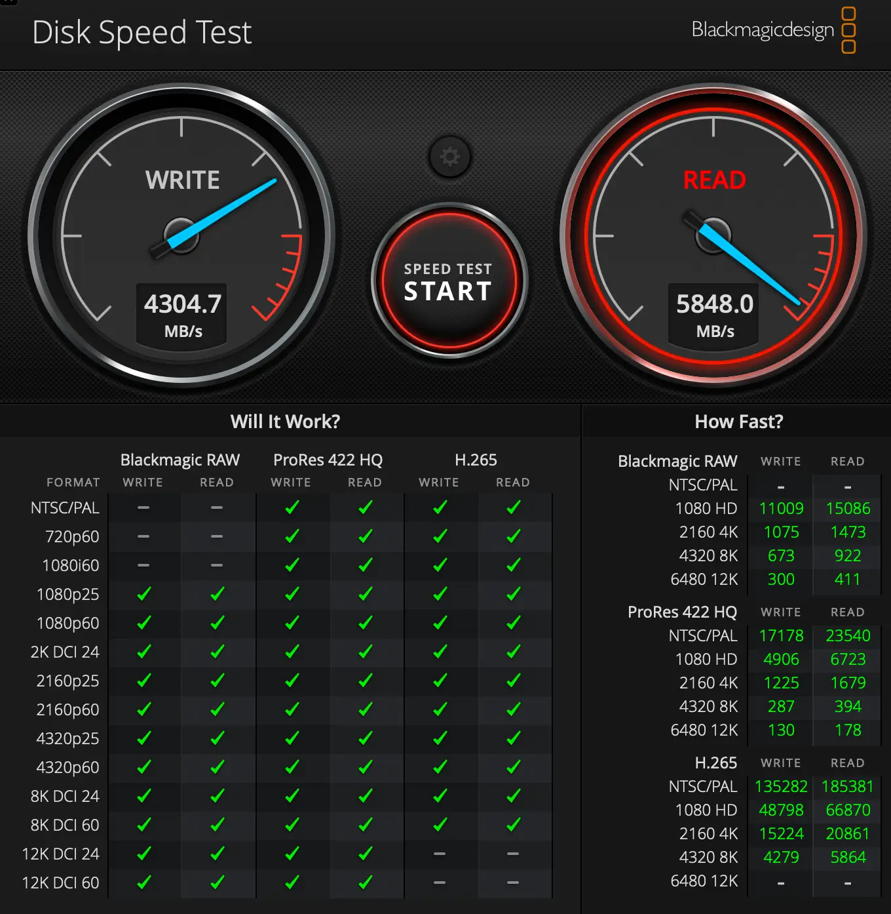

After spending a week with the **ASUS Master Thunderbolt 5 Dock DC510**, I can confidently say this is one of the most capable Thunderbolt 5 docking stations available today. With 13 ports, M.2 NVMe SSD expansion, triple 4K display support at 144Hz, and impressive data transfer speeds, this dock transforms your laptop into a powerful workstation with a single cable connection.

In this comprehensive review, I'll share my real-world experience using this dock with both a MacBook M1 Pro and Mac Mini M4 Pro, including detailed performance benchmarks with a WD_BLACK SN850X NVMe drive.

<Notice type="info" title="Quick Take">
The ASUS DC510 is a premium Thunderbolt 5 dock that delivers excellent performance for creators and professionals. It's feature-rich with strong SSD speeds, but the active cooling can be noticeable under load.
</Notice>

## Quick Verdict

**Rating: 8.5/10**

The ASUS Master Thunderbolt 5 Dock DC510 is an excellent choice for power users who need extensive connectivity and SSD expansion. It handles dual 4K monitors effortlessly, offers impressive data transfer speeds, and includes premium features like RGB lighting. The main drawback is the active cooling noise, which can be distracting in quiet environments.

<Button text="Check ASUS DC510 Price" link="https://go.bitdoze.com/asus-dc510" size="lg" color="blue" variant="solid" />

## My Testing Setup

Before diving into the review, here's what I used for testing:

- **Laptops**: MacBook M1 Pro, Mac Mini M4 Pro
- **Monitors**: 2x 4K displays (ASUS OLED 144Hz capable)
- **Added Storage**: WD_BLACK 2TB SN850X NVMe SSD
- **Testing Period**: 1 week of daily use
- **Purchase Location**: Greek retailer, delivered to Romania in 1 week
- **Price Paid**: €420 (~$460 USD)

## Video Review
<YouTubeEmbed
  url="https://www.youtube.com/embed/c69fT4kx9IQ"
  label="ASUS Master Thunderbolt 5 Dock DC510 Review: Real-World Testing & Performance"
/>

## ASUS Master Thunderbolt 5 Dock DC510 Overview

<AmazonProduct
  productName="ASUS Master Thunderbolt 5 Dock DC510"
  productDescription="13-in-1 Thunderbolt 5 docking station with M.2 SSD slot, triple 4K display support at 144Hz, 2.5GbE Ethernet, and 140W power delivery. Features RGB ambient lighting and active cooling."
  productFeatures={[
    "3x Thunderbolt 5 ports (80Gbps)",
    "M.2 NVMe PCIe 4.0 2280 SSD slot",
    "Triple 4K @144Hz or Dual 8K @60Hz",
    "2.5 Gigabit Ethernet",
    "SD & microSD card readers (UHS-II)",
    "4x USB-A ports (3x 10Gbps, 1x 5Gbps)",
    "140W PD passthrough charging",
    "180W power adapter included",
    "RGB ambient lighting"
  ]}
  productLink="https://go.bitdoze.com/asus-dc510"
  productImage="https://m.media-amazon.com/images/I/41NccYPuXSL._AC_SL1500_.jpg"
  productRating={4.5}
  importantConsiderations={[
    "Active cooling can be loud under load",
    "Availability limited in some regions",
    "Premium pricing compared to alternatives"
  ]}
  pros={[
    "Excellent SSD performance (5800 MB/s read)",
    "Easy toolless SSD installation",
    "Handles dual 4K at high refresh rates",
    "Ports on both front and back",
    "Includes Thunderbolt 5 cable",
    "Compact power adapter",
    "SSD cooling pad included"
  ]}
  cons={[
    "Active cooling noise noticeable",
    "Fan spins up even with single monitor",
    "Hard to find in stock",
    "No 10GbE Ethernet option"
  ]}
/>

## Technical Specifications

| Specification | Details |
|--------------|---------|
| **Model** | ASUS Master Thunderbolt 5 Dock DC510 |
| **Thunderbolt Ports** | 3x Thunderbolt 5 (80Gbps) |
| **USB-A Ports** | 3x USB 3.2 Gen 2 (10Gbps), 1x USB 3.0 (5Gbps) |
| **Display Support** | Triple 4K @144Hz / Dual 8K @60Hz |
| **Storage Expansion** | M.2 NVMe PCIe 4.0 2280 slot |
| **Card Readers** | SD 4.0 (UHS-II) + microSD (UHS-II) |
| **Networking** | 2.5 Gigabit Ethernet (RJ45) |
| **Audio** | 3.5mm combo jack |
| **Power Delivery** | 140W PD passthrough |
| **Power Adapter** | 180W (20V/9A) |
| **Security** | Kensington lock slot |
| **Dimensions** | 220 x 96.7 x 38.1 mm |
| **Weight** | 765g |
| **Cooling** | Active cooling with fan |
| **Lighting** | RGB LED ambient lighting |
| **OS Support** | Windows 10+, macOS |
| **Cable Length** | 100cm Thunderbolt 5 cable included |

## Setup Experience: Easy and Quick

Setting up the ASUS DC510 was remarkably straightforward. Here's how it went:

### Unboxing

The package includes:
- ASUS Master Thunderbolt 5 Dock DC510
- 180W power adapter (reasonably sized)
- 1-meter Thunderbolt 5 cable
- User manual and warranty card
- SSD cooling pad (pre-installed)

<Notice type="success" title="Pro Tip">
The inclusion of a Thunderbolt 5 cable is a nice touch, saving you $30-50 you'd spend on a separate certified cable.
</Notice>

### Installing the NVMe SSD

One of the standout features is the toolless M.2 SSD installation:

1. **Remove magnetic top cover** - Simply lift the aluminum cover
2. **Insert SSD** - Slide the WD_BLACK SN850X into the M.2 2280 slot
3. **Secure and close** - Push down gently and replace the cover
4. **Format the drive** - Connect dock, format in APFS (macOS) or NTFS (Windows)

**Total time: Under 2 minutes**

The cooling pad ensures the SSD stays at optimal temperatures even during intensive file transfers.

## Real-World Performance Testing

### Display Performance: Dual 4K Excellence

I tested the dock with two 4K monitors on both Mac systems:

#### MacBook M1 Pro
- **Monitor 1**: ASUS OLED 4K @ 144Hz
- **Monitor 2**: Standard 4K @ 60Hz
- **Result**: Flawless performance, no stuttering or lag

#### Mac Mini M4 Pro
- **Monitor 1**: ASUS OLED 4K @ 165Hz (pushed to maximum)
- **Monitor 2**: Standard 4K @ 60Hz
- **Result**: Perfect stability, smooth rendering

<Notice type="info" title="Display Compatibility">
The DC510 supports up to three 4K displays at 144Hz with DSC (Display Stream Compression) enabled on compatible devices. For dual 8K @60Hz, your laptop must support DSC with 3:1 compression ratio.
</Notice>

### SSD Performance: Impressive Speeds

I added a [WD_BLACK 2TB SN850X NVMe](https://amzn.to/3WoV1vu) to test the dock's storage capabilities.

#### Blackmagic Disk Speed Test Results

| Test Type | Read Speed | Write Speed |
|-----------|-----------|-------------|
| **Blackmagic** | ~5,800 MB/s | ~4,300 MB/s |

#### FIO Benchmark Results: WD_BLACK in DC510

| Block Size | Read MB/s | Write MB/s | Total MB/s | IOPS Read | IOPS Write | IOPS Total |
|------------|-----------|------------|------------|-----------|------------|------------|
| **4k** | 47.4 | 47.4 | 94.8 | 12,126 | 12,138 | 24,264 |
| **64k** | 729.1 | 730.0 | 1,459.1 | 11,666 | 11,679 | 23,345 |
| **512k** | 2,065.7 | 2,072.5 | 4,138.2 | 4,131 | 4,145 | 8,276 |
| **1m** | 2,510.5 | 2,570.1 | 5,080.6 | 2,510 | 2,570 | 5,080 |

#### Comparison: M4 Pro Mini Internal SSD

| Block Size | Read MB/s | Write MB/s | Total MB/s | IOPS Read | IOPS Write | IOPS Total |
|------------|-----------|------------|------------|-----------|------------|------------|
| **4k** | 35.2 | 35.3 | 70.5 | 9,016 | 9,040 | 18,056 |
| **64k** | 351.7 | 352.1 | 703.8 | 5,627 | 5,633 | 11,260 |
| **512k** | 784.2 | 786.8 | 1,571.0 | 1,568 | 1,573 | 3,141 |
| **1m** | 1,080.8 | 1,106.5 | 2,187.3 | 1,080 | 1,106 | 2,186 |

**Analysis**: The external SSD in the DC510 significantly outperforms the internal M4 Pro Mini SSD in larger block sizes, showing the power of Thunderbolt 5's bandwidth. For 4K video editing and large file operations, the DC510's SSD performance is outstanding.

<AmazonProduct
  productName="WD_BLACK 2TB SN850X NVMe SSD"
  productDescription="High-performance Gen4 PCIe M.2 2280 NVMe SSD with up to 7,300 MB/s speeds, perfect for the ASUS DC510's M.2 slot."
  productFeatures={[
    "PCIe Gen4 x4 NVMe interface",
    "Up to 7,300 MB/s read speeds",
    "M.2 2280 form factor",
    "2TB capacity",
    "Gaming-optimized performance"
  ]}
  productLink="https://amzn.to/3WoV1vu"
  productImage="https://m.media-amazon.com/images/I/61u-w0nMDTL._AC_SL1500_.jpg"
  productRating={4.7}
  pros={[
    "Excellent real-world performance",
    "Reliable gaming SSD",
    "Good value for 2TB capacity"
  ]}
  cons={[
    "Can run warm under sustained load",
    "Not quite hitting advertised peak speeds in DC510"
  ]}
/>

### Port Flexibility: Front and Back Access

The DC510's port layout is well thought out:

**Front Panel:**
- 1x USB-A 3.0 (5Gbps)
- SD card reader (UHS-II)
- microSD card reader (UHS-II)
- Audio combo jack

**Rear Panel:**
- 2x Thunderbolt 5 ports
- 3x USB-A 3.2 Gen 2 (10Gbps)
- 2.5GbE Ethernet
- Power button with LED indicator
- DC power input
- Kensington lock slot

This layout makes it easy to access frequently used ports (SD cards, front USB) while keeping cable management clean with rear connections.

## What I Love About the ASUS DC510

<ListCheck>
  <ul>
    <li>**Outstanding SSD speeds** - Achieving 5,800 MB/s read speeds makes this ideal for video editors and content creators</li>
    <li>**Effortless SSD installation** - The toolless magnetic cover design is brilliant</li>
    <li>**Dual 4K monitor support** - Handled my monitors at high refresh rates without breaking a sweat</li>
    <li>**Smart port placement** - Front and rear ports provide excellent flexibility</li>
    <li>**Includes everything** - Thunderbolt 5 cable in the box is a welcome addition</li>
    <li>**Compact power brick** - The 180W adapter is surprisingly manageable</li>
    <li>**SSD cooling pad** - Keeps the NVMe drive at safe temperatures</li>
    <li>**RGB lighting** - Subtle ambient lighting adds a premium touch</li>
  </ul>
</ListCheck>

## What Could Be Better

While the DC510 is excellent, there are some areas for improvement:

### Active Cooling Noise

The most significant drawback is the **active cooling fan**. Here's what I experienced:

- **With 1 monitor**: Fan starts spinning intermittently
- **With 2 monitors**: Fan runs more frequently
- **During file transfers**: Fan clearly audible
- **Noise level**: Noticeable in quiet office environments

**Comparison**: On the Mac Mini M4 Pro with Thunderbolt 5, the cooler doesn't start as frequently, suggesting the DC510's cooling curve is quite aggressive.

<Notice type="warning" title="Cooling Consideration">
If you work in a quiet environment or record audio/video, the fan noise may be distracting. Consider your use case and environment before purchasing.
</Notice>

### Limited Availability

Finding the DC510 in stock can be challenging. I had to order mine from a Greek retailer and wait a week for delivery to Romania. Check multiple retailers if you're interested.

### No 10GbE Option

While 2.5 Gigabit Ethernet is solid, power users with 10GbE networks might prefer the CalDigit TS5-Plus or similar docks with 10GbE support.

## Who Should Buy the ASUS DC510?

### Perfect For:

- **Content creators** working with 4K/8K video files
- **Photographers** who need fast SD card transfers
- **Developers** requiring multiple displays and fast storage
- **Mac users** with M1 Pro/Max/Ultra or M4 Pro/Max chips
- **Professionals** who want expandable storage in their dock

### Consider Alternatives If:

- You need absolute silence (look at passively cooled docks)
- You require 10 Gigabit Ethernet
- You're on a tight budget (check out Kensington SD5000T5)
- You prefer gaming-focused RGB (consider Razer Thunderbolt 5 Dock Chroma)

## ASUS DC510 vs Razer Thunderbolt 5 Dock Chroma

If you're deciding between these two popular Thunderbolt 5 docks, here's a quick comparison:

| Feature | ASUS DC510 | Razer Chroma |
|---------|-----------|--------------|
| **Ethernet** | 2.5 GbE ✅ | 1 GbE |
| **Card Readers** | SD + microSD ✅ | SD only |
| **USB-A Ports** | 4 ports ✅ | 2 ports |
| **Power Adapter** | 180W | 250W ✅ |
| **RGB Lighting** | Ambient LED | Razer Chroma ✅ |
| **Gaming Focus** | Professional | Gaming ✅ |
| **Price** | €420 | Similar |

**Read the full comparison**: [ASUS DC510 vs Razer Thunderbolt 5 Dock Chroma](https://www.bitdoze.com/asus-vs-razer-thunderbolt-5-comparison/)

## Frequently Asked Questions

<Accordion label="Does the ASUS DC510 work with Windows laptops?" group="faq">
Yes, the DC510 works with any Windows 10 or later laptop with Thunderbolt 4 or Thunderbolt 5 support. You'll get full functionality including display output, charging, and data transfer.
</Accordion>

<Accordion label="Can I use Thunderbolt 4 cables with this dock?" group="faq">
Yes, Thunderbolt 5 is backward compatible with Thunderbolt 4 cables. However, to achieve the full 80Gbps bandwidth, you should use a certified Thunderbolt 5 cable (included with the dock).
</Accordion>

<Accordion label="What size NVMe SSD can I install?" group="faq">
The DC510 supports M.2 2280 NVMe SSDs (PCIe 4.0). You can install drives up to 8TB capacity. Popular options include the WD_BLACK SN850X, Samsung 990 Pro, or any PCIe 4.0 M.2 drive.
</Accordion>

<Accordion label="How hot does the dock get during use?" group="faq">
The dock stays reasonably cool thanks to active cooling. The aluminum chassis helps dissipate heat, and the SSD cooling pad keeps the NVMe drive at safe temperatures. During intensive use, the dock is warm but not uncomfortably hot.
</Accordion>

<Accordion label="Can I turn off the RGB lighting?" group="faq">
Yes, you can control the ambient LED lighting through the dock's settings or by using the power button. The lighting is subtle and not as prominent as gaming-focused RGB.
</Accordion>

<Accordion label="Does it support dual 8K displays?" group="faq">
Yes, the DC510 can drive dual 8K displays at 60Hz if your laptop supports DSC (Display Stream Compression) with a 3:1 ratio. Most modern high-end laptops with Thunderbolt 5 support this feature.
</Accordion>

## Alternatives to Consider

Looking at other options? Here are some alternatives:

### Razer Thunderbolt 5 Dock Chroma
- **Price**: Similar to ASUS DC510
- **Best For**: Gamers and RGB enthusiasts
- **Key Difference**: Full Razer Chroma RGB, gaming aesthetic
- [Check Razer Dock Price](https://amzn.to/3IjvS20)

### CalDigit TS5-Plus
- **Price**: ~$650-700
- **Best For**: Maximum connectivity needs
- **Key Difference**: 20 ports, 10 Gigabit Ethernet
- [See CalDigit TS5-Plus](https://www.bitdoze.com/best-thunderbolt-5-docks-guide/#1-caldigit-ts5-plus-20-port-powerhouse--top-pick)

### Kensington SD5000T5
- **Price**: ~$400-500
- **Best For**: Budget-conscious buyers
- **Key Difference**: Lower price, passive cooling
- [View Kensington Dock](https://www.bitdoze.com/best-thunderbolt-5-docks-guide/#1-kensington-sd5000t5-thunderbolt-5-triple-4k-docking-station)

**Complete comparison**: Check out our [Best Thunderbolt 5 Docks Guide](https://www.bitdoze.com/best-thunderbolt-5-docks-guide/) for detailed comparisons of all major Thunderbolt 5 docks.

## Final Thoughts

After a week of intensive testing, the **ASUS Master Thunderbolt 5 Dock DC510** has earned its place as one of the top Thunderbolt 5 docking stations available. The combination of excellent SSD performance, dual 4K monitor support at high refresh rates, and comprehensive connectivity makes it ideal for creative professionals and power users.

The real-world speeds I achieved with the WD_BLACK SN850X (5,800 MB/s read, 4,300 MB/s write) demonstrate the dock's ability to handle demanding workloads. The toolless SSD installation is elegant, and having expandable storage directly in your dock is incredibly convenient.

However, the active cooling noise is a legitimate concern. If you work in quiet environments or regularly record audio, this might be a dealbreaker. Otherwise, the ASUS DC510 offers excellent value for its €420 price tag.

**Rating: 8.5/10**

### Pros
✅ Outstanding SSD performance
✅ Easy toolless SSD installation
✅ Excellent dual 4K monitor support
✅ 2.5GbE Ethernet
✅ SD + microSD readers
✅ Includes Thunderbolt 5 cable
✅ Comprehensive port selection

### Cons
❌ Active cooling can be loud
❌ Limited availability
❌ No 10GbE option

<Button text="Buy ASUS DC510 Now" link="https://go.bitdoze.com/asus-dc510" size="lg" color="blue" variant="solid" />

---

**Related Articles:**
- [Best Thunderbolt 5 Docks 2025: Complete Guide](https://www.bitdoze.com/best-thunderbolt-5-docks-guide/)
- [ASUS DC510 vs Razer Thunderbolt 5 Dock Chroma](https://www.bitdoze.com/asus-vs-razer-thunderbolt-5-comparison/)

<Notice type="info" title="Affiliate Disclosure">
This article contains affiliate links to Amazon and other retailers. If you make a purchase through these links, we may earn a small commission at no extra cost to you. This helps support our testing and content creation.
</Notice>
