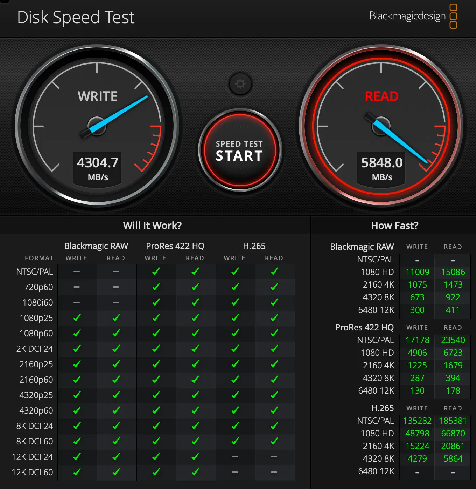

import YouTubeEmbed from "@components/widgets/YouTubeEmbed.astro";
import Button from "@components/widgets/Button.astro";
import Notice from "@components/widgets/Notice.astro";
import ListCheck from "@components/widgets/ListCheck.astro";
import Accordion from "@components/widgets/Accordion.astro";
import AmazonProduct from "@components/widgets/AmazonProduct.astro";
import Tabs from "@components/widgets/Tabs.astro";
import Tab from "@components/widgets/Tab.astro";

This **ASUS DC510 review** started as a one week test in October 2025 and was updated in September 2026 with current pricing, the host-side requirements people keep getting wrong, and where this Thunderbolt 5 dock sits in the market now. The benchmark numbers and the notes on fan noise are from the week I actually spent with the dock, not re-run guesses.

If you want a Thunderbolt 5 dock with an M.2 slot, the DC510 is still one of the few that combines SSD expansion, dual card readers and 2.5GbE in a single box. The storage speed is genuinely fast (5,800 MB/s reads from a WD_BLACK SN850X), dual 4K at high refresh works, and the active cooling fan remains the one thing I would tell a friend to think about before ordering.

<Notice type="warning" title="Affiliate Disclosure">
Some links in this review are affiliate links. If you buy through them, we may earn a small commission at no extra cost to you. This helps us keep testing and updating these recommendations.
</Notice>

<Notice type="info" title="Quick Take">
The ASUS DC510 is a strong Thunderbolt 5 dock for creators and professionals: real 5.8 GB/s SSD reads, dual 4K at 144Hz+, SD and microSD readers, 2.5GbE. US street price is down to roughly $350 (I paid €420 in October 2025). The active cooling fan is audible under load, and that is the tradeoff you are accepting.
</Notice>

## Quick verdict

**Rating: 8.5/10**

The ASUS Master Thunderbolt 5 Dock DC510 works well for power users who need lots of ports and SSD expansion. It handles dual 4K monitors easily, offers fast data transfer speeds, and has features like ambient LED lighting. The main drawback is the active cooling noise, which can be distracting in quiet places.

<Button text="Check ASUS DC510 Price" link="https://go.bitdoze.com/asus-dc510" size="lg" color="blue" variant="solid" />

## What changed since this review was first published

Not much about the hardware. Quite a lot about everything around it.

| | Then (October 2025) | Now (September 2026) |
|---|---|---|
| **Price** | €420 from a Greek retailer, delivered to Romania in a week | Roughly $350 US street price |
| **Availability** | Hard to find in stock, often had to import | Normal retailer stock |
| **Host support** | Thunderbolt 5 hosts were M4 Pro/Max Macs and a handful of Intel laptops | M4/M5 Pro and Max Macs plus Core Ultra Windows laptops, so far more machines can actually use the 80 Gbps link |
| **Dock market** | Few TB5 docks, all expensive | A budget tier now exists (Kensington SD5000T5 sits around $195–300), and 10GbE models have come down |

Two corrections I want to make explicit for readers who found this page in 2026:

- Only the **Mac mini M4 Pro** in my test setup has a Thunderbolt 5 port. The **MacBook Pro M1 Pro is a Thunderbolt 4 host**, which means 40 Gbps and PCIe 3.0 x4 tunneling. Anything above roughly 3 GB/s is impossible over that link, so the 5,800 MB/s figures below are Thunderbolt 5 numbers.
- The M1 Pro also tops out at **two external displays**. The DC510's triple-display claim was never testable on that machine, no matter what the dock can do.

## My testing setup

| Component | Detail |
|---|---|
| **Hosts** | MacBook Pro M1 Pro (Thunderbolt 4), Mac mini M4 Pro (Thunderbolt 5) |
| **Monitors** | ASUS OLED 4K at 144Hz+ plus a standard 4K 60Hz panel |
| **Storage added** | WD_BLACK 2TB SN850X NVMe (PCIe 4.0, M.2 2280) |
| **Testing period** | 1 week of daily use |
| **Purchased from** | Greek retailer, delivered to Romania in 1 week |
| **Price paid** | €420 (~$460 at the time) |

Everything I report about SSD throughput, display refresh rates and fan behaviour comes from that setup. I did not test this dock on Windows or Linux, so the platform notes further down are what to check rather than what I measured.

## Video review

<YouTubeEmbed
  url="https://www.youtube.com/embed/c69fT4kx9IQ"
  label="ASUS Master Thunderbolt 5 Dock DC510 Review: Real-World Testing & Performance"
/>

## What Thunderbolt 5 actually buys you

Thunderbolt 5 is easy to oversell, so here is the short version of what matters on a dock like this:

- **80 Gbps bidirectional**, with Bandwidth Boost reallocating up to **120 Gbps to displays** while data traffic keeps a floor. The headroom only exists if your host is a Thunderbolt 5 host.
- **PCIe 4.0 x4 tunneling** instead of PCIe 3.0 x4. This is the reason an M.2 drive in the dock can read at 5.8 GB/s instead of stalling around 3 GB/s, and it is the single most useful upgrade over Thunderbolt 4 for anyone doing video work.
- **DisplayPort 2.1 tunneling**, which is what makes high refresh 4K and 8K configurations possible in the first place.
- **Backward compatibility**: Thunderbolt 4, USB4 and plain USB-C hosts all work. You just get their bandwidth and their display limits, not the dock's.

### The display bandwidth math nobody puts on the box

A 4K display at 144Hz and 10-bit color is about **36 Gbps of pixel data** before overhead. Three of those is roughly 107 Gbps, which does not fit in an 80 Gbps link, so the advertised "triple 4K at 144Hz" depends on **DSC (Display Stream Compression)** on the host GPU. Dual 8K at 60Hz is about 48 Gbps per display, so that config also leans on DSC and Bandwidth Boost.

Practical takeaway: if a display drops to 60Hz or a third monitor refuses to wake, the dock is usually not the problem. The link budget or the host GPU is. Check the host's maximum display count first, then look at the cable.

## Technical specifications

| Specification | Details |
|--------------|---------|
| **Model** | ASUS Master Thunderbolt 5 Dock DC510 |
| **Thunderbolt Ports** | 3x Thunderbolt 5 (80Gbps) |
| **USB-A Ports** | 3x USB 3.2 Gen 2 (10Gbps), 1x USB 3.0 (5Gbps) |
| **Display Support** | Triple 4K @144Hz / Dual 8K @60Hz |
| **Storage Expansion** | M.2 NVMe PCIe 4.0 2280 slot |
| **Card Readers** | SD 4.0 (UHS-II) + microSD (UHS-II) |
| **Networking** | 2.5 Gigabit Ethernet (RJ45) |
| **Audio** | 3.5mm combo jack |
| **Power Delivery** | 140W PD passthrough |
| **Power Adapter** | 180W (20V/9A), external |
| **Security** | Kensington lock slot |
| **Dimensions** | 220 x 96.7 x 38.1 mm |
| **Weight** | 765g |
| **Cooling** | Active cooling with fan |
| **Lighting** | White ambient LED (4 brightness levels, breathing mode) |
| **OS Support** | Windows 10+, macOS |
| **Cable Length** | 100cm Thunderbolt 5 cable included |
| **Host requirement** | Thunderbolt 5 host for 80 Gbps, PCIe 4.0 SSD speed and Bandwidth Boost |

## Overview

<AmazonProduct
  productName="ASUS Master Thunderbolt 5 Dock DC510"
  productDescription="13-in-1 Thunderbolt 5 docking station with M.2 SSD slot, triple 4K display support at 144Hz, 2.5GbE Ethernet, and 140W power delivery. Features ambient LED lighting and active cooling."
  productFeatures={[
    "3x Thunderbolt 5 ports (80Gbps)",
    "M.2 NVMe PCIe 4.0 2280 SSD slot",
    "Triple 4K @144Hz or Dual 8K @60Hz",
    "2.5 Gigabit Ethernet",
    "SD & microSD card readers (UHS-II)",
    "4x USB-A ports (3x 10Gbps, 1x 5Gbps)",
    "140W PD passthrough charging",
    "180W power adapter included",
    "Ambient white LED lighting"
  ]}
  productLink="https://go.bitdoze.com/asus-dc510"
  productImage="https://m.media-amazon.com/images/I/41NccYPuXSL._AC_SL1500_.jpg"
  productRating={4.5}
  importantConsiderations={[
    "Active cooling can be loud under load",
    "Availability limited in some regions",
    "Premium pricing compared to alternatives"
  ]}
  pros={[
    "Excellent SSD performance (5800 MB/s read)",
    "Easy toolless SSD installation",
    "Handles dual 4K at high refresh rates",
    "Ports on both front and back",
    "Includes Thunderbolt 5 cable",
    "Compact power adapter",
    "SSD cooling pad included"
  ]}
  cons={[
    "Active cooling noise noticeable",
    "Fan spins up even with single monitor",
    "Hard to find in stock",
    "No 10GbE Ethernet option"
  ]}
/>

## Setup experience: easy and quick

Setting up the ASUS DC510 was straightforward. Here is how it went.

### Unboxing

The package includes:

- ASUS Master Thunderbolt 5 Dock DC510
- 180W power adapter (reasonably sized)
- 1-meter Thunderbolt 5 cable
- User manual and warranty card
- SSD cooling pad (pre-installed)

<Notice type="success" title="Pro Tip">
The Thunderbolt 5 cable is included, saving you $30-50 you'd spend on a separate certified cable. Keep the box, because that cable is the only way to be sure you are not throttled to Thunderbolt 4 speeds.
</Notice>

### Installing the NVMe SSD

One of the standout features is the toolless M.2 SSD installation:

1. **Remove magnetic top cover** - Simply lift the aluminum cover
2. **Insert SSD** - Slide the WD_BLACK SN850X into the M.2 2280 slot
3. **Secure and close** - Push down gently and replace the cover
4. **Format the drive** - Connect dock, format in APFS (macOS) or NTFS (Windows)

**Total time: under 2 minutes**

The cooling pad ensures the SSD stays at optimal temperatures even during intensive file transfers.

### Before you plug in an SSD that already has data

This is the part that bites people. A drive coming out of a Windows machine is usually NTFS, and macOS mounts NTFS **read-only** without third-party drivers. A drive formatted for a NAS or camera may need a full reformat, which erases it. And any SSD you put in the dock is a removable device that is very easy to walk away with.

So, in order:

- Copy anything you care about off the drive **before** it goes in the dock.
- Pick the filesystem on purpose: **APFS** if the drive stays in the Mac ecosystem, **exFAT** if you move it between macOS and Windows, **NTFS** only if Windows is the main host.
- Treat the dock SSD as fast scratch space. Not as the only copy of anything.

<Notice type="warning" title="Data loss footgun">
Formatting is the only step in this whole setup that can destroy data, and both Disk Utility and Windows Disk Management will happily offer to do it. Confirm the disk number twice before you click Erase.
</Notice>

### Verifying the install per OS

<Notice type="info" title="Tested on macOS only">
I only ran this dock on macOS. The Windows and Linux commands below are what I would use to verify the same things, not something I measured on this unit.
</Notice>

<Tabs>
<Tab name="macOS">

Check the Thunderbolt link and the attached devices first:

```bash
# Is the dock linked as a Thunderbolt device?
system_profiler SPThunderboltDataType | grep -A 8 -i thunderbolt

# What the GPUs are actually driving, including refresh rate
system_profiler SPDisplaysDataType | grep -E "Resolution|Refresh Rate"

# Ethernet: you want to see 2500base-T, not 1000baseT
networksetup -listallhardwareports | grep -A 3 -i ethernet
ifconfig en6 | grep media   # en6 = whatever name the first command printed

# The SSD should appear as a new external physical disk
diskutil list external physical
```

**Expected:** the dock shows up in the Thunderbolt tree, a new external disk appears in `diskutil`, and the Ethernet media line reads `2500base-T`.

**Broken looks like:** no new disk at all (SSD not seated, or the host port is not Thunderbolt/USB4), or `1000baseT` on the media line (cable, switch port, or the wall run, not the dock).

</Tab>
<Tab name="Windows">

```powershell
Get-NetAdapter | Select-Object Name, Status, LinkSpeed
Get-Disk | Select-Object Number, FriendlyName, BusType, @{n='GB';e={[math]::Round($_.Size/1GB)}}
```

**Expected:** the adapter reports `2.5 Gbps`, and the SSD appears as a new disk with `BusType` of `USB` or `Thunderbolt`. Install the current Intel Thunderbolt driver and use the Thunderbolt Control Center app to approve the device the first time you attach it.

**Broken looks like:** link speed of `1 Gbps` or the disk missing entirely. Same triage as macOS: reseat the SSD, swap the cable, try another port.

</Tab>
<Tab name="Linux">

```bash
lsblk -o NAME,SIZE,MODEL,TRAN
ethtool enp0s20f0u4 | grep -i speed
boltctl list
```

**Expected:** the NVMe shows up as a normal block device, `ethtool` reports `2500Mb/s`, and `boltctl list` shows the dock with its authorization status.

**Note:** Linux support for USB4 v2 hosts is still the least predictable of the three platforms. If your kernel does not handle the link, the dock still works as a plain USB4/USB hub at reduced bandwidth.

</Tab>
</Tabs>

## Real-world performance testing

### Display performance: dual 4K at high refresh

I tested the dock with two 4K monitors on both Mac systems.

#### MacBook M1 Pro

- **Monitor 1**: ASUS OLED 4K @ 144Hz
- **Monitor 2**: Standard 4K @ 60Hz
- **Result**: Flawless performance, no stuttering or lag

#### Mac mini M4 Pro

- **Monitor 1**: ASUS OLED 4K @ 165Hz (pushed to maximum)
- **Monitor 2**: Standard 4K @ 60Hz
- **Result**: Stable, smooth rendering

<Notice type="info" title="Display Compatibility">
The DC510 supports up to three 4K displays at 144Hz with DSC (Display Stream Compression) enabled on compatible devices. For dual 8K @60Hz, your laptop must support DSC with 3:1 compression ratio. The host GPU's display limit still applies on top of that, which is why the M1 Pro only ever drove two panels here.
</Notice>

If you are pairing this dock with a high refresh panel, my [ASUS ROG Strix OLED XG32UCWG review](https://www.bitdoze.com/asus-rog-strix-oled-xg32ucwg-review/) covers what 4K at 165Hz and above actually feels like for work, and the [best 32-inch OLED monitors guide](https://www.bitdoze.com/best-32-inch-oled-monitors-guide/) has the current picks if you are buying the display at the same time as the dock.

### SSD performance: 5,800 MB/s through a dock

I added a [WD_BLACK 2TB SN850X NVMe](/go/wd-black-sn850x-2tb/) to test the dock's storage capabilities.

#### Blackmagic Disk Speed Test results



| Test Type | Read Speed | Write Speed |
|-----------|-----------|-------------|
| **Blackmagic** | ~5,800 MB/s | ~4,300 MB/s |

#### FIO benchmark results: WD_BLACK in DC510

| Block Size | Read MB/s | Write MB/s | Total MB/s | IOPS Read | IOPS Write | IOPS Total |
|------------|-----------|------------|------------|-----------|------------|------------|
| **4k** | 47.4 | 47.4 | 94.8 | 12,126 | 12,138 | 24,264 |
| **64k** | 729.1 | 730.0 | 1,459.1 | 11,666 | 11,679 | 23,345 |
| **512k** | 2,065.7 | 2,072.5 | 4,138.2 | 4,131 | 4,145 | 8,276 |
| **1m** | 2,510.5 | 2,570.1 | 5,080.6 | 2,510 | 2,570 | 5,080 |

#### Comparison: M4 Pro mini internal SSD

| Block Size | Read MB/s | Write MB/s | Total MB/s | IOPS Read | IOPS Write | IOPS Total |
|------------|-----------|------------|------------|-----------|------------|------------|
| **4k** | 35.2 | 35.3 | 70.5 | 9,016 | 9,040 | 18,056 |
| **64k** | 351.7 | 352.1 | 703.8 | 5,627 | 5,633 | 11,260 |
| **512k** | 784.2 | 786.8 | 1,571.0 | 1,568 | 1,573 | 3,141 |
| **1m** | 1,080.8 | 1,106.5 | 2,187.3 | 1,080 | 1,106 | 2,186 |

**Analysis**: the external SSD in the DC510 significantly outperforms the internal M4 Pro mini SSD in larger block sizes. That is what PCIe 4.0 tunneling buys you: a dock-mounted drive that is faster than the machine's own internal storage. For 4K video editing and large file operations, the DC510's SSD performance is outstanding.

#### How to reproduce these numbers

FIO on macOS needs `posixaio`, not `libaio`:

```bash
brew install fio

# Sequential read, 1 MiB blocks
fio --name=seq-read --filename=/Volumes/tb5/fio-test \
  --rw=read --bs=1m --direct=1 --size=2g \
  --ioengine=posixaio --numjobs=1 --group_reporting

# Mixed 4K random
fio --name=rand-4k --filename=/Volumes/tb5/fio-test \
  --rw=randrw --bs=4k --direct=1 --size=1g \
  --ioengine=posixaio --iodepth=32
```

Point `--filename` at a scratch directory on the dock's SSD, and use a real `size` so you are not just measuring cache. If FIO fails with `Invalid argument`, drop `--direct=1` and make sure the volume is APFS rather than exFAT, which does not always support direct I/O on macOS.

<Notice type="warning" title="The Thunderbolt 4 ceiling">
Put the same SSD in the same dock on a Thunderbolt 4 host and it will stall around 2.6-3 GB/s, because TB4 only tunnels PCIe 3.0 x4. Nothing is wrong with the dock. If you see those numbers on an M1, M2 or M3 Mac, that is the host, and the DC510 has more headroom than your laptop can use.
</Notice>

If you want the same measurement discipline on servers rather than a desk, the approach in [how to benchmark cloud servers](https://www.bitdoze.com/benchmark-cloud-servers/) ports over directly.

<AmazonProduct
  productName="WD_BLACK 2TB SN850X NVMe SSD"
  productDescription="High-performance Gen4 PCIe M.2 2280 NVMe SSD with up to 7,300 MB/s speeds, perfect for the ASUS DC510's M.2 slot."
  productFeatures={[
    "PCIe Gen4 x4 NVMe interface",
    "Up to 7,300 MB/s read speeds",
    "M.2 2280 form factor",
    "2TB capacity",
    "Gaming-optimized performance"
  ]}
  productLink="/go/wd-black-sn850x-2tb/"
  productImage="https://m.media-amazon.com/images/I/61u-w0nMDTL._AC_SL1500_.jpg"
  productRating={4.7}
  pros={[
    "Excellent real-world performance",
    "Reliable gaming SSD",
    "Good value for 2TB capacity"
  ]}
  cons={[
    "Can run warm under sustained load",
    "Not quite hitting advertised peak speeds in DC510"
  ]}
/>

### Port flexibility: front and back access

The DC510's port layout is well thought out.

**Front panel:**

- 1x USB-A 3.0 (5Gbps)
- SD card reader (UHS-II)
- microSD card reader (UHS-II)
- Audio combo jack

**Rear panel:**

- 2x Thunderbolt 5 ports
- 3x USB-A 3.2 Gen 2 (10Gbps)
- 2.5GbE Ethernet
- Power button with LED indicator
- DC power input
- Kensington lock slot

This layout makes it easy to access frequently used ports (SD cards, front USB) while keeping cable management clean with rear connections.

Two port notes that matter in daily use:

- The **2.5GbE port is only worth anything if the rest of the path supports it**. A CAT5e cable and a 1G switch will happily negotiate down to 1G, and the dock gets blamed for it.
- There is **no front USB-C port**. If you hot-plug USB-C SSDs all day, that is a real annoyance, and it is the sort of thing a dock in this price bracket is expected to have.

## What I like about the ASUS DC510

<ListCheck>
  <ul>
    <li>**Fast SSD speeds** - Achieving 5,800 MB/s read speeds makes this useful for video editors and content creators</li>
    <li>**Simple SSD installation** - The toolless magnetic cover design works well</li>
    <li>**Dual 4K monitor support** - Handled my monitors at high refresh rates without issues</li>
    <li>**Smart port placement** - Front and rear ports give good flexibility</li>
    <li>**Includes everything** - Thunderbolt 5 cable in the box is welcome</li>
    <li>**Compact power brick** - The 180W adapter is manageable</li>
    <li>**SSD cooling pad** - Keeps the NVMe drive at safe temperatures</li>
    <li>**Ambient lighting** - Subtle white LED glow adds style</li>
  </ul>
</ListCheck>

## What could be better

While the DC510 is excellent, there are some areas for improvement.

### Active cooling noise

The most significant drawback is the **active cooling fan**. Here's what I experienced:

- **With 1 monitor**: Fan starts spinning intermittently
- **With 2 monitors**: Fan runs more frequently
- **During file transfers**: Fan clearly audible
- **Noise level**: Noticeable in quiet office environments

**Comparison**: On the Mac mini M4 Pro with Thunderbolt 5, the cooler doesn't start as frequently, suggesting the DC510's cooling curve is quite aggressive.

<Notice type="warning" title="Cooling Consideration">
If you work in a quiet environment or record audio/video, the fan noise may be distracting. Consider your use case and environment before purchasing. I could not measure decibels in a repeatable way, so I am not going to invent a number: it is a small fan that is audible across a quiet room, and it spins up on load rather than staying at one constant level.
</Notice>

Practical mitigation, in the order I would try it: give the dock airflow on both sides rather than tucking it under a monitor riser, keep the SSD's thermal pad in place (a hot drive is what triggers the fan in the first place), and put the dock physically behind or under the desk edge if you record with a microphone nearby. There is no fan curve control in any ASUS utility I have used for this dock, so you cannot tune it away.

### Limited availability

Finding the DC510 in stock was hard when I bought it, and I had to order from a Greek retailer and wait a week for delivery to Romania. Availability has improved since, but it is still not a dock you will find in every local shop, so check stock before you decide based on price alone.

### No 10GbE option

While 2.5 Gigabit Ethernet is solid, power users with 10GbE networks might prefer the CalDigit TS5 Plus or iVANKY FusionDock Ultra. If you move large files across a LAN, 2.5GbE is the ceiling here and that will not change with firmware.

## Who should buy the ASUS DC510?

<Tabs>
<Tab name="Content creators">

**Yes, this is the dock's best fit.**

Dual card readers, 2.5GbE for dumping footage to a NAS, and 5.8 GB/s reads from an internal NVMe. If you shoot on two card types and edit off external storage, the DC510 removes three separate accessories from your desk.

Watch out for: fan noise during long exports if the machine records audio, and the fact that the SSD is not a backup.

</Tab>
<Tab name="Developers and power users">

**Yes, if you want one cable for everything.**

Two 4K displays at high refresh, four USB-A ports, 2.5GbE, and a fast scratch disk for VM images, container layers or large repos. 140W of passthrough means a 16-inch MacBook Pro charges at full speed from the same cable.

Watch out for: no 10GbE and no front USB-C, which are the two missing pieces if your workflow is network-heavy or you constantly hot-plug USB-C drives.

</Tab>
<Tab name="Skip it if">

**Three cases where I would not buy the DC510.**

- **You need absolute silence.** There are passively cooled alternatives, and the fan is the DC510's known compromise.
- **You need 10GbE.** Look at the [iVANKY FusionDock Ultra review](https://www.bitdoze.com/ivanky-fusiondock-ultra-review/) or a CalDigit TS5 Plus instead.
- **You have an M1, M2 or M3 Mac.** You will never touch the 80 Gbps link or the PCIe 4.0 SSD speed. Buy a cheaper Thunderbolt 4 dock and keep the difference.

</Tab>
</Tabs>

## ASUS DC510 vs Razer Thunderbolt 5 Dock Chroma

If you're deciding between these two popular Thunderbolt 5 docks, here's a quick comparison:

| Feature | ASUS DC510 | Razer Chroma |
|---------|-----------|--------------|
| **Ethernet** | 2.5 GbE ✅ | 1 GbE |
| **Card Readers** | SD + microSD ✅ | SD only |
| **USB-A Ports** | 4 ports ✅ | 2 ports |
| **Power Adapter** | 180W | 250W ✅ |
| **Lighting** | White ambient LED | Razer Chroma RGB ✅ |
| **Gaming Focus** | Professional | Gaming ✅ |
| **Price (Sep 2026)** | ~$350 | ~$390 |

**Read the full comparison**: [ASUS DC510 vs Razer Thunderbolt 5 Dock Chroma](https://www.bitdoze.com/asus-vs-razer-thunderbolt-5-comparison/)

## Alternatives to consider

Prices below are September 2026 street ranges from my [Thunderbolt 5 docks guide](https://www.bitdoze.com/best-thunderbolt-5-docks-guide/). They move with sales, so confirm on the listing.

| Dock | Street price | Ethernet | Why you would pick it instead |
|---|---|---|---|
| **Kensington SD5000T5** | ~$195–300 | 2.5GbE | Cheapest Intel-certified TB5 dock, passive cooling, no M.2 slot |
| **Razer Thunderbolt 5 Dock Chroma** | ~$390 | 1GbE | Gaming aesthetic, Chroma RGB, M.2 slot |
| **Anker Prime TB5** | ~$400 | 2.5GbE | 14 ports, built-in cooling, cleaner desk design |
| **iVANKY FusionDock Ultra** | ~$650–750 | 10GbE | 26 ports, quad display, dual-chip architecture |
| **CalDigit TS5 Plus** | ~$650–700 | 10GbE | 20 ports, the maximum-connectivity pick |

### Kensington SD5000T5

- **Best for**: budget buyers who do not need an SSD slot
- **Key difference**: lower price, passive cooling, no M.2 expansion
- [View Kensington Dock](https://www.bitdoze.com/best-thunderbolt-5-docks-guide/#1-kensington-sd5000t5-thunderbolt-5-triple-4k-docking-station)

### Razer Thunderbolt 5 Dock Chroma

- **Best for**: gamers and RGB enthusiasts
- **Key difference**: full Razer Chroma RGB, gaming aesthetic
- [Check Razer Dock Price](/go/razer-tb5-dock/)

### CalDigit TS5-Plus

- **Best for**: maximum connectivity and 10GbE networks
- **Key difference**: 20 ports, 10 Gigabit Ethernet
- [See CalDigit TS5 Plus](https://www.bitdoze.com/best-thunderbolt-5-docks-guide/#1-caldigit-ts5-plus-20-port-powerhouse--top-pick)

**Complete comparison**: the [best Thunderbolt 5 docks guide](https://www.bitdoze.com/best-thunderbolt-5-docks-guide/) has the full port-by-port table across ten docks if you want to shop the category rather than this one product.

## Ops notes: single point of failure and backups

A dock is infrastructure, even if it sits on a desk. Three things I would think about before making one part of a daily workflow:

**It is a single point of failure for your desk.** One cable and one external PSU sit between you and both monitors, your network and your storage. Keep the Thunderbolt cable that came in the box as a spare or buy a second certified one, because a bad cable presents as random display dropouts and slower-than-expected storage rather than an obvious failure.

**The SSD in the dock is not a backup.** It is a removable, dock-resident drive that a fast PSU fault, a bad unplug or a dropped bag can take out. Whatever you keep on it needs a second copy somewhere else. I would look at cheap S3-compatible object storage for the offsite leg; [Bunny Storage](https://go.bitdoze.com/bunny) is one of the cheaper options I keep pointing people at, and [Bunny vs S3 vs Backblaze](https://www.bitdoze.com/bunny-storage-vs-s3-vs-backblaze/) compares the pricing. For a self-hosted alternative with encryption, [Pluton with Restic and Rclone](https://www.bitdoze.com/pluton-self-hosted-backup/) covers the same job on your own hardware.

**Firmware and warranty.** Before deciding a dock is defective, check the ASUS support page for the DC510 for a firmware release; on Windows there is a utility, and on macOS the dock is driverless so a firmware fix has to come from a Windows host. Also read the warranty term for your region before importing, because a cross-border RMA on a €400 accessory takes weeks, and the €20 you saved is not worth that.

<Notice type="info" title="Monitor it like any other hardware">
If the dock's SSD or NIC matters to your work, back the dock with a quick check rather than trusting it blind: `diskutil verifyVolume` on macOS for the drive, and an uptime check on whatever service depends on the network path. The monitoring stack in [Beszel and Uptime Kuma on Dokploy](https://www.bitdoze.com/beszel-uptime-kuma/) is the pattern I use for the boxes at the other end of that link.
</Notice>

## Frequently asked questions

<Accordion label="Does the ASUS DC510 work with Windows laptops?" group="faq">
Yes, the DC510 works with any Windows 10 or later laptop with Thunderbolt 4 or Thunderbolt 5 support. You'll get full functionality including display output, charging, and data transfer. Install the current Intel Thunderbolt driver and approve the device in Thunderbolt Control Center the first time you connect it.
</Accordion>

<Accordion label="Can I use Thunderbolt 4 cables with this dock?" group="faq">
Yes, Thunderbolt 5 is backward compatible with Thunderbolt 4 cables. However, to achieve the full 80Gbps bandwidth, you should use a certified Thunderbolt 5 cable (included with the dock).
</Accordion>

<Accordion label="Will I get Thunderbolt 5 speeds on an M1, M2 or M3 Mac?" group="faq">
No. Those machines are Thunderbolt 4 hosts, so the dock runs at 40Gbps with PCIe 3.0 x4 tunneling. In practice that caps the internal SSD around 2.6-3 GB/s instead of 5.8 GB/s. Everything else (ports, displays within the host's limit, charging, Ethernet) works normally. Full Thunderbolt 5 needs an M4 Pro/Max or newer Mac, or a Thunderbolt 5 Windows laptop.
</Accordion>

<Accordion label="What size NVMe SSD can I install?" group="faq">
The DC510 supports M.2 2280 NVMe SSDs (PCIe 4.0). You can install drives up to 8TB capacity. Popular options include the WD_BLACK SN850X, Samsung 990 Pro, or any PCIe 4.0 M.2 drive. The drive goes in through the magnetic top cover in under two minutes, with no tools.
</Accordion>

<Accordion label="Can I pull the SSD out later and use it in another enclosure?" group="faq">
Yes. It is a standard M.2 2280 NVMe drive, so it works in any compatible enclosure or motherboard slot afterwards. If you formatted it APFS, expect it to be readable on Macs only without extra tools.
</Accordion>

<Accordion label="How hot does the dock get during use?" group="faq">
The dock stays reasonably cool thanks to active cooling. The aluminum chassis helps dissipate heat, and the SSD cooling pad keeps the NVMe drive at safe temperatures. During intensive use, the dock is warm but not uncomfortably hot.
</Accordion>

<Accordion label="Can I turn off the LED lighting?" group="faq">
Yes. It's a white ambient LED, not RGB, and the power button cycles it through four brightness levels and a breathing mode, or turns it off. The lighting is subtle and not as prominent as gaming-focused RGB.
</Accordion>

<Accordion label="Does it support dual 8K displays?" group="faq">
Yes, the DC510 can drive dual 8K displays at 60Hz if your laptop supports DSC (Display Stream Compression) with a 3:1 ratio. Most modern high-end laptops with Thunderbolt 5 support this feature.
</Accordion>

## Final thoughts

The **ASUS Master Thunderbolt 5 Dock DC510** still ranks among the better Thunderbolt 5 docks you can buy. The SSD performance, dual 4K monitor support at high refresh rates, and the port selection make it a good fit for creative professionals and power users, and at a roughly $350 street price it is a better value than the €420 I paid in October 2025.

The speeds I achieved with the WD_BLACK SN850X (5,800 MB/s read, 4,300 MB/s write) show the dock handles demanding workloads. The toolless SSD installation is practical, and having usable storage inside your dock is genuinely convenient.

The active cooling noise is still the one real concern, and it is the reason this is not a 9 or a 10. If you work in a quiet room or record audio near your desk, that fan will find you. Everyone else: pair it with a Thunderbolt 5 host, keep the included cable, and it will serve you well.

**Rating: 8.5/10**

### Pros

- ✅ Outstanding SSD performance
- ✅ Easy toolless SSD installation
- ✅ Excellent dual 4K monitor support
- ✅ 2.5GbE Ethernet
- ✅ SD + microSD readers
- ✅ Includes Thunderbolt 5 cable
- ✅ Comprehensive port selection
- ✅ Real value now that street price is around $350

### Cons

- ❌ Active cooling can be loud
- ❌ Availability is still patchy in some regions
- ❌ No 10GbE option
- ❌ No front USB-C port

<Button text="Buy ASUS DC510 Now" link="https://go.bitdoze.com/asus-dc510" size="lg" color="blue" variant="solid" />

---

**Related Articles:**
- [Best Thunderbolt 5 Docks in 2026: Tested & Compared](https://www.bitdoze.com/best-thunderbolt-5-docks-guide/)
- [ASUS DC510 vs Razer Thunderbolt 5 Dock Chroma](https://www.bitdoze.com/asus-vs-razer-thunderbolt-5-comparison/)
- [iVANKY FusionDock Ultra Review: Two Weeks With a Thunderbolt 5 Beast](https://www.bitdoze.com/ivanky-fusiondock-ultra-review/)
- [ASUS ROG Strix OLED XG32UCWG Review: OLED Monitor Experience](https://www.bitdoze.com/asus-rog-strix-oled-xg32ucwg-review/)

