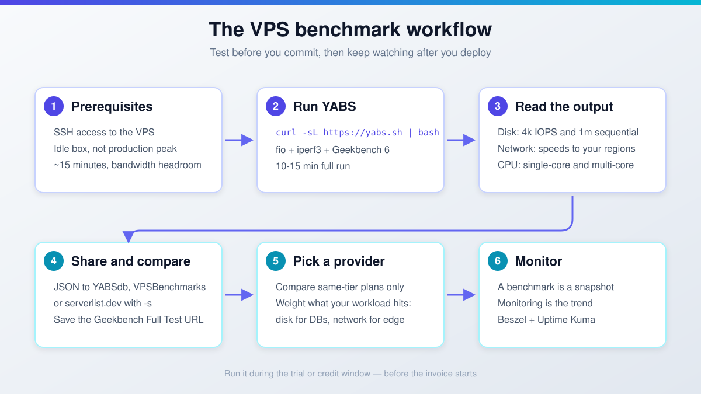
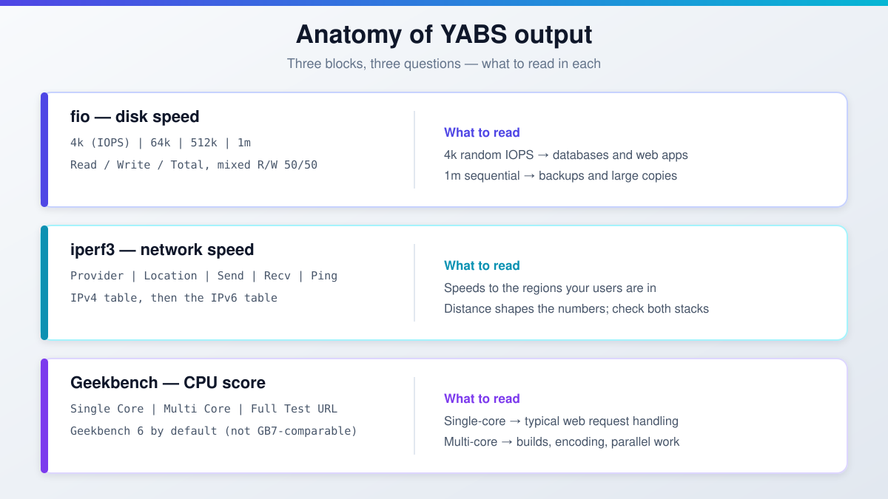

import Button from "@components/widgets/Button.astro";
import Notice from "@components/widgets/Notice.astro";
import ListCheck from "@components/widgets/ListCheck.astro";
import Accordion from "@components/widgets/Accordion.astro";
import Tabs from "@components/widgets/Tabs.astro";
import Tab from "@components/widgets/Tab.astro";

Before you commit to a provider, benchmark the cloud server. Specs on a pricing page don't tell you much: shared vCPU contention, noisy neighbors, and disk throttling decide what you get. A quick VPS benchmark shows the real numbers before money changes hands, and benchmarking a cloud server takes one command and about 15 minutes.

This guide covers how to benchmark cloud servers end to end: what to test, how to run YABS (the community-standard one-command suite), how to read and share the results, and which other VPS benchmark tools are worth knowing.

**Before you benchmark:**

<ListCheck>
<ul>
<li>SSH access to the VPS, or a trial/credit account where you can spin one up</li>
<li>About 15 minutes for a full YABS run</li>
<li>An unmetered or bandwidth-tolerant link. iperf3 saturates the port for ~20 seconds per test location</li>
<li>A non-production window or an idle server. fio and Geekbench peg disk and CPU</li>
</ul>
</ListCheck>

<Button link="https://go.bitdoze.com/do" text="DigitalOcean $100 Free" />
<Button link="https://go.bitdoze.com/vultr" text="Vultr $100 Free" />
<Button link="https://go.bitdoze.com/hetzner" text="Hetzner €20 Free" />
<Button link="https://go.bitdoze.com/hostinger-vps" text="Hostinger VPS" />

**Cost note:** run the benchmark during the free-trial or credit window, before you commit. The test costs nothing but time and a few GB of bandwidth. The plan costs real money every month after that.

_VPS prices jumped across the board in 2026. If you're rethinking a rented box, see [what changed and when a mini PC wins](/vps-price-increases/)._



## What to benchmark on a VPS

Three things decide how a VPS feels in production. Test all three. A provider that wins two and loses the third will still hurt.

### Disk I/O

Random read/write with small block sizes (4k) drives databases and web apps. Sequential throughput (1m blocks) matters for backups and large file copies. fio is the tool that measures this properly, and YABS runs it for you.

NVMe is standard on most providers now, but some budget tiers still cap IOPS or throttle bursts after a few seconds. As a rule of thumb (not a benchmark claim), 4k random IOPS above ~20k is decent for a shared vCPU plan. If a database will live on this box, this is the number to care about most.

### Network throughput

A 10 Gbps uplink means nothing if peering to your users is bad. Test to the regions your users are in, and check both IPv4 and IPv6. iperf3 is the standard tool; YABS runs it against a list of public endpoints.

Mind the bandwidth cost: iperf3 maxes the port for roughly 20 seconds per location. On a metered link that adds up, so use YABS `-r` for fewer locations or `-i` to skip network entirely.

### CPU performance (Geekbench 6 vs 7)

Single-core score matters for most web workloads (PHP, Node, typical request handling). Multi-core matters for builds, encoding, and anything that runs in parallel.

Geekbench 7.0.0 is out, and YABS can run it with the `-7` flag (added 24 Jul 2026). YABS still defaults to Geekbench 6 (build 6.7.1) because most published VPS comparisons use GB6. If you want to compare against results floating around forums and comparison sites, stay on the default.

<Notice type="warning" title="Geekbench 7 scores are not comparable with Geekbench 6">
Major-version bumps rescale the baseline. Pick one scale and stick to it when comparing providers. Geekbench 5 (`-5`) exists only for reproducing older threads and tables.
</Notice>

## YABS: the one-command VPS benchmark

[YABS](https://github.com/masonr/yet-another-bench-script) (Yet-Another-Bench-Script) runs all three tests in one go: fio for disk, iperf3 for network, Geekbench 6 for CPU. Nothing to install: it downloads portable static binaries and runs them. A full run takes about 10-15 minutes. It is the community standard; [stats.yabs.sh](https://stats.yabs.sh/) publishes run counts by country and hour if you want proof the ecosystem is alive.

Run it:

```
curl -sL https://yabs.sh | bash
```

**Verify the run:** you should get Basic System Information, a fio disk table, an iperf3 table for IPv4 and IPv6, a Geekbench row with a Full Test URL, and a closing `YABS completed in X min Y sec` line. If it dies partway, the log shows where. Usually it's the network legs.

**Common failure modes:**

- If the iperf legs crawl or time out, you hit a bandwidth cap or a slow uplink. Re-run with `-r` (fewer locations) or `-i` (skip network).
- If the results look too good or too bad, you benched a busy box. See the ops warning below.
- If Geekbench fails or prints nonsense, suspect container virtualization (LXC/OpenVZ). Check the `VM Type` line in the output.

<Notice type="warning" title="Do not benchmark a busy production server">
fio and Geekbench peg disk and CPU; iperf3 saturates the NIC for ~20 seconds per location. Run this in a maintenance window or on an idle box. Do it during the trial window, then again after any provider maintenance so you have before/after numbers.
</Notice>

### Useful YABS flags

The defaults are fine for a first run. These flags matter when you need to narrow, repeat, or automate the test:

| Flag | What it does |
|---|---|
| `-r` | Reduced iperf locations (less bandwidth used) |
| `-i` | Skip network tests entirely |
| `-f` | Skip disk tests |
| `-g` | Skip Geekbench |
| `-5` / `-7` / `-6` | Run Geekbench 5 / 7 / re-enable 6 (the default) |
| `-4` / `-9` | Geekbench 4 / Geekbench 4+5 |
| `-j` | Print JSON results to the screen |
| `-w <file>` | Write JSON results to a file |
| `-s <url>` | Submit JSON to a results site (comma-separate for several) |
| `-b` | Force the bundled fio/iperf3 binaries |
| `-n` | Skip the network-info (ASN) block |

Combine flags after `--`:

```
curl -sL https://yabs.sh | bash -s -- -r
```

One footgun worth knowing: locally installed fio/iperf3 packages take precedence over YABS's bundled binaries by default. If two machines produce numbers that don't line up, differing tool builds may be the reason. `-b` forces the bundled builds (fio 3.42 and iperf3 3.21 as of the 19 Sep 2026 rebuild) and makes runs comparable.

### Reading the YABS output

<Notice type="info" title="Sample output">
The block below is illustrative sample output. Real numbers vary by plan, region, and time of day.
</Notice>

Here is roughly what the output looks like on a Hetzner CX32 (4 vCPU AMD EPYC, 8 GB shared):

```
# ## ## ## ## ## ## ## ## ## ## ## ## ## ## ## ## ## #
#              Yet-Another-Bench-Script              #
#                     v2026-09-20                    #
# https://github.com/masonr/yet-another-bench-script #
# ## ## ## ## ## ## ## ## ## ## ## ## ## ## ## ## ## #

Thu Sep 24 11:32:39 AM UTC 2026

Basic System Information:
---------------------------------
Uptime     : 0 days, 0 hours, 30 minutes
Processor  : AMD EPYC-Rome Processor
CPU cores  : 4 @ 2445.404 MHz
AES-NI     : ✔ Enabled
VM-x/AMD-V : ❌ Disabled
RAM        : 7.6 GiB
Swap       : 0.0 KiB
Disk       : 75.0 GiB
Distro     : Ubuntu 24.04.3 LTS
Kernel     : 6.8.0-71-generic
VM Type    : KVM
IPv4/IPv6  : ✔ Online / ✔ Online

fio Disk Speed Tests (Mixed R/W 50/50):
---------------------------------
Block Size | 4k            (IOPS) | 64k           (IOPS)
  ------   | ---            ----  | ----           ----
Read       | 115.01 MB/s  (28.7k) | 988.49 MB/s  (15.4k)
Write      | 115.32 MB/s  (28.8k) | 993.69 MB/s  (15.5k)
Total      | 230.34 MB/s  (57.5k) | 1.98 GB/s    (30.9k)
           |                      |
Block Size | 512k          (IOPS) | 1m            (IOPS)
  ------   | ---            ----  | ----           ----
Read       | 1.78 GB/s     (3.4k) | 2.16 GB/s     (2.1k)
Write      | 1.88 GB/s     (3.6k) | 2.30 GB/s     (2.2k)
Total      | 3.66 GB/s     (7.1k) | 4.46 GB/s     (4.3k)

iperf3 Network Speed Tests (IPv4):
---------------------------------
Provider        | Location (Link)           | Send Speed      | Recv Speed      | Ping
-----           | -----                     | ----            | ----            | ----
Clouvider       | London, UK (10G)          | 5.16 Gbits/sec  | 5.60 Gbits/sec  | 17.8 ms
Eranium         | Amsterdam, NL (100G)      | 12.3 Gbits/sec  | 12.8 Gbits/sec  | 9.27 ms
Uztelecom       | Tashkent, UZ (10G)        | 1.96 Gbits/sec  | 2.24 Gbits/sec  | 94.6 ms
Leaseweb        | Singapore, SG (10G)       | 665 Mbits/sec   | 841 Mbits/sec   | 166 ms
Clouvider       | Los Angeles, CA, US (10G) | 1.03 Gbits/sec  | 1.21 Gbits/sec  | 158 ms
Leaseweb        | NYC, NY, US (10G)         | 1.88 Gbits/sec  | 2.53 Gbits/sec  | 97.7 ms
Edgoo           | Sao Paulo, BR (1G)        | 616 Mbits/sec   | 1.14 Gbits/sec  | 219 ms

Geekbench 6 Benchmark Test:
---------------------------------
Test            | Value
                |
Single Core     | 1508
Multi Core      | 4919

YABS completed in 12 min 35 sec
```

**What to look for in these results:**

On disk, 4k random IOPS above ~20k is decent for a shared vCPU plan (rule of thumb). The ~115 MB/s at 4k block size is typical of a cost-optimized tier: [Hetzner's cost-optimized plans](/hetzner-cloud-cost-optimized-plans/) trade IOPS for price, and regular and dedicated tiers run higher. If you want numbers you can trust, run it yourself during the [Hetzner Cloud](https://go.bitdoze.com/hetzner) trial.

On the network side, 12+ Gbps to Amsterdam is excellent (that box is nearby), while the drop to ~840 Mbps to Singapore is distance and peering, not a defect. Focus on the regions your users are in, and remember the run also prints an IPv6 table if the box is dual-stack.

For CPU, a Geekbench 6 single-core score around 1500 is solid for a shared EPYC vCPU. Dedicated cores typically land somewhere around 1800-2200+. Treat that as a rough expectation, not a guarantee.

A real run also prints a `Full Test` URL pointing at your result in the Geekbench Browser. Save it. That URL is your shareable CPU record.

**Decode the header lines the walkthrough tends to skip:**

- The `VM Type` line tells you the virtualization. KVM is the norm for cloud VPS. LXC/OpenVZ containers benchmark differently, and Geekbench can fail or misreport there. If you see LXC, treat the CPU numbers with suspicion.
- `AES-NI` is hardware AES acceleration. It matters for TLS, VPNs, and proxies. If it's disabled, those workloads will be slower than the core count suggests.
- The `IPv4/IPv6` line should show both Online if you bought dual-stack. If one is down, test the stack you'll serve traffic on.



### Share your YABS results online

Raw text output is painful to compare. JSON is the shareable form, and YABS can print it, write it, or submit it straight to results databases.

<Tabs>
<Tab name="YABSdb">
The lightweight public database of YABS runs. Submit and get a permalink back:

```
curl -sL yabs.sh | bash -s -- -s "https://yabsdb.com/add"
```
</Tab>
<Tab name="VPSBenchmarks">
Feeds the comparison site directly, so your run shows up next to other providers' numbers:

```
curl -sL yabs.sh | bash -s -- -s https://www.vpsbenchmarks.com/yabs/upload
```
</Tab>
<Tab name="serverlist.dev">
Another public results index with a JSON API:

```
curl -sL yabs.sh | bash -s -- -s "https://serverlist.dev/api/v1/yabs/submit"
```
</Tab>
</Tabs>

You can submit to several targets in one run; comma-separate the URLs in `-s`. For local records, `-j` prints JSON to the screen and `-w result.json` writes it to a file.

<Notice type="info" title="More places to publish">
[ServerVerify](https://serververify.com/benchmarks) keeps results on an account basis if you want a permanent history. If you buy a Geekbench license, drop it next to the script with `echo "email@domain.com KEY" > geekbench.license` to unlock the full Geekbench features in every run.
</Notice>

### Is `curl | bash` safe?

Piping a remote script into bash is a trust decision, and you should treat it as one. For YABS specifically, the supply chain is better than most: its fio and iperf3 static binaries are built in automated GitHub Actions workflows (Holy Build Box) and published as release assets with **SHA-256 checksums and VirusTotal scans**. The latest rebuild, 19 Sep 2026, ships fio 3.42 and iperf3 3.21 for x64, x86, aarch64, and arm.

<Notice type="info" title="Why this matters">
Checksummed, virus-scanned release binaries are a stronger story than "trust me, the script downloads a binary." You can verify what will run before it runs.
</Notice>

Still, read the script first on anything that matters:

```
curl -sL https://yabs.sh | less
```

<Notice type="warning" title="Read before you pipe">
YABS is non-installing: it downloads binaries, runs tests, and cleans up. But it will peg CPU, disk, and network while it runs. Read it, then run it on an idle box.
</Notice>

**ARM note:** YABS's aarch64 support is still labeled experimental in the README. Geekbench itself runs fine on ARM. If you're shopping ARM VPS, see [our ARM vs x86 VPS benchmark comparison](/arm-vs-x86-vps-server-benchmarks/) and the [Hetzner vs Oracle ARM VPS performance comparison](/hetzner-oracle-arm-performance/).

## More VPS benchmark tools worth knowing

YABS covers the standard case. When you need more detail, or a faster check, these are the tools that are still worth running:

| Tool | Tests | When to use | Status |
|---|---|---|---|
| [bench.sh](https://bench.sh/) | Disk + network | Fastest full check, no CPU test | Active (teddysun, 2015-2026) |
| YABS | Disk + network + CPU | Default choice, comparable results | Active (v2026-09-20) |
| [fio](https://github.com/axboe/fio) | Disk only | Custom block sizes, queue depths, patterns | Industry standard |
| [Geekbench](https://www.geekbench.com/) | CPU only | Standardized cross-provider CPU scores | Active (6.7.1 / 7.0.0) |
| [sysbench](https://github.com/akopytov/sysbench) | CPU, memory, file I/O, MySQL | Database workload testing | Stable, dormant (1.0.20) |
| [NodeQuality](https://nodequality.com/) | Suite + IP/hardware quality | Sandboxed all-in-one with shareable report | Community-maintained |
| nench | Disk + network + CPU | Only to reproduce old comparisons | Abandoned since 2019 |

bench.sh is the fastest disk+network check, with no CPU benchmark. Good when you only want to sanity-check a network path or disk tier:

```
wget -qO- bench.sh | bash
```

When YABS's defaults don't match your workload, run fio yourself:

```
fio --randrepeat=1 --ioengine=libaio --direct=1 --gtod_reduce=1 \
  --name=test --filename=test --bs=4k --iodepth=64 --size=1G \
  --readwrite=randrw --rwmixread=75
```

`--direct=1` bypasses the page cache, so leave it in or the numbers lie. Manual fio runs leave the `test` file behind. Delete it (`rm -f test`) so you don't eat disk quota. YABS cleans up after itself.

Run Geekbench alone if you only care about CPU. Current builds are 6.7.1 and 7.0.0; scores are comparable only within a major version. Check [browser.geekbench.com](https://browser.geekbench.com/) for your provider and plan. Many people post results publicly.

sysbench is still the right tool for database workloads: CPU, memory, file I/O, and MySQL/PostgreSQL tests. Honest status check: stable but dormant, latest release 1.0.20 back in 2020. It works; don't expect fixes.

NodeQuality is an all-in-one suite that runs everything in a temporary sandbox and deletes the traces afterwards, plus hardware info, IP quality, and network quality in one shareable report. It's community-maintained (the README is mostly Chinese), so grab the current invocation from [nodequality.com](https://nodequality.com/) before running it. It's in the `bash <(curl -sL run.nodequality.com)` style. Test it on a throwaway box first.

<Notice type="warning" title="nench is dead, don't use it">
The `nench.sh` domain no longer resolves, and the repo (n-st/nench) has been untouched since December 2019. Old guides still recommend it; ignore them. If you need to reproduce a 2018-era comparison, the raw script still exists at `https://raw.githubusercontent.com/n-st/nench/master/nench.sh`. For anything current, use YABS.
</Notice>

**Rollback/teardown:** there isn't much to undo. YABS doesn't install anything; it downloads binaries, tests, and removes its disk test file. The only cleanup duty is manual fio runs: delete the test file you passed to `--filename`.

## Tips for reliable VPS benchmark results

A single run is a data point, not a verdict. When you benchmark cloud servers, get a range you can act on:

<ListCheck>
<ul>
<li>Run each benchmark at least three times to get a range, not a lucky number</li>
<li>Run at the same hour across providers, back-to-back. Time-of-day variance is worst on oversold shared vCPU plans</li>
<li>Test during the traffic hours you'll serve. Business-hour contention is the number that matters</li>
<li>Compare same-tier plans only. Don't pit a $4/month shared vCPU against a $40/month dedicated-core box</li>
<li>Benchmark inside the trial or credit window, then re-run after any provider maintenance</li>
<li>Check the Geekbench Browser for your provider and plan: search [browser.geekbench.com](https://browser.geekbench.com/)</li>
<li>Save every result (the YABS output, the JSON file, the Geekbench URL) so you have a before/after record</li>
</ul>
</ListCheck>

## Where to compare VPS benchmark results

Don't start from zero. Search other people's results first, publish yours, then decide.

Search before you test:

- [VPSBenchmarks.com](https://www.vpsbenchmarks.com/): side-by-side comparisons built from real test data, and it accepts YABS uploads directly
- [VPS Metrics](https://vpsmetrics.com/benchmarks/): filterable benchmark database. Note: it returns 403 to plain `curl` but loads fine in a browser. It's alive, not dead
- [LowEndTalk](https://lowendtalk.com/): community forum where people post YABS results unfiltered
- [stats.yabs.sh](https://stats.yabs.sh/): run counts by country and hour; useful for seeing which providers people bother to bench

Then publish yours: YABSdb, serverlist.dev, and ServerVerify (see the sharing section above) turn your run into someone else's comparison data. That's how these databases stay useful.

When benchmark data points at a shortlist, go read the long-form reviews. The [DigitalOcean vs Vultr vs Hetzner comparison](/digitalocean-vs-vultr-vs-hetzner/) breaks down the usual three-way fight, and if you want real numbers from a self-hosted workload, the [Convex self-hosting benchmark results](/convex-self-hosted-benchmark/) show what a database tier looks like under load. If Hetzner is on your list, the [Hetzner Cloud review](/hetzner-cloud-review/) has benchmark results across multiple plan tiers.

## After the benchmark: pick, deploy, monitor

The benchmark gets you a shortlist. Then the real work starts.

Pick the box using the numbers your workload hits: disk IOPS for databases, network to your user regions for edge and API traffic, single-core score for typical web apps. Compare like for like.

Deploy during the credit window. This class of VPS runs roughly single-digit to low-double-digit euros per month: a 4 vCPU / 8 GB shared tier is about €7-8/month net on Hetzner (confirm current pricing before you budget). The benchmark itself costs only time and a few GB of bandwidth.

Monitor after go-live. A benchmark is a snapshot of one quiet afternoon; monitoring is the trend line. [Monitor real-world performance with Beszel and Uptime Kuma](/beszel-uptime-kuma/) so you catch the noisy neighbor the benchmark never saw.

Picked a box and want to put it to work? [Set up your VPS for AI coding agents](/vps-ai-coding-setup/).

<Button link="https://go.bitdoze.com/do" text="DigitalOcean $100 Free" />
<Button link="https://go.bitdoze.com/vultr" text="Vultr $100 Free" />
<Button link="https://go.bitdoze.com/hetzner" text="Hetzner €20 Free" />
<Button link="https://go.bitdoze.com/hostinger-vps" text="Hostinger VPS" />

## VPS benchmark FAQ

<Accordion label="How long does a YABS run take?" group="faq" expanded="true">
About 10-15 minutes for the full suite on a normal VPS. The iperf3 legs dominate on slow links: each location maxes the port for ~20 seconds. On a metered or slow uplink, use `-r` for fewer locations or `-i` to skip network tests and finish in a couple of minutes.
</Accordion>

<Accordion label="Is it safe to run a benchmark on a production server?" group="faq">
Not during peak. fio and Geekbench peg disk and CPU, and iperf3 saturates the NIC. Pick a maintenance window or an idle box. YABS cleans up its disk test file when it finishes; a manual fio run does not, so delete the test file yourself. And run the first pass in the trial window, before there's a production server to disturb.
</Accordion>

<Accordion label="Which Geekbench version should I compare with?" group="faq">
Geekbench 6 is the YABS default (build 6.7.1) and what nearly every published VPS comparison uses. Geekbench 7 (7.0.0) is available via `-7`, but its scores do not cross-compare with GB6. Use `-5` only when you need to reproduce numbers from old forum threads.
</Accordion>

<Accordion label="Why do my disk numbers vary between runs?" group="faq">
Four usual suspects: time-of-day contention on shared vCPU plans (worst mid-day), noisy neighbors on the same host, local fio builds overriding YABS's bundled ones (force consistency with `-b`), and page cache (not an issue with YABS, which uses `--direct=1`, but a real problem if you roll your own fio command and forget it).
</Accordion>

<Accordion label="Does YABS work on an ARM VPS?" group="faq">
Yes, with a caveat: ARM/aarch64 support is still labeled experimental in the YABS README. Geekbench itself runs on ARM. Expect the suite to work, but treat oddities in the ARM numbers with more skepticism than on x86. See the ARM note in the YABS section above for the comparison write-ups.
</Accordion>

<Accordion label="My VPS is LXC/OpenVZ and Geekbench failed. Why?" group="faq">
Container virtualization (LXC, OpenVZ) doesn't expose hardware the way KVM does. Geekbench can fail outright or misreport CPU scores there. The `VM Type` line in the YABS header tells you what you're on. KVM is the norm for cloud VPS now. If a provider sells you LXC, the CPU benchmark results are not comparable with KVM numbers.
</Accordion>
