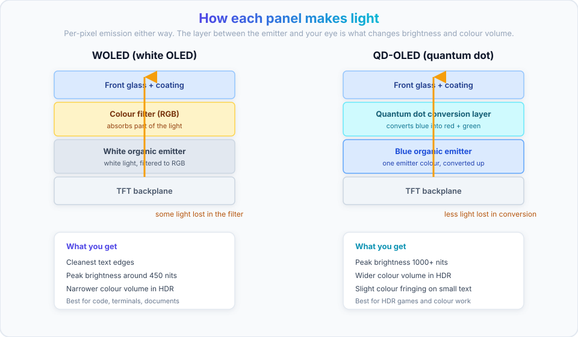
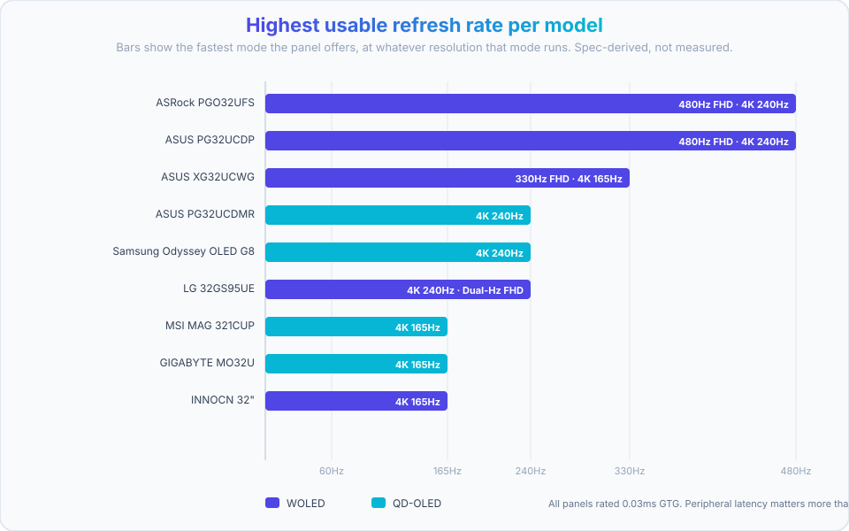
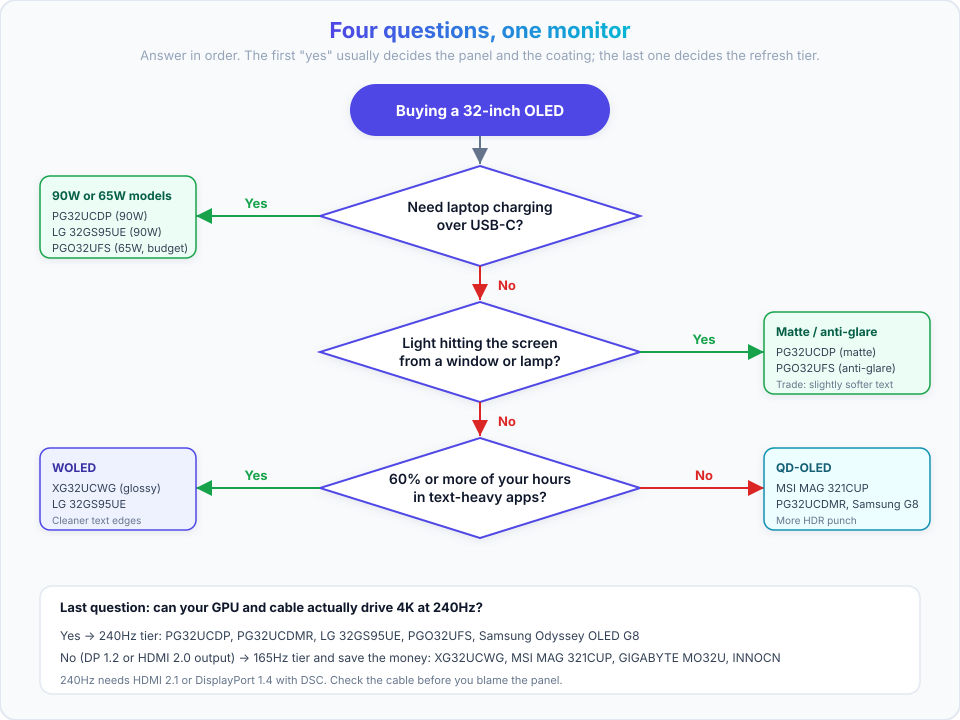
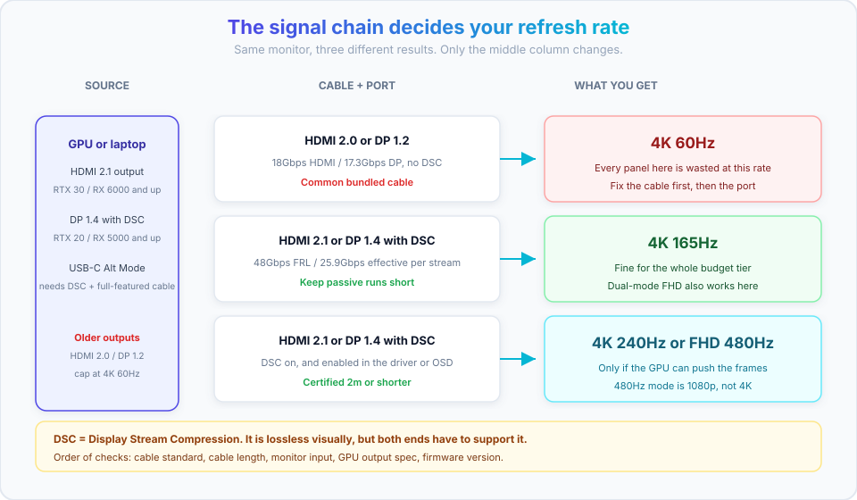

import Button from "@components/widgets/Button.astro";
import Notice from "@components/widgets/Notice.astro";
import ListCheck from "@components/widgets/ListCheck.astro";
import Accordion from "@components/widgets/Accordion.astro";
import Tabs from "@components/widgets/Tabs.astro";
import Tab from "@components/widgets/Tab.astro";

Best 32-inch OLED monitors in 2026 are finally mainstream. I reviewed the [ASUS ROG Strix OLED XG32UCWG](https://www.bitdoze.com/asus-rog-strix-oled-xg32ucwg-review/) thoroughly and wrote up my full ASUS ROG Strix OLED XG32UCWG review, and this guide is the round-up around it: 9 models across three price tiers, with the specs that actually change how the thing feels on your desk.

32 inches at 4K is the sweet spot right now. It gives you roughly the same pixel density as a 27-inch 1440p panel, so text doesn't need heavy scaling, and it's the largest size where a single monitor still works as your only screen. The OLED part removes the two things that used to annoy me on LCD: backlight bleed and grey-ish blacks in a dark room.

What follows is a spec-and-usage comparison, not a lab measurement dump. Panel type first, then budget, then the details people forget until the box is open: coating, USB-C power delivery, cable bandwidth, and OLED care settings. Jump to the [quick comparison](#quick-comparison-best-32-inch-oled-monitors-of-2026) if you already know your use case.

<Notice type="warning" title="Affiliate Disclosure">
Some links in this guide are affiliate links. If you buy through them, we may earn a small commission at no extra cost to you. This helps us keep testing and updating these recommendations.
</Notice>

## Quick comparison: best 32-inch OLED monitors of 2026

| Category | Pick | Street price | Why it wins |
|---|---|---|---|
| **Best overall** | ASUS ROG Strix OLED XG32UCWG (WOLED) | ~$1,000–1,100 | Best text clarity, TrueBlack Glossy, dual-mode 165/330Hz |
| **Best value** | MSI MAG 321CUP (QD-OLED) | ~$800–900 | Cheapest route into QD-OLED color at 4K |
| **Best premium** | ASUS PG32UCDMR (QD-OLED) | ~$1,200–1,400 | 4K 240Hz, 90W USB-C, heatsink cooling |
| **Best for bright rooms** | ASUS PG32UCDP (matte WOLED) | ~$1,100–1,200 | Matte anti-glare, 240Hz, 90W USB-C |
| **Best for gaming** | ASRock PGO32UFS or ASUS PG32UCDP | ~$900–1,000 / ~$1,100–1,200 | 480Hz FHD dual-mode, 0.03ms, VRR |

<Notice type="info" title="How to use this table">
- Pick by **use case first**, then by budget. Panel type follows your workload, coating follows your room, USB-C follows your laptop.
- Prices are approximate USD street ranges, not list prices. OLED pricing swings with every sale event, so confirm on the listing before you buy.
- The two most decision-relevant columns are in [Specs & refresh rate comparison](#specs--refresh-rate-comparison-table) and the flow is in [the decision framework](#step-by-step-decision-framework).
</Notice>

## QD-OLED vs WOLED: what's the difference?

Both technologies give you per-pixel light, so both give you true black and 0.03ms-class response. The difference is how the panel makes white and color, and that difference shows up in three places you will notice daily: text edges, peak brightness, and how the screen behaves in a lit room.



<Notice type="info" title="TL;DR">
Do 60%+ of your hours in text-heavy apps? Go WOLED. Want the punchiest HDR and the most saturated color? Go QD-OLED.
</Notice>

### WOLED (white OLED): best for text and productivity

A WOLED panel stacks a white organic emitter under color filters. The filters absorb part of the light, which is exactly why peak brightness in this class lands around 450 nits rather than 1000+, but it also means the sub-pixel layout stays simple and text edges stay clean. Vendors add extra processing on top (ASUS calls it Clear Pixel Edge, LG leans on its panel-level filtering), and the result is the least color-fringed text you'll get on any OLED.

Models in this guide using WOLED: ASUS XG32UCWG, ASUS PG32UCDP, LG 32GS95UE, ASRock PGO32UFS, INNOCN 32".

- **Pros:** best text rendering, lower fringing, generally cheaper to manufacture, lower burn-in risk profile in mixed use
- **Cons:** lower peak brightness, less color volume in HDR highlights, media content looks less "punchy"
- **Buy it if:** you write code, read documents, or stare at IDE and terminal windows for eight hours

### QD-OLED (quantum dot OLED): best for HDR and gaming

QD-OLED uses a blue emitter and converts part of that light through a quantum dot layer to produce red and green. No color filter means less light lost, so peak brightness and color volume are both higher, and HDR highlights genuinely pop. The trade-off is a more complex sub-pixel structure (visible as slight color fringing on small text if you sit close) and a known quirk: with ambient light hitting the panel, near-black areas can pick up a purple or grey cast.

Models in this guide using QD-OLED: MSI MAG 321CUP, GIGABYTE MO32U, ASUS PG32UCDMR, Samsung Odyssey OLED G8.

- **Pros:** higher peak brightness, wider color volume, better HDR impact
- **Cons:** more expensive, text slightly less crisp up close, black levels shift in a bright room
- **Buy it if:** gaming and HDR video are the priority and your room lighting is controllable

<Notice type="warning" title="The QD-OLED ambient light thing is real">
If a window or lamp hits the panel directly, QD-OLED blacks can read purple-ish instead of black. It's a panel property, not a defect, and it doesn't show up in a dark or controlled room. If you can't control the light, a matte WOLED is the safer pick.
</Notice>

## Best budget 32-inch OLED monitors (under $1,000)

This tier buys you the panel and not always the extras: expect 165Hz at 4K, no USB-C, and thinner OLED-care software than the premium models. The panels themselves are still 4K OLED with true black, which is the part you actually look at all day.

All prices below are approximate street ranges. OLED pricing moves fast, so confirm on the listing before you buy.

### 1. MSI MAG 321CUP QD-OLED


The MSI MAG 321CUP is the cheapest way into a 32-inch 4K QD-OLED that I'd actually recommend. You get the color volume of a quantum dot panel without the premium-tier price, and you give up USB-C and 240Hz to get there.

**Specifications**

| Feature | Details |
|---|---|
| **Panel type** | QD-OLED |
| **Resolution** | 4K UHD (3840 x 2160) |
| **Refresh rate** | 165Hz |
| **Response time** | 0.03ms (GTG) |
| **Coating** | Semi-glossy |
| **USB Type-C** | No |
| **HDR** | DisplayHDR True Black 400 |
| **Color gamut** | 99% DCI-P3 |
| **Connectivity** | 2x HDMI 2.1, 2x DP 1.4 |
| **VESA mount** | 100x100mm |

**Key highlights**

- QD-OLED color at the lowest tier price
- 165Hz with ClearMR 9000 motion certification
- OLED Care 2.0 for burn-in mitigation
- Two DisplayPort 1.4 inputs, which is rare at this price

<Notice type="info" title="Best value QD-OLED">
The MAG 321CUP keeps QD-OLED colors at a lower price than most of the field, which makes it the entry point I'd point a desktop-PC gamer to first.
</Notice>

> **Best For**: desktop gamers who want QD-OLED without paying premium prices and don't need USB-C.

**Skip it if:** you need laptop charging over USB-C, or you want 240Hz at 4K. Both are premium-tier features.

<Button text="Check MSI MAG 321CUP Price" link="/go/msi-mag-321cup/" size="lg" color="blue" variant="solid" />

---

### 2. GIGABYTE MO32U QD-OLED


The MO32U is the same panel class as the MSI but with gaming furniture: a built-in KVM and, more importantly, the strongest warranty in this tier. GIGABYTE covers burn-in for three years, which is worth real money on an organic panel.

**Specifications**

| Feature | Details |
|---|---|
| **Panel type** | QD-OLED |
| **Resolution** | 4K UHD (3840 x 2160) |
| **Refresh rate** | 165Hz |
| **Response time** | 0.03ms (GTG) |
| **Coating** | Semi-glossy |
| **USB Type-C** | No |
| **HDR** | DisplayHDR True Black 400 |
| **Color gamut** | 99% DCI-P3 |
| **Connectivity** | 2x HDMI 2.1, 1x DP 1.4 |
| **VESA mount** | 100x100mm |

**Key highlights**

- **3-year warranty including burn-in** (the standout feature in this tier)
- Built-in KVM, so one keyboard and mouse drive two machines
- GIGABYTE OLED Care with static-element detection
- 165Hz with a single DP 1.4 input

> **Best For**: desktop users who want QD-OLED plus KVM and the best burn-in coverage on a budget.

**Skip it if:** you need USB-C power delivery. There isn't a Type-C port at all here.

<Button text="Check GIGABYTE MO32U Price" link="/go/gigabyte-mo32u/" size="lg" color="green" variant="solid" />

---

### 3. INNOCN 32" 4K OLED Monitor


This is the price floor for a 32-inch 4K OLED. WOLED panel, 165Hz, glossy coating, no USB-C, HDR400 certification only.

**Specifications**

| Feature | Details |
|---|---|
| **Panel type** | WOLED |
| **Resolution** | 4K UHD (3840 x 2160) |
| **Refresh rate** | 165Hz |
| **Response time** | 0.03ms (GTG) |
| **Coating** | Glossy |
| **USB Type-C** | No |
| **HDR** | HDR400 |
| **Color gamut** | 99% DCI-P3 |
| **Connectivity** | 2x HDMI 2.1, 1x DP 1.4 |
| **VESA mount** | 100x100mm |

**Key highlights**

- Cheapest 32-inch OLED in this guide
- WOLED panel, so text rendering is decent
- 165Hz is enough for most gaming
- Basic OSD feature set

<Notice type="warning" title="Cheapest is not always best value">
I have not tested this one. It's here as the price-floor option, and the two compromises to price in are the glossy coating (it will mirror a window or a lamp) and the HDR400 rating (no true-black HDR certification, no meaningful HDR highlights). If either of those matters to you, spend the extra on the MSI.
</Notice>

> **Best For**: buyers whose hard constraint is price and who work in a room they can darken.

**Skip it if:** your room gets daylight on the screen, or you care about HDR. Glossy plus HDR400 is the wrong combination for both.

<Button text="Check INNOCN Monitor Price" link="/go/innocn-32-oled/" size="lg" color="green" variant="solid" />

---

### 4. ASRock PGO32UFS WOLED (240Hz/480Hz)

The PGO32UFS is the odd one out in this tier: it's the only budget-class 32-inch OLED with dual-mode 4K@240Hz / FHD@480Hz, 65W USB-C power delivery, and an anti-glare coating. It also has an integrated Wi-Fi antenna, which sounds like a gimmick until you realise it's there to keep your desktop's Wi-Fi adapter from being buried behind a big metal panel.

**Specifications**

| Feature | Details |
|---|---|
| **Panel type** | WOLED |
| **Resolution** | 4K UHD (3840 x 2160) |
| **Refresh rate** | 240Hz (4K) / 480Hz (FHD) |
| **Response time** | 0.03ms (GTG) |
| **Coating** | Anti-glare |
| **USB Type-C** | Yes (65W PD) |
| **HDR** | DisplayHDR True Black 400 |
| **Color gamut** | 99% DCI-P3 |
| **Connectivity** | 2x HDMI 2.1, 2x DP 1.4, USB-C |
| **Special features** | Integrated Wi-Fi antenna, KVM |

**Key highlights**

- **Dual-mode: 4K@240Hz or FHD@480Hz** from the OSD
- **65W USB-C PD** charges most ultrabooks over the same cable as the display signal
- Integrated Wi-Fi antenna (Wi-Fi 4/5/6/6E/7)
- KVM switch for two machines, one keyboard
- Anti-glare coating, so it works in a room with windows

<Notice type="warning" title="Availability">
This model isn't sold in every region. Check with a local dealer before you plan a build around it.
</Notice>

> **Best For**: a one-monitor desk that has to charge a laptop and still game competitively.

**Skip it if:** you're outside its sales regions, or you need 90W of power delivery for a 16-inch laptop under load. 65W covers ultrabooks, not a MacBook Pro at full tilt.

<Button text="Visit ASRock PGO32UFS" link="https://pg.asrock.com/Monitors/PGO32UFS/index.asp" size="lg" color="green" variant="solid" />

Once it's on the desk, work through the [first-boot checklist](#setting-up-your-32-inch-oled-monitor) before you judge the panel. Running 165Hz for six months because nobody opened the display settings is the most common regret with these monitors.

---

## Best premium 32-inch OLED monitors ($1,000+)

At this tier you're not buying a better panel, you're buying 4K at 240Hz, 90W USB-C power delivery, better OLED-care tooling, and cooling that keeps brightness stable under sustained HDR. The image quality gap over the budget tier is smaller than the feature gap.

### 1. ASUS ROG Strix OLED XG32UCWG — top pick


This is the monitor I use daily for both work and gaming, and the one I've spent the most hours behind. The TrueBlack Glossy coating is the whole reason it's here: it's glossy enough to keep text razor sharp, but it reflects noticeably less than a standard glossy panel.

**Specifications**

| Feature | Details |
|---|---|
| **Panel type** | WOLED |
| **Resolution** | 4K UHD (3840 x 2160) |
| **Refresh rate** | 165Hz (4K) / 330Hz (FHD) |
| **Response time** | 0.03ms (GTG) |
| **Coating** | TrueBlack Glossy |
| **USB Type-C** | Yes, 15W PD only |
| **HDR** | DisplayHDR True Black 400 |
| **Color gamut** | 99% DCI-P3, Delta E < 2 |
| **Connectivity** | 2x HDMI 2.1, 1x DP 1.4, USB-C |
| **Stand** | Compact, ~45% smaller footprint |

**Key highlights**

- **TrueBlack Glossy coating**, measured at roughly 38% less reflection than standard glossy
- **Clear Pixel Edge** text processing, the best text rendering of the nine here
- **Dual-mode**: 4K@165Hz or FHD@330Hz from a hotkey
- OLED Care Pro with a Neo Proximity Sensor that blanks the panel when you walk away
- Compact stand that frees up desk space for a keyboard and a notebook
- Factory calibrated to Delta E < 2

**Why I picked this one**

I've run this panel with a MacBook Pro M1 for productivity work and it holds up. The TrueBlack Glossy surface keeps text sharp without throwing a window reflection at me, even with a window in front of my desk. The 15W USB-C is the honest weak point: it carries the display signal fine, but it won't charge a laptop, so I charge separately and accept one extra cable in exchange for the sharper coating and text.

**Pros**

- Best text clarity of every panel in this guide
- Minimal reflections despite being glossy
- Excellent macOS compatibility and scaling behaviour
- Dual-mode flexibility for occasional gaming
- Compact stand, more usable desk area

**Cons**

- 15W USB-C only, so no single-cable laptop setup
- Lower peak brightness than QD-OLED
- Premium price for a 165Hz 4K panel

<Notice type="success" title="My recommendation">
After using the XG32UCWG daily, the TrueBlack Glossy coating and text clarity are what keep it on my desk. If your hours are mostly text, this is the one to check first. Full details in my full ASUS ROG Strix OLED XG32UCWG review.
</Notice>

> **Read the deep dive**: [my full ASUS ROG Strix OLED XG32UCWG review](https://www.bitdoze.com/asus-rog-strix-oled-xg32ucwg-review/)

<Button text="Get the XG32UCWG on Amazon" link="/go/asus-xg32ucwg/" size="lg" color="blue" variant="solid" />

---

### 2. ASUS ROG Swift OLED PG32UCDP (matte WOLED)


The PG32UCDP is the sibling of the XG32UCWG for people who can't control their light: same WOLED family, matte anti-glare surface, and 240Hz at 4K with a 480Hz FHD mode. It's also the model that solves the 15W problem, at 90W USB-C PD.

**Specifications**

| Feature | Details |
|---|---|
| **Panel type** | WOLED |
| **Resolution** | 4K UHD (3840 x 2160) |
| **Refresh rate** | 240Hz (4K) / 480Hz (FHD) |
| **Response time** | 0.03ms (GTG) |
| **Coating** | Matte anti-glare |
| **USB Type-C** | Yes (90W PD) |
| **HDR** | DisplayHDR True Black 400 |
| **Color gamut** | 99% DCI-P3, Delta E < 2 |
| **Connectivity** | 2x HDMI 2.1, 1x DP 1.4, USB-C |
| **Stand** | Ergonomic, height and pivot adjustable |

**Key highlights**

- Matte coating keeps reflections out of the picture in a bright room
- **90W USB-C PD** charges a 14–16 inch laptop while carrying the display signal
- 4K@240Hz or FHD@480Hz dual-mode
- OLED Care Pro plus a uniform brightness setting
- AI Assistant features for dynamic shadow and crosshair work

**How it compares to the XG32UCWG**

- **Better for:** bright rooms, 240Hz gaming, single-cable laptop charging
- **Trade-off:** matte surfaces soften fine text slightly, so the XG32UCWG still wins on sharpness
- **Price:** comparable tier, sometimes cheaper depending on the sale

> **Best For**: bright rooms, and anyone who wants one cable to charge a laptop and drive 4K 240Hz.

**Skip it if:** text sharpness is your number one criterion. Matte coating costs you a little crispness, and that's the trade.

<Button text="Get the PG32UCDP on Amazon" link="/go/asus-pg32ucdp/" size="lg" color="green" variant="solid" />

---

### 3. ASUS ROG Swift OLED PG32UCDMR (QD-OLED)


The PG32UCDMR is the maximum-image-quality pick: QD-OLED, 4K 240Hz, 90W USB-C, and a custom heatsink with a graphene film that keeps brightness stable in long HDR sessions. If you edit color for a living and want the panel to hold its output for hours, this is the tier above the rest.

**Specifications**

| Feature | Details |
|---|---|
| **Panel type** | QD-OLED |
| **Resolution** | 4K UHD (3840 x 2160) |
| **Refresh rate** | 240Hz |
| **Response time** | 0.03ms (GTG) |
| **Coating** | Semi-glossy |
| **USB Type-C** | Yes (90W PD) |
| **HDR** | DisplayHDR True Black 400 |
| **Color gamut** | 99% DCI-P3, Delta E < 2 |
| **Connectivity** | 2x HDMI 2.1, 1x DP 1.4, USB-C |
| **Special** | Custom heatsink with graphene film |

**Key highlights**

- QD-OLED color volume, the most vibrant HDR of the nine
- 240Hz at 4K with VRR support
- 90W USB-C PD for laptop workflows
- Advanced thermal management, so brightness doesn't sag over a long session

> **Best For**: buyers who want the best image quality available and can accept premium pricing.

**Skip it if:** you work mostly in text, or your room light hits the screen directly. This is the panel where the QD-OLED ambient-light behaviour is most visible.

<Button text="Get the PG32UCDMR on Amazon" link="/go/asus-pg32ucdmr/" size="lg" color="green" variant="solid" />

---

### 4. Samsung Odyssey OLED G8 (LS32FG810SNXZA)


Samsung's 32-inch QD-OLED is a smart monitor: it runs apps and streaming services on its own, without a PC attached. If you also use the screen for TV duty, that's genuinely useful. If you never will, you're paying for hardware you won't use.

**Specifications**

| Feature | Details |
|---|---|
| **Panel type** | QD-OLED |
| **Resolution** | 4K UHD (3840 x 2160) |
| **Refresh rate** | 240Hz |
| **Response time** | 0.03ms (GTG) |
| **Coating** | Semi-glossy |
| **USB Type-C** | No |
| **HDR** | HDR True Black 400 |
| **Color gamut** | 99% DCI-P3 |
| **Connectivity** | 2x HDMI 2.1, 1x DP 1.4 |
| **Special** | Samsung OLED Safeguard+ |

**Key highlights**

- QD-OLED 4K 240Hz with AMD FreeSync Premium Pro
- Smart TV apps and the Samsung ecosystem built in
- OLED Safeguard+ for burn-in mitigation
- **No USB-C**, so no single-cable laptop setup

> **Best For**: Samsung ecosystem users who want QD-OLED and will actually use the smart features.

**Skip it if:** you have a laptop and want one cable. There is no USB-C port on this model.

<Button text="Get Samsung LS32FG810SNXZA" link="/go/samsung-g8-oled-32/" size="lg" color="red" variant="solid" />

---

### 5. LG UltraGear 32GS95UE


LG builds the panels most of this category runs on, and the 32GS95UE is the WOLED showcase: 4K 240Hz, 90W USB-C, FreeSync Premium Pro plus G-SYNC compatibility, and solid panel-level protection.

**Specifications**

| Feature | Details |
|---|---|
| **Panel type** | WOLED |
| **Resolution** | 4K UHD (3840 x 2160) |
| **Refresh rate** | 240Hz (4K), Dual-Hz FHD mode |
| **Response time** | 0.03ms (GTG) |
| **Coating** | Semi-glossy |
| **USB Type-C** | Yes (90W PD) |
| **HDR** | DisplayHDR True Black 400 |
| **Color gamut** | 99% DCI-P3 |
| **Connectivity** | 2x HDMI 2.1, 1x DP 1.4, USB-C |
| **Special** | Advanced cooling system |

**Key highlights**

- 4K 240Hz WOLED with 90W USB-C PD
- Dual-Hz mode for high-refresh 1080p play (confirm the mode set on the current SKU before buying)
- AMD FreeSync Premium Pro and G-SYNC compatible
- Both major VRR ecosystems covered, which matters if you switch GPU brands
- Panel-level OLED care from the manufacturer that makes most of these panels
- Ergonomic stand with height and tilt adjustment

> **Best For**: buyers who want WOLED text quality, 240Hz, and laptop charging from a brand with a long OLED track record.

**Skip it if:** QD-OLED HDR punch is your priority. This is the brightness-traditional WOLED route.

<Button text="Get LG 32GS95UE" link="/go/lg-32gs95ue/" size="lg" color="green" variant="solid" />

---

## Specs & refresh rate comparison table

Every monitor here is 4K UHD and at least 165Hz, so **refresh rate isn't the differentiator, dual-mode, coating, and USB-C power delivery are**. Read the table with your two or three hard requirements in mind and ignore the rest of the columns.

| Monitor | Panel | Refresh (4K / FHD) | Coating | USB-C PD | HDR | Street price | Best for |
|---|---|---|---|---|---|---|---|
| INNOCN 32" | WOLED | 165Hz / — | Glossy | No | HDR400 | ~$700–800 | Price floor |
| MSI MAG 321CUP | QD-OLED | 165Hz / — | Semi-glossy | No | TB400 | ~$800–900 | QD-OLED value |
| GIGABYTE MO32U | QD-OLED | 165Hz / — | Semi-glossy | No | TB400 | ~$850–950 | KVM + warranty |
| ASRock PGO32UFS | WOLED | 240Hz / 480Hz | Anti-glare | 65W | TB400 | ~$900–1,000 | Cheap dual-mode |
| ASUS XG32UCWG | WOLED | 165Hz / 330Hz | TrueBlack Glossy | 15W | TB400 | ~$1,000–1,100 | Text and mixed use |
| ASUS PG32UCDP | WOLED | 240Hz / 480Hz | Matte | 90W | TB400 | ~$1,100–1,200 | Bright rooms |
| ASUS PG32UCDMR | QD-OLED | 240Hz / — | Semi-glossy | 90W | TB400 | ~$1,200–1,400 | Best image quality |
| LG 32GS95UE | WOLED | 240Hz / dual-mode | Semi-glossy | 90W | TB400 | ~$1,200–1,400 | Balanced premium |
| Samsung Odyssey OLED G8 | QD-OLED | 240Hz / — | Semi-glossy | No | TB400 | ~$1,300–1,500 | Smart features |

<Notice type="info" title="Reading the table">
- **USB-C PD column:** `15W` means display signal only (it will not charge a laptop), `65W` charges most ultrabooks, `90W` charges a 14–16" MacBook Pro under load. `No` means there is no Type-C port at all.
- **TB400** is VESA DisplayHDR True Black 400. Plain `HDR400` (the INNOCN) is a much weaker certification: no true-black requirement and no meaningful contrast spec.
- **Refresh (4K / FHD)** in this class always means 4K at the first number and a lower resolution at a higher refresh in the second, switched from the OSD.
</Notice>

Two practical notes before you compare Refresh Rate numbers:

**240Hz is the ceiling for a reason.** 4K at 240Hz needs roughly 4x the bandwidth of 4K at 60Hz. It works over HDMI 2.1 or DisplayPort 1.4 with DSC, which means your GPU generation and your cable both matter. Jump to [cables and bandwidth](#cables-and-bandwidth-getting-4k-240hz-to-actually-display) for the specifics.

**480Hz FHD is a 1080p mode.** You're trading resolution for refresh in competitive shooters only. It is not a mode you'll use for work, and it needs a GPU that can actually push 480 frames at 1080p, not just a monitor that accepts the signal.

## Key features that actually matter

Two specs change your daily experience more than any bragging number on the box: the coating on the glass and how much power the USB-C port delivers. Peak brightness and contrast are excellent on all nine of these monitors. Coating and PD are where your day actually differs.

### Glossy vs matte: display coatings explained

There are four coating classes in this round-up, and the right one depends entirely on your room.

**TrueBlack Glossy (ASUS XG32UCWG)**

- Sharpest text and the highest perceived contrast of the four
- Reflects noticeably less than standard glossy (ASUS measures ~38% less)
- Best for: controlled lighting, mixed work and gaming, anyone who wants crisp text

**Matte anti-glare (ASUS PG32UCDP, ASRock PGO32UFS)**

- Kills reflections almost entirely, even with a window behind you
- Slightly softer fine text and a mild sparkle/diffusion texture
- Best for: bright offices, rooms with windows, desk facing a light source

**Standard glossy (INNOCN 32")**

- Punchy contrast, but it mirrors whatever is behind you
- Best for: dark rooms only

**Semi-glossy (most QD-OLED models here)**

- The middle ground: moderate reflections, good sharpness
- Best for: most gaming setups, mixed lighting

<Tabs>
<Tab name="Bright room">
**Recommended:** matte anti-glare, or anti-glare if you're in the budget tier.

**Models:** ASUS PG32UCDP, ASRock PGO32UFS

**Trade-off:** you give up a bit of text crispness and the punch of a glossy surface. In a room with a window on the screen, it's worth it, because a reflection wrecking your contrast is worse than slightly softer edges.
</Tab>
<Tab name="Mixed lighting">
**Recommended:** TrueBlack Glossy or semi-glossy.

**Models:** ASUS XG32UCWG (TrueBlack Glossy), ASUS PG32UCDMR, MSI MAG 321CUP, Samsung Odyssey OLED G8 (semi-glossy)

**Trade-off:** you'll still see room reflections on bright scenes if a lamp is behind your chair. Moving the lamp costs nothing and buys you the sharper coating.
</Tab>
<Tab name="Dark room">
**Recommended:** glossy or TrueBlack Glossy.

**Models:** INNOCN 32" (glossy), ASUS XG32UCWG (TrueBlack Glossy)

**Trade-off:** glossy plus a dark room is the best image you'll get from any of these panels, but the INNOCN's glossy surface plus HDR400 rating is still the weakest HDR combination here.
</Tab>
</Tabs>

<Notice type="info" title="Coating recommendations">
| Your room | Coating to pick | Models |
|---|---|---|
| Bright, windows, multiple light sources | Matte anti-glare | PG32UCDP, PGO32UFS |
| Mixed, some indirect light | TrueBlack Glossy or semi-glossy | XG32UCWG, PG32UCDMR, MSI MAG 321CUP |
| Dark, controlled | Glossy or TrueBlack Glossy | XG32UCWG, INNOCN 32" |
</Notice>

### USB-C and power delivery: do you need it?

The PD column is the one people get wrong, then complain about in reviews. Here's what each level actually buys you.

| Power delivery | Models | What it does |
|---|---|---|
| **No USB-C** | MSI MAG 321CUP, GIGABYTE MO32U, Samsung Odyssey OLED G8 | Display via HDMI/DP only. No hub, no charging. |
| **15W** | ASUS XG32UCWG | Carries the display signal and drives a USB hub. Will not charge a laptop. |
| **65W** | ASRock PGO32UFS | Charges most ultrabooks and 13–14 inch laptops while working. |
| **90W** | ASUS PG32UCDP, PG32UCDMR, LG 32GS95UE | Charges a 14–16 inch MacBook Pro under normal load over the same cable. |

The rule: **you need 65W or more if you want a single-cable laptop desk.** 15W is a display link, not a charger.

If your signal source is a desktop rather than a laptop, PD is irrelevant to you. A small form factor machine such as the compact ASUS mini PC (DC510) needs no charging from the monitor, and you can put the money into panel quality instead.

<Notice type="warning" title="MacBook Pro users">
For a MacBook Pro you want at least 65W, and really 90W if you're compiling or editing under load. The XG32UCWG's 15W is fine for display output and hub duties, but it will not charge your laptop. Plan on a separate charger or a dock.
</Notice>

If you're building a single-cable setup, a dock is often cheaper than paying for 90W on the monitor. I keep a list of the best Thunderbolt 5 docks for a single-cable desk setup, and if you're deciding between brands, the ASUS DC510 vs Razer Thunderbolt 5 Chroma comparison covers the two I'd shortlist.

One caveat that belongs here: **USB-C Alt Mode carries 4K at 240Hz only with DSC enabled and a cable rated for it.** A random charge-and-sync cable will fall back to a lower refresh rate and you'll blame the monitor. Test with the bundled cable first, then swap.

## Gaming performance rankings: 240Hz vs 480Hz

The previous version of this page published a "competitive score" out of 10 for each monitor. I'm removing those because they were made up. There were no measurements behind them, and a number like 9.5/10 tells you nothing you can act on. What follows is a spec-derived ordering, and I'm stating the method up front.

<Notice type="warning" title="Spec-based ranking, not lab measurements">
I have not measured motion clarity, pixel response curves, or input lag on these panels with test equipment. This table ranks by documented specs: top refresh at 4K, availability of a 480Hz FHD dual-mode, VRR support, and rated response time. Every panel here is rated 0.03ms GTG, which in practice means your peripherals and your frame rate matter more than the panel.
</Notice>

| Rank | Monitor | Highest 4K refresh | FHD dual-mode | VRR | Coating |
|---|---|---|---|---|---|
| 1 | ASRock PGO32UFS | 240Hz | 480Hz | FreeSync/G-SYNC compatible class | Anti-glare |
| 2 | ASUS PG32UCDP | 240Hz | 480Hz | FreeSync Premium Pro / G-SYNC compatible | Matte |
| 3 | ASUS PG32UCDMR | 240Hz | — | FreeSync Premium Pro / G-SYNC compatible | Semi-glossy |
| 3 | Samsung Odyssey OLED G8 | 240Hz | — | FreeSync Premium Pro | Semi-glossy |
| 5 | LG 32GS95UE | 240Hz | Yes (panel family) | FreeSync Premium Pro / G-SYNC compatible | Semi-glossy |
| 6 | ASUS XG32UCWG | 165Hz | 330Hz | FreeSync Premium Pro / G-SYNC compatible | TrueBlack Glossy |
| 7 | MSI MAG 321CUP | 165Hz | — | FreeSync Premium | Semi-glossy |
| 7 | GIGABYTE MO32U | 165Hz | — | FreeSync Premium | Semi-glossy |
| 9 | INNOCN 32" | 165Hz | — | Depends on SKU | Glossy |



**What 480Hz actually requires.** A 480Hz FHD mode is a ceiling, not a promise. You need a GPU that can render 1080p frames that fast in the game you play, and you need DSC working over DP 1.4 or an HDMI 2.1 connection. If your card delivers 200fps at 1080p in that title, the 480Hz mode buys you almost nothing. Check the [cables and bandwidth](#cables-and-bandwidth-getting-4k-240hz-to-actually-display) section before you buy a monitor for a number.

**The honest ordering for most people.** If you're not playing competitive shooters at 1080p, the 240Hz tier is where the practical ceiling sits, and the gap between 165Hz and 240Hz is far smaller than the gap between 60Hz and 165Hz. Panel type, coating, and USB-C will change more about your day than the difference between those two numbers.

## Which 32-inch OLED monitor should you choose?

Match the panel to your hours, not to the spec sheet. Five use cases, one winner each, and the reason to look elsewhere.

### For productivity and coding

**Winner: ASUS ROG Strix OLED XG32UCWG**

- Best text rendering of the nine, thanks to Clear Pixel Edge processing on a WOLED panel
- TrueBlack Glossy keeps text sharp without throwing a window reflection at you
- Excellent macOS compatibility and predictable scaling behaviour
- Dual-mode gives you 330Hz FHD when you do game
- Compact stand leaves desk space for a keyboard and a notebook

**Alternative:** ASUS PG32UCDP if you need matte plus 90W charging, and accept slightly softer text.

**Don't buy the XG32UCWG if** you want a single-cable laptop desk. Its 15W port won't charge your machine, and no amount of driver tweaking fixes that.

Two things I'd add for text-heavy work. First, text and static UI are the highest burn-in-risk workload, so [turn OLED care on](#enable-oled-care-the-settings-that-prevent-burn-in) and don't postpone it. Second, if you want the monitor driven by a desktop instead of a laptop, [a low-cost mini PC for a dedicated workstation](https://www.bitdoze.com/best-mini-pc-home-server/) removes the cable question entirely, and [tuning up a Ghostty terminal setup for coding](https://www.bitdoze.com/ghostty-terminal/) is worth doing so the panel isn't showing you a blurry font at 4K.

### For competitive gaming

**Winner: ASRock PGO32UFS, or ASUS PG32UCDP if you need it in more regions**

- 480Hz FHD dual-mode for competitive shooters
- 240Hz at 4K for everything else
- 0.03ms GTG rated response, VRR support
- Anti-glare or matte coating, so reflections don't wash out dark corners
- Both handle OLED care at panel level

**Alternative:** ASUS PG32UCDMR or Samsung Odyssey OLED G8 if you'd rather have QD-OLED color and don't need the 480Hz mode.

**Don't buy for 480Hz if** your GPU can't sustain the framerate, or if you play at 4K competitively. The mode is 1080p, and the resolution drop is very visible on a 32-inch panel.

### For content creation

**Winner: ASUS ROG Swift OLED PG32UCDMR**

- QD-OLED color volume for HDR grading and video work
- 99% DCI-P3 with Delta E < 2 out of the box
- Custom heatsink keeps brightness stable through long sessions
- 90W USB-C PD for laptop-based editing workflows
- 4K at 32 inches gives you large timeline and panel real estate

**Budget alternative:** MSI MAG 321CUP for QD-OLED color accuracy at the entry price, minus the 240Hz and the USB-C.

**Don't buy QD-OLED if** you can't control room light. For color-critical work, evaluate a QD-OLED in the exact lighting you'll work in, because ambient light changes how its blacks read.

If your workflow lives on the capture side of things, [Shottr for pixel-perfect macOS screenshots](https://www.bitdoze.com/shottr-mac-screenshot-tool/) pairs well with a 4K panel, [Screen.Studio for screen-recorded video content](https://www.bitdoze.com/screen-studio-review/) makes the most of the resolution when you're recording UI, and [Shots.so for device mockups of your screenshots](https://www.bitdoze.com/shots-so-mockups/) handles the output stage. For polished screen recordings on macOS, [Screen Studio](https://go.bitdoze.com/screen-studio) is the tool I see recommended most in Mac-adjacent circles.

### For laptop users (single-cable setups)

**Winner: ASUS PG32UCDP or LG 32GS95UE**

- 90W USB-C PD charges a 14–16 inch laptop while driving 4K
- One cable for display, charging, and a USB hub downstream
- 240Hz at 4K for when you unplug and game
- Solid VRR support on both

**Budget path:** ASRock PGO32UFS at 65W, which is enough for an ultrabook but not for a MacBook Pro under sustained load.

**Don't buy the XG32UCWG for this use case.** Its 15W port carries video only. You'll need your charger plus a dock, which is two extra things on the desk.

Dock side: I've tested the [ASUS Master Thunderbolt 5 Dock DC510 review](https://www.bitdoze.com/asus-thunderbolt-5-dock-dc510-review/) and the [iVANKY FusionDock Ultra review](https://www.bitdoze.com/ivanky-fusiondock-ultra-review/). Either one plus a 65W-class monitor gets you the single-cable desk for less than a 90W monitor upgrade.

### Best value overall

**Winner: MSI MAG 321CUP QD-OLED**

- QD-OLED color at the lowest tier price
- 165Hz is plenty for anything except competitive shooters
- OLED Care 2.0 and ClearMR 9000 motion handling
- Two DP 1.4 inputs, which is rare in this tier

**Runner-up:** ASUS XG32UCWG for buyers whose hours are mostly text and who weight text clarity above everything.

**The caveat:** at this tier you're giving up 240Hz and laptop charging. If those matter, the MSI isn't a bargain, it's the wrong monitor.

<Notice type="info" title="Still torn?">
Run the four questions in the decision framework below. If you answer honestly, it narrows to two models every time.
</Notice>

## Step-by-step decision framework



<Notice type="info" title="The 60-second version">
1. Need laptop charging over USB-C? Yes → PG32UCDP / LG 32GS95UE / PGO32UFS. No → keep going.
2. Bright room with windows on the screen? Yes → matte (PG32UCDP) or anti-glare (PGO32UFS). No → keep going.
3. More than 60% text work? Yes → WOLED (XG32UCWG, LG 32GS95UE). No → QD-OLED (MSI, PG32UCDMR, Samsung G8).
4. Need 240Hz+ at 4K? Yes → 240Hz tier (PG32UCDMR, LG, PGO32UFS, PG32UCDP). No → 165Hz tier is fine and cheaper.
</Notice>

### Step 1: Identify your primary use case

Use the 70% rule: classify by where the majority of your hours go, not by what you'd like to do on weekends.

| Where 70%+ of your hours go | Panel type | Must-have feature | Model |
|---|---|---|---|
| Code, terminals, documents | WOLED | Text clarity, controlled-light coating | ASUS XG32UCWG |
| Competitive shooters | WOLED | 480Hz dual-mode, anti-glare | ASRock PGO32UFS |
| AAA gaming and HDR video | QD-OLED | Peak brightness, VRR | ASUS PG32UCDMR |
| Photo and video editing | QD-OLED | 99% DCI-P3, Delta E < 2, 90W PD | ASUS PG32UCDMR |
| Laptop-first, one cable | WOLED | 90W USB-C PD | ASUS PG32UCDP / LG 32GS95UE |
| Desktop PC, budget-focused | QD-OLED | Price, 165Hz | MSI MAG 321CUP |

**Why panel type follows workload:** WOLED's simpler sub-pixel structure gives you cleaner text edges, which is what you stare at in an IDE. QD-OLED's quantum dot layer gives you higher peak brightness and wider color volume, which is what HDR and grading need. Both are excellent at the other job, just not the best.

### Step 2: Set your budget

Three bands, each model in exactly one of them. Bands are based on typical street price, and OLED pricing shifts with every sale.

**Under $1,000 (budget OLED)**

- INNOCN 32" — ~$700–800
- MSI MAG 321CUP — ~$800–900
- GIGABYTE MO32U — ~$850–950
- ASRock PGO32UFS — ~$900–1,000

**What you give up:** no USB-C power delivery (except the ASRock), 165Hz at 4K (except the ASRock), and thinner OLED-care software.

**$1,000–1,400 (mainstream premium)**

- ASUS XG32UCWG — ~$1,000–1,100
- ASUS PG32UCDP — ~$1,100–1,200
- ASUS PG32UCDMR — ~$1,200–1,400
- LG 32GS95UE — ~$1,200–1,400

**What you get:** 240Hz at 4K, 90W USB-C (except the XG32UCWG's 15W), better coatings, and better cooling and OLED care.

**$1,400 and up (top tier)**

- Samsung Odyssey OLED G8 — ~$1,300–1,500 depending on the sale

**What you get:** QD-OLED plus smart TV hardware. This model sits right on the $1,400 line and dips below it during sales, which is why it sometimes reads as a premium-tier bargain.

<ListCheck>
<ul>
<li><strong>Return window:</strong> buy somewhere with a no-questions return policy, and don't unbox-and-forget. Test the panel inside the window.</li>
<li><strong>Cable standard:</strong> confirm your GPU outputs HDMI 2.1 or DP 1.4 with DSC if you're buying a 240Hz panel. Otherwise you're paying for a mode you can't drive.</li>
<li><strong>OLED care:</strong> plan to enable it in the first session, not eventually.</li>
<li><strong>Warranty:</strong> register the panel. Burn-in coverage is time-limited and only applies if you registered.</li>
</ul>
</ListCheck>

## Setting up your 32-inch OLED monitor

The article used to end at "buy it". Here's what happens in the first hour after the box arrives, which is where a lot of people end up running 165Hz for six months without realising it.

<Notice type="warning" title="Do this first">
- **Update the firmware** using the vendor's Windows utility before you tune anything. Several of these models shipped with refresh-rate and VRR fixes in later firmware.
- **Enable OLED care** (pixel shift, logo dimming, screen-off timer) immediately. It's the single biggest factor in how long the panel lasts.
- **Confirm the refresh rate in the OS**, not on the box. Display settings are the most common reason a 240Hz monitor runs at 60Hz.
</Notice>

### OS setup

<Tabs>
<Tab name="Windows 11">
**1. Set the refresh rate.** Settings → System → Display → Advanced display → "Choose a refresh rate". If you only see 60Hz, the cable or the port is the problem, not Windows.

**2. Enable HDR.** Settings → System → Display → HDR, or press `Win + Alt + B` to toggle it. Leave HDR off for desktop work; SDR content in HDR mode looks worse, and static desktop elements at high brightness are the burn-in case you want to avoid.

**3. Check the GPU control panel.** NVIDIA Control Panel → Change resolution → Refresh rate, or AMD Adrenalin → Display. Confirm the panel is running at its rated mode rather than a driver default.

**4. Set scaling.** 32 inches at 4K runs comfortably at 100% scaling for most people. If you need bigger UI, try 125% before you drop to a lower resolution.

**5. Turn off what fights OLED care.** Disable the screensaver (the panel handles its own idle behaviour), and set the display to turn off after 10–15 minutes instead.
</Tab>
<Tab name="macOS">
**1. Set the refresh rate.** System Settings → Displays. If you don't see a refresh rate dropdown, hold Option while clicking the resolution list to reveal the full mode list.

**2. Enable HDR.** Same Displays pane, "High Dynamic Range" toggle on the display entry. macOS handles HDR at the system level and tone-maps SDR windows, which is why HDR on macOS looks less alarming than on Windows.

**3. Decide on scaling.** 32-inch 4K on macOS defaults to a scaled "looks like" resolution. Native 4K with no scaling gives you the most on-screen space and the sharpest text on a WOLED panel; a scaled preset is smoother on the eyes if you're on a MacBook and the monitor is a secondary screen.

**4. Watch the automatic brightness behaviour.** Some macOS builds dim the display based on ambient light. If your panel looks dimmer than reviews suggest, that's a common culprit rather than a panel defect.
</Tab>
<Tab name="Linux">
**1. Confirm the mode actually applied.** Run:

```bash
xrandr --listmonitors   # which outputs are active
xrandr                  # current mode per output
```

On Wayland with GNOME, the Displays panel does the same job. For wlroots-based compositors, `wlr-randr` shows and sets modes.

**2. Set the mode explicitly if needed.**

```bash
xrandr --output DP-1 --mode 3840x2160 --rate 165
```

If `--rate 165` isn't accepted, `xrandr` will tell you which rates that output supports. That output is the truth, not the spec sheet.

**3. Careful with HDR.** Plasma 6 and recent GNOME builds expose an HDR toggle; on X11 you're mostly out of luck. Don't buy a QD-OLED for HDR desktop work on Linux and expect the full experience today.

**4. Scaling on Wayland.** Fractional scaling is per-monitor and generally better behaved than X11 for a 32-inch 4K panel. Set it in the compositor's display settings, not with `xrandr --scale`, which will blur text.
</Tab>
</Tabs>

### Cables and bandwidth: getting 4K 240Hz to actually display



This is the single most common reason a monitor doesn't do what the box says. Work through it in order:

| Link in the chain | Requirement | If you get it wrong |
|---|---|---|
| Cable standard | HDMI 2.1 (48Gbps), or DisplayPort 1.4 with DSC | Falls back to 4K 60Hz silently |
| Cable quality and length | Certified for the standard, keep short passive runs under ~2m | Flicker, black frames, random dropouts |
| Monitor input | The HDMI 2.1 or DP 1.4 port, not a legacy port | 4K 60Hz cap, no dual-mode |
| GPU output | HDMI 2.1 on RTX 30-series / RX 6000 and newer; DP 1.4 with DSC on RTX 20-series / RX 5000 and newer | Mode not offered in the OS at all |
| USB-C path | DP Alt Mode with DSC and a full-featured cable | Charging works, 240Hz doesn't |
| Firmware | Latest from the vendor, especially for VRR and rate fixes | Edge-case flicker or rate caps persist |

<Notice type="warning" title="The bundled cable is not always the full-bandwidth one">
Before you return a monitor because it won't hit its rated refresh rate, swap the cable for a certified HDMI 2.1 or DP 1.4 cable. On several of these models the included cable is adequate for 4K 60Hz only. This is the cheapest fix in the whole article.
</Notice>

- Confirm the cable standard before anything else
- Confirm you're on the monitor's high-bandwidth input, not a secondary port
- Confirm the GPU's output spec, not the GPU model number
- Confirm DSC is enabled where the OSD or driver exposes a toggle
- Confirm firmware is current

### Enable OLED care: the settings that prevent burn-in

Menu names differ across brands (ASUS OLED Care Pro, MSI OLED Care 2.0, GIGABYTE OLED Care with AI Protection, Samsung OLED Safeguard+, LG OLED Care), but the settings you want are the same:

- **Pixel shift / pixel refresh:** leave on. The panel nudges the image by a pixel or two on a cycle.
- **Logo and taskbar detection with dimming:** on. This reduces brightness in static regions, which is exactly the burn-in case.
- **Screen-off / idle timer:** on, 10–15 minutes. A dark panel can't burn in.
- **Panel refresh cycle:** let it run when prompted. Don't skip it to keep working.
- **Brightness cap for text work:** reduce SDR brightness for long static sessions. You don't need 250 nits to read a terminal.
- **Auto-hide the taskbar:** free, and it removes the single most common static element on a desktop.
- **Register the warranty.** Burn-in coverage is time-limited and conditional. GIGABYTE's 3-year burn-in warranty on the MO32U is the standout in this round-up, but it only applies to a registered unit.

<Notice type="info" title="The trade-off">
Pixel shift and logo dimming are visible if you look for them: a static UI element may shift slightly, and a bright logo may dim. Keep them on anyway. If the movement bothers you, cap brightness instead. Turning off OLED care to avoid a one-pixel shift is trading a visible quirk for a permanent mark on the panel.
</Notice>

I run these on my XG32UCWG with OLED Care Pro enabled and the proximity sensor active, and I haven't had burn-in issues. That's one panel, one workload, and a few months of daily use, so treat it as a data point rather than a lifespan prediction. The current panel generation isn't old enough for anyone to tell you what these displays look like after five years.

### Mounting and desk setup

All the models here that publish a VESA spec use **100x100mm**, which is the common standard, so arms and wall mounts are easy to find. Worth checking the ASRock's regional spec sheet, since its documentation isn't consistent across regions.

A few things that matter on a 32-inch OLED specifically:

- **Weight:** a 32-inch OLED is roughly 6–9kg with the stand. Check your monitor arm's rated load before you hang it, and check the tilt range. Cheap arms rated for 8kg will sag with a 9kg panel.
- **Depth:** these are thin panels with a bulge for electronics and cooling. If you're mounting flush to a wall, check the VESA recess depth.
- **Cable management:** a single-cable USB-C setup is the tidy option, but only if you buy a 65W or 90W model. The XG32UCWG's 15W means a separate power cable to the laptop anyway.
- **Desk space:** the XG32UCWG's compact stand is the one real ergonomic advantage in this round-up. On a 120cm desk, a standard 32-inch stand leaves very little room in front of the panel.

## Common problems and how to fix them

These are the failure modes I'd expect from this class of monitor, roughly in order of how often they come up. None of them require an RMA to diagnose.

| Problem | Likely cause | Fix |
|---|---|---|
| Refresh rate capped at 60Hz | HDMI 2.0 or DP 1.2 cable, wrong input, or OS still on a default mode | Check the OS display settings first, then swap the cable, then move to the high-bandwidth port |
| USB-C won't charge the laptop | 15W model (XG32UCWG), or a charge-only cable | Confirm the model's PD rating. You need 65W+. Use a full-featured USB-C cable, not a charge-and-sync one |
| Text looks fuzzy or colour-fringed | macOS scaling, QD-OLED sub-pixel structure, matte coating diffusion | Test native 4K scaling first, then judge the coating, then the panel type. Fix scaling before blaming the panel |
| HDR looks washed out or dim | HDR on in the OS but off in the app, or brightness capped by OLED care settings | Toggle `Win + Alt + B` to compare. Check per-app HDR settings. SDR content in HDR mode always looks worse |
| Blacks look purple in a bright room | QD-OLED ambient light behaviour with light hitting the panel | Move the light source, reduce ambient light, or switch to a matte WOLED |
| Flicker at high refresh | Cable length or quality, VRR range mismatch, or firmware | Update firmware first, then shorten the cable, then disable VRR as an A/B test |
| No signal after a GPU driver update | Driver-side output change, or the OSD input is stuck | Reseat the cable, test DP as a control, reset the monitor input in the OSD |

<Notice type="info" title="Before you RMA">
Roughly 80% of "broken monitor" cases in this class are cable, scaling, or firmware. Go through [cables and bandwidth](#cables-and-bandwidth-getting-4k-240hz-to-actually-display) and update the firmware before you open a support ticket.
</Notice>

**Rollback discipline, which is really return-window discipline.** Do all of this testing inside the retailer's return window, and keep the box until the panel has passed a dead-pixel check and a burn-in look-over on a full-white and full-black screen. Dead-pixel policies vary by brand and some require a minimum count before they'll replace anything. Burn-in coverage is time-limited, and it depends on having registered the unit.

## OLED monitor burn-in: is it still a problem?

Burn-in is a physics property of organic emitters: it's mitigated, not eliminated. Panel generations have improved, the care software has improved, and for a mixed-use desk the practical risk is low. It is not zero, and the workloads that raise your risk are predictable, which means they're manageable.

<Notice type="success" title="Real-world experience">
I've used an OLED panel for productivity work with static UI elements and OLED Care Pro enabled, and I haven't seen burn-in. That's my own experience on one panel and a mixed workload. I'm not going to extrapolate it into a claim about how these panels look at five years, because I don't know.
</Notice>

### Will OLED burn-in be a problem?

<Accordion label="Will OLED burn-in be a problem in 2026?" group="faq" expanded="true">
Modern panels ship with real mitigations:

- **Pixel cleaning cycles** that recalibrate the panel automatically
- **Logo and taskbar detection** with brightness reduction on static regions
- **Pixel shift** that nudges the image on a slow cycle
- **Screen-off timers** so the panel isn't lit when nobody's using it
- **Burn-in warranty coverage** on most models, with GIGABYTE's 3-year burn-in warranty in this round-up being the strongest budget-tier term

**What raises your risk:** 100% brightness, a static taskbar for eight hours a day, and the same layout every single day.

**Three ways to lower it:** auto-hide the taskbar, keep SDR brightness moderate for text work, and don't disable OLED care to avoid the visible pixel shift.
</Accordion>

### Is glossy really usable in a bright room?

<Accordion label="Is a glossy OLED usable in a bright room?" group="faq">
Yes, with a caveat. The XG32UCWG's TrueBlack Glossy coating keeps reflections manageable even with a window in front of my desk, and ASUS rates it at roughly 38% less reflection than a standard glossy surface. That's the coating doing the work, not magic.

If you have multiple light sources, bright overhead lighting, or a lamp directly behind your chair, matte still wins. The PG32UCDP and the PGO32UFS are the two matte-class options here, and they trade a little text crispness for reflection control that glossy can't match.
</Accordion>

### Do I really need USB-C?

<Accordion label="Do I really need USB-C on my monitor?" group="faq">
**Yes, if you:**
- Use a laptop as your primary machine
- Want a single-cable desk
- Need to charge the laptop while working (that means 65W or more)

**No, if you:**
- Use a desktop PC as the signal source
- Don't mind a separate charger
- Would rather spend the money on panel quality

**My setup:** the XG32UCWG's 15W USB-C carries the display signal, and I charge the MacBook with a separate MagSafe charger. One extra cable, better display quality, and I've stopped caring about the single-cable ideal.
</Accordion>

### Do I need a specific GPU or cable for 240Hz?

<Accordion label="What GPU or cable do I need for 4K 240Hz?" group="faq">
HDMI 2.1 or DisplayPort 1.4 with DSC, plus a GPU from the RTX 30-series / RX 6000 generation or newer. Older cards will run the panel but cap you at lower refresh rates: DP 1.2 or HDMI 2.0 tops out at 4K 60Hz, which is a bad experience on a panel you bought for 240Hz.

If your GPU doesn't qualify, plan on 4K 120–165Hz. That's still a big upgrade over 60Hz, and you can buy the 165Hz tier and save the money. Details in [cables and bandwidth](#cables-and-bandwidth-getting-4k-240hz-to-actually-display).
</Accordion>

## Final recommendations

If you only read one thing: **panel type follows your workload, coating follows your room, USB-C follows your laptop.** Everything else on the spec sheet is a tie at this price level.

### 🏆 Overall best: ASUS ROG Strix OLED XG32UCWG

The best balance of text clarity, coating quality, and OLED protection, with dual-mode refresh when you want to game.

<Button text="Get the XG32UCWG" link="/go/asus-xg32ucwg/" size="lg" color="blue" variant="solid" />

More detail in [read my full XG32UCWG review](https://www.bitdoze.com/asus-rog-strix-oled-xg32ucwg-review/).

### 💰 Best value: MSI MAG 321CUP QD-OLED

QD-OLED color at the lowest price in this round-up, with 165Hz and two DP inputs. You give up USB-C and 240Hz.

<Button text="Check MSI MAG 321CUP" link="/go/msi-mag-321cup/" size="lg" color="green" variant="solid" />

### 🎮 Best for gaming: ASUS PG32UCDP or ASRock PGO32UFS

4K@240Hz with a 480Hz FHD dual-mode for competitive play. The ASUS adds 90W USB-C and broader availability; the ASRock is the cheaper path if it's sold in your region.

<Button text="Check PG32UCDP" link="/go/asus-pg32ucdp/" size="lg" color="green" variant="solid" />

### 💼 Best for productivity: ASUS XG32UCWG

Best text rendering of the nine, thanks to a WOLED panel plus TrueBlack Glossy. The 15W USB-C is the one compromise.

### 🌟 Premium choice: ASUS PG32UCDMR

QD-OLED 4K 240Hz with 90W USB-C and heatsink cooling. The pick when image quality outranks budget.

<Button text="Get the PG32UCDMR" link="/go/asus-pg32ucdmr/" size="lg" color="red" variant="solid" />

## Where to buy — quick links

### **Budget options**

- [MSI MAG 321CUP QD-OLED](/go/msi-mag-321cup/) - Best QD-OLED value
- [GIGABYTE MO32U QD-OLED](/go/gigabyte-mo32u/) - Best burn-in warranty in the tier
- [INNOCN 32" 4K OLED](/go/innocn-32-oled/) - Price-floor OLED
- [ASRock PGO32UFS](https://pg.asrock.com/Monitors/PGO32UFS/index.asp) - 480Hz dual-mode, regional availability

### **Premium options**

- [ASUS XG32UCWG TrueBlack](/go/asus-xg32ucwg/) - Best productivity WOLED
- [ASUS PG32UCDP Matte](/go/asus-pg32ucdp/) - Best bright-room option with 90W USB-C
- [ASUS PG32UCDMR QD-OLED](/go/asus-pg32ucdmr/) - Premium QD-OLED, 240Hz
- [Samsung LS32FG810SNXZA](/go/samsung-g8-oled-32/) - QD-OLED with smart features
- [LG 32GS95UE](/go/lg-32gs95ue/) - Balanced premium WOLED

<Notice type="info" title="Purchase timing">
OLED monitor prices fluctuate a lot. Check current pricing on the links above, and if you're not in a hurry, sale events like Black Friday or Prime Day reliably knock a few hundred dollars off this category.
</Notice>

## Conclusion

A 32 inch OLED monitor in 2026 is a solved purchase in terms of image quality. Every panel here gives you true black, 4K, and at least 165Hz. The differences that matter are the ones you'll feel daily: whether the coating fights your room light, whether the USB-C port charges your laptop, and whether the panel has proper OLED care running.

If you want the short version: XG32UCWG for text-heavy work with controllable light, PG32UCDP for a bright room and laptop charging, MSI MAG 321CUP for value, PG32UCDMR for maximum image quality.

After using the XG32UCWG for productivity work, the thing I notice is contrast. Going back to an LCD is the hard part. But I'd rather you buy the right panel for your desk than the one I happen to own.

<ListCheck>
<ul>
<li>Panel type follows your workload: WOLED for text, QD-OLED for HDR and color</li>
<li>Coating follows your room: matte for windows and bright light, glossy for a dark room</li>
<li>USB-C follows your laptop: 65W minimum, 90W for a 16-inch machine under load</li>
</ul>
</ListCheck>

---

*This guide reflects the market as of September 2026. Monitor specifications and pricing may change. Verify current specifications and pricing before purchase.*
