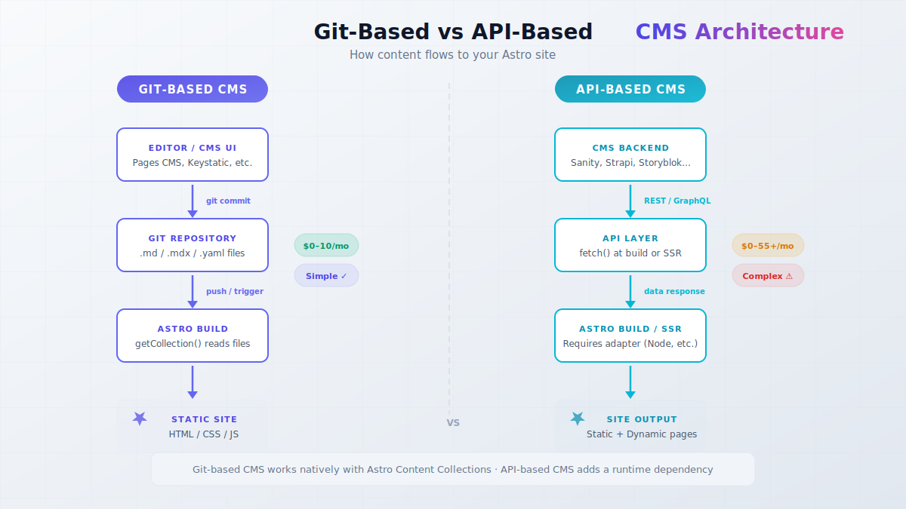

import Button from "@components/widgets/Button.astro";
import Notice from "@components/widgets/Notice.astro";
import ListCheck from "@components/widgets/ListCheck.astro";
import Accordion from "@components/widgets/Accordion.astro";
import Tabs from "@components/widgets/Tabs.astro";
import Tab from "@components/widgets/Tab.astro";

I don't use a CMS for bitdoze.com. I write in VS Code, push to Git, and Cloudflare Pages builds the site. Content lives as MDX files validated by [Astro Content Collections](https://docs.astro.build/en/guides/content-collections/) with Zod schemas. Zero cost, zero database, zero maintenance.

I [migrated from WordPress to Astro](https://www.bitdoze.com/wordpress-to-astro-migration/) using `wordpress-export-to-markdown` and Codex CLI. The blog runs on Bun for build speed and deploys to Cloudflare Pages. If you're still picking a framework, I wrote up why [Astro beats Next.js and TanStack Start](https://www.bitdoze.com/astro-vs-nextjs-vs-tanstack-start-which-wins/) for static content sites.

So why write about headless CMS options for Astro? Because not everyone is a solo dev who's fine with Git and VS Code. Sometimes you need a browser UI. Sometimes your client needs to edit content. Sometimes you have five writers who don't know what a pull request is.

Astro's docs list 40+ CMS integrations. This article cuts that list down to the ones worth your time, starting with the honest baseline: maybe you don't need one at all.

## Do you even need a CMS for Astro?

Astro Content Collections already give you type-safe content management with no extra services. Here's the pattern used on this site (Astro 5+ content layer with a loader):

```ts
// src/content.config.ts
import { defineCollection } from 'astro:content';
import { z } from 'astro/zod';
import { glob } from 'astro/loaders';

const blog = defineCollection({
  loader: glob({ base: './src/content/posts', pattern: '**/*.{md,mdx}' }),
  schema: z.object({
    title: z.string(),
    date: z.coerce.date(),
    description: z.string(),
    draft: z.boolean().default(false),
  }),
});

export const collections = { blog };
```

That's a CMS schema. `getCollection('blog')` is your query layer. Frontmatter is your data layer. VS Code (or any editor) is your UI. Git is your version control.

For a solo dev running a blog or docs site, this covers most of what a Git-based CMS gives you. The missing piece is just a friendlier editing UI.

<Notice type="info" title="The no-CMS baseline">
This is the angle most "best CMS" roundups skip. My setup costs $0/month and has zero dependencies beyond Git. Every CMS below has to justify why it's worth the extra moving parts.
</Notice>

You can [build an Astro blog for free](https://www.bitdoze.com/build-astro-blog-free/) with this stack. If you want an AI-assisted editor, tools like Windsurf or Codex can manage your markdown too. I covered that in [building an Astro blog with Windsurf](https://www.bitdoze.com/windsurd-build-astro-blog/).

**Signs you don't need a CMS:**

<ListCheck>
<ul>
<li>You're the only person editing content</li>
<li>You're comfortable with Git and a code editor</li>
<li>Your content is mostly blog posts or documentation</li>
<li>No client handoff required</li>
<li>You prefer speed and zero cost over a browser UI</li>
</ul>
</ListCheck>

**Signs you do need a CMS:**

- Team editing (multiple authors, editors, reviewers)
- Non-technical content editors who need a browser UI
- Structured content types beyond blog posts (products, events, team members)
- Scheduling, approval workflows, or role-based access
- You just prefer a GUI over editing YAML frontmatter

If any of those apply, keep reading.

## Git-based CMS vs API-based CMS for Astro

Before picking a tool, pick an architecture. That choice sets your cost, complexity, and ops burden for years.

<Tabs>
<Tab name="Git-based CMS">
**How it works:** Content stored as Markdown/MDX/YAML/JSON files in your Git repo. The CMS is a UI that commits changes. Works cleanly with Astro's `getCollection()`.

**Hosting:** No separate backend. Your Git repo is the database.

**Cost:** Usually $0 to $10/month.

**Best for:** Blogs, documentation, marketing sites, small-to-medium content projects.

**Examples:** Pages CMS, Keystatic, TinaCMS, Decap CMS, Sveltia CMS, CloudCannon.
</Tab>
<Tab name="API-based CMS">
**How it works:** Separate hosted or self-hosted backend with its own database. Content served via REST or GraphQL. You `fetch()` at build time or in SSR.

**Hosting:** SaaS (hosted for you) or self-hosted on a VPS with a database.

**Cost:** Free tier to $55+/month. Self-hosted is roughly $4–20/month for a VPS plus your time.

**Best for:** Complex content models, real-time collaboration, enterprise teams, multi-channel delivery.

**Examples:** Sanity, Strapi, Payload, Storyblok, Contentful, Directus.
</Tab>
</Tabs>



### What are Git-based CMS tools?

A Git-based CMS is a UI layer on top of your Git repository. You define content types (blog posts, pages), and editors get a form or visual interface. When they save, the CMS commits the file to your repo — same as you would from VS Code.

Your content still works with Astro Content Collections. `getCollection('blog')` reads the same files whether a CMS or a human wrote them. No API calls, no database queries, no runtime dependency on the CMS being online.

The CMS only matters at edit time. At build time, it's just files.

### When an API-based CMS makes sense

Reach for an API CMS when you need things that don't map cleanly to files:

- Real-time collaboration (multiple people in the same document)
- Complex relationships (related products across thousands of entries)
- Approval chains and scheduled publishing
- Multi-channel delivery (same content to web, app, email)
- A full admin panel with dashboards, analytics, and user management

<Notice type="warning" title="Ops overhead">
Self-hosted API CMS means a VPS ($4–20/month), database setup, backups, monitoring, and security updates. Budget that in. For a static blog, it's overkill next to Git-based options.
</Notice>

If you're looking at self-hosted Strapi or Directus, you'll need a VPS. [Hetzner Cloud](https://go.bitdoze.com/hetzner) has affordable European servers from ~€4/month — that's what I use for my own fleet. [Hostinger VPS](https://go.bitdoze.com/hostinger-vps) is another budget option with KVM and NVMe.

## Best Git-based CMS for Astro compared

These fit Astro Content Collections best. Content stays as files, works with `getCollection()`, and doesn't need a separate database. Sorted by simplicity, not hype.

### Pages CMS: the simplest free option

<Notice type="info" title="Hidden gem">
Pages CMS barely shows up in big CMS roundups, even though it was built for static sites. Closest thing I've found to "no CMS, but with a browser UI."
</Notice>

[Pages CMS](https://pagescms.org/) is what I'd reach for if I needed a CMS on an Astro site tomorrow. Add a `.pages.yml` config, sign in at app.pagescms.org, edit in the browser. Changes land as Git commits. No npm package, no database, no extra backend.

**Stats:** ~3.8k GitHub stars, MIT license, TypeScript. Created by Ronan Berder (@hunvreus) in late 2023.

**How it works with Astro:**

1. Add a `.pages.yml` at the repo root defining your content types
2. Connect the GitHub repo at [app.pagescms.org](https://app.pagescms.org)
3. Edit content in the browser
4. Changes commit to the repo; Cloudflare Pages (or your host) redeploys

**Pricing:** Fully free. Hosted app.pagescms.org is free. MIT licensed if you want to self-host.

**Key features:**
- Custom content types via YAML config
- Rich-text editor and Markdown support
- Media uploads (S3, Cloudflare R2)
- Full-text search across content
- Scheduling and granular access control
- Inline comments for review
- Email invites, so editors don't need a GitHub account

**Setup checklist:**

<ListCheck>
<ul>
<li>Create <code>.pages.yml</code> in your repo root with content type definitions</li>
<li>Sign in at <a href="https://app.pagescms.org">app.pagescms.org</a> with your GitHub account</li>
<li>Connect your repository</li>
<li>Edit content in the browser and confirm it commits to Git</li>
</ul>
</ListCheck>

**Limitations:**
- No embeddable `/admin` route — the CMS is a separate site (app.pagescms.org or your self-hosted instance)
- No repeater fields (still true as of mid-2026)
- Form-based editor only, not WYSIWYG-on-the-page
- GitHub only — no GitLab or Bitbucket yet
- Solo maintainer, so there's bus-factor risk. If the project stalls, your content is safe (it's just files in Git), but you lose the editing UI

**Self-hosting:** Needs PostgreSQL, Docker, and a GitHub App. The [self-hosting docs](https://pagescms.org/docs/guides/installing/) cover it. If you already run Dokploy or Docker Compose on a VPS, it's straightforward.

**What users say:** Reddit feedback is mostly positive: "Really really easy to set up... exactly what I need." The usual complaint is that it's a separate website rather than an embedded admin, which some freelancers dislike for client handoffs.

**Verify it works:** After adding `.pages.yml`, open app.pagescms.org and confirm your repo appears. Create a test post and check that the commit shows up in Git history.

### Keystatic — TypeScript-native with first-class Astro support

[Keystatic](https://keystatic.com/) comes from Thinkmill (the KeystoneJS team). Everything is configured in TypeScript, and the admin UI lives at `/keystatic` inside your Astro project.

**Stats:** ~2.2k GitHub stars, MIT license, TypeScript. Started early 2023.

**How it works with Astro:**

1. Install `@keystatic/core` + `@keystatic/astro` + `@astrojs/react` + `@astrojs/markdoc`
2. Define collections and singletons in `keystatic.config.ts`
3. Content stored as Markdoc (`.mdoc`), YAML, or JSON in your repo
4. Admin UI at `/keystatic`

```ts
// keystatic.config.ts
import { config, collection, fields } from '@keystatic/core';

export default config({
  storage: { kind: 'local' },
  collections: {
    posts: collection({
      label: 'Posts',
      slugField: 'title',
      path: 'src/content/posts/*',
      format: { contentField: 'content' },
      schema: {
        title: fields.slug({ name: { label: 'Title' } }),
        content: fields.markdoc({ label: 'Content' }),
      },
    }),
  },
});
```

**Pricing:** Free for local and GitHub workflows. Keystatic Cloud (optional): free up to 3 users/team; Pro at $10/month/team + $5/user beyond 3. Cloud adds GitHub auth, Cloud Images (CDN), and experimental multi-player editing.

<Notice type="warning" title="SSR required">
Keystatic's `/keystatic` admin route needs a Node.js server. You can't use `output: 'static'` alone — hybrid/SSR with an adapter like `@astrojs/node` is required. Public pages can stay static; only the admin route needs a running server.
</Notice>

**Why I'd consider Keystatic:** The TypeScript config is actually pleasant to work with. Collections, singletons, and the Reader API keep content type-safe without leaving your editor. If you're already using Bun for [faster Astro builds](https://www.bitdoze.com/migrate-astro-bun/), it fits that workflow.

**Limitations:**
- React dependency for the Admin UI — adds weight if your site is otherwise React-free
- Content auto-creates in sub-folders based on slug, which confuses a lot of people
- ~174 open GitHub issues (mid-2026)
- Some Reddit users found it "surprisingly difficult to figure out"

**What users say:** "Surprisingly difficult... main problem was not knowing how to make posts without auto-generated sub folders... user error but real pain. Really wanted to love this one." Devs who like TypeScript-first tools tend to stick with it; people who want a five-minute visual setup often bounce.

**Verify it works:** After install, open `/keystatic` and confirm the admin loads. Create a test post and check the file lands in your content directory with the right schema.

### TinaCMS — visual editing for teams

[TinaCMS](https://tina.io/) has the most GitHub stars among Git-based options here. SSW (Australian consultancy) maintains it. The headline feature is visual editing: editors see changes on the actual page, not only in a form.

**Stats:** ~13.7k GitHub stars, Apache 2.0, TypeScript. Started mid-2019.

**How it works:** Git-based with a GraphQL layer. Content in Markdown/MDX/JSON/YAML. Astro is a first-class starter (they made it a default option around 2024). Install with `npx create-tina-app@latest` and pick the Astro starter.

**Pricing (TinaCloud), per project:**
- Free: $0 forever, 2 users, 2 roles, community support
- Team: $24/month ($290/year), 3 users included, up to 10
- Team Plus: $41/month ($490/year), 5 users included, up to 20, Editorial Workflow
- Business: $249/month ($2,990/year), 20 users included, unlimited seats

Tina has said the vast majority of users stay on free.

<Notice type="warning" title="Dependency heavy">
Several people report version conflicts and "dependency hell" with TinaCMS. Test before you bet a production site on it. Full visual editing leans on TinaCloud — self-hosting that experience is messy.
</Notice>

**Limitations:**
- ~430+ open GitHub issues
- Free tier stops at 2 users — third editor means Team at $24/month
- Visual editing features need TinaCloud
- Heavier dependency tree than Pages CMS or Keystatic

**Verify it works:** Run `npx create-tina-app@latest` with the Astro starter. Confirm the visual editor loads and you can create/edit a post with live preview.

### Decap CMS and Sveltia CMS — the open-source workhorses

**Decap CMS** (formerly Netlify CMS) is the old default for Git-based CMS. ~19.3k GitHub stars, MIT. Around since 2015. Netlify dropped official support; the community fork (Decap) keeps it alive at a slower pace. The UI feels dated next to newer tools.

<Notice type="error" title="Auth is the #1 pain point">
Decap authentication is where most projects stall. Netlify Identity is deprecated. Auth0 is a project of its own. Best bets: GitHub OAuth with a proxy (DecapBridge), or skip Decap and use Pages CMS / Keystatic.
</Notice>

**Sveltia CMS** (~2.6k GitHub stars, MIT) is a drop-in replacement for Decap. Same config format, same Git model, but faster, modern UI, mobile support, and built-in i18n. Already on Decap and hate the UI? Swap the script include. Done.

Both work via CDN include — no npm package. Config file + script tag. Content still works with `getCollection()` because it's just files.

**Limitation:** Neither does visual editing. Form-based only, similar to Pages CMS. Auth still inherits Decap's Netlify-era design, which is the main source of frustration.

**Verify it works:** After config, open `/admin` and complete the GitHub OAuth flow. Create a test post and check the Git commit.

### CloudCannon — visual editing for client handoffs

[CloudCannon](https://cloudcannon.com/) is the premium Git-based CMS. Featured partner on Astro's docs, and one of the polished visual editing experiences in the Git-based space. Content stays in your repo. Branch-based editing and publishing.

**Pricing:**
- Standard: $55/month
- Partner Program Lite: $10/month per client (for freelancers/agencies)

Built-in image optimization, DAM connectors, content scheduling, and solid Astro integration with component starters.

**Limitations:** Proprietary. Content is in Git, but the visual editor is CloudCannon's product. Leave and you keep the files, lose the workflow. At $55/month standard, it's steep for solo projects. Partner pricing ($10/client) is the interesting number if you ship client sites regularly.

**Vendor lock-in:** Content is yours. The editing workflow is not. Price hike or shutdown means finding a new UI, not a content migration.

### Front Matter CMS — the VS Code extension

[Front Matter CMS](https://frontmatter.codes/) is a free VS Code extension: content dashboard, media management, SEO checks, content types, and a frontmatter panel — all inside the editor.

**Pricing:** Free. MIT licensed.

Closest thing to "no CMS, slightly nicer." Great for solo devs who want a sidebar without jumping to a browser. Useless for teams or non-technical editors — everyone needs VS Code.

Works in [Windsurf](https://go.bitdoze.com/windsurf) and other VS Code forks. Pair it with AI-assisted editing if you like that workflow.

**Verify it works:** Install from the VS Code marketplace. Confirm the sidebar dashboard lists your content files.

### StudioCMS — Astro-native

[StudioCMS](https://studiocms.dev/) is built by the Astro community for Astro. It left beta in January 2026 (v0.1.0). Dashboard, storage API, taxonomy, and an SSR-focused design aimed at the Astro ecosystem.

**Stats:** ~800 GitHub stars. Still young, but no longer "don't touch production."

Worth a look if you want Astro-only tooling and are fine with a project that just left beta. For client work or high-stakes sites, I'd still pick something more battle-tested (Pages CMS, Keystatic, Tina, CloudCannon). For a personal project or early adopter site, give it a try.

## Best API-based headless CMS for Astro

These need a separate backend. More power for complex models, teams, and enterprise. If you're running a simple blog, this section is overkill — use a Git-based option above.

Self-hosting? You'll need a VPS. [Hetzner Cloud](https://go.bitdoze.com/hetzner) from ~€4/month. [Vultr](https://go.bitdoze.com/vultr) if you want more regions.

### Sanity — most customizable studio

[Sanity](https://www.sanity.io/) has an official Astro plugin and a highly customizable admin Studio. Portable Text for structured rich content, real-time collaboration, image CDN with auto WebP/AVIF, GROQ, React-based Studio you can shape to your content model.

**Pricing:** Free plan is usable (up to 20 seats with limited roles). Growth is **$15 per seat / month**, not a flat $15.

**The catch:** Almost everything is DIY. You get a lot of control, and you wire most of it yourself. Great if you enjoy building custom editing UIs. Painful if you just want to ship a blog.

**Verify it works:** Set up Studio + the Astro plugin, create a test entry, and confirm the page renders it through the plugin's data fetching.

### Strapi and Payload — self-hosted open source

**[Strapi](https://strapi.io/)** is the big open-source headless CMS (~73k GitHub stars). Customizable admin, REST + GraphQL, role-based permissions. Self-hosted free. Needs Node.js and a database on a VPS.

**[Payload](https://payloadcms.com/)** is newer and well-liked for content modeling and extensibility (~44k stars). Also self-hosted and free at the core.

<Notice type="info" title="Self-hosting cost">
Budget $6–10/month for a VPS with at least 2GB RAM. A [Hetzner](https://go.bitdoze.com/hetzner) CX22 (2 vCPU, 4GB RAM, ~€5/month) runs Strapi fine for low-traffic sites. [DigitalOcean](https://go.bitdoze.com/do) is another solid option.
</Notice>

Both make sense when you want a full admin panel and API. For a static Astro blog, the ops work (VPS, database, backups, updates, security) rarely pays for itself.

**Verify it works:** After Docker deploy, open the admin URL, create a test entry, hit the API endpoint.

**Failure mode:** If the VPS dies, builds that fetch content fail. Plan monitoring and backups.

### Storyblok — best visual editor

[Storyblok](https://www.storyblok.com/) has an official Astro SDK and one of the best visual editors in headless CMS. Closest feeling to WordPress for non-technical editors: click a component on the page, edit inline. Component-based "Bloks" inside rich text.

**Pricing:**
- Starter (free): 1 seat, limited traffic/API
- Growth: $99/month (5 seats)
- Growth Plus: $349/month (15 seats)
- Extra seats: $15/month

Astro integration is maintained. If you're handing a site to a client who knows WordPress, Storyblok will feel familiar.

**Limitation:** SaaS only. No self-hosting. You're on their pricing for the long haul.

### Contentful — enterprise-ready but watch pricing

Contentful is strong for enterprise: content modeling, workflows, roles, multilingual, DAM, reliable APIs. I've covered [Contentful with Astro](https://www.bitdoze.com/categories/cms/) before.

<Notice type="warning" title="Sticker shock">
Free tier works for small sites. Pricing climbs fast with usage. At higher MAU, enterprise quotes can hit thousands per month. Reddit regularly calls it expensive. Test on free before you commit.
</Notice>

**Limitations:** Awkward mid-article component insertion and rigid text-block handling. Solid as an API-first backend; authoring UX trails Storyblok for everyday content work.

### Directus — wrap any database

[Directus](https://directus.io/) is open-source and self-hosted. It wraps SQL databases (PostgreSQL, MySQL, SQLite, etc.) with REST + GraphQL and an admin panel. Real-time subscriptions, granular permissions, Flows (automation).

Good fit when you already have data in SQL and want a CMS on top. Core self-hosted is free. Cloud is a paid add-on (plans start higher than most solo budgets — check current pricing before you plan around it).

**Failure mode:** Same VPS maintenance as Strapi/Payload. CMS down at build time = failed deploy.

### BCMS — avoid for new projects

<Notice type="error" title="Abandoned open source">
BCMS open-source is frozen since October 2024. The [GitHub repo](https://github.com/bcms/cms) README says it's no longer maintained. BCMS Pro is closed-source with unclear pricing. Don't start new projects on the OSS version.
</Notice>

BCMS (~460 stars, MIT) looked fine on paper: modern UI, flexible modeling, Next/Astro/Svelte. The core team moved development private in September 2024. No updates, fixes, or security patches on the open repo.

Skip it for new Astro work. The [BCMS site](https://thebcms.com/) now markets a "headless CMS for AI agents" direction, which is a different product.

**Already on BCMS?** Content is safe if you self-host, but you're on unsupported code. Plan a migration.

## Pricing comparison: what each CMS actually costs

| CMS | Type | Free Tier | Entry Paid | Self-Hosted? |
|-----|------|-----------|------------|-------------|
| **No CMS (MDX + Git)** | Files | ✅ $0/month | $0 | N/A |
| **Pages CMS** | Git-based | ✅ Everything free | $0 | ✅ (needs PostgreSQL) |
| **Keystatic** | Git-based | ✅ Up to 3 users | $10/month + $5/user | ✅ (core is free) |
| **TinaCMS** | Git-based | ✅ 2 users | $24/month (3 users) | ⚠️ Complex |
| **Decap CMS** | Git-based | ✅ Everything free | $0 | ✅ (decoupled auth) |
| **Sveltia CMS** | Git-based | ✅ Everything free | $0 | N/A (CDN-hosted SPA) |
| **CloudCannon** | Git-based | ❌ No free tier | $55/month ($10 partner) | ❌ SaaS only |
| **Front Matter CMS** | Git-based (VS Code) | ✅ Everything free | $0 | N/A (extension) |
| **StudioCMS** | Astro-native | ✅ Free | $0 | ✅ (own stack / Astro) |
| **Sanity** | API-based | ✅ Free plan (seats limited) | $15/**seat**/month | Studio self-hostable; Content Lake is SaaS |
| **Storyblok** | API-based | ✅ Starter (1 user) | Growth: $99/mo (5 seats) | ❌ SaaS only |
| **Contentful** | API-based | ✅ Free tier | Escalates fast | ❌ SaaS only |
| **Strapi** | API-based | ✅ Self-hosted free | Cloud plans vary | ✅ (VPS needed) |
| **Payload** | API-based | ✅ Self-hosted free | Cloud plans vary | ✅ (VPS needed) |
| **Directus** | API-based | ✅ Self-hosted free | Cloud add-on (check current) | ✅ (VPS needed) |
| **BCMS** | API-based | ⚠️ Frozen OSS | Pro: unclear | ✅ (MongoDB + Docker) |

<Notice type="success" title="Cheapest paths">
Three options stay at $0/month: no CMS (plain MDX + Git), Pages CMS (free hosted), and Front Matter CMS (VS Code extension). Need a browser UI? Start with Pages CMS.
</Notice>

**Hidden costs:**
- Self-hosted API CMS: $4–20/month VPS + setup, backups, updates
- Git-based CMS with image uploads: S3/R2 storage, or repo bloat if you commit binaries
- Keystatic Cloud Images: Pro plan feature, external dependency
- CloudCannon: $55/month standard, or $10/client on Partner Program

## How to pick the right CMS for your Astro project

Two questions matter: **who edits content** and **where content lives**.

<Tabs>
<Tab name="Solo dev">
**Recommendation:** No CMS, Pages CMS (free browser UI), or Front Matter CMS (VS Code sidebar).

Personal blog or docs: start with no CMS. Add Pages CMS if you want a browser without changing infrastructure. Add Front Matter if you just want a nicer VS Code panel.

**Why not Keystatic or Tina?** You can. They add React, SSR adapters, or Cloud accounts that a solo blog rarely needs unless you want a specific feature.
</Tab>
<Tab name="Small team (2–5)">
**Recommendation:** Pages CMS (free, simple) or Keystatic (free for ≤3 users, $10+ after).

Pages CMS wins on simplicity — email invites for non-GitHub users, browser editing, commits to Git. Keystatic wins if the team likes TypeScript config and an embedded `/keystatic` admin.

TinaCMS works if you need visual editing, but $24/month for three users adds up for small teams.
</Tab>
<Tab name="Client handoff">
**Recommendation:** CloudCannon ($10/partner), TinaCMS (free for 2 users), or Storyblok (visual editing).

Freelancers handing sites to non-technical clients: CloudCannon Partner at $10/month per client is hard to beat. Tina works for simple two-user handoffs. Storyblok if they want something closer to WordPress.

Sanity if you're willing to build a custom Studio around their workflow.
</Tab>
</Tabs>

### Decision matrix

| Scenario | Best pick | Why |
|----------|-----------|-----|
| Solo dev, personal blog | No CMS (MDX + Git) | $0, zero complexity |
| Solo dev, wants browser UI | Pages CMS | Free, simple, no npm |
| Solo dev, wants TypeScript config | Keystatic | First-class Astro, type-safe |
| Team of 3–5, budget | Pages CMS | Free, email invites |
| Team of 3–5, visual editing | TinaCMS | Visual editor, $24/month |
| Client handoff, budget | CloudCannon Partner | $10/month per client |
| Client handoff, premium | Storyblok | Strong visual editor |
| Complex content models | Sanity or Strapi | Full API, custom types |
| Enterprise, multi-channel | Contentful or DatoCMS | Proven at scale |

## Common pitfalls when adding a CMS to Astro

Failure modes I keep seeing:

**1. Decap CMS auth is a time sink.** Netlify Identity is deprecated. Auth0 is heavy. Starting fresh? Pages CMS or Keystatic. Stuck on Decap? GitHub OAuth + DecapBridge.

**2. Keystatic sub-folder confusion.** Content auto-creates folders from slugs. Flat structure under `src/content/posts/` needs careful path config. The TypeScript config is powerful and easy to misconfigure.

**3. TinaCMS dependency conflicts.** Version clashes with Astro and other packages show up often. Smoke-test with `npx create-tina-app@latest` before committing. Pin versions if things break.

**4. BCMS open-source is dead.** Don't start new projects on it. Frozen since October 2024.

**5. Contentful pricing scales harshly.** Free is fine for small sites. Higher traffic/usage can jump to enterprise pricing. Check usage early.

<Notice type="warning" title="Image bloat in Git-based CMS">
Git-based tools often store images in the repo. Fifty posts with a few images each is fine. Hundreds of posts with high-res assets will bloat clones and builds. Offload media to a CDN. [Bunny.net](https://go.bitdoze.com/bunny) storage is cheap (~$0.01/GB/month). Keystatic Cloud Images and CloudCannon have built-in options.
</Notice>

**6. API CMS = single point of failure.** Backend down at build time = failed deploy. For static sites your pipeline depends on that service. Monitor it, and keep a plan for stale builds. If you're [deploying to Cloudflare Pages](https://www.bitdoze.com/astro-plausible-cloudflare-workers/), recent cached builds can buy time — only if you've deployed recently.

## Frequently asked questions

<Accordion label="Do I really need a CMS for Astro?" group="faq">
No. Content Collections with Zod and MDX give you type-safe, validated content with no extra services. Solo blog or docs site? That's enough. The CMS is a UI layer. If you're fine with VS Code and Git, skip it. bitdoze.com runs that way.
</Accordion>

<Accordion label="What's the cheapest headless CMS for Astro?" group="faq">
Pages CMS is free end-to-end (hosted + MIT). Front Matter CMS is free as a VS Code extension. No CMS at all is also $0. For API options, self-hosted Strapi and Payload are free but need a VPS (~$4–20/month).
</Accordion>

<Accordion label="Can I self-host a headless CMS on my VPS?" group="faq">
Yes. Pages CMS, Strapi, Directus, and Payload all support it. Plan for at least 2GB RAM for Strapi/Directus. A [Hetzner](https://go.bitdoze.com/hetzner) CX22 (~€5/month) covers low-traffic self-hosted CMSes. You still own Docker, backups, and security updates. If you already run Dokploy or similar [self-hosted panels](https://www.bitdoze.com/best-self-hosted-panels/), adding a CMS container is straightforward.
</Accordion>

<Accordion label="Keystatic vs TinaCMS — which is better for Astro?" group="faq">
Keystatic if you want TypeScript config and a clean `/keystatic` admin. TinaCMS if the team needs visual editing on the live page. Keystatic is lighter (no TinaCloud required) but needs an SSR adapter. Tina has more features, more dependencies, and costs more once you leave the free tier.
</Accordion>

<Accordion label="Is BCMS still a good choice?" group="faq">
No. Open-source has been frozen since October 2024. The README says no further updates. BCMS Pro is closed-source with unclear pricing. For new Astro projects use Pages CMS, Keystatic, or another active project.
</Accordion>

<Accordion label="How do I handle images without bloating my Git repo?" group="faq">
Use an external CDN. [Bunny.net](https://go.bitdoze.com/bunny) storage is about $0.01/GB/month with a global CDN. Pages CMS supports S3 and Cloudflare R2. Keystatic Cloud Images is on the Pro plan. Cloudinary has a useful free tier. For [faster Astro builds](https://www.bitdoze.com/astro-7-faster-builds/), a lean repo still matters — large image directories slow clone and build times.
</Accordion>

## Wrapping up

The best headless CMS for Astro might be no CMS at all. That's how I run this blog. Content Collections + MDX + Git give you type-safe content for $0 with nothing to babysit.

When you do need a CMS — team editing, non-technical editors, client handoffs — Git-based tools line up better with Astro's architecture. Pages CMS is the simplest free option. Keystatic if you want TypeScript-native config and first-class Astro support. TinaCMS if you need visual editing. CloudCannon for client handoffs.

Only go API-based when you need real-time collaboration, complex models, or enterprise features — and budget for VPS, database, backups, and monitoring if you self-host.

Pick based on who edits your content, not which product has the longest feature list.

<Button text="Migrated from WordPress? Start here" link="https://www.bitdoze.com/wordpress-to-astro-migration/" variant="solid" color="blue" size="md" icon="arrow-right" />
