import Button from "@components/widgets/Button.astro";
import Notice from "@components/widgets/Notice.astro";
import ListCheck from "@components/widgets/ListCheck.astro";
import Accordion from "@components/widgets/Accordion.astro";
import Tabs from "@components/widgets/Tabs.astro";
import Tab from "@components/widgets/Tab.astro";

Herdr has no official web UI, no official mobile app, and no official desktop app. That's not a gap, it's the design. Herdr is a runtime: a background server owns real PTYs, agents like Claude Code, Codex, OpenCode, Gemini CLI and Pi live inside them, and every interface is just a client that attaches. So the question is which Herdr clients to use for which job. This guide compares the whole client ecosystem side by side: the built-in TUI, five community herdr web ui options, the mobile apps, and the desktop apps. You get a decision table, the security posture of each client, the version footguns, and a hardened VPS setup you can run tonight. For how the runtime itself works, read [our Herdr review](https://www.bitdoze.com/herdr-agent-multiplexer/) first. For what to run inside the panes, see the [best AI coding tools and agents](https://www.bitdoze.com/ai-coding-tools/).

<Notice type="info" title="There is no official Herdr web UI">
The official clients are the TUI (`herdr`), the CLI/socket API, plain SSH, `herdr --remote`, and the multi-machine window (since v0.9.0). Everything else (ColliePWA, herdr-web-ui, Heeler, herdrm, herdrweb) is community-built. Reddit threads show the confusion is real: people ask "what's the difference from the built-in web UI?" and the answer is that there is none. Per [herdr.dev/compare](https://herdr.dev/compare/): "every UI, ours included, is just a client that attaches."
</Notice>

## What counts as a Herdr client? (runtime vs. interface, in 90 seconds)

Herdr is a background session server plus one or more terminal clients. The server owns real PTYs; your coding agents run inside those PTYs. Close the client, lose SSH, put the laptop to sleep. The agents keep running. Detach with `ctrl+b q`, reattach with `herdr`. That's the part tmux users already understand.

The part tmux doesn't have: every pane is marked **working / blocked / done / idle / unknown**. Herdr detects which agent is running in the pane and tracks its actual state. That state is exactly why phone apps and web dashboards are useful here. In tmux, a phone client is just a screen showing whatever text is on the buffer. In Herdr, a client can surface "these three agents need your approval" and let you answer with a tap.

Under the hood it's one Rust binary. No Electron, no account, no telemetry, Apache-2.0. The socket lives at `~/.config/herdr/herdr.sock` (Windows uses a named pipe under `%APPDATA%\herdr\`). Plugins extend it with a `herdr-plugin.toml` manifest and ordinary commands. More on the trust model below. At the time of writing: stable v0.9.3 (September 29, 2026) and about 42.7k stars on [github.com/herdrdev/herdr](https://github.com/herdrdev/herdr). Re-check both numbers on the day you read this; 0.9.x moves fast.

## Herdr clients at a glance: the decision table

| Situation | Best client | Exposure | Moving parts |
|---|---|---|---|
| At the keyboard on the box | Built-in TUI (`herdr`) | None | Zero extra services |
| Remote on a laptop | `herdr --remote` / `herdr machine add` | SSH only | SSH config |
| Check/approve agents from Android | ColliePWA or Moshi (Play Store) | Loopback + `tailscale serve`, or SSH/mosh | 1 user service, or moshi-hook |
| iPhone as a real console | Heeler or Moshi (App Store), or SSH/Mosh | SSH or tailnet | 1 herdr plugin, moshi-hook, or nothing |
| Chat-style approvals + push in a browser | devswha/herdr-web-ui | Loopback + Tailscale | herdr plugin, port 7317 |
| Full TUI fidelity in a browser | kcosr/herdr-web | Loopback, port 8787 | Rust bridge, vendored API (experimental) |
| Native macOS console across machines | herdrm | SSH | `brew` install |
| Desktop app on macOS, Linux or Windows | Moshi Desktop | Loopback + your SSH | `curl`/`brew`, ~11 MB Tauri app |
| Git worktrees + web UI with no Herdr backend | alecuba16/herdr-webui | Loopback, port 8787 | Its own backend (different beast) |

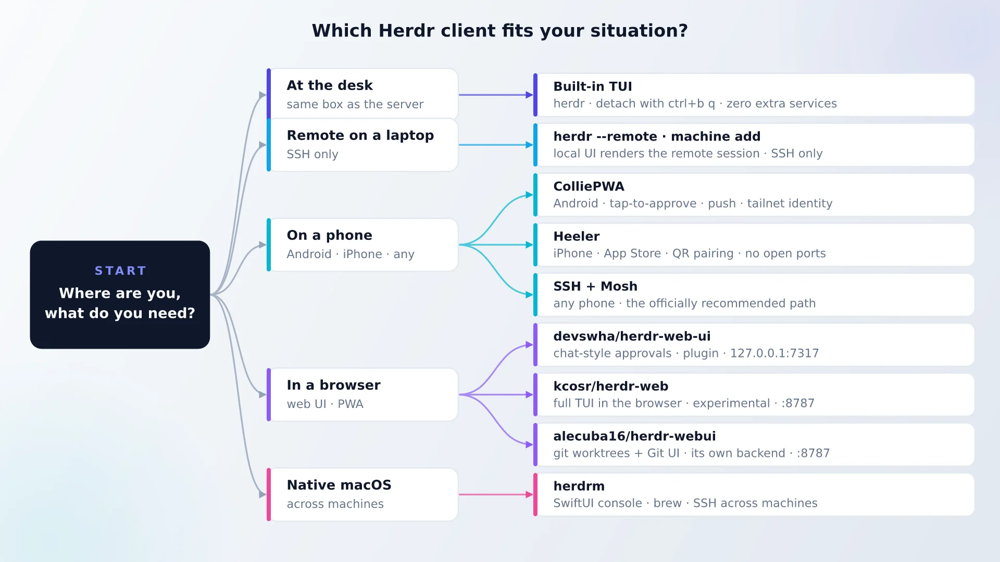

One honest paragraph before the per-client sections: of all the Herdr clients here, for many of you the answer is "nothing beyond the TUI". If you sit at the same machine that runs the agents, or you're happy with `ssh` plus `herdr`, stop here. Add a third-party client when a real scenario shows up. "I want to approve a blocked Claude Code from the couch" is a real scenario. "I saw a nice dashboard" is not.

## Start with the built-in TUI (and plain SSH)

What you get before installing anything third-party is already most of the value.

```bash
# Linux / macOS
curl -fsSL https://herdr.dev/install.sh | sh
# or: brew install herdr
# or: mise use -g herdr

# Windows (PowerShell): unsigned binary, SmartScreen may warn
irm https://herdr.dev/install.ps1 | iex

# verify
herdr -V
herdr status
```

`herdr status` is your source of truth: it shows the server version and attached clients. After `herdr update`, herdr also lists which running servers are still on the old version (since 0.9.2), with the commands to restart each one.

The daily loop is small: `cd ~/project && herdr`, split with `ctrl+b v` (mouse split/drag also works), detach with `ctrl+b q`, reattach later with `herdr`. Plain SSH is the officially recommended phone path too: the TUI adapts to narrow screens, and the docs show phone-over-SSH usage. Recommended phone clients per the project: Moshi on iPhone, any SSH app elsewhere.

For remote work, two things matter since 0.9:

```bash
# local UI rendering a remote server's session (keeps local clipboard image paste)
herdr --remote workbox

# multi-machine window (v0.9.0+): one sidebar, local + SSH machines
herdr machine add workbox --label "Build box"
herdr machine status          # v0.9.2+: rechecks every 30s
herdr machine reconnect       # handles MFA in-terminal
```

Put the host in `~/.ssh/config` first. Config and logs live in `~/.config/herdr/` (`config.toml`, `herdr.log`, `herdr-server.log`, sockets, plugins). Reload config with `herdr server reload-config`.

<Notice type="warning" title="Detach is not stop">
`herdr server stop` kills every pane process. That means your agents. Detach with `ctrl+b q` instead. After a restart, layout is restored and agent conversations can be resumed only if the integrations reported native session IDs (`herdr integration install codex|claude|cursor`) or the agent self-reports resume (new in v0.9.2).
</Notice>

While you're in the terminal all day, [make the TUI feel like home with Oh My Zsh plugins](https://www.bitdoze.com/best-oh-my-zsh-plugins/) and install [zoxide for faster terminal navigation](https://www.bitdoze.com/zoxide/). Both pay off whether or not you ever touch a web UI.

## Best Herdr web UI: five community options compared

There is no official herdr web ui (the repos named "herdr-web-ui" and "herdr-webui" are both community projects). What exists is a cluster of third-party clients, all built on the socket API, all binding loopback by default. Here is the field as of October 2026 (star counts drift daily, so re-check on publish day).

| Project | Stars (Oct 2026) | Port | Install | Auth posture | Breaks when… |
|---|---|---|---|---|---|
| [devswha/herdr-web-ui](https://github.com/devswha/herdr-web-ui) | 284 | 7317 | `herdr plugin install` | Loopback + Tailscale QR | Agent UIs change (chat transcripts) |
| [AltanS/collie](https://github.com/AltanS/collie) | 1.2k | loopback | `curl … collie start` | Tailnet identity + device pairing | tmux/zellij mode (experimental) |
| [sarathsp06/herdrweb](https://github.com/sarathsp06/herdrweb) | 6 | 7331 | one Go binary | None, loopback-only by design | Rarely; small project |
| [kcosr/herdr-web](https://github.com/kcosr/herdr-web) | 41 | 8787 | release tarball + APK | Origin allow-list (not auth) | Herdr upgrades (vendored API) |
| [alecuba16/herdr-webui](https://github.com/alecuba16/herdr-webui) | 34 | 8787 | prebuilt tarball | Loopback | It replaces the backend; see below |

All of them bind loopback. None of them ships real authentication. You are responsible for the exposure model. That's the subject of the security section below.

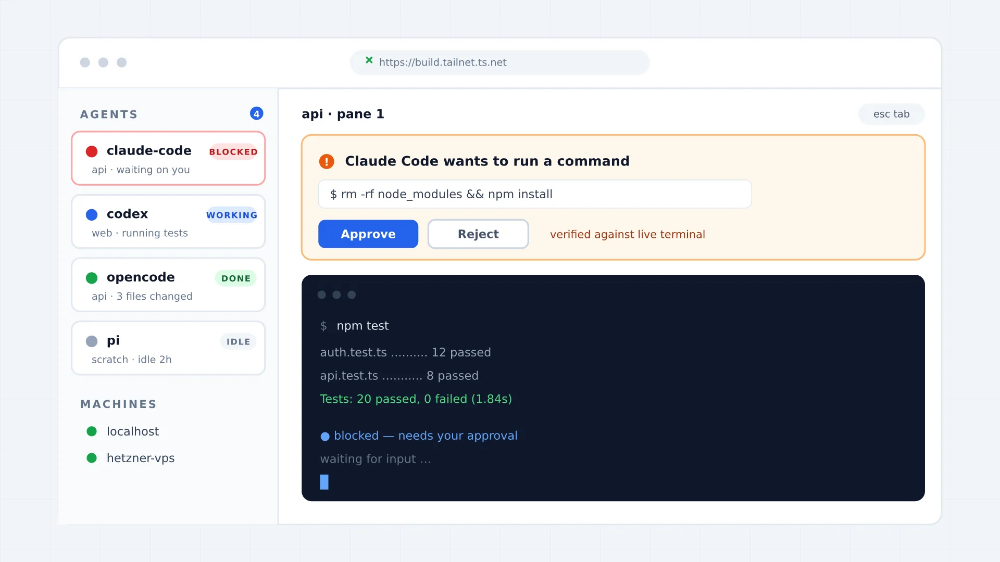

The pieces are the same across all five: an agent sidebar with state chips, some form of approval card or quick reply, and a live terminal view per pane. What differs is the transport (plugin vs standalone binary), the fidelity (chat transcript vs real terminal), and how much you trust the auth model.

### herdr-web-ui: chat-style approvals as a herdr plugin

The most "messaging app" of the bunch. Agent transcripts render as chat (Claude Code, Codex, omp, omo, gjc, pi), the live terminal is one click away, and approvals become tappable cards with a "checked to be current before your answer is sent" validation step. It's a PWA with an Esc/Tab/Ctrl key row above the keyboard, web push, a file browser, and a QR code pointing at your Tailscale address.

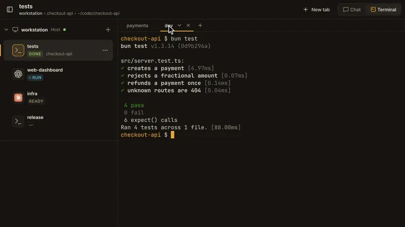

```bash
# needs herdr 0.9.0+, Bun 1.4+, Node 18+
herdr plugin install devswha/herdr-web-ui
# serves 127.0.0.1:7317; verify:
ss -tlnp | grep 7317
curl -I http://127.0.0.1:7317
```

MIT, and installs as a standard herdr plugin. Good default if you want push + approvals in a browser without thinking about servers.

### ColliePWA: the most popular third-party Herdr client

[ColliePWA](https://colliepwa.dev) (AltanS/collie, 1.2k stars) is a mobile-first PWA and the most popular third-party client of any kind. The home screen answers "what needs your input" first: blocked agents on top, push notifications when an agent blocks, quick replies defined in `quick-replies.toml`, a special-keys pad, a read-only "Changes" view for git diffs, and file attachments. Device pairing tokens act as write credentials, and "Crews" put several machines behind one URL with failover. Six UI languages. Herdr is the primary backend; tmux and zellij are experimental extras.


```bash
curl -fsSL https://colliepwa.dev/install.sh | sh
collie start        # auto-detects herdr/tmux/zellij; binds loopback
# .env: COLLIE_TRUSTED_USER=you@example.com
```

Runs as a systemd user service with a Bun bridge. The README is blunt about exposure: **"Never `tailscale funnel` this"**. Treat the URL as a root login. Front it with `tailscale serve` so the tailnet injects `Tailscale-User-Login` and clients can't forge the identity header. There's an interactive demo on colliepwa.dev if you want to poke the UI before installing. Windows zip builds ship since v1.16.0 (experimental). Cross-reference the mobile section: this is my default phone pick on Android.

### herdrweb: a one-binary agent inbox

Built because "a phone keyboard turns tmux into a tiny rage simulator" (the author's words on r/herdr). Every agent across every space, sorted blocked → working → idle, with a raw terminal pane, a key row, a slash-command palette, image attach (the bridge writes the file host-side and drops the path into your draft), a Shiki diff viewer, and PWA + Web Push. It uses real RPCs (`pane.read`, `agent.prompt`, `agent.send_keys`), no screen scraping.

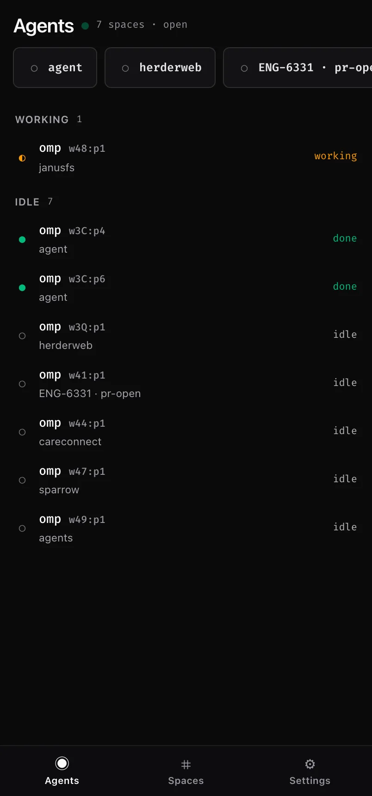

```bash
curl -fsSL https://raw.githubusercontent.com/sarathsp06/herdrweb/main/install.sh | sh
herdrweb -service install && herdrweb -service start   # 127.0.0.1:7331
ss -tlnp | grep 7331
```

One self-contained Go binary (SvelteKit frontend embedded). `-service install` writes a systemd user unit (or launchd on macOS). **No authentication, loopback-only by design** ("one operator, one machine"). The author's recommended exposure is `tailscale serve --bg --https=443 127.0.0.1:7331`. Small star count, but it's the cleanest architecture of the group. MIT.

### kcosr/herdr-web: a full browser terminal

If you want the actual TUI in a browser (vim, htop, full-screen TUIs, not a chat rewrite), this is the one. A Rust HTTP/WebSocket bridge plus a React frontend with a Ghostty web/WASM renderer. Drag-and-drop uploads into panes, synchronized multi-client viewing (two browsers on the same pane), an Android APK via Capacitor, and launcher presets in `~/.config/herdr-web/launcher-presets.json`. Release tarballs for Linux x86_64 and macOS; serves `http://127.0.0.1:8787`; needs herdr v0.7.2+ running.

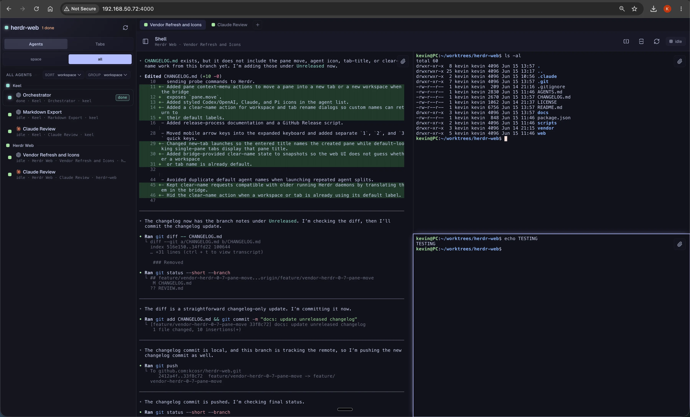

<Notice type="warning" title="Experimental: it vendors private herdr internals">
kcosr/herdr-web ships `vendor/herdr-compat`, an explicitly "experimental, runtime/API shape is expected to change" copy of herdr internals. It can break on herdr upgrades (the repo pushed a v0.9 compat update within days of that release). Its host/origin allow-listing is a DNS-rebinding guard, **not authentication**. Also note herdr core gives only one terminal attach owner per pane; the bridge works around it. Expect churn; pin versions and test upgrades before adopting.
</Notice>

### alecuba16/herdr-webui: git worktrees and a web UI (with a catch)

The most IDE-shaped option: workspace and worktree navigation, terminal attach, a full Git UI (status, diffs, staging, commits, stash, blame), a file explorer with a CodeMirror editor, and agent status detection for roughly 20 CLIs. Prebuilt tarballs for Linux x86_64 and macOS; a Rust Axum server at `http://127.0.0.1:8787`; it can self-install as a service (`install-linux`).

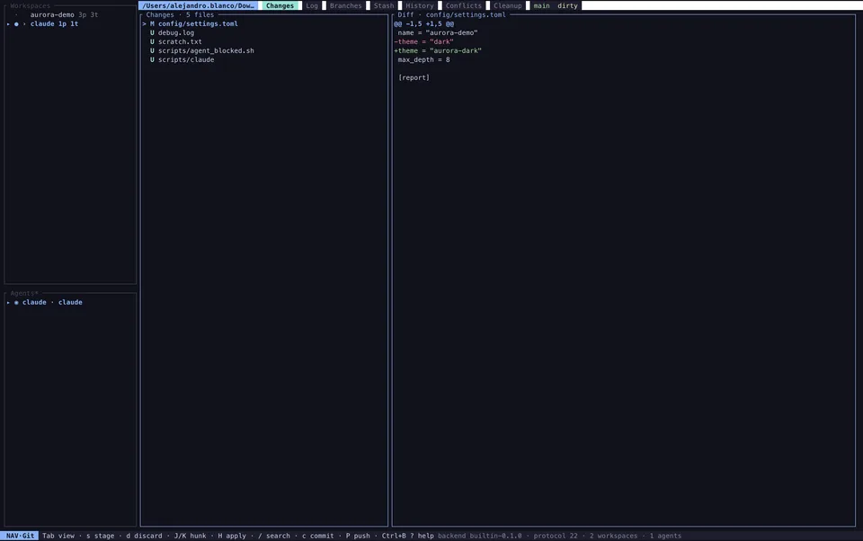

The catch, from the README: it ships its own backend and **can run with no herdr binary at all**. `--backend-mode external-herdr` (herdr 0.9.0+) attaches to a real herdr server instead. That makes it a different product from the others in this section. Useful, but not what this article is about. Mention it, don't pick it as your primary herdr client.

<Notice type="warning" title="Plugins are unsandboxed code">
"A plugin is ordinary code that runs on your machine". That's the official wording at [herdr.dev/docs/plugins](https://herdr.dev/docs/plugins/). `herdr plugin install owner/repo` previews the manifest before you confirm; pin with `--ref`, uninstall with `herdr plugin uninstall <id>`. There is no `plugin update`; reinstall to refresh. The marketplace auto-index of public repos tagged `herdr-plugin` refreshes every 30 minutes, which tells you how young some of this code is. Review before you install, and check the [best Herdr plugins](https://www.bitdoze.com/best-herdr-plugins/) shortlist for the ten worth vetting first.
</Notice>

## Herdr mobile app options: answer agents from your phone

Search demand for "herdr mobile app" is real, and it is the second thing people look for after the web UIs. There's even a "Herdr Mobile" listing on Google Play and a `herdr-mobile-relay` project in the wild (I haven't verified either; check before you install). The solid options split into two camps, and the community is vocal about both. Terminal-native people run SSH + mosh and say things like "Mosh is honestly the correct answer". Phone-tappers want an inbox with tap-to-approve buttons: "my thumbs are built for tapping like buttons, not Ctrl chords". Both are legitimate. If you want the full terminal-first phone setup with push approvals, our [step-by-step Moshi + Herdr phone setup](https://www.bitdoze.com/control-ai-agents-from-phone-moshi-herdr/) covers that path end to end.

Here are the commands per platform; the subsections below cover what each one is like to live with.

<Tabs>
  <Tab name="Android (Collie PWA)">
    ```bash
    curl -fsSL https://colliepwa.dev/install.sh | sh
    collie start
    # .env: COLLIE_TRUSTED_USER=you@example.com
    tailscale serve --bg --https=443 127.0.0.1:<collie-port>
    ```
    Open `https://<host>.tailnet.ts.net` on the phone, install to home screen, enroll push per device.
  </Tab>
  <Tab name="iPhone (Heeler)">
    ```bash
    # on the host running herdr (needs Node 20+, herdr 0.7.5+, StreamLocal forwarding)
    herdr plugin install ZingerLittleBee/Heeler/plugin --ref main --yes
    herdr plugin action invoke heeler.pair    # scan the QR in the app
    ```
    Transport is herdr's JSON API over SSH `direct-streamlocal` onto `herdr.sock`. No open ports.
  </Tab>
  <Tab name="Any phone (SSH + Mosh)">
    ```bash
    # host
    sudo apt install -y mosh
    # phone: any SSH client (JuiceSSH on Android, Termius, Moshi on iPhone)
    ssh you@server && herdr
    # optional: mosh you@server  (survives network switches)
    ```
    Zero extra services. The TUI adapts to narrow screens.
  </Tab>
</Tabs>

<Notice type="warning" title="Push notifications need HTTPS">
Web Push requires a secure context. Plain `http://ip:7331` refuses to subscribe, silently. Use `tailscale serve` (or another TLS front), enroll each device separately, and run the UI's built-in "Send test notification" before you trust the pipeline.
</Notice>

### Collie on Android: the PWA route

Add to home screen and you have a real app icon, web push when an agent blocks, quick replies, and a special-keys pad. No Play Store involved, by design (same for iOS). Device pairing acts as the write credential, so a stolen URL alone is read-only. With `tailscale serve` fronting it, `COLLIE_TRUSTED_USER=you@example.com` maps the injected `Tailscale-User-Login` header to your identity; clients cannot forge that header unless they own the tailnet. This is the most security-mature model in the ecosystem. My default Android pick.

### Heeler for iPhone: native iOS with QR pairing

[Heeler](https://heeler.bybee.dev) (ZingerLittleBee/Heeler, 428 stars) is a native SwiftUI app on the App Store (TestFlight fallback if your country lacks it; verify pricing and availability). It's an agent console sorted blocked-first, with a live terminal rendered by libghostty: native scrollback, and touch scrolling that drives full-screen TUIs. The composer uses the full iOS keyboard (autocorrect, IME, dictation) and sends the message once when you commit. SFTP attachments up to 64 MiB, worktrees, SSH jump host support, end-to-end encrypted push with Live Activities (per PRIVACY.md, the relay can't read content).

Host requirements: Node 20+, herdr 0.7.5+, and sshd with StreamLocal forwarding (the OpenSSH default). Pairing is QR-based via a herdr plugin: `herdr plugin action invoke heeler.pair`, scan, done. Apache-2.0, and explicitly not affiliated with the herdr project.

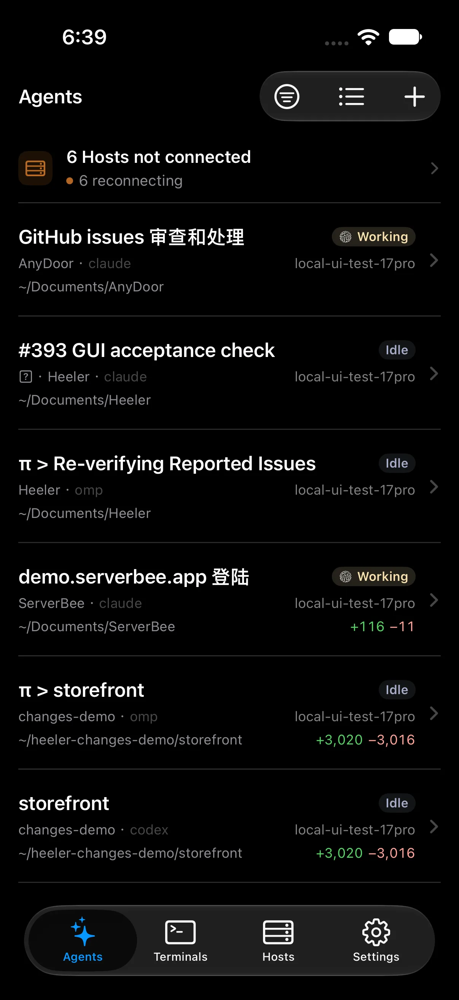

### Moshi (iOS + Android): the app-store terminal that knows Herdr

[Moshi](https://getmoshi.app) is a mobile terminal built around agent CLIs rather than generic SSH, and it is on both stores (iOS 17+, Android 10+). The free tier covers a full SSH terminal with unlimited sessions, push notifications for agent events (rate-limited), dictation, and biometric key protection. Pro ($7.99/month or $69.99/year, three devices) unlocks what makes it a real Herdr client: Mosh transport, the multiplexer UI for tmux/Zellij/Herdr, image paste, a diff viewer, and unlimited inbox actions.

Two parts are Herdr-specific. The session picker lists running Herdr sessions with a Ctrl-B chord panel and gestures tuned for narrow screens, and the agent inbox triages events into "Needs you / Working / Done" so you do not scroll scrollback to find the blocked pane. Pairing a host installs `moshi-hook`, a small daemon that reads the agents' own hooks (Claude Code `PreToolUse`/`Notification`/`Stop`, Codex, OpenCode) and turns permission prompts into lock-screen Approve/Deny pushes. It tags events with `$HERDR_SESSION`, so tapping a card drops you into that exact session.


This is the option I would hand to someone who wants an app, not a PWA workflow. The full host setup (VPS, hooks, mosh footguns) is in the [Moshi + Herdr phone guide](https://www.bitdoze.com/control-ai-agents-from-phone-moshi-herdr/). Moshi also ships a desktop app, covered below.

### Plain SSH + Mosh: the officially recommended path

Zero extra services, zero web exposure, and the answer the herdr docs give first. Any SSH app, `ssh you@server`, `herdr`. If the network drops matter, add mosh: "Mosh is honestly the correct answer… no compromises" is the sentiment on r/herdr, and it matches the "keep the moving parts count at zero" bias of this whole article. Reddit users run exactly this: herdr + mosh on the main device, an SSH app on the phone over Tailscale.

Two more options worth knowing about, since the ecosystem is spawning clients weekly. [herdr-remote](https://github.com/dcolinmorgan/herdr-remote) (407 stars) gives a macOS menu bar app, a phone web dashboard, and one-tap approvals from **Telegram** (`/agents`, `/reply`, `/trust`, `/interrupt`, plus a daily `/digest`). Useful if you live in Telegram; its relay binds `127.0.0.1:8375` and wants `HERDR_RELAY_TOKEN` set before any tunnel. TermRover (termrover.sh) and ShadowTerm are commercial SSH/mosh mobile terminals; TermRover ships a Herdr-aware "agents fleet" view across hosts. All three deserve a closer look on their own terms; none is in my default stack yet.

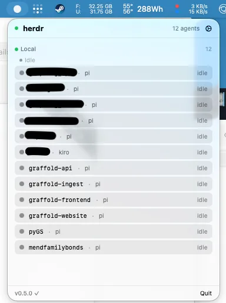

## Herdr desktop apps: herdrm and Moshi Desktop (and why "manager apps" are a trap)

If you want a real herdr desktop app rather than a terminal window, [herdrm](https://github.com/missuo/herdrm) (missuo/herdrm, 623 stars) is the most polished answer on macOS. Native SwiftUI + SwiftTerm, no Electron, macOS 14+, universal binary, signed and notarized, Sparkle auto-updates. A sidebar of Spaces and Agents across local + SSH devices (remote sockets via `ssh -L`, per-device reconnect with 1s→30s backoff), ⌘K search across every device, notifications with click-to-jump, and file/image paste into agent panes (remote pastes stream over SSH into a 7-day/50 MB cache). The difference that matters: it attaches real PTYs via `herdr agent attach`. It is a client, not a chat wrapper.

```bash
brew install owo-network/brew/herdrm
```

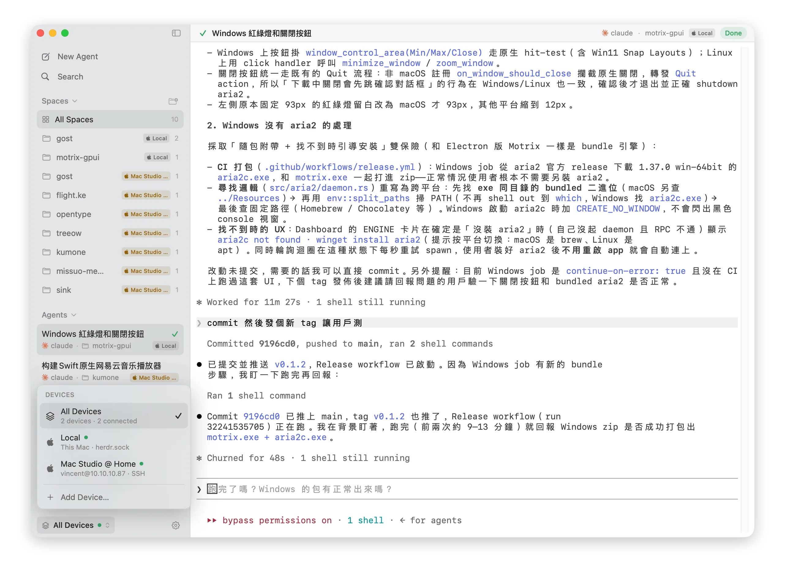

Auth order: OpenSSH keys/agent, then Tailscale SSH (1.98.0+), then Keychain-stored password. The project says "early stage"; the README credits Heeler for transport patterns.

Now the trap. herdr.dev/compare distinguishes the runtime from desktop "manager apps" (Conductor, Emdash, Superset) and terminal apps (cmux, Warp) whose agents **stop when the app quits**. Those apps own the runtime. herdrm, Heeler, Collie and the rest attach to it. That single difference (client vs. runtime owner) is the whole reason a Herdr ecosystem can exist. If you pick a tool that owns the agents, you're back to one vendor's roadmap.

### Moshi Desktop: the cross-platform answer

herdrm is macOS-only, but [Moshi Desktop](https://getmoshi.app/desktop) covers the rest: macOS (Apple Silicon and Intel `.dmg`), Windows x86_64 `.exe`, and Linux `.AppImage`, free for everyone, about 11 MB thanks to Tauri instead of bundled Chromium (a GPU-rendered Go rewrite is in alpha). The same team also ships a `moshi` CLI: `curl -fsSL https://getmoshi.app/install.sh | sh` then `moshi` opens the identical UI in a browser on `127.0.0.1`, which is a loopback web UI for people who do not want an app at all.

It is a client in the sense that matters here: your tmux and Herdr sessions stay in the multiplexer, and Desktop reads them through `moshi-hook` (loopback-only gateway; remote hosts ride over your own SSH). On top it adds a chat view, diffs, code comments pinned to output, dev-server previews it can tunnel, and one-tap approvals. Quitting it never kills an agent, which is the whole "manager apps are a trap" test passed. On macOS it also installs through `brew tap rjyo/moshi`.

## Security first: every Herdr web UI is a root shell

Treat the URL of any Herdr web UI as a root login into your machine. Not "a dashboard". The client can read your files, run commands in your panes, and touch whatever credentials your agent sessions hold. That is the product. The question is only who can reach that URL.

Auth reality per client:

- `herdrweb` has no authentication and stays loopback-only by design ("one operator, one machine").
- `kcosr/herdr-web` uses host/origin allow-listing. The repo says it itself: that is a DNS-rebinding guard, **not user authentication**.
- `herdr-web-ui` defaults to loopback, with Tailscale QR for the phone path.
- `ColliePWA` has the most mature model. `tailscale serve` injects `Tailscale-User-Login`, `COLLIE_TRUSTED_USER` maps it to an identity, and per-device pairing tokens gate writes.
- `alecuba16/herdr-webui` binds loopback and can run without herdr at all, so its blast radius is whatever its own backend does.

The pattern that works: bind loopback, front with `tailscale serve` (TLS + identity header), only open it from devices on your tailnet.

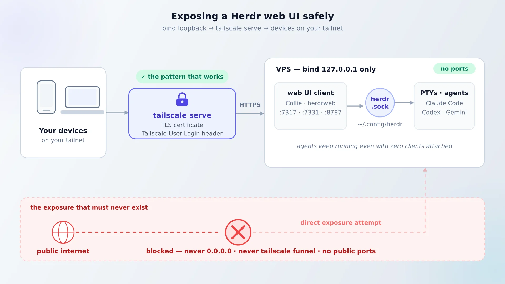

<Notice type="error" title="Never expose these to the internet">
Never bind `0.0.0.0`. Never `tailscale funnel`. If a client must leave the machine, it goes behind tailnet identity (or an equivalent mesh VPN) with TLS. Also: `pane_history = true` in herdr is experimental and OFF for a reason. Persisted screens can contain secrets, and turning it on writes them to disk. If you already manage Docker stacks from a web UI, [the same loopback + Tailscale pattern applies to Dockge](https://www.bitdoze.com/dockge-install/).
</Notice>

<ListCheck>
  <ul>
    <li>Loopback binding confirmed: `ss -tlnp | grep -E '7317|7331|8787'` shows `127.0.0.1`, not `0.0.0.0`</li>
    <li>Exposed via `tailscale serve`, never `tailscale funnel`</li>
    <li>`COLLIE_TRUSTED_USER` set (Collie) or device pairing enrolled (Heeler/herdr-web-ui)</li>
    <li>Push tested over HTTPS from each enrolled device</li>
    <li>Plugins reviewed before install, `--ref` pinned, unused ones uninstalled</li>
    <li>`~/.config/herdr` included in backups with restricted permissions</li>
  </ul>
</ListCheck>

## The reference setup: Hetzner VPS + Herdr + Tailscale + one client

<Notice type="warning" title="Affiliate Disclosure">
Some links in this guide are affiliate links. If you buy through them, we may earn a small commission at no extra cost to you. This helps us keep testing and updating these recommendations.
</Notice>

This is the "run it tonight" path for a herdr VPS setup, and it's deliberately boring. Agents live on a small VPS. I use [Hetzner Cloud](https://go.bitdoze.com/hetzner) for this class of workload: a €4-5/mo CX22-class box is plenty because coding agents are API-bound, not CPU-bound. The laptop is just a client. That's also the herdr team's own 0.9 talking point: "the laptop is turning into a client".

Ops surface: one binary (herdr), one systemd user service (Collie or herdrweb), and Tailscale you probably already run. No Docker, no databases, zero containers to babysit. The only thing to back up is `~/.config/herdr/`.

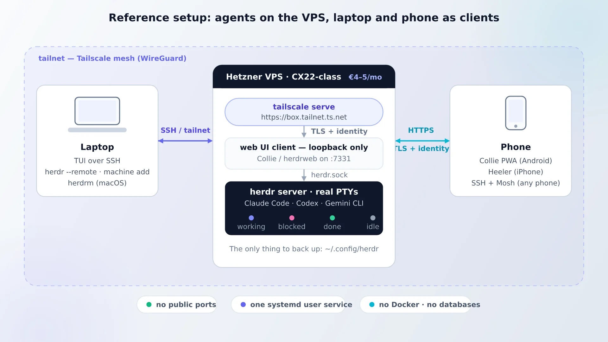

### Prerequisites

<ListCheck>
  <ul>
    <li>Linux VPS: Hetzner CX22-class or better. Shared CPU is fine; builds and test suites can bottleneck on tiny boxes. [How to benchmark a cloud server before committing](https://www.bitdoze.com/benchmark-cloud-servers/) if you're comparing providers. A [budget Hostinger KVM VPS](https://go.bitdoze.com/hostinger-vps) works too. Any small box with 2+ GB RAM does</li>
    <li>Tailscale account + tailnet on the VPS, laptop, and phone</li>
    <li>Herdr 0.9.x on the VPS: `curl -fsSL https://herdr.dev/install.sh | sh`, verified with `herdr -V && herdr status`</li>
    <li>A MagicDNS name (or domain) for `tailscale serve` HTTPS</li>
    <li>Ports: none exposed publicly. Loopback only (7317 / 7331 / 8787 depending on client)</li>
  </ul>
</ListCheck>

<Button text="Deploy on Hetzner Cloud" link="https://go.bitdoze.com/hetzner" variant="solid" color="blue" size="md" />

### Happy path

1. Provision the VPS, create a non-root user, then:

```bash
sudo apt update && sudo apt install -y tailscale
sudo tailscale up
```

2. Install herdr and verify:

```bash
curl -fsSL https://herdr.dev/install.sh | sh
herdr -V && herdr status
```

3. Start real work: `cd ~/project && herdr`, launch your agent in a pane the way you normally would, and detach with `ctrl+b q`.

4. Install exactly **one** client. Phone-first: Collie. Inbox-first: herdrweb.

```bash
# option A: Collie
curl -fsSL https://colliepwa.dev/install.sh | sh
collie start

# option B: herdrweb
curl -fsSL https://raw.githubusercontent.com/sarathsp06/herdrweb/main/install.sh | sh
herdrweb -service install && herdrweb -service start
```

5. Front it on the tailnet:

<Tabs>
  <Tab name="tailscale serve (recommended)">
    ```bash
    tailscale serve --bg --https=443 127.0.0.1:7331
    # phone browser: https://<host>.tailnet.ts.net
    ```
    TLS + identity header + Web Push works. This is the default. Use `tailscale serve status` to see what's published and `tailscale serve reset` to tear it down.
  </Tab>
  <Tab name="SSH tunnel only">
    ```bash
    ssh -L 7331:127.0.0.1:7331 you@vps
    # laptop browser: http://127.0.0.1:7331
    ```
    No Tailscale dependency, no identity header, and **no Web Push** (needs HTTPS). Fine for a quick look; annoying as a daily phone workflow.
  </Tab>
</Tabs>

6. Optional on a Mac: `brew install owo-network/brew/herdrm`, then `herdr machine add workbox --label "Build box"` so one sidebar covers laptop and VPS.

### Verify

<ListCheck>
  <ul>
    <li>`herdr status`: client and server versions match (0.9.2+ lists stale servers after `herdr update`)</li>
    <li>`ss -tlnp | grep -E '7317|7331|8787'` proves the binding is loopback-only</li>
    <li>`curl -I https://<host>.tailnet.ts.net` from the phone browser: expect TLS, not connection refused</li>
    <li>Push test from the UI's settings ("Send test notification") on every enrolled device</li>
    <li>End-to-end drill: detach → close the laptop → reattach from the phone → agent still mid-task</li>
    <li>`herdr agent list`: states (working/blocked/done/idle) roll up correctly</li>
  </ul>
</ListCheck>

### What it costs / ops notes

Herdr and every client in this article is free and open source (Apache-2.0 / MIT), except the commercial mobile terminals (TermRover, ShadowTerm; verify pricing before buying). Your only cost is the VPS, order of magnitude €4-5/mo. No GPU. If you'd rather not rent, [run Herdr at home on a mini PC](https://www.bitdoze.com/best-mini-pc-proxmox/). A [compact mini PC like the ASUS DC510](https://go.bitdoze.com/asus-dc510) is a sane always-on box, and the Tailscale model is identical. Backups: tar `~/.config/herdr` into whatever S3 job you already have.

### Rollback / tear-down

```bash
collie stop                      # or: herdrweb -service stop / -service uninstall
herdr plugin uninstall <id>      # remove heeler / herdr-web-ui plugins
tailscale serve reset            # unpublish the HTTPS front
```

`herdr server stop` **only** when you mean to kill the agents, not for "I'm done for today". On the VPS the whole stack is 2-3 native binaries; removal is deleting the service unit and the config dir.

## Version footguns and failure modes (0.9.x moves fast)

<Notice type="warning" title="0.9.x moves fast">
Every client pins a different herdr minimum: herdr-web-ui needs 0.9.0+, Heeler 0.7.5+ (plus Node 20), kcosr/herdr-web 0.7.2+, alecuba16 external mode 0.9.0+. Re-check both sides of the pair on upgrade day.
</Notice>

1. **`herdr server stop` kills agent processes.** Detach ≠ stop. A restart restores layout, and conversation resume needs `herdr integration install codex|claude|cursor` (or a self-reporting agent, v0.9.2+). Verify with `herdr status`.
2. **Client newer than server** after `herdr update`. The old server keeps running; 0.9.2+ lists which servers are still stale, with restart commands. Replacing the remote server asks first because it stops pane processes. `herdr update --handoff` migrates live (experimental).
3. **State detection wrong** (Codex false-idle, Claude spinner, OpenCode V2 states). Chat-transcript clients chase agent UI changes; the 0.9.2/0.9.3 changelogs are full of detection fixes. Fix: `herdr agent explain <agent> --verbose` shows which detection rule fired, and `herdr server update-agent-manifests` pulls new manifests.
4. **API drift.** kcosr/herdr-web vendors private herdr protocol and needs updates per herdr release. Assume it breaks on major upgrades and pin versions.
5. **Push silently fails** without an HTTPS secure context. Plain `http://ip:7331` won't subscribe. Enroll per device, then use the built-in test notification.
6. **Heeler/SSH oddities.** StreamLocal forwarding must be on (OpenSSH default; onboarding warns if disabled). Saved machines never answer interactive prompts, so a host-key change or MFA makes the machine show "Attention". Run `herdr --remote host` once interactively, or `herdr machine reconnect` (v0.9.2). Passphrase-protected keys must be in ssh-agent.
7. **Stale multi-machine state.** A dropped machine's rows stay visible but dimmed and cached; you can't type into them. Local always opens first, so a slow VPS can't hold up your laptop.
8. **CLI targets one server at a time**, even in the 0.9 multi-machine UI. `herdr --machine <label>` (v0.9.1+) forwards commands. IDs are server-scoped. Read them from `--json` output, never guess.
9. **Don't wrap tmux between herdr and the agent.** Herdr sees tmux, not the agent, and detection breaks. Pick one layer.
10. **Windows quirks.** `install.ps1` is an unsigned binary and SmartScreen may warn; `install.cmd` is the fallback when endpoint security blocks the one-liner. Check [herdr.dev/docs/windows-beta](https://herdr.dev/docs/windows-beta/) for what's still unsupported (direct terminal attach, live handoff, clipboard image bridge).

## Watchlist: Herdr Cloud and how fast this ecosystem moves

Herdr Cloud is on a waitlist: a relay that connects your machines without SSH setup, with terminal traffic end-to-end encrypted. The pitch is "Cloud connects them instead of hosting the agents", so it may eventually replace the `tailscale serve` plumbing in the reference setup. Join the waitlist if you're curious; don't design around it yet.

The ecosystem moves fast. Multiple independent clients shipped within weeks of v0.9's multi-machine support, and the plugin marketplace re-indexes every 30 minutes. The star count (42.7k as of October 2026) keeps pulling new builders in. Some of those clients will be abandonware in six months. Keep your stack to herdr plus one client, and swapping the client later is cheap. If you want to track what's worth starring, [worth-starring AI repos, including the Herdr ecosystem](https://www.bitdoze.com/top-ai-github-repos/) is the running list.

## FAQ

<Accordion label="Is there an official Herdr web UI or mobile app?" group="faq" expanded="true">
No. The official clients are the TUI, the CLI/socket API, plain SSH, `herdr --remote`, and the multi-machine window. Everything else (ColliePWA, herdr-web-ui, Heeler, herdrm, herdrweb) is community-built. The naming confusion is documented: people ask "what's the difference from the built-in web UI?" and the answer is that there is none.
</Accordion>

<Accordion label="Herdr vs tmux for coding agents: which should I use?" group="faq">
Herdr adds agent-aware state (working/blocked/done), a socket API, and a client ecosystem on top of the tmux-style workflow; tmux plus mosh remains a legitimate terminal-native answer. If you only need persistent panes, tmux is fine. [Our Herdr review](https://www.bitdoze.com/herdr-agent-multiplexer/) covers the full comparison. For a different take on multiplexing itself, [Superlogical Rex](/superlogical-rex/) makes the terminal the multiplexer instead of running one inside it (macOS only for now).
</Accordion>

<Accordion label="Can I approve Claude Code prompts from my phone?" group="faq">
Yes. Collie gives tap-to-answer cards, herdr-web-ui renders approvals as tappable chat cards, Heeler has encrypted push plus Live Activities, and Moshi turns prompts into lock-screen Approve/Deny pushes via moshi-hook. All four assume loopback binding plus a tailnet, not a public URL.
</Accordion>

<Accordion label="Is it safe to expose a Herdr web UI on the internet?" group="faq">
No. Bind loopback and front with `tailscale serve`. Never `tailscale funnel`, never `0.0.0.0`. The URL is a root login into whatever the herdr process can reach: files, commands, agent credentials.
</Accordion>

<Accordion label="Does the Herdr ecosystem cost anything?" group="faq">
No. Herdr and all the clients covered here are free and open source; TermRover and ShadowTerm are the commercial exceptions. Any small VPS works, order of magnitude €4-5/mo, and no GPU is involved; coding agents are API-bound.
</Accordion>

## Wrapping up

Start with the TUI. Add exactly one client when the phone scenario shows up, and keep everything behind the tailnet. Copy the reference setup if you want the boring, verifiable version of that.

<Button text="Read our Herdr review" link="https://www.bitdoze.com/herdr-agent-multiplexer/" variant="solid" color="blue" size="md" />
<Button text="Set up phone control with Moshi" link="https://www.bitdoze.com/control-ai-agents-from-phone-moshi-herdr/" variant="outline" color="gray" size="md" />
