import Button from "@components/widgets/Button.astro";
import Notice from "@components/widgets/Notice.astro";
import ListCheck from "@components/widgets/ListCheck.astro";
import Accordion from "@components/widgets/Accordion.astro";
import Tabs from "@components/widgets/Tabs.astro";
import Tab from "@components/widgets/Tab.astro";
import YouTubeEmbed from "@components/widgets/YouTubeEmbed.astro";

The Herdr plugin marketplace is young, huge, and completely unreviewed: roughly 1,000+ indexed plugins and about 1,500 repos tagged `herdr-plugin` on GitHub as of 2026-10-08. A plugin runs as your user with your full environment, so installing blind is a bad idea. What follows is my cut of the best Herdr plugins worth installing, with the install/pin/verify commands, plus the vetting workflow for the rest of the Herdr plugin marketplace. If you are new to the runtime itself, read [our Herdr review (open-source agent multiplexer)](/herdr-agent-multiplexer/) first, then check the [best AI coding tools and agents in 2026](/ai-coding-tools/) that these plugins observe.

## What are Herdr plugins?

A Herdr plugin is a directory with a `herdr-plugin.toml` manifest plus commands Herdr launches as argv arrays. That is the whole model. There is no SDK and no restricted API surface: the entire `herdr` CLI is the plugin API, and plugins call back through `HERDR_BIN_PATH`, which works the same over Unix sockets and Windows named pipes. Any language works, because Herdr just execs what the manifest declares: Bash, JavaScript, Lua, Rust, Go, Python, PowerShell.

The Herdr plugin marketplace at `herdr.dev/plugins` is not a catalog anyone has reviewed. It is an automatic index of public GitHub repositories tagged with `herdr-plugin`, refreshed every 30 minutes. Forks, archived repos, and repos whose manifests fail to parse are excluded. Everything else shows up.

<Notice type="warning" title="No sandbox, no review">
  The official docs put it plainly: "A plugin is ordinary code that runs on your machine." Herdr validates the manifest fields and nothing else. It "does not review or sandbox plugin code." A plugin runs as your user, with your environment variables and your full CLI access. Vetting is your job, and the checklist below is the mitigation.
</Notice>

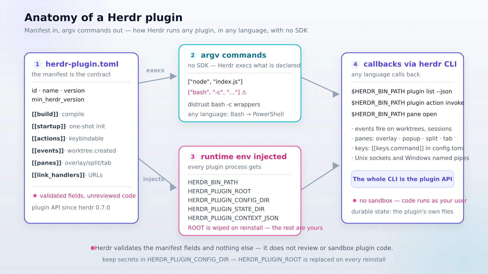

The manifest is the contract. Required fields are `id`, `name`, `version`, and `min_herdr_version` (the plugin API exists since herdr 0.7.0, and Herdr refuses to install a plugin that demands a newer binary than the one you run). Optional sections cover the interesting parts: `[[build]]` compiles things on GitHub installs, `[[startup]]` runs one-shot init after session restore and re-runs on live handoff, `[[actions]]` are named commands you can invoke or bind to keys, `[[events]]` fire on things like `on = "worktree.created"`, `[[panes]]` place a UI (overlay by default, or `popup`, `split`, `tab`, `zoomed`), and `[[link_handlers]]` turn Ctrl+click on a URL into an action via a Rust regex.

At runtime Herdr injects `HERDR_SOCKET_PATH`, `HERDR_BIN_PATH`, `HERDR_ENV=1`, `HERDR_PLUGIN_ID`, `HERDR_PLUGIN_ROOT`, `HERDR_PLUGIN_CONFIG_DIR`, `HERDR_PLUGIN_STATE_DIR`, and `HERDR_PLUGIN_CONTEXT_JSON`. Remember one rule about those paths: `HERDR_PLUGIN_ROOT` is a managed checkout that a reinstall replaces. Never store credentials there. Config and state dirs are yours to own.

Scale matters for how you browse. The GitHub topic page lists about 1,500 public repositories as of 2026-10-08, and that count includes dotfiles collections and tools cross-tagged from other ecosystems. The curated index on herdr.dev shows only repos with parseable manifests on the default branch, which puts the real marketplace at roughly 1,000+ entries. Discovery is either the index or the GitHub topic search, the same way you would browse [top AI GitHub repos worth starring](/top-ai-github-repos/) and filter hard.

Cost check before we continue: everything in this article is free and local. No account, no GPU, no database, no subscription. The only optional spend is a small VPS if you want agents running 24/7, and I cover that at the end.

<YouTubeEmbed url="https://youtube.com/embed/29KAoidwCUA" label="5 JAW-DROPPING Herdr Plugins!!!" />

That is what most plugin coverage looks like: enthusiasm, no commands, no trust workflow. The picks below are the vetted, command-first version.

## How to install Herdr plugins the safe way

Installing Herdr plugins is one command. Installing them without regret takes five minutes of reading first. The operator flow is: prerequisites, vet (the full checklist is its own section below), install with preview, pin the revision you reviewed, verify, and know the rollback path.

### Prerequisites (what you need)

Herdr 0.7.0 or newer, because that is when the plugin API landed. Individual plugins can demand more: herdr-reviewr needs >= 0.7.5, and the herdr-web-ui installer expects 0.9.0+. Git, because `plugin install` clones a repository. And whatever toolchain the plugin builds with: node or bun for TypeScript plugins, Go for the herdr-plus and tsk crowd, cargo for the Rust TUIs. Herdr does not install toolchains for you. A missing `cargo` shows up as a failed build step that aborts registration.

<ListCheck>
  <ul>
    <li>herdr >= 0.7.0, confirmed with `herdr --version`</li>
    <li>git on PATH (install clones the repo)</li>
    <li>the toolchain your pick builds with: node/bun, go, or cargo</li>
    <li>5 minutes to read the repo's `herdr-plugin.toml` before installing</li>
  </ul>
</ListCheck>

### Install with preview, pin a revision

1. Browse the index at https://herdr.dev/plugins or search GitHub for `topic:herdr-plugin`.
2. Open the repo and read `herdr-plugin.toml` before anything else. If the commands look wrong, stop there.
3. Run `herdr plugin install owner/repo[/subdir]`. In an interactive terminal Herdr shows a preview of the source and the commands it is about to run. Read it. **Never pass `--yes` on a first install.**
4. Pin what you reviewed: `herdr plugin install owner/repo --ref v1.2.0`. The pin is your rollback anchor.
5. Build commands run only on GitHub installs. A build failure aborts registration, and editing the manifest after the preview aborts the install. Both are features. For local development, `herdr plugin link /path` registers a directory and skips builds entirely.

```bash
# install with the interactive preview
herdr plugin install persiyanov/herdr-reviewr

# install the exact revision you reviewed
herdr plugin install persiyanov/herdr-reviewr --ref v1.2.0

# local development: register a directory, no build step
herdr plugin link /home/you/src/my-herdr-plugin
```

<Tabs>
  <Tab name="Unix">
    ```bash
    # one-time install of herdr itself
    curl -fsSL https://herdr.dev/install.sh | sh

    herdr --version   # expect >= 0.7.0
    git --version
    herdr plugin install owner/repo
    ```
  </Tab>
  <Tab name="Windows">
    ```powershell
    irm https://herdr.dev/install.ps1 | iex

    herdr --version
    herdr plugin install owner/repo
    ```

    On Windows, build/action/event commands resolve `PATHEXT` shims, so `npm` and `bun` correctly become `npm.cmd` and `bun.cmd`. Pane commands must be valid Windows argv; do not paste Unix shell syntax into a `command` array.
  </Tab>
</Tabs>

<Notice type="info" title="No plugin update command">
  Plugin v1 has no `herdr plugin update`. "Updating" means re-running `herdr plugin install owner/repo` (optionally with a new `--ref`), and that **replaces the managed checkout**. Anything you left in `HERDR_PLUGIN_ROOT` is wiped. Keep secrets and settings in `HERDR_PLUGIN_CONFIG_DIR`, which survives reinstalls and uninstalls.
</Notice>

### Verify it worked

After every install, confirm registration and a clean first run:

```bash
herdr plugin list --json                      # registered + enabled, with ids
herdr plugin action list --plugin plugin.id   # what actions exist
herdr plugin action invoke plugin.id.action   # run one once
herdr plugin log list --plugin plugin.id --limit 20
```

Open the plugin's pane or action once and expect normal output in the logs with exit code 0. What "broken" looks like: the plugin missing from `plugin list`, a non-zero exit in `plugin log list`, or an action that hangs because its toolchain or a config file is missing.

To bind an action to a key, add it to `~/.config/herdr/config.toml` and reload:

```toml
[[keys.command]]
key = "prefix+l"
type = "plugin_action"
command = "example.layout.apply"
description = "apply layout"
```

```bash
herdr server reload-config
```

### Rollback / undo

```bash
herdr plugin disable ID        # keep it, stop it running
herdr plugin enable ID
herdr plugin uninstall ID      # removes the managed checkout
herdr plugin unlink ID         # local dev deregistration
```

`uninstall` removes the managed checkout but leaves the config and state dirs in place, which is your recovery path if you uninstall by mistake. Two quirks to know: installing over a linked plugin is refused, so `unlink` first; and on 0.7.3, plugins registered only inside a named session need to be re-linked or reinstalled.

Failure modes in this section: a build abort with capped stdout/stderr is almost always a missing `cargo`/`npm`/`go`, install the toolchain and retry. A refused install over a local dir means you hit the linked-plugin rule. An abort after the preview means the manifest changed between preview and confirm, which is Herdr refusing to run code you did not see.

## The 10 best Herdr plugins worth installing

Ten picks, grouped by the job they do. Star counts are 2026-10-08 snapshots, not trust scores. Every install command is fully qualified `owner/repo` on purpose, because name collisions are real in this marketplace.

<ListCheck>
  <ul>
    <li>Review the agent's diff: herdr-reviewr</li>
    <li>See what the agent touched: herdr-file-viewer</li>
    <li>Watch the agent work: zoetrope</li>
    <li>Track spend and context: herdr-agent-usage</li>
    <li>Bootstrap a workspace from TOML: herdr-plus</li>
    <li>Keep tabs named sanely: herdr-auto-title</li>
    <li>Fuzzy-navigate everything: herdr-navigator</li>
    <li>Recover after a crash or reboot: herdr-resurrect</li>
    <li>Manage the plugin zoo: herdr-plugin-manager</li>
    <li>Drive agents from your phone: collie</li>
  </ul>
</ListCheck>

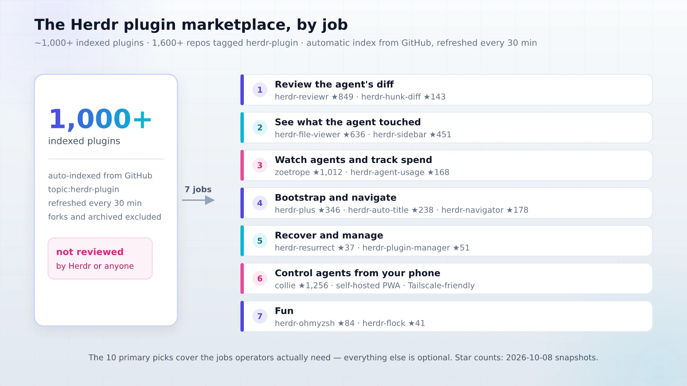

### Review the agent's diff (herdr-reviewr)

`persiyanov/herdr-reviewr` (804 stars) opens the agent's diff in a terminal pane and sends line comments back to Claude Code, Codex, OpenCode, and Pi. Rust, with prebuilt binaries so there is no cargo step on install. It wants herdr >= 0.7.5 and runs on macOS and Linux. It closes the gap that matters once an agent writes code: the one between "it wrote code" and "you read it." This is the killer use case for Herdr plugins in general, because the review loop lives beside the agent instead of in a browser tab you forget to check.

```bash
herdr plugin install persiyanov/herdr-reviewr
```

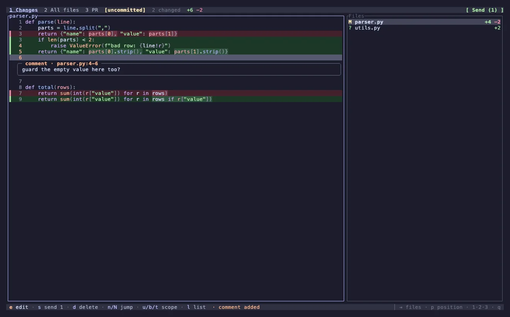

Trust note: small Rust surface, manifest declares the usual actions and panes, no surprises in the command arrays beyond the review binary itself. Verify by opening the review pane once on a repo with uncommitted changes and confirming the diff renders, then leave a test line comment and watch it arrive in the agent's input. What "broken" looks like: an empty diff pane on a dirty working tree, which usually means the plugin is not pointed at the right workspace tab.

If you want lighter, `jhochenbaum/herdr-hunk-diff` (143 stars) does hunk-based review with inline comments and fewer moving parts. Install it the same way: `herdr plugin install jhochenbaum/herdr-hunk-diff`. `plannotator/herdr-annotate` is the annotate-anything cousin if your feedback loop is about terminal text in general, not just diffs.

### See what the agent touched (herdr-file-viewer)

`smarzban/herdr-file-viewer` (636 stars) is a git-aware, read-only file tree TUI: tree plus content, working-tree diffs, rendered markdown, syntax highlighting. Read-only is a feature when the agent is the one writing files. You look, it writes, and you cannot fat-finger an edit in the viewer.

```bash
herdr plugin install smarzban/herdr-file-viewer
```

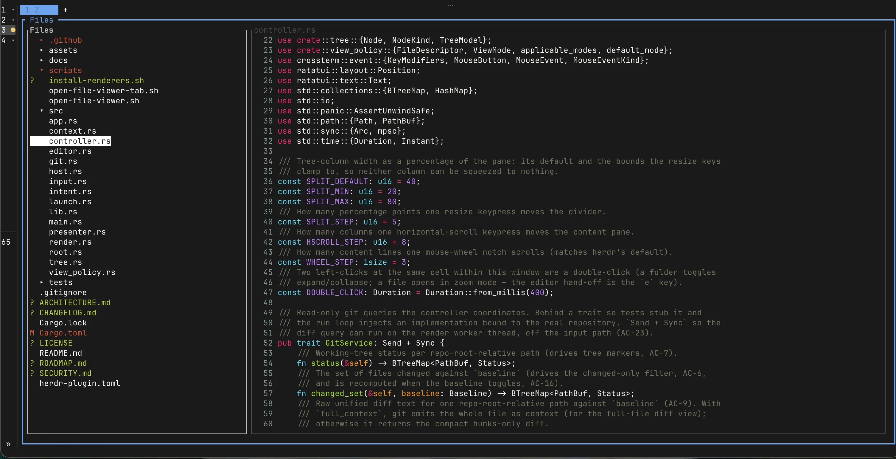

Trust note: presentation-layer plugin, the risky part is whatever it execs to read git state. Verify by opening the tree pane and confirming the working-tree diff shows the agent's last change. If the tree renders but diffs stay empty, check that you opened the pane in the same workspace tab as the repo; the plugin reads the git state of its own pane context.

If you want a write-capable VS Code-style explorer instead, `alexarthurs/herdr-sidebar` (424 stars) gives you file explorer, git source control, diffs, and AI commit messages. Note the difference before you install: it can change your repo, herdr-file-viewer cannot.

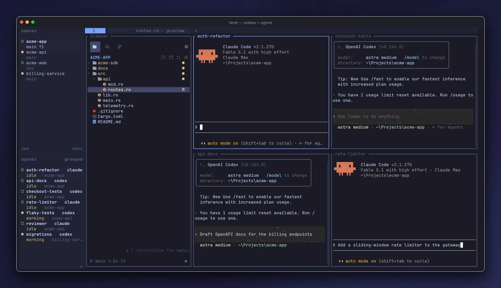

### Watch agents and track spend (zoetrope, herdr-agent-usage)

`furkankly/zoetrope` (978 stars) draws a live flow graph of a Claude Code or Codex session, in the terminal or in a browser. Rust and ratatui. When you have three agents running and need to know what one is doing right now, this is the pane you open.

```bash
herdr plugin install furkankly/zoetrope
```

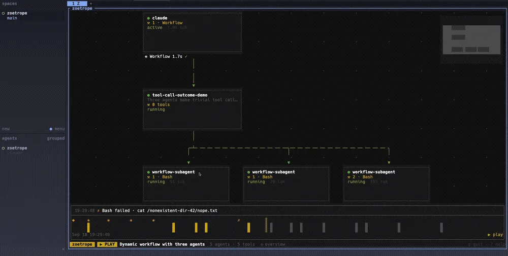

`levi-qiao/herdr-agent-usage` (168 stars) shows credential-scoped AI usage, context, and cache for Claude, Codex, Grok, Devin, Cursor, and friends, in a sidebar or statusline. Token cost is the real bill in an agent stack. The plugins only observe it, but observing it is the difference between a fun weekend and a surprise invoice.

```bash
herdr plugin install levi-qiao/herdr-agent-usage
```

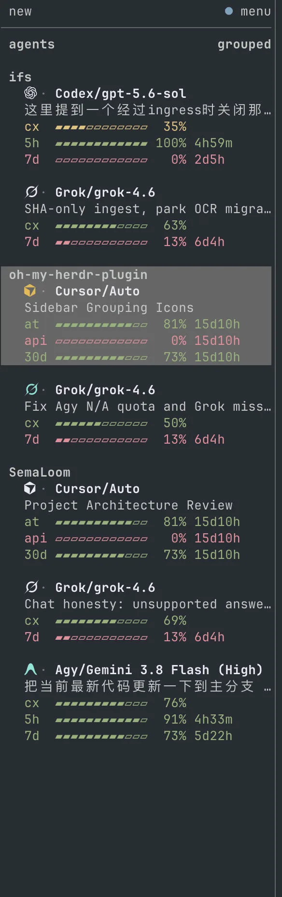

<Notice type="warning" title="Name collision">
  There is a different repo called `senna-lang/herdr-agent-usage` (47 stars) that does context meters and rate limits. Same plugin name, different code, different author. Always install by fully qualified `owner/repo` and write down which one you got. The same trap exists with auto-titles and browser plugins; see the gotchas section.
</Notice>

Verify zoetrope by opening its pane during a live agent session and expecting the flow graph to update. Verify herdr-agent-usage against one known account and confirm the numbers roughly match the provider's own dashboard. `hhdebb/herdr-radar` (154 stars) is the alternative if what you need is "who is working, who is waiting on me," grouped by project with idle sessions fading out.

```bash
herdr plugin install hhdebb/herdr-radar
```

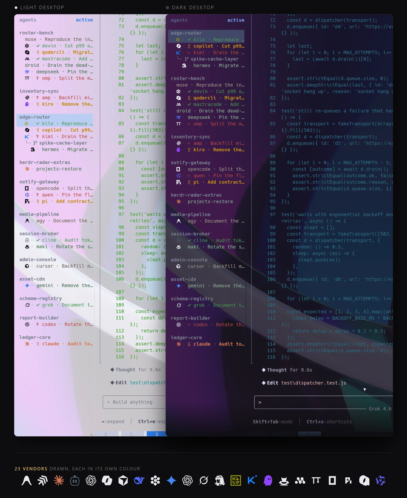

### Workspace bootstrap and navigation (herdr-plus, herdr-auto-title, herdr-navigator)

`cloudmanic/herdr-plus` (345 stars) is the one plugin here with its own website for a reason. Projects rebuilds an entire workspace from a single TOML file you own: tabs, splits, startup commands. Quick Actions is a fuzzy launcher that works in any tab, with per-repo `.herdr-plus/` action files. Go binary, own docs at herdrplus.com, Homebrew tap if you want it that way.

```bash
herdr plugin install cloudmanic/herdr-plus
```

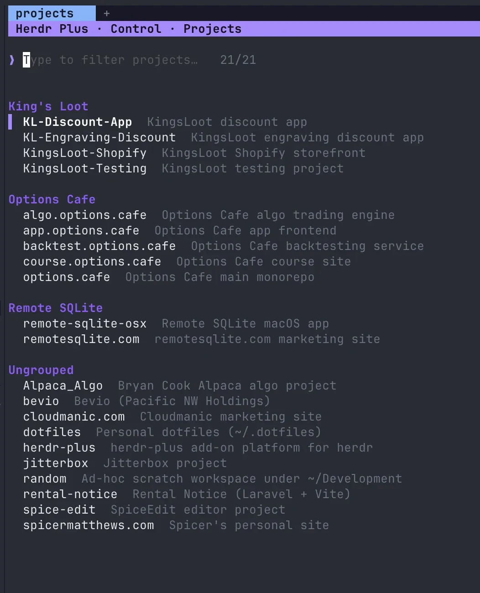

The site advertises default keys at prefix + up/down after binding. Confirm the binding in `~/.config/herdr/config.toml` if it does not respond, then `herdr server reload-config`. Verify by defining a two-tab project TOML, restarting, and confirming the layout comes back. The "TOML you own" part is what sold me on this one: no hidden state, no database, the layout lives in a file you can commit to your dotfiles and hand-edit at 2am when a pane is in the wrong place.

`kryptamine/herdr-auto-title` (238 stars) auto-names tabs and panes from git branch, terminal activity, and Claude Code sessions. At 10+ panes this is not a nicety, it is how you find anything.

```bash
herdr plugin install kryptamine/herdr-auto-title
```

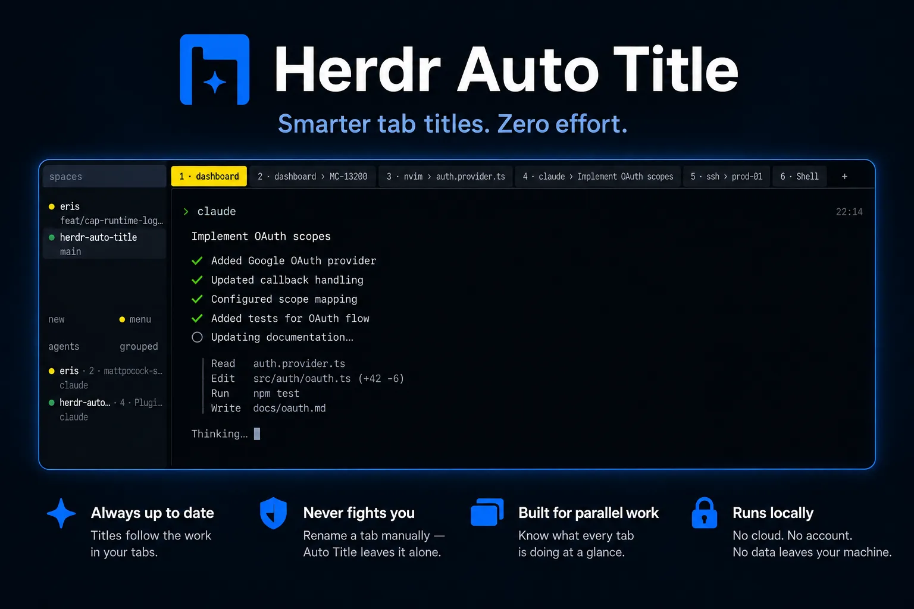

`thanhdat77/herdr-navigator` (178 stars) is one fuzzy navigator for workspaces, agents, projects, remotes, and directories. If you already live in a fuzzy jumper like [smarter terminal navigation with zoxide](/zoxide/), this is the same muscle memory applied to Herdr's object model.

```bash
herdr plugin install thanhdat77/herdr-navigator
```

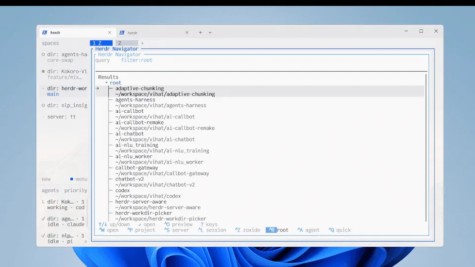

One mention for the audit-minded: `qu8n/herdr-automatic-rename` (209 stars) is the plain-Shell twin of auto-title and probably the easiest plugin in this whole article to read end-to-end. Good "first plugin you vet" candidate.

### Crash recovery and plugin management (herdr-resurrect, herdr-plugin-manager)

`ntindle/herdr-resurrect` (37 stars) is tmux-resurrect for herdr: it snapshots workspaces, tabs, panes, cwd, programs, and agents, and restores them after a crash or reboot. The star count is low, the value is not. Losing a 12-pane agent farm to a reboot is a bad afternoon. Snapshots trigger on the events the plugin declares and restore through the same herdr CLI everything else uses, so there is no separate daemon to babysit.

```bash
herdr plugin install ntindle/herdr-resurrect
```

`speardragon/herdr-plugin-manager` (51 stars) manages installed plugins from a popup: install, enable, uninstall, browse the marketplace. Default binding is `prefix+p`.

```bash
herdr plugin install speardragon/herdr-plugin-manager
```

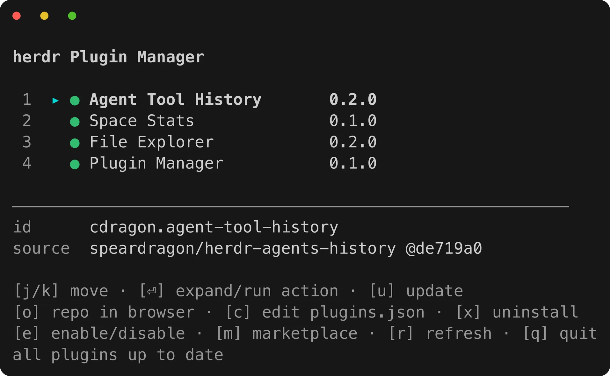

Footgun: popups are singleton session resources. They have no pane ID and no lifecycle events, and they return `ui_busy` if a Settings or Copy-mode modal is open. That is Herdr, not a broken plugin.

Snapshots are not backups. Version your `config.toml` and each plugin's `HERDR_PLUGIN_CONFIG_DIR` contents in git or [self-hosted backups with Restic](/pluton-self-hosted-backup/). Plugin code itself re-installs from pinned refs, so it does not need to live in your backup set.

### Reach your agents from your phone (collie)

`AltanS/collie` (1,256 stars) is a self-hosted PWA that drives Claude Code, Pi, Codex, and OpenCode running inside Herdr, tmux, or zellij from your phone. Push alerts, Tailscale by default, no app store involved. It is the most popular remote client in the plugin space and the one I would pick if the machine stays at home behind Tailscale.

```bash
herdr plugin install AltanS/collie
```

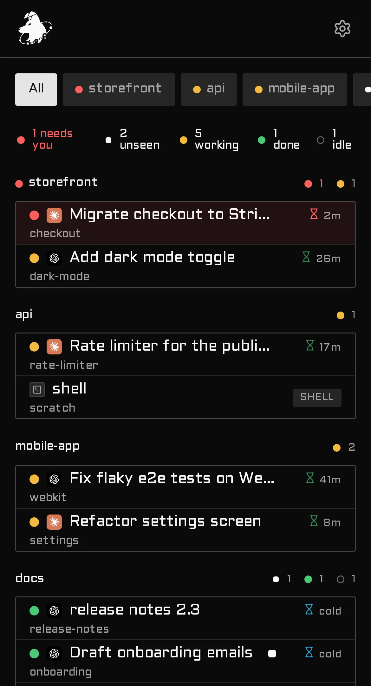

<Notice type="error" title="Remote plugins are attack surface">
  These plugins expose live terminal and agent sessions over tunnels, relays, or bots. Prefer Tailscale (free tier) or a Cloudflare Tunnel over any open inbound port. Treat relay tokens like secrets. And recheck licenses before you build on these repos: `0cv/herdr-mobile-relay` and `dcolinmorgan/herdr-remote` both show NOASSERTION licenses as of 2026-10-08.
</Notice>

If collie does not fit, `0cv/herdr-mobile-relay` (287 stars) does mobile web plus QR setup and multi-computer relays via Cloudflare, with the license caveat above. `devswha/herdr-web-ui` (284 stars) is the browser-first option: chat and a live terminal per pane, remote machines over SSH, web push. For the full remote-client picture (web UIs, phone apps, desktop apps) see the companion piece on the [best Herdr clients](/best-herdr-clients/).

<Notice type="warning" title="Affiliate Disclosure">
  Some links in this guide are affiliate links. If you buy through them, we may earn a small commission at no extra cost to you. This helps us keep testing and updating these recommendations.
</Notice>

If the machine running your agents has to stay up 24/7, a 2-4 GB [Hetzner Cloud](https://go.bitdoze.com/hetzner) box at roughly 4-8 EUR/month is plenty; no GPU involved. A budget [Hostinger VPS](https://go.bitdoze.com/hostinger-vps) with NVMe/EPYC specs works at the same tier. For the full always-on setup, including push approvals and the mosh footguns, see how to [run agents 24/7 on a VPS and control them from your phone](/control-ai-agents-from-phone-moshi-herdr/).

### Fun picks (herdr-ohmyzsh, herdr-flock)

The fun drawer, not counted in the ten. `robbyrussell/herdr-ohmyzsh` (84 stars) is by the Oh My Zsh author himself: slow commands listed in a sidebar, done notifications, and a reload of Oh My Zsh across all idle panes. If you already run the [best Oh My Zsh plugins](/best-oh-my-zsh-plugins/), this is the Herdr-side companion.

```bash
herdr plugin install robbyrussell/herdr-ohmyzsh
```

`ragamo/herdr-flock` (41 stars) renders your agents as pixel-art sheep on a farm. It is useless and it is delightful, which is the correct ratio for a plugin named after sheep.

```bash
herdr plugin install ragamo/herdr-flock
```

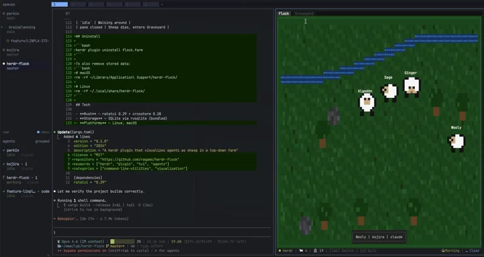

## How to vet a Herdr plugin in 5 minutes

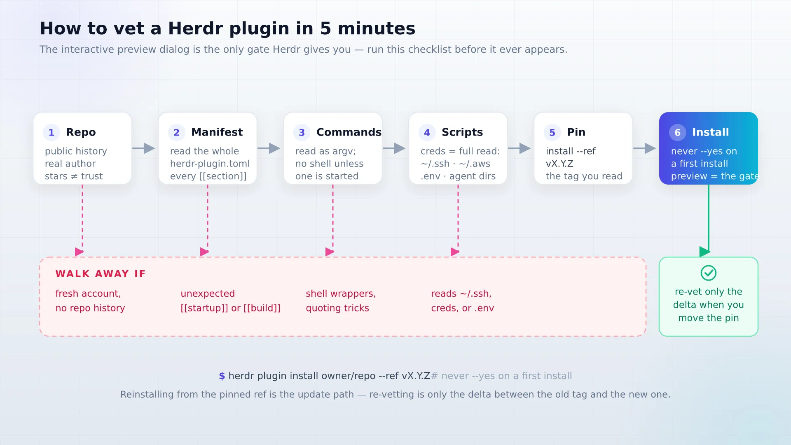

The marketplace page itself says "Listings aren't reviewed by Herdr, so install at your own discretion." The interactive preview dialog is the only gate in the entire system. Here is the checklist I run before that dialog ever appears.

<Notice type="warning" title="The marketplace is not a catalog">
  herdr.dev/plugins is an automatic index. Nobody at Herdr has read these repos. Five minutes of reading beats a bad install, and re-vetting is only needed when you move the pin.
</Notice>

1. **Read `herdr-plugin.toml`.** Every `[[build]]`, `[[startup]]`, `[[actions]]`, `[[events]]`, and `[[link_handlers]]` entry is code that will run on your machine. Check the required fields (`id`, `name`, `version`, `min_herdr_version`) and read every `command` array before you look at anything else.
2. **Read every command as argv.** There is no shell expansion unless the command starts a shell. Quoting surprises hide in `["bash", "-c", "..."]` wrappers, not in `["node", "index.js"]`.
3. **Skim the scripts.** Anything that touches `~/.aws`, `~/.ssh`, `.env` files, or agent credential directories deserves a full read, not a skim. That is the difference between a UI plugin and something that can exfiltrate your tokens.
4. **Check the author and repo history.** Stars are not trust, and a topic tag is not a guarantee the thing even installs as a Herdr plugin. Fresh accounts plus obfuscated build steps is a walk-away. If you want a gentle first vet, `qu8n/herdr-automatic-rename` and `tdi/herdr-worktree-setup` are small and readable end-to-end.
5. **Pin the reviewed tag.** `herdr plugin install owner/repo --ref vX.Y.Z`. Never `--yes` on a first install. If the manifest changes after the preview, Herdr aborts; leave it aborted and go re-read.

<ListCheck>
  <ul>
    <li>Read herdr-plugin.toml, including every [[startup]] and [[build]] command</li>
    <li>Read commands as argv arrays; distrust shell wrappers</li>
    <li>Skim scripts, with full attention on credential paths</li>
    <li>Check author history; walk away from fresh accounts with obfuscated builds</li>
    <li>Pin the tag you reviewed; never install blind with --yes</li>
  </ul>
</ListCheck>

Cost note: vetting is 5 minutes once per plugin. Reinstalling from a pinned ref is the update path, and re-vetting is only the delta between the old tag and the new one. For remote-relay plugins specifically, the threat model is your whole terminal. If you are exposing a box at all, read [hardening an exposed server](/bsi-security-report-docker-ufw/) before you expose a relay.

## Herdr plugins vs tmux: what's different

The "Herdr vs tmux" question comes down to plugins more than panes. If you only want panes and scrollback, tmux is still fine and it will still be fine in five years.

| Capability | tmux | Herdr plugins |
|---|---|---|
| Plugin distribution | Copy shell scripts into `.tmux.conf` territory | `herdr plugin install owner/repo` from a marketplace index |
| Plugin definition | Ad hoc shell functions | `herdr-plugin.toml` manifest with build/startup/actions/events/panes |
| API surface | tmux commands | The entire herdr CLI via `HERDR_BIN_PATH` |
| Events | Hooks you wire yourself | Declarative `[[events]]` like `on = "worktree.created"` |
| URL handling | Manual | `[[link_handlers]]` with Rust regex, Ctrl+click dispatch |
| Sandboxing | None | None |
| Update channel | Whatever the plugin's README says | None in v1, reinstall to refresh |
| Review process | None | None, it is an automatic index |

What Herdr gives you: manifest-declared argv commands, events, pane placement, link handlers, and keybinding integration in `~/.config/herdr/config.toml`. What it does not give you: sandboxing, managed storage (durable state is the plugin's own files), an update channel, or any review process. tmux's plugin scene is smaller and dumber, and that is also its safety story.

My verdict: the plugin ecosystem is the reason to move when you are running agent CLIs, not the multiplexer part. tmux already multiplexes. Herdr's edge is that agent workflows like diff review, session graphs, and workspace bootstrap are one command away instead of a weekend of scripts. If your tmux setup is already a pile of custom shell and you run agents in it daily, migrating is worth a weekend. If you mostly run two shells and a log tail, tmux has fewer moving parts and nothing to vet. For the runtime comparison itself, see [our Herdr review (open-source agent multiplexer)](/herdr-agent-multiplexer/), which covers the tmux question in depth. And if what you are actually shopping is the multiplexer itself rather than the agent layer, [Superlogical Rex](/superlogical-rex/) is the new terminal-side option worth tracking.

## Gotchas nobody tells you

These are the things that will bite you in the first month.

1. **No `plugin update` command.** Updates mean re-running `herdr plugin install`, which replaces the managed checkout. Anything in `HERDR_PLUGIN_ROOT` is gone. Keep secrets and settings in `HERDR_PLUGIN_CONFIG_DIR` and you can reinstall at will.
2. **Name collisions are real.** There are two `herdr-auto-title` repos (kryptamine 238 stars vs sh1ma 51 stars), two `herdr-agent-usage` repos (levi-qiao 168 stars vs senna-lang 47 stars), and at least three browser-ish plugins (`ogulcancelik/herdr-browser` 357 stars, StructuPath 23 stars, plus `zenbu-labs/terminal-browser`). Fix: always use fully qualified `plugin.id.action`, and note the `owner/repo` you installed.
3. **Missing licenses.** `herdr-remote` and `herdr-mobile-relay` both show NOASSERTION. `pi-extensible-workflows` has no license field at all. Do not build on these in anything you get paid for without a license you can live with.
4. **`ui_busy` on popups.** Popups are singleton session resources with no pane ID and no pane events. A Settings or Copy-mode modal blocks them. If a plugin's popup "does nothing," close your modals first.
5. **Keybinding collisions.** `[[keys.command]]` entries can shadow the built-in keymap. Pick unused keys and run `herdr server reload-config` after every edit, or nothing changes and you will blame the plugin.
6. **Startup hooks are not daemons.** `[[startup]]` is one-shot init that re-runs on live handoff. A plugin that abuses it as a supervisor will misbehave. If you write one, make the hook idempotent.
7. **Build failures abort install** with capped stdout and stderr. Almost always a missing toolchain. Install `cargo`/`npm`/`go`, retry, and read the capped log.
8. **0.7.x API churn.** This ecosystem is months old. Pin refs, expect `min_herdr_version` bumps, and treat every reinstall as a chance to re-read the manifest diff.

<Notice type="warning" title="Star count is not trust">
  Popular plugins still ship with name collisions, NOASSERTION licenses, and popup quirks. Stars tell you what other people installed, not what runs safely in your environment. Pair them with the 5-minute vet and pinned refs, and expect the 0.7.x API to move under you.
</Notice>

## Write your own plugin in 20 lines

Most of what plugins do is: run a command, show a pane, call the herdr CLI back. Here is a minimal manifest.

```toml
# herdr-plugin.toml
id = "example.workspace-tools"
name = "Workspace Tools"
version = "0.1.0"
min_herdr_version = "0.7.0"
platforms = ["linux", "macos", "windows"]

[[actions]]
id = "list-workspaces"
title = "List workspaces"
contexts = ["workspace"]
command = ["node", "index.js"]
```

And the callback pattern. The whole CLI is the API:

```javascript
// index.js
const { spawnSync } = require("node:child_process");
const herdr = process.env.HERDR_BIN_PATH ?? "herdr";

const res = spawnSync(herdr, ["workspace", "list"], { encoding: "utf8" });
console.log(res.stdout);
```

Local dev loop:

```bash
herdr plugin link /abs/path/to/plugin   # register, no build commands run
herdr plugin action invoke example.workspace-tools.list-workspaces
herdr plugin log list --plugin example.workspace-tools --limit 20
herdr plugin unlink example.workspace-tools
```

Where state goes: `HERDR_PLUGIN_CONFIG_DIR` for settings and secrets, `HERDR_PLUGIN_STATE_DIR` for durable state. There is no managed storage API in v1, so the plugin writes its own files. And never write into `HERDR_PLUGIN_ROOT`; reinstall replaces it.

Plugins versus skills, since people conflate them: plugins extend the terminal runtime (panes, events, keybindings). Skills extend the agent's context (instructions the model loads). Different layer, different file, different problem. If the problem is "the agent does not know how to do X," that is a skill, and [Agent Skills compared](/best-ai-skills-for-web-design/) is the right read.

<Button text="Browse the official plugin examples" link="https://github.com/ogulcancelik/herdr-plugin-examples" variant="outline" color="gray" size="sm" />

Herdr's docs use that cookbook for install examples, with the caveat that Herdr does not maintain those plugins. Treat them as readable samples, not blessed code.

## FAQ: Herdr plugins

<Accordion label="Are Herdr plugins safe to install?" group="faq" expanded="true">
  They are unreviewed code running as your user. Herdr validates the manifest and does not sandbox anything. The mitigation is the 5-minute vetting checklist (manifest, commands, scripts, author history) plus installing with the preview dialog and pinning the tag you reviewed. Never pass `--yes` on a first install. If you follow that, the residual risk is normal open-source risk instead of blind trust.
</Accordion>

<Accordion label="How do I update Herdr plugins?" group="faq">
  There is no `herdr plugin update` in plugin v1. Re-run `herdr plugin install owner/repo` (optionally with a new `--ref`) and Herdr replaces the managed checkout. Keep settings and secrets in `HERDR_PLUGIN_CONFIG_DIR`, never in `HERDR_PLUGIN_ROOT`, and reinstalls become painless. Re-vet the diff when you move the pin.
</Accordion>

<Accordion label="How many plugins are in the Herdr plugin marketplace?" group="faq">
  Roughly 1,000+ indexed plugins on herdr.dev/plugins, against about 1,500 repositories tagged `herdr-plugin` on GitHub (topic count, 2026-10-08). The raw topic count includes dotfiles and cross-tagged tools; the curated index only shows repos with parseable manifests. Both numbers move fast in a 7-month-old ecosystem, so re-check the live index when you read this.
</Accordion>

<Accordion label="Do Herdr plugins work with Claude Code, Codex and OpenCode?" group="faq">
  Yes. Plugins drive whatever is running in the pane, and the herdr CLI is the API, so agent integration is not a special mode. The top picks in this article explicitly support Claude Code, Codex, OpenCode, and Pi: herdr-reviewr sends line comments to all four, zoetrope graphs Claude Code and Codex sessions, and collie drives them from your phone. If a plugin only names one agent in its README, that is a documentation choice in most cases; what matters is whether it reads the pane and the transcript, and the manifest commands will tell you.
</Accordion>

## The minimal setup

You do not need ten plugins. Three cover most of the value, and everything else is optional.

<ListCheck>
  <ul>
    <li>herdr-reviewr, so agent code gets read</li>
    <li>kryptamine/herdr-auto-title, so 10 panes stay navigable</li>
    <li>cloudmanic/herdr-plus, so the workspace rebuilds itself from a TOML you own</li>
  </ul>
</ListCheck>

Install those three, verify each with `herdr plugin list --json` and `herdr plugin log list`, and stop. Add zoetrope or herdr-agent-usage when you start losing track of spend or session state. Skip the zoo. The temptation in a 1,000-plugin marketplace is to install everything that looks shiny on day one, then spend day two debugging keybinding collisions and `ui_busy` popups. Three well-vetted plugins with pinned refs beat ten you cannot reason about.

Ops coda: all of this software is 0 EUR per month. If agents must run 24/7, a 2-4 GB VPS is enough, no GPU, and that is where [what a cheap VPS costs in 2026](/vps-price-increases/) is worth a read before you shop; I would put it on a [Hetzner Cloud](https://go.bitdoze.com/hetzner) box. Remote access via free-tier Tailscale or a Cloudflare Tunnel, not open inbound ports. Back up `config.toml` plus each plugin's config dir; plugin code re-fetches from pinned refs. Re-vet when you move a pin. Herdr Cloud is waitlist-only, so do not plan around it.

<Button text="Read our Herdr review" link="/herdr-agent-multiplexer/" variant="solid" color="blue" size="md" icon="arrow-right" />
