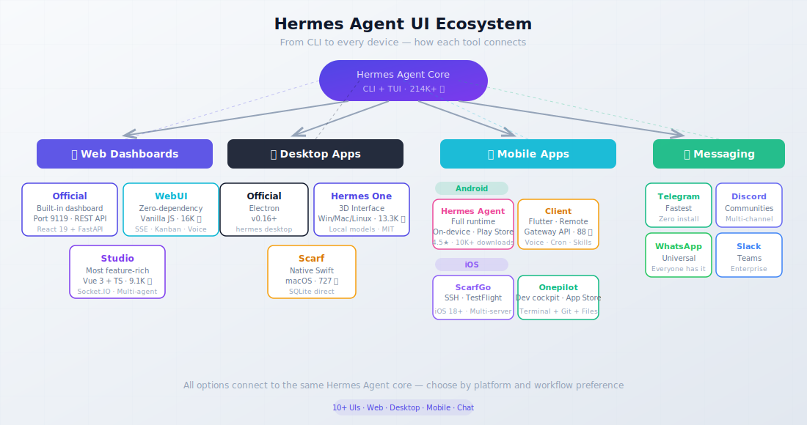

import Button from "@components/widgets/Button.astro";
import Notice from "@components/widgets/Notice.astro";
import ListCheck from "@components/widgets/ListCheck.astro";
import Accordion from "@components/widgets/Accordion.astro";
import Tabs from "@components/widgets/Tabs.astro";
import Tab from "@components/widgets/Tab.astro";
import YouTubeEmbed from "@components/widgets/YouTubeEmbed.astro";

Hermes Agent by Nous Research is the fastest-growing open-source AI agent on GitHub, with 214K+ stars. The core agent is CLI-first, running from your terminal with `hermes` or in a full TUI with `hermes --tui`. That's great for developers who live in the terminal. But you also need to check on your agent from a browser tab at work, a phone on the couch, or a tablet at a coffee shop.

The ecosystem has responded with dashboard web UIs, desktop apps, Android apps, iOS apps, and messaging integrations. There are now 10+ ways to interact with Hermes Agent outside the terminal. This guide compares every major option so you can pick the right one for your workflow.

<Notice type="info" title="New to Hermes Agent?">
If you haven't installed Hermes yet, start with [our Hermes Agent setup guide](/hermes-agent-setup-guide/). It covers installation, model configuration, and first steps before you pick a dashboard.
</Notice>

## Quick comparison: all Hermes Agent UIs at a glance

Here's the 30-second overview of every major Hermes Agent UI.

| Name | Type | Stars | Key Strength | Price | Best For |
|---|---|---|---|---|---|
| Official Dashboard | Web | Built-in | Full REST API, 150+ config fields | Free | Self-hosted management |
| Hermes WebUI (nesquena) | Web | 16K | Zero-dependency, lightweight | Free | Minimal resource usage |
| Hermes Studio (EKKOLearnAI) | Web + Desktop | 9.1K | Most features, group chat | Free | Power users, teams |
| Hermes Workspace | Web | 6.1K | IDE-like workspace + terminal | Free | Full agent ops in browser |
| Hermes One (fathah) | Desktop | 13.3K | 3D visual interface, 22 commands | Free | Cross-platform desktop |
| Hermes Control Interface | Web | 800 | RBAC, security-hardened admin | Free | Team access control |
| Scarf | macOS + iOS | 727 | Native Swift, SQLite direct | Free | macOS users |
| Hermes Agent Android | Mobile (Android) | — | Full runtime on-device | Freemium | Android power users |
| Hermes Android Client | Mobile (Android) | 88 | Lightweight Flutter client | Free | Remote server access |
| ScarfGo | Mobile (iOS) | — | SSH-based, TestFlight | Free | iOS + macOS users |
| Onepilot | Mobile (iOS) | — | Dev cockpit, terminal + git | Freemium | iOS developers |
| Telegram Gateway | Messaging | — | Zero install, instant | Free | Everyone |



The diagram is a high-level map of the main categories. The comparison table above includes additional options such as Hermes Workspace and Hermes Control Interface.

<Button text="Jump to Dashboards" link="#best-hermes-agent-web-dashboards" variant="outline" color="blue" size="sm" />
<Button text="Jump to Mobile Apps" link="#best-hermes-agent-mobile-apps-for-android" variant="outline" color="blue" size="sm" />

## Best Hermes Agent web dashboards

Web dashboards run in a browser and are ideal for remote management from any device. You can self-host them on a VPS, run them locally, or tunnel them through SSH. The main options below cover everything from the official built-in panel to full IDE-style workspaces.

### Official Hermes Web Dashboard

The built-in dashboard is part of the core Hermes package (ships with Hermes Agent v0.16+). Launch it with `hermes dashboard` and you get a FastAPI/Uvicorn backend with a React 19 + TypeScript + Tailwind frontend on port 9119.

**What you get:**

- **Status page:** live overview with auto-refresh every 5 seconds
- **Chat:** embedded PTY-backed TUI via WebSocket, full terminal experience in the browser
- **Config editor:** form-based YAML editor covering 150+ fields, no more manual file editing
- **Sessions:** browse, search (FTS5), export, and prune conversation history
- **Logs:** agent, gateway, and error logs with level/component filtering and live tail
- **Analytics:** 7/30/90-day token usage, cost tracking, per-model breakdown
- **Cron jobs:** schedule, pause/resume, trigger, and edit scheduled tasks
- **Skills & MCP:** browse, search, toggle skills; add/test/enable/disable MCP servers
- **Profiles:** create, switch, clone, manage agent profiles
- **API Keys:** environment variable manager with redacted display values
- **Gateway health:** monitor the status of 20+ messaging platform connections

Auth options include OAuth via Nous Portal, username/password, and self-hosted OIDC. Six built-in themes are included, plus a custom theme system.

Prerequisites: install the web and PTY extras first.

```bash
pip install -e ".[web,pty]"
```

<Tabs>
<Tab name="CLI command">
```bash
# Default — opens browser, port 9119
hermes dashboard

# Custom port, server mode (no browser auto-open)
hermes dashboard --port 9120 --no-open

# Remote-accessible (pair with auth!)
hermes dashboard --host 0.0.0.0 --no-open
```
</Tab>
<Tab name="Docker">
```yaml
# docker-compose.yml
services:
  hermes:
    image: nousresearch/hermes-agent:latest
    ports:
      - "9119:9119"
    volumes:
      - ~/.hermes:/root/.hermes
    command: hermes dashboard --host 0.0.0.0
```
</Tab>
<Tab name="Custom host/port">
```bash
# Bind to all interfaces on a custom port
hermes dashboard --host 0.0.0.0 --port 8080 --no-open

# Use with a reverse proxy (Caddy, Nginx)
# See our Hermes Agent dashboard setup guide for
# SSH tunnel, Caddy, and Docker security setup
```
</Tab>
</Tabs>

The official dashboard has a full REST API, so you can script any management operation programmatically. If you want the simplest setup with no extra dependencies, this is it. For full security configuration including SSH tunnels and reverse proxy setup, see our [Hermes Agent dashboard setup guide](/hermes-dashboard-guide/).

### Hermes WebUI by nesquena

<Button text="GitHub Repository" link="https://github.com/nesquena/hermes-webui" variant="solid" color="blue" size="md" />

The most popular community dashboard with 16K+ GitHub stars (MIT). Its defining trait: zero dependencies. No Node.js, no bundler, no framework. Just Python's standard-library HTTP server and vanilla JavaScript. Active as of July 2026 with 1,200+ releases.

<ListCheck>
<ul>
<li>Streaming chat via SSE with multi-provider model support</li>
<li>Session management: pin, archive, projects, tags, search, export/import</li>
<li>Mobile-responsive design (hamburger sidebar, 44px touch targets)</li>
<li>Voice input via Web Speech API</li>
<li>Workspace file browser with git detection</li>
<li>Kanban board for task management</li>
<li>CLI session bridge (import sessions from the terminal)</li>
<li>6+ themes with a skin system</li>
<li>Extension system for injecting custom scripts and styles</li>
<li>Password, WebAuthn/passkeys, and OIDC authentication</li>
<li>Docker and Nix support</li>
<li>~11,500 tests across ~1,150 files</li>
</ul>
</ListCheck>

Launch commands:

```bash
# Clone first, then bootstrap (recommended)
git clone https://github.com/nesquena/hermes-webui.git
cd hermes-webui
python3 bootstrap.py

# Or use the shell script after clone
./start.sh

# Docker
docker pull ghcr.io/nesquena/hermes-webui:latest
docker run -d -p 8787:8787 -v ~/.hermes:/home/hermeswebui/.hermes \
  ghcr.io/nesquena/hermes-webui:latest
# Opens http://localhost:8787
```

The mobile-responsive design makes this the best web dashboard for phone-based access — the hamburger sidebar and touch targets are designed for it. It also has a built-in Kanban board (see the [Hermes Kanban setup guide](/hermes-kanban-setup-guide/) for details) and web search capabilities that pair well with [TinyFish free search for AI coding agents](/tinyfish-free-search-coding-agents/).

If you want to extend Hermes with web search and page fetching for your agent, the [TinyFish web search API](https://go.bitdoze.com/tinyfish) integrates cleanly. It gives your agent 30 search/min and 150 fetch/min for free, which complements the WebUI's built-in extraction capabilities.

**Best for:** Users who want a lightweight, zero-dependency web UI that works on mobile browsers out of the box.

### Hermes Workspace

<Button text="GitHub Repository" link="https://github.com/outsourc-e/hermes-workspace" variant="solid" color="green" size="md" />

Hermes Workspace is the IDE-style option: chat, embedded terminal, file browser, memory viewer, skills hub, MCP management, and multi-agent orchestration in one React/TypeScript UI. 6.1K stars, MIT licensed.

The Conductor / Swarm features are unique here. You describe a complex task, and the workspace breaks it into subtasks, dispatches specialized agents, and merges results. No other dashboard on this list ships that orchestration UI as a first-class surface.

<ListCheck>
<ul>
<li>Embedded web terminal (xterm.js) — full shell without a separate SSH session</li>
<li>File/workspace browser with edit support</li>
<li>Conductor / Swarm multi-agent task decomposition</li>
<li>Skills hub and full MCP catalog/marketplace</li>
<li>Mobile PWA + Tailscale-friendly remote access</li>
<li>Multiple themes (Hermes, Nous, Bronze, Slate, Mono)</li>
</ul>
</ListCheck>

```bash
# Docker Compose (recommended)
git clone https://github.com/outsourc-e/hermes-workspace.git
cd hermes-workspace
docker compose up -d
# Workspace on port 3000, Hermes gateway on 8642
```

**Best for:** Users who want a full agent operations console (terminal + files + multi-agent), not only chat.

### Hermes Studio by EKKOLearnAI

<Button text="GitHub Repository" link="https://github.com/EKKOLearnAI/hermes-studio" variant="solid" color="purple" size="md" />

The most feature-rich option. 9.1K stars. Built with Vue 3 + TypeScript + Vite + Naive UI, with a Koa backend and Socket.IO for real-time chat. The repo was renamed from `hermes-web-ui` to `hermes-studio`; the npm package is still `hermes-web-ui`.

**What sets it apart:**

- **Platform channels:** configure 8 platforms (Telegram, Discord, Slack, WhatsApp, Matrix, Feishu, WeChat, WeCom) from the UI
- **Group chat:** multi-agent rooms with @mention routing between agents
- **Coding agent integrations:** Codex and Claude Code integration built in
- **Web terminal:** node-pty + xterm.js, full terminal in the browser
- **Voice/TTS/STT:** browser Web Speech, Edge TTS, OpenAI-compatible, MiMo
- **File browser:** supports local, Docker, SSH, and Singularity backends
- **Model management:** auto-discover providers, add/update/delete models
- **Multi-profile:** clone, export, import profiles
- **Usage analytics:** token usage, cost, model distribution charts
- **Kanban board:** profile-aware task management (see [Hermes Kanban setup guide](/hermes-kanban-setup-guide/))

Launch commands:

```bash
# npm global install
npm install -g hermes-web-ui && hermes-web-ui start   # Port 8648

# Docker
WEBUI_IMAGE=ekkoye8888/hermes-web-ui docker compose up -d   # Port 6060
```

<Notice type="warning" title="License Note">
Hermes Studio uses the BSL-1.1 license, not MIT. For personal use this is fine. For commercial use, review the license terms. BSL-1.1 typically converts to MIT after a set period (often 2-4 years), but the commercial use restrictions apply during the BSL period.
</Notice>

**Best for:** Power users and teams who want the richest feature set, especially multi-agent rooms and platform channel management.

### Hermes Control Interface (HCI)

<Button text="GitHub Repository" link="https://github.com/xaspx/hermes-control-interface" variant="solid" color="green" size="md" />

HCI is the security-focused admin panel. 800 stars, MIT, vanilla JS + Vite + Express (minimal frontend framework surface). It prioritizes RBAC, CSRF, rate limiting, and auditability over visual polish.

**What you get:**

- Password gate with bcrypt hashing, CSRF on mutating endpoints, rate limiting
- ~20 permissions across admin / viewer / custom roles
- Browser terminal (xterm.js), file explorer, sessions, cron, system metrics
- Multi-agent / Office swarm monitor with kanban-style task views
- PWA installable to the homescreen

```bash
git clone https://github.com/xaspx/hermes-control-interface.git
cd hermes-control-interface
cp .env.example .env   # set HERMES_CONTROL_PASSWORD + HERMES_CONTROL_SECRET
npm install && npm run build
node server.js         # http://localhost:10274
```

Requires Node.js 20+ and the `hermes` CLI on PATH on the same machine.

**Best for:** Teams that need granular access control and a hardened admin surface more than a pretty chat UI.

### Scarf dashboard — macOS native

<Button text="GitHub Repository" link="https://github.com/awizemann/scarf" variant="solid" color="purple" size="md" />

A native macOS app (Swift/SwiftUI) that reads Hermes SQLite directly for real-time data. 727 stars, MIT licensed, requires macOS 14.6+ (Sonoma). Latest releases ship as notarized universal binaries from [GitHub Releases](https://github.com/awizemann/scarf/releases) (not the App Store, because Scarf needs non-sandboxed access to `~/.hermes/` and the `hermes` binary).

**Features:** Dashboard, analytics, sessions browser, activity feed, live chat (Rich ACP or terminal), memory editor, skills browser, platforms GUI, personalities, cron manager, health monitoring, gateway control, and custom project dashboards that agents can auto-generate via JSON widgets.

Multi-window support lets you monitor multiple Hermes servers simultaneously (local + remote over SSH). A menu bar status icon keeps agent health visible at all times. ScarfGo is the iOS companion (covered in the mobile section).

**Best for:** macOS users who want a native app experience instead of a browser tab. Not a web dashboard in the traditional sense. It's a proper macOS application that happens to do everything a dashboard does.

## Best Hermes Agent desktop apps

Desktop apps offer tighter OS integration than browser dashboards. They have system tray icons, native notifications, keyboard shortcuts, and offline access to cached data. Some tools (Hermes Studio, Scarf) appear in both the web dashboard and desktop sections because they ship as both.

### Official Hermes Desktop

The official Electron-based desktop app, available since Hermes v0.16. Launch with `hermes desktop`. It's built into the core package.

<YouTubeEmbed url="https://www.youtube.com/embed/YBp_PXBbe80" label="Hermes Agent Desktop App walkthrough" />

It tracks Hermes releases closely, so you always get the latest features. Documentation is at [hermes-agent.nousresearch.com/docs/user-guide/desktop](https://hermes-agent.nousresearch.com/docs/user-guide/desktop).

**Best for:** Users who want the official, maintained-by-Nous-Research desktop experience.

### Hermes One by fathah

<Button text="GitHub Repository" link="https://github.com/fathah/hermes-desktop" variant="solid" color="blue" size="md" />

The most popular community desktop app, with 13.3K stars, MIT licensed, runs on Windows, macOS, and Linux. Repo: `fathah/hermes-desktop`. Product site: [hermesone.org](https://hermesone.org/). Not affiliated with Nous Research.

<Notice type="info" title="Not affiliated with Nous Research">
Hermes One is community-maintained. It uses the official Hermes install script under the hood but is independently developed by fathah.
</Notice>

<ListCheck>
<ul>
<li>Guided first-run install with progress tracking</li>
<li>Local or remote backend support (API URL + API key)</li>
<li>Streaming chat via SSE with tool progress and markdown rendering</li>
<li>Token usage tracking with live cost estimates</li>
<li>22 slash commands for quick actions</li>
<li>Session management with FTS5 full-text search</li>
<li>14 toolsets with profile switching</li>
<li>Memory system editor and persona (SOUL.md) editor</li>
<li>Cron job builder with 15 delivery targets</li>
<li>16 messaging gateways</li>
<li>Hermes Office (Claw3d): a 3D visual interface</li>
<li>Backup/import/debug dump</li>
<li>Secrets provider (KeePassXC, 1Password, Bitwarden, GnuPG, pass)</li>
<li>Auto-updater via electron-updater</li>
<li>Supports local providers: LM Studio, Ollama, vLLM, llama.cpp</li>
</ul>
</ListCheck>

**Best for:** Cross-platform desktop users who want the richest standalone desktop experience with local model support.

### Hermes Studio desktop (Electron)

Hermes Studio also ships as an Electron desktop app. It stores Hermes Agent data in the native location (`~/.hermes`) and provides managed command shims: `hermes-studio cli`, `hermes-studio web`, and `hermes-studio-mcp`.

Auto-update works through Cloudflare download endpoints with GitHub fallback. Cross-reference [Hermes Studio by EKKOLearnAI](#hermes-studio-by-ekkolearnai) for the full feature list. The desktop version has the same capabilities as the web dashboard.

**Best for:** Users who want Hermes Studio's feature set in a standalone desktop window.

## Best Hermes Agent mobile apps for Android

Android's openness makes it the richer mobile platform for Hermes. There are two types of apps: full Hermes runtimes that execute the agent directly on the device, and lightweight clients that connect to a remote Hermes instance over the network.

### Hermes Agent Android (Google Play)

By Hen Works. [Google Play listing](https://play.google.com/store/apps/details?id=com.hermesagent.android): 4.5 stars with 1.98K reviews, 10K+ downloads. Free with an in-app purchase (Hermes Pro) to remove ads.

<Notice type="info" title="Full runtime, not a client">
This app runs the complete Hermes Agent on your Android device. It's not connecting to a server — it IS the server. You need your own API key and about 200MB of storage for the initial setup.
</Notice>

**What it does:**

- Multi-model support — OpenAI, Anthropic, Google, OpenRouter, LiteRT for local models
- Built-in Linux terminal (bash, Python, git)
- Code execution directly on the device
- Multi-platform gateway (Telegram, Slack, Discord)
- Web search and page extraction
- AI image generation via Fal.ai
- Text-to-speech via Edge TTS
- Memory system across conversations
- Session management with resume
- Dashboard web UI for monitoring
- Chat Skin option (Labs) — terminal UI or chat bubbles with tool cards and photo attachments

**Best for:** Android users who want the full Hermes experience without a separate server.

### Hermes Android Client by rusty4444

<Button text="GitHub Repository" link="https://github.com/rusty4444/hermes-android" variant="solid" color="blue" size="md" />

A lightweight Flutter/Dart client (88 stars, MIT, v1.0.10+) that connects to a remote Hermes instance via the Gateway API (port 8642) and dashboard API (port 9119). Download APKs from [GitHub Releases](https://github.com/rusty4444/hermes-android/releases).

```
Android app (Flutter)
├─ Gateway API Server, port 8642
│  ├─ GET /api/sessions
│  ├─ GET /api/sessions/{id}/messages
│  └─ POST /v1/chat/completions (SSE streaming)
└─ Hermes dashboard, port 9119
   ├─ /api/memory
   ├─ /api/cron/jobs
   ├─ /api/skills
   └─ /api/model/*
```

Features include voice chat (mic dictation + TTS replies), streaming SSE responses, theme toggle (Dark/Light/System), full CRUD cron management, skills browser, memory viewer, Tailscale support for remote access, and HTTPS connections.

It also handles password-protected dashboards (basic-auth login flow) and reverse-proxy path prefixes.

**Best for:** Users who already have Hermes running on a server or desktop and want a lightweight Android client.

### Long-running tasks and push notifications

There is no widely adopted standalone "Hermes Dispatch" app with a public install path that matches the major dashboards above. For background work and phone notifications, use the official stack instead:

- **Hermes Kanban / async subagents** on the server for long-running jobs that survive phone disconnects (see the [Hermes Kanban setup guide](/hermes-kanban-setup-guide/))
- **ntfy** as a Hermes messaging channel for push alerts to Android/iOS ([official ntfy docs](https://hermes-agent.nousresearch.com/docs/user-guide/messaging/ntfy))
- **Telegram / Discord gateway** for fire-and-forget task messages without installing another client

If you need the agent to control an Android device (ADB-style remote control), look at community bridge projects such as [raulvidis/hermes-android](https://github.com/raulvidis/hermes-android) — that is a device-control bridge, not a chat dashboard.

**Best for:** Server-side long jobs with phone alerts, without depending on a niche mobile-only product.

## Best Hermes Agent mobile apps for iOS

<Notice type="warning" title="iOS limitation">
iOS sandboxing prevents running Hermes Agent directly on an iPhone or iPad. All iOS apps are clients that connect to a remote Hermes instance via SSH or API. You need Hermes running somewhere else first. If you need a free API key to get started, see how to set up [Hermes Agent with free models on Nous Portal](/hermes-agent-mimo-v2-pro/).
</Notice>

### ScarfGo

The native iOS companion to the Scarf macOS app ([awizemann/scarf](https://github.com/awizemann/scarf)). Available via TestFlight, requires iOS 18.0+. Uses SSH for connectivity via the Citadel library — no ssh binary needed on the device.

**Features:**

- Ed25519 keypair stored in iOS Keychain
- Multi-server support
- Project-scoped chat
- Session resume
- Memory editor, cron list, skills tree
- Profile switching (ScarfGo v2.13+)
- Voice chat support
- Per-server connection pooling

**Best for:** Users who already run Scarf on macOS and want the same experience on iPhone. The macOS app and iOS companion are designed to work together.

### Onepilot

A native iOS app on the App Store (freemium): [Onepilot — AI agents & SSH](https://apps.apple.com/am/app/onepilot-ai-agents-ssh/id6759485908). Supports iPhone and iPad. Docs: [onepilotapp.com/agents/hermes](https://onepilotapp.com/agents/hermes). This is the closest thing to a full development cockpit on iOS.

**What it does:**

- Deploys Hermes over SSH with a guided wizard
- Real terminal (not just a chat interface)
- Syntax-highlighted file browser
- Git tab with diffs
- Cron management
- Also supports OpenClaw, Claude Code, and Codex CLI
- Wires Telegram/Discord/Slack during deployment

As the developers put it: "There is no official Hermes app" — Onepilot positions itself as the next best thing. The SSH tunnel gives you full host access (files, shell, git), making it more than just a chat client.

**Best for:** iOS users who want a full development environment on their phone or tablet, not just a chat interface.

### Hermes AI: Personal Agent

An independent iOS app by Ilya Vishneuski ([App Store](https://apps.apple.com/us/app/hermes-ai-personal-agent/id6759341434)). Requires iOS 17.0+ (also listed for Mac with Apple silicon and visionOS). 11.9 MB download. Not affiliated with Nous Research.

**Features:** Real-time chat, task tracking and output review, approve/reject sensitive actions, secure session management across devices. Offers a managed agent subscription option for users who do not want to self-host.

<Notice type="warning" title="Premium pricing">
App Store in-app purchases currently list Premium at about $19.99 and $199.99 (tiers can change). Free tier is limited. Compare that cost carefully against free self-hosted clients like ScarfGo or Hermes Mobile before committing.
</Notice>

**Best for:** Users who want a managed, subscription-style Hermes experience on iOS rather than connecting to their own server.

### Hermes Mobile by uzairansar

A native iOS client in TestFlight beta ([uzairansar.com/hermes-mobile](https://www.uzairansar.com/hermes-mobile)), built with SwiftUI. Connects to a self-hosted Hermes WebUI instance — it does not provide a hosted backend.

**Features:**

- Reopen sessions from iPhone
- Stream responses live
- Attach photos, files, and share-sheet content
- Choose model, reasoning level, workspace, and run options
- Browse project files
- View tasks, skills, memory, and usage stats

**Best for:** Users who already self-host Hermes WebUI and want a native iOS client to interact with it.

## Mobile access via messaging channels

The simplest way to get Hermes on your phone: use the built-in messaging gateway. No extra apps to install — just chat with your agent through Telegram, Discord, WhatsApp, Signal, or Slack.

<Notice type="info" title="Fastest path to mobile access">
Telegram is the quickest way to get Hermes on your phone. Setup takes under 5 minutes and you get cross-device sync, voice memos, and the same chat app you probably already have open.
</Notice>

| Channel | Setup | Pros | Cons |
|---|---|---|---|
| Telegram | Low | Fastest path, voice memos, cross-device sync | Single session view, message queuing delay |
| Discord | Low | Reactions, threads, channel per topic | More setup than Telegram |
| WhatsApp | Medium | Everyone has it | Requires phone number and pairing |
| Signal | Medium | Privacy-focused | Less feature-rich |
| Slack | Medium | Team-friendly, channels | Requires workspace |

Setup is straightforward:

```bash
# Configure the messaging gateway
hermes gateway setup
# Follow prompts for your platform (e.g., Telegram bot token)

# Start the gateway
hermes gateway start
```

**Telegram limitations** worth knowing (from community feedback): you only get a single session view, there's a message queuing delay, no visible token count or model info, and context window resets are not communicated. For casual use it's great. For heavy development work, use a proper dashboard or desktop app.

## How to choose the right Hermes Agent UI

| Your situation | Recommended tool | Why |
|---|---|---|
| macOS user who wants a native app | Scarf | Native Swift, reads SQLite directly, menu bar icon |
| Cross-platform desktop user | Hermes One or Hermes Studio | Rich features, Windows/macOS/Linux, MIT or BSL |
| Browser-first, self-hosted, simple | Official Dashboard | Built-in, zero setup beyond `hermes dashboard` |
| Browser-first, minimal resources | Hermes WebUI | No build step, vanilla JS, mobile-responsive |
| Browser-first, max features | Hermes Studio | Group chat, multi-agent, 8 platform configs |
| Browser-first, terminal + files + multi-agent | Hermes Workspace | IDE-like workspace, Conductor/Swarm |
| Security / team RBAC first | Hermes Control Interface | CSRF, bcrypt, granular permissions |
| Android user, want on-device agent | Hermes Agent Android | Full runtime, no server needed |
| Android user, connect to server | Hermes Android Client | Lightweight, Tailscale support |
| iOS user, want dev cockpit | Onepilot | Terminal, file browser, git, SSH |
| iOS user, want chat only | ScarfGo or Hermes Mobile | SSH or WebUI client |
| Just want mobile chat, no install | Telegram/Discord gateway | Zero install, works now |
| Team use | Hermes Studio or HCI | Group chat / multi-agent rooms, or RBAC admin |
| Budget-conscious | Official Dashboard + Telegram | Both free, both built-in |

Ready to get started? Follow [our Hermes Agent setup guide](/hermes-agent-setup-guide/) to install Hermes and configure your first model. For the [cheapest AI models for Hermes Agent](/best-cheap-models-hermes-agent/), we have a separate comparison of budget-friendly API providers.

<Button text="Get started with Hermes Agent" link="/hermes-agent-setup-guide/" variant="solid" color="blue" size="md" icon="arrow-right" />

## Security considerations for remote access

Any dashboard or mobile app exposed to the network needs proper security. This is non-negotiable — a Hermes dashboard without auth gives anyone full control of your agent, your API keys, and potentially your server.

<Notice type="error" title="Never expose without auth">
Running `hermes dashboard --host 0.0.0.0` without enabling authentication is an open backdoor. Always pair public-facing dashboards with auth and HTTPS.
</Notice>

### SSH tunnels (easiest)

The simplest secure approach — tunnel the dashboard port through SSH:

```bash
# Tunnel WebUI (port 8787)
ssh -N -L 8787:127.0.0.1:8787 user@your-server

# Tunnel Official Dashboard (port 9119)
ssh -L 9119:localhost:9119 user@your-vps

# Then open http://localhost:8787 or http://localhost:9119 locally
```

### Tailscale (most secure for regular use)

Install Tailscale on your server and phone/laptop. Access the dashboard via the Tailscale IP. No ports exposed to the public internet. The Hermes Android Client has built-in Tailscale support.

### Password protection

```bash
# Password protect the official dashboard
cat >> ~/.hermes/.env <<'EOF'
HERMES_DASHBOARD_BASIC_AUTH_USERNAME=admin
HERMES_DASHBOARD_BASIC_AUTH_PASSWORD=your-strong-password
HERMES_DASHBOARD_BASIC_AUTH_SECRET=$(openssl rand -base64 32)
EOF
chmod 600 ~/.hermes/.env
hermes dashboard --host 0.0.0.0 --no-open
```

### Auth support by dashboard

| Dashboard | Password | OIDC | WebAuthn/Passkeys |
|---|---|---|---|
| Official Dashboard | Yes | Yes (self-hosted) | No |
| Hermes WebUI | Yes | Yes | Yes |
| Hermes Studio | Yes | No | No |
| Hermes Workspace | Yes | Varies by deploy | No |
| Hermes Control Interface | Yes (bcrypt + RBAC) | No | No |
| Scarf | macOS Keychain | No | No |

For full security setup including Caddy reverse proxy configuration and Docker networking, see our [Hermes Agent dashboard setup guide](/hermes-dashboard-guide/).

## FAQ

<Accordion label="Is there an official Hermes Agent mobile app?" group="faq" expanded="true">
No. There is no official mobile app from Nous Research. The entire mobile ecosystem is community-built. Official channels are CLI, the web dashboard (`hermes dashboard`), and the desktop app (`hermes desktop`). All Android and iOS apps listed in this guide are third-party projects.
</Accordion>

<Accordion label="Can I run Hermes Agent on my phone?" group="faq">
On Android, yes — Hermes Agent Android (Google Play) runs the full Hermes runtime directly on the device. You need your own API key and about 200MB of storage. On iOS, no — iOS sandboxing prevents running Hermes directly. All iOS apps connect to a remote Hermes instance via SSH or API.
</Accordion>

<Accordion label="What's the best free Hermes dashboard?" group="faq">
The official built-in dashboard (`hermes dashboard`) and Hermes WebUI by nesquena are both free and excellent. The official dashboard is the simplest to set up — it's already included with Hermes. Hermes WebUI is lighter on resources (no build step, no framework) and has better mobile responsiveness. If you also need a free API key, see how to set up [Hermes Agent with free models on Nous Portal](/hermes-agent-mimo-v2-pro/).
</Accordion>

<Accordion label="How do I access my Hermes dashboard remotely?" group="faq">
Three options, from easiest to most robust: (1) SSH tunnel — `ssh -L 9119:localhost:9119 user@your-vps` then open localhost:9119. (2) Tailscale — install on both devices, access via Tailscale IP. (3) Reverse proxy with auth — Caddy or Nginx with HTTPS and basic auth or OIDC. Never expose a dashboard publicly without authentication.
</Accordion>

<Accordion label="Which Hermes dashboard uses the least resources?" group="faq">
Hermes WebUI by nesquena. It uses Python's standard-library HTTP server and vanilla JavaScript — no Node.js, no bundler, no framework. The startup is fast and memory usage is minimal compared to the React/Vue-based alternatives.
</Accordion>

<Accordion label="Can I use multiple dashboards at the same time?" group="faq">
Yes. Dashboards are independent web applications running on different ports. You can run the official dashboard on port 9119, Hermes WebUI on 8787, Hermes Studio on 8648, Hermes Workspace on 3000, and HCI on 10274 simultaneously. They all read from the same Hermes data directory, so sessions, config, and profiles are shared.
</Accordion>

<Accordion label="Is Hermes Studio's BSL-1.1 license a problem?" group="faq">
For personal use, no. For commercial use, review the license terms. BSL-1.1 (Business Source License) typically restricts commercial use for a set period (often 2–4 years), after which it converts to MIT. If you need a fully MIT-licensed dashboard for commercial use, choose the official dashboard or Hermes WebUI instead.
</Accordion>

## Conclusion

There's no single "best" Hermes Agent UI — the right choice depends on your device, workflow, and how much control you need. Here's the short version:

<ListCheck>
<ul>
<li>The official dashboard is the safest starting point — free, built-in, well-maintained</li>
<li>Hermes WebUI is the lightest web option with excellent mobile responsiveness (16K stars)</li>
<li>Hermes Studio packs the most features, including group chat and multi-agent rooms (9.1K)</li>
<li>Hermes Workspace is the best full workspace (terminal + files + Conductor/Swarm, 6.1K)</li>
<li>Hermes Control Interface is the pick when RBAC and hardened admin matter most</li>
<li>For macOS, Scarf is the polished native experience; Hermes One wins for cross-platform desktop</li>
<li>For Android, Hermes Agent Android gives you the full runtime on-device; rusty4444's client is best for remote servers</li>
<li>For iOS, Onepilot is the most capable dev cockpit; ScarfGo and Hermes Mobile are lighter chat clients</li>
<li>Telegram gateway is the fastest path to mobile access — no extra app needed</li>
<li>Security is not optional — always use auth, SSH tunnels, or Tailscale for remote access</li>
</ul>
</ListCheck>

Pick one option, set it up, and iterate. Most of these tools are free or have free tiers, so there's no cost to experimenting.

To get Hermes installed and running, start with [our Hermes Agent setup guide](/hermes-agent-setup-guide/). For the built-in dashboard security setup, see the [Hermes dashboard guide](/hermes-dashboard-guide/). For free models, check the [MIMO V2 Pro guide](/hermes-agent-mimo-v2-pro/), and for budget paid models see [best cheap models for Hermes Agent](/best-cheap-models-hermes-agent/).

<Button text="Set up Hermes Agent now" link="/hermes-agent-setup-guide/" variant="solid" color="blue" size="md" icon="arrow-right" />
