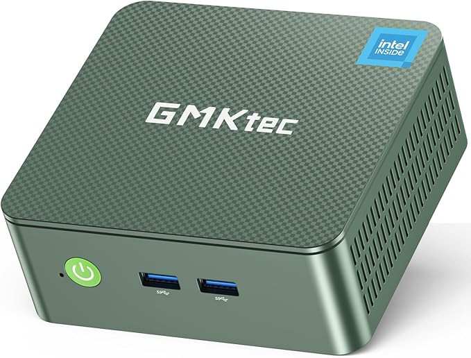
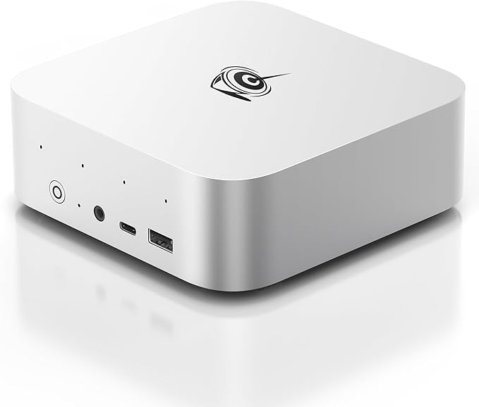
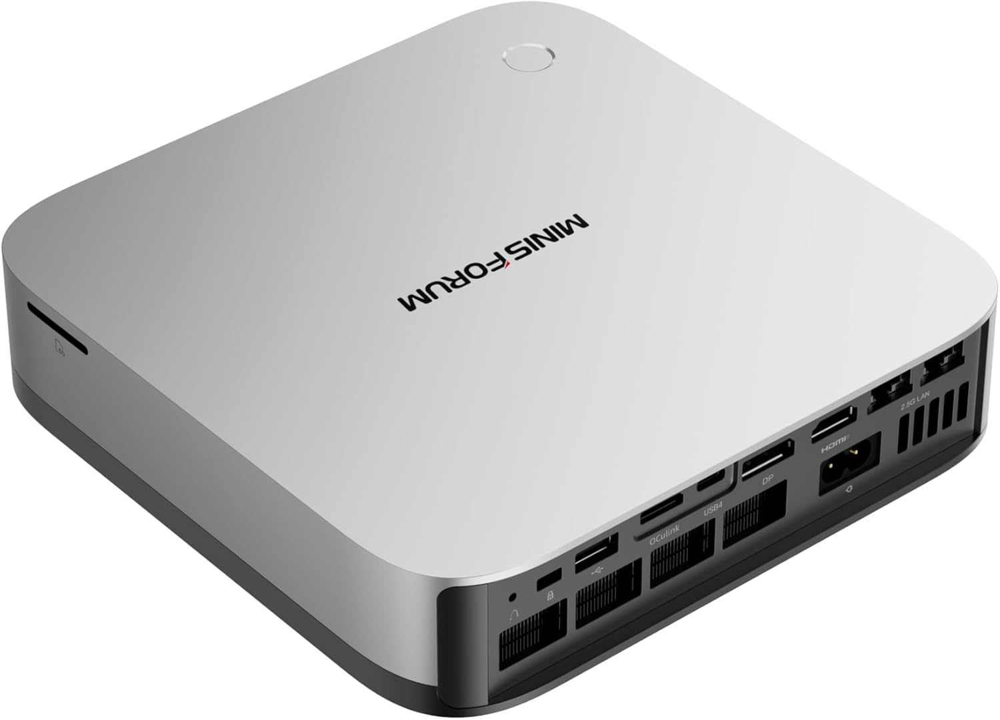
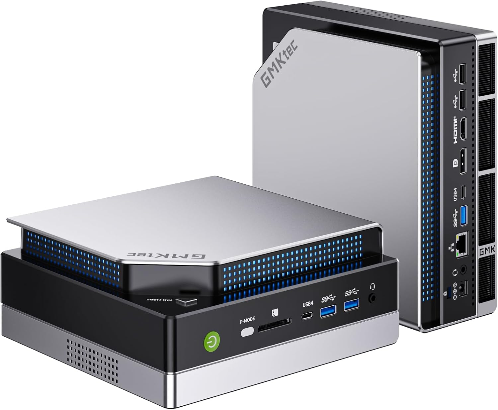
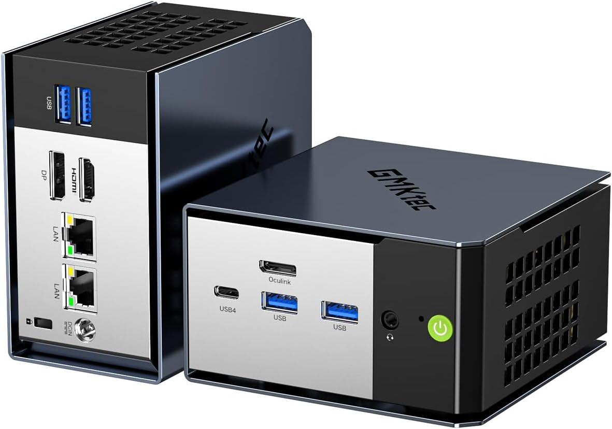
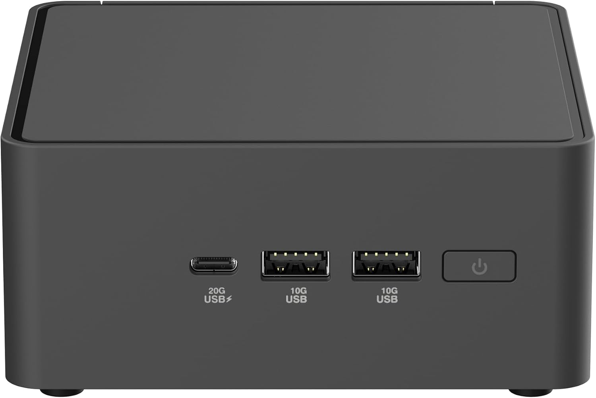
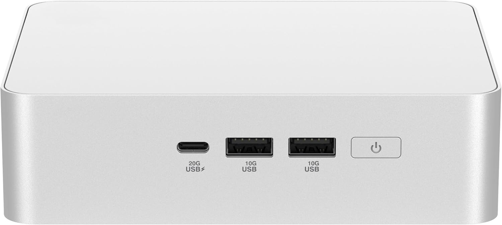
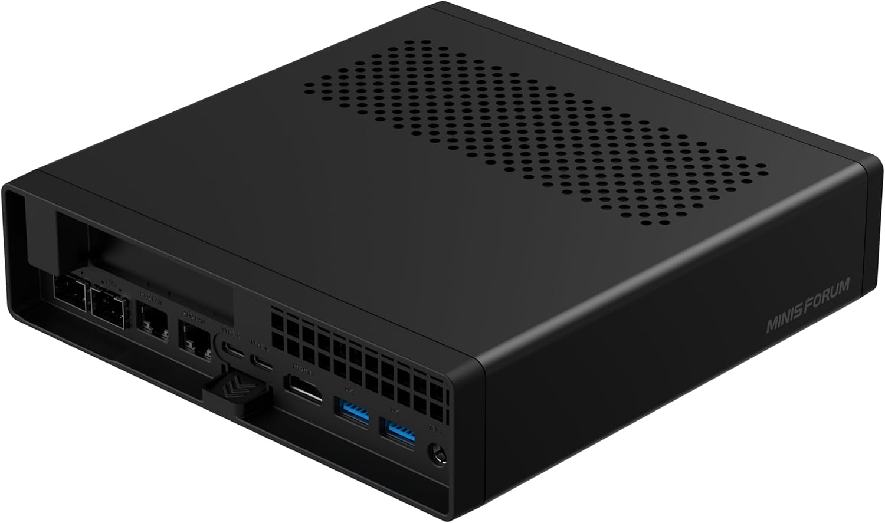
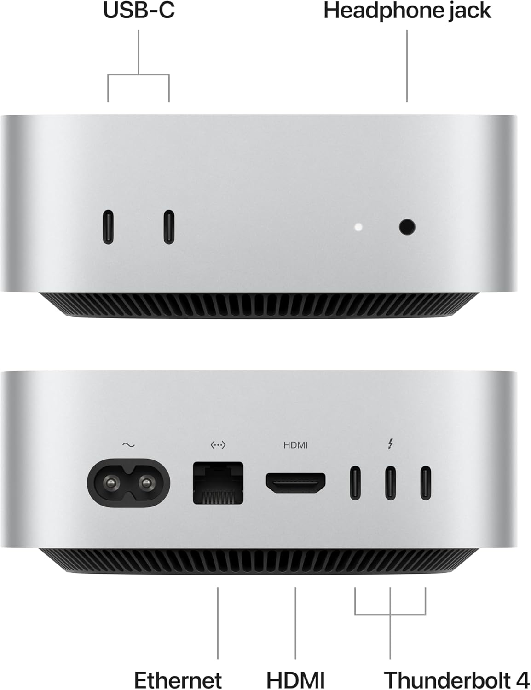

import Button from "../../layouts/components/widgets/Button.astro";
import YouTubeEmbed from "../../layouts/components/widgets/YouTubeEmbed.astro";

In 2026, home servers have evolved from enthusiast projects to essential components of modern smart homes. With the rise of AI applications, 4K streaming, and advanced home automation, mini PCs have become the go-to solution for building powerful yet compact home server setups. Whether you're looking to stream 8K content, run AI workloads, or create a comprehensive home lab environment, today's mini PCs offer unprecedented performance in remarkably small packages.

I've been running various mini PC home servers for years, from basic N100 systems to high-end AMD Ryzen AI machines, hosting everything from Plex media servers to AI inference models. This hands-on experience has shown me that the mini PC landscape has dramatically improved, with 2026 models offering features like built-in AI acceleration, 8K display support, and blazing-fast connectivity options.

## Purpose of a home server

A modern home server in 2026 serves as the digital backbone of your smart home ecosystem:

1. **AI-Powered Services**: Run local AI models for voice assistants, image recognition, and smart automation
2. **8K Media Streaming**: Handle multiple 8K streams and advanced video processing
3. **Advanced Home Automation**: Control and monitor IoT devices with local processing
4. **Personal Cloud Services**: Secure, private cloud storage and synchronization
5. **Development and Testing**: Container orchestration, CI/CD pipelines, and development environments
6. **Network Security**: Advanced firewall, VPN services, and network monitoring
7. **Virtual Machine Hosting**: Multiple OS environments for testing and specialized tasks
8. **Smart Backup Solutions**: Automated, intelligent backup systems with versioning

> You can check [Best 100+ Docker Containers for Home Server](https://www.bitdoze.com/docker-containers-home-server/) to see what apps can be hosted with the help of docker.

## Benefits of a mini PC for home server

<YouTubeEmbed
  url="https://www.youtube.com/embed/0bLrnG0S4mg"
  label="Best Mini PC Home Server"
/>

> In case you are interested to monitor server resources like CPU, memory, disk space you can check: [How To Monitor Server and Docker Resources](https://www.bitdoze.com/sever-monitoring/)

Modern mini PCs offer compelling advantages for 2026 home server deployments:

1. **AI Acceleration**: Built-in NPUs and AI processors for local machine learning tasks
2. **Advanced Connectivity**: WiFi 7, USB4, and high-speed Ethernet for future-proofing
3. **8K Display Support**: Multiple 8K displays for advanced monitoring and media applications
4. **Energy Efficiency**: Latest processors offer better performance per watt than ever
5. **Compact Design**: Space-efficient solutions that blend into modern home environments
6. **Silent Operation**: Advanced cooling systems maintain quiet operation under load
7. **Expandability**: Modern interfaces support high-speed external storage and eGPUs
8. **Cost Effectiveness**: More performance per dollar compared to traditional server hardware

The evolution of mini PCs in 2026 has made them viable alternatives to traditional rack servers for most home use cases, offering professional-grade capabilities in consumer-friendly packages.

If you're interested in exploring free open source self-hosted applications, check out [toolhunt.net self hosted section](https://toolhunt.net/sh/).

## Factors to Consider

When selecting a mini PC for your 2026 home server, these factors are crucial:

### CPU Architecture and AI Capabilities

- **AI Processing Units (NPUs)**: Look for integrated AI acceleration with 40+ TOPS for local AI workloads
- **Core Count**: Modern processors offer 12-32 threads for excellent multitasking
- **Architecture**:
  - **x86**: Maximum compatibility with enterprise software and virtualization
  - **ARM**: Superior efficiency for always-on services and specific workloads
- **Boost Frequencies**: 5.0GHz+ boost clocks for demanding single-threaded applications

### Memory and Storage Performance

- **DDR5 Support**: Essential for bandwidth-intensive applications and AI workloads
- **Memory Capacity**: 32GB+ recommended for modern virtualization and AI applications
- **Storage**: PCIe 4.0 NVMe SSDs with 7000MB/s+ speeds for responsive performance
- **Expandability**: Multiple M.2 slots and support for large capacity drives

### Advanced Connectivity

- **Network**: 2.5GbE minimum, with 10GbE options for high-bandwidth applications
- **USB4/Thunderbolt**: Essential for high-speed external storage and eGPU connectivity
- **WiFi 7**: Latest wireless standard for maximum wireless performance
- **Display**: 8K support for future-proofing and advanced monitoring setups

### Thermal Management and Reliability

- **Cooling Systems**: Advanced thermal solutions for sustained performance
- **24/7 Operation**: Components rated for continuous operation
- **Power Efficiency**: Lower operating costs and reduced heat generation
- **Build Quality**: Robust construction for long-term reliability

### Future-Proofing and Ecosystem

- **Software Support**: Long-term OS and driver support commitments
- **Upgrade Path**: Modular designs allowing component upgrades
- **Ecosystem Integration**: Compatibility with existing infrastructure
- **Professional Features**: Enterprise-grade security and management capabilities

## Recommended Mini PCs for Home Server

| Product | CPU | RAM | Storage | Key Features | Ideal For | Power | Price Range |
|---------|-----|-----|---------|--------------|-----------|-------|-------------|
| [GMKtec N150 Mini PC](https://amzn.to/4o2IU3D) | Intel N150 (4C/4T) | 16GB DDR4 | 512GB SSD | 2.5GbE, WiFi 6, Dual 4K | Basic server, Office | 10-25W | $ |
| [Beelink SER9 Pro](https://amzn.to/4o2mGin) | Ryzen AI 9 365 (10C/20T) | 32GB LPDDR5X | 1TB PCIe4.0 | 73 TOPS NPU, Triple 4K@240Hz | AI tasks, Gaming server | 25-65W | $$$ |
| [MINISFORUM AI X1 Pro](https://amzn.to/4kT9rh9) | Ryzen AI 9 HX370 (12C/24T) | 96GB DDR5 | 2TB SSD | 80 TOPS NPU, Quad 8K, OCuLink | Professional AI, VMs | 30-65W | $$$$ |
| [GMKtec EVO-X2](https://amzn.to/3UrrKiE) | Ryzen AI Max+ 395 (16C/32T) | 64GB LPDDR5X | 1TB SSD | 50+ TOPS NPU, Quad 8K, RGB | Extreme performance | 35-75W | $$$$ |
| [GMKtec EVO-X1](https://amzn.to/4m9Uvwd) | Ryzen AI 9 HX-370 (12C/24T) | 64GB DDR5 | 1TB SSD | 50 TOPS NPU, Triple 8K, OCuLink | High-end gaming/AI | 30-65W | $$$ |
| [ASUS NUC 15 Pro Tall](https://amzn.to/450xy7L) | Core Ultra 7 255H (16C/22T) | Up to 96GB DDR5 | Dual storage | WiFi 7, Thunderbolt 4, 4K quad | Enterprise features | 25-65W | $$$$ |
| [ASUS NUC 15 Pro+](https://amzn.to/4lIAxZL) | Core Ultra 5 225H (14C/18T) | Up to 96GB DDR5 | Dual storage | WiFi 7, Ultra-quiet design | Professional use | 20-55W | $$$ |
| [MINISFORUM MS-A2](https://amzn.to/450QYJM) | Ryzen 9 9955HX (16C/32T) | 64GB DDR5 | 1TB SSD | PCIe×16, Dual 10G SFP+, 8K | Workstation/server | 40-120W | $$$$ |
| [Apple Mac Mini M4](https://amzn.to/4562Iuw) | M4 (10C CPU/10C GPU) | 24GB Unified | 256GB SSD | Apple Intelligence, TB4 | macOS ecosystem | 10-35W | $$$ |

Price Range Key:
$ = Budget-friendly ($200-500)
$$ = Mid-range ($500-1000)
$$$ = High-end ($1000-2000)
$$$$ = Premium ($2000+)

### ARM vs X86 Architecture

The choice between ARM and x86 has become more nuanced in 2026:

**ARM Advantages:**
- **Exceptional Efficiency**: 2-3x better performance per watt
- **AI Integration**: Native AI acceleration in modern ARM chips
- **Silent Operation**: Lower heat generation enables fanless designs
- **Long-term Reliability**: Fewer moving parts and lower operating temperatures
- **Ecosystem Growth**: Improved software compatibility, especially for server applications

**x86 Advantages:**
- **Universal Compatibility**: Runs virtually all server software and legacy applications
- **Raw Performance**: Higher peak performance for demanding computational tasks
- **Virtualization**: Superior support for running multiple x86 virtual machines
- **Professional Software**: Full compatibility with enterprise and professional applications
- **Upgrade Flexibility**: More options for memory and storage expansion

**2026 Recommendation**: For most home server users, modern x86 systems with AI acceleration offer the best balance of compatibility and performance. ARM systems like the Apple M4 are excellent for specific use cases where efficiency and ecosystem integration are priorities.

### Entry-Level: Intel N150 Mini PC

#### [GMKtec N150 Mini PC](https://amzn.to/4o2IU3D)

The GMKtec N150 Mini PC represents the latest evolution of budget-friendly home servers. Built around Intel's newest Twin Lake N150 processor, this system offers a 6-10% performance improvement over the popular N100, making it perfect for 2026's basic server needs. With 16GB DDR4 RAM and a 512GB PCIe SSD, it provides excellent value for essential home server tasks like file sharing, basic media streaming, and home automation hubs.

**Key Features:**
- Intel Twin Lake N150 CPU (4C/4T, up to 3.6GHz) - Latest 2026 upgrade over N100
- 16GB DDR4 RAM for smooth multitasking
- 512GB PCIe 3.0 NVMe SSD with quick boot times
- Intel i226v 2.5GbE Ethernet for high-speed networking
- WiFi 6 and Bluetooth 5.2 for modern wireless connectivity
- Dual 4K@60Hz HDMI outputs
- Upgraded cooling system with reduced noise levels
- Wake-on-LAN and auto power-on features

**Why it's perfect for home servers:**
- Latest N150 processor offers optimal efficiency for 24/7 operation
- 2.5GbE networking provides bandwidth for multiple users and high-speed file transfers
- Sufficient resources for running multiple Docker containers
- Enhanced cooling system ensures stable operation under continuous load
- Compatible with Linux, Proxmox, and other server operating systems
- Excellent price-to-performance ratio for basic server needs

**Limitations:**
- Not suitable for 4K transcoding or AI workloads
- Limited to basic virtualization scenarios
- Single network port (though 2.5GbE)

<Button link="https://amzn.to/4o2IU3D" text="Check IT" />

### High-Performance AMD AI Mini PCs

#### [Beelink SER9 Pro Mini PC](https://amzn.to/4o2mGin)

The Beelink SER9 Pro represents a significant leap in mini PC capability with its AMD Ryzen AI 9 365 processor. This powerhouse combines traditional computing excellence with cutting-edge AI acceleration, featuring a massive 73 TOPS NPU for local AI workloads. It's designed for users who want to run AI applications, handle multiple 4K streams, and manage complex home automation systems.

**Key Features:**
- AMD Ryzen AI 9 365 (10C/20T, up to 5.0GHz) with 73 TOPS NPU
- 32GB LPDDR5X 8000MHz for exceptional memory performance
- 1TB PCIe 4.0 SSD with lightning-fast storage speeds
- AMD Radeon 880M graphics (12 cores, 2900MHz) for gaming and media
- Triple display support: 4K@240Hz (HDMI + DP + USB4)
- USB4 (40Gbps) and WiFi 6 (2.4Gbps) connectivity
- MSC2.0 cooling system maintaining 32dB noise levels
- AI voice commands and noise-canceling microphone

**Why it excels as a home server:**
- AI NPU enables local language models, image processing, and smart automation
- High core count handles virtualization and multiple simultaneous tasks
- Exceptional graphics performance for media transcoding and streaming
- Ultra-quiet operation suitable for living spaces
- Future-proof connectivity with USB4 and high-speed networking
- Compact design (135x135x44.7mm) fits anywhere

**Best suited for:**
- AI enthusiasts running local LLMs and computer vision
- Advanced media servers with 4K transcoding
- Development environments requiring substantial compute power
- Smart home hubs with complex automation logic

<Button link="https://amzn.to/4o2mGin" text="Check IT" />

#### [MINISFORUM AI X1 Pro](https://amzn.to/4kT9rh9)

The MINISFORUM AI X1 Pro stands at the pinnacle of mini PC performance with its AMD Ryzen AI 9 HX370 processor and massive 96GB DDR5 configuration. This professional-grade system features an 80 TOPS NPU and support for quad 8K displays, making it suitable for the most demanding home server applications.

**Key Features:**
- AMD Ryzen AI 9 HX370 (12C/24T, up to 5.1GHz) with 80 TOPS NPU
- Massive 96GB DDR5 5600MHz memory (expandable to 128GB)
- 2TB total storage across three PCIe 4.0 SSD slots
- AMD Radeon 890M with 40 RDNA 3.5 compute units
- Quad display support: 8K@60Hz via HDMI 2.1, DP 2.0, dual USB4
- OCuLink port for external GPU connectivity
- Dual 2.5GbE LAN with WiFi 7 and Bluetooth 5.4
- Built-in Copilot AI functionality with fingerprint security

**Why it's the ultimate home server:**
- Unmatched AI processing power for advanced machine learning tasks
- Enormous memory capacity for large-scale virtualization
- Professional-grade storage performance up to 7000MB/s
- OCuLink support enables desktop-grade GPU acceleration
- Enterprise networking with dual 2.5GbE and WiFi 7
- Advanced cooling maintains 45dB maximum noise
- Perfect for AI researchers and power users

**Ideal applications:**
- Running multiple large language models simultaneously
- Professional content creation and rendering
- High-density virtualization environments
- AI development and model training

<Button link="https://amzn.to/4kT9rh9" text="Check IT" />

#### [GMKtec EVO-X2 AI Mini PC](https://amzn.to/3UrrKiE)

The GMKtec EVO-X2 represents the absolute pinnacle of mini PC performance with the AMD Ryzen AI Max+ 395 processor. This beast features 16 Zen 5 cores, 40 RDNA 3.5 GPU compute units, and over 50 AI TOPS, making it more powerful than many desktop workstations.

**Key Features:**
- AMD Ryzen AI Max+ 395 (16C/32T, up to 5.1GHz) - Most powerful x86 APU
- 64GB LPDDR5X 8000MHz in 8-channel configuration
- 1TB PCIe 4.0 SSD with expansion options
- AMD Radeon 8060S iGPU (40 CUs, 2.9GHz) - RTX 4060/4070 laptop equivalent
- Quad 8K display support via HDMI 2.1, DP 1.4, dual USB4
- 2.5GbE + WiFi 7 + Bluetooth 5.4 connectivity
- Triple cooling fans with RGB lighting and 35dB quiet mode
- Runs large language models like Deepseek 32B locally

**Why it's extraordinary:**
- Unmatched integrated graphics performance for a mini PC
- Can run demanding AI models completely locally
- Gaming performance rivaling dedicated graphics cards
- Unique 8-channel LPDDR5X memory architecture
- Triple fan cooling with customizable RGB lighting
- Perfect for AI enthusiasts and content creators

**Ultimate applications:**
- Local AI model hosting and inference
- High-end gaming server hosting
- Professional video editing and rendering
- Advanced computer vision applications

<Button link="https://amzn.to/3UrrKiE" text="Check IT" />

#### [GMKtec EVO-X1 AI Mini PC](https://amzn.to/4m9Uvwd)

The GMKtec EVO-X1 offers high-end performance with the AMD Ryzen AI 9 HX-370 processor, featuring excellent AI capabilities and gaming performance in a more accessible package than the EVO-X2.

**Key Features:**
- AMD Ryzen AI 9 HX-370 (12C/24T, up to 5.1GHz) with 50 TOPS NPU
- 64GB DDR5 with quad-channel LPDDR5X support
- 1TB PCIe 4.0 SSD storage
- AMD Radeon 890M with latest RDNA 3.5 architecture
- Triple 8K display support via HDMI 2.1, DP 2.1, USB4
- OCuLink port for external GPU connectivity
- Dual Intel i226V 2.5GbE + WiFi 6 + Bluetooth 5.2
- Advanced cooling with quiet operation

**Why it's excellent for servers:**
- Strong AI processing capabilities for smart home automation
- OCuLink support enables desktop-grade GPU performance
- Dual 2.5GbE networking for high-bandwidth applications
- Excellent price-to-performance ratio
- Suitable for both gaming and professional workloads

<Button link="https://amzn.to/4m9Uvwd" text="Check IT" />

### Professional Intel Solutions

#### [ASUS NUC 15 Pro Tall](https://amzn.to/450xy7L)

The ASUS NUC 15 Pro Tall brings Intel's latest Series 2 Core Ultra 7 255H processor to the mini PC market with a focus on AI optimization and professional reliability. This system represents ASUS's commitment to creating enterprise-grade mini PCs suitable for demanding home server applications.

**Key Features:**
- Intel Series 2 Core Ultra 7 255H with integrated Intel Arc 140T Graphics
- Supports up to 96GB DDR5 RAM for extensive multitasking
- Dual storage bays for flexible configuration
- Intel WiFi 7 with 2.4x faster transfer rates and proximity sensing
- Thunderbolt 4 connectivity for high-speed peripherals
- Quad 4K display support via HDMI 2.1 and Thunderbolt 4
- Tool-less 2.0 chassis for easy upgrades
- MIL-STD-810H certification for durability

**Why it's ideal for home servers:**
- AI-optimized processor for intelligent automation tasks
- Massive RAM support for virtualization environments
- Enterprise-grade reliability with rigorous testing
- Advanced WiFi 7 for future-proof wireless connectivity
- Professional design suitable for office environments
- Easy maintenance with tool-less access

**Perfect for:**
- Professional home offices requiring reliable computing
- Advanced virtualization with multiple operating systems
- AI development and testing environments
- High-availability home server applications

<Button link="https://amzn.to/450xy7L" text="Check IT" />

#### [ASUS NUC 15 Pro+](https://amzn.to/4lIAxZL)

The ASUS NUC 15 Pro+ offers a more affordable entry point into Intel's latest processor technology while maintaining professional-grade features and build quality.

**Key Features:**
- Intel Series 2 Core Ultra 5 225H with Intel Arc 130T Graphics
- Up to 96GB DDR5 RAM support
- Dual storage configuration options
- Ultra-quiet cooling with 1.2x noise reduction
- WiFi 7 and Bluetooth 5.4 connectivity
- Quad 4K display support with sync power-off feature
- Premium aluminum chassis with tool-less upgrades
- VESA mount included for flexible installation

**Why it's excellent:**
- Quieter operation ideal for noise-sensitive environments
- Premium build quality with elegant design
- Advanced display management features
- Professional reliability at a more accessible price point

<Button link="https://amzn.to/4lIAxZL" text="Check IT" />

### Extreme Performance Solutions

#### [MINISFORUM MS-A2](https://amzn.to/450QYJM)

The MINISFORUM MS-A2 pushes the boundaries of what's possible in a mini PC form factor with the AMD Ryzen 9 9955HX processor and professional-grade features typically found in workstation-class systems.

**Key Features:**
- AMD Ryzen 9 9955HX (16C/32T, up to 5.4GHz) with Zen5 architecture
- 64GB DDR5 memory with support up to 96GB
- Triple M.2 SSD slots (2280/22110/U.2) supporting up to 23TB total
- PCIe×16 slot for professional graphics cards or high-performance networking
- Dual SFP+ 10G and dual 2.5G LAN ports
- Triple display support with 8K@60Hz capability
- Advanced cooling with three copper heat pipes and turbo fans
- Supports RAID 0/1 configurations

**Why it's extraordinary:**
- Workstation-class performance in mini PC form factor
- Professional networking with 10G SFP+ ports
- Expandable with full-height professional graphics cards
- Massive storage capacity and flexibility
- Suitable for AI inference and GPU-accelerated computing
- Perfect for high-performance computing workloads

**Ultimate applications:**
- Professional content creation and rendering
- High-performance computing and scientific applications
- Advanced networking and firewall applications
- AI model training and inference
- Professional video editing and streaming

<Button link="https://amzn.to/450QYJM" text="Check IT" />

### ARM Excellence

#### [Apple Mac Mini M4](https://amzn.to/4562Iuw)

The 2024 Apple Mac Mini with M4 chip represents the latest evolution in ARM-based computing, bringing Apple Intelligence and exceptional efficiency to the mini PC market. This system offers a unique proposition for users invested in the Apple ecosystem.

**Key Features:**
- Apple M4 chip with 10-core CPU and 10-core GPU
- 24GB unified memory architecture
- 256GB SSD storage (configurable to higher capacities)
- Built for Apple Intelligence with on-device AI processing
- Thunderbolt 4 connectivity for high-speed peripherals
- Gigabit Ethernet (10Gb option available)
- Exceptional energy efficiency with silent operation
- Seamless integration with iPhone and iPad

**Why it's perfect for Apple users:**
- Unmatched performance-per-watt efficiency
- Native Apple Intelligence support for AI applications
- Silent operation ideal for always-on server tasks
- Excellent integration with Apple ecosystem devices
- Professional-grade media encoding and processing
- Long-term software support from Apple

**Ideal for:**
- Apple ecosystem integration and device management
- Energy-efficient 24/7 server operation
- Media transcoding and streaming within Apple ecosystem
- Development work targeting Apple platforms
- Users prioritizing efficiency and quiet operation

<Button link="https://amzn.to/4562Iuw" text="Check IT" />

## Best Use Cases for 2026

Modern mini PCs in 2026 enable sophisticated home server applications that were previously impossible in such compact form factors:

| Mini PC Category | Ideal Applications | Performance Level |
|------------------|-------------------|-------------------|
| Entry-Level (N150) | Basic NAS, Media streaming, Home automation | 1-2 4K streams, Light containers |
| Mid-Range AI | AI inference, Advanced media, Smart home | Multiple 4K streams, Local LLMs |
| High-End Professional | Virtualization, Development, Content creation | 8K transcoding, Heavy AI workloads |
| ARM Efficiency (M4) | Always-on services, Apple ecosystem, Development | Efficient transcoding, iOS/macOS dev |

### Entry-Level Applications (N150-based systems)

1. **Modern Media Server:**
   - Host Jellyfin or Plex with hardware-accelerated transcoding
   - Stream 1-2 simultaneous 4K streams efficiently
   - Support for modern codecs including AV1

2. **Smart Home Hub:**
   - Run Home Assistant with AI voice control
   - Local processing for smart cameras and sensors
   - Integration with major smart home ecosystems

3. **Network Services:**
   - Pi-hole DNS filtering with advanced analytics
   - Local VPN server with modern encryption
   - Network monitoring with real-time alerting

4. **Development Environment:**
   - Lightweight containerization with Docker
   - Git repositories and basic CI/CD
   - Testing environments for web applications

### AI-Powered Applications (Ryzen AI systems)

1. **Local AI Services:**
   - Run Llama 2/3 models for personal AI assistant
   - Image recognition for security cameras
   - Voice processing and natural language understanding
   - AI-powered home automation decisions

2. **Advanced Media Processing:**
   - Real-time AI upscaling for older content
   - Intelligent content analysis and tagging
   - Multiple simultaneous 4K transcoding streams
   - AI-enhanced audio processing

3. **Professional Workloads:**
   - Local model training for specific use cases
   - Computer vision applications
   - Real-time data analysis and processing
   - AI-assisted content creation tools

### Professional Applications (High-end systems)

1. **Enterprise Virtualization:**
   - Multiple Windows/Linux VMs simultaneously
   - Development and testing environments
   - Isolated security testing environments
   - Legacy application support

2. **Content Creation Pipeline:**
   - 8K video editing and rendering
   - Professional color grading workflows
   - 3D rendering and animation
   - Live streaming production

3. **Advanced Networking:**
   - Software-defined networking (SDN)
   - High-performance firewalls and routing
   - Network function virtualization (NFV)
   - Advanced monitoring and analytics

### ARM Ecosystem Applications (Apple M4)

1. **Apple Intelligence Integration:**
   - Siri server for home automation
   - Intelligent photo and video processing
   - Cross-device synchronization and backup
   - iOS/macOS app development and testing

2. **Efficient Always-On Services:**
   - 24/7 monitoring with minimal power consumption
   - Background AI processing tasks
   - Automated backup and sync services
   - Energy-efficient media transcoding

## Conclusion

The mini PC landscape in 2026 has transformed dramatically, offering solutions that rival traditional servers while maintaining the compact, energy-efficient form factors that make them ideal for home use. From AI-powered systems capable of running large language models locally to ultra-efficient ARM processors that can operate silently 24/7, there's never been a better time to build a home server.

**Key Trends for 2026:**
- **AI Integration**: NPUs with 40+ TOPS enabling local AI processing
- **Enhanced Connectivity**: WiFi 7, USB4, and multi-gigabit Ethernet as standard
- **Display Evolution**: 8K support opening new possibilities for monitoring and media
- **Performance Density**: Workstation-class performance in incredibly compact packages
- **Energy Efficiency**: Better performance per watt than ever before

**My Recommendations:**

- **Budget Conscious**: GMKtec N150 offers excellent value with modern features
- **AI Enthusiast**: Beelink SER9 Pro provides the best balance of AI power and practicality
- **Maximum Performance**: GMKtec EVO-X2 delivers unmatched capability in mini PC form
- **Professional Use**: ASUS NUC 15 Pro series offers enterprise reliability
- **Apple Ecosystem**: Mac Mini M4 provides seamless integration and efficiency
- **Extreme Workloads**: MINISFORUM MS-A2 brings workstation capabilities to mini PC

The beauty of 2026's mini PC options is that you no longer need to compromise significantly on performance to enjoy the benefits of a compact, quiet, and energy-efficient home server. Whether you're streaming 8K content, running AI models locally, or managing a complex virtualization environment, there's a mini PC solution that can handle your needs while fitting discretely into your home environment.

As we move forward, the convergence of AI capabilities, advanced connectivity, and exceptional performance in these compact packages suggests that mini PCs will continue to be the preferred choice for home server enthusiasts who value both capability and convenience.

## FAQs

1. **Q: Can 2026 mini PCs handle AI workloads locally?**
   A: Yes, modern mini PCs with NPUs (40+ TOPS) can run large language models, image processing, and other AI tasks locally without cloud dependencies.

2. **Q: How much RAM do I need for modern home server applications?**
   A: For basic tasks, 16GB is sufficient. For AI workloads and advanced virtualization, 32GB+ is recommended. Professional applications may benefit from 64GB or more.

3. **Q: Are mini PCs suitable for 8K media streaming?**
   A: High-end 2026 mini PCs with modern processors can easily handle 8K streaming and even transcoding, with some supporting multiple simultaneous 8K streams.

4. **Q: What's the difference between AMD and Intel mini PCs in 2026?**
   A: AMD focuses on AI integration with high TOPS NPUs and excellent graphics, while Intel emphasizes professional features and broad compatibility. Both offer excellent performance.

5. **Q: Can I upgrade components in modern mini PCs?**
   A: Most 2026 mini PCs allow RAM and storage upgrades, with some premium models supporting significant customization. Check specifications for upgrade paths.

6. **Q: How do I choose between x86 and ARM for my home server?**
   A: Choose x86 for maximum software compatibility and performance. Choose ARM (like Apple M4) for exceptional efficiency, quiet operation, and ecosystem integration.

7. **Q: What networking features should I prioritize in 2026?**
   A: Look for 2.5GbE minimum, WiFi 7 for wireless, and USB4/Thunderbolt for high-speed peripherals. Dual network ports provide redundancy and link aggregation options.

8. **Q: How important is AI acceleration in a home server?**
   A: AI acceleration (NPU) is increasingly valuable for smart home automation, local voice assistants, image processing, and running language models without cloud dependencies. It's becoming essential for future-proofing.
