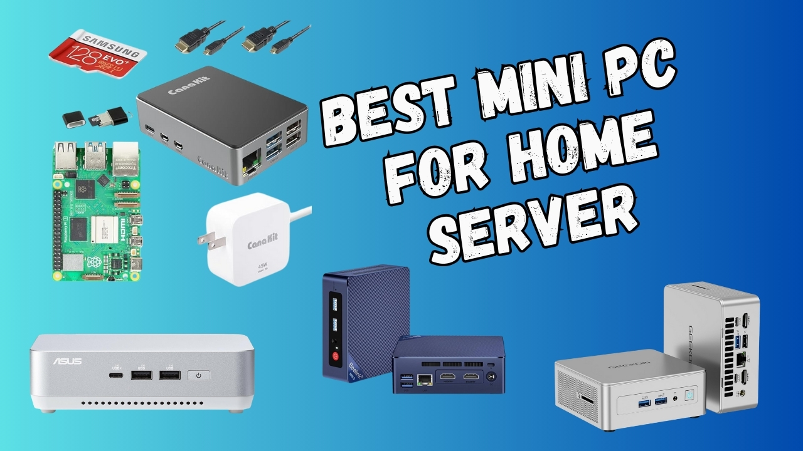
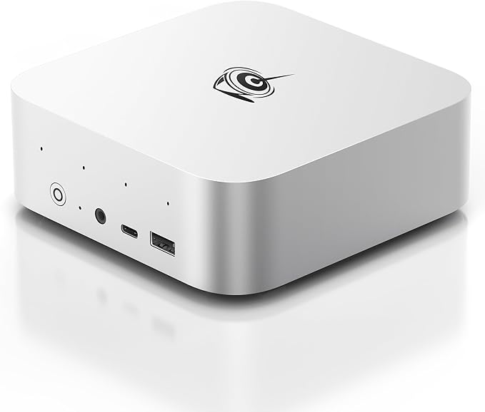
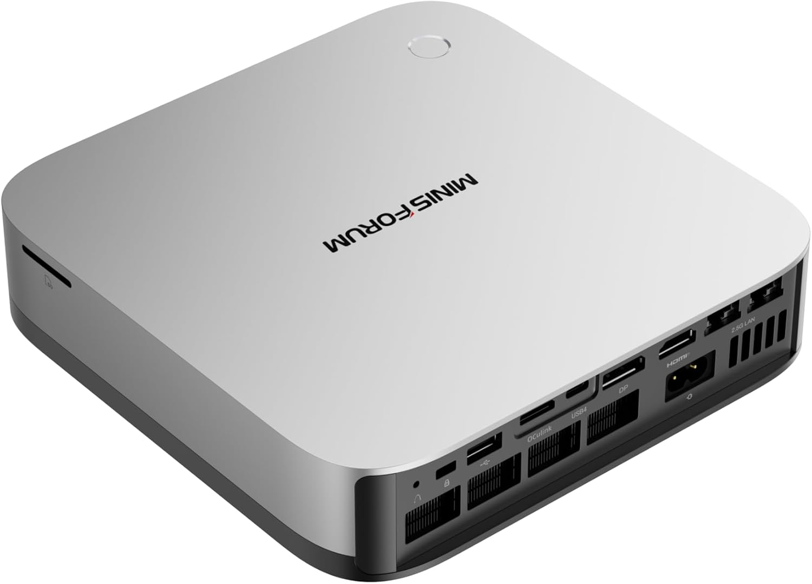
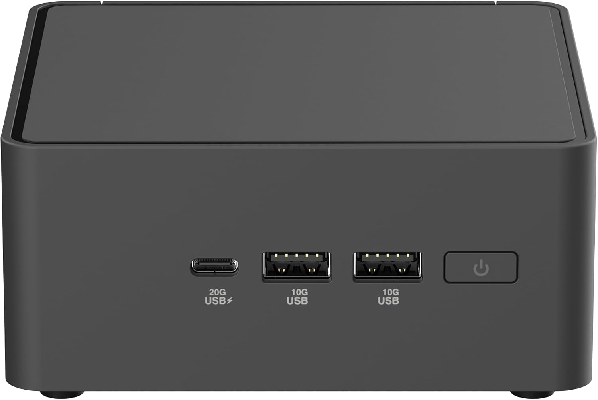
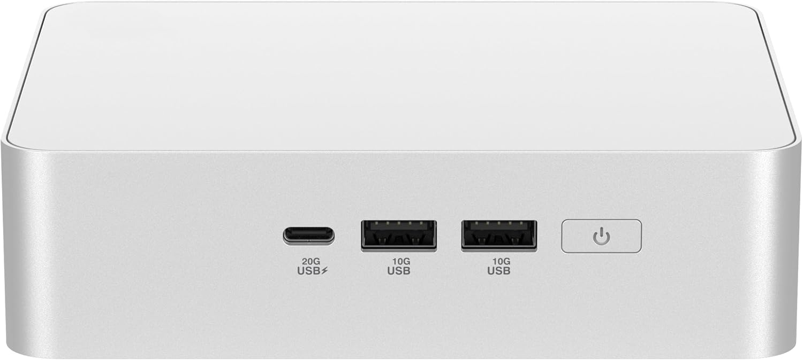
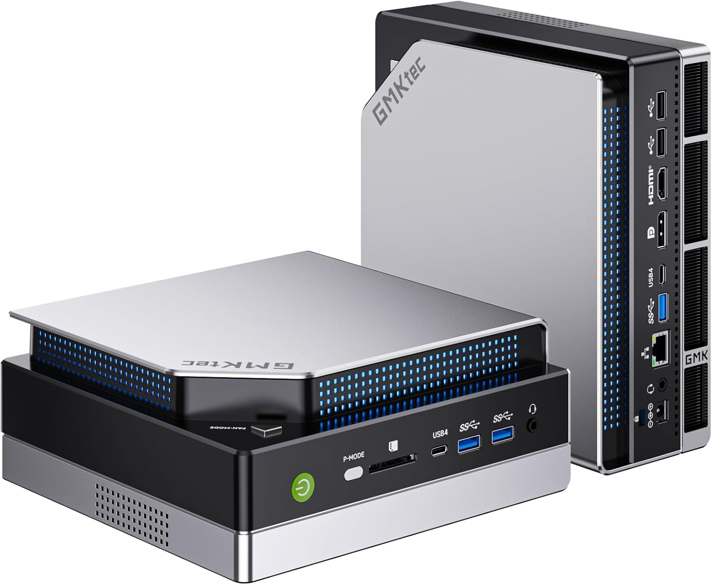
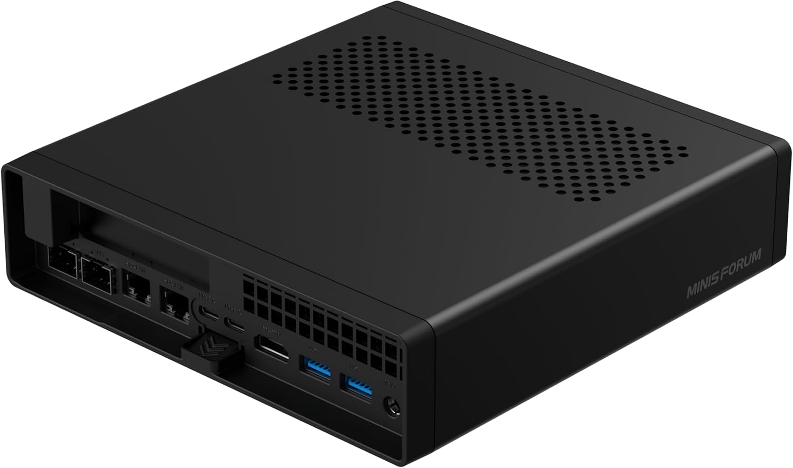

import Button from "../../components/widgets/Button.astro";
import Notice from "../../components/widgets/Notice.astro";
import ListCheck from "../../components/widgets/ListCheck.astro";
import Tabs from "../../components/widgets/Tabs.astro";
import Tab from "../../components/widgets/Tab.astro";
import Accordion from "../../components/widgets/Accordion.astro";

import YouTubeEmbed from "../../components/widgets/YouTubeEmbed.astro";

Looking for the best mini PC for a home server in 2026? I run several in my homelab, from $130 N150 boxes to $2,000 AMD AI systems. They handle media streaming, file storage, local LLMs, and smart home control. All while using less power than a light bulb and fitting on a shelf.

The 2026 market has shifted a lot since last year. There's a new 8-core budget tier, 10GbE is now affordable, and Apple refreshed the Mac mini with the M6 chip. If you're still deciding [why you need a home server at all](/why-need-home-server/), this guide covers what to buy and what to avoid.

<Notice type="warning" title="Affiliate Disclosure">
Some links in this guide are affiliate links. If you buy through them, we may earn a small commission at no extra cost to you. This helps us keep testing and updating these recommendations.
</Notice>

## What to do with a home server

A home server handles a bunch of useful stuff:


<YouTubeEmbed
  url="https://www.youtube.com/embed/0bLrnG0S4mg"
  label="Best Mini PC Home Server"
/>
1. **AI workloads**: Run local LLMs, image recognition, smart automation. See [run local LLMs with Ollama and Open-WebUI](/ollama-docker-install/) for a starting point, and the [local LLM mini PC guide](/best-mini-pc-local-llm/) for the hardware that holds big models
2. **Media streaming**: Jellyfin, Plex, 4K/8K transcoding
3. **Home automation**: Home Assistant, local IoT control
4. **Private cloud**: Your own Dropbox alternative
5. **Dev/testing**: Docker, VMs, [Proxmox](https://www.proxmox.com/), CI/CD pipelines
6. **Network security**: VPN, ad-blocking with [NextDNS](https://go.bitdoze.com/nextdns) or Pi-hole, monitoring. See [how to block ads and malware with NextDNS and AdGuard Home](/block-ads-malware-dns-protection/)
7. **Backups**: Automated, versioned file backups. [Add a new drive to an Ubuntu LVM volume](/add-new-drive-lvm/) when you need more storage

> Check [best Docker containers for a home server](/docker-containers-home-server/) to see what apps you can self-host.

## Why mini PCs make the best homelab servers

Mini PCs hit a sweet spot for home servers:

1. **Low power**: 10-65W vs 200W+ for full desktops. An N150 idles at 5-8W at the wall.
2. **Quiet**: Many are silent or near-silent
3. **Small**: Fit on a shelf, in a cabinet, or behind a monitor
4. **Cheap to run**: Low electricity bills even running 24/7
5. **Capable**: Handle multiple 4K streams, AI workloads, VMs
6. **Cheap to buy**: $130-1000 covers most needs
7. **Fast networking**: 2.5GbE+ and WiFi 7 on newer models

If you're interested in exploring free open source self-hosted applications, check out [toolhunt.net self hosted section](https://toolhunt.net/sh/).

## What changed in the mini PC market since 2025

The mini PC landscape shifted significantly in the past year. Here's what matters:

**New 8-core budget tier.** Intel's Core 3 N350 (7W) and N355 (15W) bring 8 cores to the budget segment. PassMark multi-core sits around 7,400 for the N350 (roughly 38% above the N100) and ~10,000 for the N355. Fanless boxes start at about €310 barebones.

**AMD Gorgon Point is here.** The Ryzen AI 9 HX 470 (12C/24T, NPU 55 TOPS / platform 86 TOPS) ships in the Beelink SER10 MAX and MINISFORUM AI X1 Pro-470. It's the first "Ryzen AI with 10GbE for under $1,300" story.

**10GbE went mainstream.** You can now get 10GbE at $669 (Beelink SER9 Max) to $1,299 (SER10 MAX). The MINISFORUM MS-A2 offers dual SFP+ 10G at $799 barebones. 25GbE exists too (MS-02).

**Mac mini M6 replaces M4.** Apple refreshed the Mac mini on August 25, 2026. The M6 starts at $899 (2nm, 12C CPU/12C GPU, 2.5GbE standard, 10GbE optional). The M5 Pro starts at $1,699 with TB5. The old $599 M4 tier is discontinued.

<Notice type="info" title="DDR5 RAM prices have spiked">
DDR5 costs are sharply up in 2026 due to AI datacenter demand. A 128GB DDR5 kit now costs as much as a mini PC. Buy boxes with RAM pre-installed, or barebones + RAM you already own.
</Notice>

**N150 successor on the horizon.** Panther Lake-N is expected late 2026 or early 2027 with rumored 48 EUs, AV1 encode support, and 6-9W TDP. Nothing shipping yet.

## Factors to consider when choosing a mini PC for a home server

### CPU and NPU: TOPS numbers are misleading

Every AMD marketing slide leads with TOPS numbers. Here's the reality: there's a difference between **NPU TOPS** and **platform TOPS** (which adds CPU + GPU + NPU together).

| Chip | NPU TOPS | Platform TOPS |
|------|----------|---------------|
| Ryzen AI 9 365 | 50 | 73 |
| Ryzen AI 9 HX 370 | 50 | 80 |
| Ryzen AI 9 HX 470 | 55 | 86 |
| Ryzen AI Max+ 395 | 50 | 126 |

The number that matters for local LLMs is **memory bandwidth + capacity**, not NPU TOPS. Ollama and llama.cpp use GPU compute paths, not XDNA NPUs. The EVO-X2 runs DeepSeek 32B at usable speed because of its 256-bit LPDDR5X-8000 memory (~256GB/s bandwidth), not the 50 TOPS NPU.

N-series chips (N150, N350, N355) have no NPU at all. That's fine. They're file servers and transcode boxes, not AI machines.

### Memory and storage: buy RAM-first in 2026

<Notice type="warning" title="DDR5 prices are elevated">
DDR5 RAM prices are up sharply in 2026. Prefer boxes with RAM pre-installed or barebones + RAM you already own. SO-DIMM boxes give you upgrade flexibility.
</Notice>

Guidance tiers:

- **16GB**: Fine for basic file serving, Docker containers, light Home Assistant use
- **32GB+**: Needed for AI workloads, multiple VMs, [Proxmox](/best-mini-pc-proxmox/) with several guests
- **64GB+**: Serious local LLM work, heavy virtualization, development environments

Storage-wise, PCIe 4.0 NVMe SSDs with 7000MB/s+ speeds are standard. Look for boxes with multiple M.2 slots. The AI X1 Pro has three, the MS-A2 has three, and the NUC 15 Pro has dual bays. When you need to expand later, see [how to add a new drive to an Ubuntu LVM volume](/add-new-drive-lvm/).

### Networking: 2.5GbE is standard, 10GbE is now affordable

2.5GbE is commoditized across all tiers. Even $130 N150 boxes include it. For a single-server homelab running Docker containers and media streaming, 2.5GbE is plenty.

10GbE now appears at $669-$1,299. It matters for NAS/Ceph/NFS-heavy setups where you're moving large volumes of data between machines. The MINISFORUM MS-A2 offers dual SFP+ 10G ports at $799 barebones, and the MS-02 goes to 25GbE.

One criticism: the GMKtec EVO-X2 at ~$2,000 still only has 2.5GbE (Realtek RTL8125BG). If you're spending that much and need fast networking, the MS-A2 is the better pick.

### Thermals, noise, and 24/7 reliability

For always-on server use, check these BIOS settings before committing:

- **Auto Power On** after AC loss (essential for unattended servers)
- **Wake-on-LAN** for remote management
- **Fan curve**: set to quiet/balanced, not performance
- **Headless boot**: confirm the box boots without a monitor attached

Noise matters if the box lives in your living space. The EVO-X2 fans are loud under load (community-reported; there's a P-mode button). The AI X1 Pro hits 45dB in performance mode. N150 boxes are effectively silent.

### Soldered vs SO-DIMM RAM: upgrade path matters

<Tabs>
<Tab name="Soldered LPDDR5X">
Faster memory bandwidth, but what you buy is what you get:

- **EVO-X2**: 64GB or 128GB LPDDR5X-8000 (8-channel, ~256GB/s)
- **SER9 Pro**: 32GB LPDDR5X (as sold)
- **Mac mini M6**: 16GB unified (configurable to 32GB)
- **MS-R1**: 32GB ECC LPDDR5

If 64GB+ symmetric RAM matters, the EVO-X2's 128GB option is the differentiator.
</Tab>
<Tab name="SO-DIMM DDR5">
Upgradeable. Buy now, add more later:

- **AI X1 Pro**: 2× DDR5 SO-DIMM, up to 128GB
- **MS-A2**: up to 96GB DDR5
- **NUC 15 Pro**: up to 96GB DDR5
- **SER10 MAX**: 2× DDR5 SO-DIMM 5600
- **N150/N350 boxes**: 1× SO-DIMM (single-channel, 16GB official)

With DDR5 prices spiked, buying a barebones box + RAM you already own can save significant money.
</Tab>
</Tabs>

## Best mini PCs for a home server in 2026

Here's the master comparison. Prices are street prices as of August 2026.

| Product | CPU | RAM | Storage | Key Features | Ideal For | Power | Price |
|---------|-----|-----|---------|--------------|-----------|-------|-------|
| [GMKtec N150](/go/gmktec-n150/) | Intel N150 (4C/4T) | 16GB DDR4 | 512GB SSD | 2.5GbE, WiFi 6, Dual 4K | Budget server | 10-25W | $ |
| N350/N355 fanless | Core 3 N350 (8C/8T) | 16GB DDR5 | varies | 2.5GbE, fanless | Budget multi-VM | 7-15W | $ |
| [Beelink SER9 Max](https://www.bestbuy.com/) | Ryzen AI 7 H350 | 32GB DDR5 | 1TB | **10GbE**, dual M.2 | 10GbE homelab | 25-54W | $$ |
| [Beelink SER9 Pro](/go/beelink-ser9-pro/) | Ryzen AI 9 365 (10C/20T) | 32GB LPDDR5X | 1TB PCIe4.0 | 50 TOPS NPU, Triple 4K@240Hz | AI tasks | 25-65W | $$ |
| [MINISFORUM AI X1 Pro](/go/minisforum-ai-x1-pro/) | Ryzen AI 9 HX370 (12C/24T) | 96GB DDR5 | 2TB SSD | 50 TOPS NPU, OCuLink, Dual 2.5GbE | AI + VMs | 30-65W | $$ |
| [Beelink SER10 MAX](https://www.bee-link.com/) | Ryzen AI 9 HX 470 (12C/24T) | 32-64GB DDR5 | dual M.2 | 55 TOPS NPU, **10GbE** | AI + 10GbE | 25-65W | $$$ |
| [ASUS NUC 15 Pro Tall](/go/asus-nuc-15-pro-tall/) | Core Ultra 7 255H (16C/22T) | Up to 96GB DDR5 | Dual storage | WiFi 7, Thunderbolt 4, MIL-STD | Enterprise | 25-65W | $$ |
| [ASUS NUC 15 Pro+](/go/asus-nuc-15-pro-plus/) | Core Ultra 5 225H (14C/18T) | Up to 96GB DDR5 | Dual storage | WiFi 7, Ultra-quiet | Professional | 20-55W | $$ |
| [MINISFORUM MS-A2](/go/minisforum-ms-a2/) | Ryzen 9 9955HX (16C/32T) | 64GB DDR5 | 1TB SSD | PCIe×16, **Dual 10G SFP+** | NAS/Workstation | 40-120W | $$ |
| MINISFORUM MS-02 | Core Ultra 9 285HX | varies | varies | **2× 25GbE**, full GPU slot | Homelab flex | 45-120W | $$$ |
| [GMKtec EVO-X2](/go/gmktec-evo-x2/) | Ryzen AI Max+ 395 (16C/32T) | 64-128GB LPDDR5X | 1TB SSD | 50 TOPS NPU, Quad 8K | Max power / LLMs | 35-75W | $$$$ |
| MINISFORUM MS-R1 | CIX CP8180 ARM (12C/12T) | 32GB ECC LPDDR5 | dual NVMe | 45 TOPS NPU, **Dual 10GbE** | ARM server | ~15W | $$ |
| [Mac mini M6](/go/mac-mini-m6/) | M6 (12C CPU/12C GPU) | 16GB Unified | 256GB SSD | 2.5GbE std, 10GbE opt | macOS ecosystem | 10-15W | $$ |
| Mac mini M5 Pro | M5 Pro (up to 18C/20C) | 24GB+ Unified | 512GB+ SSD | TB5, 307GB/s bandwidth | Pro macOS | 15-35W | $$$ |

Price range key:
- **$** = Budget ($130-500)
- **$$** = Mid-range ($500-1,000)
- **$$$** = High-end ($1,000-2,000)
- **$$$$** = Premium ($2,000+)

### ARM vs x86: which architecture for your homelab?

<Tabs>
<Tab name="ARM">
ARM systems excel at efficiency and always-on services:

- **Mac mini M6** ($899): 2nm chip, 10-15W idle, 2.5GbE standard, macOS ecosystem. Best for developers already in the Apple world.
- **MINISFORUM MS-R1** ($504): CIX CP8180, dual 10GbE, ECC memory, PCIe x8. The first real non-Apple ARM server buy.
- **Raspberry Pi 5**: PassMark ~4,400. Fine for light duties but outclassed by N150 boxes at similar cost.

ARM pros: low power, excellent efficiency, great for always-on services.
ARM cons: limited virtualization support (no nested KVM on Apple Silicon), some Docker images are x86-only, smaller ecosystem.
</Tab>
<Tab name="x86">
x86 systems offer maximum compatibility:

- Everything from N150 budget boxes to EVO-X2 flagships runs x86.
- Full virtualization support (KVM, Proxmox, ESXi).
- Every Docker image, every server application works out of the box.
- Intel QuickSync for hardware transcoding on N-series and Core Ultra.

x86 pros: universal software compatibility, mature virtualization, hardware transcoding.
x86 cons: higher power draw at the high end, more heat.
</Tab>
</Tabs>

For most home server users, modern x86 systems offer the best compatibility. ARM systems like the Mac mini M6 or MS-R1 are excellent for efficiency-focused always-on services. See [our ARM vs x86 VPS benchmark comparison](/arm-vs-x86-vps-server-benchmarks/) for real performance data.

### Entry-level: Intel N150 mini PC for a budget home server



The GMKtec NucBox G5 with the Intel N150 is still the default budget home server in 2026. At $130-250, it handles file serving, Docker containers, Home Assistant, and media streaming without breaking a sweat.

**Key specs:**
- Intel N150: 4C/4T, 3.6GHz boost, 6W TDP
- 16GB DDR4 (official ceiling; 32GB works unofficially on many boards)
- 2.5GbE networking, WiFi 6, dual 4K display output
- UHD Graphics with 32 execution units (up from 24 on the N100)

The N150 offers roughly 1% CPU improvement over the N100 in PassMark (~5,400 vs ~5,300). The real jump is the iGPU: 32 EUs vs 24 enables 4-5 simultaneous 4K HEVC to 1080p transcodes via QuickSync at under 10W.

<Notice type="info" title="N150 transcoding reality">
The N150 handles 4-5 simultaneous 4K HEVC to 1080p transcodes via QuickSync at under 10W. It cannot *encode* AV1, only decode. If you need AV1 encode for Jellyfin remote streaming to AV1-capable clients, look at AMD Ryzen AI boxes instead.
</Notice>

**Limitations:**
- Single-channel memory (bandwidth-limited)
- 16GB official RAM ceiling (32GB unofficial, check your specific board)
- No NPU, no AV1 encode
- PassMark ~5,400. Fine for light workloads, not for heavy VM multitasking

<Button link="/go/gmktec-n150/" text="Check GMKtec N150 on Amazon" />

### New budget tier: 8-core Intel Core 3 N350 and N355

<Notice type="info" title="The 2026 budget kings for multi-VM homelabs">
The N350/N355 bring 8 cores at 7-15W, a big jump from the 4-core N150. But RAM is still single-channel and limited to 16GB officially.
</Notice>

The Intel Core 3 N350 and N355 are the new budget tier for 2026. Eight cores, 3.9GHz turbo, and a PassMark multi-core score around 7,400 for the N350 (roughly 38% above the N100).

**N350 vs N355:** Same 8C/8T at 3.9GHz. The N350 runs at 7W base power (fanless-friendly), while the N355 runs at 15W (slightly bigger enclosures).

**What's available now:**
- MINIX NEO Z350-0dB: fanless, ~€500 complete (16GB/512GB)
- Barebones options from ~€310
- Industrial boards from AAEON and MINIX

**For homelab use:** 8 cores matter for Proxmox with multiple VMs. The N350 handles 4-5 light Linux containers comfortably. Same limitations as N150: single-channel RAM, 16GB official ceiling (32GB unofficial), no AV1 encode.

### 10GbE homelab value: Beelink SER9 Max and SER10 MAX

The "10GbE for under $1,300" story of 2026.

**Beelink SER9 Max**, $679
- Ryzen AI 7 H350 (Kraken Point), 32GB DDR5 + 1TB
- **10GbE port**, dual M.2 slots (up to 8TB total)
- Best-in-class homelab value if you need fast networking on a budget

**Beelink SER10 MAX** — $1,299 (pre-order, reg $1,599)
- Ryzen AI 9 HX 470 (Gorgon Point), 12C/24T, NPU 55 TOPS / platform 86 TOPS
- **10GbE LAN**, dual M.2, 32/64GB DDR5 SO-DIMM
- Triple display output, Auto Power On + WOL for headless use
- This is the "AI + 10GbE" combo that didn't exist last year

Both have dual M.2 storage. The SER9 Max is the value pick; the SER10 MAX adds serious AI horsepower.

### High-performance AMD AI mini PCs (Ryzen AI 9 365 / HX 370 / HX 470)

<Notice type="warning" title="Check the SoC variant before buying">
The Beelink SER9 Pro ships with three different SoCs (Ryzen AI 9 365, Ryzen AI 9 HX 370, Ryzen 7 H255) at similar prices. Community reports say the HX 370 version is the same price, making the 365 a worse buy. Always confirm which processor is in the listing.
</Notice>

#### [Beelink SER9 Pro](/go/beelink-ser9-pro/)



The SER9 Pro with the Ryzen AI 9 365 is a capable AI-capable homelab box. NPU 50 TOPS / platform 73 TOPS.

**Key specs:**
- Ryzen AI 9 365 (10C/20T, boost 5.0GHz)
- 32GB LPDDR5X-8000 (soldered — not upgradeable)
- 1TB PCIe 4.0 SSD
- Radeon 880M iGPU (12 CUs)
- Triple 4K@240Hz display output
- 2.5GbE + WiFi 6

**For homelab:** Good for AI inference, Docker workloads, and light VM duty. The soldered 32GB is the ceiling — if you need 64GB+, look at the AI X1 Pro instead.

<Button link="/go/beelink-ser9-pro/" text="Check Beelink SER9 Pro on Amazon" />

#### [MINISFORUM AI X1 Pro](/go/minisforum-ai-x1-pro/)



The AI X1 Pro is the workhorse pick. Dual 2.5GbE, OCuLink, three M.2 slots, and SO-DIMM RAM up to 128GB.

**Key specs:**
- Ryzen AI 9 HX370 (12C/24T, boost 5.1GHz), NPU 50 TOPS / platform 80 TOPS
- DDR5 5600MHz SO-DIMM (up to 128GB) — upgradeable
- Up to 3× PCIe 4.0 M.2 SSDs
- Radeon 890M iGPU (16 RDNA 3.5 CUs)
- Display: 2× 8K (HDMI 2.1 + DP 2.0) + 2× 4K (USB4)
- OCuLink port for external GPU connectivity
- Dual 2.5GbE LAN + WiFi 7 + Bluetooth 5.4

**Why it's the homelab workhorse:** Upgradeable RAM to 128GB, dual 2.5GbE for network separation, OCuLink for GPU passthrough experiments. The HX 370 variant at $695 sale ($869 reg) is the sweet spot.

There's also an **AI X1 Pro-470** variant with the Ryzen AI 9 HX 470 (NPU 55 TOPS / platform 86 TOPS) at $759 sale ($949 reg).

<Button link="/go/minisforum-ai-x1-pro/" text="Check MINISFORUM AI X1 Pro on Amazon" />

### Professional Intel solutions: ASUS NUC 15 Pro

#### [ASUS NUC 15 Pro Tall](/go/asus-nuc-15-pro-tall/)



The NUC 15 Pro is the enterprise-grade pick. MIL-STD-810H certified, tool-less chassis, and ASUS's reliability track record.

**Key specs:**
- Intel Core Ultra 7 255H (16C/22T) with Intel Arc 140T Graphics
- Up to 96GB DDR5 SO-DIMM — upgradeable
- Dual storage bays
- WiFi 7 + Thunderbolt 4
- Quad 4K display via HDMI 2.1 + Thunderbolt 4
- Tool-less 2.0 chassis for easy upgrades

**Pricing:** ~$845-1,000 configured (16GB/1TB) at retail; barebone ~$429 at asus.com.

**For homelab:** The barebone at $429 is compelling if you have DDR5 SO-DIMMs on hand. Add your own RAM and storage, install Proxmox, and you have a reliable virtualization host.

<Button link="/go/asus-nuc-15-pro-tall/" text="Check ASUS NUC 15 Pro Tall on Amazon" />

#### [ASUS NUC 15 Pro+](/go/asus-nuc-15-pro-plus/)



A more affordable entry with the Core Ultra 5 225H. Ultra-quiet cooling with 1.2x noise reduction compared to the standard model. Same tool-less chassis, WiFi 7, and up to 96GB DDR5 support.

<Button link="/go/asus-nuc-15-pro-plus/" text="Check ASUS NUC 15 Pro+ on Amazon" />

> The [ASUS DC510](https://go.bitdoze.com/asus-dc510) is another compact option worth considering if you want an ASUS mini PC for home or office use.

### Extreme performance: EVO-X2, MS-A2, and MS-02

#### [GMKtec EVO-X2](/go/gmktec-evo-x2/)



The EVO-X2 is the most powerful x86 APU in a mini PC. The Ryzen AI Max+ 395 with 16 Zen 5 cores, 40 RDNA 3.5 GPU CUs, and 256-bit LPDDR5X-8000 memory makes it the only mini PC that can run DeepSeek 32B at usable speed locally.

**Key specs:**
- Ryzen AI Max+ 395 (16C/32T, boost 5.1GHz), NPU 50 TOPS / platform 126 TOPS
- 64GB or 128GB LPDDR5X-8000 (soldered, 8-channel, ~256GB/s bandwidth)
- Radeon 8060S iGPU (40 CUs) — RTX 4060/4070 laptop equivalent
- Quad 8K display output
- 2.5GbE + WiFi 7

**The catch:** $1,999. Only 2.5GbE at this price (community-criticized). Fans are loud under load. Soldered RAM — pick your capacity at purchase.

<Button link="/go/gmktec-evo-x2/" text="Check GMKtec EVO-X2 on Amazon" />

#### [MINISFORUM MS-A2](/go/minisforum-ms-a2/)



The MS-A2 is the homelab-NAS-workstation hybrid. At $799 barebones (reg $999), it's gone from premium to mid-range pricing.

**Key specs:**
- Ryzen 9 9955HX (16C/32T)
- **Dual SFP+ 10G + 2× 2.5G LAN** — four network ports
- PCIe×16 slot (full-size GPU or NVMe adapter)
- 3× M.2 slots, up to 96GB DDR5 / 12TB storage
- 40-120W cTDP

**For homelab:** This is the box for NAS-heavy setups. Dual 10G SFP+ for fast storage networking, PCIe×16 for a 10G NIC or HBA, and enough CPU for ZFS or Ceph. Barebones at $799 means you bring your own RAM and storage.

<Button link="/go/minisforum-ms-a2/" text="Check MINISFORUM MS-A2 on Amazon" />

#### MINISFORUM MS-02

The homelab flex machine. Core Ultra 9 285HX, **2× 25GbE ports**, full-size GPU slot support, $1,199 barebones. If you need 25-gig networking in a mini PC form factor, this is the only game in town.

### ARM excellence: Mac mini M6 as a home server

The Mac mini line was refreshed on August 25, 2026. The M4 is gone; here's what's current:

**Mac mini M6** — $899
- M6 chip: 12C CPU / 12C GPU, 2nm process, 170GB/s memory bandwidth
- 16GB unified memory (configurable to 32GB)
- 2.5GbE standard, 10GbE optional
- N1 WiFi 7 / Bluetooth 6
- macOS 27 Golden Gate
- Ships September 22, 2026
- 10-15W idle — extremely power-efficient

**Mac mini M5 Pro** — $1,699
- Up to 18C CPU / 20C GPU, 307GB/s bandwidth
- Thunderbolt 5
- 24GB+ unified memory

**For homelab:** The M6 at $899 is excellent for always-on services — Docker containers, Home Assistant, media serving. macOS has native Docker support, and the power efficiency is hard to beat. The limitation is virtualization: no nested KVM, and some Docker images are x86-only.

<Button link="/go/mac-mini-m6/" text="Check Mac mini on Amazon" />

#### MINISFORUM MS-R1 — the non-Apple ARM option

If you want ARM efficiency without the Apple tax, the MS-R1 ($504 with 32GB) is worth a look:

- CIX CP8180 ARM processor (12C/12T @ 2.6GHz)
- 45 TOPS NPU
- **Dual 10GbE** — more networking than the Mac mini at half the price
- ECC LPDDR5 memory
- PCIe x8 slot
- Dual NVMe

It's a niche pick, but for an always-on ARM server with 10GbE, nothing else competes at this price.

## How much does a home server mini PC cost to run?

This is the "low cost" part of the title. Here's concrete annual power-cost math at $0.16-$0.20/kWh (EU/US average), running 24/7:

| Tier | Idle Power | Annual kWh | Annual Cost |
|------|-----------|-----------|-------------|
| N150 | ~8W | ~70 kWh | ~$11-14 |
| N350/N355 | ~10W | ~88 kWh | ~$14-18 |
| Ryzen AI 9 365 (SER9 Pro) | ~30W | ~263 kWh | ~$42-52 |
| Ryzen AI 9 HX 370 (AI X1 Pro) | ~35W | ~307 kWh | ~$49-61 |
| Strix Halo (EVO-X2/MS-A2) | ~45-65W | ~394-569 kWh | ~$63-114 |
| Mac mini M6 | ~10-15W | ~88-131 kWh | ~$14-26 |

<Notice type="success" title="The real low-cost story">
An N150 box running 24/7 costs about $1/month in electricity. A Mac mini M6 costs about $1.50/month. That's the real "low cost" promise of a mini PC homelab.
</Notice>

Note: N-series idle figures are well-documented (jellywatch.app, raspberry.tips). AMD box idle draws vary by model and BIOS settings — the ranges above are community-reported estimates.

## Mini PC for Proxmox and virtualization: verify before you commit

If you're planning to run Proxmox, ESXi, or heavy VM workloads, the shortlist changes: you want dual NICs (or at least 2.5GbE), VT-d/IOMMU for passthrough, and enough RAM headroom that VMs don't swap.

**Best mini PCs for Proxmox from this guide:**

| Pick | Why for Proxmox | Link |
| --- | --- | --- |
| MINISFORUM MS-A2 | Dual SFP+ 10G + 2.5GbE, up to 96GB, proper VM host | [jump to review](#minisforum-ms-a2) |
| MINISFORUM AI X1 Pro | Dual 2.5GbE, 96GB DDR5, 12C/24T for VM density | [jump to review](#minisforum-ai-x1-pro) |
| GMKtec N150 | Cheap 2.5GbE node — buy 2-3 for a cluster | [jump to review](#entry-level-intel-n150-mini-pc-for-a-budget-home-server) |

Verify your hardware before trusting it 24/7.

**1. Verify hardware media engines after install:**

```bash
# VAAPI (AMD/Intel) — for Jellyfin/Plex transcoding
vainfo

# Intel QuickSync decode test
ffmpeg -hide_banner -hwaccel qsv -i test-4k-hevc.mkv -f null -

# Check temperatures
sudo sensors
```

**2. Run a 30-minute thermal soak:**

```bash
sudo apt install stress-ng
stress-ng --cpu $(nproc) --timeout 30m &
watch -n 5 sensors
```

<Notice type="warning" title="Stress test before going 24/7">
Run a 30-minute stress test before trusting any box 24/7. Community reports show the EVO-X2 and AI X1 Pro can throttle or get loud under sustained load. Watch for thermal throttling and note fan behavior.
</Notice>

**3. IOMMU for GPU passthrough (Proxmox/Ubuntu):**

```bash
# Edit /etc/default/grub:
# GRUB_CMDLINE_LINUX_DEFAULT="... amd_iommu=on iommu=pt"
sudo update-grub && sudo reboot
```

**4. BIOS checklist for headless servers:**
- Auto Power On after AC loss
- Wake-on-LAN enabled
- Fan curve set to quiet/balanced
- Headless boot confirmed (no monitor required)
- IOMMU enabled (if doing GPU passthrough)

After setup, [monitor your home server with Beszel and Uptime Kuma](/beszel-uptime-kuma/) and [monitor server and Docker CPU, memory, and disk](/sever-monitoring/) to catch issues early.

## Buying tips for 2026

<ListCheck>
<ul>
<li>Buy RAM-forward — DDR5 prices are spiked; prefer boxes with RAM pre-installed or barebones + RAM you already own</li>
<li>Prefer SO-DIMM if you might upgrade later — soldered LPDDR5X is faster but locked at purchase</li>
<li>Confirm the SoC variant in listings — the SER9 Pro ships with 3 different chips at similar prices</li>
<li>Consider barebones + stockpiled RAM — MS-A2 at $799 and NUC 15 Pro at $429 barebones can save money if you have DDR5</li>
<li>Check Auto Power On and Wake-on-LAN in BIOS for headless server use — not all boards enable these by default</li>
<li>After setup, install a management panel — see [best self-hosted server panels](/best-self-hosted-panels/) for options</li>
</ul>
</ListCheck>

## Common failure modes and gotchas

<Accordion label="N-series RAM ceiling" group="gotchas">
N150, N350, and N355 all have a 16GB official RAM ceiling. Single-channel memory only. 32GB works unofficially on many boards, but check your specific model before buying RAM. If you need 32GB+ guaranteed, skip N-series entirely.
</Accordion>

<Accordion label="No AV1 encode on N-series" group="gotchas">
N150, N350, and N355 can decode AV1 but cannot encode it. This matters for Jellyfin remote streaming — if your clients support AV1, you'd want to transcode to AV1 to save bandwidth. N-series can't do that. AMD Ryzen AI boxes can.
</Accordion>

<Accordion label="Fan noise under load" group="gotchas">
The EVO-X2 is loud under load (community-reported; there's a P-mode button for performance). The AI X1 Pro hits 45dB in performance mode. The MS-S1 Max has no barebones option. If noise matters, N150/N350 fanless boxes or the NUC 15 Pro+ (1.2x noise reduction) are better choices.
</Accordion>

<Accordion label="Amazon listing SoC drift" group="gotchas">
The Beelink SER9 Pro ships with three different SoCs (Ryzen AI 9 365, Ryzen AI 9 HX 370, Ryzen 7 H255) at similar prices. Community reports say the HX 370 version is the same price, making the 365 a worse buy. Always confirm which processor is in the listing before clicking buy.
</Accordion>

<Accordion label="EVO-X2 networking mismatch" group="gotchas">
The GMKtec EVO-X2 costs ~$2,000 but only has 2.5GbE (Realtek RTL8125BG). If you need 10GbE at this price point, the MINISFORUM MS-A2 at $799 barebones with dual SFP+ 10G is the better pick. The EVO-X2's strength is its 128GB LPDDR5X and iGPU, not networking.
</Accordion>

For server security after setup, see [how to harden a Docker server](/bsi-security-report-docker-ufw/).

## Best use cases for a 2026 home server

| Use Case | Best Pick | Why |
|----------|-----------|-----|
| File server + Docker | N150 | 8W idle, silent, 2.5GbE, enough for 20+ containers |
| Media streaming (Jellyfin/Plex) | N150 | 4-5× 4K HEVC to 1080p transcodes via QuickSync |
| Multi-VM / Proxmox | N350/N355 or AI X1 Pro | 8 cores (N350) or 12 cores (HX 370), SO-DIMM RAM |
| Local LLMs | EVO-X2 (128GB) | 256GB/s memory bandwidth runs DeepSeek 32B |
| AI + 10GbE | SER10 MAX | HX 470 + 10GbE in one box |
| NAS with fast networking | MS-A2 | Dual SFP+ 10G, PCIe×16, 3× M.2 |
| Always-on services | Mac mini M6 | 10-15W idle, 2.5GbE, rock-solid macOS |
| Network security | N150 + [NextDNS](https://go.bitdoze.com/nextdns) | Low power, always on, [block ads and malware](/block-ads-malware-dns-protection/) |
| Home Assistant | N150 or N350 | Overkill for HA alone, but leaves headroom for other containers |

**Entry-level applications** (N150/N350):
- File server, Docker containers, Home Assistant, Pi-hole/AdGuard
- Media streaming with QuickSync hardware transcoding
- Lightweight VPN endpoint

**AI-powered applications** (Ryzen AI / EVO-X2):
- [Run local LLMs with Ollama and Open-WebUI](/ollama-docker-install/)
- Image recognition, smart home automation
- Development and testing of AI models

**Professional applications** (NUC 15 Pro / MS-A2):
- Multi-VM virtualization with Proxmox
- CI/CD pipelines, build servers
- NAS with 10GbE networking

## Summary: what mini PC should you buy in 2026?

| Use Case | Recommendation | Price |
|----------|---------------|-------|
| Budget home server | GMKtec N150 (NucBox G5) | $130-250 |
| Budget multi-VM / Proxmox | N350/N355 fanless (MINIX NEO Z350-0dB) | ~€310-500 |
| 10GbE homelab value | Beelink SER9 Max | $669 |
| AI + 10GbE | Beelink SER10 MAX (HX 470) | $1,299 |
| AI workhorse | MINISFORUM AI X1 Pro-370 | $695-869 |
| Max power / local LLMs | GMKtec EVO-X2 (128GB option) | $1,999 |
| Workstation / NAS | MINISFORUM MS-A2 (10G SFP+) | $799 barebones |
| Homelab flex | MINISFORUM MS-02 (25GbE) | $1,199 barebones |
| Mac household | Mac mini M6 / M5 Pro | $899 / $1,699 |
| ARM + dual 10GbE | MINISFORUM MS-R1 | $504 |

My default recommendation: if you're starting a homelab, get an **N150 box** ($130-250). It runs 24/7 for $1/month, handles Docker and media streaming, and is dead silent. If you need more cores for Proxmox, step up to the **N350**. If you want AI, the **AI X1 Pro** at $695 is the sweet spot. If you need 10GbE, the **SER9 Max at $669** is the value king.

## Quick FAQ

<Accordion label="Can mini PCs run AI locally?" group="faq" expanded="true">
Yes, but the NPU TOPS number is misleading. For local LLMs, memory bandwidth + capacity matters more than NPU TOPS. The EVO-X2's 128GB LPDDR5X at ~256GB/s is what runs DeepSeek 32B at usable speed, not the 50 TOPS NPU. Ollama and llama.cpp use GPU compute paths, not XDNA NPUs. For lighter AI tasks, the Ryzen AI 9 HX 370 with 64GB DDR5 handles most models up to 13B parameters.
</Accordion>

<Accordion label="How much RAM do I need?" group="faq">
16GB for basic file serving and Docker containers. 32GB+ for AI workloads and multiple VMs. 64GB+ for serious local LLM work and heavy virtualization. DDR5 prices are elevated in 2026 — buy RAM-forward (get boxes with RAM pre-installed) or buy barebones + RAM you already own.
</Accordion>

<Accordion label="Are mini PCs upgradeable?" group="faq">
Depends on the model. SO-DIMM boxes (AI X1 Pro up to 128GB, MS-A2 up to 96GB, NUC 15 Pro up to 96GB, SER10 MAX) are upgradeable. Soldered LPDDR5X boxes (EVO-X2 max 128GB, SER9 Pro 32GB, Mac mini) — what you buy is what you get. Always check before purchasing if you think you'll need more RAM later.
</Accordion>

<Accordion label="x86 or ARM for a home server?" group="faq">
x86 for maximum compatibility and virtualization support. Every Docker image and server application works. ARM (Mac mini M6, MS-R1) for efficiency and always-on services — lower power draw, but limited virtualization (no nested KVM on Apple Silicon) and some x86-only Docker images.
</Accordion>

<Accordion label="What networking do I need?" group="faq">
2.5GbE is standard on all 2026 mini PCs and enough for most homelabs. 10GbE matters for NAS/Ceph/NFS-heavy setups where you're moving large data volumes between machines. 10GbE is now available from $669 (SER9 Max). The MS-02 offers 25GbE at $1,199 barebones.
</Accordion>

<Accordion label="Does AV1 encoding matter?" group="faq">
Only if you remote-stream via Jellyfin/Plex to AV1-capable clients. AV1 encoding saves bandwidth significantly. N-series chips (N150, N350, N355) decode AV1 but cannot encode it. AMD Ryzen AI boxes can encode AV1. If most of your streaming is local or to H.265-capable clients, this doesn't matter.
</Accordion>
