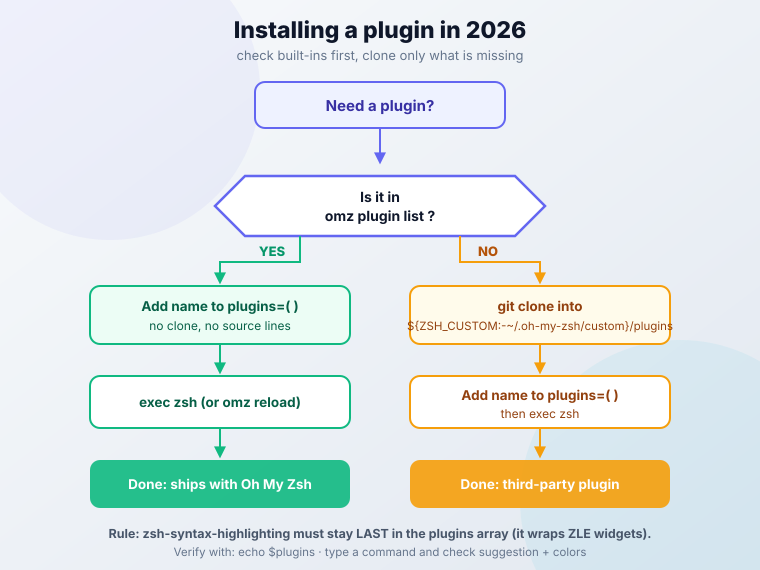

import Button from "@components/widgets/Button.astro";
import Notice from "@components/widgets/Notice.astro";
import ListCheck from "@components/widgets/ListCheck.astro";
import Accordion from "@components/widgets/Accordion.astro";
import Tabs from "@components/widgets/Tabs.astro";
import Tab from "@components/widgets/Tab.astro";

Oh My Zsh plugins add command suggestions, syntax highlighting, and shortcuts that speed up your terminal work. Since September 2026, the two most popular ones ship with Oh My Zsh out of the box. Here are the best Oh My Zsh plugins for 2026, starting with the two you no longer have to `git clone`.

If you spend any real time in the terminal, the right plugins make a noticeable difference. These are the ones I use and recommend. Star counts and versions below are point-in-time as of October 2026.

<Notice type="success" title="What changed in 2026">
Oh My Zsh merged PR #14088 on 2026-09-10 and now vendors `zsh-autosuggestions` and `zsh-syntax-highlighting`. They are not enabled by default. You add them to `plugins=(...)` and reload. You do not need to clone anything or wire up `source` lines.
</Notice>

## Installing Oh My Zsh plugins in 2026 (no git clone required)

Getting a working setup takes a few minutes. The difference in 2026 is that the two essential plugins no longer need a manual `git clone`.

Everything in this guide is free and runs locally. It costs $0/month and needs no account or API key.

**Prerequisites:**

<ListCheck>
<ul>
<li>zsh 5.9 or newer (the zsh mirror shows a 5.9.2 tag alongside 5.9; treat 5.9+ as the baseline)</li>
<li>git and curl</li>
<li>macOS or Linux, any terminal</li>
<li>An existing `~/.zshrc` (created by the Oh My Zsh installer if you do not have one)</li>
</ul>
</ListCheck>

<Accordion label="Installing Oh My ZSH" group="setup" expanded="true">
First, install Oh My ZSH using the official command:

```shell
sh -c "$(curl -fsSL https://raw.githubusercontent.com/ohmyzsh/ohmyzsh/master/tools/install.sh)"
```

The script handles the setup. Your terminal restarts with a new prompt when it finishes.

**Verify**: `echo $ZSH` prints the install path (usually `~/.oh-my-zsh`) and the prompt changed. There is no `omz --version`, so those two checks are the confirmation. Updates later come from `omz update`.
</Accordion>

<Accordion label="Enabling built-in plugins (2026: no clone needed)" group="setup">
`zsh-autosuggestions` and `zsh-syntax-highlighting` now ship inside Oh My Zsh. Add them to the plugins line in `~/.zshrc`:

```zsh
plugins=(
  git
  zsh-autosuggestions      # built-in since 2026-09-10
  zsh-syntax-highlighting  # MUST stay last
)
```

Honest notes on what is bundled: autosuggestions is vendored at roughly upstream v0.7.1, and syntax-highlighting is a dev snapshot of 0.8.x (upstream stable tag is 0.8.0). Close enough for daily use, just do not expect the newest upstream commit.

Manual `git clone` is now only for genuinely third-party plugins. That flow is in the [third-party install section](#installing-third-party-plugins-manual-homebrew) below.
</Accordion>

<Accordion label="Enabling and reloading" group="setup">
Once installed or enabled, you activate plugins in your configuration file:

1. Open your `.zshrc` file:
```shell
nano ~/.zshrc
```

2. Find the plugins line and add your desired plugins:
```shell
plugins=(git zsh-autosuggestions zsh-syntax-highlighting)
```

3. Reload the shell:
```shell
exec zsh
```

`omz reload` and `source ~/.zshrc` also work. I prefer `exec zsh` because it replaces the current shell process instead of stacking config on top of it.

**Verify**: `echo $plugins` lists the plugin names. Then type a partially known command from your history and you should see a grey suggestion to the right of the cursor (right arrow accepts it). Type any valid command and it shows green, an invalid one shows red.
</Accordion>

<Notice type="info" title="Quick Tip">
Run `source ~/.zshrc` after changes to apply them without restarting.
</Notice>



### Discover plugins with the `omz` CLI

Oh My Zsh ships an `omz` command that most guides never mention. It replaces browsing the wiki when you want to know what is available:

```zsh
omz plugin list          # every plugin that ships with Oh My Zsh
omz plugin info eza      # what a plugin does and how to use it
omz plugin enable eza    # toggles a plugin in your config
omz plugin disable eza
omz theme list           # available themes
omz theme set robbyrussell
omz changelog            # what changed recently
omz reload               # reload the shell config
omz update               # update Oh My Zsh itself
```

<Notice type="warning" title="Removed flag">
`omz update --unattended` was removed upstream because it had side effects. Use plain `omz update`.
</Notice>

**Verify**: `omz plugin info <name>` errors on unknown names, which makes it a free spelling check. After `omz plugin enable`, `echo $plugins` shows the name.

### Keep Oh My Zsh updated

A shell framework is still software that executes on every prompt. Keep it current or pin it deliberately:

```zsh
# in ~/.zshrc, before oh-my-zsh.sh is sourced
zstyle ':omz:update' mode auto      # or: reminder | disabled
zstyle ':omz:update' frequency 7    # check every 7 days
```

My default is `mode auto` with `frequency 7`. Auto-update or pin, but do not let a shell framework drift for a year.

One ops footnote: `omz update` runs `git pull` in `$ZSH`, so a dirty `$ZSH` tree (hand-edited files under `~/.oh-my-zsh`) breaks updates. Keep your own config in `~/.zshrc`, not by patching framework files.

### Troubleshooting plugin problems

When a plugin does nothing, work through this list before reinstalling anything:

- Plugin not loading. It is missing from `plugins=(...)`, the name is typo'd, or it needs an external binary you have not installed (`zoxide`, `eza`, `fzf`, `op`).
- Highlighting colors are stale or wrong. `zsh-syntax-highlighting` is not last in the array. Fix the order first.
- `command-not-found` silently does nothing. It needs the distro database (pkgfile on Arch, the `command-not-found` package on Ubuntu/Debian). Without it the plugin no-ops.
- Something is slow or broken and you cannot tell which plugin. `zsh -f` starts zsh without rc files. If the problem disappears, it is plugin-caused.
- Reload properly. `exec zsh` beats opening a new terminal tab, and it proves the config loads from scratch.

To sanity check a clean install without touching your own machine, run a throwaway container:

```shell
docker run -it --rm zshusers/zsh
```

<Notice type="warning" title="zsh-syntax-highlighting must be last">
It has to load after plugins that wrap ZLE widgets. If colors go stale or wrong, check the array order before anything else.
</Notice>

## Essential Oh My Zsh plugins

Entries below are tagged by install cost: `Built-in · zero config` (add the name and go), `Built-in · needs binary` (install a tool first), `Third-party · clone` (the only case that still needs `git clone`).

### Core productivity plugins, now built in

**1. [zsh-autosuggestions](https://github.com/zsh-users/zsh-autosuggestions)** (`Built-in · zero config`)

Suggests commands as you type, based on your history. Grey "ghost text" appears to the right of the cursor and the right arrow accepts it, which saves typing on repetitive commands. Add `zsh-autosuggestions` to `plugins=(...)`. It has been built into Oh My Zsh since 2026-09-10 (vendored ≈ v0.7.1), so there is no `git clone` step. The [How to Enable Command Autocomplete in ZSH](/enable-command-autocomplete-in-zsh/) tutorial still shows the old `git clone` flow; on current Oh My Zsh the built-in enable above is enough.

**2. [zsh-syntax-highlighting](https://github.com/zsh-users/zsh-syntax-highlighting)** (`Built-in · zero config`)

Colors your commands as you type: red for invalid commands, green for valid ones. It catches typos and wrong flags before you hit enter. Add `zsh-syntax-highlighting` to `plugins=(...)` and keep it **last**. Vendored from upstream master (stable tag 0.8.0). The [How to Enable Syntax Highlighting in Zsh](/enable-syntax-highlighting-zsh/) tutorial has the same refresh note: the clone step is gone for Oh My Zsh users.

**3. [z](https://github.com/ohmyzsh/ohmyzsh/tree/master/plugins/z)** (`Built-in · zero config`)

Jumps to frequently used directories without full paths. `z documents` lands you in `~/Documents`, `z proj` in `~/Projects`. It is built in, so just add `z` to `plugins=(...)`, and it learns from your `cd` history. The upgrade path is [zoxide](https://github.com/ajeetdsouza/zoxide), the modern replacement (Rust, v0.10.0, ~40k stars). Install the binary first (`brew install zoxide`, apt, or cargo), then enable the first-party `zoxide` plugin. `ZOXIDE_CMD_OVERRIDE` lets you keep typing `z` while it runs zoxide under the hood. More in [Zoxide: a smarter way to navigate your terminal](/zoxide/).

**4. [git](https://github.com/ohmyzsh/ohmyzsh/tree/master/plugins/git)** (`Built-in · zero config`)

Aliases and completions for Git operations. The ones I use daily: `gst` (git status), `gco` (git checkout), `gaa` (git add --all), `gcm "message"` (git commit -m). This one has been stable for years and speeds up the boring 90% of Git work.

**5. [history-substring-search](https://github.com/ohmyzsh/ohmyzsh/tree/master/plugins/history-substring-search)** (`Built-in · zero config`)

Type part of a previous command, then use ↑/↓ to cycle through history matches containing that string. You find previous commands without endless scrolling. For history that survives machine changes, see Atuin in Modern Alternatives below.

<Notice type="info" title="Command recall tip">
Combine history-substring-search with zsh-autosuggestions. One finds the old command, the other suggests it while you type. If you want history that survives machine changes, look at Atuin.
</Notice>

### Development and DevOps plugins

**6. [docker](https://github.com/ohmyzsh/ohmyzsh/tree/master/plugins/docker)** (`Built-in · zero config`)

Autocompletion and aliases for Docker commands. Less typing on `docker` subcommands and fewer typos in long flag lists.

**7. [docker-compose](https://github.com/ohmyzsh/ohmyzsh/tree/master/plugins/docker-compose)** (`Built-in · zero config`)

Completion for multi-container setups. It now auto-detects legacy `docker-compose` versus the `docker compose` v2 subcommand. Tab completion catches typos before they break your stack.

**8. [npm](https://github.com/ohmyzsh/ohmyzsh/tree/master/plugins/npm)** (`Built-in · zero config`)

Completion and aliases for npm, plus prompt info like package name and version. Faster package management without memorizing script names.

**9. [kubectl](https://github.com/ohmyzsh/ohmyzsh/tree/master/plugins/kubectl)** (`Built-in · zero config`)

Completion and aliases for `kubectl`. Resource names, namespaces, and flags complete properly. That matters when you are on a production context.

**10. [aws](https://github.com/ohmyzsh/ohmyzsh/tree/master/plugins/aws)** (`Built-in · zero config`)

Completion for the AWS CLI plus profile switching helpers. Easier profile management when you juggle several accounts.

**11. [codex](https://github.com/ohmyzsh/ohmyzsh/tree/master/plugins/codex)** (`Built-in · zero config`)

Completion for the OpenAI Codex CLI. Tab completion for an AI coding agent in the terminal. For the wider agent ecosystem see [best AI coding tools and agents](/ai-coding-tools/).

**12. Toolchain managers** (`Built-in · zero config`)

First-party plugins for modern version managers: `mise`, `uv` / `uv-env`, `fnm`, `volta`. These replace nvm-era habits with one consistent completion setup. Also first-party now and worth knowing: `jj` (jujutsu VCS), `bun`, `deno`, `tailscale`, `k9s`, `helm`, `argocd`, `fluxcd`, `opentofu`, `direnv`, `poetry` / `poetry-env`, `ruff`. `omz plugin list` covers most of a DevOps toolbox without a single clone.

### Utility and convenience plugins

**13. [web-search](https://github.com/ohmyzsh/ohmyzsh/tree/master/plugins/web-search)** (`Built-in · zero config`)

Opens web searches from the terminal: `google "search term"`, `bing "query"`, `duckduckgo "topic"`.

**14. [extract](https://github.com/ohmyzsh/ohmyzsh/tree/master/plugins/extract)** (`Built-in · zero config`)

One command for every archive format: `extract filename.zip`, `extract archive.tar.gz`. ZIP, TAR, GZ, BZ2, 7Z, RAR, DMG, and more. No more remembering which flags which format needs.

**15. [1password](https://github.com/ohmyzsh/ohmyzsh/tree/master/plugins/1password)** (`Built-in · zero config`)

First-party 1Password integration. `opswd service-name` walks through username, then password, then TOTP, with a confirmation between each step. The clipboard auto-clears after 20 seconds and service names tab-complete. It needs the 1Password CLI (`op` v2) signed in; biometric unlock works. Credentials without leaving the terminal, and without pasting secrets into shell history.

**16. [sudo](https://github.com/ohmyzsh/ohmyzsh/tree/master/plugins/sudo)** (`Built-in · zero config`)

Prefixes the current command with `sudo` when you press `ESC` twice. Right tool for those "permission denied" moments when the command is already typed.

**17. [colored-man-pages](https://github.com/ohmyzsh/ohmyzsh/tree/master/plugins/colored-man-pages)** (`Built-in · zero config`)

Adds colors to man pages. Options and flags become scannable instead of a wall of text.

**18. [eza](https://github.com/ohmyzsh/ohmyzsh/tree/master/plugins/eza)** (`Built-in · needs binary`)

Replaces the `ls` aliases with [eza](https://github.com/eza-community/eza): colors, icons, git status, and tree view (v0.23.5, ~23k stars). Install the binary first (`brew install eza`, your distro package, or cargo), then add `eza` to `plugins=(...)`. `zstyle ':omz:plugins:eza' ...` options like `dirs-first` must be set **before** Oh My Zsh loads plugins, so put them above the `source $ZSH/oh-my-zsh.sh` line. `ls` output you can read at a glance.

### Advanced plugins

**19. [fzf](https://github.com/junegunn/fzf)** (`Built-in · needs binary`)

Fuzzy finder for files, history, and anything you pipe into it (fzf v0.74.x, ~83k stars). Install it in 2026 with `brew install fzf` on macOS or `apt install fzf` on Debian/Ubuntu (apt's version lags upstream), or use the official install script from the repo. Then either enable the Oh My Zsh `fzf` plugin **or** add `eval "$(fzf --zsh)"` to `.zshrc` (available since fzf v0.48.0). Shortcuts worth memorizing: `Ctrl+T` finds files, `Ctrl+R` searches history, `Alt+C` changes directory. Also worth adding: [fzf-tab](https://github.com/Aloxaf/fzf-tab) (~5k stars) replaces the default completion menu with fzf. That one is a third-party clone.

**20. [thefuck](https://github.com/ohmyzsh/ohmyzsh/tree/master/plugins/thefuck)** (`Built-in · needs binary`)

Suggests a fix after a failed command. Type `fuck` or press `Ctrl+G`. It needs the `thefuck` Python package installed on the system, and it fixes typos without retyping.

<Notice type="warning" title="Unmaintained">
nvbn/thefuck has ~98k stars but its last push was 2024-07-19. The Oh My Zsh plugin still works, but I would not build habits around it. [pay-respects](https://github.com/iffse/pay-respects) is the actively maintained Rust replacement (pushed 2026-10-03).
</Notice>

**21. [virtualenv](https://github.com/ohmyzsh/ohmyzsh/tree/master/plugins/virtualenv)** (`Built-in · zero config`)

Prompt indicators and helpers for Python virtual environments. Visible environment state in the prompt. For modern Python workflows also check the `uv` / `uv-env` and `poetry-env` plugins.

**22. [fast-syntax-highlighting](https://github.com/zdharma-continuum/fast-syntax-highlighting)** (`Third-party · clone`)

Alternative syntax highlighter with switchable themes and extra highlighters. Install it with `git clone https://github.com/zdharma-continuum/fast-syntax-highlighting.git ${ZSH_CUSTOM:-~/.oh-my-zsh/custom}/plugins/fast-syntax-highlighting`. The pitch has changed. It is active (pushed 2026-08-31, ~1.8k stars), but the vendored `zsh-syntax-highlighting` closed most of the latency gap in 2026. Install it for themes and extra highlighters, not raw speed.

**23. [zsh-autocomplete](https://github.com/marlonrichert/zsh-autocomplete)** (`Third-party · clone`)

Real-time completion menus as you type (release 26.08.04, ~7k stars). Install it with `git clone --depth 1 -- https://github.com/marlonrichert/zsh-autocomplete.git ${ZSH_CUSTOM:-~/.oh-my-zsh/custom}/plugins/zsh-autocomplete`. Caveat: it is heavy, and conflicts with `zsh-autosuggestions` / syntax-highlighting setups are commonly reported. Check its README before adding it to a stack that already works.

## More worthwhile plugins (bonus list)

One line each, all built-in unless noted:

- **[command-not-found](https://github.com/ohmyzsh/ohmyzsh/tree/master/plugins/command-not-found)**: suggests packages for unknown commands. Needs the distro DB (pkgfile on Arch, `command-not-found` on Ubuntu) or it is a silent no-op.
- **[jsontools](https://github.com/ohmyzsh/ohmyzsh/tree/master/plugins/jsontools)**: JSON utilities (`pp_json`, `is_json`, `urlencode_json`).
- **[urltools](https://github.com/ohmyzsh/ohmyzsh/tree/master/plugins/urltools)**: URL encoding/decoding.
- **[encode64](https://github.com/ohmyzsh/ohmyzsh/tree/master/plugins/encode64)**: Base64 encode/decode.
- **[colorize](https://github.com/ohmyzsh/ohmyzsh/tree/master/plugins/colorize)**: syntax highlighting for `cat` and `less`.
- **[alias-finder](https://github.com/ohmyzsh/ohmyzsh/tree/master/plugins/alias-finder)**: reminds you of shorter aliases when you type full commands. `zsh-you-should-use` is the more featureful third-party alternative.
- **[copyfile](https://github.com/ohmyzsh/ohmyzsh/tree/master/plugins/copyfile)** / **[copypath](https://github.com/ohmyzsh/ohmyzsh/tree/master/plugins/copypath)**: copy file contents or the current path to the clipboard.
- **[dirhistory](https://github.com/ohmyzsh/ohmyzsh/tree/master/plugins/dirhistory)**: navigate directory history with Alt+arrows.
- **[safe-paste](https://github.com/ohmyzsh/ohmyzsh/tree/master/plugins/safe-paste)**: pastes multi-line snippets without triggering execution mid-paste. Cheap insurance on production boxes.
- **[per-directory-history](https://github.com/ohmyzsh/ohmyzsh/tree/master/plugins/per-directory-history)**: history scoped to the current directory.
- **[magic-enter](https://github.com/ohmyzsh/ohmyzsh/tree/master/plugins/magic-enter)**: runs sensible defaults when you press enter on an empty line (git status, ls).
- **[timer](https://github.com/ohmyzsh/ohmyzsh/tree/master/plugins/timer)**: shows how long the last command took.
- **[dirpersist](https://github.com/ohmyzsh/ohmyzsh/tree/master/plugins/dirpersist)**: keeps a directory stack across sessions.
- **[battery](https://github.com/ohmyzsh/ohmyzsh/tree/master/plugins/battery)** / **[last-working-dir](https://github.com/ohmyzsh/ohmyzsh/tree/master/plugins/last-working-dir)**: laptop battery info in the prompt; reopen terminals in the last directory.

<Notice type="warning" title="transfer plugin is dead">
The `transfer` plugin uploads via transfer.sh, which is unreachable as of 2026-10-04. The plugin silently fails. Use `curl -T file oshi.at`-style services or a self-hosted `send` fork instead.
</Notice>

<Button text="Browse all Oh My Zsh plugins" link="https://github.com/ohmyzsh/ohmyzsh/wiki/Plugins" size="md" color="blue" variant="solid" icon="arrow-right" />

## Installing third-party plugins (manual, Homebrew)

Built-ins cover most needs now. For the rest, there are two install paths.

<Tabs>
  <Tab name="Manual Installation">

    This is the path for anything not in `omz plugin list`:

    ```shell
    cd ${ZSH_CUSTOM:-~/.oh-my-zsh/custom}/plugins
    git clone https://github.com/Aloxaf/fzf-tab
    # add fzf-tab to plugins=(...) in ~/.zshrc
    exec zsh
    ```

    Step by step:

    1. Clone into `${ZSH_CUSTOM:-~/.oh-my-zsh/custom}/plugins` (not anywhere else).
    2. Add the plugin name to `plugins=(...)`.
    3. Reload with `exec zsh`.

    **Verify**: `omz plugin info <name>` resolves, `echo $plugins` includes the name, and the plugin's first command works.

    **Failure modes**: cloned into the wrong directory so zsh cannot find it, or cloned but never added to `plugins=(...)`. Both look identical from the outside: the plugin does nothing.

  </Tab>

  <Tab name="Package Manager">

    Homebrew works for a plain zsh setup without Oh My Zsh:

    ```shell
    brew install zsh-autosuggestions
    brew install zsh-syntax-highlighting
    ```

    Then source them in `.zshrc`:

    ```shell
    source /opt/homebrew/share/zsh-autosuggestions/zsh-autosuggestions.zsh
    source /opt/homebrew/share/zsh-syntax-highlighting/zsh-syntax-highlighting.zsh
    ```

    Inside Oh My Zsh, skip this and use the built-in plugins instead. Duplicate loading from both paths causes weird behavior.

    Path gotcha: Apple Silicon uses `/opt/homebrew/share/...`, Intel Macs use `/usr/local/share/...`. Use `brew --prefix` to check.

  </Tab>
</Tabs>

<Notice type="warning" title="Third-party plugins run shell code">
A cloned plugin executes arbitrary shell code on every prompt, with your user's privileges. Read what you clone, and prefer repos that are active and widely used.
</Notice>

Ops note: keep `~/.zshrc` in a git repo (dotfiles). It is the only file you should be editing. `omz update` does a `git pull` on `$ZSH`, so hand-editing files under `~/.oh-my-zsh` will eventually break updates.

## Keep it fast: Oh My Zsh startup performance

Too many plugins slow down terminal startup. Do not guess which one. Measure it.

Find the slow plugin with zprof:

```zsh
# top of ~/.zshrc
zmodload zsh/zprof

# bottom of ~/.zshrc
zprof | head -20
```

The output ranks what each part of your startup costs. The culprit is usually near the top.

Measure cold start and isolate:

```zsh
time zsh -i -c exit   # cold-start wall time
zsh -f                # no rc files; if the lag disappears, it is plugin-caused
```

**Triage order** when startup feels slow:

1. `zsh -f` to prove it is your config, not the system.
2. `zprof` to name the expensive piece.
3. Disable plugins one at a time and re-measure.
4. Check the usual heavy hitters first: `zsh-autocomplete`, `thefuck`, `command-not-found`.

10-15 plugins is a reasonable starting point. Then measure instead of trusting the heuristic. Add one plugin at a time, use it for a week, delete what does not earn its place. For serious benchmarking, romkatv's `zsh-bench` gives reproducible startup numbers.

<Notice type="warning" title="Performance">
Every plugin loads on every prompt. If you cannot say what a plugin does for you, remove it. Measure with `zprof` and `time zsh -i -c exit` rather than disabling things at random.
</Notice>

## Modern alternatives to Oh My Zsh plugins

The ZSH ecosystem has more options now. If something below solves a problem you have, switch. Otherwise Oh My Zsh plus the two built-in essentials is still a good default.

<Tabs>
  <Tab name="Modern Prompt Engines">

    **Starship**
    A cross-shell prompt written in Rust. Works with zsh, bash, fish, and others, so your prompt survives a shell change. v1.26.0 (2026-06-28), ~60k stars, actively developed.

    Installation:
    ```shell
    brew install starship
    # Add to .zshrc: eval "$(starship init zsh)"
    ```
    For more you can check [Starship + Ghostty Mac terminal setup](/starship-ghostty-terminal/)

    **Powerlevel10k**
    Still fast and still functional, but the README now says it plainly: "THE PROJECT HAS VERY LIMITED SUPPORT / NO NEW FEATURES ARE IN THE WORKS / MOST BUGS WILL GO UNFIXED / HELP REQUESTS WILL BE IGNORED". Last release v1.20.0 (2024-01). If you already run it, fine. I would not start a new config on it.

    Both give you cross-shell compatibility and fast prompts with async rendering. Config lives in one modern file instead of a theme script.

  </Tab>

  <Tab name="Plugin Managers">

    Modern plugin managers worth a look:
    - **[Zinit](https://github.com/zdharma-continuum/zinit)** (v3.17.0, 2026-09-02): turbo mode and lazy loading.
    - **[Antidote](https://github.com/getantidote/antidote)**: lightweight, fast startup, simple declarative list.
    - **[Sheldon](https://github.com/rossmacarthur/sheldon)**: written in Rust (~1.6k stars).

    Switch for lazy loading, better dependency handling than a flat `plugins=(...)` array, or per-plugin loading conditions.

    Honest take: plugin managers add a moving part. Worth it when you run 20+ plugins or want turbo loading. Not worth it for a 5-plugin setup.

  </Tab>

  <Tab name="History & Completion">

    **[Atuin](https://github.com/atuinsh/atuin)**
    Shell history in SQLite, with encrypted sync across machines and a fuzzy search UI on Ctrl+R. v18.23.0 (2026-09-22). The canonical repo is `atuinsh/atuin` (the old `ellie/atuin` path has moved). This is the modern replacement for history-substring-search when you work on more than one box.

    **[zsh-autocomplete](https://github.com/marlonrichert/zsh-autocomplete)**
    Real-time completion menus. Covered above in Advanced, with the conflict caveat.

    Both give you history that survives machine changes and search that beats substring matching. Fewer "wait, where did I run that?" moments.

  </Tab>
</Tabs>

<Notice type="info" title="Note">
Oh My ZSH works fine for most users. Consider alternatives if startup time bothers you or you need cross-shell consistency.
</Notice>

## Conclusion

Start with autosuggestions and syntax highlighting. Those two alone make a noticeable difference, and in 2026 they no longer need a `git clone`. The best Oh My Zsh plugins are the ones you keep using after the first week.

Don't install everything at once. Try a plugin, use it for a week, and decide if it helps. Some plugins sound useful but end up unused.

The [official Oh My ZSH plugin repository](https://github.com/ohmyzsh/ohmyzsh/wiki/Plugins) has hundreds more options if you want to explore further.

If you're curious about Fish Shell as an alternative to Zsh, check out [Fish Shell vs Zsh](/fish-shell-vs-zsh/), [Fish Shell vs Bash vs Zsh](/fish-shell-vs-bash-vs-zsh/), or [Best Fish Shell Plugins & Tools](/best-fish-shell-plugins/). Fish has many of these features built in without plugins.
