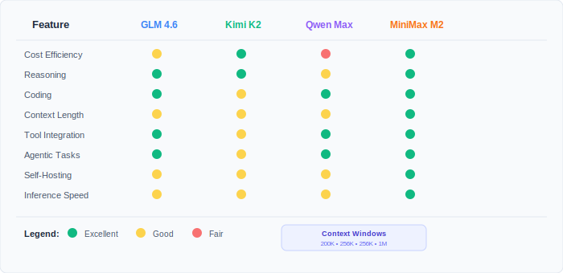

Are you tired of paying premium prices for Claude Sonnet 4.5 while working on coding projects? You're not alone. Many developers are seeking powerful yet affordable alternatives that can deliver comparable performance without breaking the bank. The good news? The open source AI landscape has evolved dramatically by 2026, offering exceptional models that rival Claude's capabilities at significantly lower costs.

In this comprehensive guide, we'll explore five outstanding open source language models that can effectively replace Claude Sonnet 4.5 for coding tasks: **GLM-4.7**, **Kimi K2-0905**, **Qwen-Max**, **MiniMax M2.1**, and **Devstral 2**. These latest iterations offer impressive performance in reasoning, code generation, and agentic tasks while being much more budget-friendly.

<Notice type="info" title="Cost Comparison Overview">

While Claude Sonnet 4.5 costs $3-15 per million tokens, these open source alternatives range from $0.088 to $1.20 per million input tokens, offering savings of up to 99%.

</Notice>

## Why Consider Open Source LLM Alternatives?

The landscape of artificial intelligence has evolved rapidly, and open source models are no longer second-class citizens. Here's why making the switch makes sense:

<ListCheck>

- **Cost Efficiency**: Dramatic reduction in API costs compared to proprietary models
- **Transparency**: Open source nature allows for better understanding and customization
- **Performance Parity**: Modern open source models match or exceed Claude Sonnet 4.5 in many tasks
- **Flexibility**: Multiple deployment options including self-hosting and various API providers
- **Community Support**: Active development communities ensuring continuous improvements

</ListCheck>

### Key Performance Areas to Consider

When evaluating LLM alternatives, several critical factors determine their effectiveness:

- **Coding Capabilities**: How well the model generates, debugs, and explains code
- **Reasoning Performance**: Complex problem-solving and logical thinking abilities
- **Context Length**: Amount of information the model can process simultaneously
- **Agentic Tasks**: Tool usage, function calling, and multi-step task execution
- **Cost-Performance Ratio**: Value delivered per dollar spent

## What's New with Claude Sonnet 4.5?

Before diving into the alternatives, it's important to understand what Claude Sonnet 4.5 brings to the table. Released in early 2025, **[Claude Sonnet 4.5](https://www.anthropic.com/news/claude-sonnet-4-5)** represents Anthropic's latest flagship model with significant improvements:

<ListCheck>

- **Best Coding Model**: State-of-the-art on SWE-bench Verified (77.2%), maintaining focus for 30+ hours on complex tasks
- **Computer Use Leader**: 61.4% on OSWorld benchmark, up from 42.2% with Sonnet 4
- **Enhanced Reasoning**: Substantial gains in reasoning and math capabilities
- **Improved Alignment**: Most aligned frontier model with reduced sycophancy, deception, and power-seeking behaviors
- **Premium Pricing**: $3 per million input tokens, $15 per million output tokens

</ListCheck>

While Claude Sonnet 4.5 is undeniably powerful, its premium pricing makes it cost-prohibitive for many developers and businesses. This is where open source alternatives shine, offering comparable performance at a fraction of the cost.

## 1. GLM-4.7: The Thinking Agentic Powerhouse

**[GLM-4.7](https://docs.z.ai/guides/llm/glm-4.7)** is the latest evolution in the GLM series, bringing significant improvements in coding, reasoning, and agentic capabilities. It introduces "Interleaved Thinking" and "Preserved Thinking" modes, allowing the model to think before acting and retain context across complex multi-step tasks.

### Technical Specifications

| Feature               | GLM-4.7                          |
| --------------------- | -------------------------------- |
| **Total Parameters**  | 357B (MoE)                       |
| **Active Parameters** | 32B                              |
| **Context Length**    | 200K tokens                      |
| **Architecture**      | MoE                              |
| **Input Cost**        | $0.20/M tokens                   |
| **Output Cost**       | $0.20/M tokens                   |
| **Release Date**      | December 2025                    |

<Button
  text="GLM-4.7 Cheap Coding Plans"
  link="https://z.ai/subscribe?ic=NKNUNYDRZT"
  size="lg"
  color="blue"
  variant="solid"
/>

<YouTubeEmbed
  url="https://www.youtube.com/embed/Q3zX5z2cQ"
  label="GLM-4.7 Testing"
/>

### Key Strengths

<ListCheck>

- **Interleaved & Preserved Thinking**: Thinks before answering and retains reasoning across turns for stable long-horizon tasks
- **Superior Coding Performance**: 73.8% on SWE-bench Verified and 41% on Terminal Bench 2.0
- **Vibe Coding**: Generates cleaner, more modern webpages and slides with accurate layouts
- **Advanced Reasoning**: Significant boost in math and logic, scoring 42.8% on HLE (Humanity's Last Exam)
- **Stronger Agent Capabilities**: Better performance in tool use and search-based agents with improved framework integration
- **Turn-level Control**: Enable or disable thinking mode per turn to balance latency and accuracy

</ListCheck>

### Performance Highlights

GLM-4.7 demonstrates exceptional capabilities across multiple domains:

- **Coding Performance**: 73.8% on SWE-bench Verified, 84.9% on LiveCodeBench v6
- **Reasoning Tasks**: Massive gains in HLE (+12.4%) and math benchmarks
- **Agentic Tasks**: Competitive performance with leading models like Claude Sonnet 4.5 and DeepSeek-V3.2
- **Real-World Applications**: Proven superior performance in production coding environments with Claude Code, Cline, and Roo Code

<Button
  text="Try GLM-4.7 "
  url="https://z.ai/subscribe?ic=NKNUNYDRZT"
  size="lg"
  color="blue"
  variant="solid"
  icon="arrow-right"
  iconPosition="right"
/>

<Notice type="info" title="GLM Coding Plans">

For dedicated coding use, Z.AI offers specialized [GLM Coding Plans](https://z.ai/subscribe?ic=NKNUNYDRZT) with optimized pricing and features for developers.

</Notice>

### Best Use Cases

GLM-4.7 excels in scenarios requiring:

- **Complex Agentic Tasks**: Long-context operations with preserved thinking across turns
- **Production Coding**: Full-stack development with superior real-world performance
- **Frontend Development**: Creating visually polished, modern web interfaces ("Vibe Coding")
- **Search-Based Agents**: Enhanced tool use and search capabilities
- **Multi-Step Workflows**: Complex reasoning with tool integration and thinking process

## 2. Kimi K2-0905: The Enhanced Coding Specialist

**[Kimi K2-0905](https://kimi-k2.org/blog/09-k2-0905-release-en)** is the latest iteration of the Kimi K2 model, featuring significant enhancements in coding capabilities, Claude Code compatibility, and an expanded 256K context window. This update brings "SUPER SUPER SUPER" hard coding improvements while maintaining the beloved K2 personality.

### Technical Specifications

| Feature                | Specification             |
| ---------------------- | ------------------------- |
| **Total Parameters**   | 1 Trillion                |
| **Active Parameters**  | 32 Billion                |
| **Context Length**     | 256K tokens (2x increase) |
| **Architecture**       | Mixture-of-Experts (MoE)  |
| **Input Cost**         | $0.088/M tokens           |
| **Output Cost**        | $0.088/M tokens           |
| **Release Date**       | September 2025            |
| **Training Optimizer** | MuonClip                  |

<YouTubeEmbed
  url="https://www.youtube.com/embed/ZOgvb9klsHw"
  label="Kimi K2-0905 Testing"
/>

### Outstanding Features

<ListCheck>

- **Extended Context Window**: 256K tokens (doubled from 128K) for entire codebase understanding
- **Seamless Claude Code Compatibility**: Zero friction integration with improved tool calling and file handling
- **Enhanced Frontend Capabilities**: Generates beautiful, responsive web interfaces with professional charts and data visualization
- **Superior Coding Performance**: "SUPER SUPER SUPER" hard improvements in coding capabilities
- **Cost-Effective**: Still the most affordable option at $0.088 per million tokens
- **Reduced Hallucination**: Improved stability with more factually accurate responses
- **Maintained Personality**: Beloved K2-0711 personality and style preserved

</ListCheck>

### Performance Metrics

Kimi K2-0905 delivers impressive results across various benchmarks:

- **Coding Tasks**: Highly competitive performance on LiveCodeBench and SWE-bench, close to Qwen3 Coder
- **Context Handling**: 256K tokens enables processing entire medium-sized repositories in a single session
- **Frontend Development**: Exceptional UI generation with modern CSS techniques and framework expertise
- **Tool Integration**: Reliable API interactions with improved success rates
- **Creative Writing**: Maintained SOTA creative capabilities with reduced hallucination

<Notice type="success" title="Best Value Proposition">

Kimi K2-0905 offers the best price-performance ratio in our comparison, delivering enterprise-grade capabilities with 256K context at just $0.088 per million tokens.

</Notice>

<Button
  text="Access Kimi K2-0905 on OpenRouter"
  url="https://openrouter.ai/moonshotai/kimi-k2-0905"
  size="lg"
  color="green"
  variant="solid"
  icon="arrow-right"
  iconPosition="right"
/>

### Optimal Applications

Kimi K2-0905 is particularly well-suited for:

- **Large Codebase Analysis**: Process entire repositories with 256K context window
- **Frontend Development**: Create stunning, responsive web interfaces with beautiful UI
- **Claude Code Integration**: Seamless workflow with zero friction switching
- **Budget-Conscious Projects**: Maximum capability per dollar spent
- **Extended Coding Sessions**: Maintain conversation history for long development workflows

## 3. Qwen-Max: The Flagship Powerhouse

**[Qwen-Max](https://qwen.ai/apiplatform)** is Qwen's flagship model, representing the pinnacle of their language model development. As part of the Qwen3 series, it delivers exceptional performance across coding, reasoning, and general tasks with a massive 256K context window.

### Technical Specifications

| Feature               | Specification        |
| --------------------- | -------------------- |
| **Model Family**      | Qwen3                |
| **Context Length**    | 256K tokens          |
| **Architecture**      | Advanced Transformer |
| **Input Cost**        | $1.20/M tokens       |
| **Output Cost**       | $6.00/M tokens       |
| **Release Date**      | September 2025       |
| **API Compatibility** | OpenAI format        |

<YouTubeEmbed
  url="https://www.youtube.com/embed/RAPQd0nBg3g"
  label="Qwen-Max Testing"
/>

### Exceptional Capabilities

<ListCheck>

- **Flagship Performance**: Qwen's most capable model with state-of-the-art results
- **Extended Context**: 256K token window for comprehensive codebase analysis
- **Comprehensive Benchmarks**: Strong performance across MMLU, MMMU, and HellaSwag
- **Multi-Domain Excellence**: Superior performance in coding, reasoning, and general tasks
- **OpenAI Compatible**: Easy integration with existing OpenAI-based workflows
- **Production Ready**: Proven reliability in enterprise applications

</ListCheck>

### Performance Excellence

Qwen-Max sets new standards across multiple benchmarks:

- **Comprehensive Evaluation**: Strong scores on MMLU, MMMU, and HellaSwag benchmarks
- **Coding Capabilities**: Competitive performance on coding-specific evaluations
- **Long-Context Tasks**: Excellent handling of large codebases with 256K context
- **Real-World Applications**: Proven effectiveness in production environments
- **Multi-Task Performance**: Balanced excellence across diverse task types

### Development Ecosystem

<Notice type="info" title="API Compatibility">

Qwen-Max uses OpenAI-compatible API format, allowing developers to integrate it seamlessly by simply updating the API key and base URL.

</Notice>

<Button
  text="Explore Qwen-Max on OpenRouter"
  url="https://openrouter.ai/qwen/qwen-max"
  size="lg"
  color="purple"
  variant="solid"
  icon="arrow-right"
  iconPosition="right"
/>

### Prime Use Cases

Qwen-Max excels in:

- **Enterprise Applications**: Production-grade AI for business-critical tasks
- **Full-Stack Development**: Comprehensive coding across multiple languages and frameworks
- **Large-Scale Analysis**: 256K context for repository-wide operations
- **Multi-Domain Tasks**: Balanced performance across coding, reasoning, and general queries
- **API Integration**: Easy integration with OpenAI-compatible systems

## 4. MiniMax M2.1: The Efficient Agentic Champion

**[MiniMax M2.1](https://www.minimax.io/news/minimax-m21)** is a significant upgrade built for real-world complex tasks. It significantly enhances multi-language programming capabilities and introduces "Vibe Coding" for superior UI/UX generation. With 10B active parameters, it remains highly efficient while delivering frontier-level performance in agentic workflows.

### Technical Specifications

| Feature               | MiniMax M2.1                      |
| --------------------- | --------------------------------- |
| **Total Parameters**  | 230B                              |
| **Active Parameters** | 10B                               |
| **Context Length**    | 200K tokens                       |
| **Architecture**      | Mixture-of-Experts (MoE)          |
| **Input Cost**        | $0.30/M tokens                    |
| **Output Cost**       | $1.20/M tokens                    |
| **Release Date**      | December 23, 2025                 |

<Button
  text="MiniMax M2.1 Coding Plans"
  link="https://platform.minimax.io/subscribe/coding-plan"
  size="lg"
  color="purple"
  variant="solid"
/>

### Outstanding Features

<ListCheck>

- **Exceptional Multi-Language Support**: Systematically enhanced capabilities in Rust, Java, Go, C++, and more
- **Vibe Coding**: Generates superior Web and App UIs, including 3D scenes and complex interactions
- **Efficient & Concise**: Faster response speed and lower token consumption compared to M2
- **Agent Scaffolding**: Optimized for Claude Code, Droid, Cline, Roo Code, and other agent frameworks
- **Full-Stack Capability**: Strong performance in the new VIBE benchmark (Visual & Interactive Benchmark for Execution)
- **Open Source Weights**: Fully open source for local deployment (vLLM, SGLang)
- **Cost-Effective**: High performance at ~10% of premium model costs

</ListCheck>

### Performance Highlights

MiniMax M2.1 demonstrates exceptional capabilities across multiple domains:

- **SWE-bench Verified**: 74.0% score, demonstrating strong real-world engineering capability
- **VIBE Benchmark**: Average score of 88.6, excelling in Web (91.5) and Android (89.7) development
- **SWE-Multilingual**: 72.5% score, showing prowess in non-Python languages
- **Agent Integration**: Consistent stability and success in complex tool-use scenarios
- **Real-World Tasks**: Proven effectiveness in end-to-end office automation and coding tasks

<Notice type="success" title="Ultimate Cost-Effectiveness">

MiniMax M2.1 delivers approximately 10% of Claude Sonnet's price while maintaining frontier-level performance—making it one of the most cost-effective options for production AI coding.

</Notice>

<Button
  text="Try MiniMax M2.1"
  url="https://agent.minimax.io"
  size="lg"
  color="purple"
  variant="outline"
  icon="arrow-right"
  iconPosition="right"
/>

<Button
  text="Access MiniMax M2.1 API"
  url="https://platform.minimax.io/docs/api-reference/text-anthropic-api"
  size="lg"
  color="purple"
  variant="outline"
  icon="arrow-right"
  iconPosition="right"
/>

### Best Use Cases

MiniMax M2.1 excels in scenarios requiring:

- **Complex Agentic Workflows**: Long-horizon toolchains across shell, browser, retrieval, and code runners
- **Multi-Language Projects**: Robust support for Rust, Java, C++, and Go
- **Interactive Coding Assistants**: Fast inference for responsive IDE integration with Claude Code and Cursor
- **UI/UX Development**: Creating high-quality, interactive web and mobile interfaces (Vibe Coding)
- **Self-Hosting**: Open source weights enable on-premise deployment for enterprise security

## 5. Devstral 2: The Dense Agentic Workhorse

**[Devstral 2](https://mistral.ai/news/devstral-2-vibe-cli)** is Mistral's latest 123B parameter model, explicitly designed for agentic software engineering. Unlike the MoE architectures of its competitors, it uses a dense transformer architecture and comes with a dedicated CLI agent, Mistral Vibe, for end-to-end automation.

### Technical Specifications

| Feature               | Devstral 2                        |
| --------------------- | --------------------------------- |
| **Total Parameters**  | 123B (Dense)                      |
| **Active Parameters** | 123B                              |
| **Context Length**    | 256K tokens                       |
| **Architecture**      | Dense Transformer                 |
| **Input Cost**        | $0.40/M tokens                    |
| **Output Cost**       | $2.00/M tokens                    |
| **Release Date**      | December 2025                     |

<Button
  text="Devstral 2 Vibe CLI"
  link="https://mistral.ai/news/devstral-2-vibe-cli"
  size="lg"
  color="blue"
  variant="solid"
/>

### Outstanding Features

<ListCheck>

- **Dense Architecture**: Single coherent knowledge base for better repository-scale reasoning compared to MoE models
- **Agentic Focus**: Tuned specifically for Vibe CLI to handle multi-file edits, git operations, and test loops
- **Devstral Small 2**: A 24B companion model capable of running locally on consumer hardware (Apache 2.0 license)
- **Competitive Performance**: 72.2% on SWE-bench Verified, outperforming many larger models
- **Mistral Vibe CLI**: A native, open-source terminal assistant for autonomous coding tasks

</ListCheck>

### Performance Highlights

Devstral 2 excels in real-world engineering tasks:

- **SWE-bench Verified**: 72.2% score, placing it at the frontier of open-weight models
- **Human Evaluation**: Preferred over DeepSeek V3.2 in Cline-based coding tasks (42.8% win rate)
- **Local Deployment**: Devstral Small 2 (24B) offers strong performance (68.0% SWE-bench) for local use
- **Cost Efficiency**: Up to 7x more cost-efficient than Claude Sonnet at real-world tasks

<Notice type="success" title="Local Agent Capability">

Devstral Small 2 (24B) enables a fully local agent experience on high-end consumer GPUs, bringing state-of-the-art coding assistance to private environments.

</Notice>

<Button
  text="Try Devstral 2"
  url="https://console.mistral.ai/"
  size="lg"
  color="blue"
  variant="outline"
  icon="arrow-right"
  iconPosition="right"
/>

### Best Use Cases

Devstral 2 is ideal for:

- **Agentic Workflows**: Using Mistral Vibe CLI for autonomous terminal-based coding
- **Repository Refactoring**: Dense architecture provides superior coherence for large-scale changes
- **Local Development**: Devstral Small 2 allows for powerful coding assistance on local hardware
- **Secure Environments**: Open weights and local deployment options for strict data privacy

## Comprehensive Comparison: Finding Your Perfect Match

To help you make an informed decision, here's a detailed comparison of all five models:

### Performance Comparison Table

| Benchmark                     | GLM-4.7   | Kimi K2-0905 | Qwen-Max | MiniMax M2.1 | Devstral 2 | Claude Sonnet 4.5 |
| ----------------------------- | --------- | ------------ | -------- | ------------ | ---------- | ----------------- |
| **SWE-bench Verified**        | 73.8%     | Competitive  | Strong   | 74.0%        | 72.2%      | 77.2%             |
| **LiveCodeBench v6**          | 84.9%     | Competitive  | Strong   | Strong       | Strong     | 84.5%             |
| **Context Window**            | 200K      | 256K         | 256K     | 200K         | 256K       | 200K              |
| **Frontend Generation**       | Excellent | Excellent    | Strong   | Excellent    | Good       | Good              |
| **Cost per 1M Input Tokens**  | $0.20     | $0.088       | $1.20    | $0.30        | $0.40      | $3.00             |
| **Cost per 1M Output Tokens** | $0.20     | $0.088       | $6.00    | $1.20        | $2.00      | $15.00            |

### Feature Comparison Matrix



## How to Get Started: Implementation Guide

### Step 1: Choose Your Access Method

Each model offers multiple access options:

<ListCheck>

- **OpenRouter**: Unified API access to all models with competitive pricing
- **Direct API Access**: Provider-specific endpoints for optimized performance
- **Self-Hosting**: Deploy models on your own infrastructure for maximum control
- **Development Tools**: Integration with coding assistants and IDEs

</ListCheck>

### Step 2: Set Up Your Environment

For OpenRouter access (recommended for beginners):

```bash
# Install OpenAI SDK
pip install openai

# Set environment variables
export OPENROUTER_API_KEY="your_api_key_here"
export OPENROUTER_BASE_URL="https://openrouter.ai/api/v1"
```

### Step 3: Basic Implementation Example

```python
import openai

client = openai.OpenAI(
    base_url="https://openrouter.ai/api/v1",
    api_key="your_openrouter_api_key"
)

# Use GLM-4.7 for agentic tasks
response = client.chat.completions.create(
    model="z-ai/glm-4.7",
    messages=[
        {"role": "system", "content": "You are a helpful coding assistant."},
        {"role": "user", "content": "Create a Python web scraper for product prices"}
    ]
)

print(response.choices[0].message.content)
```

### Step 4: Optimize for Your Use Case

<Notice type="warning" title="Context Length Considerations">

Kimi K2-0905, Qwen-Max, and Devstral 2 lead with 256K tokens, while GLM-4.7 and MiniMax M2.1 support 200K tokens—all excellent for complex coding tasks.

</Notice>

## Cost Analysis: Maximizing Your Budget

Understanding the true cost implications helps optimize your AI spending:

### Monthly Cost Comparison (Based on 10M tokens usage)

| Model                 | Input Cost | Output Cost | Total Monthly Cost | Savings vs Claude Sonnet 4.5 |
| --------------------- | ---------- | ----------- | ------------------ | ---------------------------- |
| **Claude Sonnet 4.5** | $30.00     | $150.00     | $180.00            | Baseline                     |
| **GLM-4.7**           | $2.00      | $2.00       | $4.00              | 97.8% savings                |
| **Kimi K2-0905**      | $0.88      | $0.88       | $1.76              | 99.0% savings                |
| **Qwen-Max**          | $12.00     | $60.00      | $72.00             | 60.0% savings                |
| **MiniMax M2.1**      | $3.00      | $12.00      | $15.00             | 91.7% savings                |
| **Devstral 2**        | $4.00      | $20.00      | $24.00             | 86.7% savings                |

### ROI Calculation

The cost savings enable significant business advantages:

- **Increased Experimentation**: Lower costs allow for more testing and iteration
- **Scaled Deployment**: Run AI assistance across entire development teams
- **Enhanced Features**: Implement AI in more areas of your application
- **Competitive Advantage**: Faster development cycles with AI assistance

## Best Practices and Tips

### Optimization Strategies

<ListCheck>

- **Model Selection**: Choose based on your primary use case (reasoning vs. coding vs. cost)
- **Context Management**: Utilize long context windows efficiently for better results
- **Prompt Engineering**: Invest time in crafting effective prompts for each model
- **Batch Processing**: Combine multiple requests to reduce overhead costs
- **Performance Monitoring**: Track metrics to ensure optimal model performance

</ListCheck>

### Common Pitfalls to Avoid

- **Over-Engineering**: Don't use the most expensive model for simple tasks
- **Inadequate Testing**: Always validate model outputs in your specific domain
- **Context Overflow**: Monitor token usage to avoid unexpected costs
- **Single Model Dependency**: Consider using different models for different tasks

## The Future of Open Source LLMs

The trajectory of open source language models indicates continued improvement and specialization:

### Emerging Trends

- **Specialized Models**: More domain-specific models like Qwen3 Coder
- **Improved Efficiency**: Better performance per parameter and per dollar
- **Enhanced Integration**: Seamless workflow integration and tool compatibility
- **Community Innovation**: Rapid development cycles driven by open source collaboration

### What's Next?

Expect to see:

- **Multimodal Capabilities**: Integration of vision and audio processing
- **Reduced Latency**: Faster inference times for real-time applications
- **Better Reasoning**: Enhanced logical thinking and problem-solving abilities
- **Improved Code Generation**: More accurate and context-aware programming assistance

## Conclusion: Making the Right Choice

The decision to replace Claude Sonnet 4.5 with an open source alternative depends on your specific requirements, budget constraints, and performance expectations. Here's our recommendation framework:

### Choose GLM-4.7 If You Need:

- **Reasoning First**: Interleaved Thinking for complex problem solving
- **Real-World Coding Excellence**: Superior performance in Claude Code, Cline, and other tools
- **Vibe Coding**: Enhanced capability for generating polished web interfaces
- **Balanced Cost-Performance**: Excellent capabilities at $0.20 per million tokens
- **Agent Frameworks**: Strong tool use and search-based agent capabilities

<Button
  text="Try GLM-4.7 "
  url="https://z.ai/subscribe?ic=NKNUNYDRZT"
  size="lg"
  color="blue"
  variant="solid"
  icon="arrow-right"
  iconPosition="right"
/>
### Choose Kimi K2-0905 If You Prioritize:

- **Maximum Cost Efficiency**: Best value at $0.088 per million tokens
- **Largest Context Window**: 256K tokens for entire repository analysis
- **Claude Code Compatibility**: Seamless integration with zero friction
- **Frontend Excellence**: Beautiful UI generation with professional charts
- **Budget Constraints**: Enterprise-grade AI on a startup budget

<Button
  text="Try Kimi K2-0905"
  url="https://openrouter.ai/moonshotai/kimi-k2-0905"
  size="lg"
  color="green"
  variant="solid"
  icon="arrow-right"
  iconPosition="right"
/>

### Choose Qwen-Max If You Focus On:

- **Flagship Performance**: Qwen's most capable model with comprehensive benchmarks
- **Enterprise Applications**: Production-ready reliability for business-critical tasks
- **OpenAI Compatibility**: Easy integration with existing OpenAI-based systems
- **Multi-Domain Excellence**: Balanced performance across coding, reasoning, and general tasks
- **Long Context**: 256K tokens for large-scale codebase operations

<Button
  text="Explore Qwen-Max"
  url="https://openrouter.ai/qwen/qwen-max"
  size="lg"
  color="purple"
  variant="solid"
  icon="arrow-right"
  iconPosition="right"
/>

### Choose MiniMax M2.1 If You Want:

- **Multi-Language Expertise**: Best-in-class support for Rust, Java, C++, and Go
- **Visual Excellence**: Superior UI/UX generation with Vibe Coding
- **Advanced Agentic Tasks**: Complex tool-calling with shell, browser, and code runners
- **Self-Hosting Option**: Open source weights for on-premise deployment
- **Efficient Inference**: 10B activations enable responsive, real-time coding assistance

<Button
  text="Try MiniMax M2.1"
  url="https://platform.minimax.io/subscribe/coding-plan"
  size="lg"
  color="purple"
  variant="solid"
  icon="arrow-right"
  iconPosition="right"
/>

### Choose Devstral 2 If You Need:

- **Local Deployment**: High-performance small model (24B) for local hardware
- **Dense Architecture**: Coherent reasoning for whole-repository tasks
- **Agentic Workflow**: Native integration with Mistral Vibe CLI
- **Strict Data Privacy**: Open weights and local execution options

<Button
  text="Try Devstral 2"
  url="https://console.mistral.ai/"
  size="lg"
  color="blue"
  variant="solid"
  icon="arrow-right"
  iconPosition="right"
/>

The open source AI revolution has democratized access to powerful language models, offering developers and businesses unprecedented opportunities to leverage AI capabilities without breaking the bank. Whether you choose GLM-4.7's enhanced agentic capabilities, Kimi K2-0905's unbeatable cost efficiency with 256K context, Qwen-Max's flagship performance, MiniMax M2.1's efficient multi-language capabilities, or Devstral 2's dense agentic power, you're guaranteed significant savings while maintaining, or even improving, your AI-assisted development capabilities.

Start your journey with one of these exceptional models today and experience the future of affordable, powerful AI assistance in your coding projects.

<Notice type="success" title="Ready to Get Started?">

All five models are available through various providers with competitive pricing and easy integration. Sign up today and start saving on your AI costs while boosting your development productivity.

</Notice>
