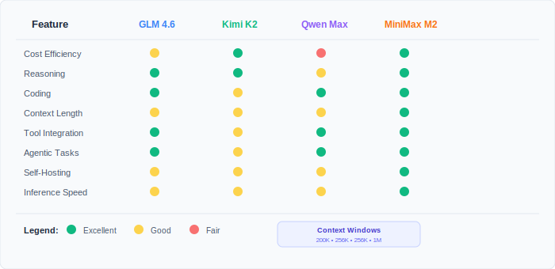

Claude Opus 4.8, Claude Fable 5, and GPT-5.5 are the latest proprietary models, and they are expensive. Opus 4.8 is $5 per million input tokens and $25 per million output. Fable 5, Anthropic's new Mythos-class model, is $10 and $50. GPT-5.5 is $5 and $30. For developers running coding agents or doing daily development work, those prices add up fast.

The open source landscape has kept pace. Six models now handle coding, reasoning, and agent tasks at a fraction of what Opus 4.8, Fable 5, or GPT-5.5 costs: GLM-5.2, Kimi K2.6, Qwen 3.6 Plus, MiniMax M3, MiMo V2.5 Pro, and Mistral Medium 3.5. I have been testing all of them alongside the proprietary options, and the gap is smaller than you would expect.

<Notice type="info" title="Cost Comparison Overview">

Claude Opus 4.8 costs $5-25 per million tokens. Claude Fable 5 costs $10-50. GPT-5.5 costs $5-30. These open source alternatives range from $0.30 to $1.50 per million input tokens, offering savings of 70-98%.

</Notice>

## Why Consider Open Source LLM Alternatives?

Open source models have improved a lot and can compete with proprietary options. Here's why they're worth considering:

<ListCheck>

- **Cost Efficiency**: API costs are much lower than proprietary models
- **Transparency**: Open source code lets you understand and modify the model
- **Performance Parity**: Many open source models match or beat Claude Opus 4.8 on various tasks
- **Flexibility**: You can self-host or use various API providers
- **Community Support**: Active development teams keep improving the models

</ListCheck>

### Key Performance Areas to Consider

When evaluating LLM alternatives, several factors matter:

- **Coding Capabilities**: How well the model generates, debugs, and explains code
- **Reasoning Performance**: How well it handles complex problems and logical thinking
- **Context Length**: How much information the model can process at once
- **Agentic Tasks**: Tool usage, function calling, and multi-step task execution
- **Cost-Performance Ratio**: How much value you get per dollar spent

## What's New with Claude Opus 4.8, Fable 5, and GPT-5.5?

Before looking at alternatives, it helps to understand what the latest proprietary models do. Anthropic released **[Claude Opus 4.8](https://www.anthropic.com/news/claude-opus-4-8)** on May 28, 2026, and **[Claude Fable 5](https://www.anthropic.com/news/claude-fable-5-mythos-5)** on June 9, 2026. OpenAI released **[GPT-5.5](https://openai.com/index/introducing-gpt-5-5/)** on April 23, 2026.

### Claude Opus 4.8

<ListCheck>

- **Modest but tangible improvement over Opus 4.8**: Better performance across coding, agentic tasks, and professional work
- **4x fewer code flaws**: Around four times less likely than Opus 4.8 to let flaws in code it has written pass unremarked
- **Dynamic Workflows**: New feature in Claude Code that runs hundreds of parallel subagents for large-scale tasks like codebase-wide migrations
- **Effort control**: Users can choose how much effort Claude puts into a response, from fast (cheaper) to max (better results)
- **Fast mode 3x cheaper**: Opus 4.8 fast mode at $10/$50 per million tokens, down from previous fast mode pricing
- **Pricing**: $5 per million input tokens, $25 per million output tokens (same as Opus 4.8)

</ListCheck>

### Claude Fable 5

<ListCheck>

- **Mythos-class model**: Anthropic's most powerful model ever made generally available, exceeding all previous Claude models on tested benchmarks
- **State-of-the-art coding**: Highest score on FrontierCode, Stripe reports compressing months of engineering into days on 50-million-line codebases
- **Built-in safety safeguards**: Falls back to Opus 4.8 on cybersecurity, biology/chemistry, and distillation queries to prevent misuse
- **Vision breakthroughs**: Beat Pokemon FireRed using only raw game screenshots with no extra tools
- **Memory and long-context**: Stays focused across millions of tokens, improves outputs using its own notes
- **Pricing**: $10 per million input tokens, $50 per million output tokens

</ListCheck>

### GPT-5.5

<ListCheck>

- **OpenAI's smartest model**: Fully retrained, not just a fine-tune of GPT-5.4
- **1M token context**: MRCR v2 at 1M tokens jumps from 36.6% (GPT-5.4) to 74.0%
- **Improved coding and research**: Built for complex tasks across tools
- **Pricing**: $5 per million input tokens, $30 per million output tokens (double GPT-5.4)

</ListCheck>

All three are capable, but the pricing puts them out of reach for continuous use. Running a coding agent 24/7 on Opus 4.8, Fable 5, or GPT-5.5 costs hundreds of dollars a month. The open source models below do comparable work for $10-40/month.

## 1. GLM-5.2: The strongest overall for coding

**[GLM-5.2](https://z.ai/blog/glm-5.2)** is Z.AI's latest flagship, released June 16, 2026, and the strongest open source model on this list. It scores 62.1% on SWE-Bench Pro, ahead of GPT-5.5 and Gemini 3.1 Pro. On Terminal-Bench 2.1, it hits 81.0%, within a few points of Claude Opus 4.8's 85.0%. GLM-5.2 introduces a 1M token context window and effort level control, letting you balance capability against speed and cost.

### Technical Specifications

| Feature               | GLM-5.2                          |
| --------------------- | -------------------------------- |
| **Parameters**        | 753B                             |
| **Context Length**    | 1M tokens                        |
| **Max Output**        | 128K tokens                      |
| **SWE-Bench Pro**     | 62.1%                            |
| **Terminal-Bench 2.1**| 81.0%                            |
| **Input Cost**        | $1.40/M tokens                   |
| **Output Cost**       | $4.40/M tokens                   |
| **License**           | Open source                      |

<Button
  text="GLM-5.2 Announcement"
  link="https://z.ai/blog/glm-5.2"
  size="lg"
  color="blue"
  variant="solid"
/>

### Key Strengths

<ListCheck>

- **62.1% SWE-Bench Pro**: The highest open source score, ahead of GPT-5.5 and Gemini 3.1 Pro
- **81.0% Terminal-Bench 2.1**: Within 4 points of Claude Opus 4.8, the strongest open source result
- **1M token context**: Expanded from 200K, with IndexShare reducing compute cost for long contexts
- **Effort level control**: Choose between High and Max effort to balance capability vs. cost
- **Speculative decoding**: 20% improvement in acceptance length for faster inference
- **Near-zero hallucinations**: Reports near-zero hallucination rates, important for running commands on live servers

</ListCheck>

### Performance Highlights

- **Coding**: 62.1% on SWE-Bench Pro, strongest open source model
- **Terminal-Bench 2.1**: 81.0%, trails only Claude Opus 4.8 (85.0%) among all models
- **FrontierSWE**: 74.4%, close to Opus 4.8's 75.1%
- **Cost**: $1.40/M input is $3.60 cheaper per million than Opus 4.8

<Button
  text="Try GLM-5.2"
  url="https://z.ai/subscribe?ic=NKNUNYDRZT"
  size="lg"
  color="blue"
  variant="solid"
  icon="arrow-right"
  iconPosition="right"
/>

<Notice type="info" title="GLM Coding Plans">

Z.AI offers [GLM Coding Plans](https://z.ai/subscribe?ic=NKNUNYDRZT) starting at $18/month for the Lite tier. GLM-5.2 consumes quota at 3× during peak hours and 2× during off-peak hours. Through September 2026, off-peak usage is billed at 1×.

</Notice>

### Best Use Cases

GLM-5.2 works well for:

- **Long-running agent tasks**: 1M context and sustained execution for complex multi-step planning
- **Production coding**: Full-stack development where you need something close to Opus 4.8
- **Enterprise work**: Low hallucination rate matters when mistakes are expensive
- **Tool-heavy workflows**: Reasoning plus tool integration and search
- **Effort-sensitive tasks**: Use High effort for quick responses, Max for complex reasoning

## 2. Kimi K2.6: Agent swarm for complex tasks

**[Kimi K2.6](https://www.kimi.com/ai-models/kimi-k2-6)** is Moonshot AI's strongest open-source model. It has a built-in agent swarm that spins up hundreds of parallel sub-agents to break down and tackle complex tasks on its own. You don't have to decompose the work yourself — K2.6 figures it out.

### Technical Specifications

| Feature                | Specification             |
| ---------------------- | ------------------------- |
| **Total Parameters**   | 1 Trillion                |
| **Active Parameters**  | 32 Billion                |
| **Context Length**     | 262K tokens               |
| **Architecture**       | Mixture-of-Experts (MoE)  |
| **AA Intelligence**    | 53.9 (better than 98%)    |
| **AA Agentic**         | 66.0 (better than 96%)    |
| **Input Cost**         | $0.75/M tokens            |
| **Output Cost**        | $3.50/M tokens            |

### Outstanding Features

<ListCheck>

- **Agent swarm**: Spins up hundreds of parallel sub-agents for complex task decomposition
- **91.1% on GPQA Diamond**: Graduate-level scientific reasoning, the highest on this list
- **Multi-language coding**: Python, Rust, and Go across long-horizon tasks
- **AA Intelligence 53.9**: Better than 98% of models tested
- **Kimi Code subscription**: Managed experience with K2.6 baked in, plans from $15/month

</ListCheck>

### Benchmark results

- **AA Intelligence Index**: 53.9 (better than 98% of models)
- **AA Coding Index**: 47.1 (better than 95% of models)
- **AA Agentic Index**: 66.0 (better than 96% of models)
- **GPQA Diamond**: 91.1% for graduate-level scientific reasoning

<Button
  text="Kimi K2.6 Model Page"
  url="https://www.kimi.com/ai-models/kimi-k2-6"
  size="lg"
  color="green"
  variant="solid"
  icon="arrow-right"
  iconPosition="right"
/>

### When to use it

- **Complex multi-step tasks**: Agent swarm decomposes and parallelizes work automatically
- **Scientific reasoning**: 91.1% on GPQA Diamond
- **Coding across languages**: Python, Rust, Go with long-horizon task support
- **Tight budgets**: $0.75/M input is significantly cheaper than Opus 4.8's $5

## 3. Qwen 3.6 Plus: Best for frontend and vibe coding

**[Qwen 3.6 Plus](https://qwen.ai/apiplatform)** is Alibaba's latest in the Qwen 3.6 series. It handles coding, reasoning, and general tasks with a 256K context window. Where it stands out is frontend work and "vibe coding" — generating responsive interfaces, design-heavy pages, and UI components.

### Technical Specifications

| Feature               | Specification        |
| --------------------- | -------------------- |
| **Context Length**    | 256K tokens          |
| **Architecture**      | Advanced Transformer |
| **Input Cost**        | $0.33/M tokens       |
| **Output Cost**       | $1.33/M tokens       |
| **API Compatibility** | OpenAI format        |

### What it offers

<ListCheck>

- **Best frontend model**: Strong at generating responsive interfaces, CSS, and UI components
- **256K context**: Fits large codebases in a single session
- **OpenAI-compatible API**: Swap your API key and base URL, done
- **Vibe coding**: Popular with developers using AI for rapid prototyping and design work
- **Very cheap**: $0.33/M input tokens, less than a tenth of Opus 4.8

</ListCheck>

### When to use it

- **Frontend work**: Responsive interfaces, CSS, design-heavy pages
- **Rapid prototyping**: Quick iterations on UI and layout
- **Budget coding**: $0.33/M input is one of the cheapest on this list
- **Existing OpenAI setups**: Drop-in replacement with API key swap
- **Large codebases**: 256K context for repository-wide analysis

## 4. MiniMax M3: The budget pick

**[MiniMax M3](https://go.bitdoze.com/minimax)** is the latest flagship from MiniMax, released June 1, 2026. It is the first open-weight model to combine frontier coding, a 1-million-token context window, and native multimodality (image and video input). Built on MiniMax Sparse Attention (MSA), it cuts per-token compute at 1M context to one-twentieth of the prior M2.7 generation while running 9x faster prefill and 15x faster decoding. At $0.30 per million input tokens, running a coding agent 24/7 costs $7-15 per month.

### Technical Specifications

| Feature                  | MiniMax M3                            |
| ------------------------ | ------------------------------------- |
| **Architecture**         | MiniMax Sparse Attention (MSA)        |
| **Context Length**       | 1M tokens                             |
| **Max Output**           | 512K tokens                           |
| **SWE-Bench Pro**        | 59.0%                                 |
| **Terminal-Bench 2.1**   | 66.0%                                 |
| **BrowseComp**           | 83.5                                  |
| **Multimodal**           | Native (image + video input)          |
| **Input Cost**           | $0.30/M tokens                        |
| **Output Cost**          | $1.20/M tokens                        |
| **Cache Read**           | $0.06/M tokens                        |

<Button
  text="MiniMax M3 (10% Off)"
  link="https://go.bitdoze.com/minimax"
  size="lg"
  color="purple"
  variant="solid"
/>

### What it does well

<ListCheck>

- **$0.30/M input tokens**: The cheapest frontier model on this list, 17x cheaper than Opus 4.8
- **59.0% SWE-Bench Pro**: Beats GPT-5.5 and Gemini 3.1 Pro, approaches Claude Opus 4.8/4.8
- **1M context with MSA**: Sparse attention makes long-context affordable at 1/20 the compute cost of M2.7
- **83.5 BrowseComp**: Surpasses Opus 4.8's 79.3 on web search and browsing tasks
- **Native multimodality**: First MiniMax model with built-in image and video understanding
- **66.0% Terminal-Bench 2.1**: Strong command-line agent performance
- **Agent framework support**: Works with Claude Code, OpenCode, Hermes Agent, and others

</ListCheck>

### Benchmark results

- **SWE-Bench Pro**: 59.0%, ahead of GPT-5.5 and Gemini 3.1 Pro
- **Terminal-Bench 2.1**: 66.0%, strong agentic command-line performance
- **BrowseComp**: 83.5, surpasses Opus 4.8
- **Cache read**: $0.06/M tokens, extremely cheap for repeated context
- **Output speed**: ~100 tokens/sec, roughly 3x faster than Opus

<Notice type="success" title="Cheapest option">

Running M3 continuously for a month of coding costs $7-15. That is less than a coffee subscription and 17x cheaper than running the same workload on Opus 4.8.

</Notice>

### Long-horizon task demonstrations

MiniMax backed M3's launch with three autonomous task demonstrations:

- **Paper reproduction**: Autonomously reproduced an ICLR 2025 paper in 12 hours, producing 18 commits and 23 figures
- **CUDA kernel optimization**: Over a 24-hour run, pushed FP8 hardware utilization from 7.6% to 71.3% (9.4x speedup)
- **Autonomous model training**: Scored 0.37 on PostTrainBench, training another model end-to-end

### Token Plan pricing

MiniMax offers a [Token Plan](https://platform.minimax.io/subscribe/token-plan) with discounted rates. Plans start at $20/month (Plus, ~1.7B tokens), $50/month (Max, ~5.1B tokens), and $120/month (Ultra, ~9.8B tokens). Sign up through [go.bitdoze.com/minimax](https://go.bitdoze.com/minimax) for 10% off.

### Best Use Cases

MiniMax M3 works well for:

- **Always-on coding agents**: Cheap enough to run continuously without budget anxiety
- **Long-context tasks**: 1M token context makes whole-codebase analysis affordable
- **Multimodal workflows**: Native image and video understanding for reading screenshots and mockups
- **Cost-sensitive workflows**: When you need to process lots of tokens without breaking the bank
- **Default model**: Set it and forget it for most daily coding tasks

## 5. MiMo V2.5 Pro: The agent powerhouse

**[MiMo V2.5 Pro](https://go.bitdoze.com/mimo)** is Xiaomi's flagship model, built from the ground up for agent scenarios. Complex software engineering, long-horizon tasks, and workflows with hundreds of tool calls in a single session — that is what it was designed for. It completed a full SysY compiler in Rust in 4.3 hours with 672 tool calls during internal testing, and built a working video editor web app (8,192 lines of code) in 11.5 hours of autonomous work.

### Technical Specifications

| Feature               | MiMo V2.5 Pro                     |
| --------------------- | --------------------------------- |
| **Context Window**    | 1M tokens                         |
| **AA Intelligence**   | 53.8 (better than 98% of models)  |
| **AA Coding**         | 45.5 (better than 94% of models)  |
| **AA Agentic**        | 67.4 (better than 98% of models)  |
| **Input Cost (≤256K)** | $1.00/M tokens                   |
| **Output Cost (≤256K)**| $3.00/M tokens                   |
| **Input Cost (>256K)** | $2.00/M tokens                   |
| **Output Cost (>256K)**| $6.00/M tokens                   |
| **Cache Read**        | $0.20/M tokens                    |

<Button
  text="MiMo Token Plan ($2 Bonus)"
  link="https://go.bitdoze.com/mimo"
  size="lg"
  color="green"
  variant="solid"
/>

### What it does well

<ListCheck>

- **AA Agentic Index 67.4**: The highest agentic score on this list, better than 98% of models
- **1M context window**: Fits entire codebases in a single session
- **Token efficiency**: On ClawEval, achieves the same score as Kimi K2.6 while using 42% fewer tokens
- **Long-horizon execution**: 672 tool calls in a single session without losing the thread
- **SysY compiler in Rust**: Completed a full compiler in 4.3 hours, perfect score on hidden tests
- **Video editor app**: Built 8,192 lines of code across 1,868 tool invocations in 11.5 hours

</ListCheck>

### Token Plan pricing

The [MiMo Token Plan](https://platform.xiaomimimo.com/token-plan) starts at $72/year for the Lite tier (720 million credits). The Pro tier at $600/year gives 8.4 billion credits. Off-peak hours (16:00-24:00 UTC) get a 20% discount on top of the plan rate.

<Notice type="info" title="MiMo bonus">
Sign up through [go.bitdoze.com/mimo](https://go.bitdoze.com/mimo) and get a $2 bonus credit on the MiMo Token Plan.
</Notice>

### Best Use Cases

MiMo V2.5 Pro works well for:

- **Complex agent workflows**: Highest agentic score on this list, built for multi-step tool-heavy tasks
- **Software engineering**: Full compiler and app builds from scratch
- **Long-horizon tasks**: Hundreds of tool calls in a single session
- **Token efficiency**: 42% fewer tokens than comparable models for the same task

## 6. Mistral Medium 3.5: Frontier coding with open weights

**[Mistral Medium 3.5](https://docs.mistral.ai/models/model-cards/mistral-medium-3-5-26-04)** is Mistral's newest frontier model, released in April 2026. It is a 128B dense transformer — all parameters active on every inference — which gives it better coherence on complex tasks than MoE models of similar size. It ships as open weights under a Modified MIT license and scores 77.6% on SWE-Bench Verified.

### Technical Specifications

| Feature               | Mistral Medium 3.5               |
| --------------------- | -------------------------------- |
| **Total Parameters**  | 128B (Dense)                     |
| **Active Parameters** | 128B                             |
| **Context Length**    | 256K tokens                      |
| **Architecture**      | Dense Transformer                |
| **SWE-Bench Verified**| 77.6%                            |
| **Input Cost**        | $1.50/M tokens                   |
| **Output Cost**       | $7.50/M tokens                   |
| **License**           | Modified MIT (open weights)      |

<Button
  text="Mistral Medium 3.5 Docs"
  link="https://docs.mistral.ai/models/model-cards/mistral-medium-3-5-26-04"
  size="lg"
  color="blue"
  variant="solid"
/>

### What it does well

<ListCheck>

- **77.6% SWE-Bench Verified**: Strong coding performance for a 128B model
- **Dense architecture**: All 123B parameters active, better coherence across large repos than MoE
- **Open weights**: Modified MIT license, self-hostable on 4 GPUs
- **Multimodal**: Vision support for reading screenshots, mockups, and documents
- **Configurable reasoning**: Adjust reasoning effort based on task complexity
- **Agentic coding**: Optimized for tool use, function calling, and multi-step workflows

</ListCheck>

### Benchmark results

- **SWE-Bench Verified**: 77.6%, competitive with much larger models
- **Self-hostable**: Runs on 4 GPUs with vLLM or similar inference engines
- **Multimodal**: Vision input for code-from-screenshot workflows
- **Cost**: $1.50/M input is $3.50 cheaper per million than Opus 4.8

<Button
  text="Try Mistral Medium 3.5"
  url="https://console.mistral.ai/"
  size="lg"
  color="blue"
  variant="outline"
  icon="arrow-right"
  iconPosition="right"
/>

### Best Use Cases

Mistral Medium 3.5 works well for:

- **Coding agents**: 77.6% SWE-Bench with agentic tool use
- **Self-hosting**: Open weights run on 4 GPUs, keep your code on your infrastructure
- **Multimodal workflows**: Read screenshots and mockups to generate code
- **European data compliance**: Mistral is EU-based, relevant for GDPR-sensitive workloads

## Side-by-side comparison

Here's how all six stack up:

### Performance Comparison Table

| Benchmark                     | GLM-5.1   | Kimi K2.6 | Qwen 3.6 Plus | MiniMax M3 | MiMo V2.5 Pro | Mistral Medium 3.5 | Claude Opus 4.8 | Claude Fable 5 |
| ----------------------------- | --------- | --------- | ------------- | ---------- | ------------- | ------------------- | --------------- | -------------- |
| **SWE-Bench Pro**             | 62.1%     | —         | —             | 59.0%      | —             | —                   | —               | SOTA           |
| **SWE-Bench Verified**        | Strong    | —         | Strong        | Strong     | Strong        | 77.6%               | Strong          | SOTA           |
| **Terminal-Bench**            | 81.0%     | —         | —             | 66.0%      | —             | —                   | —               | SOTA           |
| **AA Intelligence**           | —         | 53.9      | —             | —          | 53.8          | —                   | —               | —              |
| **AA Agentic**                | —         | 66.0      | —             | —          | 67.4          | —                   | —               | —              |
| **Context Window**            | 1M        | 262K      | 256K          | 1M         | 1M            | 256K                | 1M              | 1M             |
| **Multimodal**                | No        | No        | No            | Yes (img+video) | No       | Yes (vision)        | Yes (vision)    | Yes (vision)   |
| **Agent Swarm**               | No        | Yes       | No            | No         | No            | No                  | Yes (Dynamic Workflows) | No       |
| **Open Weights**              | Yes       | Yes       | Yes           | Yes        | Yes           | Yes                 | No              | No             |
| **Cost per 1M Input Tokens**  | $1.40     | $0.75     | $0.33         | $0.30      | $1.00         | $1.50               | $5.00           | $10.00         |
| **Cost per 1M Output Tokens** | $4.40     | $3.50     | $1.33         | $1.20      | $3.00         | $7.50               | $25.00          | $50.00         |

### Feature Comparison Matrix



## Getting started

### Step 1: Choose Your Access Method

Each model offers multiple access options:

<ListCheck>

- **OpenRouter**: Unified API access to all models with competitive pricing
- **Direct API Access**: Provider-specific endpoints for optimized performance
- **Self-Hosting**: Deploy models on your own infrastructure for maximum control
- **Development Tools**: Integration with coding assistants and IDEs

</ListCheck>

### Step 2: Set Up Your Environment

For OpenRouter access (recommended for beginners):

```bash
# Install OpenAI SDK
pip install openai

# Set environment variables
export OPENROUTER_API_KEY="your_api_key_here"
export OPENROUTER_BASE_URL="https://openrouter.ai/api/v1"
```

### Step 3: Basic Implementation Example

```python
import openai

client = openai.OpenAI(
    base_url="https://openrouter.ai/api/v1",
    api_key="your_openrouter_api_key"
)

# Use GLM-5.2 for agentic tasks
response = client.chat.completions.create(
    model="z-ai/glm-5.2",
    messages=[
        {"role": "system", "content": "You are a helpful coding assistant."},
        {"role": "user", "content": "Create a Python web scraper for product prices"}
    ]
)

print(response.choices[0].message.content)
```

### Step 4: Optimize for Your Use Case

<Notice type="warning" title="Context Length Considerations">

GLM-5.2, MiniMax M3, and MiMo V2.5 Pro all offer 1M tokens of context, matching Opus 4.8. Kimi K2.6, Qwen 3.6 Plus, and Mistral Medium 3.5 offer 256K. For even cheaper 1M context, see DeepSeek V4 Pro in our [best cheap models for Hermes Agent](/best-cheap-models-hermes-agent/) guide.

</Notice>

## Cost breakdown

Here's what you'd actually pay at 10M tokens/month:

### Monthly Cost Comparison (Based on 10M tokens usage)

| Model                     | Input Cost | Output Cost | Total Monthly Cost | Savings vs Opus 4.8 |
| ------------------------- | ---------- | ----------- | ------------------ | ------------------- |
| **Claude Fable 5**        | $100.00    | $500.00     | $600.00            | —                   |
| **Claude Opus 4.8**       | $50.00     | $250.00     | $300.00            | Baseline            |
| **GPT-5.5**               | $50.00     | $300.00     | $350.00            | —                   |
| **GLM-5.2**               | $14.00     | $44.00      | $58.00             | 80.7% savings       |
| **Kimi K2.6**             | $7.50      | $35.00      | $42.50             | 85.8% savings       |
| **Qwen 3.6 Plus**        | $3.30      | $13.30      | $16.60             | 94.5% savings       |
| **MiniMax M3**          | $3.00      | $12.00      | $15.00             | 95.0% savings       |
| **MiMo V2.5 Pro**         | $10.00     | $30.00      | $40.00             | 86.7% savings       |
| **Mistral Medium 3.5**    | $15.00     | $75.00      | $90.00             | 70.0% savings       |

### What the savings mean in practice

- **More experimentation**: Lower costs let you test and iterate more freely
- **Team-wide access**: Run AI assistance for your whole team, not just a few developers
- **Broader integration**: Use AI in more parts of your application
- **Faster shipping**: More AI-assisted development cycles without budget anxiety

## Tips and common mistakes

### What works

<ListCheck>

- **Match model to task**: Use cheaper models for simple tasks, bigger ones for complex reasoning
- **Manage context carefully**: Longer context costs more tokens, so be deliberate
- **Invest in prompts**: Each model responds differently to prompt style
- **Batch requests**: Combine calls to reduce overhead
- **Monitor outputs**: Track quality in your specific domain

</ListCheck>

### What to avoid

- **Over-Engineering**: Don't use the most expensive model for simple tasks
- **Inadequate Testing**: Always validate model outputs in your specific domain
- **Context Overflow**: Monitor token usage to avoid unexpected costs
- **Single Model Dependency**: Consider using different models for different tasks

## What's coming next for open source LLMs

A few trends worth watching:

- **Domain-specific models**: More specialized options like Qwen3 Coder
- **Better efficiency**: More performance per parameter and per dollar
- **Tighter tool integration**: Better compatibility with IDEs and coding workflows
- **Multimodal by default**: Vision and audio becoming standard, not optional
- **Faster inference**: Latency dropping enough for real-time use

## Which one should you pick?

It depends on what matters most to you:

### GLM-5.2 if you need:

- **Strongest coding scores**: 62.1% SWE-Bench Pro, ahead of GPT-5.5 and Gemini 3.1 Pro
- **81.0% Terminal-Bench 2.1**: Within 4 points of Claude Opus 4.8
- **1M context window**: Expanded from 200K for whole-codebase analysis
- **Effort level control**: Choose High or Max effort based on task complexity

<Button
  text="Try GLM-5.2"
  url="https://z.ai/subscribe?ic=NKNUNYDRZT"
  size="lg"
  color="blue"
  variant="solid"
  icon="arrow-right"
  iconPosition="right"
/>
### Kimi K2.6 if you want:

- **Agent swarm**: Parallel sub-agents for complex task decomposition
- **Best scientific reasoning**: 91.1% on GPQA Diamond
- **Strong agentic performance**: AA Agentic Index 66.0
- **Good price**: $0.75/M input tokens

<Button
  text="Try Kimi K2.6"
  url="https://www.kimi.com/ai-models/kimi-k2-6"
  size="lg"
  color="green"
  variant="solid"
  icon="arrow-right"
  iconPosition="right"
/>

### Qwen 3.6 Plus if you care about:

- **Frontend and vibe coding**: Best at generating responsive interfaces and UI components
- **Lowest price**: $0.33/M input tokens
- **OpenAI compatibility**: Drop-in replacement for existing setups
- **256K context**: Large-scale codebase operations

<Button
  text="Explore Qwen 3.6 Plus"
  url="https://openrouter.ai/qwen/qwen3.6-plus"
  size="lg"
  color="purple"
  variant="solid"
  icon="arrow-right"
  iconPosition="right"
/>

### MiniMax M3 if you want:

- **Cheapest option**: $0.30/M input tokens, 17x cheaper than Opus 4.8, 33x cheaper than Fable 5
- **1M context with sparse attention**: MSA architecture makes long-context affordable
- **59.0% SWE-Bench Pro**: Beats GPT-5.5 and Gemini 3.1 Pro
- **Native multimodality**: Built-in image and video understanding
- **Always-on agents**: Run 24/7 for $7-15/month

<Button
  text="MiniMax M3 (10% Off)"
  link="https://go.bitdoze.com/minimax"
  size="lg"
  color="purple"
  variant="solid"
  icon="arrow-right"
  iconPosition="right"
/>

### MiMo V2.5 Pro if you need:

- **Strongest agent performance**: AA Agentic Index 67.4, highest on this list
- **1M context window**: Matches Opus 4.8, fits entire codebases
- **Token efficiency**: 42% fewer tokens than comparable models for the same task
- **Long-horizon execution**: Hundreds of tool calls in a single session

<Button
  text="MiMo Token Plan ($2 Bonus)"
  link="https://go.bitdoze.com/mimo"
  size="lg"
  color="green"
  variant="solid"
  icon="arrow-right"
  iconPosition="right"
/>

### Mistral Medium 3.5 if you need:

- **Self-hosting**: Open weights run on 4 GPUs with Modified MIT license
- **Dense architecture**: All 128B parameters active for coherent reasoning
- **Multimodal**: Vision support for screenshots and mockups
- **EU compliance**: Mistral is EU-based, relevant for GDPR workloads

<Button
  text="Try Mistral Medium 3.5"
  url="https://console.mistral.ai/"
  size="lg"
  color="blue"
  variant="solid"
  icon="arrow-right"
  iconPosition="right"
/>

Any of these six models will save you money compared to Claude Opus 4.8, Fable 5, or GPT-5.5. GLM-5.2 leads on coding benchmarks with 62.1% SWE-Bench Pro, Kimi K2.6 has the agent swarm, MiniMax M3 is the cheapest with 1M context and native multimodality, Qwen 3.6 Plus is best for frontend work, MiMo V2.5 Pro has the strongest agentic performance with 1M context, and Mistral Medium 3.5 is the best self-hostable option. Pick the one that fits your workflow and budget.

<Notice type="success" title="Ready to get started?">

All five models are available through their respective providers and OpenRouter. If you use the Codex app, our [Codex app with any model guide](/codex-app-any-model/) shows how to plug GLM 5.2, MiniMax, and MiMo into it with a few lines of config. If you want to run any of them with a coding agent on a cheap VPS, see our [OpenCode setup guide](/opencode-setup-guide/) and [Pi coding agent setup guide](/pi-coding-agent-setup-guide/). For the full pricing breakdown with benchmarks, the [best cheap models for Hermes Agent](/best-cheap-models-hermes-agent/) guide covers everything.

</Notice>
