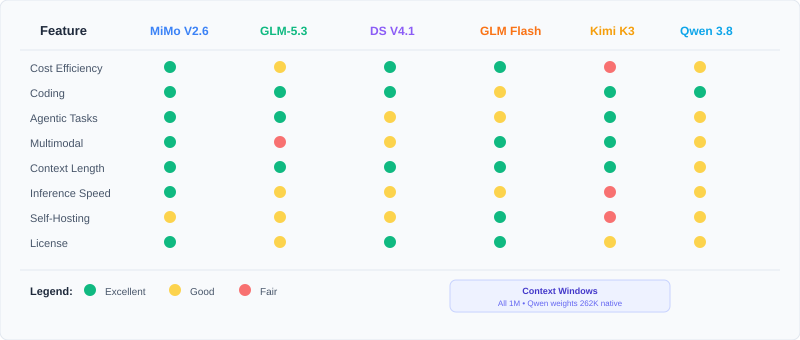

Claude Opus 5, Claude Fable 5, and GPT-5.6 are the current proprietary top tier, and they are expensive. Opus 5 is $5 per million input tokens and $25 per million output. Fable 5 is $10 and $50. GPT-5.6 Sol is $5 and $30. If you run coding agents or burn tokens every day, that adds up fast.

Open source has kept up. Six models now handle coding, reasoning, and agent work at a fraction of that cost: Kimi K3, GLM-5.2, Qwen 3.6 Plus, MiniMax M3, MiMo V2.5 Pro, and Mistral Medium 3.5. I have been testing them next to the proprietary options. The gap is smaller than most people expect.

<Notice type="info" title="Cost Comparison Overview">

Claude Opus 5 costs $5–25 per million tokens. Claude Fable 5 costs $10–50. GPT-5.6 Sol costs $5–30. These open source alternatives range from about $0.30 to $3.00 per million input tokens (Kimi K3 cache-hit pricing is lower still), so you can cut spend by roughly 70–98% depending on the model and cache hit rate.

</Notice>

## Why consider open source LLM alternatives?

Open source models improved a lot and can compete with proprietary options on real work. Reasons people switch:

<ListCheck>

- **Cost**: API prices sit well below Opus 5 / Fable 5 / GPT-5.6 Sol
- **Transparency**: Open weights (where available) let you inspect, fine-tune, or self-host
- **Performance**: Several models match or beat Opus 5 on specific coding and agent benchmarks
- **Flexibility**: Self-host or use OpenRouter / provider APIs
- **Active development**: New releases land every few weeks

</ListCheck>

### What to evaluate

- **Coding**: Generate, debug, and explain code
- **Reasoning**: Multi-step problems and logic
- **Context length**: How much of a repo or conversation fits in one shot
- **Agentic work**: Tools, function calling, long multi-step runs
- **Cost per useful result**: Not just sticker price per million tokens

## What's new with Claude Opus 5, Fable 5, and GPT-5.6?

Before the alternatives, a quick look at the proprietary bar. Anthropic released **[Claude Opus 5](https://www.anthropic.com/news/claude-opus-5)** on July 24, 2026 (after Opus 4.8 in May). **[Claude Fable 5](https://www.anthropic.com/news/claude-fable-5-mythos-5)** landed June 9, 2026. OpenAI released **[GPT-5.6](https://openai.com/index/introducing-gpt-5-6/)** on July 9, 2026. Claude Sonnet 5 (June 30) sits under Opus at $3/$15 after intro pricing. Mythos 5 appears above Fable 5 in some benchmark tables (roughly 80.3% SWE-Bench Pro, 88% Terminal-Bench) and is not the everyday product tier most of us price against.

### Claude Opus 5

<ListCheck>

- **Near Fable 5 intelligence at half the price**: $5/$25 vs Fable 5's $10/$50
- **Frontier-Bench v0.1**: Surpasses prior Opus generations; roughly 2× Opus 4.8 on that suite
- **CursorBench 3.2**: Within about 0.5% of Fable 5 at half the cost
- **ARC-AGI 3**: About 3× the next-best public model on that eval
- **OSWorld 2.0**: Strong computer-use scores at this price band
- **SWE-Bench Pro**: 69.2%; **Terminal-Bench 2.1**: 78.9%
- **Fast mode**: About 2.5× default speed at 2× base price
- **Pricing**: $5 per million input, $25 per million output (same list price as Opus 4.8)

</ListCheck>

### Claude Fable 5

<ListCheck>

- **Mythos-class product tier**: Anthropic's strongest model sold as general availability under the Fable brand; Mythos 5 sits above it in some leaderboards
- **State-of-the-art coding on several internal and partner evals**: Stripe and others report large multi-month engineering compressions on huge codebases
- **Safety fallbacks**: Routes some cyber, bio/chem, and distillation queries to safer policies / lower tiers
- **Vision**: Strong screenshot and game-style vision demos
- **Long context**: 1M context, memory-style note use across long sessions
- **Pricing**: $10 per million input, $50 per million output

</ListCheck>

### GPT-5.6

<ListCheck>

- **Three tiers**: Sol ($5/$30), Terra ($2.50/$15), Luna ($1/$6)
- **SWE-Bench Pro**: 64.6% (Sol)
- **Terminal-Bench 2.1**: 88.8% (Sol), 91.9% with ultra
- **AA Coding Agent Index**: 80 (ahead of Fable 5's 77.2 on that index)
- **BrowseComp**: 90.4% (92.2% ultra)
- **1M context**: MRCR v2 8-needle 512K–1M at 73.8%
- **Ultra mode**: Up to 4 parallel agents
- **Programmatic tool calling**: Built for dense multi-tool agent loops

</ListCheck>

All three are strong. Continuous agent use still costs hundreds of dollars a month. The open models below do comparable work for roughly $15–180/month depending on which model and how hard you hit cache.

## 1. Kimi K3: Largest open-weight model, coding and web leader

**[Kimi K3](https://www.kimi.com/ai-models/kimi-k3)** is Moonshot AI's flagship, API launch around July 16, 2026, with open weights under the "Kimi K3 License" on July 27, 2026. At 2.8T MoE parameters (16B active of 896 experts) it is the largest open-weight model released so far. Native image and video input, 1M context, and top ranks on Frontend Code Arena, SWE Marathon, and BrowseComp. It is no longer the "cheap Kimi" of the K2.6 era: fresh input is $3/M and output is $15/M. Cache hits at $0.30/M input keep warm coding loops sane.

### Technical Specifications

| Feature                | Specification                          |
| ---------------------- | -------------------------------------- |
| **Total Parameters**   | 2.8 Trillion (MoE)                     |
| **Active Parameters**  | 16 Billion (16 of 896 experts)         |
| **Context Length**     | 1M tokens                              |
| **Architecture**       | MoE + Kimi Delta Attention (KDA)       |
| **Multimodal**         | Yes (text + image + video)             |
| **AA Intelligence**    | 57 (#4 of 189)                         |
| **BrowseComp**         | 91.2                                   |
| **SWE Marathon**       | 42.0                                   |
| **Terminal-Bench 2.1** | 88.3%                                  |
| **Program Bench**      | 77.8                                   |
| **FrontierSWE**        | 81.2                                   |
| **Input Cost**         | $0.30/M cache-hit / $3.00/M fresh      |
| **Output Cost**        | $15.00/M                               |
| **License**            | Kimi K3 License (open weights)         |

### What stands out

<ListCheck>

- **Largest open-weight release**: 2.8T total params; self-hosting needs cluster-class hardware, not a laptop
- **SWE Marathon 42.0**: Beats GPT-5.6 Sol and Fable 5 on that eval
- **#1 Frontend Code Arena**: Ahead of Claude Fable 5 on that leaderboard
- **BrowseComp 91.2**: Top-tier web browsing / research
- **Terminal-Bench 2.1 at 88.3%**: Competitive with GPT-5.6 Sol (88.8%)
- **1M context + multimodal**: Image and video in the same long sessions
- **Pricing caveat**: $15/M output and $3/M fresh input; design for cache hits above 90% in coding loops
- **Launch reasoning**: Only "max" reasoning level at launch; reasoning tokens bill at the output rate

</ListCheck>

### Benchmark snapshot

- **AA Intelligence**: 57 (rank #4 of 189)
- **SWE Marathon**: 42.0
- **Terminal-Bench 2.1**: 88.3%
- **BrowseComp**: 91.2
- **Program Bench**: 77.8
- **FrontierSWE**: 81.2

<Button
  text="Kimi K3 Model Page"
  url="https://www.kimi.com/ai-models/kimi-k3"
  size="lg"
  color="green"
  variant="solid"
  icon="arrow-right"
  iconPosition="right"
/>

### When to use it

- **Hard coding and agent marathons**: SWE Marathon and Frontend Arena leadership
- **Web-heavy research agents**: BrowseComp 91.2
- **Multimodal product work**: Screenshots, designs, short video frames
- **Warm multi-turn coding**: Cache-hit input pricing is the real lever
- **Skip if you need cheapest possible tokens**: MiniMax M3 or Qwen 3.6 Plus win on raw dollar spend

## 2. GLM-5.2: Strong overall coding workhorse

**[GLM-5.2](https://z.ai/blog/glm-5.2)** is Z.AI's flagship from June 16, 2026, and still one of the strongest open source coding models. It scores 62.1% on SWE-Bench Pro (ahead of GPT-5.5, close to GPT-5.6 Sol at 64.6%). On Terminal-Bench 2.1 it hits 81.0%, which beats Claude Opus 5's 78.9%. You get a 1M context window and High/Max effort control. Kimi K3 now leads several agent and coding-arena metrics; GLM-5.2 remains the steadier "daily driver" for many teams on price/performance.

### Technical Specifications

| Feature               | GLM-5.2                          |
| --------------------- | -------------------------------- |
| **Parameters**        | 753B                             |
| **Context Length**    | 1M tokens                        |
| **Max Output**        | 128K tokens                      |
| **SWE-Bench Pro**     | 62.1%                            |
| **Terminal-Bench 2.1**| 81.0%                            |
| **Input Cost**        | $1.40/M tokens                   |
| **Output Cost**       | $4.40/M tokens                   |
| **License**           | Open source                      |

<Button
  text="GLM-5.2 Announcement"
  link="https://z.ai/blog/glm-5.2"
  size="lg"
  color="blue"
  variant="solid"
/>

### Key strengths

<ListCheck>

- **62.1% SWE-Bench Pro**: Still among the best open scores; competitive with GPT-5.6 Sol (64.6%)
- **81.0% Terminal-Bench 2.1**: Beats Claude Opus 5 (78.9%)
- **1M token context**: IndexShare keeps long-context compute reasonable
- **Effort control**: High vs Max for speed/cost vs depth
- **Speculative decoding**: Roughly 20% better acceptance length for faster inference
- **Low hallucination reports**: Useful when agents run shell commands on real servers

</ListCheck>

### Performance highlights

- **Coding**: 62.1% SWE-Bench Pro
- **Terminal agents**: 81.0% Terminal-Bench 2.1 (ahead of Opus 5)
- **FrontierSWE**: 74.4%
- **Cost**: $1.40/M input is $3.60 cheaper per million than Opus 5

<Button
  text="Try GLM-5.2"
  url="https://z.ai/subscribe?ic=NKNUNYDRZT"
  size="lg"
  color="blue"
  variant="solid"
  icon="arrow-right"
  iconPosition="right"
/>

<Notice type="info" title="GLM Coding Plans">

Z.AI offers [GLM Coding Plans](https://z.ai/subscribe?ic=NKNUNYDRZT) starting at $18/month for the Lite tier. GLM-5.2 consumes quota at 3× during peak hours and 2× during off-peak hours. Through September 2026, off-peak usage is billed at 1×.

</Notice>

### Best use cases

- **Long-running agent tasks**: 1M context and steady multi-step execution
- **Production coding**: Full-stack work when you want Opus-adjacent quality without Opus bills
- **Enterprise / ops agents**: Low hallucination matters when mistakes are expensive
- **Tool-heavy workflows**: Reasoning plus search and function calling
- **Effort-sensitive tasks**: High for quick replies, Max when stuck

## 3. Qwen 3.6 Plus: Best for frontend and vibe coding

**[Qwen 3.6 Plus](https://qwen.ai/apiplatform)** is Alibaba's production coding/API option in the Qwen 3.6 line. It handles coding, reasoning, and general tasks with a 256K context window. Where it stands out is frontend work and "vibe coding": responsive UIs, design-heavy pages, CSS, and components. Qwen 3.7 Max is available as API-only in places; Qwen 3.8 (about 2.4T) was announced at WAIC July 19, 2026 with open weights promised soon. For this list, 3.6 Plus is still the practical, cheap frontend pick.

### Technical Specifications

| Feature               | Specification        |
| --------------------- | -------------------- |
| **Context Length**    | 256K tokens          |
| **Architecture**      | Advanced Transformer |
| **Input Cost**        | $0.33/M tokens       |
| **Output Cost**       | $1.33/M tokens       |
| **API Compatibility** | OpenAI format        |

### What it offers

<ListCheck>

- **Frontend-first strength**: Responsive layouts, CSS, UI components
- **256K context**: Large enough for many monorepo slices
- **OpenAI-compatible API**: Swap base URL and key
- **Vibe coding**: Fast UI prototyping loops
- **Very cheap**: $0.33/M input, well under Opus 5

</ListCheck>

### When to use it

- **Frontend and design-to-code**: Interfaces, CSS, layout
- **Rapid UI prototypes**: Iterate without burning budget
- **Budget coding**: One of the cheapest options here
- **Existing OpenAI-shaped stacks**: Drop-in endpoint swap
- **Watch the Qwen 3.8 release**: Open weights at 2.4T may change the ranking soon

## 4. MiniMax M3: The budget pick

**[MiniMax M3](https://go.bitdoze.com/minimax)** is MiniMax's flagship from June 1, 2026. It combines solid coding, a 1M context window, and native image/video input. MiniMax Sparse Attention (MSA) cuts long-context compute vs the M2.7 generation (about 1/20th per-token compute at 1M, with much faster prefill and decode). At $0.30 per million input tokens, an always-on coding agent often lands around $7–15 per month. SWE-Bench Pro at 59.0% still beats older GPT-5.5-class and Gemini 3.1 Pro numbers, but GPT-5.6 Sol at 64.6% is ahead. Treat M3 as the value workhorse, not the absolute coding king.

### Technical Specifications

| Feature                  | MiniMax M3                            |
| ------------------------ | ------------------------------------- |
| **Architecture**         | MiniMax Sparse Attention (MSA)        |
| **Context Length**       | 1M tokens                             |
| **Max Output**           | 512K tokens                           |
| **SWE-Bench Pro**        | 59.0%                                 |
| **Terminal-Bench 2.1**   | 66.0%                                 |
| **BrowseComp**           | 83.5                                  |
| **Multimodal**           | Native (image + video input)          |
| **Input Cost**           | $0.30/M tokens                        |
| **Output Cost**          | $1.20/M tokens                        |
| **Cache Read**           | $0.06/M tokens                        |

<Button
  text="MiniMax M3 (10% Off)"
  link="https://go.bitdoze.com/minimax"
  size="lg"
  color="purple"
  variant="solid"
/>

### What it does well

<ListCheck>

- **$0.30/M input**: Cheapest frontier-class option on this list (~17× cheaper than Opus 5 on input)
- **59.0% SWE-Bench Pro**: Beats GPT-5.5-era and Gemini 3.1 Pro numbers; sits under GPT-5.6 Sol (64.6%)
- **1M context with MSA**: Long context without absurd compute bills
- **83.5 BrowseComp**: Strong web search / browsing
- **Native multimodality**: Image and video understanding
- **66.0% Terminal-Bench 2.1**: Solid CLI agents
- **Agent frameworks**: Claude Code, OpenCode, Hermes Agent, and similar tools

</ListCheck>

### Benchmark results

- **SWE-Bench Pro**: 59.0% (competitive, not above GPT-5.6 Sol)
- **Terminal-Bench 2.1**: 66.0%
- **BrowseComp**: 83.5
- **Cache read**: $0.06/M for repeated context
- **Output speed**: Around 100 tokens/sec in many deployments

<Notice type="success" title="Cheapest option">

Running M3 continuously for a month of coding often costs $7–15. That is coffee-money relative to Opus 5 or Fable 5 on the same workload.

</Notice>

### Long-horizon demos from launch

- **Paper reproduction**: Autonomously reproduced an ICLR 2025 paper in about 12 hours (18 commits, 23 figures)
- **CUDA kernel optimization**: 24-hour run lifted FP8 hardware utilization from 7.6% to 71.3% (about 9.4×)
- **Autonomous model training**: 0.37 on PostTrainBench end-to-end training another model

### Token Plan pricing

MiniMax offers a [Token Plan](https://platform.minimax.io/subscribe/token-plan) with discounted rates. Plans start at $20/month (Plus, ~1.7B tokens), $50/month (Max, ~5.1B tokens), and $120/month (Ultra, ~9.8B tokens). Sign up through [go.bitdoze.com/minimax](https://go.bitdoze.com/minimax) for 10% off.

### Best use cases

- **Always-on coding agents**: Cheap enough to leave running
- **Long-context whole-repo work**: 1M tokens without panic
- **Multimodal workflows**: Screenshots and mockups
- **High-volume cheap tokens**: Default model for everyday tasks

## 5. MiMo V2.5 Pro: The agent powerhouse

**[MiMo V2.5 Pro](https://go.bitdoze.com/mimo)** is Xiaomi's flagship for agent scenarios: complex software engineering, long-horizon tasks, and sessions with hundreds of tool calls. Internal demos include a full SysY compiler in Rust in 4.3 hours (672 tool calls) and a working video editor web app (8,192 lines) in 11.5 hours of autonomous work.

### Technical Specifications

| Feature               | MiMo V2.5 Pro                     |
| --------------------- | --------------------------------- |
| **Context Window**    | 1M tokens                         |
| **AA Intelligence**   | 53.8 (better than 98% of models)  |
| **AA Coding**         | 45.5 (better than 94% of models)  |
| **AA Agentic**        | 67.4 (better than 98% of models)  |
| **Input Cost (≤256K)** | $1.00/M tokens                   |
| **Output Cost (≤256K)**| $3.00/M tokens                   |
| **Input Cost (>256K)** | $2.00/M tokens                   |
| **Output Cost (>256K)**| $6.00/M tokens                   |
| **Cache Read**        | $0.20/M tokens                    |

<Button
  text="MiMo Token Plan ($2 Bonus)"
  link="https://go.bitdoze.com/mimo"
  size="lg"
  color="green"
  variant="solid"
/>

### What it does well

<ListCheck>

- **AA Agentic Index 67.4**: Highest agentic score among the open models on this list
- **1M context**: Entire codebases in one session
- **Token efficiency**: On ClawEval, same score band as prior Kimi generations with ~42% fewer tokens
- **Long-horizon execution**: Hundreds of tool calls without losing the thread
- **Real build demos**: Compiler and multi-thousand-line app construction

</ListCheck>

### Token Plan pricing

The [MiMo Token Plan](https://platform.xiaomimimo.com/token-plan) starts at $72/year for the Lite tier (720 million credits). The Pro tier at $600/year gives 8.4 billion credits. Off-peak hours (16:00–24:00 UTC) get a 20% discount on top of the plan rate.

<Notice type="info" title="MiMo bonus">
Sign up through [go.bitdoze.com/mimo](https://go.bitdoze.com/mimo) and get a $2 bonus credit on the MiMo Token Plan.
</Notice>

### Best use cases

- **Complex agent workflows**: Highest agentic score here
- **Software engineering marathons**: Multi-hour builds and refactors
- **Token-efficient long runs**: Fewer tokens for similar task outcomes
- **OpenClaw / Hermes-style always-on agents**: Pair with a cheaper fallback

## 6. Mistral Medium 3.5: Frontier coding with open weights

**[Mistral Medium 3.5](https://docs.mistral.ai/models/model-cards/mistral-medium-3-5-26-04)** is Mistral's frontier dense model from April 2026. It is a 128B dense transformer (all parameters active each step), which often feels more coherent across large repos than MoE models of similar effective size. Open weights under a Modified MIT license; 77.6% on SWE-Bench Verified.

### Technical Specifications

| Feature               | Mistral Medium 3.5               |
| --------------------- | -------------------------------- |
| **Total Parameters**  | 128B (Dense)                     |
| **Active Parameters** | 128B                             |
| **Context Length**    | 256K tokens                      |
| **Architecture**      | Dense Transformer                |
| **SWE-Bench Verified**| 77.6%                            |
| **Input Cost**        | $1.50/M tokens                   |
| **Output Cost**       | $7.50/M tokens                   |
| **License**           | Modified MIT (open weights)      |

<Button
  text="Mistral Medium 3.5 Docs"
  link="https://docs.mistral.ai/models/model-cards/mistral-medium-3-5-26-04"
  size="lg"
  color="blue"
  variant="solid"
/>

### What it does well

<ListCheck>

- **77.6% SWE-Bench Verified**: Solid coding for a dense 128B
- **Dense architecture**: Full parameter use for long coherent edits
- **Open weights**: Self-hostable on roughly 4 GPUs
- **Multimodal**: Vision for screenshots, mockups, docs
- **Configurable reasoning**: Dial effort by task
- **Agentic coding**: Tool use and multi-step workflows

</ListCheck>

### Benchmark results

- **SWE-Bench Verified**: 77.6%
- **Self-hostable**: vLLM and similar stacks on multi-GPU boxes
- **Multimodal**: Code-from-screenshot workflows
- **Cost**: $1.50/M input vs Opus 5's $5

### Best use cases

- **Coding agents with self-host requirements**
- **EU / GDPR-sensitive workloads**: Mistral is EU-based
- **Vision + code**: Mockups to implementation
- **When you want dense, not MoE**: Predictable activation every step

## Side-by-side comparison

How the six open models and three proprietary references line up (numbers as of late July 2026; blanks mean not published or not comparable on that exact suite):

### Performance comparison table

| Benchmark | GLM-5.2 | Kimi K3 | Qwen 3.6 Plus | MiniMax M3 | MiMo V2.5 Pro | Mistral Medium 3.5 | Claude Opus 5 | Claude Fable 5 | GPT-5.6 Sol |
| --- | --- | --- | --- | --- | --- | --- | --- | --- | --- |
| **SWE-Bench Pro** | 62.1% | — | — | 59.0% | — | — | 69.2% | ~80% | 64.6% |
| **Terminal-Bench 2.1** | 81.0% | 88.3% | — | 66.0% | — | — | 78.9% | 83.1% | 88.8% |
| **AA Intelligence** | — | 57 | — | — | 53.8 | — | 55.7 | 59.9 | 58.9 |
| **AA Agentic** | — | — | — | — | 67.4 | — | — | — | — |
| **Context** | 1M | 1M | 256K | 1M | 1M | 256K | 1M | 1M | 1M |
| **Multimodal** | No | Yes (img+video) | No | Yes (img+video) | No | Yes (vision) | Yes (vision) | Yes (vision) | Yes |
| **Open Weights** | Yes | Yes | Yes* | Yes | Yes | Yes | No | No | No |
| **Input $/M** | $1.40 | $0.30–$3.00 | $0.33 | $0.30 | $1.00 | $1.50 | $5.00 | $10.00 | $5.00 |
| **Output $/M** | $4.40 | $15.00 | $1.33 | $1.20 | $3.00 | $7.50 | $25.00 | $50.00 | $30.00 |

\*Qwen product line mixes API and open-weight variants; 3.6 Plus is the practical API tier for most users. Qwen 3.8 open weights are announced but not the default production pick yet.

### Feature comparison matrix



## Getting started

### Step 1: Choose access

<ListCheck>

- **OpenRouter**: One key, many models
- **Direct provider APIs**: Best rate limits and plan discounts (GLM, MiniMax, MiMo, Kimi, Mistral)
- **Self-hosting**: Kimi K3 needs serious hardware; Mistral Medium 3.5 is the realistic 4-GPU open option
- **IDE / agent tools**: OpenCode, Claude Code-compatible stacks, Hermes, Codex app any-model configs

</ListCheck>

### Step 2: Environment (OpenRouter example)

```bash
# Install OpenAI SDK
pip install openai

# Set environment variables
export OPENROUTER_API_KEY="your_api_key_here"
export OPENROUTER_BASE_URL="https://openrouter.ai/api/v1"
```

### Step 3: Basic call

```python
import openai

client = openai.OpenAI(
    base_url="https://openrouter.ai/api/v1",
    api_key="your_openrouter_api_key"
)

# GLM-5.2 for everyday agent coding
response = client.chat.completions.create(
    model="z-ai/glm-5.2",
    messages=[
        {"role": "system", "content": "You are a helpful coding assistant."},
        {"role": "user", "content": "Create a Python web scraper for product prices"}
    ]
)

print(response.choices[0].message.content)
```

### Step 4: Match context to the job

<Notice type="warning" title="Context length">

GLM-5.2, Kimi K3, MiniMax M3, and MiMo V2.5 Pro all offer 1M tokens of context, matching Opus 5 / Fable 5 / GPT-5.6 Sol. Qwen 3.6 Plus and Mistral Medium 3.5 sit at 256K. For even cheaper 1M context options, see DeepSeek V4 Pro in our [best cheap models for Hermes Agent](/best-cheap-models-hermes-agent/) guide.

</Notice>

## Cost breakdown

Illustrative monthly cost at 10M input + 10M output tokens (API list rates; real bills vary with cache, plans, and mix). Opus 5 is the open-source comparison baseline.

### Monthly cost comparison (10M in + 10M out)

| Model | Input | Output | Total | vs Opus 5 |
| --- | --- | --- | --- | --- |
| **Claude Fable 5** | $100 | $500 | $600 | — |
| **Claude Opus 5** | $50 | $250 | $300 | Baseline |
| **GPT-5.6 Sol** | $50 | $300 | $350 | — |
| **GLM-5.2** | $14 | $44 | $58 | ~81% less |
| **Kimi K3 (cache-hit input)** | $3 | $150 | $153 | ~49% less |
| **Kimi K3 (fresh input)** | $30 | $150 | $180 | ~40% less |
| **Qwen 3.6 Plus** | $3.30 | $13.30 | $16.60 | ~94% less |
| **MiniMax M3** | $3 | $12 | $15 | ~95% less |
| **MiMo V2.5 Pro** | $10 | $30 | $40 | ~87% less |
| **Mistral Medium 3.5** | $15 | $75 | $90 | ~70% less |

Kimi K3's $15/M output is the surprise for people who remember K2.6. Without high cache-hit rates on input, it is not the budget pick anymore. MiniMax M3 and Qwen 3.6 Plus still win pure dollar races.

### What the savings buy you

- More experiments and longer agent runs without finance panic
- Team-wide access instead of a few seats on Opus/Fable
- AI in more pipelines (CI bots, review agents, always-on assistants)

## Tips and common mistakes

### What works

<ListCheck>

- **Match model to task**: Cheap models for boilerplate; Kimi K3 / GLM-5.2 / MiMo for hard agent work
- **Watch context**: Long windows are not free
- **Prompt per model**: Each family likes different instruction styles
- **Batch where you can**: Fewer round-trips, less overhead
- **Measure in your domain**: Public benches are not your codebase

</ListCheck>

### What to avoid

- Defaulting every task to the most expensive proprietary model
- Shipping agent output without domain checks
- Ignoring token meters until the invoice lands
- Single-model lock-in with no fallback when a provider hiccups

## What's coming next

- **Qwen 3.8** (~2.4T, open weights promised) after the July 19 WAIC announcement; 3.7 Max already exists as API-only in some channels
- **Kimi K3 weights** already out; tooling and quantization for self-host will matter more than marketing slides
- **DeepSeek V4** leaving preview windows and joining cheap 1M-context agent stacks
- **Multimodal defaults**: Image/video as table stakes, not extras
- **Faster inference**: Real-time agent UX improving month over month

## Which one should you pick?

### Kimi K3 if you want:

- Largest open-weight model (2.8T) with released weights
- SWE Marathon 42.0 and #1 Frontend Code Arena
- BrowseComp 91.2 and 1M multimodal context
- Strong Terminal-Bench (88.3%) next to GPT-5.6 Sol
- You can live with $15/M output and design for cache hits

<Button
  text="Try Kimi K3"
  url="https://www.kimi.com/ai-models/kimi-k3"
  size="lg"
  color="green"
  variant="solid"
  icon="arrow-right"
  iconPosition="right"
/>

### GLM-5.2 if you need:

- 62.1% SWE-Bench Pro and everyday coding reliability
- 81.0% Terminal-Bench 2.1 (beats Opus 5's 78.9%)
- 1M context and High/Max effort control
- Predictable $1.40/$4.40 pricing without Kimi's output tax

<Button
  text="Try GLM-5.2"
  url="https://z.ai/subscribe?ic=NKNUNYDRZT"
  size="lg"
  color="blue"
  variant="solid"
  icon="arrow-right"
  iconPosition="right"
/>

### Qwen 3.6 Plus if you care about:

- Frontend and vibe coding
- $0.33/M input
- OpenAI-compatible endpoints
- 256K context for large UI monorepos

<Button
  text="Explore Qwen 3.6 Plus"
  url="https://openrouter.ai/qwen/qwen3.6-plus"
  size="lg"
  color="purple"
  variant="solid"
  icon="arrow-right"
  iconPosition="right"
/>

### MiniMax M3 if you want:

- Cheapest frontier-class option at $0.30/M input (~17× cheaper than Opus 5 on input)
- 1M context with sparse attention
- 59.0% SWE-Bench Pro (beats older GPT-5.5 / Gemini 3.1 Pro; under GPT-5.6 Sol)
- Native image + video
- Always-on agents for roughly $7–15/month

<Button
  text="MiniMax M3 (10% Off)"
  link="https://go.bitdoze.com/minimax"
  size="lg"
  color="purple"
  variant="solid"
  icon="arrow-right"
  iconPosition="right"
/>

### MiMo V2.5 Pro if you need:

- Strongest AA Agentic score on this open list (67.4)
- 1M context matching Opus 5 class windows
- Token-efficient long tool chains
- Hundreds of tool calls in one session

<Button
  text="MiMo Token Plan ($2 Bonus)"
  link="https://go.bitdoze.com/mimo"
  size="lg"
  color="green"
  variant="solid"
  icon="arrow-right"
  iconPosition="right"
/>

### Mistral Medium 3.5 if you need:

- Self-hostable open weights on ~4 GPUs
- Dense 128B coherence across big repos
- Vision for screenshot-driven coding
- EU-based provider for compliance stories

<Button
  text="Try Mistral Medium 3.5"
  url="https://console.mistral.ai/"
  size="lg"
  color="blue"
  variant="solid"
  icon="arrow-right"
  iconPosition="right"
/>

Any of these six models will undercut Claude Opus 5, Fable 5, or GPT-5.6 Sol on continuous use. Kimi K3 is the largest open-weight release and leads SWE Marathon plus Frontend Code Arena. GLM-5.2 is still the practical coding daily driver with Terminal-Bench that beats Opus 5. MiniMax M3 is the cheap always-on default with 1M multimodal context. Qwen 3.6 Plus owns frontend-on-a-budget. MiMo V2.5 Pro owns agentic scores. Mistral Medium 3.5 is the self-host dense option. Pick for your workflow and bill, not for the loudest launch blog post.

<Notice type="success" title="Ready to get started?">

All six models are available through their providers and (in most cases) OpenRouter. If you use the Codex app, our [Codex app with any model guide](/codex-app-any-model/) shows how to plug GLM-5.2, MiniMax, and MiMo in with a short config. For coding agents on a cheap VPS, see the [OpenCode setup guide](/opencode-setup-guide/) and [Pi coding agent setup guide](/pi-coding-agent-setup-guide/). Full pricing and Hermes-focused benches live in [best cheap models for Hermes Agent](/best-cheap-models-hermes-agent/).

</Notice>
