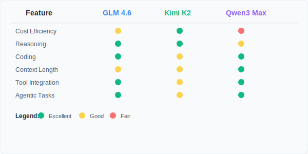

Claude Sonnet 4.5 or Opus 4.6 works well for coding, but it's expensive. Plenty of developers are looking for alternatives that don't cost as much. The open source AI space has grown a lot since 2025, and now there are models that can do what Claude does for much less money.

This guide covers five open source models that can replace Claude Sonnet 4.5 or Opus 4.6 for coding: GLM-5, Kimi K2.5, Qwen-Max, MiniMax M2.1, and Devstral 2. These models handle reasoning, code generation, and agent tasks well, and they cost significantly less than Claude.

<Notice type="info" title="Cost Comparison Overview">

While Claude Sonnet 4.5 costs $3-15 per million tokens, these open source alternatives range from $0.30 to $1.20 per million input tokens, offering savings of up to 92%.

</Notice>

## Why Consider Open Source LLM Alternatives?

Open source models have improved a lot and can compete with proprietary options. Here's why they're worth considering:

<ListCheck>

- **Cost Efficiency**: API costs are much lower than proprietary models
- **Transparency**: Open source code lets you understand and modify the model
- **Performance Parity**: Many open source models match or beat Claude Sonnet 4.5 on various tasks
- **Flexibility**: You can self-host or use various API providers
- **Community Support**: Active development teams keep improving the models

</ListCheck>

### Key Performance Areas to Consider

When evaluating LLM alternatives, several factors matter:

- **Coding Capabilities**: How well the model generates, debugs, and explains code
- **Reasoning Performance**: How well it handles complex problems and logical thinking
- **Context Length**: How much information the model can process at once
- **Agentic Tasks**: Tool usage, function calling, and multi-step task execution
- **Cost-Performance Ratio**: How much value you get per dollar spent

## What's New with Claude Sonnet 4.5?

Before looking at alternatives, it helps to understand what Claude Sonnet 4.5 does well. Released in early 2025, **[Claude Sonnet 4.5](https://www.anthropic.com/news/claude-sonnet-4-5)** is Anthropic's latest model:

<ListCheck>

- **Best Coding Model**: Scores 77.2% on SWE-bench Verified and stays focused on complex tasks for 30+ hours
- **Computer Use Leader**: 61.4% on OSWorld benchmark, up from 42.2% with Sonnet 4
- **Enhanced Reasoning**: Better reasoning and math capabilities
- **Improved Alignment**: Less sycophantic and deceptive behavior than previous models
- **Premium Pricing**: $3 per million input tokens, $15 per million output tokens

</ListCheck>

Claude Sonnet 4.5 and Opus 4.6 is powerful, but the price makes it hard to justify for many developers and businesses. Open source alternatives offer similar performance for much less money.

## 1. GLM-5: Agentic engineering with record-low hallucinations

**[GLM-5](https://docs.z.ai/guides/llm/glm-5)** is Z.AI's new flagship, and the jump from GLM-4.7 is significant. It went from 357B to 744B total parameters while keeping MoE efficiency at 40B active. Two things stand out: DeepSeek Sparse Attention for handling long contexts without blowing up inference costs, and a new RL infrastructure called "slime" that brought hallucination rates down to near zero. In coding benchmarks, it's approaching Claude Opus 4.5 territory.

### Technical Specifications

| Feature               | GLM-5                            |
| --------------------- | -------------------------------- |
| **Total Parameters**  | 744B (MoE)                       |
| **Active Parameters** | 40B                              |
| **Context Length**    | 200K tokens                      |
| **Architecture**      | MoE with Sparse Attention        |
| **Input Cost**        | $0.80/M tokens                   |
| **Output Cost**       | $2.56/M tokens                   |
| **License**           | MIT                              |
| **Release Date**      | February 2026                    |

<Button
  text="GLM-5 Coding Plans"
  link="https://z.ai/subscribe?ic=NKNUNYDRZT"
  size="lg"
  color="blue"
  variant="solid"
/>

<YouTubeEmbed
  url="https://www.youtube.com/embed/O5_iAvCgL1o"
  label="GLM-5 Testing"
/>

### Key Strengths

<ListCheck>

- **Agentic engineering**: Handles complex system engineering and long-horizon agent tasks with multi-step planning
- **95.8% SWE-bench Verified**: The highest coding score among open source models right now
- **Near-zero hallucinations**: Scores -1 on AA-Omniscience Index, up from GLM-4.7's -36
- **Strong reasoning**: 92.7% on AIME 2026 and 86.0% on GPQA-Diamond
- **Sparse Attention**: DeepSeek Sparse Attention keeps deployment costs down even with 200K context
- **"Slime" RL infrastructure**: Async RL with Active Partial Rollouts (APRIL) for post-training refinement

</ListCheck>

### Performance Highlights

Here's where GLM-5 lands on the benchmarks that matter:

- **Coding**: 95.8% on SWE-bench Verified. It's also the first open model to break 50 on the Artificial Analysis Intelligence Index v4.0
- **Reasoning/math**: 93.6% accuracy overall, 92.7% on AIME 2026, 86.0% on GPQA-Diamond
- **Agentic work**: ELO 1,412 on GDPval-AA (only Claude Opus 4.6 and GPT-5.2 score higher). #1 on Vending Bench 2
- **Reliability**: 97% success rate across benchmarks, with the lowest hallucination rate of any open model tested

<Button
  text="Try GLM-5"
  url="https://z.ai/subscribe?ic=NKNUNYDRZT"
  size="lg"
  color="blue"
  variant="solid"
  icon="arrow-right"
  iconPosition="right"
/>

<Notice type="info" title="GLM Coding Plans">

For coding, Z.AI offers [GLM Coding Plans](https://z.ai/subscribe?ic=NKNUNYDRZT) with pricing and features for developers.

</Notice>

### Best Use Cases

GLM-5 works well for:

- **Long-running agent tasks**: Multi-step planning across complex systems
- **Production coding**: Full-stack development where you need something close to Claude Opus 4.5
- **Enterprise work**: MIT license and low hallucination rate matter when mistakes are expensive
- **Document generation**: Can produce business documents in PDF, Word, and Excel formats
- **Tool-heavy workflows**: Reasoning plus tool integration and search

## 2. Kimi K2.5: Multimodal coding with agent swarms

**[Kimi K2.5](https://www.kimi.com/blog/kimi-k2-5.html)** is Moonshot AI's strongest open-source model. It's natively multimodal (pretrained on ~15T mixed visual and text tokens), which means it can actually look at images and videos, not just text. The standout feature is its agent swarm: it can spin up to 100 sub-agents working in parallel.

### Technical Specifications

| Feature                | Specification             |
| ---------------------- | ------------------------- |
| **Total Parameters**   | 1 Trillion                |
| **Active Parameters**  | 32 Billion                |
| **Context Length**     | 256K tokens               |
| **Architecture**       | Mixture-of-Experts (MoE)  |
| **Input Cost**         | $0.60/M tokens            |
| **Output Cost**        | $3.00/M tokens            |
| **Release Date**       | January 2026              |
| **Agent Swarm**        | Up to 100 sub-agents      |

<YouTubeEmbed
  url="https://www.youtube.com/embed/ctfBKfwprNM"
  label="Kimi K2.5 Testing"
/>

### Outstanding Features

<ListCheck>

- **Agent swarm**: Self-directs up to 100 sub-agents with up to 1,500 coordinated tool calls for parallel workflows
- **Coding from visuals**: Generates code from images, videos, and visual debugging natively
- **256K context**: Enough to fit a full codebase and long-form outputs
- **76.8% SWE-bench Verified**: Solid real-world software engineering performance
- **Claude Code compatible**: Works with Claude Code, Cline, and other agent frameworks
- **$0.60/M input tokens**: Good price for what you get
- **Kimi Code CLI**: Open-source CLI agent that takes images and videos as inputs

</ListCheck>

### Benchmark results

Kimi K2.5 scores well across coding and vision tasks:

- **Coding**: 76.8% on SWE-bench Verified, 73.0% on SWE-bench Multilingual, 85.0% on LiveCodeBench v6
- **Vision**: 78.5% on MMMU-Pro, 84.2% on MathVision, 88.8% on OmniDocBench 1.5
- **Agentic**: 78.4% on BrowseComp with agent swarm, 50.2% on HLE-Full with tools
- **Context**: 256K tokens handles medium-sized repositories in one session
- **Video**: 86.6% on VideoMMMU, 79.8% on LongVideoBench

<Notice type="success" title="Best value for multimodal">

Kimi K2.5 is the only model here with native vision support, plus the agent swarm for parallel execution, all at $0.60 per million input tokens.

</Notice>

<Button
  text="Access Kimi K2.5 on OpenRouter"
  url="https://openrouter.ai/moonshotai/kimi-k2-5"
  size="lg"
  color="green"
  variant="solid"
  icon="arrow-right"
  iconPosition="right"
/>

### When to use it

- **Visual coding**: Generate code from UI mockups, screenshots, or video demos
- **Parallel agent workflows**: Agent swarm cuts runtime by up to 4.5x
- **Large codebases**: 256K context fits entire repositories
- **Frontend work**: Responsive interfaces with charts and visual elements
- **Document processing**: Handles 10,000-word papers or 100-page documents with annotations
- **Tight budgets**: You get a lot of capability per dollar
- **Long coding sessions**: Keeps conversation history across extended workflows

## 3. Qwen-Max: Qwen3's biggest model

**[Qwen-Max](https://qwen.ai/apiplatform)** is the top model in the Qwen3 series. It handles coding, reasoning, and general tasks with a 256K context window and uses an OpenAI-compatible API, so integration is straightforward.

### Technical Specifications

| Feature               | Specification        |
| --------------------- | -------------------- |
| **Model Family**      | Qwen3                |
| **Context Length**    | 256K tokens          |
| **Architecture**      | Advanced Transformer |
| **Input Cost**        | $1.20/M tokens       |
| **Output Cost**       | $6.00/M tokens       |
| **Release Date**      | September 2025       |
| **API Compatibility** | OpenAI format        |

<YouTubeEmbed
  url="https://www.youtube.com/embed/RAPQd0nBg3g"
  label="Qwen-Max Testing"
/>

### What it offers

<ListCheck>

- **Qwen3's top model**: The most capable in the Qwen lineup
- **256K context**: Fits large codebases in a single session
- **Solid benchmarks**: Good scores on MMLU, MMMU, and HellaSwag
- **Versatile**: Coding, reasoning, and general tasks in one model
- **OpenAI-compatible API**: Swap your API key and base URL, done
- **Stable in production**: Reliable for business workloads

</ListCheck>

### Benchmark performance

Qwen-Max holds its own across multiple evaluations:

- **General**: Strong scores on MMLU, MMMU, and HellaSwag
- **Coding**: Competitive on coding-specific benchmarks
- **Long context**: Handles large codebases with 256K tokens
- **Production use**: Consistent and reliable in real deployments
- **Multi-task**: Performs well across different task types

### Development Ecosystem

<Notice type="info" title="API Compatibility">

Qwen-Max uses an OpenAI-compatible API, so you can integrate it by updating the API key and base URL.

</Notice>

<Button
  text="Explore Qwen-Max on OpenRouter"
  url="https://openrouter.ai/qwen/qwen-max"
  size="lg"
  color="purple"
  variant="solid"
  icon="arrow-right"
  iconPosition="right"
/>

### When to use it

- **Enterprise work**: Production-grade AI for business-critical tasks
- **Full-stack development**: Multiple languages and frameworks
- **Repository-wide operations**: 256K context for large-scale analysis
- **Mixed workloads**: Coding, reasoning, and general queries in one model
- **Existing OpenAI setups**: Drop-in replacement with API key swap

## 4. MiniMax M2.1: 10B active parameters, surprisingly capable

**[MiniMax M2.1](https://www.minimax.io/news/minimax-m21)** punches above its weight. With only 10B active parameters, it's one of the most efficient models here, yet it scores 74% on SWE-bench Verified. It added multi-language programming support and "Vibe Coding" for UI/UX generation.

### Technical Specifications

| Feature               | MiniMax M2.1                      |
| --------------------- | --------------------------------- |
| **Total Parameters**  | 230B                              |
| **Active Parameters** | 10B                               |
| **Context Length**    | 200K tokens                       |
| **Architecture**      | Mixture-of-Experts (MoE)          |
| **Input Cost**        | $0.30/M tokens                    |
| **Output Cost**       | $1.20/M tokens                    |
| **Release Date**      | December 23, 2025                 |

<Button
  text="MiniMax M2.1 Coding Plans"
  link="https://platform.minimax.io/subscribe/coding-plan"
  size="lg"
  color="purple"
  variant="solid"
/>

### What it does well

<ListCheck>

- **Multi-language support**: Rust, Java, Go, C++, and more
- **Vibe Coding**: Generates web and app UIs, including 3D scenes and complex interactions
- **Fast and lean**: Quicker responses and lower token consumption than M2
- **Agent framework support**: Works with Claude Code, Droid, Cline, Roo Code
- **Full-stack UI generation**: 88.6 average on the VIBE benchmark (91.5 for Web, 89.7 for Android)
- **Open source weights**: Deploy locally with vLLM or SGLang
- **~10% of Claude's cost**: High performance for very little money

</ListCheck>

### Benchmark results

- **SWE-bench Verified**: 74.0%, good for real-world engineering tasks
- **VIBE Benchmark**: 88.6 average, strong in Web (91.5) and Android (89.7) development
- **SWE-Multilingual**: 72.5%, particularly good with non-Python languages
- **Agent integration**: Stable in complex tool-use scenarios
- **Real-world tasks**: Handles end-to-end office automation and coding

<Notice type="success" title="Cheapest option here">

MiniMax M2.1 costs about 10% of Claude Sonnet's price and still hits 74% on SWE-bench Verified. If budget is your main concern, this is the one.

</Notice>

<Button
  text="Try MiniMax M2.1"
  url="https://agent.minimax.io"
  size="lg"
  color="purple"
  variant="outline"
  icon="arrow-right"
  iconPosition="right"
/>

<Button
  text="Access MiniMax M2.1 API"
  url="https://platform.minimax.io/docs/api-reference/text-anthropic-api"
  size="lg"
  color="purple"
  variant="outline"
  icon="arrow-right"
  iconPosition="right"
/>

### Best Use Cases

MiniMax M2.1 works well for:

- **Complex Agentic Workflows**: Long-horizon toolchains across shell, browser, retrieval, and code runners
- **Multi-Language Projects**: Good support for Rust, Java, C++, and Go
- **Interactive Coding Assistants**: Fast inference for responsive IDE integration with Claude Code and Cursor
- **UI/UX Development**: Creating high-quality, interactive web and mobile interfaces (Vibe Coding)
- **Self-Hosting**: Open source weights let you deploy on-premise for enterprise security

## 5. Devstral 2: Dense architecture for repository-scale work

**[Devstral 2](https://mistral.ai/news/devstral-2-vibe-cli)** takes a different approach. While the other models here use MoE, Devstral 2 is a 123B dense transformer. That means all parameters are active on every inference, which gives it better coherence on whole-repository tasks. It ships with Mistral Vibe, a CLI agent for terminal-based automation.

### Technical Specifications

| Feature               | Devstral 2                        |
| --------------------- | --------------------------------- |
| **Total Parameters**  | 123B (Dense)                      |
| **Active Parameters** | 123B                              |
| **Context Length**    | 256K tokens                       |
| **Architecture**      | Dense Transformer                 |
| **Input Cost**        | $0.40/M tokens                    |
| **Output Cost**       | $2.00/M tokens                    |
| **Release Date**      | December 2025                     |

<Button
  text="Devstral 2 Vibe CLI"
  link="https://mistral.ai/news/devstral-2-vibe-cli"
  size="lg"
  color="blue"
  variant="solid"
/>

### What it does well

<ListCheck>

- **Dense architecture**: All 123B parameters active, so reasoning stays coherent across large repos
- **Built for agents**: Tuned for Vibe CLI to handle multi-file edits, git operations, and test loops
- **Devstral Small 2**: A 24B companion model that runs on consumer hardware (Apache 2.0 license)
- **72.2% SWE-bench Verified**: Beats many larger MoE models
- **Mistral Vibe CLI**: Open-source terminal assistant for autonomous coding

</ListCheck>

### Benchmark results

- **SWE-bench Verified**: 72.2%, at the frontier for open-weight models
- **Human evaluation**: Preferred over DeepSeek V3.2 in Cline-based coding tasks (42.8% win rate)
- **Local model**: Devstral Small 2 (24B) hits 68.0% SWE-bench, strong for a model you can run locally
- **Cost**: Up to 7x cheaper than Claude Sonnet on real-world tasks

<Notice type="success" title="Run it locally">

Devstral Small 2 (24B) runs on high-end consumer GPUs, so you can have a fully local coding agent without sending any code to external servers.

</Notice>

<Button
  text="Try Devstral 2"
  url="https://console.mistral.ai/"
  size="lg"
  color="blue"
  variant="outline"
  icon="arrow-right"
  iconPosition="right"
/>

### Best Use Cases

Devstral 2 works well for:

- **Agentic Workflows**: Using Mistral Vibe CLI for autonomous terminal-based coding
- **Repository Refactoring**: Dense architecture provides better coherence for large-scale changes
- **Local Development**: Devstral Small 2 lets you use powerful coding assistance on local hardware
- **Secure Environments**: Open weights and local deployment options for strict data privacy

## Side-by-side comparison

Here's how all five stack up:

### Performance Comparison Table

| Benchmark                     | GLM-5     | Kimi K2.5 | Qwen-Max | MiniMax M2.1 | Devstral 2 | Claude Sonnet 4.5 |
| ----------------------------- | --------- | --------- | -------- | ------------ | ---------- | ----------------- |
| **SWE-bench Verified**        | 95.8%     | 76.8%     | Strong   | 74.0%        | 72.2%      | 77.2%             |
| **LiveCodeBench v6**          | Strong    | 85.0%     | Strong   | Strong       | Strong     | 84.5%             |
| **MMMU-Pro**                  | —         | 78.5%     | —        | —            | —          | 74.0%             |
| **Context Window**            | 200K      | 256K      | 256K     | 200K         | 256K       | 200K              |
| **Agent Swarm**               | No        | Yes       | No       | No           | No         | No                |
| **Vision Support**            | No        | Yes       | No       | No           | No         | No                |
| **Cost per 1M Input Tokens**  | $0.80     | $0.60     | $1.20    | $0.30        | $0.40      | $3.00             |
| **Cost per 1M Output Tokens** | $2.56     | $3.00     | $6.00    | $1.20        | $2.00      | $15.00            |

### Feature Comparison Matrix



## Getting started

### Step 1: Choose Your Access Method

Each model offers multiple access options:

<ListCheck>

- **OpenRouter**: Unified API access to all models with competitive pricing
- **Direct API Access**: Provider-specific endpoints for optimized performance
- **Self-Hosting**: Deploy models on your own infrastructure for maximum control
- **Development Tools**: Integration with coding assistants and IDEs

</ListCheck>

### Step 2: Set Up Your Environment

For OpenRouter access (recommended for beginners):

```bash
# Install OpenAI SDK
pip install openai

# Set environment variables
export OPENROUTER_API_KEY="your_api_key_here"
export OPENROUTER_BASE_URL="https://openrouter.ai/api/v1"
```

### Step 3: Basic Implementation Example

```python
import openai

client = openai.OpenAI(
    base_url="https://openrouter.ai/api/v1",
    api_key="your_openrouter_api_key"
)

# Use GLM-5 for agentic tasks
response = client.chat.completions.create(
    model="z-ai/glm-5",
    messages=[
        {"role": "system", "content": "You are a helpful coding assistant."},
        {"role": "user", "content": "Create a Python web scraper for product prices"}
    ]
)

print(response.choices[0].message.content)
```

### Step 4: Optimize for Your Use Case

<Notice type="warning" title="Context Length Considerations">

Kimi K2.5, Qwen-Max, and Devstral 2 lead with 256K tokens, while GLM-5 and MiniMax M2.1 support 200K tokens—all excellent for complex coding tasks.

</Notice>

## Cost breakdown

Here's what you'd actually pay at 10M tokens/month:

### Monthly Cost Comparison (Based on 10M tokens usage)

| Model                 | Input Cost | Output Cost | Total Monthly Cost | Savings vs Claude Sonnet 4.5 |
| --------------------- | ---------- | ----------- | ------------------ | ---------------------------- |
| **Claude Sonnet 4.5** | $30.00     | $150.00     | $180.00            | Baseline                     |
| **GLM-5**             | $8.00      | $25.60      | $33.60             | 81.3% savings                |
| **Kimi K2.5**         | $6.00      | $30.00      | $36.00             | 80.0% savings                |
| **Qwen-Max**          | $12.00     | $60.00      | $72.00             | 60.0% savings                |
| **MiniMax M2.1**      | $3.00      | $12.00      | $15.00             | 91.7% savings                |
| **Devstral 2**        | $4.00      | $20.00      | $24.00             | 86.7% savings                |

### What the savings mean in practice

- **More experimentation**: Lower costs let you test and iterate more freely
- **Team-wide access**: Run AI assistance for your whole team, not just a few developers
- **Broader integration**: Use AI in more parts of your application
- **Faster shipping**: More AI-assisted development cycles without budget anxiety

## Tips and common mistakes

### What works

<ListCheck>

- **Match model to task**: Use cheaper models for simple tasks, bigger ones for complex reasoning
- **Manage context carefully**: Longer context costs more tokens, so be deliberate
- **Invest in prompts**: Each model responds differently to prompt style
- **Batch requests**: Combine calls to reduce overhead
- **Monitor outputs**: Track quality in your specific domain

</ListCheck>

### What to avoid

- **Over-Engineering**: Don't use the most expensive model for simple tasks
- **Inadequate Testing**: Always validate model outputs in your specific domain
- **Context Overflow**: Monitor token usage to avoid unexpected costs
- **Single Model Dependency**: Consider using different models for different tasks

## What's coming next for open source LLMs

A few trends worth watching:

- **Domain-specific models**: More specialized options like Qwen3 Coder
- **Better efficiency**: More performance per parameter and per dollar
- **Tighter tool integration**: Better compatibility with IDEs and coding workflows
- **Multimodal by default**: Vision and audio becoming standard, not optional
- **Faster inference**: Latency dropping enough for real-time use

## Which one should you pick?

It depends on what matters most to you:

### GLM-5 if you need:

- **Top coding scores**: 95.8% SWE-bench Verified, highest among open source
- **Agentic engineering**: Long-horizon multi-step planning
- **Low hallucinations**: Record-low rate, good for enterprise
- **Strong reasoning**: 92.7% on AIME 2026, 86.0% on GPQA-Diamond
- **MIT license**: Full commercial and self-hosting freedom

<Button
  text="Try GLM-5"
  url="https://z.ai/subscribe?ic=NKNUNYDRZT"
  size="lg"
  color="blue"
  variant="solid"
  icon="arrow-right"
  iconPosition="right"
/>
### Kimi K2.5 if you want:

- **Vision support**: The only model here that can read images and video
- **Agent swarms**: Parallel execution with up to 100 sub-agents
- **256K context**: Fits entire repositories
- **Claude Code compatibility**: Works with Claude Code and Kimi Code
- **Good price**: $0.60/M input tokens for all of the above

<Button
  text="Try Kimi K2.5"
  url="https://openrouter.ai/moonshotai/kimi-k2-5"
  size="lg"
  color="green"
  variant="solid"
  icon="arrow-right"
  iconPosition="right"
/>

### Qwen-Max if you care about:

- **All-around capability**: Qwen3's top model, solid across the board
- **Production reliability**: Stable for business-critical workloads
- **OpenAI compatibility**: Drop-in replacement for existing setups
- **256K context**: Large-scale codebase operations

<Button
  text="Explore Qwen-Max"
  url="https://openrouter.ai/qwen/qwen-max"
  size="lg"
  color="purple"
  variant="solid"
  icon="arrow-right"
  iconPosition="right"
/>

### MiniMax M2.1 if you want:

- **Multi-language coding**: Strong in Rust, Java, C++, and Go
- **UI generation**: Vibe Coding for web and mobile interfaces
- **Complex agent workflows**: Tool-calling across shell, browser, and code runners
- **Self-hosting**: Open source weights for on-premise deployment
- **Fast inference**: 10B active parameters means quick responses

<Button
  text="Try MiniMax M2.1"
  url="https://platform.minimax.io/subscribe/coding-plan"
  size="lg"
  color="purple"
  variant="solid"
  icon="arrow-right"
  iconPosition="right"
/>

### Devstral 2 if you need:

- **Local deployment**: 24B small model runs on consumer GPUs
- **Dense reasoning**: All parameters active for coherent whole-repo work
- **Terminal agent**: Native Mistral Vibe CLI integration
- **Data privacy**: Open weights, run everything locally

<Button
  text="Try Devstral 2"
  url="https://console.mistral.ai/"
  size="lg"
  color="blue"
  variant="solid"
  icon="arrow-right"
  iconPosition="right"
/>

Any of these five models will save you money compared to Claude Sonnet 4.5. GLM-5 leads on coding benchmarks, Kimi K2.5 is the only one with vision, MiniMax M2.1 is the cheapest, Qwen-Max is the most versatile, and Devstral 2 is the best for local/private use. Pick the one that fits your workflow and budget.

<Notice type="success" title="Ready to get started?">

All five models are available through their respective providers and OpenRouter. Pick one, swap your API key, and start coding.

</Notice>
