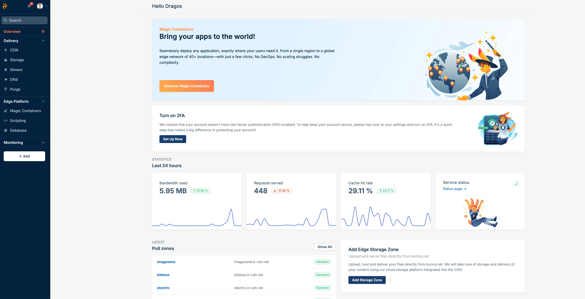
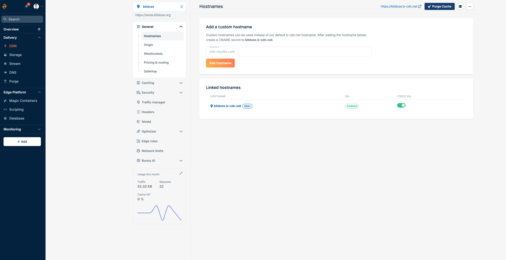
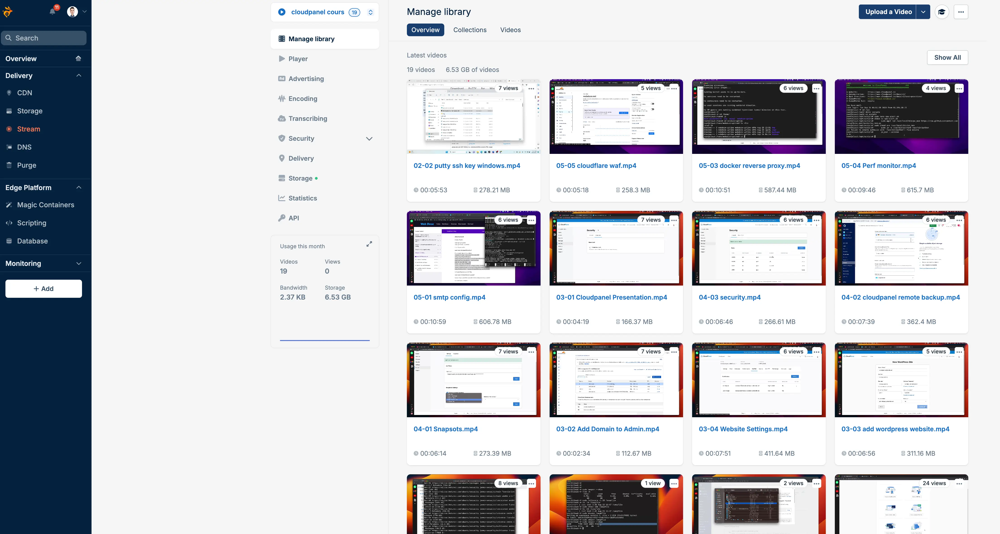
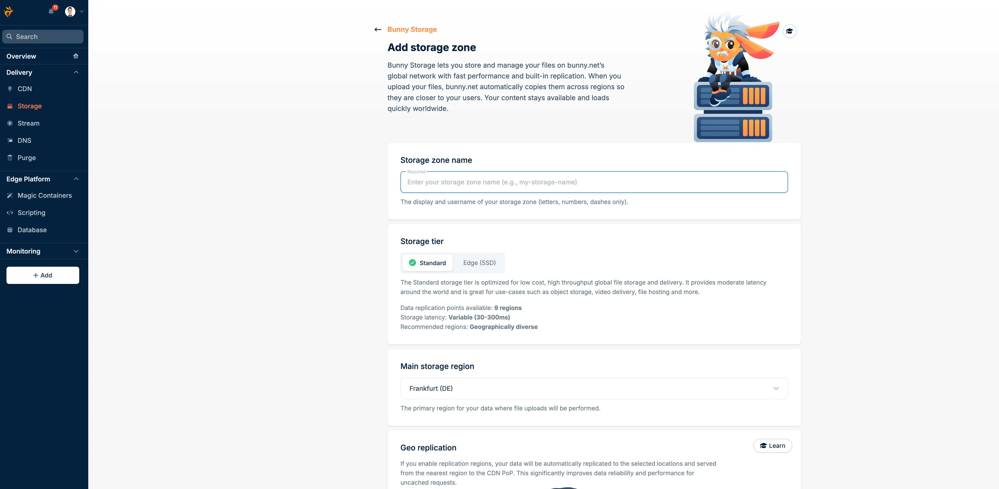

import Button from "@components/widgets/Button.astro";
import Notice from "@components/widgets/Notice.astro";
import ListCheck from "@components/widgets/ListCheck.astro";
import Accordion from "@components/widgets/Accordion.astro";
import Tabs from "@components/widgets/Tabs.astro";
import Tab from "@components/widgets/Tab.astro";

I've been running my sites through [Bunny.net](https://go.bitdoze.com/bunny) for a while now, using their CDN with WordPress and their video streaming service. Before Bunny, I was on Cloudflare's free tier and briefly tried CloudFront. CloudFront's pricing model gave me a headache (per-request fees on top of bandwidth, seriously?), and while Cloudflare's free plan is hard to beat on price, I wanted more control over caching and video delivery without stitching together three different services.

Bunny.net fixed most of those problems. Not all of them, but most. Here's what I've found after running it in production.

<Notice type="success" title="Try Bunny.net free for 14 days">
  You can test everything in this review yourself. [Sign up at Bunny.net](https://go.bitdoze.com/bunny) with no credit card required and get a full 14-day free trial.
</Notice>

## What Bunny.net actually is

<YouTubeEmbed
  url="https://www.youtube.com/embed/3CNMmhbC-fw"
  label="I’ve Used Bunny.net for 5 Years – Here’s My Honest Review"
/>

Bunny.net started life as a CDN (they used to be called BunnyCDN) but has since grown into a full edge platform. Think of it as a smaller, cheaper alternative to the AWS stack of CloudFront + S3 + MediaConvert, except everything lives under one dashboard and the pricing doesn't require a spreadsheet to decode.

The company is based in Slovenia, which means they fall under EU data protection laws. They run 119+ edge locations across 82 countries, with a network capacity over 250 Tbps.

Here's everything they offer right now:

| Service | What it does | Starting price |
|---------|-------------|----------------|
| **Bunny CDN** | Content delivery network | $0.01/GB (EU/NA) |
| **Bunny Stream** | Video hosting and streaming | $0.01/GB storage + delivery |
| **Bunny Storage** | Edge-replicated object storage | $0.01/GB (single region) |
| **Bunny Optimizer** | Image/CSS/JS optimization | $9.50/mo per site |
| **Bunny DNS** | Scriptable DNS with monitoring | Free (included) |
| **Bunny Shield** | WAF, DDoS, bot protection | Free tier available |
| **Bunny Database** | SQLite-compatible global database | $0.30/billion reads |
| **Edge Scripting** | Serverless functions (Deno) | $0.20/million requests |
| **Magic Containers** | Global Docker deployment | Pay per CPU/memory usage |

That's a lot of products for a company that started as "just a CDN." Let me go through the ones that matter most.

## Bunny CDN: the core product

This is what most people sign up for, and it's still the strongest part of the platform.

### How it works

You create a "pull zone" that sits in front of your origin server. Bunny caches your content across their 119 PoPs and serves it from whichever location is closest to your visitor. Setup takes about 5 minutes: point your pull zone at your origin, update your DNS, and you're running.

### My experience with WordPress

I've been using Bunny CDN with my WordPress sites and the setup was painless. They have a WordPress plugin that configures everything automatically, but even without it, you just swap your asset URLs to the Bunny pull zone hostname and you're done.

What I noticed right away was the drop in origin server load. With Perma-Cache enabled, my VPS went from handling every single request to barely seeing any traffic at all. Page load times improved across the board, especially for visitors outside Europe where my server sits. The TTFB (Time to First Byte) for cached assets dropped to under 30ms for most locations.

If you're running WordPress on a budget VPS (Hetzner, DigitalOcean, etc.), adding Bunny CDN in front of it is probably the single best performance upgrade you can make for the money.

### Performance

Bunny claims 24ms average global latency, and from my testing, that checks out for EU and NA traffic. Asia-Pacific varies more, somewhere between 30-60ms depending on the specific country. For context, Cloudflare typically hits 15-20ms (they have more PoPs), but Bunny is faster than CloudFront in most regions outside the US.

The real performance win is their Perma-Cache feature. Regular CDN caching expires and needs to re-fetch from your origin. Perma-Cache stores your content on edge storage permanently, so you get a near-100% cache hit ratio. Your origin server barely gets touched.

### Key features

<ListCheck>
- **Perma-Cache**: Permanent edge storage for near-100% cache hit ratio
- **SmartEdge routing**: Sends users to the fastest PoP, not just the nearest one
- **Edge Rules**: Custom logic for redirects, headers, caching, and security
- **Real-time analytics**: Traffic monitoring with raw log access
- **Instant purge**: Cache clearing propagates in seconds
- **Free SSL**: Let's Encrypt certificates with one click
- **DDoS protection**: Built into every plan, no extra charge
- **SafeHop**: Configurable origin timeouts and automatic retry logic
</ListCheck>

### CDN pricing

Bunny runs two network tiers:

<Tabs>
<Tab name="Standard network (119 PoPs)">

Region-based pricing with full global coverage:

| Region | Price per GB |
|--------|-------------|
| Europe & North America | $0.01 |
| Asia & Oceania | $0.03 |
| South America | $0.045 |
| Middle East & Africa | $0.06 |

Good for: Most websites, apps, and projects that need worldwide reach.

</Tab>
<Tab name="Volume network (10 PoPs)">

Single flat rate for high-bandwidth projects:

| Tier | Price per GB |
|------|-------------|
| First 500 TB | $0.005 |
| 500 TB - 1 PB | $0.004 |
| 1 PB - 2 PB | $0.002 |
| 2 PB+ | Contact them |

Good for: Video platforms, large file distribution, anything bandwidth-heavy.

</Tab>
</Tabs>

To put this in perspective: 5 TB of EU/NA traffic on Bunny costs about $50. The same on CloudFront runs $425+. On Fastly, over $600. That's not a typo.

## Bunny Stream: video without the headaches

This is the other service I use regularly, and it's the main reason I'm not on Vimeo or Wistia anymore. I wrote a full [step-by-step guide to setting up Bunny Stream](/bunny-stream-guide/) if you want the hands-on walkthrough. Here's the overview.

### What you get

Upload a video, Bunny transcodes it into multiple resolutions (240p through 1080p, with 4K available), replicates it across their storage regions, and serves it through the CDN with an embedded player. The player is customizable (colors, controls, language) or you can pull the raw HLS stream URLs and use your own player.

### Why I moved away from Vimeo

Cost. Vimeo's pricing for video hosting adds up fast once you have more than a handful of videos. Bunny Stream charges for storage ($0.01/GB) and delivery bandwidth. Transcoding is free. The player is free. DRM is included if you need it.

For 300 GB of stored video with 50 GB of monthly traffic and a single replication point, you're looking at roughly $3.50/month. Try getting that number from any traditional video platform.

### Stream features

<ListCheck>
- **Free transcoding**: No per-minute encoding costs
- **Adaptive bitrate**: HLS streaming across multiple quality levels
- **Custom player**: Full control over colors, controls, watermarks, language
- **DRM protection**: Enterprise-grade, blocks downloads and screen recording
- **Token authentication**: Control exactly who can watch your videos
- **Hotlink protection**: Block unauthorized embedding on other sites
- **TUS resumable uploads**: Large uploads that survive connection drops
- **API-first design**: Full REST API with webhook support
- **AI content tagging**: Automatic categorization of video content
</ListCheck>

### Stream vs traditional cloud providers

| Feature | Bunny Stream | Traditional (AWS etc.) |
|---------|-------------|----------------------|
| Encoding | Free | ~$0.02/minute |
| Storage | $0.01/GB | ~$0.02/GB |
| CDN delivery | From $0.005/GB | From $0.085/GB |
| Player | Included free | Requires external integration |
| DRM | Included | Extra charges |
| Setup complexity | Minutes | Hours to days |

## Other Bunny.net services

I don't use all of these daily, but here's what each one does and who it's meant for.

<Accordion label="Bunny Storage" group="services">

Edge-replicated object storage across up to 15 regions. Think S3, but your files get automatically copied to multiple locations worldwide.

**Pricing:**

| Setup | Price per GB |
|-------|-------------|
| Single region | $0.01 |
| Two regions | $0.02 |
| Three regions | $0.025 |
| Each additional | +$0.005 |

No egress fees when delivering through Bunny CDN, no API request charges, and automatic global replication. Bunny reports 41ms average global latency compared to 131ms for AWS S3 in EU Central. The distributed architecture makes that number plausible.

Upload via FTP, SFTP, HTTP API, or their web file manager.

I put together a detailed [Bunny Storage vs S3 vs Backblaze B2 comparison](/bunny-storage-vs-s3-vs-backblaze/) if you want to see how the pricing stacks up against other providers.

</Accordion>

<Accordion label="Bunny Optimizer" group="services">

Automatic image optimization, WebP/AVIF conversion, and CSS/JS minification. Connect your site and it handles everything on the fly without plugins or code changes.

**Pricing:** $9.50/month per website. Flat rate, unlimited requests and optimizations.

**What it does:**

- Compresses images by up to 80%
- Converts to WebP based on browser support
- Resizes images per device type
- Minifies CSS and JavaScript

If you're already running image optimization through your build process (like I do with Astro), this may be redundant. But for WordPress sites or anything serving unoptimized images, the Core Web Vitals improvement is noticeable.

</Accordion>

<Accordion label="Bunny DNS" group="services">

Free DNS hosting with some extras you don't see elsewhere: scriptable DNS records (write actual routing logic in code), built-in health monitoring for A records, load balancing, and geographic routing. Runs on 36+ anycast PoPs with sub-20ms latency in most regions.

If you're already on Cloudflare DNS, there's no strong reason to migrate unless you need the scripting capability. But if you're using Bunny CDN anyway, having DNS in the same dashboard simplifies things.

</Accordion>

<Accordion label="Bunny Shield (WAF and security)" group="services">

Their security product, launched fairly recently. Combines a WAF, DDoS mitigation, bot detection, rate limiting, and upload scanning under one roof.

**Pricing tiers:**

| Feature | Basic (Free) | Advanced ($9.50/mo) | Business ($99/mo) |
|---------|-------------|--------------------|--------------------|
| WAF rules | 71 built-in | 255 built-in | 255 built-in |
| Custom WAF rules | No | 10 | 25 |
| DDoS protection | Yes | Yes | Yes |
| Bot mitigation | Basic | Advanced | Advanced |
| Rate limiting | No | Yes | Yes |

The free tier covers basic WAF rules and DDoS protection, which is already more than many CDNs include by default. Paid tiers add custom rules, smarter bot detection, and rate limiting per IP or path.

</Accordion>

<Accordion label="Edge Scripting" group="services">

Serverless functions running on Deno, deployed across all 119 edge locations. Write TypeScript or JavaScript, push to GitHub, and it goes live globally in under 100ms.

**Pricing:** $0.20 per million requests + $0.02 per 1,000 seconds of CPU time.

This competes with Cloudflare Workers and Deno Deploy. The Deno runtime gives you TypeScript support out of the box, and since Deno is open source, you avoid vendor lock-in.

Useful for: A/B testing, auth middleware, API gateways, request routing, or any situation where compute needs to live close to the user.

</Accordion>

<Accordion label="Bunny Database" group="services">

A SQLite-compatible database service that runs on Bunny's global network. You create a database, pick a primary region, and optionally add read replicas in any of their 41 available regions. When nobody's querying it, the database spins down and you only pay for storage.

It uses the libSQL protocol, so you connect with official SDKs for TypeScript/JavaScript, Go, Rust, and .NET. There's also a plain HTTP API if your stack doesn't have an SDK yet.

**Pricing (pay-as-you-go):**

| Resource | Cost |
|----------|------|
| Reads | $0.30 per billion rows |
| Writes | $0.30 per million rows |
| Storage | $0.10 per GB per active region/month |

Currently in public preview and free to use while it lasts.

**Best suited for:** Product catalogs, user profiles, app configuration, metadata filtering, and other read-heavy workloads. Since it's built on SQLite, it's not the right pick for write-heavy transactional systems, but for most web applications the read/write ratio makes it a good fit.

Pairs well with Edge Scripting or Magic Containers for a full edge-native stack.

</Accordion>

<Accordion label="Magic Containers" group="services">

Their newest and most ambitious product. Deploy Docker containers across 40+ global locations with AI-powered auto-scaling. No Kubernetes setup, no DevOps overhead.

Each container runs fully isolated (not crammed into shared processes like some serverless platforms), with NVMe storage and high-frequency CPUs. Their pitch is 5x cost savings over traditional edge hosting, because AI only provisions resources where and when traffic actually demands them.

**Use cases:** API services, game servers, DNS clusters, real-time apps, image processing, microservices.

Still fairly new, so it's less battle-tested than something like AWS ECS or Fly.io. But the concept is solid, especially if you're currently babysitting Docker deployments on VPS instances.

</Accordion>

## The dashboard and developer experience

One thing I keep coming back to is how clean the dashboard is. After spending time in the AWS Console (which feels like it was designed to confuse people) and Cloudflare's increasingly cluttered interface, Bunny's dashboard feels straightforward.

Everything is where you'd expect it. Pull zone settings, analytics, storage management, video libraries. The real-time analytics actually update in real time, and the raw log explorer is genuinely useful when you're debugging cache misses or weird routing behavior.

The API is well-documented and consistent across services. If you're automating deployments or building integrations, you won't spend hours fighting undocumented edge cases.

## What I like

<ListCheck>
- **Pricing transparency**: No hidden fees, no per-request charges, no surprise bills
- **$1 monthly minimum**: Small projects cost basically nothing to run
- **14-day free trial**: No credit card needed to start
- **Perma-Cache**: Near-100% cache hit ratio without complicated configuration
- **All-in-one platform**: CDN, storage, video, database, DNS, and security in one place
- **Support quality**: 5-minute average first response, 3-hour average resolution, 24/7
- **Pay-as-you-go**: Scale down to zero when you don't need it
- **EU-based company**: GDPR compliance built in, data stays where you want it
- **Overcharge protection**: Set monthly bandwidth limits to avoid bill surprises
</ListCheck>

## What bugs me

<ListCheck>
- **Smaller network than Cloudflare**: 119 PoPs vs 300+, noticeable in some Asian regions
- **No free CDN tier**: Cloudflare's free plan is tough to compete with for hobby projects
- **Optimizer per-site pricing**: $9.50/month per site adds up when you manage multiple properties
- **Magic Containers still maturing**: Less proven than AWS ECS or Fly.io for production workloads
- **No built-in web analytics**: You'll still need a separate analytics tool
- **Shield UI needs polish**: The WAF rule editor feels basic next to Cloudflare's
</ListCheck>

## Bunny.net vs the competition

Here's how Bunny compares against the CDNs you're likely considering:

| Feature | Bunny.net | Cloudflare | CloudFront | Fastly |
|---------|-----------|-----------|------------|--------|
| CDN pricing (EU/NA) | $0.01/GB | Free tier / $0.05/GB | $0.085/GB | $0.12/GB |
| 5 TB cost (EU/NA) | ~$50 | Free* / ~$250 | $425+ | $600+ |
| Global PoPs | 119 | 300+ | 450+ | 72 |
| Avg. global latency | 24ms | ~15ms | ~27ms | ~29ms |
| Video streaming | Built-in | No | Separate service | No |
| Object storage | Built-in | R2 | S3 (separate billing) | No |
| Database | Built-in (SQLite) | D1 | DynamoDB (separate) | No |
| Free SSL | Yes | Yes | Yes | Yes |
| DDoS protection | Included | Included | AWS Shield | Included |
| Free tier | 14-day trial | Yes (generous) | 12-month trial | No |
| Min. monthly cost | $1 | $0 | ~$1 | $50 |

Cloudflare's free tier is unbeatable if all you need is basic CDN caching. But once you start adding storage, video hosting, and compute, the cost comparison shifts fast. Bunny's advantage is having everything bundled at straightforward per-GB rates.

<Notice type="info" title="About this comparison">
  Performance numbers come from CDNPerf independent testing (March 2025). Pricing is from each provider's public pricing page. Your actual results will depend on your visitors' locations and origin server setup.
</Notice>

## Who should use Bunny.net

**Good fit for:**

- Small to medium sites that need CDN features beyond Cloudflare's free tier
- Anyone hosting video content (courses, tutorials, marketing videos) who wants off Vimeo or Wistia pricing
- Developers who want CDN + storage + compute in one dashboard
- WordPress sites looking for easy CDN integration and image optimization
- Businesses in the EU that care about data sovereignty

**Probably not the best fit for:**

- Hobby projects with zero budget (Cloudflare's free plan covers that)
- Large enterprises with complex multi-cloud architectures (the AWS ecosystem goes deeper)
- Sites that need 300+ PoPs for minimum latency in every corner of the world

## Frequently asked questions

<Accordion label="Is Bunny.net good for WordPress?" group="faq">

From personal experience, yes. I've been running Bunny CDN with WordPress and the difference in load times was obvious from day one. They have a WordPress plugin that handles CDN integration automatically, and combined with Bunny Optimizer ($9.50/mo) for image compression and JS/CSS minification, it's one of the simpler CDN setups for WordPress. You can also pair it with Varnish and Redis on your server for a full caching stack. The whole setup took me about 10 minutes.

</Accordion>

<Accordion label="How does Bunny.net compare to Cloudflare?" group="faq">

Cloudflare has a better free tier and more edge locations. Bunny has cheaper paid bandwidth, built-in video streaming, and simpler pricing once you're past the free tier. If Cloudflare's free plan already does what you need, there's no urgent reason to switch. If you need video hosting or predictable bandwidth pricing at scale, Bunny makes more financial sense.

</Accordion>

<Accordion label="Can I use Bunny Stream for online courses?" group="faq">

For most course creators, yes. You get adaptive bitrate streaming, DRM protection (blocks downloads and screen recording), token authentication, and a customizable player. The main thing you lose compared to Vimeo is their built-in course platform integrations, but if you're running your own LMS, Bunny's API handles embedding without issues.

</Accordion>

<Accordion label="What payment methods does Bunny.net accept?" group="faq">

Credit cards (Visa, Mastercard, American Express), PayPal, and cryptocurrency. The $1 monthly minimum means you can run small projects without committing to much.

</Accordion>

<Accordion label="Does Bunny.net work with static site generators?" group="faq">

Yes, and it works well. You can deploy your static site to Bunny Storage and serve it through Bunny CDN for a fully edge-hosted setup. I run my Astro site this way. Perma-Cache plus edge storage means your site loads from the nearest PoP every time, no origin server needed.

</Accordion>

<Accordion label="Is there a free trial?" group="faq">

14 days, no credit card required, full access to all features. After the trial, the $1 monthly minimum kicks in, which honestly covers most small projects without any noticeable cost.

</Accordion>

## My take after using it in production

Bunny.net sits in a spot that most CDN providers miss. It's cheaper than the big cloud providers by a wide margin, more capable than most budget CDNs, and the combined platform (CDN + storage + video + database + DNS + security) means you're not duct-taping five separate services together.

The video streaming alone saved me a meaningful amount compared to what I was paying for Vimeo. CDN performance lands within reach of providers charging 5-10x more. And the support team actually responds in minutes, which still catches me off guard after years of waiting 48 hours for AWS to acknowledge a ticket.

It's not flawless. The network is smaller than Cloudflare's, the security dashboard could use more work, and the newer products like Magic Containers and Edge Scripting are still finding their legs. But for the price, I haven't found a better combination of features and performance.

If you're currently overpaying for CloudFront, want video hosting without Vimeo's pricing, or just need a CDN that doesn't require an AWS certification to set up, Bunny.net is worth trying.

<Button text="Try Bunny.net Free for 14 Days" link="https://go.bitdoze.com/bunny" variant="solid" color="blue" size="lg" />
