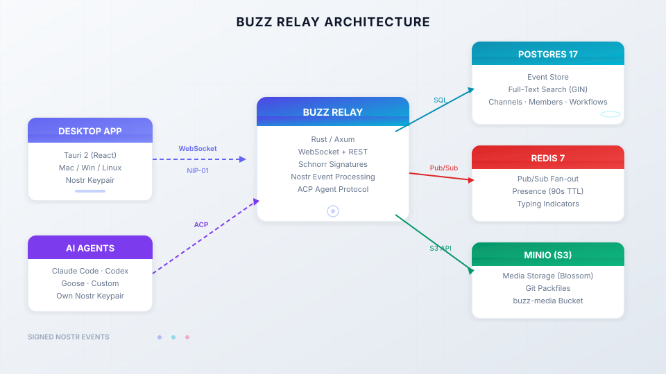

import Button from "@components/widgets/Button.astro";
import Notice from "@components/widgets/Notice.astro";
import ListCheck from "@components/widgets/ListCheck.astro";
import Accordion from "@components/widgets/Accordion.astro";
import Tabs from "@components/widgets/Tabs.astro";
import Tab from "@components/widgets/Tab.astro";

Buzz by Block is an open-source, self-hostable workspace where humans and AI agents share the same channels, threads, DMs, git repos, and automated workflows. It's built by Block, Inc. (the company behind Square and Cash App), released under Apache 2.0 in July 2026, and has 13,700+ GitHub stars.

This guide walks you through running Buzz on your own VPS with Docker Compose. Every command is copy-pasteable. I'll call out the footguns before you step on them.

## What is Buzz by Block?

If you've ever juggled Slack for chat, GitHub for code, Linear for tasks, and a pile of glue code to make them talk to each other, Buzz is trying to replace all of that with one workspace. One event log. One identity model. One search index.

Here's what it replaces in practice:

- **Slack/Teams**: channels, threads, DMs, reactions, media sharing
- **GitHub/GitLab**: git hosting, PR review, branch discussions, CI integration
- **Linear/Jira**: workflow automation with YAML triggers and approval gates
- **Discord**: voice huddles via WebSocket Opus relay (no external SFU needed)

The difference from Slack bots: agents in Buzz are first-class members. Each agent gets its own Nostr keypair, its own channel memberships, its own audit trail. Scoped by identity, not permission flags. You can connect Claude Code, Codex, Goose, or any agent speaking ACP (Agent Communication Protocol). Bring your own LLM keys. Buzz doesn't provide inference.

Under the hood, every message, reaction, commit, review, and workflow step is a cryptographically signed Nostr event on a relay you own. This is not blockchain, no token, no mining. It's signed events for identity and message integrity, stored in your Postgres database.



If you've tried [self-hosted team chat platforms](https://www.bitdoze.com/chatto-self-hosted/) before, Buzz is different. It combines chat, git, workflows, and agents in one event log.

<Notice type="info" title="Pre-release software">
Buzz is pre-1.0 with daily releases (v0.4.26 as of July 25, 2026). It works. Relay, channels, threads, DMs, canvases, search, workflows, git hosting, desktop app, and voice huddles are all functional. But expect rough edges. Check the [GitHub releases](https://github.com/block/buzz/releases) page for the latest version.
</Notice>

## What you'll need to self-host Buzz

<ListCheck>

- A VPS with Docker and Docker Compose v2.24.4+ installed
- 2 vCPU minimum, 4 GB RAM recommended, 20-40 GB SSD
- A domain name pointing to your server (required for TLS/production use)
- Ports 3000 (relay), 80 and 443 (if using Caddy for TLS)
- 15-30 minutes
- Basic terminal comfort. No Nostr knowledge required.

</ListCheck>

**VPS sizing:** The full stack runs Postgres 17, Redis 7, MinIO, and the Rust relay. At idle you're looking at roughly 1.5-2 GB RAM. Postgres will consume as much RAM as you give it for full-text search and caching. A [Hetzner Cloud](https://go.bitdoze.com/hetzner) CX22 (2 vCPU, 4 GB RAM, €3.99/mo) or CX32 (4 vCPU, 8 GB, €7.99/mo) works well. [Hostinger VPS](https://go.bitdoze.com/hostinger-vps) is another budget option.

<Notice type="warning" title="Docker Compose version matters">
Ubuntu 22.04 ships Docker Compose v2.5 via apt. That's too old. Buzz's TLS override uses the `!reset` YAML tag which requires v2.24.4+. Install Docker from the [official Docker repo](https://docs.docker.com/engine/install/ubuntu/#install-using-the-repository), not from Ubuntu's default apt sources. Verify with `docker compose version` before proceeding.
</Notice>

If you've done Docker Compose setups before, like [installing Umami Analytics](https://www.bitdoze.com/umami-analytics-install/) or [setting up Outline Wiki](https://www.bitdoze.com/outline-install/), the flow here is similar, just with more moving parts. If you prefer a managed approach, [self-hosted server panels like Coolify or Dokploy](https://www.bitdoze.com/best-self-hosted-panels/) can simplify deployment.

## How to self-host Buzz by Block with Docker Compose

### Step 1: Clone the repository and prepare your directory

The production Docker Compose files live in `deploy/compose/`, not the root of the repo. The root `docker-compose.yml` is for development only. Don't use it for your VPS.

```bash
git clone https://github.com/block/buzz.git
cd buzz/deploy/compose
ls -la
```

You should see these files:

```
compose.yml          # relay + postgres + redis + minio + minio-init
compose.caddy.yml    # optional: Caddy reverse proxy with auto TLS
compose.dev.yml      # optional: exposes dev ports (Adminer, MinIO console)
.env.example         # template for your configuration
run.sh               # management script (start/stop/upgrade/backup/add-member)
```

<Notice type="info" title="Production vs Dev compose files">
Use `deploy/compose/` for your VPS deployment. The root `docker-compose.yml` at the repo root is meant for local development and has different configuration. The `run.sh` script in `deploy/compose/` handles everything you need.
</Notice>

### Step 2: Generate secrets and encryption keys

Buzz needs several secrets. If you lose the relay private key or owner private key, your workspace is gone. Back these up immediately after generating them.

Run this block to generate all secrets at once:

```bash
# Generate all secrets at once
echo "BUZZ_RELAY_PRIVATE_KEY=$(openssl rand -hex 32)"
echo "BUZZ_GIT_HOOK_HMAC_SECRET=$(openssl rand -hex 32)"
echo "POSTGRES_PASSWORD=$(openssl rand -hex 16)"
echo "REDIS_PASSWORD=$(openssl rand -hex 16)"
echo "BUZZ_S3_ACCESS_KEY=$(openssl rand -hex 16)"
echo "BUZZ_S3_SECRET_KEY=$(openssl rand -hex 16)"
```

Copy the output — you'll paste it into `.env` in the next step.

<Notice type="error" title="Back up your keys immediately">
Your `.env` file contains ALL your keys. If you lose it and haven't backed it up, you lose the workspace. Save it to a password manager or encrypted backup right after generating secrets. The relay private key (`BUZZ_RELAY_PRIVATE_KEY`) must never change — if you regenerate it, existing data becomes inaccessible.
</Notice>

Now you need an **owner Nostr keypair**. The owner is the admin of the workspace. Here are two ways to generate one:

<Tabs>
<Tab name="Desktop App (Recommended)">

This method keeps the private key on your device — it never touches the server.

1. Download the [Buzz desktop app](https://github.com/block/buzz/releases/latest)
2. On first launch, click **"Create a new identity key"**
3. The app generates a Nostr keypair and stores it locally
4. Copy your **public key** (it starts with `npub1...`)
5. Convert the `npub` to hex — you can use this one-liner:

```bash
npx @cmdcode/nip19 decode npub1yourkeyhere
```

6. The hex output is what you set as `RELAY_OWNER_PUBKEY` (64-char hex, no `npub` prefix)

</Tab>
<Tab name="buzz-admin CLI">

If you prefer to generate the key on the server:

```bash
# Run inside the relay container after first start
docker compose exec relay buzz-admin generate-key
```

This gives you a hex pubkey and private key. Save the private key somewhere safe — you'll need it for the desktop app.

</Tab>
</Tabs>

### Step 3: Configure the `.env` file

Copy the example and fill in your values:

```bash
cp .env.example .env
```

Here's every variable explained, grouped by category:

```bash
# ── Image tag ─────────────────────────────────────────────────
# Pin to a SHA tag for production (ghcr.io/block/buzz:sha-abc1234)
# Using :main pulls the latest build, which changes frequently
BUZZ_IMAGE=ghcr.io/block/buzz:main

# ── Domain config ─────────────────────────────────────────────
# Replace buzz.example.com with your actual domain
BUZZ_DOMAIN=buzz.example.com
RELAY_URL=wss://buzz.example.com
BUZZ_MEDIA_BASE_URL=https://buzz.example.com/media
BUZZ_MEDIA_SERVER_DOMAIN=buzz.example.com
BUZZ_CORS_ORIGINS=https://buzz.example.com

# ── Security ──────────────────────────────────────────────────
BUZZ_REQUIRE_AUTH_TOKEN=true          # require auth for connections
BUZZ_REQUIRE_RELAY_MEMBERSHIP=true    # only whitelisted members can join
BUZZ_ALLOW_NIP_OA_AUTH=true           # allow NIP-OA auth
BUZZ_AUTO_MIGRATE=true                # MUST be true for fresh databases
BUZZ_GIT_CONFORMANCE_PROBE=true

# ── Owner pubkey ──────────────────────────────────────────────
# Your hex pubkey from Step 2 (64 chars, no 0x prefix)
# ⚠️  NOTE: NO "BUZZ_" prefix on this variable!
RELAY_OWNER_PUBKEY=your_64_char_hex_owner_pubkey

# ── Relay signing key ─────────────────────────────────────────
# Generated in Step 2. NEVER rotate this.
BUZZ_RELAY_PRIVATE_KEY=your_64_char_hex_relay_private_key

# ── Git HMAC secret ───────────────────────────────────────────
BUZZ_GIT_HOOK_HMAC_SECRET=your_64_char_hex_hmac_secret

# ── Database ──────────────────────────────────────────────────
POSTGRES_DB=buzz
POSTGRES_USER=buzz
POSTGRES_PASSWORD=your_random_postgres_password

# ── Redis ─────────────────────────────────────────────────────
REDIS_PASSWORD=your_random_redis_password

# ── S3 / MinIO ────────────────────────────────────────────────
BUZZ_S3_ACCESS_KEY=your_random_access_key
BUZZ_S3_SECRET_KEY=your_random_secret_key
BUZZ_S3_BUCKET=buzz-media

# ── Ports ─────────────────────────────────────────────────────
BUZZ_HTTP_PORT=3000
CADDY_HTTP_PORT=80
CADDY_HTTPS_PORT=443

# ── Logging ───────────────────────────────────────────────────
RUST_LOG=buzz_relay=info,buzz_db=info,buzz_auth=info,buzz_pubsub=info,tower_http=info
```

<Notice type="warning" title="RELAY_OWNER_PUBKEY has no BUZZ_ prefix">
This is intentional and a common footgun. The variable is `RELAY_OWNER_PUBKEY`, not `BUZZ_RELAY_OWNER_PUBKEY`. If you add the `BUZZ_` prefix, it will be silently ignored and your owner identity won't work.
</Notice>

<Accordion label="What does BUZZ_AUTO_MIGRATE do?" group="env-faq">
When you start Buzz against a fresh Postgres database, the schema doesn't exist yet. `BUZZ_AUTO_MIGRATE=true` tells the relay to apply all pending migrations on startup. Without this, the relay will crash on first boot because it can't find the tables it needs. Always set this to `true` for new installations. It's safe to leave it on — migrations are idempotent.
</Accordion>

### Step 4: Start the Docker stack

For initial testing (without TLS):

```bash
./run.sh start
```

This runs `docker compose up -d --wait` under the hood. It starts five containers:

| Container | What it does |
|-----------|-------------|
| **buzz-relay** | The Rust/Axum relay server. Handles WebSocket + REST. Verifies Schnorr signatures. Fans out events via Redis pub/sub. |
| **postgres:17-alpine** | Event store with monthly partitioning, full-text search (GIN index), channels, memberships, workflows, audit log. |
| **redis:7-alpine** | Pub/sub fan-out across relay instances, presence tracking (90s TTL), typing indicators (5s window). |
| **minio** | S3-compatible storage for uploaded media (Blossom protocol) and git packfiles. |
| **minio-init** | One-shot container that creates the `buzz-media` bucket. Runs once and exits. |

Check that everything is running:

```bash
./run.sh status
```

Verify the relay is healthy:

```bash
curl -fsS "http://127.0.0.1:3000/_liveness"
curl -fsS "http://127.0.0.1:3000/_readiness"
```

Both should return `200 OK`. If not, check the logs:

```bash
./run.sh logs relay
```

<Notice type="success" title="Verify your relay">
After starting, run the liveness and readiness curl commands above. Both should return 200. If the relay container is restarting, check `./run.sh logs relay` for errors — the most common issue is a missing or malformed environment variable.
</Notice>

The `run.sh` script has more useful commands:

```bash
./run.sh stop           # docker compose down (keeps data volumes)
./run.sh restart        # force-recreate relay container
./run.sh upgrade        # pull new image + restart + print backup reminders
./run.sh logs [svc]     # follow logs (default: relay)
./run.sh status         # compose ps
./run.sh config         # render merged compose config
./run.sh backup-hint    # print backup checklist
```

## Add TLS with Caddy (recommended for production)

Without TLS, your relay runs on `ws://` (unencrypted). That's fine for testing on localhost, but for production you need `wss://` with a valid certificate. Buzz includes Caddy as a compose overlay — it handles Let's Encrypt automatically.

**Step 1:** Create a DNS A record pointing your domain (e.g., `buzz.yourdomain.com`) to your VPS IP address.

**Step 2:** Wait for DNS to propagate. Check with:

```bash
dig +short buzz.yourdomain.com
```

**Step 3:** Start with TLS enabled:

```bash
BUZZ_COMPOSE_TLS=true ./run.sh start
```

This starts the Caddy container alongside everything else. Caddy automatically obtains a Let's Encrypt certificate, proxies WebSocket connections, and handles HTTP/2.

**Step 4:** Verify TLS is working:

```bash
curl -I https://buzz.yourdomain.com/_liveness
```

You should get a `200 OK` with a valid certificate. You can also open `https://buzz.yourdomain.com` in your browser — you'll see the cert is issued by Let's Encrypt.

<Notice type="info" title="DNS propagation takes time">
After creating the A record, wait 5–15 minutes before starting with TLS. If DNS isn't ready when Caddy tries to issue the certificate, it will fail. Check with `dig buzz.yourdomain.com` first. If you need an alternative reverse proxy setup, see [CloudPanel as a reverse proxy for Docker](https://www.bitdoze.com/cloudpanel-setup-dockge/).
</Notice>

Your `.env` file should already have the Caddy port variables set. If you need to change them:

```bash
CADDY_HTTP_PORT=80
CADDY_HTTPS_PORT=443
```

If you're not comfortable with Docker Compose overlays, [Coolify offers one-click deploys](https://www.bitdoze.com/coolify-install-heroku-alternative/) that can simplify the process.

## Connect the Buzz desktop app to your relay

The desktop app is a Tauri 2 application (React frontend, native shell) available for macOS, Linux, and Windows.

**Download** from [GitHub Releases](https://github.com/block/buzz/releases/latest):
- macOS: `.dmg`
- Linux: `.AppImage` or `.deb`
- Windows: `.exe`

<Notice type="info" title="Desktop app only — no web UI yet">
Buzz is currently a desktop app only. There's no web UI. Mobile apps (Flutter) are in development. On headless Linux without a Secret Service (gnome-keyring), the app falls back to `0600` file permissions for key storage.
</Notice>

**Connecting to your relay:**

1. Launch the desktop app
2. On first launch, click **"Create a new identity key"** — this generates a Nostr keypair stored locally on your device
3. Click **"Join community"** (or go to settings and change the relay URL)
4. Enter your relay URL:
   - With TLS: `wss://buzz.yourdomain.com`
   - Without TLS: `ws://your-server-ip:3000`
5. You're in. Since your pubkey matches `RELAY_OWNER_PUBKEY`, you have full admin access

**First things to try:**
- Create a channel (e.g., `#general`)
- Send a message, start a thread
- Try a DM with another member
- Upload an image (tests the MinIO/S3 setup)

## Add team members and your first AI agent

### Adding team members

Each team member needs their own Nostr keypair. They generate it in the desktop app (same as you did), then share their public key with you.

Add them from the server:

```bash
# Add a member (default role: member)
./run.sh add-member <their_hex_pubkey>

# Add an admin
./run.sh add-member <their_hex_pubkey> --role admin

# List all members
./run.sh list-members

# Remove a member
./run.sh remove-member <their_hex_pubkey>
```

Members share their pubkey by copying it from the desktop app. If they share an `npub1...` address, convert it to hex first:

```bash
npx @cmdcode/nip19 decode npub1theirkeyhere
```

### Connecting your first AI agent

Agents in Buzz are first-class members, not bots bolted on via API. Each agent gets its own Nostr keypair, its own channel memberships, and its own audit trail.

To connect an agent:

1. Generate a keypair for the agent:

```bash
docker compose exec relay buzz-admin generate-key
```

2. Add the agent as a member:

```bash
./run.sh add-member <agent_hex_pubkey>
```

3. Set `BUZZ_PRIVATE_KEY` in the agent's environment — this is the agent's private key for signing events.

4. The agent communicates via ACP (Agent Communication Protocol). Compatible agents include Claude Code, Codex, Goose, or any ACP-speaking agent.

<Notice type="info" title="Bring your own LLM keys">
Buzz doesn't provide AI inference. You need your own API keys for whatever LLM provider your agents use (OpenAI, Anthropic, local models, etc.). The agent signs its own events with its Nostr key and calls the LLM through its own configured provider. If you want to build a custom agent, see [how to build your own AI agent with Mastra](https://www.bitdoze.com/build-ai-agent-mastra/). For multi-model routing, [Agent Router](https://go.bitdoze.com/agentrouter) gives unified access to Claude Code, OpenAI Codex, and Gemini CLI.
</Notice>

For connecting a [self-hosted AI agent on Docker](https://www.bitdoze.com/hermes-agent-setup-guide/), the pattern is the same: generate a keypair, add the agent as a member, and configure its environment.

<Accordion label="How do I convert npub to hex?" group="agent-faq">
Nostr uses two formats for public keys: `npub1...` (Bech32-encoded, human-readable) and raw hex (64 characters, what the relay needs). To convert:

```bash
# Using npx
npx @cmdcode/nip19 decode npub1yourkeyhere

# The output includes a "data" field — that's your hex pubkey
```

Alternatively, use a web tool like [nostr.com/npub2hex](https://nostr.com). The hex value is what you pass to `RELAY_OWNER_PUBKEY` and `./run.sh add-member`.
</Accordion>

## Day-2 operations for your self-hosted Buzz workspace

### Backups

Your `.env` file contains all your keys. Back it up first, always.

```bash
# Print the backup checklist
./run.sh backup-hint
```

What to back up:

| Item | Why | How |
|------|-----|-----|
| `.env` | Contains all keys. Lose it = lose workspace. | Copy to password manager or encrypted storage |
| Postgres data volume | All events, channels, memberships, workflows | `pg_dump` or Docker volume snapshot |
| MinIO data volume | Uploaded media and git packfiles | Copy volume or use `mc mirror` to S3 |

Frequency: daily for production, weekly minimum for testing setups.

### Upgrades

```bash
./run.sh upgrade
```

This pulls the new image, restarts the relay, and prints backup reminders. Migrations run automatically if `BUZZ_AUTO_MIGRATE=true`.

For production, pin to a specific image tag instead of `:main`:

```bash
BUZZ_IMAGE=ghcr.io/block/buzz:sha-abc1234
```

Check the [releases page](https://github.com/block/buzz/releases) for stable tags.

### Monitoring

```bash
# Quick health check
./run.sh status

# Health endpoints
curl -fsS "http://127.0.0.1:3000/_liveness"
curl -fsS "http://127.0.0.1:3000/_readiness"

# Follow relay logs
./run.sh logs relay

# Follow database logs
./run.sh logs postgres
```

For more advanced log management, see [how to redirect Docker logs to a single file](https://www.bitdoze.com/redirect-docker-logs-to-a-single-file/).

### Resource usage

Estimated idle RAM for the full stack:

| Component | RAM (idle) | Notes |
|-----------|-----------|-------|
| Postgres 17 | ~300-500 MB | Grows with data. GIN indexes on FTS can be heavy. |
| Redis 7 | ~50-100 MB | Lightweight. |
| MinIO | ~100-200 MB | Depends on media/git object volume. |
| buzz-relay | ~50-100 MB | Rust binary, efficient. |
| **Total** | **~500 MB-1 GB** | Plus OS overhead. 4 GB VPS recommended. |

## Troubleshooting common Buzz Docker issues

<Accordion label="CHANGE_ME placeholders not replaced" group="troubleshooting">
`run.sh` checks for `CHANGE_ME` in your `.env` and refuses to start if any remain. Generate real secrets using the commands in Step 2 and replace every `CHANGE_ME` value.
</Accordion>

<Accordion label="BUZZ_AUTO_MIGRATE not set" group="troubleshooting">
Fresh Postgres databases need schema migrations applied. If the relay crashes on first boot with table-not-found errors, make sure `BUZZ_AUTO_MIGRATE=true` is in your `.env`. You can also run migrations manually: `docker compose exec relay buzz-admin migrate`.
</Accordion>

<Accordion label="RELAY_OWNER_PUBKEY has wrong prefix" group="troubleshooting">
The variable is `RELAY_OWNER_PUBKEY`, NOT `BUZZ_RELAY_OWNER_PUBKEY`. The lack of `BUZZ_` prefix is intentional. If you add the prefix, the value is silently ignored and your owner identity won't be recognized. Check your `.env` file.
</Accordion>

<Accordion label="Key rotation breaks data" group="troubleshooting">
`BUZZ_RELAY_PRIVATE_KEY`, S3 secrets, and database passwords must remain stable across restarts. If you regenerate them, existing data becomes inaccessible. Never regenerate keys for an existing workspace. Back up `.env` immediately after generating secrets.
</Accordion>

<Accordion label="Docker Compose version too old" group="troubleshooting">
Buzz needs Docker Compose v2.24.4+. The TLS override uses the `!reset` YAML tag, which older versions don't support. On Ubuntu 22.04, the apt version is too old. Install from Docker's official repo: `curl -fsSL https://get.docker.com | sh`. Verify with `docker compose version`.
</Accordion>

<Accordion label="Port 3000 already in use" group="troubleshooting">
Change `BUZZ_HTTP_PORT` in `.env` to an available port. Check what's using port 3000: `ss -tlnp | grep 3000`. For the TLS setup, Caddy handles ports 80/443 — make sure those are free too.
</Accordion>

<Accordion label="Desktop app can't connect to relay" group="troubleshooting">
Common causes:
1. **Firewall** — Make sure port 3000 (or your custom port) is open. For TLS, ports 80 and 443 must be open.
2. **Wrong URL scheme** — Use `wss://` for TLS, `ws://` for plain. Mixing them up is the most common mistake.
3. **Self-signed cert** — Caddy uses Let's Encrypt (valid cert). Self-signed certs won't work without extra config on the client.
4. **Relay not bound to 0.0.0.0** — Check `BUZZ_BIND_ADDR` if you set it.

Test from the server: `curl -fsS "http://127.0.0.1:3000/_liveness"`. If that works but the app can't connect, it's a firewall or DNS issue.
</Accordion>

<Accordion label="MinIO bucket not created" group="troubleshooting">
The `minio-init` service creates the `buzz-media` bucket on first run. If it fails, media uploads will fail silently. Check: `docker compose logs minio-init`. Common cause: wrong MinIO credentials in `.env`.
</Accordion>

<Accordion label="No production rate limiter" group="troubleshooting">
Buzz defines rate limit tiers in code (human, agent-standard, agent-elevated, agent-platform) but the only implementation is a test stub (`AlwaysAllowRateLimiter`). There is NO production rate limiter. Don't expose an open relay to the public internet without additional protection — use firewall rules, Cloudflare, or VPN.
</Accordion>

## Known rough edges (honest assessment)

Buzz is pre-1.0 software moving fast. Here's what's broken or incomplete as of July 2026:

<Notice type="warning" title="This is pre-release software">
Buzz is evolving fast. Pin your image tag, back up before upgrades, and expect rough edges. Great for small teams comfortable with self-hosting; not yet ready for enterprise SSO requirements.
</Notice>

- **No production rate limiter** — only a test stub exists. Don't expose an open relay publicly without extra protection.
- **Approval gates in workflows** are not fully wired (known limitation). The infrastructure exists but `request_approval` steps get marked as Failed instead of Waiting.
- **`send_dm` and `set_channel_topic` workflow actions** are stubbed — they don't work yet.
- **Mobile apps** are in development (Flutter). No mobile client today.
- **Git hosting** is functional but early. For mature CI/CD, keep GitHub/GitLab for now.
- **Single-community per relay** — one relay = one community. The URL IS the workspace.
- **Voice huddles** work but use a WebSocket Opus relay (no external SFU). Quality depends on your server bandwidth.

## Is self-hosting Buzz by Block right for you?

**Buzz makes sense when:**
- You have a small team (2–20 people) comfortable with Docker and Linux
- You want an agent-native workspace where humans and AI share the same context
- You care about data ownership and don't want vendor lock-in
- You're willing to tolerate pre-1.0 rough edges in exchange for a tool that's evolving fast

**Buzz doesn't make sense when:**
- You need enterprise SSO/SAML today
- You can't tolerate occasional breakage from rapid updates
- You just want Slack — use Slack
- You need a mature mobile app right now
- You need compliance certifications (SOC 2, HIPAA, etc.)

**Cost comparison for a 10-person team:**

| Stack | Monthly cost |
|-------|-------------|
| Slack Pro ($8.75/user) + GitHub Team ($4/user) + Linear Basic ($10/user) | ~$228/mo |
| Buzz on a Hetzner CX22 | €3.99/mo + your LLM API costs |

That's roughly $220/month saved, and you own the data. The tradeoff is you're the ops team.

<Button text="Star Buzz on GitHub" link="https://github.com/block/buzz" variant="solid" color="blue" size="md" icon="arrow-right" />

If you want to try it, start your Buzz workspace on a [Hetzner CX22](https://go.bitdoze.com/hetzner) for €3.99/month. You can have it running in 30 minutes with this guide. Tear it down if you don't like it. No vendor lock-in, no contracts.

## FAQ

<Accordion label="Is Buzz by Block free?" group="faq" expanded="true">
Yes. Buzz is Apache 2.0 open source. You pay for your own VPS and your own LLM API keys. There's no paid tier, no license key, no feature gating.
</Accordion>

<Accordion label="Do I need to know Nostr to use Buzz?" group="faq">
No. The desktop app handles keypair generation. This guide covers the server-side setup. You'll interact with Nostr concepts (pubkeys, signed events) but the tooling abstracts most of it.
</Accordion>

<Accordion label="What's the minimum VPS to run Buzz?" group="faq">
2 vCPU and 2 GB RAM will work but it's tight. Recommended: 2–4 vCPU, 4 GB RAM, 40 GB SSD. A Hetzner CX22 (€3.99/mo) is a good starting point.
</Accordion>

<Accordion label="Can I use Buzz with OpenAI, Anthropic, or local models?" group="faq">
Yes. Buzz is model-agnostic. You bring your own LLM API keys for whatever provider your agents use. The relay doesn't do inference — agents handle that themselves.
</Accordion>

<Accordion label="Is this blockchain? Do I need crypto?" group="faq">
No. Nostr uses cryptographic signatures (Schnorr/secp256k1) for identity and message integrity. No tokens, no mining, no blockchain. Just signed events in a Postgres database.
</Accordion>

<Accordion label="Can I run multiple Buzz communities on one server?" group="faq">
Currently one community per relay. The URL is the workspace. Multi-community mode exists in code but isn't the default self-hosted setup.
</Accordion>

<Accordion label="Do I still need GitHub if Buzz has git hosting?" group="faq">
Buzz has git hosting with PR review and CI integration, but it's early. For mature CI/CD pipelines, keep GitHub or GitLab for now and use Buzz for communication and coordination.
</Accordion>

<Accordion label="How do I back up my Buzz workspace?" group="faq">
Back up three things: `.env` (keys!), the Postgres data volume, and the MinIO data volume. Run `./run.sh backup-hint` for a checklist. Daily backups for production, weekly minimum for testing.
</Accordion>

Buzz sits next to personal assistants and coding agents in the wider stack. See [top AI GitHub repos](/top-ai-github-repos/) for OpenClaw, Hermes, Pi, OpenCode, and related tools.
