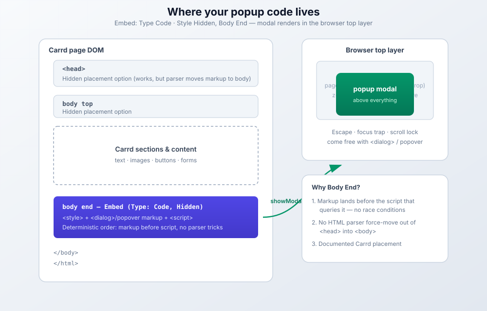
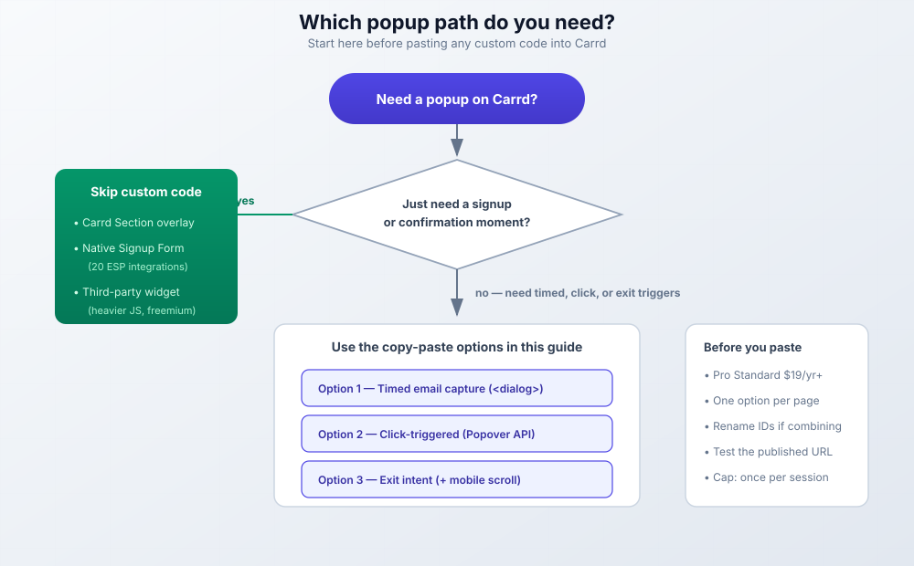

import Button from "@components/widgets/Button.astro";
import { Picture } from "astro:assets";
import Notice from "@components/widgets/Notice.astro";
import ListCheck from "@components/widgets/ListCheck.astro";
import Accordion from "@components/widgets/Accordion.astro";
import Tabs from "@components/widgets/Tabs.astro";
import Tab from "@components/widgets/Tab.astro";
import imag1 from "../../assets/images/24/02/carrd-back-to-top-embed.png";

Popups get a bad reputation, mostly because people abuse them. But a well-timed modal can capture emails, announce sales, or surface something urgent without cluttering your main page. Timing and restraint matter more than the code.

Adding a popup modal to a Carrd website takes one Embed element and some copy-paste code. Carrd has no built-in popup feature (nothing popup-related in the visible changelog through September 2026), so this Carrd popup modal guide gives you three working versions (timed email capture, click-triggered, and exit-intent) built on the modern `<dialog>` element and the Popover API instead of the div-and-z-index hacks from a few years ago.

[Carrd](https://go.bitdoze.com/carrd) keeps things simple on purpose. That's fine. An Embed element is all you need here.

<Button link="https://go.bitdoze.com/carrd" text="Build on Carrd" />

Some Carrd tutorials:

- [Add Smooth Scroll to Carrd](https://www.bitdoze.com/carrd-smooth-scroll/)
- [Add Testimonial Slider to Carrd](https://www.bitdoze.com/carrd-testimonial-slider/)
- [Add Dark Mode Toggle to Carrd](https://www.bitdoze.com/carrd-dark-mode-toggle/)
- [Add Floating Menu to Carrd](https://www.bitdoze.com/carrd-floating-menu/)
- [Add Sidebar Menu to Carrd](https://www.bitdoze.com/carrd-sidebar-menu/)
- [Add a Sticky Header to Carrd](https://www.bitdoze.com/add-stickey-header-carrd/)

> The complete list with Carrd plugins, themes and tutorials you can find on my **[carrdme.com](https://carrdme.com/)** website.

## Why add popups to your Carrd site

Popups work for specific jobs:

1. Email capture. Grow your newsletter list without dedicating prime page space to signup forms.
2. Announcements. Tell visitors about sales, new products, or updates worth knowing.
3. Image lightboxes. Show larger versions of portfolio images or product photos.
4. Exit intent. Catch visitors before they leave with a final offer.
5. Welcome messages. Greet first-time visitors or flag something urgent.

Use them thoughtfully. Don't pop up the second someone lands on your page. Give them a few seconds to look around first.

Frequency capping matters as much as timing. All the code below uses `sessionStorage`, so a visitor sees the popup once per browser session. Swap in `localStorage` (with an expiry timestamp) if you want once per week instead. That decision lives in the code. You don't need a plugin for it.

## Which Carrd plan do you need?

<Notice type="warning" title="You need Carrd Pro Standard ($19/yr) or higher">
Embeds (the element that makes any Carrd popup modal possible) require <strong>Pro Standard ($19/yr, 10 sites)</strong> or higher. Free and Pro Lite ($9/yr) accounts cannot add custom code at all, so if you're on those tiers, nothing in this tutorial will render. <strong>Pro Plus ($49/yr, 25 sites)</strong> adds Advanced Settings: custom IDs and attributes plus Button <strong>On Click</strong> events, which give you cleaner trigger buttons for Option 2.
</Notice>

Pricing checked against Carrd's Pro page in September 2026. Site-count variants exist if you run more sites: Standard is $39/yr for 25 sites, $69/yr for 50, $119/yr for 100. The $19/yr tier is enough for most solo operators.

This is the main cost of the whole setup. The popup code itself is free; $19/year is the entry ticket for Carrd Pro Standard embeds. I break down every Carrd plan in my [Carrd review](https://www.bitdoze.com/carrd-review/).

If you only need a signup form or a confirmation overlay and the price feels like overkill for custom code, jump to "Do you even need custom code?" below. There are paths that skip the Embed element entirely.

<Button link="https://go.bitdoze.com/carrd" text="See Carrd plans" variant="outline" />

## How to add a popup modal to Carrd

The setup is the same for all three options. One Embed element holds your HTML, CSS, and a little JavaScript. Then you pick the popup type that matches your goal.

### Step 1: Add an Embed element

In the Carrd editor, hit the `+` sign and add an Embed element anywhere on the page (placement in the visual editor doesn't matter; we'll set the real placement in the settings). Configure it like this:

- **Type:** Code
- **Style:** Hidden, **Body End**

<Picture formats={["webp"]} fallbackFormat="webp" src={imag1} alt="Carrd embed element settings showing Type set to Code and Style set to Hidden, Body End" />

<Notice type="info" title="Type must be Code">
Set Type to <strong>Code</strong>, not Iframe. The popup markup, styles, and script all live in this one embed. Carrd explicitly allows <code>&lt;style&gt;</code> and <code>&lt;script&gt;</code> tags here.
</Notice>

Hidden embeds can go in the Head, Body Top, or Body End. Head works, but injecting `<div>` markup into `<head>` only functions because the HTML parser force-moves it into `<body>`. Fragile and confusing when you're debugging. Body End gives you deterministic DOM order: your markup lands before the script that queries it, no parser tricks. That's the default I recommend for every Carrd embed popup.



Once you paste the code (next step), publish and check the live URL. That's where the real Carrd popup code testing happens. More on that in the verify section.

### Step 2: Choose your popup type

Three versions, three jobs. Pick one per page.

<ListCheck>
<ul>
<li>Grow a newsletter → Option 1, timed email capture popup (shows after a delay)</li>
<li>Show details, terms, or an offer on demand → Option 2, click-triggered popup</li>
<li>Last-chance desktop offer → Option 3, exit intent popup (with a mobile scroll fallback)</li>
</ul>
</ListCheck>

<Notice type="warning" title="Don't mix options blindly">
Each option ships with its own element IDs (<code>emailModal</code>, <code>svcModal</code>, <code>exitModal</code>). Pasting two options into the same site without renaming IDs and function names will break both. If you really want two popups, rename every ID and function in the second block first.
</Notice>

---

## Option 1: Timed email capture popup

This popup appears after a delay and includes an email signup form. It's the right default for newsletter growth. It's the classic Carrd email popup.

The version below uses the native `<dialog>` element and `showModal()`. That buys you a lot for free: Escape closes it, focus is trapped inside the modal while it's open, the background page can't scroll (including iOS Safari), and it renders in the browser's top layer so no z-index fighting with Carrd's markup. Browser support is universal since Firefox 98 and Safari 15.4 (March 2022) per MDN's compat data, checked September 2026.

```html
<style>
  :root {
    --popup-bg: #ffffff;
    --popup-overlay: rgba(0, 0, 0, 0.6);
    --popup-accent: #4f46e5;
    --popup-text: #1f2937;
    --popup-secondary: #6b7280;
    --popup-radius: 16px;
    --popup-width: 450px;
    --popup-delay: 3000; /* ms before the popup shows; keep in sync with setTimeout() */
  }

  dialog#emailModal {
    border: 0;
    border-radius: var(--popup-radius);
    padding: 0;
    max-width: var(--popup-width);
    width: 90%;
    background: var(--popup-bg);
    color: var(--popup-text);
    box-shadow: 0 25px 50px -12px rgba(0, 0, 0, 0.25);
  }

  dialog#emailModal::backdrop {
    background: var(--popup-overlay);
  }

  @media (prefers-reduced-motion: no-preference) {
    dialog#emailModal[open] {
      animation: modalIn 0.3s ease;
    }

    @keyframes modalIn {
      from {
        opacity: 0;
        transform: scale(0.8);
      }
      to {
        opacity: 1;
        transform: scale(1);
      }
    }
  }

  .modal-inner {
    padding: 40px;
    position: relative;
  }

  .modal-close {
    position: absolute;
    top: 15px;
    right: 15px;
    width: 32px;
    height: 32px;
    border: none;
    background: #f3f4f6;
    border-radius: 50%;
    cursor: pointer;
    font-size: 20px;
    color: var(--popup-secondary);
    display: flex;
    align-items: center;
    justify-content: center;
    transition: background 0.2s;
  }

  .modal-close:hover {
    background: #e5e7eb;
  }

  .modal-title {
    font-size: 24px;
    font-weight: 700;
    color: var(--popup-text);
    margin: 0 0 10px 0;
    text-align: center;
  }

  .modal-description {
    font-size: 16px;
    color: var(--popup-secondary);
    margin: 0 0 25px 0;
    text-align: center;
    line-height: 1.5;
  }

  .modal-form {
    display: flex;
    flex-direction: column;
    gap: 15px;
  }

  .modal-input {
    padding: 14px 18px;
    border: 2px solid #e5e7eb;
    border-radius: 10px;
    font-size: 16px;
    transition: border-color 0.2s;
    outline: none;
  }

  .modal-input:focus {
    border-color: var(--popup-accent);
  }

  .modal-button {
    padding: 14px 24px;
    background: var(--popup-accent);
    color: white;
    border: none;
    border-radius: 10px;
    font-size: 16px;
    font-weight: 600;
    cursor: pointer;
    transition: background 0.2s, transform 0.1s;
  }

  .modal-button:hover {
    background: #4338ca;
    transform: translateY(-1px);
  }

  .modal-note {
    font-size: 13px;
    color: var(--popup-secondary);
    text-align: center;
    margin: 15px 0 0 0;
  }

  /* Honeypot: real visitors never see or fill this field */
  .modal-hp {
    position: absolute;
    left: -9999px;
  }

  @media (max-width: 480px) {
    .modal-inner {
      padding: 30px 20px;
    }

    .modal-title {
      font-size: 20px;
    }
  }
</style>

<dialog id="emailModal" aria-labelledby="emailModalTitle">
  <div class="modal-inner">
    <button class="modal-close" aria-label="Close"
            onclick="document.getElementById('emailModal').close()">×</button>
    <h2 class="modal-title" id="emailModalTitle">Get Weekly Tips</h2>
    <p class="modal-description">Practical advice for your site, delivered to your inbox every week.</p>
    <form class="modal-form" action="YOUR_FORM_ENDPOINT" method="POST" target="_blank">
      <input type="text" name="website" class="modal-hp" tabindex="-1" autocomplete="off" aria-hidden="true">
      <input type="email" name="email" class="modal-input" placeholder="Enter your email" required>
      <button type="submit" class="modal-button">Subscribe</button>
    </form>
    <p class="modal-note">No spam. Unsubscribe anytime.</p>
  </div>
</dialog>

<script>
  const dlg = document.getElementById('emailModal');

  // Show once per session. The flag is set when the popup is SHOWN,
  // not when it closes, so a visitor who navigates away mid-popup
  // doesn't get ambushed again on the next page.
  if (!sessionStorage.getItem('modalShown')) {
    setTimeout(function () {
      dlg.showModal();
      sessionStorage.setItem('modalShown', 'true');
    }, 3000); /* keep in sync with --popup-delay */
  }

  // Backdrop click closes. The click target is the <dialog> element itself
  // (the .modal-inner wrapper covers the dialog box, so only true backdrop
  // clicks land here).
  dlg.addEventListener('click', function (e) {
    if (e.target === dlg) dlg.close();
  });

  // Escape handling and scroll locking are native with <dialog>.
  // No keydown handler needed.
</script>
```

### Customization options

To change the delay, update both `--popup-delay` (documentation) and the `setTimeout(..., 3000)` call. 3000 = 3 seconds. On mobile, 4 to 5 seconds converts better than 1 to 2; people are still orienting.

Everything runs off the CSS variables at the top for colors: `--popup-accent` is the button, `--popup-bg` the card, `--popup-text` the heading, `--popup-secondary` the supporting text.

To connect your email service, replace `YOUR_FORM_ENDPOINT` with the form action URL from your email provider. The form opens the provider's confirmation page in a new tab (`target="_blank"`) so visitors don't get yanked off your site. If your provider's endpoint supports CORS, you can `fetch()` it and show an inline thank-you instead. That path is provider-specific. Verify it before shipping. One field to leave alone: `website` is a honeypot. Bots fill it, humans don't, so reject submissions where it's non-empty.

### Troubleshooting

- **Popup shows in the editor preview but not on the live site (or the reverse).** Embed code behaves differently between builder and published pages. Always test the published URL in a fresh incognito window.
- **Nothing renders at all.** Three checks: Type is **Code** (not Iframe), Style is **Hidden**, and your plan is Pro Standard or higher. Free and Pro Lite accounts silently drop custom code.
- **Popup repeats on every page.** The `sessionStorage.setItem('modalShown', 'true')` line must run in the show path (right after `showModal()`). Running it in a close handler alone is not enough. The code above does this correctly. If you edited it, check you didn't move it.
- **Form posts but nothing arrives in your ESP.** The action URL is wrong or incomplete. Compare it character-by-character with the endpoint your provider gives you, and check the provider's submission log before assuming the popup is broken.
- **Background still scrolls behind the popup.** Not possible with `showModal()` because it blocks scrolling natively. This only bites you if you use the legacy div-based approach.

<Accordion label="Need a legacy div-based version for ancient browsers?">
<p><code>&lt;dialog&gt;</code> is supported in every browser released since March 2022. Unless you have analytics showing a meaningful share of pre-2022 browsers, don't bother.</p>
<p>If you must support them, build the overlay with two nested <code>div</code> elements and a <code>.active</code> class toggle, like earlier versions of this guide used. Three things to add so it stays usable:</p>
<p>1. Accessibility: <code>role="dialog"</code>, <code>aria-modal="true"</code>, and <code>aria-labelledby</code> pointing at the title; move focus to the close button on open and restore it on close.</p>
<p>2. Scroll lock: <code>document.body.style.overflow = 'hidden'</code> fails on iOS Safari. Use the <code>position: fixed</code> body pattern there instead.</p>
<p>3. Animations: wrap every transition and keyframe in <code>@media (prefers-reduced-motion: no-preference)</code> and add <code>z-index: 9999</code> so the overlay clears Carrd's markup.</p>
</Accordion>

---

## Option 2: Click-triggered popup

This popup opens when the visitor clicks a button. Better for product details, terms, pricing tables, or anything too long for the main page. If you've used a [floating WhatsApp chat button](https://www.bitdoze.com/carrd-whatsapp-button/) on Carrd, the interaction model is the same: a persistent trigger the visitor chooses to press.

The rewrite below uses the Popover API. The result is a Carrd popup without JavaScript: the trigger button talks to the popover through the `popovertarget` attribute, light-dismiss (click outside) is native, Escape works natively, and the panel renders in the top layer. Browser support: Chrome/Edge 114+, Safari 17+, Firefox 125+ (MDN compat data, checked September 2026). Safe on any evergreen browser.

```html
<style>
  :root {
    --click-popup-bg: #ffffff;
    --click-popup-overlay: rgba(0, 0, 0, 0.7);
    --click-popup-accent: #10b981;
    --click-popup-text: #111827;
    --click-popup-radius: 20px;
  }

  [popover]#svcModal {
    border: 0;
    border-radius: var(--click-popup-radius);
    max-width: 600px;
    width: 100%;
    max-height: 80vh;
    overflow-y: auto;
    padding: 0;
    background: var(--click-popup-bg);
    color: var(--click-popup-text);
  }

  [popover]#svcModal::backdrop {
    background: var(--click-popup-overlay);
  }

  @media (prefers-reduced-motion: no-preference) {
    [popover]#svcModal:popover-open {
      animation: slideUp 0.3s ease;
    }

    @keyframes slideUp {
      from {
        opacity: 0;
        transform: translateY(30px);
      }
      to {
        opacity: 1;
        transform: translateY(0);
      }
    }
  }

  .click-modal-header {
    padding: 25px 30px;
    border-bottom: 1px solid #e5e7eb;
    display: flex;
    justify-content: space-between;
    align-items: center;
  }

  .click-modal-title {
    font-size: 22px;
    font-weight: 700;
    color: var(--click-popup-text);
    margin: 0;
  }

  .click-modal-close {
    width: 36px;
    height: 36px;
    border: none;
    background: #f3f4f6;
    border-radius: 50%;
    cursor: pointer;
    font-size: 22px;
    color: #6b7280;
    display: flex;
    align-items: center;
    justify-content: center;
  }

  .click-modal-close:hover {
    background: #e5e7eb;
  }

  .click-modal-body {
    padding: 30px;
    color: #4b5563;
    line-height: 1.7;
  }

  .click-modal-body h3 {
    color: var(--click-popup-text);
    margin: 0 0 15px 0;
    font-size: 18px;
  }

  .click-modal-body p {
    margin: 0 0 20px 0;
  }

  .click-modal-body ul {
    margin: 0 0 20px 0;
    padding-left: 20px;
  }

  .click-modal-body li {
    margin-bottom: 10px;
  }

  .click-modal-footer {
    padding: 20px 30px;
    border-top: 1px solid #e5e7eb;
    text-align: right;
  }

  .click-modal-btn {
    padding: 12px 28px;
    background: var(--click-popup-accent);
    color: white;
    border: none;
    border-radius: 10px;
    font-size: 16px;
    font-weight: 600;
    cursor: pointer;
  }

  .click-modal-btn:hover {
    opacity: 0.9;
  }

  /* Trigger button: used when the trigger lives inside the embed */
  .popup-trigger {
    padding: 14px 28px;
    background: var(--click-popup-accent);
    color: white;
    border: none;
    border-radius: 10px;
    font-size: 16px;
    font-weight: 600;
    cursor: pointer;
    transition: transform 0.2s;
  }

  .popup-trigger:hover {
    transform: translateY(-2px);
  }
</style>

<!-- Trigger: popovertarget must match the popover id exactly -->
<button class="popup-trigger" type="button" popovertarget="svcModal">Learn More</button>

<div id="svcModal" popover aria-label="Service details">
  <div class="click-modal-header">
    <h2 class="click-modal-title">Service Details</h2>
    <button class="click-modal-close" aria-label="Close"
            popovertarget="svcModal" popovertargetaction="hide">×</button>
  </div>
  <div class="click-modal-body">
    <h3>What's Included</h3>
    <ul>
      <li>Full website design and development</li>
      <li>Mobile-responsive layout</li>
      <li>SEO optimization</li>
      <li>2 rounds of revisions</li>
      <li>30 days of support after launch</li>
    </ul>
    <p>Turnaround time is typically 2-3 weeks depending on project complexity. We'll discuss your specific needs during our initial consultation.</p>
  </div>
  <div class="click-modal-footer">
    <button class="click-modal-btn" popovertarget="svcModal" popovertargetaction="hide">Got It</button>
  </div>
</div>
```

No `<script>` block. The default `popover` behavior (`popover="auto"`) gives you light-dismiss, Escape, and top-layer rendering on its own. This is as lean as a Carrd dialog gets.

### Adding the trigger button

Three ways to wire the trigger, ordered by how much I trust them:

1\. Trigger button inside the embed (Pro Standard, works everywhere). The `<button popovertarget="svcModal">` in the code above is part of the embed markup. Paste the whole block, publish, done. Zero JavaScript, zero Pro Plus requirement.

2\. Native Carrd button + Events (Pro Plus). Want Carrd's own button styling? On Pro Plus, add a native Button element, set its URL to `browser:none`, then open Settings → Events → On Click and run:

```html
document.getElementById('svcModal').showPopover();
```

Pro Plus Advanced Settings also lets you put `popovertarget="svcModal"` directly on the native button as a custom attribute. Both are documented Carrd behavior. This is the clean path if you have the plan.

3\. `javascript:` URLs, undocumented. Use at your own risk. Putting `javascript:document.getElementById('svcModal').showPopover()` in a button's URL field can work, but `javascript:` is not one of Carrd's documented URL types (the documented list covers site/email/phone/sms/skype/browser/section/scroll-point/clipboard/copy as of September 2026).

<Notice type="warning" title="javascript: URLs are undocumented">
Carrd can drop or block <code>javascript:</code> URLs without warning or a changelog entry. If you use this trick, test it on the live site before sharing the link, and re-test after every Carrd update. Prefer path 1 or 2.
</Notice>

If the trigger does nothing, `popovertarget` and the popover `id` must match exactly, including case. `popovertarget="svcModal"` pairs with `id="svcModal"`. One typo and the button is inert.

---

## Option 3: Exit intent popup

This popup fires when a desktop visitor moves the cursor toward the browser chrome. The last chance to capture their attention before the tab closes. Good for a discount or a lead magnet.

Detection uses `mouseleave` on the document element with a `clientY <= 0` guard (the old `mouseout` + `e.toElement` approach leaned on a deprecated property). The offer card keeps its gradient design. The `exitModalShown` flag is set when the popup is shown and checked before showing, so it fires at most once per session.

```html
<style>
  :root {
    --exit-popup-bg: linear-gradient(135deg, #667eea 0%, #764ba2 100%);
    --exit-popup-card: #ffffff;
    --exit-popup-text: #1f2937;
  }

  .exit-modal-overlay {
    position: fixed;
    top: 0;
    left: 0;
    width: 100%;
    height: 100%;
    background: rgba(0, 0, 0, 0.8);
    display: none;
    justify-content: center;
    align-items: center;
    z-index: 9999;
    padding: 20px;
  }

  .exit-modal-overlay.active {
    display: flex;
  }

  .exit-modal-content {
    background: var(--exit-popup-bg);
    border-radius: 24px;
    max-width: 500px;
    width: 100%;
    padding: 50px 40px;
    position: relative;
    text-align: center;
  }

  @media (prefers-reduced-motion: no-preference) {
    .exit-modal-overlay.active .exit-modal-content {
      animation: bounceIn 0.4s ease;
    }

    @keyframes bounceIn {
      0% {
        opacity: 0;
        transform: scale(0.5);
      }
      70% {
        transform: scale(1.05);
      }
      100% {
        opacity: 1;
        transform: scale(1);
      }
    }
  }

  .exit-modal-close {
    position: absolute;
    top: 15px;
    right: 15px;
    width: 36px;
    height: 36px;
    border: none;
    background: rgba(255, 255, 255, 0.2);
    border-radius: 50%;
    cursor: pointer;
    font-size: 20px;
    color: white;
  }

  .exit-modal-close:hover {
    background: rgba(255, 255, 255, 0.3);
  }

  .exit-modal-emoji {
    font-size: 60px;
    margin-bottom: 20px;
  }

  .exit-modal-title {
    font-size: 28px;
    font-weight: 700;
    color: white;
    margin: 0 0 15px 0;
  }

  .exit-modal-description {
    font-size: 18px;
    color: rgba(255, 255, 255, 0.9);
    margin: 0 0 30px 0;
    line-height: 1.6;
  }

  .exit-modal-cta {
    padding: 16px 40px;
    background: white;
    color: #667eea;
    border: none;
    border-radius: 12px;
    font-size: 18px;
    font-weight: 700;
    cursor: pointer;
    transition: transform 0.2s;
    margin-bottom: 15px;
  }

  .exit-modal-cta:hover {
    transform: scale(1.05);
  }

  .exit-modal-skip {
    background: none;
    border: none;
    color: rgba(255, 255, 255, 0.7);
    font-size: 14px;
    cursor: pointer;
    text-decoration: underline;
  }

  .exit-modal-skip:hover {
    color: white;
  }

  @media (max-width: 480px) {
    .exit-modal-content {
      padding: 40px 25px;
    }

    .exit-modal-title {
      font-size: 24px;
    }
  }
</style>

<div class="exit-modal-overlay" id="exitModal" role="dialog" aria-modal="true" aria-labelledby="exitModalTitle">
  <div class="exit-modal-content">
    <button class="exit-modal-close" id="exitModalClose" aria-label="Close" onclick="closeExitModal()">×</button>
    <div class="exit-modal-emoji" aria-hidden="true">👋</div>
    <h2 class="exit-modal-title" id="exitModalTitle">Wait! Before You Go...</h2>
    <p class="exit-modal-description">Get 20% off your first order when you sign up for our newsletter.</p>
    <button class="exit-modal-cta" onclick="window.location.href='#signup'">Claim My Discount</button>
    <br>
    <button class="exit-modal-skip" onclick="closeExitModal()">No thanks, I'll pay full price</button>
  </div>
</div>

<script>
  let exitShown = false;

  function showExitModal() {
    var overlay = document.getElementById('exitModal');
    overlay.classList.add('active');
    document.body.style.overflow = 'hidden';
    sessionStorage.setItem('exitModalShown', 'true'); // set on SHOW
    exitShown = true;
    document.getElementById('exitModalClose').focus();
  }

  function closeExitModal() {
    document.getElementById('exitModal').classList.remove('active');
    document.body.style.overflow = '';
  }

  // Click on the overlay backdrop closes
  document.getElementById('exitModal').addEventListener('click', function (e) {
    if (e.target === this) closeExitModal();
  });

  // Escape only acts when the modal is open
  document.addEventListener('keydown', function (e) {
    if (e.key === 'Escape' && document.getElementById('exitModal').classList.contains('active')) {
      closeExitModal();
    }
  });

  // Exit intent: cursor leaves through the top of the viewport (desktop only)
  document.documentElement.addEventListener('mouseleave', function (e) {
    if (e.clientY <= 0 && !e.relatedTarget && !exitShown && !sessionStorage.getItem('exitModalShown')) {
      showExitModal();
    }
  });
</script>
```

This is a desktop-only trick. Phones and tablets have no mouse-leave event, so a pure Carrd exit intent popup is dead code on mobile. That's fine for desktop-first offers. If mobile traffic matters, add the fallback below.

### Mobile fallback: Scroll-depth trigger

For mobile visitors, intent shows up as scrolling, not hovering near the close button. Drop this snippet into the same embed's script (right after the `mouseleave` block). It fires once when the visitor passes 50% of the page and respects the same `exitModalShown` flag:

```html
<script>
  // Mobile fallback: show once at 50% scroll depth
  window.addEventListener('scroll', function () {
    if (exitShown || sessionStorage.getItem('exitModalShown')) return;
    var scrolled = window.scrollY / (document.body.scrollHeight - window.innerHeight);
    if (scrolled > 0.5) {
      showExitModal();
    }
  }, { passive: true });
</script>
```

Tune the `0.5` threshold to your page length. On a long sales page, 0.7 is often less annoying; on a short one-page site, 0.4. The `{ passive: true }` flag keeps the scroll handler from hurting scroll performance.

**Verify it:** open the site on a desktop and a real phone. On desktop, moving the cursor out through the top of the window fires the popup exactly once. On mobile, scrolling past the halfway mark fires it exactly once. Neither fires again in the same session.

---

## Do you even need custom code?

Before pasting anything, be honest about what you need. A "popup" in the loose sense (content that appears over the page) doesn't always require an Embed element.



<ListCheck>
<ul>
<li>Carrd Sections for full-screen overlays and modal-style confirmations with zero custom code (worth confirming free-plan availability in your account before betting on it)</li>
<li>Carrd Signup Forms (Pro Standard+) with native integrations to 20 email platforms, so a CTA button linking to a form section beats wrangling form endpoints</li>
<li>Third-party popup widgets (Common Ninja, Smartarget and similar) inserted through the same Embed element. Zero coding, heavier JavaScript, usually freemium</li>
</ul>
</ListCheck>

For FAQ-style content specifically, a full modal is often the wrong tool. A disclosure pattern is lighter and better for SEO. See how to [add accordion FAQs to Carrd](https://www.bitdoze.com/add-accordion-carrd/), or grab the [Carrd accordion plugin](https://go.carrdme.com/accordion) or [Carrd tabs plugin](https://go.carrdme.com/tabs) if you want the widget without the code.

My default: if you want timing, click, or exit-intent control, the code in this article is still the leanest path: one embed, no third-party script, no monthly widget fee. If you just need a signup moment or a confirmation overlay, use a Section or a native Signup Form and skip custom code entirely.

## Connecting to email services

Option 1 posts to `YOUR_FORM_ENDPOINT`. Replace it with the real form action URL from your provider. Here's the current state of the three I get asked about most, plus the native shortcut.

<Tabs>
<Tab name="Kit">

Kit (formerly ConvertKit, rebranded in 2024) takes form posts at a plain action URL. `convertkit.com` redirects to `kit.com`, and the app lives at `app.kit.com`. HTML embed form action URLs follow this pattern:

```
https://app.kit.com/forms/FORM_ID/subscriptions
```

Grab the form HTML from your Kit dashboard (Grow → Landing Pages & Forms → your form → Embed → HTML) and copy the `action` value. The exact click path moves around occasionally. If the menu doesn't match, search Kit's docs for "embed form". One thing I couldn't confirm: whether the raw HTML embed is available on Kit's free plan or only on paid tiers. Check your account before you build around it.

</Tab>
<Tab name="Buttondown">

Use the current domain. `buttondown.email` still redirects, but don't build on a redirect:

```
https://buttondown.com/api/emails/embed-subscribe/USERNAME
```

Swap `USERNAME` for your Buttondown username. That's the whole integration; no API key in the form.

</Tab>
<Tab name="Mailchimp">

Audience → Signup forms → Create embedded form. Copy the form HTML and take the `action` attribute from it. Mailchimp now supports email plus SMS fields on embedded forms.

One caveat worth repeating from Mailchimp's own docs: if you start seeing fake signups, **regenerate the embedded form code** and replace it on your site. Fresh embed code carries a working reCAPTCHA token; stale code can be farmed.

</Tab>
<Tab name="Carrd-native Signup Form">

You can skip endpoints entirely. Carrd's built-in Signup Form element (Pro Standard+) posts directly to 20 platforms: Kit, Buttondown, Mailchimp, MailerLite, EmailOctopus, Brevo, beehiiv, Ghost, HubSpot, Klaviyo, Loops, Mailjet, Omnisend, Resend, Sender, SendFox, SendGrid, Sendy, ActiveCampaign, and GetResponse. No `action` URL wrangling, no field-name guessing.

If you go this route, the popup becomes a CTA that opens or links to a signup form section. Pair Option 2 with a form instead of Option 1.

Budget ESP options Carrd integrates with natively: [EmailOctopus](https://go.bitdoze.com/emailoctopus), [MailerLite](https://go.bitdoze.com/mailerlite), and [Sender](https://go.bitdoze.com/sender) (free plan has included 15,000 emails/month; confirm on their site).

</Tab>
</Tabs>

Cost note: the popup code is free; the ESP is where cost appears. Sender's free tier has covered 15k emails/month (re-check their pricing page). EmailOctopus and MailerLite charge roughly in the $10 to $20/month range once you outgrow free tiers. Check their pricing pages at publish time, these move.

If you'd rather have a plain contact form than an email list, the same embed mechanics power that too. See [adding a contact form to a static website](https://www.bitdoze.com/add-contact-form-static-websites/) for endpoint options that work with Carrd.

**GDPR note (not legal advice):** a plain email-capture form with a clear purpose is generally fine under EU rules. The consent picture changes once you add analytics scripts or tracking pixels alongside the popup. That's where cookie and consent obligations kick in. If you serve EU visitors and run any tracking, [add a cookie notice to your Carrd site](https://www.bitdoze.com/add-cookie-notice-carrd/) and keep the popup itself free of third-party trackers.

## Verify, failure modes and rollback

<Notice type="info" title="Test on the published site">
Embed code behaves differently in the Carrd preview and on the live URL. Every check below runs against the published site, in an incognito window (fresh <code>sessionStorage</code>), on both desktop and a real phone.
</Notice>

After publishing, walk this checklist:

<ListCheck>
<ul>
<li>Open the live URL in incognito and confirm the right popup fires for its trigger (delay, click, exit, or scroll depth)</li>
<li>Press Escape. The popup should close (Options 1 and 2 do this natively)</li>
<li>Click outside the card. A backdrop click should dismiss it</li>
<li>Close and reload in the same tab. It should NOT reappear (session capping works)</li>
<li>Submit the form with a real address and confirm it lands in your ESP dashboard</li>
<li>Repeat the trigger test on a real phone, especially the scroll fallback for Option 3</li>
<li>If you used a `javascript:` URL trigger, re-test it on the live site before sharing the link</li>
</ul>
</ListCheck>

Things that break, and the fix:

- **Preview and live site disagree.** Always trust the live URL. Re-publish if the editor shows edits the live site doesn't have.
- **Embed not rendering.** Type is not Code, Style is not Hidden, or your plan is below Pro Standard. In that order.
- **Popup appears behind page content.** Only a problem for the legacy div versions. They need `z-index: 9999`. The `<dialog>` and popover versions live in the top layer and skip this whole class of bugs.
- **Two options pasted, both broken.** ID collisions. Rename every ID and function name in the second block, or keep one popup per page.
- **Exit popup never fires on phones.** Expected. No mouse. Add the scroll-depth fallback.
- **Background scrolls behind a div-based popup on iOS.** The `overflow: hidden` body lock doesn't hold on iOS Safari. Use the `position: fixed` body pattern in legacy code, or switch to `showModal()`.
- **Mailchimp fake signups.** Regenerate the embedded form code so reCAPTCHA works, then replace the endpoint.
- **A trigger button does nothing.** For popovers, `popovertarget` must match the `id` exactly. For `javascript:` URLs, assume Carrd ignored it. Use an in-embed button or Pro Plus Events instead.

To remove the popup (rollback), delete the Embed element in the Carrd builder and republish. There are no theme files, no sitewide JavaScript, nothing else to clean up. That's the beauty of the embed approach. If you were testing locally, note that `sessionStorage` keys like `modalShown` and `exitModalShown` persist per tab; use incognito for clean tests or clear them from DevTools → Application → Session Storage. Only reverse ESP wiring if you created a dedicated list for the popup.

## Tips for effective popups

Don't be annoying. Show the popup once per session, not every page load. All the code above uses `sessionStorage` to prevent repeat popups.

Frequency cap smartly. `sessionStorage` = once per session (what the code uses). For stubborn offers, `localStorage` plus a 7-day expiry timestamp gives you once per week. Fewer impressions, less irritation, similar conversion.

Make closing easy. The close button should be obvious. Let people click outside to dismiss. Support the Escape key. Options 1 and 2 get all three for free.

Provide value. Nobody wants to sign up for "updates." Offer something specific: a discount, a free guide, exclusive content.

Pair offers with urgency. A discount converts better with a deadline next to it. Drop a [styled countdown timer](https://www.bitdoze.com/carrd-countdown-styling/) into the popup body or the section it links to.

Test on mobile. Some popup styles don't work well on small screens. Check your design on actual phones, not just the editor's responsive preview.

Consider timing. Immediate popups feel aggressive. Waiting 3-5 seconds or triggering on scroll often works better.

Respect accessibility defaults. Keep `prefers-reduced-motion` wrappers around animations (already in the code) and always support Escape plus click-outside. The `<dialog>` and popover versions handle the focus behavior natively.

## Frequently asked questions

<Accordion label="Does Carrd have popups built in?" group="faq" expanded="true">
No. Carrd ships no native popup or modal element. The visible changelog through September 2026 (Elements Panel, iframe Framing, copy: URLs, templates, fonts, icons) has nothing popup-related. The Embed element is the way to get one. For simple signup or confirmation moments, Carrd Sections and native Signup Forms cover the ground without code.
</Accordion>

<Accordion label="What Carrd plan do I need for popups?" group="faq">
Pro Standard ($19/yr, 10 sites) is the minimum. That's the first tier with Embeds (custom code). Free and Pro Lite ($9/yr) accounts cannot add custom code at all. Pro Plus ($49/yr, 25 sites) adds Advanced Settings: Button On Click events, custom IDs and attributes, per-element visibility. Prices verified September 2026; higher site-count variants cost more.
</Accordion>

<Accordion label="Do Carrd popups work on mobile?" group="faq">
The timed and click-triggered popups work fine on mobile. A delay is a delay, a tap is a click. Exit intent is desktop-only, because phones have no mouse-leave event. Use the scroll-depth fallback in Option 3 to catch mobile visitors at 50% scroll instead.
</Accordion>

<Accordion label="Is javascript: in a Carrd button URL safe?" group="faq">
It is undocumented and therefore not safe to rely on. Carrd's documented URL types cover site, email, phone, sms, skype, browser actions, sections, scroll points, clipboard, and copy. `javascript:` is not among them (checked September 2026). It may work today and break silently tomorrow. Use a trigger button inside the embed (works on Pro Standard), or Pro Plus Events → On Click. If you still want the `javascript:` trick, verify it on your live site first and re-test after every Carrd update.
</Accordion>

## Conclusion

Popups aren't evil. They're just often used poorly. A well-designed modal that appears at the right time and offers real value can grow your email list without annoying visitors.

You now have three popup types: timed email capture on `<dialog>`, click-triggered on the Popover API, and exit intent with a mobile scroll fallback. All free copy-paste code, all well under the size of the old div-based versions. Pick one, customize the colors and copy, and remember: less is more. One thoughtful popup beats three aggressive ones.

Once the popup is live, keep going with more Carrd custom-code upgrades like [adding a back-to-top button to Carrd](https://www.bitdoze.com/carrd-back-to-top-button/), or browse the full plugin and tutorial catalog on [carrdme.com](https://carrdme.com/).

<Button link="https://go.bitdoze.com/carrd" text="Build your Carrd site" />
