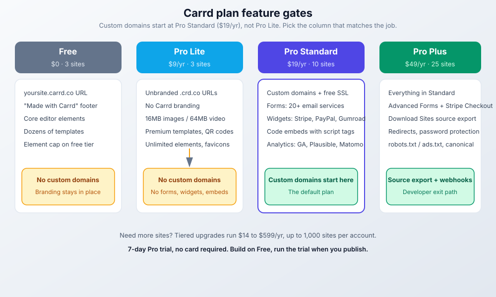
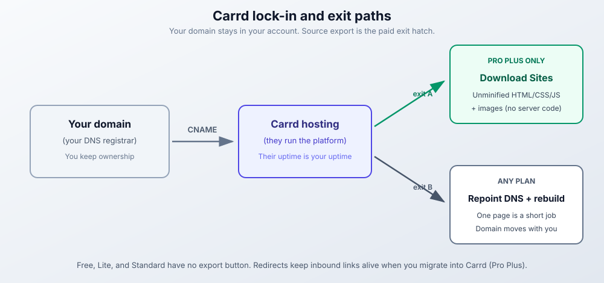

import Button from "@components/widgets/Button.astro";
import Notice from "@components/widgets/Notice.astro";
import ListCheck from "@components/widgets/ListCheck.astro";
import Accordion from "@components/widgets/Accordion.astro";
import Tabs from "@components/widgets/Tabs.astro";
import Tab from "@components/widgets/Tab.astro";
import YouTubeEmbed from "@components/widgets/YouTubeEmbed.astro";

I've used plenty of website builders over the years, and most of them feel like overkill for what people actually need. You want a landing page, not a spaceship control panel.

In this Carrd review I'll look at whether [Carrd.co](https://go.bitdoze.com/carrd) is still the best budget landing page builder in 2026. I'll cover what the editor gives you, how the Pro plans gate features (there is a real buyer trap here), what the platform cannot do, and when you should pick something else.

The short version: Carrd builds single-page sites and nothing else. That focus is the point. You can get a clean, professional-looking page online in about 15 minutes for $19 per year, not per month. I've used it for several projects. What follows covers what works, what doesn't, and what to know before you pay.

## What is Carrd.co?

Carrd.co builds responsive, single-page websites. That's it. No multi-page hierarchies, no complex CMS, no database nonsense. You get a page, you customize it, you publish it. If you are comparing one page website builders, this is the purest version of that category.

The platform works well for personal portfolios, business landing pages, and simple company sites. I've seen people use it for freelance portfolios, event countdown pages, and simple product launches.

What I appreciate most is that Carrd doesn't pretend to be something it isn't. It won't build you a 50-page e-commerce store. But it will get a clean landing page online fast. For freelancers, side projects, and small businesses who just need something that works, that's often enough.

The platform also allows custom code for those who want more control. You can [add a sticky header](https://www.bitdoze.com/add-stickey-header-carrd/) for better navigation, implement [mobile responsive navigation](https://www.bitdoze.com/carrd-mobile-navbar/), or add a [sidebar menu](https://www.bitdoze.com/carrd-sidebar-menu/) for sites with multiple sections.

> For complete guides, custom themes, and advanced plugins, visit my dedicated **[carrdme.com](https://carrdme.com/)** resource site.

## Carrd.co video review

<YouTubeEmbed
  url="https://www.youtube.com/embed/nFnfaQI-nt0"
  label="Carrd.co Review: The Best Budget Landing Page Builder"
/>

<Button link="https://go.bitdoze.com/carrd" text="Try Carrd.co" />

## Carrd.co features

<Button link="https://carrdme.com/" text="Carrd Plugins and Themes" />

### The drag-and-drop editor

The editor uses drag-and-drop. You move elements around, adjust layouts, and customize designs without writing code. The interface stays clean. No sidebar stuffed with options you'll never use.

You can add text, images, buttons, forms, videos, and the rest of the usual set. Nothing groundbreaking, but everything you'd need for a landing page.

### Element library

What you can add to a page:

<ListCheck>
<ul>
<li>Text blocks, images, videos, and audio files cover the content side. The image element handles optimization automatically.</li>
<li>Buttons, lists, links, and icons cover the interactive side. Standard stuff for any landing page.</li>
<li>Galleries for portfolios, slideshows for presentations, and embedded video or audio cover media.</li>
<li>Countdown timers for launches, contact forms for lead capture, and tables for organized data cover the functional jobs.</li>
<li>Dividers, custom code embeds, and containers handle layout and advanced work.</li>
</ul>
</ListCheck>

Nothing fancy here, but the pieces fit together well. You can build a functional landing page without hitting unexpected limitations.

### Template library (324+ templates)

Carrd shipped template #324 on September 16, 2026, and a new one lands roughly every week. That's 324+ templates covering personal bios, business portfolios, event pages, and product launches. The cadence matters as much as the count. It tells you the product is still actively maintained.

Templates are mobile-optimized out of the box. Premium starting-point templates are Pro-only, and the free tier still offers dozens of starting points per Carrd's homepage. Pick one close to what you need and customize from there.

### Custom domains (Pro Standard and up)

Custom domains, with free SSL via Let's Encrypt, are a Pro Standard ($19/yr) feature and up. This is the most common buying mistake I see: Pro Lite ($9/yr) gets you unbranded .crd.co URLs, not yourbrand.com. Carrd's own docs nudge buyers the same way, describing Lite as the plan for users who don't use custom domains.

If you want your own domain, budget for the $19/yr tier and [connect a custom domain to Carrd](https://www.bitdoze.com/carrd-add-domain/) from there. Having yourbrand.com instead of something.carrd.co makes a real difference for credibility.

### Forms and email integrations

Plain contact and signup forms are a Pro Standard feature. Signup forms plug into 20+ email services: ActiveCampaign, beehiiv, Brevo, Buttondown, [EmailOctopus](https://go.bitdoze.com/emailoctopus), GetResponse, Ghost, HubSpot, Kit (the 2024 ConvertKit rebrand), Klaviyo, Loops, Mailchimp, [MailerLite](https://go.bitdoze.com/mailerlite), Mailjet, Omnisend, Resend, Sender, SendFox, SendGrid, and Sendy.

Webhook-style custom forms are a Pro Plus feature under Advanced Forms: Zapier, Make, n8n, Airtable, or a plain POST to any URL you like. If your only goal is a newsletter signup, Standard is enough.

### Payments: sell on Carrd

Two paths, and the gating matters.

On Pro Standard you get payment widgets: Stripe, PayPal, Gumroad, Typeform, and Facebook. Those embed a third-party checkout on your page. Good for a single digital product or a paid RSVP.

On Pro Plus, Advanced Forms take payments natively through Stripe Checkout inside a custom form. Payment-capable custom forms are not on Standard.

Neither path is a real store. No inventory, no product variants, no shopping cart. If the thing you're selling is a download or a course, a free [Payhip storefront](https://go.bitdoze.com/payhip) behind a PayPal or Stripe button is a common setup.

### SEO and analytics

The tiers split cleanly. Pro Standard gives you meta tags (titles, descriptions) and analytics: Google Analytics, Plausible, Matomo, and more. That last part is a real selling point if you'd rather not feed Google. I run [Plausible analytics with Cloudflare Workers](https://www.bitdoze.com/astro-plausible-cloudflare-workers/) on my other sites and route Carrd traffic there the same way.

Pro Plus adds the operational levers: canonical URL, robots.txt and ads.txt editing, redirects, and update-frequency hints. Still no sitemap generation and no schema markup. If organic search is your main growth channel, remember this is a landing page, not a content engine.

For GDPR, you can [add a cookie notice](https://www.bitdoze.com/add-cookie-notice-carrd/) on top of any plan.

### Extras for longer pages

Several features help with longer pages: accordion-style FAQ sections collapse information neatly, pricing tables display service tiers clearly, floating menus keep navigation accessible, and back-to-top buttons help visitors move around. I have tutorials for all four: [accordion FAQs](https://www.bitdoze.com/add-accordion-carrd/), [pricing tables](https://www.bitdoze.com/carrd-add-pricing-table/), [floating menus](https://www.bitdoze.com/carrd-floating-menu/), and [back-to-top buttons](https://www.bitdoze.com/carrd-back-to-top-button/).

If you'd rather not hand-code those, ready-made plugins like this [Accordion plugin for Carrd](https://go.carrdme.com/accordion) and [Tabs plugin for Carrd](https://go.carrdme.com/tabs) drop into an embed element and save an evening.

### What's new in 2026 (still actively maintained)

I check the changelog before recommending any hosted builder. Carrd's is busy. From July through September 2026 alone:

<ListCheck>
<ul>
<li>The Elements Panel (August 7, 2026) lets you jump between elements in the editor instead of hunting through the page.</li>
<li>Framing control (August 23, 2026) is a Pro Plus option to block or restrict IFRAME embedding of your site.</li>
<li>copy: URLs (September 7, 2026) duplicate a site with a link like <code>copy:@handle</code>.</li>
<li>Template #324 (September 16, 2026), plus a steady drip of new fonts and social-platform icons.</li>
</ul>
</ListCheck>

Full history lives in the [Carrd changelog](https://carrd.co/docs/general/changelog). Near-weekly shipping is the answer to anyone asking whether this product has been abandoned.

## Carrd video tutorials playlist

I've put together a playlist covering Carrd techniques from basic setup to advanced customizations:

<YouTubeEmbed
  url="https://www.youtube.com/embed/videoseries?list=PL2JhdTMcNc2MMA1OPy0ZbEsmIj2UdGWxE"
  label="Complete Carrd Tutorials Playlist"
/>

Watch these if you prefer learning by video rather than reading documentation.

## Carrd pricing: Free, Pro Lite, Standard & Plus (2026)

This is where Carrd pulls ahead of the pack. Billing is annual, not monthly. Carrd's own line is "Go Pro from just $19/year (yup, per year)", and you can let it renew yearly or simply pay as you go. PayPal and major cards accepted.

The ladder that matters for most people:

| Plan | Sites | Price | What you get |
|---|---|---|---|
| Free | 3 | $0 | `yoursite.carrd.co` or `.crd.co` URL, "Made with Carrd" branding, core editor features |
| Pro Lite | 3 | $9/yr | Unbranded premium `.crd.co` URLs, no branding, HQ images (16MB images, 64MB videos), premium templates, QR codes. No custom domains, no forms |
| Pro Standard | 10 | $19/yr | Custom domains + free SSL, forms with 20+ email integrations, widgets (Stripe, PayPal, Gumroad, Typeform), code embeds, analytics (GA, Plausible, Matomo), meta tags |
| Pro Plus | 25 | $49/yr | Everything in Standard plus Advanced Forms (Zapier, Make, n8n, Airtable, webhooks, Stripe Checkout), redirects, password protection, variables, robots.txt/ads.txt, canonical URL, full source export |

Need more sites than that? Tiered upgrades run from $14/yr to $599/yr and go up to 1,000 sites per account.

One month of Squarespace buys a full year of Carrd. That math doesn't change no matter which competitor you line up against.

<Button link="https://go.bitdoze.com/carrd" text="Start with Carrd.co" />

### Free plan

$0, 3 sites, published to a yoursite.carrd.co (or .crd.co) URL with "Made with Carrd" branding in the footer. You get all the core features. There is an element limit on the free tier (unlimited elements is a Pro feature) and Carrd doesn't publish the exact cap. Good for testing the editor and for throwaway pages.

### Pro Lite ($9/yr)

3 sites on premium, unbranded .crd.co URLs. No Carrd branding, high-quality images (up to 16MB per image or GIF, 64MB per video), unlimited elements, premium and custom templates, video uploads, slideshows, favicons, share images, QR codes, site transfers, and sharing.

<Notice type="warning" title="Pro Lite has no custom domains">
Pro Lite ($9/yr) does not include custom domains. Unbranded .crd.co URLs only. Custom domains start at Pro Standard ($19/yr). If you came here to put yourbrand.com online, skip Lite.
</Notice>

Lite also has no forms, no widgets, and no embeds. This plan is for link-in-bio and portrait pages where a .crd.co URL is acceptable.

### Pro Standard ($19/yr)

10 sites. This is the default. Carrd's own docs call it "by far the most popular Pro plan". You get custom domains with free SSL via Let's Encrypt, forms with 20+ email integrations, widgets (Stripe, PayPal, Gumroad, Typeform, Facebook), embeds with script tags, analytics (Google Analytics, Plausible, Matomo), meta tags, and local fonts.

If you need to [connect a custom domain to Carrd](https://www.bitdoze.com/carrd-add-domain/) and capture emails, this is the plan. Don't shop below it.

### Pro Plus ($49/yr)

25 sites plus everything in Standard. The real upgrades are developer-facing: Advanced Forms (Zapier, Make, n8n, Airtable, POST webhooks, and Stripe Checkout payments), Advanced Settings (element attributes, custom styles, JS events), Download Sites (unminified HTML, CSS, JS, and images of your sites), Redirects, Password Protection, Variables, Site Files (robots.txt and ads.txt), Framing control, Update Frequency, and Canonical URL.

One correction to older writeups: "priority support" and "enhanced storage" do not appear on Carrd's current plan pages. Buy Plus for the export path and the advanced forms, not for support perks.

### Which plan should you choose?

<Tabs>
<Tab name="Just a link-in-bio">
**Pro Lite ($9/yr)** if a .crd.co URL is fine, or **Free** if branding doesn't bother you. A link hub doesn't need a custom domain, and paying $19 to unlock one is wasted money.
</Tab>
<Tab name="Business landing page">
**Pro Standard ($19/yr)**. This is my default recommendation. You get a real domain, SSL, an email signup form, and analytics. That's the full landing-page-that-earns-its-keep kit.
</Tab>
<Tab name="Developer or agency">
**Pro Plus ($49/yr)**. Pay for the exit path (Download Sites plus Redirects), the webhook forms, and Stripe Checkout. If you manage Carrd sites for clients or expect to migrate, the source export alone justifies the delta.
</Tab>
</Tabs>

Cost framing: $19 to $49 per year against $16 to $17 per month for Squarespace or Wix. Roughly 10x cheaper, and you can be live tonight. The tradeoff is single-vendor dependency. I cover that in "Living with Carrd" below.

### Billing, free trial & higher tiers

Annual billing only. Auto-renew is optional: "Automatically renew yearly or simply pay as you go." PayPal and major cards.

<Notice type="success" title="7-day Pro trial, no card required">
Carrd runs a 7-day Pro trial with no payment details. The flow I recommend: build on Free, then start the trial when you're ready to publish with a custom domain. You learn the Pro settings under real conditions before any money moves.
</Notice>

Site counts scale in tiers if you need them: Pro Lite 10 or 25 sites at $14/yr and $29/yr, Pro Standard from 25 up to 1,000 sites at $39/yr through $599/yr, Pro Plus 50+ from $89/yr. Media limits on Pro: 16MB per image or GIF, 64MB per video.

If Pro lapses, expect free-tier limits and branding to come back. Confirm the exact downgrade behavior in Carrd's troubleshooting docs before you rely on the details.

## Carrd.co advantages and limitations

### What works well

<ListCheck>
<ul>
<li>The price is hard to beat: $19/yr for a professional landing page, less than one month on most competitors.</li>
<li>Most people can build their first site within an hour. The interface doesn't hide important options behind menus within menus.</li>
<li>The 324+ templates look modern and work on mobile. Start with one close to your vision and tweak from there.</li>
<li>The project is still maintained: near-weekly changelog, new templates roughly weekly, new fonts and icons on a steady drip.</li>
<li>Sites load quickly because they're simple. No bloated plugins or unnecessary scripts slowing things down.</li>
<li>Embed elements accept HTML, CSS, and JavaScript, which extends functionality beyond what the visual editor offers.</li>
<li>Download Sites on Pro Plus is a real exit path. Unminified source de-risks the lock-in more than most page builders do.</li>
<li>Solo operators get a 7-day trial with no card, QR codes for print-to-web, and site transfers when you hand a project to a client.</li>
</ul>
</ListCheck>

### What doesn't work

<ListCheck>
<ul>
<li>Single page only. No multi-page sites. If you need a blog, about page, and contact page as separate URLs, Carrd isn't the right tool. Consider <a href="https://www.bitdoze.com/build-astro-blog-free/">building a free blog with Astro</a> for that.</li>
<li>E-commerce is basic at best. Payment widgets (Stripe, PayPal, Gumroad) on Standard, Stripe Checkout forms on Plus. Inventory management, product variants, or shopping carts? Look elsewhere.</li>
<li>SEO is limited. Standard gives you meta tags and analytics; Plus adds canonical URL, robots.txt/ads.txt, and redirects. Still no sitemap generation and no schema markup.</li>
<li>Design has hard limits. The editor gives you flexibility within a fixed system. Sometimes you'll want to do something and realize the platform doesn't support it.</li>
</ul>
</ListCheck>

<Button link="https://go.bitdoze.com/carrd" text="Start with Carrd.co" />

## Who Carrd is for (and who it isn't)

Some jobs fit Carrd and some don't. Here's the split I use in practice.

Carrd works well for:

<ListCheck>
<ul>
<li>Freelancers who need a simple portfolio or "hire me" page</li>
<li>Side projects that need a landing page before the product exists</li>
<li>Event organizers promoting a conference, wedding, or meetup</li>
<li>Musicians, artists, or creators who want a link-in-bio style page</li>
<li>Small businesses testing an idea before investing in a full website</li>
<li>Anyone collecting emails for a newsletter or waitlist</li>
</ul>
</ListCheck>

Carrd probably isn't right for:

<ListCheck>
<ul>
<li>Businesses that need multiple pages with different URLs</li>
<li>Content creators who want to blog regularly</li>
<li>E-commerce stores selling physical products</li>
<li>Agencies managing sites for multiple clients at scale</li>
<li>Anyone who needs member logins or user accounts</li>
</ul>
</ListCheck>

The pattern is simple: if one page can tell your story and accomplish your goal, Carrd works. If you need complexity, structure, or regular content updates, look elsewhere. For a longer walkthrough of the budget angle, see [how to build a one page website on a budget](https://www.bitdoze.com/build-one-page-website-budget/).

## Real examples: what people build

Abstract feature lists don't help much. These are the builds I see come up most often.

Personal branding pages take maybe 30 minutes: freelance designers link a portfolio, social profiles, and a contact form on one clean page.

Product launch pages let indie makers test interest before building. Add a headline, some bullet points, maybe a mockup, and an email signup. See if anyone cares before writing code.

Event countdowns cover wedding sites, conference registrations, and party invitations. The countdown timer element works well here. Add location, schedule, and an RSVP form.

Link-in-bio replacements work when you want the page to match your brand instead of a Linktree URL. Same functionality, more control over design.

Service landing pages let consultants, coaches, and other providers explain what they offer with a clear call to action. Pricing table, testimonials, contact form.

Coming soon pages park a domain with a professional placeholder while the real site gets built. Better than a blank page or a generic "under construction" template.

None of these need multiple pages or a database. None of them need monthly maintenance either. That's the sweet spot where Carrd makes sense.

## Living with Carrd: reliability, lock-in & exits

Carrd is a hosted platform. That decision has consequences worth stating before you move a domain onto it.

Single-vendor risk comes first. Carrd runs the hosting, the editor, and the SSL. Their uptime is your uptime. At $19/yr you're buying a managed service, not a server you can restart. I don't have uptime numbers to quote and I won't invent any. Platform-wide outages are rare but possible with any hosted builder. Check [status.carrd.co](https://status.carrd.co) when something looks wrong on your side and the DNS is fine.

<Notice type="info" title="Single-vendor risk in one line">
Cheap means you accept Carrd's uptime. Your domain stays in your DNS account, and on Pro Plus your source is exportable. Those two facts are your exit plan.
</Notice>

Your domain stays yours. You point a CNAME at Carrd from your registrar. Carrd does not take ownership of the domain. Repoint that DNS record and the domain goes wherever you want.

The exit path depends on your plan. Free, Lite, and Standard have no export. For a one-page site that's a manageable loss, because rebuilding one page on another tool is a short job. Pro Plus adds Download Sites: unminified HTML, CSS, JS, and images (server-side form handling isn't included). Redirects covers the other direction, keeping inbound links alive when you migrate into Carrd.

One failure mode to know up front: if Pro lapses, sites revert to free-tier limits and branding. Keep auto-renew on, or keep a calendar reminder.

## Carrd vs competitors: alternatives compared (2026)

<Notice type="info" title="Prices move fast">
Competitor prices below are at time of writing (September 2026). Squarespace, Wix, Webflow, and Framer all render pricing with JavaScript and restructure tiers often. Check each vendor's pricing page before you decide.
</Notice>

A quick comparison against the alternatives I've used.

### Carrd vs. Webflow

Webflow builds complex, multi-page sites with sophisticated animations. It's powerful but has a steep learning curve and costs around $14-39/month at time of writing (Webflow restructured its site plans in 2025, so re-check). If you need a simple landing page, Webflow is overkill. If you're building a complex marketing site with a design team, Webflow makes more sense.

### Carrd vs. Wix

Wix has more features but feels cluttered. The drag-and-drop editor is flexible, but you'll spend time figuring out where things are hidden. Pricing starts around $17/month for the Light plan billed annually at time of writing. For a single landing page, Carrd is simpler and cheaper.

### Carrd vs. WordPress

WordPress can do anything, but that flexibility comes with maintenance headaches. Hosting, security updates, plugin management, backups: all your job. Carrd handles all of that. If you need a blog or a complex site, WordPress wins. For a landing page, Carrd saves the weekend.

If you're weighing a multi-page or blog-heavy site, read my [Astro vs WordPress cost and ops breakdown](https://www.bitdoze.com/astro-vs-wordpress/). If you do go WordPress and want a modern builder instead of classic themes, my [Breakdance builder review](https://www.bitdoze.com/breakdance-builder-review/) covers the one I'd look at first.

### Carrd vs. Squarespace

Squarespace has polished templates and works well for portfolios and small business sites. It starts at about $16/month for Personal billed annually ($25 month-to-month) at time of writing. The quality is high, but you're paying roughly 10x what Carrd costs annually. For simple landing pages, the extra features don't justify the price difference.

### Carrd vs. Framer

Framer targets designers who want precise control over animations and interactions, and it ships AI generation these days. It's sophisticated, and its tiers have changed more than once. Unless you're a designer building a portfolio or prototype, [Framer](https://go.bitdoze.com/framer) is more machine than a landing page needs. Carrd wins on total cost and on predictable, hand-tuned output.

### Carrd vs. AI website builders

This is the comparison readers make in 2026: Framer AI, Durable, v0 and Lovable-class generators. AI builders win on generation speed. Carrd wins on total cost ($19-49/yr versus $10-30/month subscriptions) and on output you can reason about, because you tuned it.

One fact worth knowing: Carrd has shipped no native AI site generation. I checked the changelog through September 16, 2026. What you get instead is custom code embeds, so AI-generated copy and code still fit the workflow. More on that below.

<Button link="https://go.bitdoze.com/carrd" text="Start with Carrd.co" />

## Using AI to build your Carrd site

AI tools have changed how I approach Carrd projects. Carrd itself deliberately has no AI site builder bolted on. That makes AI a force multiplier for copy, custom code, and design decisions, instead of a black-box generator you end up fighting.

If you're new to programming or want to add custom functionality to your Carrd site, AI coding assistants can generate the HTML, CSS, and JavaScript you need. I covered this in my [AI programming guide for beginners](https://www.bitdoze.com/ai-programming-beginners-guide/). The same principles apply to Carrd's embed functionality. If you want agent-side tooling for design work specifically, compare some [AI skills for web design](https://www.bitdoze.com/best-ai-skills-for-web-design/).

For example, you can ask an AI assistant to generate:

- Custom CSS animations
- Interactive elements
- Form validation scripts
- Analytics tracking code
- Custom navigation menus

The embed element in Carrd accepts custom code, so anything an AI generates can be dropped right in. Cost note: these are one-off static snippets. Any LLM API or chat assistant works, and there's no token bill running in production after you paste the code.

If you're considering a more complex site with multiple pages and a blog, check out my guide on [building a free blog with Astro](https://www.bitdoze.com/build-astro-blog-free/). It covers setting up a full blog that costs nothing to host.

## Tips for getting good results

A few things I've learned from building Carrd sites:

### Keep it simple

Single-page sites work best when they focus on one goal. Don't try to cram your entire business onto one page. Pick one action you want visitors to take and design around that.

### Optimize your images

Large images slow down your site. Compress them before uploading. Free tools like TinyPNG reduce file size without visible quality loss.

Know the hard limits too: on Pro plans, images and GIFs go up to 16MB and videos up to 64MB. The free tier has lower quality and size caps. If a file is rejected, check the size before you debug anything else.

### Test on mobile

More than half your visitors will probably be on phones. Check how your site looks on mobile before publishing. The responsive preview in Carrd helps, but also test on an actual phone.

### Use custom code when needed

If the visual editor doesn't do what you want, check if custom code can solve it. My tutorials cover several customizations like [floating menus](https://www.bitdoze.com/carrd-floating-menu/) and [sidebar navigation](https://www.bitdoze.com/carrd-sidebar-menu/).

## Conclusion

Carrd does one thing well: simple, fast landing pages at a price that makes sense. It won't replace WordPress for blogs or Shopify for e-commerce, but it's not trying to.

For freelancers, side projects, event pages, or anyone who needs a professional web presence without the overhead, Carrd is worth it in 2026. The learning curve is short and the pricing is honest. The results look professional.

The path I recommend: build on the Free plan, run the 7-day Pro trial when you're ready to publish, then pay $19/yr for Pro Standard if you have a real domain. That's less than one month of Squarespace or Wix per year.

<Button link="https://go.bitdoze.com/carrd" text="Start with Carrd.co" />

<Button link="https://carrdme.com/" text="Carrd Plugins and Themes" />

## All my Carrd tutorials

I've written several guides on extending Carrd's functionality:

<ListCheck>
<ul>
<li><a href="https://www.bitdoze.com/carrd-popup-modal/">Add a Popup Modal to Carrd</a> - Email capture popups and announcements</li>
<li><a href="https://www.bitdoze.com/carrd-smooth-scroll/">Add Smooth Scroll to Carrd</a> - Smooth navigation between sections</li>
<li><a href="https://www.bitdoze.com/carrd-testimonial-slider/">Add a Testimonial Slider to Carrd</a> - Rotating customer reviews</li>
<li><a href="https://www.bitdoze.com/carrd-dark-mode-toggle/">Add Dark Mode Toggle to Carrd</a> - Light/dark theme switcher</li>
<li><a href="https://www.bitdoze.com/carrd-whatsapp-button/">Add a WhatsApp Button to Carrd</a> - Instant chat contact button</li>
<li><a href="https://www.bitdoze.com/carrd-countdown-styling/">Style Countdown Timers in Carrd</a> - Custom countdown designs</li>
<li><a href="https://www.bitdoze.com/add-stickey-header-carrd/">Add a Sticky Header to Carrd</a> - Keep navigation visible while scrolling</li>
<li><a href="https://www.bitdoze.com/carrd-mobile-navbar/">Add a Mobile Responsive Navbar</a> - Better mobile navigation experience</li>
<li><a href="https://www.bitdoze.com/carrd-sidebar-menu/">Add a Sidebar Menu to Carrd</a> - Slide-in navigation for content-heavy sites</li>
<li><a href="https://www.bitdoze.com/carrd-floating-menu/">Add a Floating Menu to Carrd</a> - Hamburger menu that stays accessible</li>
<li><a href="https://www.bitdoze.com/add-accordion-carrd/">Add Accordion FAQs to Carrd</a> - Collapsible FAQ sections</li>
<li><a href="https://www.bitdoze.com/carrd-add-pricing-table/">Add a Pricing Table to Carrd</a> - Display service tiers clearly</li>
<li><a href="https://www.bitdoze.com/carrd-back-to-top-button/">Add a Back-to-Top Button</a> - Help visitors navigate long pages</li>
<li><a href="https://www.bitdoze.com/add-cookie-notice-carrd/">Add a Cookie Notice to Carrd</a> - GDPR compliance</li>
<li><a href="https://www.bitdoze.com/carrd-add-domain/">Connect a Custom Domain to Carrd</a> - Use your own domain name</li>
<li><a href="https://www.bitdoze.com/build-one-page-website-budget/">Build a One-Page Website on a Budget</a> - Compare Carrd with alternatives</li>
</ul>
</ListCheck>

## Frequently asked questions

<Accordion label="Is Carrd worth it in 2026?" group="faq" expanded="true">
Yes, for one-page use cases. At $19/yr Pro Standard gives you a custom domain, forms, and analytics. That's a real landing page for less than one month of Squarespace or Wix. It is not worth it if you need a blog, multiple URLs, or full e-commerce. Those needs have better tools.
</Accordion>

<Accordion label="Do I need a paid plan for a custom domain?" group="faq">
Yes, and not just any paid plan. Custom domains start at Pro Standard ($19/yr). Pro Lite ($9/yr) publishes to unbranded .crd.co URLs only. This trips people up, so check the plan before you buy. Setup steps are in my guide to [connecting a custom domain to Carrd](https://www.bitdoze.com/carrd-add-domain/).
</Accordion>

<Accordion label="Is Carrd suitable for blogging?" group="faq">
No. The single-page format doesn't work for regular content publishing. You can display a few posts in a blog-style layout, but for actual blogging, use something like [Astro](https://www.bitdoze.com/build-astro-blog-free/) or WordPress.
</Accordion>

<Accordion label="Can Carrd handle portfolio websites?" group="faq">
Yes, portfolios work well. The gallery elements and templates are built to show creative work. Many freelancers and artists use Carrd for exactly this purpose.
</Accordion>

<Accordion label="Does Carrd offer customer support?" group="faq">
Documentation and email support. There is no priority support tier on the current plan pages, whatever older reviews say. The platform is simple enough that most people don't need much support.
</Accordion>

<Accordion label="How reliable is Carrd's hosting?" group="faq">
Sites are fast because they're simple, and Carrd handles security and maintenance on their end. The honest caveat: this is a single-vendor platform, so a platform-wide outage takes your page with it. That's the risk you accept at $19/yr. I don't publish uptime numbers I can't verify. Check status.carrd.co before you blame your own DNS.
</Accordion>

<Accordion label="Can I migrate away from Carrd later?" group="faq">
It depends on your plan. Free, Lite, and Standard have no export button, but it's one page. Rebuilding elsewhere is a short job, and you can [add a contact form to any static website](https://www.bitdoze.com/add-contact-form-static-websites/) once you're there. Pro Plus adds Download Sites: unminified HTML, CSS, JS, and images (no server-side code). And your domain is yours the whole time. Repoint DNS whenever you like.
</Accordion>

<Accordion label="What happens if my Pro plan expires?" group="faq">
Your sites keep working but revert to free-tier limits and branding, and account site-count limits kick in. Per Carrd's troubleshooting docs and community reports, nothing gets deleted. Verify the current behavior on Carrd's troubleshooting page before you let a plan lapse on purpose.
</Accordion>

<Button link="https://go.bitdoze.com/carrd" text="Get Started with Carrd.co" />

<Button link="https://carrdme.com/" text="Carrd Plugins and Themes" />
