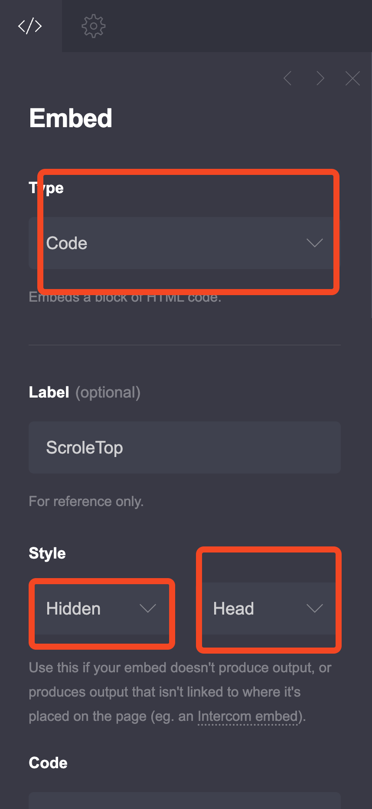

[Carrd.co](https://go.bitdoze.com/carrd) is an excellent platform for creating one-page websites, but navigation can become challenging when you have multiple sections. A sidebar menu provides an elegant solution by offering easy access to different parts of your site without taking up valuable screen real estate in your main content area.

A sidebar menu is particularly beneficial for Carrd sites because:

1. **It maximizes content space** by keeping navigation tucked away until needed, allowing your main content to shine.

2. **Provides better organization** for sites with multiple sections, making it easy for visitors to jump to specific areas.

3. **Offers excellent mobile experience** with smooth slide-in animations and touch-friendly interactions.

4. **Maintains visual hierarchy** by keeping the focus on your content while providing accessible navigation when needed.

5. **Customizable positioning** allows you to choose whether the sidebar opens from the left or right side to match your design preferences.

<Button link="https://go.bitdoze.com/carrd" text="Carrd.co" />

Some Carrd Tutorials:

- [Add Floating Menu Carrd](https://www.bitdoze.com/carrd-floating-menu/)
- [Add Stickey Header Carrd](https://www.bitdoze.com/add-stickey-header-carrd/)
- [Add Carrd Cookie Notice](https://www.bitdoze.com/add-cookie-notice-carrd/)
- [How To Add Pricing Table to Carrd.co](https://www.bitdoze.com/carrd-add-pricing-table/)
- [Carrd.co Review](https://www.bitdoze.com/carrd-review/)
- [How To Add Accordion FAQs Drop-Down to Carrd.co](https://www.bitdoze.com/add-accordion-carrd/)
- [Carrd.co Mobile Responsive Navbar](https://www.bitdoze.com/carrd-mobile-navbar/)

> The complete list with Carrd plugins, themes and tutorials you can find on my **[carrdme.com](https://carrdme.com/)** website.

## How to Add the Carrd Sidebar Menu

<YouTubeEmbed
  url="https://www.youtube.com/embed/UAyDbfnZWCs"
  label="How to Add a Slide In Sidebar Menu to a Carrd Website"
/>

### 1. Add an embed element anywhere on the website

You just need to go on the `+` sign and add an Embed element anywhere on the website. Here's what you need to set:

- Type: Code
- Style: Hidden, Head

Just as in the picture below:



### 2. Use the HTML Code:

Below is the complete code you should use with detailed explanations:

```html
<style>
  :root {
    /* Sidebar Configuration */
    --sidebar-position: left; /* Options: 'left' or 'right' */
    --sidebar-width: 300px;
    --sidebar-bg-color: rgba(25, 25, 25, 0.95);
    --sidebar-text-color: #ffffff;
    --sidebar-border-color: #444;
    --sidebar-hover-color: rgba(255, 255, 255, 0.1);
    --sidebar-accent-color: #007bff;
    --contact-button-hover-color: #0056b3;

    /* Menu Button Configuration */
    --menu-button-bg: rgba(0, 123, 255, 0.9);
    --menu-button-color: #ffffff;
    --menu-button-size: 50px;
    --menu-button-floating: true; /* Options: true or false */
    --menu-button-float-position: top; /* Options: 'top' or 'bottom' (only when floating is true) */
    --menu-button-float-side: left; /* Options: 'left' or 'right' (only when floating is true) */
    --menu-button-position-top: 20px;
    --menu-button-position-side: 20px;

    /* Animation Settings */
    --sidebar-animation-speed: 0.3s;
    --button-animation-speed: 0.2s;

    /* Typography */
    --sidebar-font-family: inherit;
    --sidebar-font-size: 16px;
    --sidebar-heading-size: 20px;

    /* Spacing */
    --sidebar-padding: 20px;
    --menu-item-spacing: 15px;
  }

  /* Reset and Base Styles */
  * {
    box-sizing: border-box;
  }

  /* Menu Toggle Button */
  .sidebar-menu-toggle {
    background-color: var(--menu-button-bg);
    color: var(--menu-button-color);
    border: none;
    width: var(--menu-button-size);
    height: var(--menu-button-size);
    border-radius: 50%;
    cursor: pointer;
    z-index: 1001;
    display: flex;
    flex-direction: column;
    justify-content: center;
    align-items: center;
    transition: all var(--button-animation-speed) ease;
    box-shadow: 0 2px 10px rgba(0, 0, 0, 0.3);
  }

  /* Floating button positioning */
  .sidebar-menu-toggle.floating {
    position: fixed;
  }

  .sidebar-menu-toggle.floating.float-top {
    top: var(--menu-button-position-top);
  }

  .sidebar-menu-toggle.floating.float-bottom {
    bottom: var(--menu-button-position-top);
  }

  .sidebar-menu-toggle.floating.float-left {
    left: var(--menu-button-position-side);
  }

  .sidebar-menu-toggle.floating.float-right {
    right: var(--menu-button-position-side);
  }

  /* Static button positioning (when not floating) */
  .sidebar-menu-toggle.static {
    position: relative;
    margin: 10px;
  }

  /* Position the menu button based on sidebar position (only for non-floating) */
  .sidebar-menu-toggle.static[data-position="left"] {
    left: var(--menu-button-position-side);
  }

  .sidebar-menu-toggle.static[data-position="right"] {
    right: var(--menu-button-position-side);
  }

  .sidebar-menu-toggle:hover {
    transform: scale(1.1);
    box-shadow: 0 4px 15px rgba(0, 0, 0, 0.4);
  }

  /* Hamburger Icon */
  .hamburger-icon {
    width: 20px;
    height: 2px;
    background-color: var(--menu-button-color);
    margin: 2px 0;
    transition: all var(--button-animation-speed) ease;
    transform-origin: center;
  }

  /* Hamburger Animation */
  .sidebar-menu-toggle.active .hamburger-icon:nth-child(1) {
    transform: rotate(45deg) translate(4px, 4px);
  }

  .sidebar-menu-toggle.active .hamburger-icon:nth-child(2) {
    opacity: 0;
  }

  .sidebar-menu-toggle.active .hamburger-icon:nth-child(3) {
    transform: rotate(-45deg) translate(4px, -4px);
  }

  /* Sidebar Overlay */
  .sidebar-overlay {
    position: fixed;
    top: 0;
    left: 0;
    width: 100%;
    height: 100%;
    background-color: rgba(0, 0, 0, 0.5);
    z-index: 999;
    opacity: 0;
    visibility: hidden;
    transition: all var(--sidebar-animation-speed) ease;
  }

  .sidebar-overlay.active {
    opacity: 1;
    visibility: visible;
  }

  /* Sidebar Menu */
  .sidebar-menu {
    position: fixed;
    top: 0;
    width: var(--sidebar-width);
    height: 100%;
    background-color: var(--sidebar-bg-color);
    color: var(--sidebar-text-color);
    z-index: 1000;
    padding: var(--sidebar-padding);
    font-family: var(--sidebar-font-family);
    font-size: var(--sidebar-font-size);
    transition: transform var(--sidebar-animation-speed) ease;
    overflow-y: auto;
    box-shadow: 0 0 20px rgba(0, 0, 0, 0.3);
  }

  /* Sidebar positioning based on CSS variable */
  .sidebar-menu[data-position="left"] {
    left: 0;
    transform: translateX(-100%);
    border-right: 1px solid var(--sidebar-border-color);
  }

  .sidebar-menu[data-position="right"] {
    right: 0;
    transform: translateX(100%);
    border-left: 1px solid var(--sidebar-border-color);
  }

  .sidebar-menu.active {
    transform: translateX(0);
  }

  /* Close Button */
  .sidebar-close {
    position: absolute;
    top: 15px;
    background: none;
    border: none;
    color: var(--sidebar-text-color);
    font-size: 24px;
    cursor: pointer;
    width: 30px;
    height: 30px;
    display: flex;
    align-items: center;
    justify-content: center;
    border-radius: 50%;
    transition: background-color var(--button-animation-speed) ease;
  }

  .sidebar-close[data-position="left"] {
    right: 15px;
  }

  .sidebar-close[data-position="right"] {
    left: 15px;
  }

  .sidebar-close:hover {
    background-color: var(--sidebar-hover-color);
  }

  /* Sidebar Header */
  .sidebar-header {
    margin-top: 50px;
    margin-bottom: 30px;
    padding-bottom: 20px;
    border-bottom: 1px solid var(--sidebar-border-color);
  }

  .sidebar-title {
    font-size: var(--sidebar-heading-size);
    font-weight: bold;
    margin: 0;
    color: var(--sidebar-accent-color);
  }

  /* Navigation Menu */
  .sidebar-nav {
    list-style: none;
    padding: 0;
    margin: 0;
  }

  .sidebar-nav li {
    margin-bottom: var(--menu-item-spacing);
  }

  .sidebar-nav a {
    color: var(--sidebar-text-color);
    text-decoration: none;
    display: block;
    padding: 12px 15px;
    border-radius: 8px;
    transition: all var(--button-animation-speed) ease;
    border-left: 3px solid transparent;
  }

  .sidebar-nav a:hover {
    background-color: var(--sidebar-hover-color);
    border-left-color: var(--sidebar-accent-color);
    transform: translateX(5px);
  }

  /* Contact Button */
  .sidebar-contact-btn {
    margin-top: 30px;
    padding-top: 20px;
    border-top: 1px solid var(--sidebar-border-color);
  }

  .contact-button {
    display: block;
    width: 100%;
    padding: 15px;
    background-color: var(--sidebar-accent-color);
    color: white;
    text-decoration: none;
    text-align: center;
    border-radius: 8px;
    font-weight: bold;
    transition: all var(--button-animation-speed) ease;
    border: none;
    cursor: pointer;
    font-size: var(--sidebar-font-size);
  }

  .contact-button:hover {
    background-color: var(--contact-button-hover-color);
    transform: translateY(-2px);
    box-shadow: 0 4px 10px rgba(0, 123, 255, 0.3);
  }

  /* Mobile Responsiveness */
  @media (max-width: 768px) {
    :root {
      --sidebar-width: 280px;
      --sidebar-font-size: 15px;
      --sidebar-heading-size: 18px;
      --menu-button-size: 45px;
    }
  }

  @media (max-width: 480px) {
    :root {
      --sidebar-width: 250px;
      --sidebar-font-size: 14px;
      --sidebar-heading-size: 16px;
      --menu-button-size: 40px;
      --menu-button-position-top: 15px;
      --menu-button-position-side: 15px;
    }
  }

  /* Prevent body scroll when sidebar is open */
  body.sidebar-open {
    overflow: hidden;
  }
</style>

<!-- Menu Toggle Button -->
<button class="sidebar-menu-toggle" id="sidebarToggle">
  <span class="hamburger-icon"></span>
  <span class="hamburger-icon"></span>
  <span class="hamburger-icon"></span>
</button>

<!-- Sidebar Overlay -->
<div class="sidebar-overlay" id="sidebarOverlay"></div>

<!-- Sidebar Menu -->
<nav class="sidebar-menu" id="sidebarMenu">
  <button class="sidebar-close" id="sidebarClose">&times;</button>

  <div class="sidebar-header">
    <h3 class="sidebar-title">Navigation</h3>
  </div>

  <ul class="sidebar-nav">
    <li><a href="#home">Home</a></li>
    <li><a href="#about">About</a></li>
    <li><a href="#services">Services</a></li>
    <li><a href="#portfolio">Portfolio</a></li>
    <li><a href="#testimonials">Testimonials</a></li>
    <li><a href="#blog">Blog</a></li>
  </ul>

  <div class="sidebar-contact-btn">
    <a href="#contact" class="contact-button">Contact Us</a>
  </div>
</nav>

<script>
document.addEventListener('DOMContentLoaded', function() {
  // Get elements
  const toggleBtn = document.getElementById('sidebarToggle');
  const closeBtn = document.getElementById('sidebarClose');
  const overlay = document.getElementById('sidebarOverlay');
  const sidebar = document.getElementById('sidebarMenu');
  const body = document.body;

  // Get CSS variables
  const sidebarPosition = getComputedStyle(document.documentElement)
    .getPropertyValue('--sidebar-position').trim();
  const isFloating = getComputedStyle(document.documentElement)
    .getPropertyValue('--menu-button-floating').trim() === 'true';
  const floatPosition = getComputedStyle(document.documentElement)
    .getPropertyValue('--menu-button-float-position').trim();
  const floatSide = getComputedStyle(document.documentElement)
    .getPropertyValue('--menu-button-float-side').trim();

  // Set button positioning classes
  if (isFloating) {
    toggleBtn.classList.add('floating');
    if (floatPosition === 'bottom') {
      toggleBtn.classList.add('float-bottom');
    } else {
      toggleBtn.classList.add('float-top');
    }
    if (floatSide === 'right') {
      toggleBtn.classList.add('float-right');
    } else {
      toggleBtn.classList.add('float-left');
    }
  } else {
    toggleBtn.classList.add('static');
  }

  // Set data attributes for positioning
  toggleBtn.setAttribute('data-position', sidebarPosition);
  closeBtn.setAttribute('data-position', sidebarPosition);
  sidebar.setAttribute('data-position', sidebarPosition);

  // Open sidebar function
  function openSidebar() {
    sidebar.classList.add('active');
    overlay.classList.add('active');
    toggleBtn.classList.add('active');
    body.classList.add('sidebar-open');
  }

  // Close sidebar function
  function closeSidebar() {
    sidebar.classList.remove('active');
    overlay.classList.remove('active');
    toggleBtn.classList.remove('active');
    body.classList.remove('sidebar-open');
  }

  // Event listeners
  toggleBtn.addEventListener('click', function(e) {
    e.stopPropagation();
    if (sidebar.classList.contains('active')) {
      closeSidebar();
    } else {
      openSidebar();
    }
  });

  closeBtn.addEventListener('click', closeSidebar);
  overlay.addEventListener('click', closeSidebar);

  // Close sidebar when clicking on navigation links
  const navLinks = document.querySelectorAll('.sidebar-nav a, .contact-button');
  navLinks.forEach(link => {
    link.addEventListener('click', function() {
      closeSidebar();
    });
  });

  // Close sidebar on escape key
  document.addEventListener('keydown', function(e) {
    if (e.key === 'Escape' && sidebar.classList.contains('active')) {
      closeSidebar();
    }
  });

  // Handle window resize
  window.addEventListener('resize', function() {
    if (window.innerWidth > 768 && sidebar.classList.contains('active')) {
      closeSidebar();
    }
  });
});
</script>
```

Below are the key customization variables you can modify:

### Sidebar Configuration Variables:

1. **`--sidebar-position: left;`**
   - Options: `left` or `right`
   - Determines which side the sidebar opens from

2. **`--menu-button-floating: true;`**
   - Options: `true` or `false`
   - When `true`, the menu button floats on the page; when `false`, it's positioned relative to where the code is inserted

3. **`--menu-button-float-position: top;`**
   - Options: `top` or `bottom`
   - Only applies when `--menu-button-floating` is `true`
   - Determines whether the floating button appears at the top or bottom of the screen

4. **`--menu-button-float-side: left;`**
   - Options: `left` or `right`
   - Only applies when `--menu-button-floating` is `true`
   - Determines whether the floating button appears on the left or right side of the screen

5. **`--sidebar-width: 300px;`**
   - Controls the width of the sidebar menu

6. **`--sidebar-bg-color: rgba(25, 25, 25, 0.95);`**
   - Background color of the sidebar (supports transparency)

7. **`--sidebar-text-color: #ffffff;`**
   - Color of text inside the sidebar

8. **`--sidebar-accent-color: #007bff;`**
   - Accent color used for highlights and the contact button

9. **`--menu-button-bg: rgba(0, 123, 255, 0.9);`**
   - Background color of the hamburger menu button

10. **`--contact-button-hover-color: #0056b3;`**
   - Background color of the contact button when hovered

11. **`--sidebar-animation-speed: 0.3s;`**
    - Speed of sidebar open/close animations

You can easily customize colors using [https://rgbacolorpicker.com/](https://rgbacolorpicker.com/) for colors with transparency support.

### Button Positioning Options:

- **Floating Mode** (`--menu-button-floating: true`): The menu button will float on the screen at the specified position (top/bottom and left/right)
- **Static Mode** (`--menu-button-floating: false`): The menu button will be positioned relative to where you insert the embed code in your Carrd site

<Button link="https://go.bitdoze.com/carrd" text="Carrd.co" />

### 3. Customize the Menu Items

```html
<ul class="sidebar-nav">
  <li><a href="#home">Home</a></li>
  <li><a href="#about">About</a></li>
  <li><a href="#services">Services</a></li>
  <li><a href="#portfolio">Portfolio</a></li>
  <li><a href="#testimonials">Testimonials</a></li>
  <li><a href="#blog">Blog</a></li>
</ul>
```

This section contains your navigation menu items. Simply add or remove `<li><a href="#section">Section Name</a></li>` entries to match your Carrd site's sections.

### 4. Customize the Contact Button

The contact button at the bottom of the sidebar can be customized by changing:

```html
<a href="#contact" class="contact-button">Contact Us</a>
```

You can change the link destination and button text to match your needs.

## Key Features

### Mobile Optimization
The sidebar is fully responsive and automatically adjusts its size and positioning for mobile devices. It includes:
- Touch-friendly button sizes
- Optimized spacing for mobile screens
- Prevents body scrolling when sidebar is open
- Smooth animations optimized for mobile performance

### Smooth Animations
The sidebar includes several animation effects:
- Slide-in/slide-out transitions
- Hamburger icon morphing to X when active
- Hover effects on menu items
- Button scaling and shadow effects

### Accessibility Features
- Keyboard support (Escape key closes the sidebar)
- Focus management
- Screen reader friendly markup
- High contrast color options

### Cross-Browser Compatibility
The code uses modern CSS features with fallbacks and is compatible with all major browsers.

## Conclusion

This sidebar menu provides a professional and user-friendly navigation solution for your Carrd website. The customizable nature allows you to match your site's branding perfectly, while the responsive design ensures it works beautifully on all devices.

The sidebar menu strikes the perfect balance between functionality and aesthetics, giving your visitors easy access to all sections of your site without compromising your content's visual impact. Whether you choose left or right positioning, the smooth animations and intuitive interactions will enhance your site's user experience significantly.

By implementing this sidebar menu, you're adding a professional touch that sets your Carrd site apart while maintaining the platform's core benefits of simplicity and speed.
