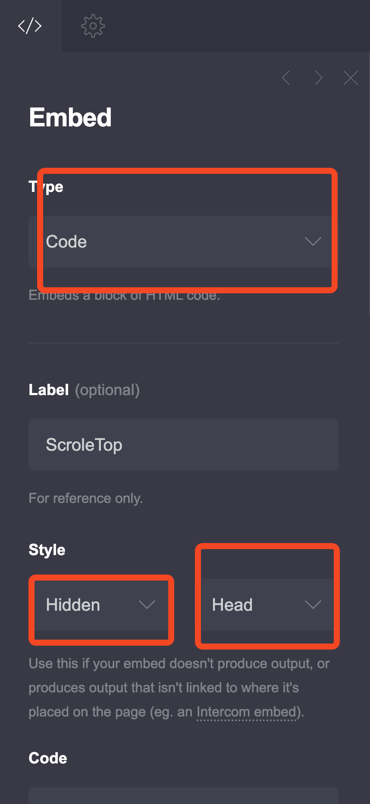

import Button from "@components/widgets/Button.astro";
import Notice from "@components/widgets/Notice.astro";
import ListCheck from "@components/widgets/ListCheck.astro";
import Accordion from "@components/widgets/Accordion.astro";

[Carrd.co](https://go.bitdoze.com/carrd) is an excellent platform for creating one-page websites, but navigation gets tricky once you have more than a few sections. A sidebar menu solves this by tucking navigation off-screen until the visitor needs it. No wasted screen space, no cluttered header.

A carrd sidebar menu works well because:

1. **It maximizes content space.** Navigation stays hidden until the visitor taps the hamburger button, keeping the focus on your content.
2. **Better organization** for sites with multiple sections. Visitors can jump to any area without scrolling.
3. **Mobile-friendly.** The slide-in panel uses touch-friendly targets (40px+) and handles iOS scroll-lock properly.
4. **Customizable positioning.** Open from the left or right, float the button or pin it to a spot on the page.

<Button link="https://go.bitdoze.com/carrd" text="Try Carrd.co" variant="solid" color="blue" size="md" />

Some Carrd tutorials:

- [Add a floating menu to Carrd](https://www.bitdoze.com/carrd-floating-menu/)
- [Add a sticky header to Carrd](https://www.bitdoze.com/add-stickey-header-carrd/)
- [Add a cookie notice to Carrd](https://www.bitdoze.com/add-cookie-notice-carrd/)
- [Add a pricing table to Carrd](https://www.bitdoze.com/carrd-add-pricing-table/)
- [Carrd.co review](https://www.bitdoze.com/carrd-review/)
- [Add accordion FAQs to Carrd](https://www.bitdoze.com/add-accordion-carrd/)
- [Carrd mobile responsive navbar](https://www.bitdoze.com/carrd-mobile-navbar/)
- [Carrd back to top button (2026 guide)](https://www.bitdoze.com/carrd-back-to-top-button/)
- [Popup modal for Carrd](https://www.bitdoze.com/carrd-popup-modal/)
- [Carrd dark mode toggle](https://www.bitdoze.com/carrd-dark-mode-toggle/)

> The complete list of Carrd plugins, themes, and tutorials is on my **[carrdme.com](https://carrdme.com/)** website.

## Prerequisites: Carrd Pro Standard and the Embed element

<Notice type="warning" title="Requires Carrd Pro Standard ($19/yr)">
The Embed element is only available on **Carrd Pro Standard ($19/yr)** or **Pro Plus ($49/yr)** plans. The free Basic plan caps sites at 50 elements and has no Embeds. Pro Lite ($9/yr) does not include Embeds either.


<YouTubeEmbed
  url="https://www.youtube.com/embed/UAyDbfnZWCs"
  label="How to Add a Slide In Sidebar Menu to a Carrd Website"
/>
There is a 7-day free Pro trial with no credit card required. The trial gives you Pro Plus features, which includes Embeds, so you can test the sidebar before committing.

If you're upgrading, you'll also want to [add a custom domain to Carrd](https://www.bitdoze.com/carrd-add-domain/) while you're at it.
</Notice>

A few things to know before you start:

- **Cost:** $19/yr minimum (Pro Standard). That's the floor for this approach.
- **Scope:** the code runs site-wide from `<head>`. Keep a backup of the code block. If something breaks, the fix is one republish away.
- **Embeds don't render in the Carrd builder.** You must publish the site to see the sidebar. After publishing, hard-refresh (Ctrl+Shift+R) to bypass browser cache.

## How to add the Carrd sidebar menu

The approach is straightforward: paste one HTML/CSS/JS block into an Embed element. No external dependencies, no API keys, no build step.

<Notice type="info" title="Publish to test">
Embed elements are invisible in the Carrd builder preview. After adding the code, publish your site and open the live URL. Use Ctrl+Shift+R (or Cmd+Shift+R on Mac) to hard-refresh and bypass cached styles.
</Notice>

### 1. Add an Embed element (Type: Code, Style: Hidden, Head)

Click the `+` button in the Carrd builder, add an **Embed** element, and set:

- **Type:** Code
- **Style:** Hidden, Head

This injects your code into the site's `<head>`, making it load on every page without taking up visible space.



### 2. Paste the HTML, CSS, and JavaScript code

Below is the complete code. Key improvements over a basic implementation: scoped box-sizing (no global reset), proper ARIA attributes for screen readers, focus management, and an iOS scroll-lock fix.

```html
<style>
  :root {
    /* Sidebar Configuration */
    --sidebar-position: left; /* Options: 'left' or 'right' */
    --sidebar-width: 300px;
    --sidebar-bg-color: rgba(25, 25, 25, 0.95);
    --sidebar-text-color: #ffffff;
    --sidebar-border-color: #444;
    --sidebar-hover-color: rgba(255, 255, 255, 0.1);
    --sidebar-accent-color: #007bff;
    --contact-button-hover-color: #0056b3;

    /* Menu Button Configuration */
    --menu-button-bg: rgba(0, 123, 255, 0.9);
    --menu-button-color: #ffffff;
    --menu-button-size: 50px;
    --menu-button-floating: true; /* Options: 'true' or 'false' (string, not boolean) */
    --menu-button-float-position: top; /* Options: 'top' or 'bottom' (only when floating is true) */
    --menu-button-float-side: left; /* Options: 'left' or 'right' (only when floating is true) */
    --menu-button-position-top: 20px;
    --menu-button-position-side: 20px;

    /* Animation Settings */
    --sidebar-animation-speed: 0.3s;
    --button-animation-speed: 0.2s;

    /* Typography */
    --sidebar-font-family: inherit;
    --sidebar-font-size: 16px;
    --sidebar-heading-size: 20px;

    /* Spacing */
    --sidebar-padding: 20px;
    --menu-item-spacing: 15px;
  }

  /* Scoped box-sizing reset (no global * selector) */
  #sidebarToggle,
  .sidebar-overlay,
  #sidebarMenu,
  #sidebarMenu * {
    box-sizing: border-box;
  }

  /* Menu Toggle Button */
  .sidebar-menu-toggle {
    background-color: var(--menu-button-bg);
    color: var(--menu-button-color);
    border: none;
    width: var(--menu-button-size);
    height: var(--menu-button-size);
    border-radius: 50%;
    cursor: pointer;
    z-index: 1001;
    display: flex;
    flex-direction: column;
    justify-content: center;
    align-items: center;
    transition: all var(--button-animation-speed) ease;
    box-shadow: 0 2px 10px rgba(0, 0, 0, 0.3);
  }

  /* Floating button positioning */
  .sidebar-menu-toggle.floating {
    position: fixed;
  }

  .sidebar-menu-toggle.floating.float-top {
    top: var(--menu-button-position-top);
  }

  .sidebar-menu-toggle.floating.float-bottom {
    bottom: var(--menu-button-position-top);
  }

  .sidebar-menu-toggle.floating.float-left {
    left: var(--menu-button-position-side);
  }

  .sidebar-menu-toggle.floating.float-right {
    right: var(--menu-button-position-side);
  }

  /* Static button positioning (when not floating) */
  .sidebar-menu-toggle.static {
    position: relative;
    margin: 10px;
  }

  .sidebar-menu-toggle.static[data-position="left"] {
    left: var(--menu-button-position-side);
  }

  .sidebar-menu-toggle.static[data-position="right"] {
    right: var(--menu-button-position-side);
  }

  .sidebar-menu-toggle:hover {
    transform: scale(1.1);
    box-shadow: 0 4px 15px rgba(0, 0, 0, 0.4);
  }

  /* Hamburger Icon */
  .hamburger-icon {
    width: 20px;
    height: 2px;
    background-color: var(--menu-button-color);
    margin: 2px 0;
    transition: all var(--button-animation-speed) ease;
    transform-origin: center;
  }

  /* Hamburger to X animation */
  .sidebar-menu-toggle.active .hamburger-icon:nth-child(1) {
    transform: translateY(6px) rotate(45deg);
  }

  .sidebar-menu-toggle.active .hamburger-icon:nth-child(2) {
    opacity: 0;
    transform: scaleX(0);
  }

  .sidebar-menu-toggle.active .hamburger-icon:nth-child(3) {
    transform: translateY(-6px) rotate(-45deg);
  }

  /* Sidebar Overlay */
  .sidebar-overlay {
    position: fixed;
    top: 0;
    left: 0;
    width: 100%;
    height: 100%;
    background-color: rgba(0, 0, 0, 0.5);
    z-index: 999;
    opacity: 0;
    visibility: hidden;
    transition: all var(--sidebar-animation-speed) ease;
  }

  .sidebar-overlay.active {
    opacity: 1;
    visibility: visible;
  }

  /* Sidebar Menu */
  .sidebar-menu {
    position: fixed;
    top: 0;
    width: var(--sidebar-width);
    height: 100%;
    background-color: var(--sidebar-bg-color);
    color: var(--sidebar-text-color);
    z-index: 1000;
    padding: var(--sidebar-padding);
    font-family: var(--sidebar-font-family);
    font-size: var(--sidebar-font-size);
    transition: transform var(--sidebar-animation-speed) ease;
    overflow-y: auto;
    box-shadow: 0 0 20px rgba(0, 0, 0, 0.3);
  }

  /* Sidebar positioning based on CSS variable */
  .sidebar-menu[data-position="left"] {
    left: 0;
    transform: translateX(-100%);
    border-right: 1px solid var(--sidebar-border-color);
  }

  .sidebar-menu[data-position="right"] {
    right: 0;
    transform: translateX(100%);
    border-left: 1px solid var(--sidebar-border-color);
  }

  .sidebar-menu.active {
    transform: translateX(0);
  }

  /* Close Button */
  .sidebar-close {
    position: absolute;
    top: 15px;
    background: none;
    border: none;
    color: var(--sidebar-text-color);
    font-size: 24px;
    cursor: pointer;
    width: 30px;
    height: 30px;
    display: flex;
    align-items: center;
    justify-content: center;
    border-radius: 50%;
    transition: background-color var(--button-animation-speed) ease;
  }

  .sidebar-close[data-position="left"] {
    right: 15px;
  }

  .sidebar-close[data-position="right"] {
    left: 15px;
  }

  .sidebar-close:hover {
    background-color: var(--sidebar-hover-color);
  }

  /* Sidebar Header */
  .sidebar-header {
    margin-top: 50px;
    margin-bottom: 30px;
    padding-bottom: 20px;
    border-bottom: 1px solid var(--sidebar-border-color);
  }

  .sidebar-title {
    font-size: var(--sidebar-heading-size);
    font-weight: bold;
    margin: 0;
    color: var(--sidebar-accent-color);
  }

  /* Navigation Menu */
  .sidebar-nav {
    list-style: none;
    padding: 0;
    margin: 0;
  }

  .sidebar-nav li {
    margin-bottom: var(--menu-item-spacing);
  }

  .sidebar-nav a {
    color: var(--sidebar-text-color);
    text-decoration: none;
    display: block;
    padding: 12px 15px;
    border-radius: 8px;
    transition: all var(--button-animation-speed) ease;
    border-left: 3px solid transparent;
  }

  .sidebar-nav a:hover {
    background-color: var(--sidebar-hover-color);
    border-left-color: var(--sidebar-accent-color);
    transform: translateX(5px);
  }

  /* Contact Button */
  .sidebar-contact-btn {
    margin-top: 30px;
    padding-top: 20px;
    border-top: 1px solid var(--sidebar-border-color);
  }

  .contact-button {
    display: block;
    width: 100%;
    padding: 15px;
    background-color: var(--sidebar-accent-color);
    color: white;
    text-decoration: none;
    text-align: center;
    border-radius: 8px;
    font-weight: bold;
    transition: all var(--button-animation-speed) ease;
    border: none;
    cursor: pointer;
    font-size: var(--sidebar-font-size);
  }

  .contact-button:hover {
    background-color: var(--contact-button-hover-color);
    transform: translateY(-2px);
    box-shadow: 0 4px 10px rgba(0, 123, 255, 0.3);
  }

  /* Mobile Responsiveness */
  @media (max-width: 768px) {
    :root {
      --sidebar-width: 280px;
      --sidebar-font-size: 15px;
      --sidebar-heading-size: 18px;
      --menu-button-size: 45px;
    }
  }

  @media (max-width: 480px) {
    :root {
      --sidebar-width: 250px;
      --sidebar-font-size: 14px;
      --sidebar-heading-size: 16px;
      --menu-button-size: 40px;
      --menu-button-position-top: 15px;
      --menu-button-position-side: 15px;
    }
  }

  /* Prevent body scroll when sidebar is open (includes iOS fix) */
  body.sidebar-open {
    overflow: hidden;
    touch-action: none;
  }
</style>

<!-- Menu Toggle Button (with accessibility attributes) -->
<button class="sidebar-menu-toggle" id="sidebarToggle"
        aria-label="Open menu" aria-expanded="false" aria-controls="sidebarMenu">
  <span class="hamburger-icon" aria-hidden="true"></span>
  <span class="hamburger-icon" aria-hidden="true"></span>
  <span class="hamburger-icon" aria-hidden="true"></span>
</button>

<!-- Sidebar Overlay -->
<div class="sidebar-overlay" id="sidebarOverlay"></div>

<!-- Sidebar Menu -->
<nav class="sidebar-menu" id="sidebarMenu" aria-hidden="true" tabindex="-1">
  <button class="sidebar-close" id="sidebarClose" aria-label="Close menu">&times;</button>

  <div class="sidebar-header">
    <h3 class="sidebar-title">Navigation</h3>
  </div>

  <ul class="sidebar-nav">
    <li><a href="#home">Home</a></li>
    <li><a href="#about">About</a></li>
    <li><a href="#services">Services</a></li>
    <li><a href="#portfolio">Portfolio</a></li>
    <li><a href="#testimonials">Testimonials</a></li>
    <li><a href="#blog">Blog</a></li>
  </ul>

  <div class="sidebar-contact-btn">
    <a href="#contact" class="contact-button">Contact Us</a>
  </div>
</nav>

<script>
document.addEventListener('DOMContentLoaded', function() {
  // Get elements
  const toggleBtn = document.getElementById('sidebarToggle');
  const closeBtn = document.getElementById('sidebarClose');
  const overlay = document.getElementById('sidebarOverlay');
  const sidebar = document.getElementById('sidebarMenu');
  const body = document.body;
  let savedScrollTop = 0;

  // Get CSS variables
  const sidebarPosition = getComputedStyle(document.documentElement)
    .getPropertyValue('--sidebar-position').trim();
  const isFloating = getComputedStyle(document.documentElement)
    .getPropertyValue('--menu-button-floating').trim() === 'true';
  const floatPosition = getComputedStyle(document.documentElement)
    .getPropertyValue('--menu-button-float-position').trim();
  const floatSide = getComputedStyle(document.documentElement)
    .getPropertyValue('--menu-button-float-side').trim();

  // Set button positioning classes
  if (isFloating) {
    toggleBtn.classList.add('floating');
    if (floatPosition === 'bottom') {
      toggleBtn.classList.add('float-bottom');
    } else {
      toggleBtn.classList.add('float-top');
    }
    if (floatSide === 'right') {
      toggleBtn.classList.add('float-right');
    } else {
      toggleBtn.classList.add('float-left');
    }
  } else {
    toggleBtn.classList.add('static');
  }

  // Set data attributes for positioning
  toggleBtn.setAttribute('data-position', sidebarPosition);
  closeBtn.setAttribute('data-position', sidebarPosition);
  sidebar.setAttribute('data-position', sidebarPosition);

  // Open sidebar function
  function openSidebar() {
    sidebar.classList.add('active');
    overlay.classList.add('active');
    toggleBtn.classList.add('active');
    body.classList.add('sidebar-open');

    // Accessibility: update ARIA states
    toggleBtn.setAttribute('aria-expanded', 'true');
    toggleBtn.setAttribute('aria-label', 'Close menu');
    sidebar.removeAttribute('aria-hidden');

    // iOS scroll-lock: use position: fixed to prevent background scroll
    savedScrollTop = window.pageYOffset || document.documentElement.scrollTop;
    body.style.position = 'fixed';
    body.style.top = '-' + savedScrollTop + 'px';
    body.style.width = '100%';

    // Focus management: move focus into sidebar
    sidebar.focus({ preventScroll: true });
  }

  // Close sidebar function
  function closeSidebar() {
    sidebar.classList.remove('active');
    overlay.classList.remove('active');
    toggleBtn.classList.remove('active');
    body.classList.remove('sidebar-open');

    // Accessibility: update ARIA states
    toggleBtn.setAttribute('aria-expanded', 'false');
    toggleBtn.setAttribute('aria-label', 'Open menu');
    sidebar.setAttribute('aria-hidden', 'true');

    // iOS scroll-lock: restore scroll position
    body.style.position = '';
    body.style.top = '';
    body.style.width = '';
    window.scrollTo(0, savedScrollTop);

    // Focus management: return focus to toggle button
    toggleBtn.focus();
  }

  // Tab-key focus trap inside sidebar when open
  sidebar.addEventListener('keydown', function(e) {
    if (e.key === 'Tab' && sidebar.classList.contains('active')) {
      const focusable = sidebar.querySelectorAll(
        'a[href], button, [tabindex]:not([tabindex="-1"])'
      );
      const first = focusable[0];
      const last = focusable[focusable.length - 1];

      if (e.shiftKey && document.activeElement === first) {
        e.preventDefault();
        last.focus();
      } else if (!e.shiftKey && document.activeElement === last) {
        e.preventDefault();
        first.focus();
      }
    }
  });

  // Event listeners
  toggleBtn.addEventListener('click', function(e) {
    e.stopPropagation();
    if (sidebar.classList.contains('active')) {
      closeSidebar();
    } else {
      openSidebar();
    }
  });

  closeBtn.addEventListener('click', closeSidebar);
  overlay.addEventListener('click', closeSidebar);

  // Close sidebar when clicking on navigation links
  const navLinks = document.querySelectorAll('.sidebar-nav a, .contact-button');
  navLinks.forEach(function(link) {
    link.addEventListener('click', function() {
      closeSidebar();
    });
  });

  // Close sidebar on Escape key
  document.addEventListener('keydown', function(e) {
    if (e.key === 'Escape' && sidebar.classList.contains('active')) {
      closeSidebar();
    }
  });

  // Handle window resize
  window.addEventListener('resize', function() {
    if (window.innerWidth > 768 && sidebar.classList.contains('active')) {
      closeSidebar();
    }
  });
});
</script>
```

<Notice type="warning" title="If your published site goes blank">
A JavaScript syntax error will break the entire Carrd site. If you publish and see a blank page, open browser DevTools (F12), check the Console for errors, fix the syntax, and republish. Carrd's docs note that "even a simple syntax error will break the site."
</Notice>

### Customize with CSS variables

All visual settings are controlled through CSS custom properties at the top of the `<style>` block. Change them to match your site's branding.

<Accordion label="CSS variable reference" group="variables">

| Variable | Default | What it controls |
|---|---|---|
| `--sidebar-position` | `left` | Which side the sidebar opens from (`left` or `right`) |
| `--sidebar-width` | `300px` | Width of the sidebar panel |
| `--sidebar-bg-color` | `rgba(25, 25, 25, 0.95)` | Sidebar background (supports transparency) |
| `--sidebar-text-color` | `#ffffff` | Text color inside the sidebar |
| `--sidebar-border-color` | `#444` | Border color for dividers |
| `--sidebar-hover-color` | `rgba(255, 255, 255, 0.1)` | Hover background on menu items |
| `--sidebar-accent-color` | `#007bff` | Accent color (highlights, contact button) |
| `--contact-button-hover-color` | `#0056b3` | Contact button hover state |
| `--menu-button-bg` | `rgba(0, 123, 255, 0.9)` | Hamburger button background |
| `--menu-button-color` | `#ffffff` | Hamburger icon color |
| `--menu-button-size` | `50px` | Hamburger button diameter |
| `--menu-button-floating` | `true` | `true` = fixed position; `false` = relative to embed location |
| `--menu-button-float-position` | `top` | Float to `top` or `bottom` (floating mode only) |
| `--menu-button-float-side` | `left` | Float to `left` or `right` (floating mode only) |
| `--menu-button-position-top` | `20px` | Distance from top/bottom edge |
| `--menu-button-position-side` | `20px` | Distance from left/right edge |
| `--sidebar-animation-speed` | `0.3s` | Slide-in/slide-out transition speed |
| `--button-animation-speed` | `0.2s` | Hover and morph animation speed |
| `--sidebar-font-family` | `inherit` | Font family for sidebar text |
| `--sidebar-font-size` | `16px` | Base font size |
| `--sidebar-heading-size` | `20px` | Sidebar title font size |
| `--sidebar-padding` | `20px` | Inner padding of the sidebar |
| `--menu-item-spacing` | `15px` | Vertical spacing between menu items |

You can use [https://rgbacolorpicker.com/](https://rgbacolorpicker.com/) to pick colors with transparency support.

</Accordion>

### Button positioning options: floating vs static

**Floating mode** (`--menu-button-floating: true`): the hamburger button is `position: fixed` and stays visible as the visitor scrolls. You control which corner it sits in with `--menu-button-float-position` and `--menu-button-float-side`.

**Static mode** (`--menu-button-floating: false`): the button is positioned relative to where the Embed element sits on the page.

<Notice type="warning" title="Static mode requires an Inline embed">
If you set `--menu-button-floating: false`, the button only renders when the Embed element uses **Style: Inline** (not Hidden/Head). Hidden/Head embeds inject code into `&lt;head&gt;`. There's no visible element on the page for the button to be relative to. For most setups, keep floating mode on and use the Hidden/Head embed.
</Notice>

### 3. Make the menu links land on the right section

This is the step most people miss. Your sidebar links use anchor hashes (`#about`, `#services`, etc.), but those only work if your Carrd site has matching section names.

<Notice type="info" title="Section names must match your href values">
In the Carrd builder, add a **Control** element (click `+`) and select **Section Break**. Give it a name that matches your link. For example, name it `about` for the `#about` link. Section names must be **lowercase letters, numbers, and hyphens only** (no spaces, no uppercase).
</Notice>

Here's how Carrd sections and anchors work:

1. **Section Breaks** create named sections. Add one via `+` → Control → Section Break. The name becomes the anchor target.
2. **The first section is auto-named `home`.** That's why `#home` works out of the box on most Carrd sites.
3. **Single-section sites** can use **Scroll Points** instead. Insert a Scroll Point control and link to it with `#scrollpoint-name`.
4. **Deep-linking works.** Share `yoursite.carrd.co/#services` and it lands on the right section.
5. **If links don't jump**, check that the Section Break names in the builder exactly match your `href` values. A typo or uppercase letter will break the link silently.

For smooth scrolling behavior when clicking anchor links, see the [Carrd smooth scroll and anchor links tutorial](https://www.bitdoze.com/carrd-smooth-scroll/).

### 4. Customize the menu items

Edit the `<ul class="sidebar-nav">` block to match your site's sections:

```html
<ul class="sidebar-nav">
  <li><a href="#home">Home</a></li>
  <li><a href="#about">About</a></li>
  <li><a href="#services">Services</a></li>
  <li><a href="#portfolio">Portfolio</a></li>
  <li><a href="#testimonials">Testimonials</a></li>
  <li><a href="#blog">Blog</a></li>
</ul>
```

Add or remove `<li><a href="#section">Section Name</a></li>` entries. Each `href` must point to a real Section Break name on your Carrd site.

### 5. Customize the contact button

The contact button at the bottom of the sidebar:

```html
<a href="#contact" class="contact-button">Contact Us</a>
```

Change the `href` to any URL (internal anchor or external link) and update the button text to match your needs.

<Button link="https://go.bitdoze.com/carrd" text="Try Carrd.co" variant="solid" color="blue" size="md" />

## Key features

### Mobile optimization

The sidebar is fully responsive with breakpoints at 768px and 480px. On smaller screens, the sidebar narrows, font sizes decrease, and the button shrinks, but stays above 40px for touch targets.

- Touch-friendly button sizes (minimum 40px at the smallest breakpoint)
- Optimized spacing for mobile screens
- Internal scrolling on short viewports (the sidebar uses `overflow-y: auto`)

<Notice type="warning" title="iOS Safari scroll lock">
`overflow: hidden` alone does not prevent background scrolling on iOS Safari. This is a known WebKit bug open since 2014. The code above uses `position: fixed` on the body element as a workaround, which handles most cases. If you still see background scrolling on iPhone, try adding `touch-action: none` to the body class. Note: iOS 26 has a reported regression with overlay scroll-blocking. Test on a physical device.
</Notice>

### Smooth animations

The sidebar includes several animation effects:

- Slide-in/slide-out transitions (configurable speed via `--sidebar-animation-speed`)
- Hamburger icon morphing to an X when the menu is open
- Hover effects on menu items with a left-border accent highlight
- Button scaling and shadow effects on hover

### Accessibility

The code ships with proper ARIA attributes and keyboard support:

- **Toggle button** has `aria-label` (switches between "Open menu" / "Close menu"), `aria-expanded`, and `aria-controls`
- **Sidebar** uses `aria-hidden="true"` when closed, removed when open
- **Hamburger spans** are marked `aria-hidden="true"` (decorative, not announced)
- **Close button** has `aria-label="Close menu"`
- **Tab-key focus trap** keeps focus inside the sidebar while it's open
- **Focus return:** closing the sidebar returns focus to the toggle button
- **Escape key** closes the sidebar
- **High contrast** color options via CSS variables

### Cross-browser compatibility

The code uses modern CSS features (custom properties, flexbox, transitions) supported by all current browsers. If the sidebar appears behind other Carrd elements, raise the z-index values: `.sidebar-overlay` (default 999), `.sidebar-menu` (default 1000), `.sidebar-menu-toggle` (default 1001).

## Verify your sidebar menu (post-publish checklist)

After publishing, run through this checklist to confirm everything works:

<ListCheck>
<ul>
<li>Toggle button visible and floating at the expected position</li>
<li>Click toggle → sidebar slides in, overlay appears</li>
<li>Click overlay → sidebar closes</li>
<li>Press Escape → sidebar closes</li>
<li>Click a nav link → sidebar closes AND page scrolls to the correct section</li>
<li>Deep-link test: open yoursite.carrd.co/#services in a new tab → lands on the right section</li>
<li>Mobile: button touch target is at least 40px, sidebar scrolls internally on short viewports</li>
<li>iOS Safari: page background does NOT scroll while sidebar is open</li>
<li>Screen reader: toggle announces "Open menu" / "Close menu"</li>
</ul>
</ListCheck>

## Troubleshooting

<Accordion label="My published site is blank" group="troubleshooting">

A JavaScript syntax error will break the entire Carrd site. Open browser DevTools (F12), check the Console for errors, fix the syntax in your Embed element, and republish. Carrd's docs state that "even a simple syntax error will break the site."

</Accordion>

<Accordion label="The menu button doesn't appear" group="troubleshooting">

You're likely using static mode (`--menu-button-floating: false`) with a Hidden/Head embed. Static buttons only render from **Inline** embeds because they need a visible element on the page to be positioned relative to. Switch to floating mode (`--menu-button-floating: true`) or change the embed style to Inline.

</Accordion>

<Accordion label="Sidebar links don't jump to sections" group="troubleshooting">

Your Section Break names don't match your `href` values. In the Carrd builder, check each Section Break's name. It must be lowercase letters, numbers, and hyphens only. For example, if your link is `#about`, the section must be named exactly `about` (not `About`, not `about-us` unless the section is named `about-us`). See the [anchors step](#3-make-the-menu-links-land-on-the-right-section) above.

</Accordion>

<Accordion label="Sidebar appears behind other elements" group="troubleshooting">

Z-index conflict. The sidebar uses z-index 1000, the overlay uses 999, and the toggle uses 1001. If Carrd elements or other embeds have higher z-index values, raise these numbers in the CSS. The overlay should always be below the sidebar, and the toggle should always be on top.

</Accordion>

<Accordion label="Background scrolls on iPhone" group="troubleshooting">

This is the iOS Safari WebKit bug. `overflow: hidden` on `<body>` doesn't prevent scrolling. The code uses `position: fixed` on the body as a workaround. If it still scrolls, try adding `touch-action: none` to the body when the sidebar is open. Test on a physical iPhone, not just the simulator.

</Accordion>

<Accordion label="Changes don't show up after saving" group="troubleshooting">

Embed elements don't render in the Carrd builder preview. You must publish the site to see changes. After publishing, hard-refresh with Ctrl+Shift+R (Cmd+Shift+R on Mac) to bypass browser cache.

</Accordion>

## Alternatives: no-code and plugin options

If you don't want to paste custom code, or you're on a plan without Embeds, there are other ways to add navigation to a Carrd site:

<Accordion label="Carrd mobile responsive navbar (no code)" group="alternatives">

The [Carrd mobile responsive navbar](https://www.bitdoze.com/carrd-mobile-navbar/) guide covers 3 methods for adding navigation to Carrd, including a native no-code approach that works without Embeds. Good starting point if you're on Pro Lite or the free plan.

</Accordion>

<Accordion label="Carrd floating menu" group="alternatives">

A [floating hamburger menu for Carrd](https://www.bitdoze.com/carrd-floating-menu/). Similar concept but uses a different visual style. Worth comparing if you want a compact floating action button rather than a full sidebar panel.

</Accordion>

<Accordion label="Paid Carrd plugins" group="alternatives">

Third-party plugin marketplaces like [plugins.carrd.co](https://plugins.carrd.co/) sell responsive navbars and mega navbars ($15-$30 range). These typically require Pro Standard or higher since they use Embeds under the hood.

</Accordion>

<Accordion label="Community resources" group="alternatives">

- [stack.carrd.co](https://stack.carrd.co/) — community CSS and component snippets
- [carrdme.com](https://carrdme.com/) — template and plugin directory for Carrd

</Accordion>

## Conclusion

A carrd sidebar menu gives your one-page site professional navigation without sacrificing content space. The approach requires Carrd Pro Standard ($19/yr) at minimum — one Embed element, one code paste, and you're set.

The CSS variables make it easy to match your branding, the ARIA attributes keep it accessible, and the mobile breakpoints handle smaller screens. Keep a copy of the code somewhere safe — since it runs from `<head>`, a syntax error can take the whole site down until you fix and republish.

If you want to explore more Carrd customization, check the [Carrd.co review](https://www.bitdoze.com/carrd-review/) for a full breakdown of what each plan offers, or browse [carrdme.com](https://carrdme.com/) for the complete list of plugins and tutorials.
