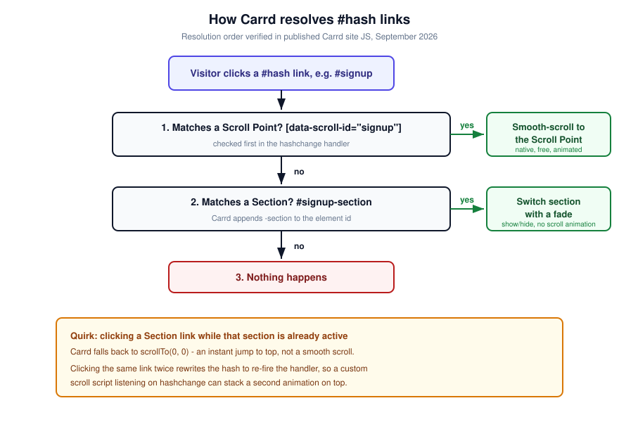
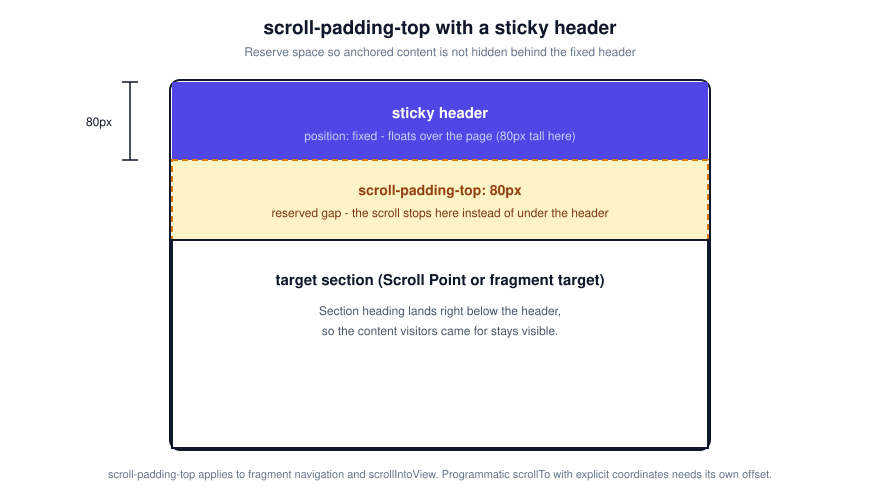

import Button from "../../components/widgets/Button.astro";
import { Picture } from "astro:assets";
import imag1 from "../../assets/images/24/02/carrd-back-to-top-embed.png";
import Notice from "../../components/widgets/Notice.astro";
import ListCheck from "../../components/widgets/ListCheck.astro";
import Tabs from "../../components/widgets/Tabs.astro";
import Tab from "../../components/widgets/Tab.astro";
import Accordion from "../../components/widgets/Accordion.astro";

Carrd smooth scroll is now built in. Scroll Points glide visitors to any anchor with zero code, on every plan, including Free. That changes the order of this guide, because most "smooth scroll for Carrd" tutorials, older versions of this one included, start with an embed snippet you do not actually need.

What has not changed: the browser still needs a target to scroll to, and your navigation still needs anchor links pointing at it. What changed is who does the animating. Carrd's own published site JavaScript calls `scrollTo({behavior:'smooth'})` when a Scroll Point link fires (verified in the inline JS of a live published Carrd site, September 2026), so the native route covers the common case. Click a nav link, the page glides.

The custom embed code still earns its place in three situations: you want to control scroll duration or easing, you need a sticky-header offset Carrd does not apply, or you want extras like a scroll progress bar or a smooth back-to-top button. Everything below runs from "free and zero code" down to "paste this snippet", so stop at the first option that solves your case. The native route costs nothing on every Carrd plan.

<Notice type="info" title="2026 update">
Carrd smooth-scrolls to Scroll Points natively now. Treat the code snippets below as optional. Use them only for custom speed, easing, or a sticky-header offset.
</Notice>

<Button link="https://go.bitdoze.com/carrd" text="Carrd.co" />

Some Carrd tutorials:

- [Add Popup Modal to Carrd](https://www.bitdoze.com/carrd-popup-modal/)
- [Add Testimonial Slider to Carrd](https://www.bitdoze.com/carrd-testimonial-slider/)
- [Add Dark Mode Toggle to Carrd](https://www.bitdoze.com/carrd-dark-mode-toggle/)
- [Add Floating Menu to Carrd](https://www.bitdoze.com/carrd-floating-menu/)
- [Add Sidebar Menu to Carrd](https://www.bitdoze.com/carrd-sidebar-menu/)
- [Carrd.co Review](https://www.bitdoze.com/carrd-review/)

> The complete list with Carrd plugins, themes and tutorials you can find on my **[carrdme.com](https://carrdme.com/)** website.

## Why Smooth Scrolling Matters

On a one-page site the whole navigation story is scrolling. Visitors click "Pricing" and expect to land there with some sense of the distance they just travelled.

1. **Better user orientation** - The page visibly moves through its own structure, so visitors understand where the target sits relative to everything else.

2. **Professional feel** - Small interactions like this separate a thrown-together page from a finished one. One-page navigation lives or dies on details like this.

3. **Reduced disorientation** - An instant jump from hero to footer is disorienting on long Carrd sections. A glide is not.

It also works with whatever navigation you already use: a [sticky header](https://www.bitdoze.com/add-stickey-header-carrd/), a [floating menu](https://www.bitdoze.com/carrd-floating-menu/), or [sidebar navigation](https://www.bitdoze.com/carrd-sidebar-menu/). Smooth scrolling improves all of them.

## Do You Still Need Code for Smooth Scrolling in Carrd?

Short answer: no, not for plain anchor scrolling. Add a Scroll Point, link to it with `#name`, done. Carrd animates the scroll in the browser.

You still need code when you want any of these:

- A specific scroll duration or easing curve
- A sticky-header offset so content does not park itself under your fixed header
- Decorative extras: a scroll progress bar, a styled back-to-top button, scroll-triggered effects

If none of those apply, jump to [How to Use Carrd Scroll Points for Native Smooth Scroll](#how-to-use-carrd-scroll-points-for-native-smooth-scroll) and ignore the rest of this page.

### How Carrd Resolves `#hash` Links: Scroll Points vs. Sections

Before picking a method, it helps to know what Carrd does when a `#hash` changes. The old version of this article conflated Scroll Points and section IDs. They are different features with different DOM footprints.

From the published site JavaScript of a live Carrd site (inspected September 2026), the `hashchange` handler resolves a hash in this order:

<Notice type="info" title="Under the hood">
1. <code>[data-scroll-id="hash"]</code> - it is a Scroll Point. Carrd smooth-scrolls to it if its section is visible.
2. <code>#hash-section</code> - it is a Section. Carrd shows or switches to that section with a fade. No scroll animation, because there is nothing to scroll.
3. Anything else - nothing happens.
</Notice>

A section named `contact` really does render as `<section id="contact-section">` in the published DOM. That `-section` suffix is why custom scripts fall back to `document.querySelector(hash + '-section')`.



<Notice type="warning" title="The instant-jump quirk">
If the target section is already active, a Section link falls back to <code>scrollTo(0, 0)</code>. That is an instant jump to the top of the page, not a smooth scroll. Also, clicking the same link twice makes Carrd rewrite the hash to re-fire the handler. A custom script listening on <code>hashchange</code> can stack a second animation on top of Carrd's own, which is where "double animation" jitter comes from.
</Notice>

## How to Use Carrd Scroll Points for Native Smooth Scroll

This is the default path. It is free on every Carrd plan, including Free (3 sites), and needs no embed element. Scroll Points are plain Control elements.

<ListCheck>
<ul>
<li>Add a Scroll Point control element where the linkable point should sit</li>
<li>Point any button or link at it with <code>#name</code></li>
<li>Deep-link from outside with <code>yourdomain.com/#name</code>, or use <code>scrollpoint:next</code> style special URLs</li>
</ul>
</ListCheck>

<Notice type="success" title="Free plan friendly">
Scroll Points and Section Breaks are Control elements. No Pro plan required. Docs: [using Scroll Points](https://carrd.co/docs/building/using-scroll-points).
</Notice>

### Step 1: Add a Scroll Point Control Element

1. In the Carrd builder, click `+` (Add Element)
2. Choose **Control**
3. Set **Type** to **Scroll Point**
4. Name it with lowercase letters, numbers, and hyphens only: `signup`, `pricing`, `contact`
5. Drop it exactly where the linkable point should sit, usually just above a heading

Names are case-sensitive and the lowercase restriction is real. `Signup` and `sign up` will not resolve. If you cannot find a name later, open **More Actions → Elements...** (the Elements Panel added in August 2026) for a list of every element on the page.

Published sites also carry a `scroll-behavior` data attribute on Scroll Points with values like `default`, `center`, and `previous` visible in the JS. I have not confirmed a matching control in the builder UI, so do not build around it.

### Step 2: Link to It with `#name`

Any URL field in Carrd takes the hash:

- Button URL: `#pricing`
- Text link: `#signup`
- Nav item in a [Carrd mobile responsive navbar](https://www.bitdoze.com/carrd-mobile-navbar/): same `#pricing` format

**Verify:** publish the site, click the link, and watch two things. The URL hash should change to `#pricing`, and the page should glide rather than teleport. If the URL does not change, the link is wrong. If the URL changes but the page jumps instantly, you are pointing at a Section, not a Scroll Point.

### Step 3: Deep Links and `scrollpoint:` Special URLs

Scroll Points work as real anchors from outside the page. Share `https://yourdomain.com/#pricing` in an email or social post and Carrd scrolls to the point on load.

For sequential one-pagers, Carrd also accepts special URLs (see [URL types in the docs](https://carrd.co/docs/building/url-types)):

- `scrollpoint:next` - next Scroll Point down
- `scrollpoint:previous` - previous one up
- `scrollpoint:first` - first Scroll Point
- `scrollpoint:last` - last one

These are handy on "Next section" buttons at the bottom of each block.

**Verify:** open `yourdomain.com/#pricing` in a fresh incognito window. You should land scrolled to the pricing block with the hash visible in the address bar.

**Failure mode:** a name typo resolves to nothing silently. Check exact spelling in the Elements Panel before you chase other causes.

## Prerequisites: Carrd Plans and the Embed Element

Everything from Option 1 onward pastes custom code, and custom code needs the Embed element. That is where Carrd gates the features. Prices below are from [carrd.co/pro](https://go.bitdoze.com/carrd) as of September 2026.

| Feature | Plan needed | Cost |
|---|---|---|
| Scroll Points, Section Breaks | Any, including Free | $0 |
| Embed element (custom code) | Pro Standard and up | $19/yr, 10 sites |
| Advanced Settings (fixed element IDs, Events) | Pro Plus and up | $49/yr, 25 sites |

Full plan list if you need more sites: Free (3 sites), Pro Lite $9/yr (3 sites), Lite 10 $14/yr, Lite 25 $29/yr, Pro Standard $19/yr (10 sites, includes embeds, widgets, forms, analytics), Pro Plus $49/yr (25 sites, adds Advanced Settings, Events, redirects, password protection), Plus 50 $89/yr, Plus 100 $159/yr. See the [Carrd plan comparison in our Carrd.co review](https://www.bitdoze.com/carrd-review/) if you want a second opinion before paying.

**Decision rule:** start on Free with Scroll Points. Upgrade to [Carrd Pro Standard](https://go.bitdoze.com/carrd) ($19/yr) only when you actually need custom code. Pro Plus ($49/yr) is only worth it for Advanced Settings and Events.

<Button link="https://go.bitdoze.com/carrd" text="Compare Carrd plans" variant="outline" />

<ListCheck>
<ul>
<li>A Carrd account (any plan for native Scroll Points, Pro Standard+ for the code options)</li>
<li>A published site to test on - embeds do nothing in the builder</li>
<li>Your sticky header height in pixels, if you have one</li>
<li>10 minutes and one browser tab with dev tools open</li>
</ul>
</ListCheck>

<Notice type="warning" title="Plan gates">
Scroll Points and Section Breaks: free. The Embed element (all code options below): Pro Standard at $19/yr. Advanced Settings with fixed element IDs and On Click events: Pro Plus at $49/yr.
</Notice>

### The embed flow, once

For every code option below:

1. Click `+` (Add Element) → **Embed**
2. **Type:** Code
3. **Style:** Hidden
4. **Location:** Head, Body Top, or Body End (docs for [embedding custom code](https://carrd.co/docs/building/embedding-custom-code) list all three)

<Picture src={imag1} alt="Carrd embed element set to Code type and Hidden style; use Head for style-only snippets and Body End for markup and scripts" />

Placement convention used in this guide:

- Pure `<style>` snippets → Hidden, **Head**
- Anything with `<div>`, `<button>`, or `<script>` → Hidden, **Body End**

<Notice type="info" title="Nothing renders in the builder">
Embeds output nothing in the Carrd builder. You must publish the site to see them work. This is the number one reason "my smooth scroll does nothing". You are previewing in the wrong place.
</Notice>

If you have never used a Hidden embed before, the [Carrd popup modal tutorial](https://www.bitdoze.com/carrd-popup-modal/) walks the same flow for a different feature, and the [Carrd dark mode toggle](https://www.bitdoze.com/carrd-dark-mode-toggle/) is another embed-based customization worth stealing patterns from. A [cookie notice](https://www.bitdoze.com/add-cookie-notice-carrd/) is another Hidden embed example if you want more reps.

## Option 1: CSS-Only Smooth Scroll for Carrd

The lightest code option. One `<style>` block, no script, and it also fixes the sticky-header offset for fragment jumps via `scroll-padding-top`.

```html
<style>
  html {
    scroll-behavior: smooth;
    scroll-padding-top: 80px; /* sticky header height; remove if none */
  }
  @media (prefers-reduced-motion: reduce) {
    html { scroll-behavior: auto; }
  }
</style>
```

Paste it into an Embed element set to Code, Hidden, **Head**.

Browser support as of September 2026 (MDN data): `scroll-behavior` is Chrome 61+, Firefox 36+, Edge 79+, Safari/iOS 15.4+ (Safari was the holdout and shipped it in March 2022). `scroll-padding-top` is Chrome 69+, Firefox 68+, Safari 14.1+/iOS 14.5+. Nobody on a current browser misses this.

<Notice type="info" title="Where CSS smooth scroll helps">
It animates real browser fragment navigation. On a sectioned Carrd site, <code>#work</code> links switch sections with a fade - there is no scroll for CSS to smooth. So this option is a harmless baseline, and the actual fix for sticky-header offsets on fragment jumps. If your "anchors" are Sections, see Option 4 instead.
</Notice>

The `scroll-padding-top: 80px` line is the part people miss. Set it to your [sticky header](https://www.bitdoze.com/add-stickey-header-carrd/) height so anchored headings do not end up hidden underneath it.



One nuance worth knowing: `scroll-padding-top` applies to fragment navigation and `scrollIntoView`. It does not affect programmatic `scrollTo` calls with explicit coordinates. Carrd's native scroll uses `offsetTop` plus `scrollTo`, and so does the custom script in Option 2. Both need their own offset. That is exactly what Options 2 and 3 are for.

**Verify:** publish, click an anchor link on desktop and on iOS Safari (the historical holdout). The target heading should sit fully below the header.

**Failure mode:** content still hides behind the header. Either `scroll-padding-top` is smaller than your actual header height, or you are on the JS path and need `headerOffset` instead.

## Option 2: Custom Scroll Speed with JavaScript

Reach for this only when the native speed is wrong for your design. It gives you a duration knob and an easing curve. It replaces the two near-identical scripts earlier versions of this article shipped: one script now covers both speed and offset.

```html
<script>
(function() {
  const scrollDuration = 800;           // ms
  const headerOffset = 80;              // sticky header height in px
  const prefersReduced = window.matchMedia('(prefers-reduced-motion: reduce)').matches;

  function smoothScroll(target) {
    const start = window.pageYOffset;
    const end = target.offsetTop - headerOffset;
    const distance = end - start;
    if (prefersReduced || distance === 0) { window.scrollTo(0, end); return; }
    let startTime = null;
    function easeInOutQuad(t) { return t < 0.5 ? 2 * t * t : -1 + (4 - 2 * t) * t; }
    function animate(now) {
      if (!startTime) startTime = now;
      const progress = Math.min((now - startTime) / scrollDuration, 1);
      window.scrollTo(0, start + distance * easeInOutQuad(progress));
      if (progress < 1) requestAnimationFrame(animate);
    }
    requestAnimationFrame(animate);
  }

  window.addEventListener('hashchange', function() {
    setTimeout(function() {
      const h = location.hash.slice(1);
      if (!h) return;
      // Carrd order: scroll points first (data-scroll-id), then sections (-section)
      const target = document.querySelector('[data-scroll-id="' + h + '"]') ||
                     document.getElementById(h + '-section') ||
                     document.getElementById(h);
      if (target) smoothScroll(target);
    }, 10);
  });
})();
</script>
```

Paste it into an Embed element set to Code, Hidden, **Body End**. Not Head. The old article said Head, which was wrong for scripts like this.

Configuration:

- `scrollDuration = 800` - milliseconds for the full scroll. 600 feels snappy, 800 is the default here, 1000 to 1200 feels slow and cinematic.
- `headerOffset = 80` - set to 0 if you have no sticky header. Option 3 covers tuning it.

The script resolves targets in Carrd's real order: `[data-scroll-id]` first, then `#hash-section`, then a plain `#hash` element. That is why it coexists with Scroll Points instead of fighting them.

<Notice type="warning" title="One owner of the scroll">
Carrd already smooth-scrolls Scroll Points. Adding this script means two things animate the same hash change, which can double-animate and jitter. Inferred from Carrd's published JS rather than reproduced on a test bench, so treat it as "may jitter - test on your published site". The fix is simple: pick one owner. Either let Carrd scroll natively and skip this script, or use this script and accept that it is the one animating.
</Notice>

**Verify:** publish, click a Scroll Point link, then click the same link again immediately. Same-link clicks make Carrd re-fire its hash handler, so this is the fastest way to expose stacked animations. Check the browser console for errors while you are there.

**Failure modes:**

- Double animation or jitter - remove one scroll owner (see the warning above)
- Nothing scrolls - Scroll Point name typo. Open More Actions → Elements... and copy the exact name
- Lands in the wrong place - that is an offset problem, go to Option 3

## Option 3: Smooth Scroll with Sticky Header Offset

This is not a second script. Option 2's snippet already has the offset built in. Set `headerOffset` to your sticky header height in pixels.

| Setup | Config |
|---|---|
| No sticky header | `const headerOffset = 0;` |
| Sticky header, fixed height | `const headerOffset = 80;` (match your header) |
| Header height varies | measure it (below) |

If your header height differs between desktop and mobile, hardcoding one number will land wrong on one of them. Measure instead:

```js
const headerOffset = (document.querySelector('header') || {}).offsetHeight || 80;
```

Drop that in place of the hardcoded `const headerOffset = 80;`. If your sticky element is not a `header` tag, adjust the selector to whatever class Carrd or your [sticky header tutorial](https://www.bitdoze.com/add-stickey-header-carrd/) gave it.

Why this option exists at all: `scroll-padding-top` from Option 1 does not apply to programmatic `scrollTo` with explicit coordinates. Custom scroll scripts fall in that bucket, so they need their own offset math.

<Notice type="info" title="Pro Plus escape hatch">
On Pro Plus, Advanced Settings exposes Events, including On Click on Buttons and Links. For a single CTA that needs custom scrolling, running your scroll function from an On Click event is cleaner than intercepting every hash change on the page. See [Advanced Settings](https://carrd.co/docs/building/using-advanced-settings). Fixed element IDs live behind the same Pro Plus gate per the docs, which is another reason Scroll Points are the better anchor mechanism.
</Notice>

**Verify:** with your header fully expanded (open the mobile menu if it pushes the header taller), click into a section near the bottom of a long page. The heading should land just below the header.

**Failure modes:** still short or overshooting means `headerOffset` is wrong for the current breakpoint. Works on desktop, wrong on mobile, means the header height differs and you need the measured version.

## Option 4: Section Transitions with On Section Change Animation

If your site is built on Carrd **sections**, you do not have a scrolling problem. You have a transition problem. Section links show and hide whole sections like pages. The "smooth" visitors expect here is a fade between sections, and Carrd has that built in.

First, the setup ([setting up a section](https://carrd.co/docs/building/setting-up-a-section) in the docs):

1. Add Element → Control → Type: **Section Break**
2. Name it (`work`, `pricing`) with the same lowercase rule
3. Link to it with `#work`
4. Deep-link externally with `yourdomain.com/#work`
5. Special URLs `section:next`, `section:previous`, `section:first`, `section:last` work the same as `scrollpoint:` ones

Then the transition: select the **Page** element, open the **Animation** tab, and pick an "On Section Change" effect. Carrd animates the switch natively. A published Carrd demo site inspected in September 2026 shipped `transition: opacity 0.5s ease-in-out` as its default, which is observation, not a documented spec value.

Section Breaks are Control elements, so this stays on the free plan.

<Notice type="info" title="Scroll Points vs. Sections">
Scroll Points scroll within the section you are looking at. Section Breaks switch which section is visible. If people complain that "smooth scroll does not work" on your site, they usually have section links and want this option instead.
</Notice>

<Tabs>
  <Tab name="Scroll Point">
    **Use when:** everything lives in one visible page and you want the viewport to glide to a block.

    **DOM:** `[data-scroll-id="signup"]`

    **Link:** `#signup` - smooth-scrolls (native, free)

    **Animation control:** none built in. Use Option 1 or 2.
  </Tab>
  <Tab name="Section">
    **Use when:** your Carrd site is split into sections and navigation feels like moving between pages.

    **DOM:** `id="work-section"`

    **Link:** `#work` - shows/switches that section with a fade

    **Animation control:** Page element → Animation tab → On Section Change
  </Tab>
</Tabs>

**Verify:** publish and click `#work` from two different sections. Then click `#work` while already on `work`. That second click is the quirk: it does an instant jump to top. Expect it instead of debugging it.

**Failure mode:** "smooth scroll does not work on my section links" - correct, it will not. Sections switch; they do not scroll. Use this option's On Section Change animation, or rebuild the page around Scroll Points if you truly want a scrolling one-pager.

## Option 5: Scroll Progress Bar

A colored bar at the top showing how far down the page visitors are. Standalone, pairs with any scrolling option above.

```html
<style>
  .scroll-progress {
    position: fixed;
    top: 0;
    left: 0;
    width: 0%;
    height: 3px;
    background: #4f46e5;
    z-index: 99999;
    transition: width 0.1s;
  }
</style>

<div class="scroll-progress" id="scrollProgress"></div>

<script>
(function() {
  const progressBar = document.getElementById('scrollProgress');

  function updateProgress() {
    const scrollTop = window.pageYOffset;
    const docHeight = document.documentElement.scrollHeight - window.innerHeight;

    if (docHeight > 0) {
      progressBar.style.width = (scrollTop / docHeight) * 100 + '%';
    }
  }

  window.addEventListener('scroll', updateProgress);
  updateProgress();
})();
</script>
```

Change `background: #4f46e5` to your brand color.

<Notice type="warning" title="Placement">
This snippet contains a <code>&lt;div&gt;</code> and a <code>&lt;script&gt;</code>, so it goes in a Hidden embed at <code>Body End</code>, not Head. Keeping the whole snippet in one Body End embed is simpler than splitting style and markup across two embeds.
</Notice>

**Verify:** publish (the builder shows nothing), scroll slowly, and the bar should grow from 0% to 100% across the page width.

**Failure modes:** bar invisible, suspect `z-index` collision with your sticky header - the bar uses `99999`, raise it or lower the header. Bar stuck at 0, open the browser console; a JS error kills `updateProgress`. Nothing at all in the builder is expected behavior.

## Option 6: Carrd Back to Top (Native `browser:top` vs Smooth Button)

Two routes for getting visitors back to the top of a long one-pager.

<Tabs>
  <Tab name="Native link (free)">
    Set any link's URL to `browser:top`. It is a documented [URL type](https://carrd.co/docs/building/url-types) meaning "scroll to the top of the current page". Zero code, works on Free.

    Carrd's JS implements the to-top jump as `scrollTo(0, 0)`, which appears to be instant rather than smooth in current Carrd. Inferred from the published JS rather than clicked end-to-end, so if your site animates it, great - but do not plan on animation.
  </Tab>
  <Tab name="Smooth button (Pro Standard+)">
    A styled button that glides up. Needs the Embed element, so Pro Standard at $19/yr. Full code below. The button shows after 300px of scroll and calls `scrollTo({top: 0, behavior: 'smooth'})` on click.

    This is the animated Carrd back to top route.
  </Tab>
</Tabs>

The smooth button snippet, into an Embed set to Code, Hidden, **Body End**:

```html
<style>
  .back-to-top {
    position: fixed;
    bottom: 30px;
    right: 30px;
    width: 50px;
    height: 50px;
    background: #4f46e5;
    color: white;
    border: none;
    border-radius: 50%;
    cursor: pointer;
    font-size: 24px;
    display: flex;
    align-items: center;
    justify-content: center;
    opacity: 0;
    visibility: hidden;
    transition: all 0.3s ease;
    z-index: 1000;
    box-shadow: 0 4px 15px rgba(0,0,0,0.2);
  }

  .back-to-top.visible {
    opacity: 1;
    visibility: visible;
  }

  .back-to-top:hover {
    background: #4338ca;
    transform: translateY(-3px);
  }
</style>

<button class="back-to-top" id="backToTop" aria-label="Back to top">↑</button>

<script>
  const backToTopButton = document.getElementById('backToTop');

  // Show/hide button based on scroll position
  window.addEventListener('scroll', function() {
    if (window.pageYOffset > 300) {
      backToTopButton.classList.add('visible');
    } else {
      backToTopButton.classList.remove('visible');
    }
  });

  // Smooth scroll to top
  backToTopButton.addEventListener('click', function() {
    window.scrollTo({
      top: 0,
      behavior: 'smooth'
    });
  });
</script>
```

<Picture src={imag1} alt="Carrd embed element set to Code, Hidden style, Body End placement for the back-to-top button markup and script" />

The `aria-label="Back to top"` is doing accessibility work for screen readers and it is already in the snippet. Keep it if you restyle. If your OS has "reduce motion" enabled and the jump feels instant, that is `behavior: 'smooth'` being overridden at the platform level, not a bug in the code.

**Verify:** publish, scroll past 300px, confirm the button fades in. Click it and watch for a glide to the top.

**Failure modes:** button never appears - the `<button>` plus `<script>` are in Head instead of Body End, or a JS error stopped the listener. Jump is instant, not smooth - check that `behavior: 'smooth'` is still in your copy and that the OS is not forcing reduced motion.

For a more complete styled version, with keyboard focus handling and label options, use the [full back to top button tutorial for Carrd](https://www.bitdoze.com/carrd-back-to-top-button/).

## Setting Up Anchor Links in Carrd Navigation

Wiring navigation to anchors is the same job regardless of which scroll method you picked.

<ListCheck>
<ul>
<li>Every link URL starts with <code>#</code> and matches the Scroll Point or Section name exactly</li>
<li>Names are lowercase, letters plus numbers plus hyphens only</li>
<li>Scroll Point targets use <code>#signup</code>; Section targets use <code>#work</code></li>
<li>Test every nav item once on desktop and once on a phone after publishing</li>
</ul>
</ListCheck>

Three nav styles cover most Carrd sites:

1. **Built-in buttons and links** - set the URL field to `#pricing`. Nothing else to do.

2. **A [Carrd mobile responsive navbar](https://www.bitdoze.com/carrd-mobile-navbar/)** - anchors behave the same way, but mobile headers are often taller or shorter than desktop. If you use `scroll-padding-top` or `headerOffset`, test it at mobile breakpoints specifically.

3. **Third-party [floating menu](https://www.bitdoze.com/carrd-floating-menu/) or [sidebar navigation](https://www.bitdoze.com/carrd-sidebar-menu/) widgets** - same `#name` URLs. These are embed-based, so remember they need Pro Standard and only render on the published site.

**Verify:** after publishing, click every nav item once on a desktop browser and once on a phone. Watch the URL hash change on each click.

**Failure modes:** an item jumps instantly to a different "page-like" view - it is a Section link, see Option 4. Everything works on desktop but lands short on mobile - the header height at that breakpoint does not match your `scroll-padding-top` or `headerOffset`.

## Accessibility: Respect prefers-reduced-motion

<Notice type="info" title="One line of respect">
Not everyone wants the page moving under them. Animated scrolling triggers nausea for some visitors with vestibular disorders, and they say so at the OS level. Honor it.
</Notice>

The CSS option already wraps the rule:

```css
@media (prefers-reduced-motion: reduce) {
  html { scroll-behavior: auto; }
}
```

The JS option short-circuits at the top:

```js
const prefersReduced = window.matchMedia('(prefers-reduced-motion: reduce)').matches;
```

When that is `true`, the Option 2 script jumps straight to the target with `window.scrollTo(0, end)` and skips the animation loop. Support is broad: Chrome 74+, Firefox 63+, Safari 10.1+ (MDN data, September 2026).

Two more things while you are here: keep the `aria-label` on the back-to-top button from Option 6, and do not rely on scroll animation alone to tell visitors where they are. Pair it with visible heading structure or nav highlighting.

**Verify:** turn on "Reduce motion" in macOS Accessibility or Windows Animations settings. Reload the published site and click an anchor. It should jump instantly, with no console errors and no half-finished animation frames.

## Troubleshooting Carrd Smooth Scroll

<Notice type="warning" title="Test on the published site, not the builder">
Embeds render nothing in the Carrd builder. If your smooth scroll "does not work", publish first, then open the live URL (incognito avoids stale cache) before you change any code.
</Notice>

<Accordion label="Nothing happens in the builder or preview" group="faq">
Embeds are stripped from builder output on purpose. Carrd's docs say you need to publish to see custom code in action. Publish, then test on the real URL.
</Accordion>

<Accordion label="Double animation or jitter with a custom script" group="faq">
Carrd already smooth-scrolls Scroll Points. If your script also animates on `hashchange`, two animations stack. Remove one scroll owner: either delete the custom script and use native Scroll Points, or keep the script and understand it is now the one animating. Test with two rapid clicks on the same link, since same-hash re-clicks deliberately re-fire Carrd's handler.
</Accordion>

<Accordion label="Links do not work or jump to the wrong place" group="faq">
Names are case-sensitive. A Scroll Point named `About` will not match `#about`. Scroll Point names must be lowercase letters, numbers, and hyphens. Open More Actions → Elements... (Elements Panel, added August 2026) and copy the exact names instead of typing them from memory.
</Accordion>

<Accordion label="Content hides behind my sticky header" group="faq">
The offset is too small for the CSS path (`scroll-padding-top`) or the JS path (`headerOffset`). Mobile header heights often differ from desktop. Option 3 shows the measured `offsetHeight` version that adapts per viewport.
</Accordion>

<Accordion label="Clicking the same link twice misbehaves" group="faq">
Expected quirk. Carrd rewrites the same hash (`history.replaceState` then `location.replace`) to re-trigger its own handler, so the second click is a real navigation event. Custom listeners can stack an extra animation on top. This is a cosmetic annoyance, not data loss.
</Accordion>

<Accordion label="Section links are not smooth at all" group="faq">
They never will be. Section links switch visible sections with a fade; they do not scroll. If the section is already active you get an instant `scrollTo(0, 0)`. For animated section changes use Option 4, or rebuild on Scroll Points if you want real scrolling.
</Accordion>

<Accordion label="Scroll speed feels wrong" group="faq">
That is `scrollDuration` in Option 2, in milliseconds. 600 to 1000 feels natural to most people. Native Carrd speed is fixed; if the native speed is your only complaint, Option 2 is the fix.
</Accordion>

### Removing Smooth Scroll (Rollback)

Undo is trivial on Carrd, since everything is per-site embeds and control elements. No leftover CSS or JS on Carrd's side.

- **Custom code:** delete the Embed element (or just its code). Refresh the published site and you are back to native behavior.
- **A Scroll Point or Section Break:** delete the Control element. But update any `#name` links pointing at it first, or those links dead-end. Order matters: fix nav links, then delete the target.
- **`scroll-behavior` CSS only:** delete the Head embed from Option 1. Nothing else to clean up.

Because rollback is this cheap, there is no reason to avoid trying a code option on a published staging domain before your main one.

<Button link="https://go.bitdoze.com/carrd" text="Try Carrd.co" />

## Conclusion

The decision rule, in order:

1. **Scroll Points** for anchor navigation. Free, native Carrd smooth scroll, zero code.
2. **Option 1 CSS** if a sticky header covers your anchors. `scroll-padding-top` is the whole fix.
3. **Option 2 and 3 JavaScript** only for custom speed or offsets CSS cannot do.
4. **Option 4** if you have a sectioned site and want animated section changes instead of scrolling.

Pair any of it with a [floating menu](https://www.bitdoze.com/carrd-floating-menu/) or [sidebar navigation](https://www.bitdoze.com/carrd-sidebar-menu/) for complete one-pager navigation.

If you want to go further with Carrd layout, [carrdme.com](https://carrdme.com/) has plugins worth a look, including a [Carrd tabs plugin](https://go.carrdme.com/tabs) for organizing long page content and a [Carrd accordion plugin](https://go.carrdme.com/accordion) for FAQ sections.

<Button link="https://go.bitdoze.com/carrd" text="Try Carrd.co" />
<Button link="https://go.carrdme.com/tabs" text="Carrd Tabs plugin" variant="outline" size="sm" />
