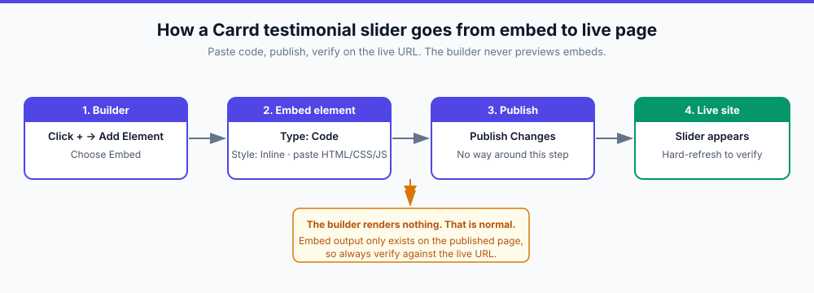
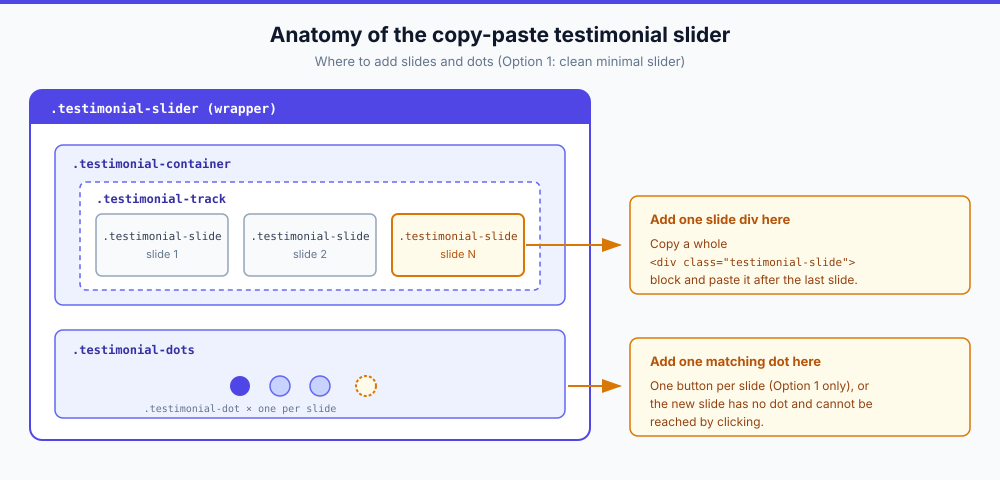

import Button from "../../components/widgets/Button.astro";
import Notice from "../../components/widgets/Notice.astro";
import ListCheck from "../../components/widgets/ListCheck.astro";
import Tabs from "../../components/widgets/Tabs.astro";
import Tab from "../../components/widgets/Tab.astro";
import { Picture } from "astro:assets";
import imag1 from "../../assets/images/24/02/carrd-back-to-top-embed.png";

Social proof sells. When potential customers see others vouching for your work, they're more likely to trust you. But cramming multiple testimonials onto a single-page [Carrd](https://go.bitdoze.com/carrd) site takes up valuable space.

In this guide you'll add a **Carrd testimonial slider** with three free copy-paste designs: a minimal dots-and-autoplay carousel, a card slider with arrows, and a testimonial grid that shows everything at once. Each one is a single Carrd Embed with plain HTML, CSS, and vanilla JavaScript. Nothing to build and no vendor script to load.

**What you need before you start:**

<ListCheck>
<ul>
<li>Carrd account on Pro Standard ($19/year) or higher. The Embed element is not available on Free or Pro Lite (source: Carrd's plans documentation, checked 2026-09-24).</li>
<li>A Carrd site with a section ready to hold the slider. Full-width section is the safe default; the snippets assume max-width 700 to 800px.</li>
<li>Testimonial copy with names and roles. Avatar photos are optional, and placeholder avatars are fine for testing only.</li>
<li>Nothing else. You do not need a server, npm, or a separate plugin.</li>
</ul>
</ListCheck>

**Cost.** Carrd's ladder is Free (3 sites on a `*.carrd.co` address, with branding, no embeds), Pro Lite at $9/year (3 sites, no branding, still no embeds), **Pro Standard at $19/year** (10 sites, custom domains, Embeds, Widgets, Forms, Analytics), and Pro Plus at $49/year (25 sites, custom forms, site source download). This tutorial needs Pro Standard. Prices verified 2026-09-24 on the <a href="https://carrd.co/docs/pro/plans" target="_blank" rel="noopener noreferrer">official plans page</a>, re-check in your dashboard before paying. If the $19 gives you pause, read [whether Carrd Pro Standard is worth $19/year](https://www.bitdoze.com/carrd-review/) first.

<Notice type="warning" title="Embeds need Carrd Pro Standard">
All three designs use the Embed element, which is gated behind Pro Standard or higher. On Free or Pro Lite you cannot paste custom code at all. Closest native approximation: two or three side-by-side Columns, each holding a styled Text element with a quote, or testimonial screenshots placed as Image elements. It is not a slider, but it ships tonight on a free plan.
</Notice>

<Button link="https://go.bitdoze.com/carrd" text="Carrd.co" />

Some Carrd Tutorials:

- [Add Popup Modal to Carrd](https://www.bitdoze.com/carrd-popup-modal/)
- [Add Smooth Scroll to Carrd](https://www.bitdoze.com/carrd-smooth-scroll/)
- [Add Dark Mode Toggle to Carrd](https://www.bitdoze.com/carrd-dark-mode-toggle/)
- [Add Floating Menu to Carrd](https://www.bitdoze.com/carrd-floating-menu/)
- [Add FAQ Accordions to Carrd](https://www.bitdoze.com/add-accordion-carrd/)
- [Carrd.co Review](https://www.bitdoze.com/carrd-review/)

> You can find the complete list of Carrd plugins, themes and tutorials on my **[carrdme.com](https://carrdme.com/)** website.

## Why use a testimonial slider on Carrd

A Carrd testimonial carousel beats a wall of static quotes:

1. Saves space. Show 5-10 testimonials in the space of one.

2. Keeps content fresh. Visitors who stay on the page see different quotes without scrolling.

3. Draws attention. Movement catches the eye and pulls focus to your social proof.

4. Looks professional. It's a common pattern on well-designed sites.

5. Works on mobile. Swipe-friendly design for touch devices.

## How to add a testimonial slider to Carrd

Here is how to add testimonials to Carrd in three styles: drop in one Embed element, paste one of the snippets below, publish, then verify on the live URL. The workflow is short, but the publish-and-verify part is not optional.



### Step 1: Add an Embed element in Carrd

Click the `+` sign and add an Embed element:

- Type: Code
- Style: **Inline** (important: this displays the slider on your page)

<Picture src={imag1} alt="Adding an Embed element in the Carrd builder for a testimonial slider" />

On a long page, use the Elements Panel (More Actions, then Elements, shipped in the builder on 2026-08-07) to jump straight to the embed you just added instead of scrolling.

This is the same embed workflow used by every Carrd widget on this site. If you want a second worked example before you touch testimonials, [add a back-to-top button with an embed](https://www.bitdoze.com/carrd-back-to-top-button/) first.

<Notice type="warning" title="You won't see the slider in the builder">
Carrd does not render embed code in the editor. After pasting, click **Publish Changes**, open the live URL, and hard-refresh. The slider appears where the embed sits in the section order. A blank spot in the builder means nothing is broken.
</Notice>

<Notice type="info" title="Pro tip: split code and markup">
Keep the visible embed purely presentational. Put the HTML and CSS in the Inline embed, then put the `<script>` half in a second Embed with Style **Hidden** and placement **Body End**. Carrd documents both styles plus the Head, Body Top, and Body End placements for Hidden embeds in the <a href="https://carrd.co/docs/building/embedding-custom-code" target="_blank" rel="noopener noreferrer">official embedding docs</a>.
</Notice>

**Verify:** Publish Changes, open the live URL, hard-refresh. Expected result: the slider renders below the embed's position with the first testimonial visible. Broken looks like: an empty gap on the live page (code missing or Style set to Hidden) or raw code text on the page (Type set to something other than Code).

### Step 2: Choose your slider style

Three designs below. Pick one and paste the whole block into the embed.

<Tabs>
<Tab name="Option 1: Dots + autoplay">
The compact default. One quote at a time, auto-rotates every 5 seconds, pauses on hover, swipe on mobile, nav dots underneath. Best when vertical space is tight and you want the quotes to move on their own.

Jump to [Option 1: Clean minimal slider](#option-1-clean-minimal-slider-dots-autoplay).
</Tab>
<Tab name="Option 2: Arrows">
A card look with left/right arrows, star ratings, and a `1 / N` counter. Manual control first, autoplay second. Best for longer quotes and when you want visitors to browse at their own pace.

Jump to [Option 2: Card slider with arrows](#option-2-card-slider-with-arrows).
</Tab>
<Tab name="Option 3: Grid">
Not a slider at all. Shows every testimonial at once on desktop, stacks on mobile. Best if you have 4 or fewer quotes and want all of them visible to visitors and search engines without JavaScript.

Jump to [Option 3: Multi-testimonial grid](#option-3-multi-testimonial-grid-no-slider).
</Tab>
</Tabs>

Rollback is trivial with all three: delete the Embed element and hit Publish Changes again.

## Option 1: Clean minimal slider (dots + autoplay)

The clean minimal design below is the closest thing to a classic Carrd testimonial carousel. It is a simple design that works with any color scheme.

```html
<style>
  :root {
    --testimonial-bg: #ffffff;
    --testimonial-text: #1f2937;
    --testimonial-secondary: #6b7280;
    --testimonial-accent: #4f46e5;
    --testimonial-quote: #e5e7eb;
    --testimonial-radius: 16px;
    --testimonial-max-width: 700px;
  }

  .testimonial-slider {
    max-width: var(--testimonial-max-width);
    margin: 40px auto;
    position: relative;
    font-family: inherit;
  }

  .testimonial-container {
    overflow: hidden;
    border-radius: var(--testimonial-radius);
    background: var(--testimonial-bg);
    box-shadow: 0 10px 40px rgba(0,0,0,0.1);
  }

  .testimonial-track {
    display: flex;
    transition: transform 0.5s ease;
  }

  .testimonial-slide {
    min-width: 100%;
    padding: 50px 40px;
    box-sizing: border-box;
    text-align: center;
  }

  .testimonial-quote-mark {
    font-size: 80px;
    color: var(--testimonial-quote);
    line-height: 1;
    margin-bottom: -20px;
    font-family: Georgia, serif;
  }

  .testimonial-text {
    font-size: 20px;
    line-height: 1.7;
    color: var(--testimonial-text);
    margin: 0 0 30px 0;
    font-style: italic;
  }

  .testimonial-author {
    display: flex;
    align-items: center;
    justify-content: center;
    gap: 15px;
  }

  .testimonial-avatar {
    width: 60px;
    height: 60px;
    border-radius: 50%;
    object-fit: cover;
    background: var(--testimonial-quote);
  }

  .testimonial-info {
    text-align: left;
  }

  .testimonial-name {
    font-size: 18px;
    font-weight: 600;
    color: var(--testimonial-text);
    margin: 0;
  }

  .testimonial-role {
    font-size: 14px;
    color: var(--testimonial-secondary);
    margin: 4px 0 0 0;
  }

  .testimonial-dots {
    display: flex;
    justify-content: center;
    gap: 10px;
    margin-top: 25px;
  }

  .testimonial-dot {
    width: 12px;
    height: 12px;
    border-radius: 50%;
    background: var(--testimonial-quote);
    border: none;
    cursor: pointer;
    transition: all 0.3s;
    padding: 0;
  }

  .testimonial-dot.active {
    background: var(--testimonial-accent);
    transform: scale(1.2);
  }

  .testimonial-dot:hover {
    background: var(--testimonial-accent);
    opacity: 0.7;
  }

  @media (max-width: 600px) {
    .testimonial-slide {
      padding: 35px 25px;
    }
    .testimonial-text {
      font-size: 17px;
    }
    .testimonial-quote-mark {
      font-size: 60px;
    }
  }
</style>

<div class="testimonial-slider">
  <div class="testimonial-container">
    <div class="testimonial-track" id="testimonialTrack">
      
      <div class="testimonial-slide">
        <div class="testimonial-quote-mark">"</div>
        <p class="testimonial-text">Working with them changed how our business runs. They delivered exactly what we needed, on time and within budget. Highly recommend!</p>
        <div class="testimonial-author">
          
          <div class="testimonial-info">
            <p class="testimonial-name">Sarah Johnson</p>
            <p class="testimonial-role">CEO, TechStart Inc.</p>
          </div>
        </div>
      </div>

      <div class="testimonial-slide">
        <div class="testimonial-quote-mark">"</div>
        <p class="testimonial-text">The attention to detail was impressive. They took the time to understand our needs and created something that exceeded expectations.</p>
        <div class="testimonial-author">
          
          <div class="testimonial-info">
            <p class="testimonial-name">Michael Chen</p>
            <p class="testimonial-role">Marketing Director, GrowthCo</p>
          </div>
        </div>
      </div>

      <div class="testimonial-slide">
        <div class="testimonial-quote-mark">"</div>
        <p class="testimonial-text">Fast, professional, and great communication throughout the project. This is how freelancing should work. Will definitely hire again.</p>
        <div class="testimonial-author">
          
          <div class="testimonial-info">
            <p class="testimonial-name">Emily Rodriguez</p>
            <p class="testimonial-role">Founder, DesignLab</p>
          </div>
        </div>
      </div>

    </div>
  </div>
  
  <div class="testimonial-dots">
    <button class="testimonial-dot active" onclick="goToSlide(0)"></button>
    <button class="testimonial-dot" onclick="goToSlide(1)"></button>
    <button class="testimonial-dot" onclick="goToSlide(2)"></button>
  </div>
</div>

<script>
var testimonialTrack = document.getElementById('testimonialTrack');
var testimonialDots = document.querySelectorAll('.testimonial-dot');
var testimonialSlides = document.querySelectorAll('.testimonial-slide');
var currentSlide = 0;
var slideInterval;

function goToSlide(index) {
  currentSlide = index;
  testimonialTrack.style.transform = 'translateX(-' + (index * 100) + '%)';
  for (var i = 0; i < testimonialDots.length; i++) {
    testimonialDots[i].classList.remove('active');
  }
  testimonialDots[index].classList.add('active');
}

function nextSlide() {
  currentSlide = (currentSlide + 1) % testimonialSlides.length;
  goToSlide(currentSlide);
}

slideInterval = setInterval(nextSlide, 5000);

testimonialTrack.onmouseenter = function() { clearInterval(slideInterval); };
testimonialTrack.onmouseleave = function() { slideInterval = setInterval(nextSlide, 5000); };

var touchStartX = 0;
testimonialTrack.ontouchstart = function(e) {
  touchStartX = e.changedTouches[0].screenX;
  clearInterval(slideInterval);
};
testimonialTrack.ontouchend = function(e) {
  var diff = touchStartX - e.changedTouches[0].screenX;
  if (diff > 50) { currentSlide = (currentSlide + 1) % testimonialSlides.length; goToSlide(currentSlide); }
  else if (diff < -50) { currentSlide = (currentSlide - 1 + testimonialSlides.length) % testimonialSlides.length; goToSlide(currentSlide); }
  slideInterval = setInterval(nextSlide, 5000);
};
</script>
```

Four small improvements worth pasting in on top of the block above. None of them change the markup structure, so the copy-paste keeps working.

Scope the theme variables. The snippet declares its colors on `:root`, which is page-global. Fine for one embed, wrong for two. Move the variables onto `.testimonial-slider` (see Theming the colors in the customizing section).

Two ARIA attributes make the wrapper announce itself as a carousel to screen readers. Full explanation in the accessibility section below.

```html
<div class="testimonial-slider" aria-roledescription="carousel" aria-label="Customer testimonials">
  <div class="testimonial-track" id="testimonialTrack" aria-live="off">
```

A fourth slide needs a fourth dot. The track, autoplay, and swipe logic count slides at runtime. The dots are hardcoded. When you add a slide, add its button:

```html
<!-- Add inside .testimonial-dots when you add a 4th slide -->
<button class="testimonial-dot" onclick="goToSlide(3)" aria-label="Go to testimonial 4"></button>
```

For accessible autoplay and an offscreen pause, paste these lines at the end of the same script block. They swap the interval to guarded start/stop helpers, skip autoplay entirely for reduced-motion users, only rotate while the slider is on screen, and pause when keyboard focus enters. Standard browser APIs only (`IntersectionObserver` and `matchMedia`). Test on your published site; the builder preview does not run embed scripts.

```js
// Accessibility + offscreen pause. Paste at the end of the existing <script> block.
var reduceMotion = window.matchMedia('(prefers-reduced-motion: reduce)').matches;

function startAuto() {
  if (reduceMotion || slideInterval) return;
  slideInterval = setInterval(nextSlide, 5000);
}

function stopAuto() {
  clearInterval(slideInterval);
  slideInterval = null;
}

// Replaces the plain setInterval start and the mouse handlers above
stopAuto();
startAuto();

testimonialTrack.onmouseenter = stopAuto;
testimonialTrack.onmouseleave = startAuto;

document.querySelector('.testimonial-slider').addEventListener('focusin', stopAuto);
document.querySelector('.testimonial-slider').addEventListener('focusout', startAuto);

if (!reduceMotion) {
  var testimonialObserver = new IntersectionObserver(function (entries) {
    entries.forEach(function (entry) {
      if (entry.isIntersecting) { startAuto(); } else { stopAuto(); }
    });
  }, { threshold: 0.3 });
  testimonialObserver.observe(document.getElementById('testimonialTrack'));
}

document.addEventListener('visibilitychange', function () {
  if (document.hidden) { stopAuto(); } else { startAuto(); }
});
```

Because `startAuto()` is idempotent (it refuses to stack a second interval) and it re-assigns the mouse handlers, pasting this after the original script is safe. If you skip this block, the slider still works, it just keeps rotating offscreen.

## Option 2: Card slider with arrows

A more interactive Carrd testimonial carousel with navigation arrows for manual control. This is the testimonial slider with arrows if that is what you are searching for. It also needs no per-slide nav markup when you add slides: the `1 / N` counter is computed from slide count.

```html
<style>
  :root {
    --card-bg: #f8fafc;
    --card-text: #0f172a;
    --card-secondary: #64748b;
    --card-accent: #0ea5e9;
    --card-border: #e2e8f0;
    --card-shadow: rgba(0, 0, 0, 0.08);
  }

  .card-slider {
    max-width: 800px;
    margin: 40px auto;
    position: relative;
    padding: 0 50px;
  }

  .card-slider-container {
    overflow: hidden;
  }

  .card-slider-track {
    display: flex;
    transition: transform 0.4s ease;
  }

  .card-slide {
    min-width: 100%;
    padding: 20px;
    box-sizing: border-box;
  }

  .card-content {
    background: white;
    border-radius: 20px;
    padding: 40px;
    border: 1px solid var(--card-border);
    box-shadow: 0 4px 20px var(--card-shadow);
  }

  .card-stars {
    color: #fbbf24;
    font-size: 20px;
    margin-bottom: 20px;
  }

  .card-text {
    font-size: 18px;
    line-height: 1.8;
    color: var(--card-text);
    margin: 0 0 25px 0;
  }

  .card-divider {
    height: 1px;
    background: var(--card-border);
    margin: 25px 0;
  }

  .card-author {
    display: flex;
    align-items: center;
    gap: 15px;
  }

  .card-avatar {
    width: 55px;
    height: 55px;
    border-radius: 50%;
    object-fit: cover;
  }

  .card-name {
    font-size: 17px;
    font-weight: 600;
    color: var(--card-text);
    margin: 0;
  }

  .card-role {
    font-size: 14px;
    color: var(--card-secondary);
    margin: 3px 0 0 0;
  }

  .card-arrow {
    position: absolute;
    top: 50%;
    transform: translateY(-50%);
    width: 45px;
    height: 45px;
    background: white;
    border: 2px solid var(--card-border);
    border-radius: 50%;
    cursor: pointer;
    display: flex;
    align-items: center;
    justify-content: center;
    font-size: 20px;
    color: var(--card-text);
    transition: all 0.2s;
    z-index: 10;
  }

  .card-arrow:hover {
    background: var(--card-accent);
    border-color: var(--card-accent);
    color: white;
  }

  .card-arrow-left {
    left: 0;
  }

  .card-arrow-right {
    right: 0;
  }

  .card-counter {
    text-align: center;
    margin-top: 20px;
    font-size: 14px;
    color: var(--card-secondary);
  }

  @media (max-width: 600px) {
    .card-slider {
      padding: 0 15px;
    }
    .card-arrow {
      width: 36px;
      height: 36px;
      font-size: 16px;
    }
    .card-arrow-left {
      left: -5px;
    }
    .card-arrow-right {
      right: -5px;
    }
    .card-content {
      padding: 30px 25px;
    }
    .card-text {
      font-size: 16px;
    }
  }
</style>

<div class="card-slider">
  <button class="card-arrow card-arrow-left" id="cardPrev">←</button>
  <button class="card-arrow card-arrow-right" id="cardNext">→</button>
  
  <div class="card-slider-container">
    <div class="card-slider-track" id="cardTrack">
      
      <div class="card-slide">
        <div class="card-content">
          <div class="card-stars">★★★★★</div>
          <p class="card-text">"Absolutely fantastic experience from start to finish. The communication was excellent, the work was top-notch, and everything was delivered ahead of schedule. I couldn't be happier with the results."</p>
          <div class="card-divider"></div>
          <div class="card-author">
            
            <div>
              <p class="card-name">David Park</p>
              <p class="card-role">Product Manager, Innovate Labs</p>
            </div>
          </div>
        </div>
      </div>

      <div class="card-slide">
        <div class="card-content">
          <div class="card-stars">★★★★★</div>
          <p class="card-text">"They transformed our outdated website into something modern and user-friendly. Our conversion rate increased by 40% within the first month. Worth every penny!"</p>
          <div class="card-divider"></div>
          <div class="card-author">
            
            <div>
              <p class="card-name">Lisa Thompson</p>
              <p class="card-role">Owner, Bloom Boutique</p>
            </div>
          </div>
        </div>
      </div>

      <div class="card-slide">
        <div class="card-content">
          <div class="card-stars">★★★★★</div>
          <p class="card-text">"Professional, creative, and incredibly easy to work with. They took our vague ideas and turned them into exactly what we needed. Already planning our next project together."</p>
          <div class="card-divider"></div>
          <div class="card-author">
            
            <div>
              <p class="card-name">James Wilson</p>
              <p class="card-role">Founder, Wilson Consulting</p>
            </div>
          </div>
        </div>
      </div>

    </div>
  </div>
  
  <div class="card-counter" id="cardCounter">1 / 3</div>
</div>

<script>
  const cardTrack = document.getElementById('cardTrack');
  const cardPrev = document.getElementById('cardPrev');
  const cardNext = document.getElementById('cardNext');
  const cardCounter = document.getElementById('cardCounter');
  const cardSlides = cardTrack.querySelectorAll('.card-slide');
  let cardIndex = 0;

  function updateCardSlider() {
    cardTrack.style.transform = `translateX(-${cardIndex * 100}%)`;
    cardCounter.textContent = `${cardIndex + 1} / ${cardSlides.length}`;
  }

  cardPrev.addEventListener('click', () => {
    cardIndex = (cardIndex - 1 + cardSlides.length) % cardSlides.length;
    updateCardSlider();
  });

  cardNext.addEventListener('click', () => {
    cardIndex = (cardIndex + 1) % cardSlides.length;
    updateCardSlider();
  });

  // Auto-rotate every 6 seconds
  setInterval(() => {
    cardIndex = (cardIndex + 1) % cardSlides.length;
    updateCardSlider();
  }, 6000);
</script>
```

Autoplay speed here is `6000` ms at the bottom of the script. Disabling autoplay works the same way as Option 1: delete or comment out that `setInterval` block.

## Option 3: Multi-testimonial grid (no slider)

If you prefer showing all testimonials at once on desktop but scrolling on mobile, this testimonial grid is the answer. No autoplay, no JavaScript, every quote present in the DOM for visitors and search engines. It is also the accessibility-friendly pick and the visual target for what Columns plus Text elements approximate on a free plan.

```html
<style>
  :root {
    --grid-bg: #fefce8;
    --grid-card-bg: #ffffff;
    --grid-text: #1c1917;
    --grid-secondary: #78716c;
    --grid-accent: #f59e0b;
  }

  .testimonial-grid {
    display: grid;
    grid-template-columns: repeat(auto-fit, minmax(300px, 1fr));
    gap: 25px;
    max-width: 1000px;
    margin: 40px auto;
    padding: 0 20px;
  }

  .grid-card {
    background: var(--grid-card-bg);
    border-radius: 16px;
    padding: 30px;
    box-shadow: 0 4px 15px rgba(0,0,0,0.05);
    transition: transform 0.2s, box-shadow 0.2s;
  }

  .grid-card:hover {
    transform: translateY(-5px);
    box-shadow: 0 8px 25px rgba(0,0,0,0.1);
  }

  .grid-rating {
    display: flex;
    gap: 3px;
    margin-bottom: 15px;
  }

  .grid-star {
    width: 20px;
    height: 20px;
    fill: var(--grid-accent);
  }

  .grid-text {
    font-size: 15px;
    line-height: 1.7;
    color: var(--grid-text);
    margin: 0 0 20px 0;
  }

  .grid-author {
    display: flex;
    align-items: center;
    gap: 12px;
    padding-top: 15px;
    border-top: 1px solid #f3f4f6;
  }

  .grid-avatar {
    width: 45px;
    height: 45px;
    border-radius: 50%;
    object-fit: cover;
  }

  .grid-name {
    font-size: 15px;
    font-weight: 600;
    color: var(--grid-text);
    margin: 0;
  }

  .grid-role {
    font-size: 13px;
    color: var(--grid-secondary);
    margin: 2px 0 0 0;
  }

  @media (max-width: 600px) {
    .testimonial-grid {
      grid-template-columns: 1fr;
    }
  }
</style>

<div class="testimonial-grid">
  
  <div class="grid-card">
    <div class="grid-rating">
      <svg class="grid-star" viewBox="0 0 20 20"><path d="M10 15l-5.878 3.09 1.123-6.545L.489 6.91l6.572-.955L10 0l2.939 5.955 6.572.955-4.756 4.635 1.123 6.545z"/></svg>
      <svg class="grid-star" viewBox="0 0 20 20"><path d="M10 15l-5.878 3.09 1.123-6.545L.489 6.91l6.572-.955L10 0l2.939 5.955 6.572.955-4.756 4.635 1.123 6.545z"/></svg>
      <svg class="grid-star" viewBox="0 0 20 20"><path d="M10 15l-5.878 3.09 1.123-6.545L.489 6.91l6.572-.955L10 0l2.939 5.955 6.572.955-4.756 4.635 1.123 6.545z"/></svg>
      <svg class="grid-star" viewBox="0 0 20 20"><path d="M10 15l-5.878 3.09 1.123-6.545L.489 6.91l6.572-.955L10 0l2.939 5.955 6.572.955-4.756 4.635 1.123 6.545z"/></svg>
      <svg class="grid-star" viewBox="0 0 20 20"><path d="M10 15l-5.878 3.09 1.123-6.545L.489 6.91l6.572-.955L10 0l2.939 5.955 6.572.955-4.756 4.635 1.123 6.545z"/></svg>
    </div>
    <p class="grid-text">"Quick turnaround and excellent quality. Exactly what I was looking for. Will definitely work together again!"</p>
    <div class="grid-author">
      
      <div>
        <p class="grid-name">Anna Lee</p>
        <p class="grid-role">Freelance Designer</p>
      </div>
    </div>
  </div>

  <div class="grid-card">
    <div class="grid-rating">
      <svg class="grid-star" viewBox="0 0 20 20"><path d="M10 15l-5.878 3.09 1.123-6.545L.489 6.91l6.572-.955L10 0l2.939 5.955 6.572.955-4.756 4.635 1.123 6.545z"/></svg>
      <svg class="grid-star" viewBox="0 0 20 20"><path d="M10 15l-5.878 3.09 1.123-6.545L.489 6.91l6.572-.955L10 0l2.939 5.955 6.572.955-4.756 4.635 1.123 6.545z"/></svg>
      <svg class="grid-star" viewBox="0 0 20 20"><path d="M10 15l-5.878 3.09 1.123-6.545L.489 6.91l6.572-.955L10 0l2.939 5.955 6.572.955-4.756 4.635 1.123 6.545z"/></svg>
      <svg class="grid-star" viewBox="0 0 20 20"><path d="M10 15l-5.878 3.09 1.123-6.545L.489 6.91l6.572-.955L10 0l2.939 5.955 6.572.955-4.756 4.635 1.123 6.545z"/></svg>
      <svg class="grid-star" viewBox="0 0 20 20"><path d="M10 15l-5.878 3.09 1.123-6.545L.489 6.91l6.572-.955L10 0l2.939 5.955 6.572.955-4.756 4.635 1.123 6.545z"/></svg>
    </div>
    <p class="grid-text">"They went above and beyond to make sure everything was perfect. Communication was smooth the entire time."</p>
    <div class="grid-author">
      
      <div>
        <p class="grid-name">Tom Harris</p>
        <p class="grid-role">Startup Founder</p>
      </div>
    </div>
  </div>

  <div class="grid-card">
    <div class="grid-rating">
      <svg class="grid-star" viewBox="0 0 20 20"><path d="M10 15l-5.878 3.09 1.123-6.545L.489 6.91l6.572-.955L10 0l2.939 5.955 6.572.955-4.756 4.635 1.123 6.545z"/></svg>
      <svg class="grid-star" viewBox="0 0 20 20"><path d="M10 15l-5.878 3.09 1.123-6.545L.489 6.91l6.572-.955L10 0l2.939 5.955 6.572.955-4.756 4.635 1.123 6.545z"/></svg>
      <svg class="grid-star" viewBox="0 0 20 20"><path d="M10 15l-5.878 3.09 1.123-6.545L.489 6.91l6.572-.955L10 0l2.939 5.955 6.572.955-4.756 4.635 1.123 6.545z"/></svg>
      <svg class="grid-star" viewBox="0 0 20 20"><path d="M10 15l-5.878 3.09 1.123-6.545L.489 6.91l6.572-.955L10 0l2.939 5.955 6.572.955-4.756 4.635 1.123 6.545z"/></svg>
      <svg class="grid-star" viewBox="0 0 20 20"><path d="M10 15l-5.878 3.09 1.123-6.545L.489 6.91l6.572-.955L10 0l2.939 5.955 6.572.955-4.756 4.635 1.123 6.545z"/></svg>
    </div>
    <p class="grid-text">"Responsive and creative. They captured our brand voice perfectly. Our customers love the new design!"</p>
    <div class="grid-author">
      
      <div>
        <p class="grid-name">Rachel Green</p>
        <p class="grid-role">Marketing Manager</p>
      </div>
    </div>
  </div>

</div>
```

## Customizing your testimonial slider

### Adding your own testimonials

Replace the placeholder content in each slide:

1. Change the paragraph content to your actual testimonial.
2. Update the name to your client's name.
3. Change the role and company.
4. Replace the image URL with your client's photo (placeholder services like pravatar.cc are for testing only).

Keep the `alt` attribute descriptive. The client's name works well. Generic or empty alts fail screen-reader users and throw away an easy accessibility win.

### Adding more slides

Copy an entire slide block and paste it after the last slide. The slider adapts to any number of slides because the track, autoplay, and swipe logic count slide elements at runtime. **But in Option 1 you must also add a matching dot button for each new slide.** The dots are hardcoded, so a fourth slide without a fourth button cannot be reached by clicking (swipe and autoplay will still show it). Option 2 needs nothing extra: its `1 / N` counter is computed from slide count.

```html
<!-- Add inside .testimonial-dots when you add a 4th slide -->
<button class="testimonial-dot" onclick="goToSlide(3)" aria-label="Go to testimonial 4"></button>
```



### Changing autoplay speed

Find the `setInterval` line and change the number (in milliseconds):

- `5000` = 5 seconds
- `7000` = 7 seconds
- `3000` = 3 seconds

Option 2 uses `6000` at the bottom of its script. Same edit.

### Disabling autoplay

Remove or comment out the `setInterval` code block if you want manual-only navigation. If you pasted the accessibility upgrade in Option 1, call `stopAuto()` instead and skip `startAuto()`.

### Theming the colors

Each snippet ships its colors on `:root`. That works for one embed. With two embeds on one page, `:root` custom properties are page-global, so two widgets redefining `--testimonial-accent` override each other. Scope the variables to the widget wrapper instead:

```css
.testimonial-slider {
  --testimonial-bg: #ffffff;
  --testimonial-text: #1f2937;
  --testimonial-secondary: #6b7280;
  --testimonial-accent: #4f46e5;
  --testimonial-quote: #e5e7eb;
  --testimonial-radius: 16px;
  --testimonial-max-width: 700px;
}
```

Same idea for the other two snippets: move the variables onto `.card-slider` or `.testimonial-grid`. Keep the variable names and the rest of the CSS unchanged.

## Troubleshooting your Carrd testimonial slider

<Notice type="error" title="Most common issue: nothing renders in the builder">
Embeds output nothing in the Carrd editor. Start with the first item below before debugging anything else.
</Notice>

### Slider not showing in the builder or on the live site

**Symptom.** You pasted the code and see a blank spot.

**Cause.** The builder never renders embed code. If the live page is also blank, you have not published yet, or the embed Style is Hidden with no placement content.

**Fix.** Click Publish Changes, open the live URL, hard-refresh. Confirm Type is Code and Style is Inline. Expected result: the slider appears at the embed's position in the section order. Raw code text on the page means Type is set to something other than Code.

### Two sliders (or a slider + another Embed) fight each other

**Symptom.** Clicking a dot moves the wrong slider, or the browser console complains about duplicate IDs or `goToSlide`.

**Cause.** The snippets hardcode IDs (`testimonialTrack`, `cardTrack`) and the global `goToSlide` function. Pasting the same snippet twice collides.

**Fix.** Rename IDs, classes, and functions for each instance. For a second slider use `testimonialTrack2`, `goToSlide2`, and so on. Keep every HTML and JS rename matched, including the `onclick` attributes on the dots.

### Slider wider than its section

**Symptom.** The slider overflows its column or ignores your section padding.

**Cause.** The fixed `max-width: 700px` or `800px` assumes a full-width section.

**Fix.** Lower `--testimonial-max-width` (Option 1) or the `max-width` on `.card-slider` and `.testimonial-grid`, or move the embed into a full-width section. The mobile media queries already shrink padding below 600px.

### Theme variables leaking between embeds

**Symptom.** Two embeds change each other's colors, and the last one loaded wins.

**Cause.** Custom properties declared on `:root` are page-global.

**Fix.** Scope them to the widget wrapper. See Theming the colors in the customizing section above.

### Autoplay keeps running offscreen or in background tabs

**Symptom.** The interval keeps firing while the slider is scrolled away or the tab is hidden. Wasted cycles, and it fights screen-reader users.

**Cause.** `setInterval` runs unconditionally.

**Fix.** Use the accessibility upgrade in Option 1. It gates rotation on `IntersectionObserver`, `matchMedia('(prefers-reduced-motion: reduce)')`, keyboard focus, and `visibilitychange`. If you only want the background-tab piece, this is the minimal patch:

```js
document.addEventListener('visibilitychange', function () {
  if (document.hidden) {
    clearInterval(slideInterval);
    slideInterval = null;
  }
});
```

### Avatar images break or trigger privacy warnings

**Symptom.** Avatars 404, or your consent tool flags a third-party request on page load.

**Cause.** `i.pravatar.cc` is a live third-party service. Fine for testing. On a published page it is an external request fired at every visitor, which is poor GDPR optics for EU audiences and one more single point of failure.

**Fix.** Host client photos yourself: upload them as Carrd image assets or point the `img` `src` at your own media URLs. Keep descriptive `alt` text either way. If your published site does make third-party requests, add a [cookie notice for Carrd](https://www.bitdoze.com/add-cookie-notice-carrd/) so the disclosure matches the behavior.

## Accessibility: Make the carousel screen-reader friendly

Out of the box these sliders only pause on hover. The <a href="https://www.w3.org/WAI/ARIA/apg/patterns/carousel/" target="_blank" rel="noopener noreferrer">W3C ARIA Authoring Practices carousel pattern</a> asks more of any auto-rotating carousel. The short version:

<ListCheck>
<ul>
<li>Pause rotation on hover and when keyboard focus enters the carousel</li>
<li>Provide a visible stop and start rotation control</li>
<li>Label every dot button so it names the slide it opens</li>
<li>Mark the container as a carousel with a plain-language label</li>
<li>Skip auto-rotation entirely for prefers-reduced-motion users</li>
</ul>
</ListCheck>

The accessible autoplay block under Option 1 covers the focus pause, the reduced-motion skip, and the offscreen pause. For the markup side, add these attributes to the Option 1 wrapper and track:

```html
<div class="testimonial-slider" aria-roledescription="carousel" aria-label="Customer testimonials">
  <div class="testimonial-container">
    <div class="testimonial-track" id="testimonialTrack" aria-live="off">
```

`aria-live="off"` on the track is deliberate. While rotation is running, announcing every change is noise. If you disable autoplay entirely, switch it to `aria-live="polite"` so manual navigation gets announced.

Label each dot button by its target, for example `aria-label="Go to testimonial 4"`.

For the stop and start control, drop a button near the dots and wire it to the same interval:

```html
<button class="testimonial-toggle" onclick="toggleAutoplay()" aria-label="Stop auto-rotating testimonials">Stop rotation</button>
```

```js
var testimonialToggle = document.querySelector('.testimonial-toggle');

function toggleAutoplay() {
  if (slideInterval) {
    clearInterval(slideInterval);
    slideInterval = null;
    testimonialToggle.textContent = 'Start rotation';
    testimonialToggle.setAttribute('aria-label', 'Start auto-rotating testimonials');
  } else {
    slideInterval = setInterval(nextSlide, 5000);
    testimonialToggle.textContent = 'Stop rotation';
    testimonialToggle.setAttribute('aria-label', 'Stop auto-rotating testimonials');
  }
}
```

These additions use standard browser APIs (`IntersectionObserver`, `matchMedia`, `addEventListener`). They are untested against a specific Carrd theme combination, so verify on your published site.

**Verify:** publish, open the live page, and press Tab until focus reaches the slider. Rotation should stop. Press the stop button and rotation should stay stopped. Turn on "reduce motion" in your OS settings and reload: nothing should auto-rotate. Broken looks like: rotation continuing while a dot button has focus, or no way to stop the carousel without leaving the page.

## No-code alternatives: Carrd testimonial widgets

Not everyone wants to hand-edit HTML. Here is the honest comparison, answering the "how to add testimonials to Carrd" question without custom code.

<Tabs>
<Tab name="Senja">
**Senja** (free widget builder). Create the widget in Senja's Studio, copy the embed code, paste it into the same Carrd Embed element, publish. The real value is the collection form: approved quotes sync into the widget automatically, so you never edit the embed to add a review. Senja documents the flow in their <a href="https://support.senja.io/how-to-add-testimonials-to-carrd-ubeaa" target="_blank" rel="noopener noreferrer">Carrd setup guide</a> (their docs state embedding works on Carrd Pro, page last modified 2026-01-19). Check their current free-tier limits before committing.

Pick Senja when testimonials arrive continuously and you want zero embed editing.
</Tab>
<Tab name="Common Ninja">
**Common Ninja** (freemium widget). A hosted testimonials slider with drag and peek effects this hand-coded version does not attempt. Same workflow: generate the widget, paste into a Carrd Embed, publish. They cover it in their <a href="https://commoninja.com/widgets/testimonials/carrd/how-to-add" target="_blank" rel="noopener noreferrer">Carrd how-to</a> and a <a href="https://www.youtube.com/watch?v=FC9JE4xKC74" target="_blank" rel="noopener noreferrer">YouTube walkthrough</a>. Paid tiers unlock more slides and features.

Pick Common Ninja when you want those motion effects without writing CSS.
</Tab>
<Tab name="Hand-coded (this guide)">
**Hand-coded.** Free forever, no vendor JavaScript, no external requests beyond your own avatar images, and full control of the markup and CSS. The cost is maintenance: you own the dot caveat, the theming, and the accessibility work.

Pick this when you want zero third-party dependency and a slider you can edit in any text editor.
</Tab>
</Tabs>

One thing applies to all three: both widget routes still require the same Pro Standard embed. Nothing escapes the plan gate. Other copy-paste templates exist online too. The three designs here ship with the troubleshooting and accessibility work spelled out.

## Tips for better testimonials

Use real photos. Stock photos look fake. Ask clients for headshots or use their LinkedIn photos with permission.

Keep quotes short. Long testimonials lose attention. Edit down to the most powerful 2-3 sentences.

Include specifics. "Great work!" is forgettable. "Increased our conversion rate by 40%" is memorable.

Diversify your testimonials. Show different types of clients and different benefits they received.

Keep a source-of-truth doc. A simple table of approved quotes, names, roles, and photo URLs turns an embed update into a two-minute job instead of an archaeology dig. Senja's collection form solves the same problem with software if you outgrow a spreadsheet.

Social proof works best with an easy next step. On service sites, pair the slider with a [WhatsApp chat button](https://www.bitdoze.com/carrd-whatsapp-button/) so convinced visitors can message you immediately.

<Button link="https://go.bitdoze.com/carrd" text="Try Carrd.co" />

## Conclusion

A Carrd testimonial slider gives you social proof without eating half the page. Pick one of the three copy-paste designs, swap in real quotes and photos, publish, and verify on the live URL. The snippets stay dependency-free, so unrelated Carrd builder updates will not break them.

Combine this with a [pricing table](https://www.bitdoze.com/carrd-add-pricing-table/) and a [FAQ accordion](https://www.bitdoze.com/add-accordion-carrd/) for a complete service page. Prefer ready-made widgets? Grab the [Carrd accordion plugin](https://go.carrdme.com/accordion) or the [Carrd tabs widget](https://go.carrdme.com/tabs) from carrdme. More custom-code designs: a [Carrd countdown timer with custom copy-paste designs](https://www.bitdoze.com/carrd-countdown-styling/), a [sticky header with CSS](https://www.bitdoze.com/add-stickey-header-carrd/), and a [mobile responsive navbar](https://www.bitdoze.com/carrd-mobile-navbar/). If you are still choosing the builder itself, start with [building a one-page website on a budget](https://www.bitdoze.com/build-one-page-website-budget/).

What is new in Carrd since this was first published:

- The builder gained an Elements Panel on 2026-08-07 (More Actions, then Elements) that lists every element on long pages. Handy once the testimonial embed is one of many.
- Cloudflare and PostHog Web Analytics landed on 2026-04-27 and 2026-04-28 for Pro Standard and up. Worth wiring up if you want to measure whether the slider actually lifts conversions instead of guessing.
- A Framing control arrived on 2026-08-23 for Pro Plus only. It decides when other sites may iframe yours. Nothing to do for the slider, listed so the changelog is not a mystery.

<Button link="https://go.bitdoze.com/carrd" text="Build your slider on Carrd" />
