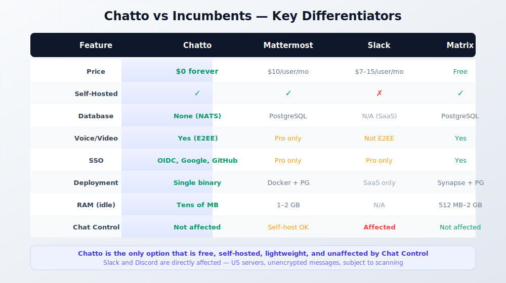
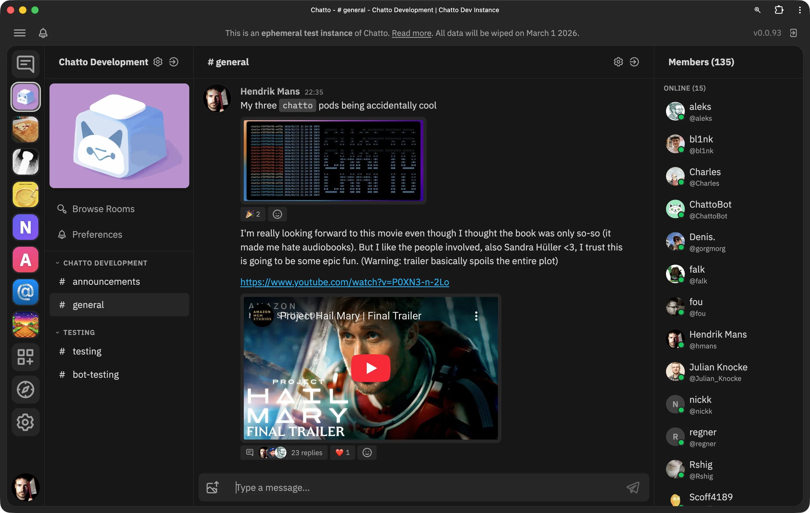
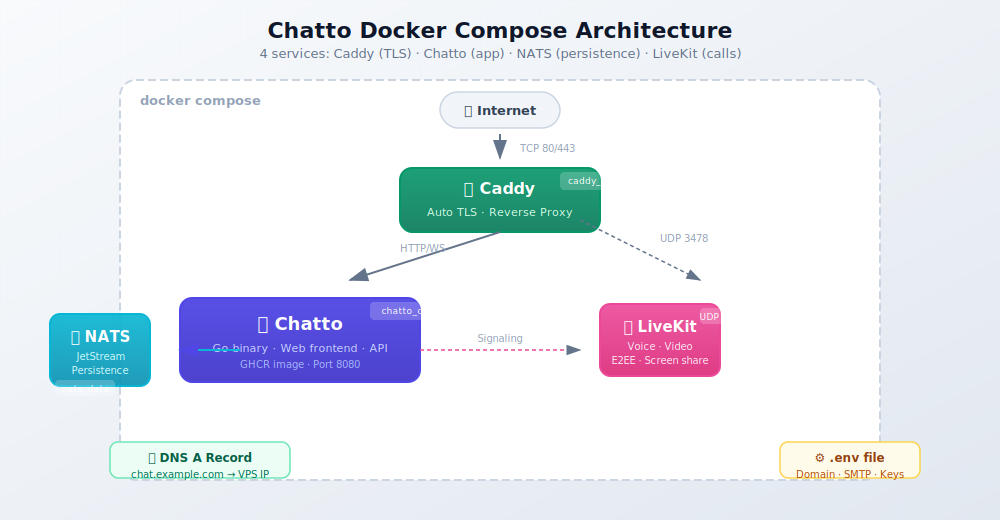
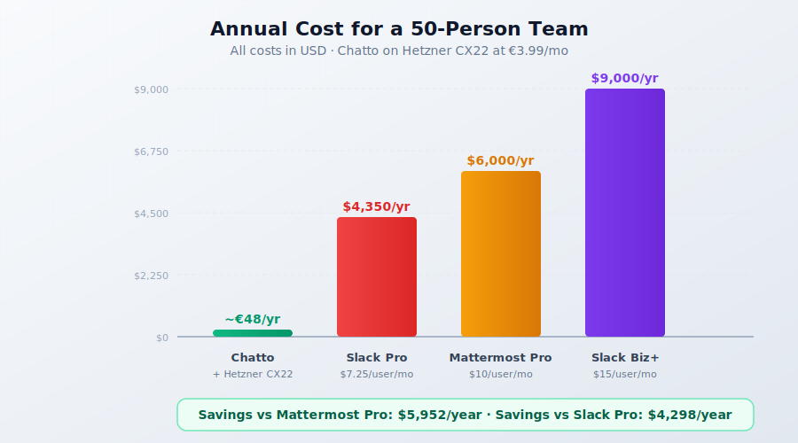
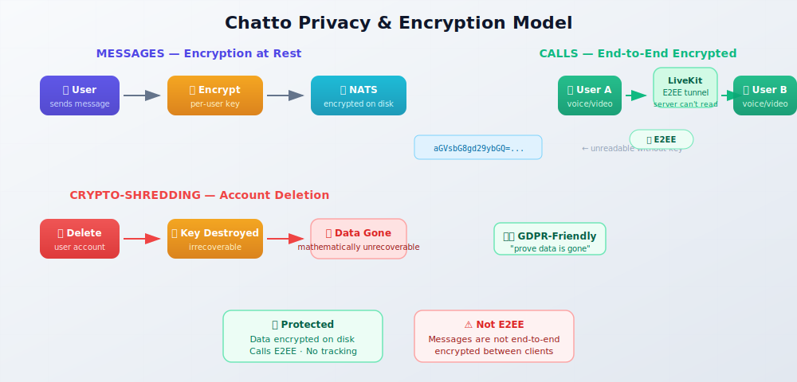

import Button from "@components/widgets/Button.astro";
import Notice from "@components/widgets/Notice.astro";
import ListCheck from "@components/widgets/ListCheck.astro";
import Accordion from "@components/widgets/Accordion.astro";
import Tabs from "@components/widgets/Tabs.astro";
import Tab from "@components/widgets/Tab.astro";


On July 9, 2026, the EU Parliament voted to greenlight Chat Control 1.0. The vote was 276 in favor, 314 against, with 17 abstentions. A majority of MEPs actually opposed it, but the motion to reject needed an absolute majority of 361 votes. It didn't get them.

What this means in practice: US tech companies are once again allowed to scan private messages without a warrant. This affects direct messages on Instagram, Discord, Snapchat, Skype, Xbox, and emails through Gmail and iCloud. The exemption lasts until April 3, 2028, unless a permanent deal is reached first.

Patrick Breyer, former MEP and civil rights activist, put it bluntly: *"Our children are the real losers in this undemocratic process."* He's right. The EU Commission's own data shows mass scanning accounted for only 36% of abuse reports in 2024. The German Federal Criminal Police (BKA) reports that 48% of alerts aren't even criminally relevant. And 99% of Meta's reports are previously known material. ([Source](https://www.patrick-breyer.de/en/eu-parliament-greenlights-chat-control-1-0-breyer-our-children-lose-out/))

You can read the full legislative analysis on [Patrick Breyer's site](https://www.patrick-breyer.de/en/eu-parliament-greenlights-chat-control-1-0-breyer-our-children-lose-out/). The political fight over Chat Control 2.0 — the permanent CSAM regulation — resumes in September 2026. But you don't have to wait for politicians to fix this.

<Notice type="warning" title="EU Chat Control 1.0 Is Now Law">
  As of July 9, 2026, US tech companies can scan your unencrypted private messages on Instagram, Discord, Snapchat, Skype, Xbox, Gmail, and iCloud — without a warrant. This temporary law runs until April 2028. End-to-end encrypted services like WhatsApp and Signal are exempt *for now*, but Chat Control 2.0 is still being negotiated. Self-hosting your own chat on infrastructure you control is the single most practical step you can take right now.
</Notice>

The fastest way to opt out of mass surveillance is to stop using platforms that participate in it. If your team runs on Slack or Discord, your messages sit on US servers subject to scanning. A self-hosted chat server on a VPS you control fixes that in an afternoon.

Enter [Chatto](https://github.com/chattocorp/chatto).

## Why EU Chat Control Changes Everything

Let's be precise about what just happened.

The EU Parliament didn't pass a new surveillance law. It extended a temporary derogation that had been in place before, allowing US tech companies to voluntarily scan private messages for child sexual abuse material (CSAM). The key word is *voluntarily* — these companies chose to implement scanning, and the EU just gave them legal cover to keep doing it.

The numbers tell a different story than the one politicians sell:

- **36%** — the share of abuse reports that came from mass scanning of private chats in 2024. The majority came from public posts and cloud storage, which were never affected by this law.
- **48%** — alerts from the German BKA that turned out to not be criminally relevant at all.
- **40%** — investigations triggered by chat control that ended up targeting minors themselves, not adult predators.
- **99%** — Meta's reports that consisted of previously known material, doing little to stop active abuse.
- **Zero** — evidence from the EU Commission that suspicionless scanning increased convictions or rescued children.



A symbolic exemption was added for end-to-end encrypted communications. WhatsApp and Signal users aren't directly affected — *by this vote*. But here's what matters for teams: most team chat tools (Slack, Discord, Microsoft Teams) don't use end-to-end encryption for messages. Your team's conversations on those platforms are exactly what Chat Control targets.

And Chat Control 2.0 — the permanent regulation — is still in trilogue negotiations. If it passes with scanning mandates, the scope could expand. The precedent is set.

The practical response isn't to wait and see. It's to move your team's communication to infrastructure you own.

## What Is Chatto

Chatto is a self-hosted team chat application, open-sourced on July 8, 2026 by developer Hendrik Mans. It's written in Go (41.7%), TypeScript (40.2%), and Svelte (11.1%), and licensed under AGPL-3.0.

The pitch is simple: a single ~50 MB binary that serves its own web frontend, requires no database, and uses [NATS](https://nats.io) for persistence. It supports voice and video calls through LiveKit, encrypts data at rest with per-user keys, and includes zero third-party tracking or analytics.

Current release is v0.4.4 with ~1,400 GitHub stars. The developer targets 1.0 within 6–12 months. Each server is fully isolated — no federation by design, which is actually a privacy feature. No data leaks between servers because there's no inter-server communication at all.

<Button text="View Chatto on GitHub" link="https://github.com/chattocorp/chatto" variant="solid" color="blue" size="md" icon="arrow-right" />

Key features:

- **No database required** — NATS handles all persistence
- **Single binary** — works on Linux (x86_64 & ARM64), macOS, Windows, FreeBSD
- **Voice/video calls** — powered by LiveKit, end-to-end encrypted, includes screen sharing
- **Encryption at rest** — per-user keys with crypto-shredding on account deletion
- **SSO support** — OIDC, Google, GitHub, Discord
- **Roles and permissions** — fine-grained, room groups as permission boundaries
- **Multiple servers in one client** — connect to several Chatto servers at once
- **PWA** — install on mobile via browser; native apps planned but not available yet
- **ConnectRPC + GraphQL APIs** — for bots and integrations

Official resources: [chatto.run](https://chatto.run) | [docs.chatto.run](https://docs.chatto.run) | [Community server](https://chat.chatto.run/)



## Chatto vs Slack and Mattermost

If you're evaluating Chatto as a self-hosted Slack alternative, here's how it stacks up against the main competitors.

### Feature comparison table

<Tabs>
<Tab name="Chatto vs Mattermost">
| Feature | Chatto | Mattermost |
|---------|--------|------------|
| Self-hosted | Yes (AGPL) | Yes (MIT/Apache, restricted free tier) |
| Price | $0 forever | Free (limited) / $10/user/mo Pro |
| Database | None (NATS) | PostgreSQL required |
| Voice/video calls | Yes (LiveKit, E2EE) | Free tier: no / Pro: yes |
| SSO | OIDC, Google, GitHub, Discord | Free tier: no / Pro: yes |
| Deployment | Single binary or Docker | Docker with PostgreSQL + Elasticsearch |
| RAM usage (idle) | Tens of MB | 1–2 GB minimum |
| Mobile | PWA | Native iOS + Android |
| Federation | No (by design) | No |
| License | AGPL-3.0 | MIT + Apache 2.0 (open core) |

Mattermost v10 and v11 significantly restricted the free self-hosted tier — SSO and voice calls moved to the paid plan. If you want feature parity with Chatto on Mattermost, you're paying $10/user/month.

</Tab>
<Tab name="Chatto vs Slack">
| Feature | Chatto | Slack |
|---------|--------|-------|
| Self-hosted | Yes | No |
| Price | $0 | $7.25–$15/user/mo |
| Database | None (NATS) | N/A (SaaS) |
| Voice/video calls | Yes (LiveKit, E2EE) | Yes (not E2EE) |
| SSO | OIDC, Google, GitHub, Discord | Pro plans only |
| Data location | Your server, your country | US servers |
| Chat Control affected | No | Yes — US platform, unencrypted messages |
| Mobile | PWA | Native iOS + Android |
| License | AGPL-3.0 | Proprietary |

Slack is directly affected by Chat Control 1.0. Your team's messages sit on US servers, unencrypted at rest, and are now subject to suspicionless scanning. There's no self-hosted option. If privacy matters, Slack is not a choice — it's a liability.

</Tab>
<Tab name="Chatto vs Matrix">
| Feature | Chatto | Matrix/Element |
|---------|--------|----------------|
| Self-hosted | Yes | Yes |
| Price | $0 | Free (Apache 2.0) |
| Database | None (NATS) | PostgreSQL required |
| Voice/video calls | Yes (LiveKit, E2EE) | Yes (Jitsi/Element Call) |
| E2EE messages | No (at rest only) | Yes (Olm/Megolm) |
| SSO | OIDC, Google, GitHub, Discord | Yes |
| Deployment | Single binary | Synapse + PostgreSQL + reverse proxy |
| Federation | No (by design) | Yes (complex) |
| RAM usage (idle) | Tens of MB | 512 MB–2 GB for Synapse |
| License | AGPL-3.0 | Apache 2.0 |

Matrix is the strongest open-source competitor on paper — it has E2EE for messages and federation. But Synapse is resource-hungry, federation adds operational complexity, and the UX is polarizing. If you want something that "just works" on a cheap VPS without a database, Chatto is simpler. If you need true E2EE between clients or federation across servers, Matrix is the better fit.

</Tab>
</Tabs>

### Pricing comparison

Let's talk money. Here's what a 50-person team pays annually:

| Solution | Annual cost (50 users) |
|----------|----------------------|
| **Chatto on Hetzner CX22** | ~€48/year (VPS only) |
| **Mattermost Free** | $0 (but no SSO, no voice, restricted) |
| **Mattermost Pro** | $6,000/year |
| **Slack Pro** | $4,350/year |
| **Slack Business+** | $9,000/year |

Mattermost's free tier used to be competitive. In v10/v11 they stripped out SSO and voice calls. If your team needs those features — and most teams do — you're looking at $10/user/month.

<ListCheck>
**What you get for $0 with Chatto:**
- Unlimited users
- Voice and video calls via LiveKit (end-to-end encrypted)
- SSO (OIDC, Google, GitHub, Discord)
- Encryption at rest with per-user keys
- No database to manage
- Single binary deployment
- Screen sharing
- Fine-grained roles and permissions
</ListCheck>

## Self-Hosting Chatto With a Standalone Binary

The standalone binary is the fastest way to try Chatto. Five minutes from download to running server. This path uses an embedded NATS instance — no external dependencies.

**Step 1: Download the binary**

Grab the latest release from GitHub. For Linux x86_64:

```bash
# Download latest release (check https://github.com/chattocorp/chatto/releases for the current version)
wget https://github.com/chattocorp/chatto/releases/download/v0.4.4/chatto-linux-amd64.tar.gz
tar xzf chatto-linux-amd64.tar.gz
chmod +x chatto-linux-amd64
sudo mv chatto-linux-amd64 /usr/local/bin/chatto
```

For ARM64 servers (like Hetzner CAX instances):

```bash
wget https://github.com/chattocorp/chatto/releases/download/v0.4.4/chatto-linux-arm64.tar.gz
tar xzf chatto-linux-arm64.tar.gz
chmod +x chatto-linux-arm64
sudo mv chatto-linux-arm64 /usr/local/bin/chatto
```

**Step 2: Initialize the configuration**

```bash
chatto init
```

This generates a `chatto.toml` configuration file in the current directory. Edit it to set your domain, SMTP credentials, and admin email.

**Step 3: Start the server**

```bash
chatto run
```

Chatto serves its web frontend on the configured port. For production use with TLS, you can enable the built-in Let's Encrypt support in `chatto.toml` or put it behind a reverse proxy.

**Step 4: Run as a systemd service (optional)**

For persistent operation, create a systemd unit:

```ini
[Unit]
Description=Chatto Chat Server
After=network.target

[Service]
Type=simple
User=chatto
WorkingDirectory=/opt/chatto
ExecStart=/usr/local/bin/chatto run
Restart=on-failure
RestartSec=5

[Install]
WantedBy=multi-user.target
```

```bash
sudo systemctl daemon-reload
sudo systemctl enable --now chatto
```

<Notice type="info" title="When to use the binary vs Docker">
  The standalone binary is ideal for testing, personal use, or small teams with fewer than 10 users. It uses embedded NATS, which means everything runs in one process — simple but no zero-downtime updates. For production deployments with multiple users, voice/video calls through LiveKit, and automatic TLS via Caddy, use the Docker Compose setup below.
</Notice>

If you haven't set up Docker yet, see our guide on [installing Docker on Ubuntu ARM](/install-docker-ubuntu-arm/).

## Self-Hosting Chatto With Docker Compose

This is the recommended production setup. You get separate NATS for data persistence (survives container restarts), LiveKit for voice/video calls, and Caddy for automatic TLS.

### Prerequisites

<ListCheck>
**What you need before starting:**
- A VPS with Docker and Compose v2 installed ([install Docker on Ubuntu ARM](/install-docker-ubuntu-arm/))
- A domain name with a DNS A record pointing to your VPS IP (e.g., `chat.example.com`)
- A `livekit.*` subdomain pointing to the same VPS (e.g., `livekit.chat.example.com`)
- SMTP credentials for email verification (Gmail, SendGrid, Mailgun, etc.)
- (Optional) S3-compatible storage for file uploads
</ListCheck>

For VPS providers, check our [DigitalOcean vs Vultr vs Hetzner](/digitalocean-vs-vultr-vs-hetzner/) comparison. The [Hetzner Cloud review](/hetzner-cloud-review/) covers why CX22 at €3.99/month is the sweet spot for this kind of workload.

Required ports:
- **TCP 80, 443** — web traffic and TLS
- **UDP 3478, 50000-50200** — for LiveKit voice/video calls (only needed if you enable calls)

You also need a `livekit.*` subdomain pointing to the same VPS (e.g., `livekit.chat.example.com`). Caddy uses this for the LiveKit WebSocket endpoint that browsers connect to for calls.

### docker-compose.yml walkthrough

Clone the Docker Compose example from the main Chatto repository:

```bash
git clone --depth 1 --filter=blob:none --sparse https://github.com/chattocorp/chatto.git chatto-source
git -C chatto-source sparse-checkout set examples/dockercompose
cp -R chatto-source/examples/dockercompose chatto
rm -rf chatto-source
cd chatto
```

Run the initialization script to generate your `.env` file and LiveKit secrets:

```bash
chmod +x init-env.sh
./init-env.sh chat.example.com admin@example.com
```

Replace `chat.example.com` with your domain and `admin@example.com` with the email for the first owner account. The script generates `.env` and `livekit.generated.yaml` with matching NATS, Chatto, and LiveKit secrets.

Open `.env` and configure your SMTP credentials:

```env
# Domain (must have DNS A record pointing to this server)
CHATTO_DOMAIN=chat.example.com

# Admin email (for Let's Encrypt TLS and first owner account)
ADMIN_EMAIL=admin@example.com

# SMTP settings (required for user registration)
CHATTO_SMTP_ENABLED=true
CHATTO_SMTP_HOST=smtp.sendgrid.net
CHATTO_SMTP_PORT=587
CHATTO_SMTP_USER=apikey
CHATTO_SMTP_PASSWORD=your-api-key-here
CHATTO_SMTP_FROM=chat@example.com

# LiveKit settings (auto-generated by init-env.sh)
CHATTO_LIVEKIT_API_KEY=...
CHATTO_LIVEKIT_API_SECRET=...
```

The `docker-compose.yml` defines four services:

```yaml
services:
  chatto:
    image: ghcr.io/chattocorp/chatto:latest
    restart: unless-stopped
    volumes:
      - chatto_data:/data
    env_file: .env
    depends_on:
      - nats

  nats:
    image: nats:latest
    restart: unless-stopped
    command: "--jetstream --store_dir /data"
    volumes:
      - nats_data:/data

  livekit:
    image: livekit/livekit-server:latest
    restart: unless-stopped
    command: "--config /etc/livekit.yaml"
    volumes:
      - ./livekit.yaml:/etc/livekit.yaml:ro
    ports:
      - "3478:3478/udp"
      - "50000-50200:50000-50200/udp"

  caddy:
    image: caddy:latest
    restart: unless-stopped
    ports:
      - "80:80"
      - "443:443"
    volumes:
      - ./Caddyfile:/etc/caddy/Caddyfile:ro
      - caddy_data:/data
      - caddy_config:/config

volumes:
  chatto_data:
  nats_data:
  caddy_data:
  caddy_config:
```

The architecture flows like this:



<Notice type="warning" title="Edit your .env file before starting">
  Chatto requires SMTP for email verification. If you skip this, users cannot register. Fill in your `CHATTO_SMTP_*` credentials in the `.env` file before running `docker compose up`. Also double-check that your domain's DNS A record points to the VPS IP — Caddy needs this for automatic TLS certificate provisioning.
</Notice>

For more on configuring environment variables in Docker, see our guide on [environment variables in Docker](/docker-env-vars/).

### Starting and updating

Start the stack:

```bash
docker compose up -d
```

Verify everything is running:

```bash
docker compose ps
```

All four services should show as `running`. Check logs if something isn't right:

```bash
docker compose logs -f chatto
```

<Accordion label="How do I update Chatto when a new version is released?" group="faq">

Updating is straightforward because NATS data lives in a persistent volume. The container can be replaced without losing messages.

```bash
# Pull the latest images
docker compose pull

# Recreate containers with the new images
docker compose up -d
```

Your chat history, user accounts, and settings all survive the update because they're stored in the `nats_data` and `chatto_data` volumes.

For a complete guide on container updates, see [how to update a container with Docker Compose](/updating-container-docker-compose/).

After updating, clean up old images to free disk space: [Clean All Docker Images](/cleanup-all-docker-things/).

To keep an eye on your logs, you can [redirect Docker logs to a single file](/redirect-docker-logs-to-a-single-file/).

</Accordion>

## What Does It Cost to Run Chatto

Chatto itself is free. The only cost is the VPS it runs on.

Here's what real pricing looks like as of July 2026:

| VPS Provider | Plan | RAM | vCPU | Monthly Cost |
|-------------|------|-----|------|-------------|
| Hetzner CX22 | x86 | 4 GB | 2 | €3.99 |
| Contabo Cloud VPS S | x86 | 8 GB | 4 | €5.99 |
| Hetzner CAX11 | ARM64 | 4 GB | 2 | €3.99 |
| DigitalOcean Basic | x86 | 2 GB | 1 | $14.00 |

The developer's own benchmarks: Chatto uses tens of MB at idle and roughly 10 MB per additional connected user. A 1 GB VPS handles a small team. A 4 GB VPS (like Hetzner CX22) is comfortable for 20–30 concurrent users with LiveKit calls running.

Now compare annual costs for a 50-person team:

| Solution | Annual Cost |
|----------|------------|
| Chatto + Hetzner CX22 | ~€48/year |
| Mattermost Pro | $6,000/year |
| Slack Pro | $4,350/year |
| Slack Business+ | $9,000/year |

<Notice type="success" title="Bottom line">
  A 50-person team saves $5,950+/year compared to Mattermost Pro. Chatto on Hetzner costs less than a Netflix subscription. Even if you add $10/month for a SendGrid SMTP plan and a few dollars for S3 file storage, you're still under $200/year.
</Notice>



For more VPS pricing details, check the [Hetzner Cloud review](/hetzner-cloud-review/) and our [DigitalOcean vs Vultr vs Hetzner](/digitalocean-vs-vultr-vs-hetzner/) benchmarks.

## Privacy and Encryption Deep-Dive

"Privacy" is a marketing word until you explain the mechanism. Here's how Chatto actually protects your data.

**Encryption at rest.** Every user gets a unique encryption key. Message text and personally identifiable information (PII) are encrypted before being written to NATS. If someone gains raw access to the NATS storage, they can't read the messages without the per-user keys.

**Crypto-shredding.** When a user deletes their account, their encryption key is destroyed. The encrypted data remains on disk but is mathematically irrecoverable. This is a GDPR-friendly approach — you can prove data is gone without relying on "we promise we deleted it."

**No third-party tracking.** No Google Analytics, no Sentry breadcrumbs, no Mixpanel events. Chatto doesn't phone home. The only external connections are the ones you configure (SMTP, S3, OIDC providers).

**Server isolation.** Each Chatto server is fully independent. No federation means no data leaks between organizations. Your server knows nothing about other Chatto servers. This is a deliberate design choice, not a missing feature.

**Calls are E2EE.** Voice and video calls through LiveKit use end-to-end encryption. Even your own server can't intercept call content.

**GDPR compliance.** Host Chatto on a European VPS (Hetzner is in Germany and Finland), and your data never leaves the EU. You are the data processor. You decide retention policies, access controls, and deletion schedules. Compare this to Slack or Discord, where data sits on US servers subject to FISA warrants, National Security Letters, and now Chat Control scanning.



<Notice type="info" title="Important: messages are not end-to-end encrypted">
  Encryption at rest protects your data on disk, but Chatto messages are **not** end-to-end encrypted between clients the way Signal or WhatsApp messages are. The server can read message content in memory while processing it. This is the same model as Mattermost and Slack — but it's important to be honest about it. If your threat model requires true E2EE for text messages (where even the server operator can't read them), Matrix with Olm/Megolm is a better fit. For most teams, encryption at rest plus server isolation is sufficient.
</Notice>

For another privacy-first self-hosted tool, see our guide to [install Plausible Analytics](/install-plausible-analytics/) — cookie-free analytics you own.

## Honest Caveats and Limitations

Chatto is impressive for a project that went open-source three days ago. But it's not finished, and you should know what you're signing up for.

**Pre-1.0 software.** Current version is v0.4.4. Breaking changes are possible until 1.0, which the developer targets in 6–12 months. Configuration formats, APIs, and data structures may change.

**Single developer.** Hendrik Mans built Chatto himself and is not accepting outside contributions (per the CONTRIBUTING.md). The bus factor is real. AGPL means the code is open forever and can be forked, but the primary development depends on one person.

**No native mobile apps.** Chatto works as a PWA — you install it from the browser on your phone. It's decent but not the same as a native app with push notifications. Native iOS and Android apps are planned but not available.

**No E2EE for text messages.** Calls are end-to-end encrypted via LiveKit. Messages are encrypted at rest but not between clients. This is the same model as Slack and Mattermost, but it's not Signal-level privacy.

**AGPL license.** If you modify the Chatto server and offer it as a service to others, you must release your modifications under AGPL. For internal team use, this is a non-issue. For SaaS businesses planning to white-label it, talk to a lawyer.

**No content moderation tools yet.** Version 0.5 is adding reporting features. If you're running a public community, moderation is limited for now.

**No Slack import.** Migration from Slack is planned but not available today. You'd be starting fresh.

**Chat Control 1.0 targets unencrypted messages on US platforms.** WhatsApp and Signal users are technically unaffected by this specific vote. But the vote sets precedent, and Chat Control 2.0 could change the rules.

<Accordion label="Is Chatto production-ready?" group="faq">
It depends on your risk tolerance. For small teams willing to accept pre-1.0 instability and the occasional breaking change, yes — it's functional and the core chat experience is solid. For mission-critical enterprise deployments where uptime and stability are non-negotiable, wait for 1.0 or stick with Mattermost. The developer is transparent about the current state.
</Accordion>

<Accordion label="What if the single developer stops maintaining Chatto?" group="faq">
The AGPL license means the code is open forever. If development stalls, the community can fork the project. NATS is a mature, independently maintained project — your data layer won't disappear. That said, the bus factor is a real concern for long-term planning. If you need vendor-backed SLAs and guaranteed multi-year support, a commercial product like Mattermost is safer. If you're comfortable with open-source risk (and most bitdoze readers are), this is manageable.
</Accordion>

## Final Verdict: Should You Self-Host Chatto?

The EU just legalized mass scanning of private messages on major US-owned platforms. The stats show this approach doesn't work — 99% of Meta's reports are known material, 48% of alerts aren't criminally relevant, and there's zero evidence it rescued children. But the law is the law, and it runs until 2028.

You have three options:

1. **Do nothing.** Keep using Slack/Discord and accept that your team's messages are subject to scanning.
2. **Switch to an E2EE messenger.** Signal and WhatsApp protect 1:1 chats, but they're not team chat tools. No channels, no roles, no file history.
3. **Self-host Chatto.** Run a lightweight, privacy-first chat server on a VPS for €4/month. Full control, no scanning, no tracking.

Chatto isn't perfect. It's pre-1.0, has no native mobile apps, no E2EE for text messages, and depends on a single developer. Those are real limitations.

But the math is hard to argue with: a single ~50 MB binary, no database, tens of MB of RAM, voice/video calls, SSO, encryption at rest — all for $0 in software costs and €4/month in hosting. For a team of 50, that's €48/year vs. $6,000/year for Mattermost Pro.

If you already self-host other tools on your VPS, Chatto is a natural addition to the stack. You own the server, you own the data, and no parliament vote changes that.

<Button text="Get Started with Chatto →" link="https://github.com/chattocorp/chatto" variant="solid" color="green" size="lg" icon="arrow-right" />
<Button text="Read the Official Docs" link="https://docs.chatto.run" variant="outline" color="blue" size="md" />

Once Chatto is running, monitor it with [Uptime Kuma](/deploy-uptime-kuma/) so you know if it goes down. If you want a simpler deployment experience with a web UI, [Coolify as a self-hosted PaaS](/coolify-install-heroku-alternative/) can manage the Docker stack for you.
