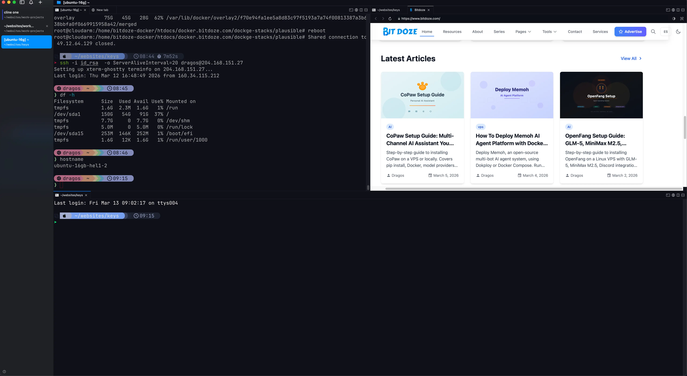

import Notice from "@components/widgets/Notice.astro";
import Accordion from "@components/widgets/Accordion.astro";

If you like [Ghostty](/ghostty-terminal/) but keep ending up with too many agent sessions, too many tabs, and no clue which one needs you, **cmux** is worth a look.

It is a native macOS terminal built for a very current problem: running AI coding agents and still feeling in control of the mess. You get a Ghostty-powered terminal, vertical workspaces, split panes, notifications that actually point to the session asking for help, and a built-in browser that can be driven from the CLI.

That last part matters more than it sounds. A lot of AI tooling feels like it wants to replace your workflow. cmux feels closer to "here are the primitives, now build your own setup."

<Notice type="info" title="What cmux is, in one sentence">
cmux is a native macOS terminal app built on `libghostty`, with workspaces, panes, notifications, browser automation, and a CLI/socket API for controlling the whole thing.
</Notice>

## What cmux actually is





cmux is **not** a Ghostty fork. According to the official site, it uses `libghostty` for terminal rendering, the same way an app might use WebKit for web content. So you still get Ghostty-style rendering and config compatibility, but the app itself is doing something different.

The idea is simple:

- Open several coding agents in parallel
- Keep them separated by workspace, pane, or browser surface
- Get a clear visual signal when one needs input
- Automate the terminal and browser from scripts or hooks

If that sounds niche, it kind of is. But it is a very real niche now.

## Why cmux is getting attention

The selling point is not "yet another terminal." The interesting part is how it handles multi-agent work without forcing you into a closed orchestration product.

From the official README and docs, cmux currently gives you:

- A **native macOS app** built with Swift and AppKit
- A **Ghostty-powered terminal** that reads your existing Ghostty config for themes, fonts, and colors
- **Vertical tabs and split panes** for juggling multiple workspaces
- **Notification rings, unread badges, and a notification panel**
- A **built-in browser** with a scriptable command surface
- A **CLI and socket API** for sending text, reading screens, opening panes, moving surfaces, and more
- **tmux compatibility commands** for people who still want tmux-style behavior in parts of their workflow

It is also free and open source, with the repo licensed under `AGPL-3.0-or-later`.

## The short version: what cmux can do

Here is the practical list.

### 1. Run multiple agents without losing track of them

This is the big one. cmux uses windows, workspaces, panes, and surfaces so you can split work in a way that makes sense.

Roughly speaking:

- **Window**: the app window
- **Workspace**: the main vertical tab in the sidebar
- **Pane**: a split area inside a workspace
- **Surface**: the actual terminal or browser tab inside a pane

That model sounds more complex than a normal terminal at first. In practice, it is how cmux can show multiple agents, multiple splits, and even browser tabs without everything collapsing into a pile of tabs.

### 2. Tell you which agent needs attention

This is where cmux feels genuinely thoughtful.

Instead of a generic desktop alert, cmux can show:

- a notification ring around the pane
- an unread badge on the workspace
- a notification panel with pending items
- a desktop notification on macOS

It supports standard terminal notification escape sequences like `OSC 9`, `OSC 99`, and `OSC 777`, and it also exposes `cmux notify` for scripts and hooks.

That means you can wire Claude Code, Codex, OpenCode, or your own shell scripts into the same notification flow.

### 3. Open a browser beside the terminal and automate it

This is the feature that makes cmux feel different from Ghostty and tmux.

You can open a browser surface next to a terminal, then control it with commands like:

```bash
cmux browser open https://localhost:4321
cmux browser snapshot --interactive
cmux browser click "button[type='submit']"
cmux browser fill "input[name='email']" "me@example.com"
```

If you are building web apps with an agent, that is pretty compelling. The browser is no longer a separate thing you alt-tab to. It becomes part of the same workspace as the terminal session doing the work.

### 4. Control the workspace from the CLI

The CLI is a big part of cmux, and your `cmux help` output makes that clear.

You can:

- create workspaces and windows
- split panes in all directions
- create terminal or browser surfaces
- send text or keys into a terminal
- read the visible screen or scrollback
- move or reorder tabs and surfaces
- set sidebar status, progress, and logs
- script Claude Code hooks

That makes cmux more than a GUI terminal. It is closer to a programmable local control plane for agent workflows.

## Useful cmux commands to know first

The full help is broad, but these are the commands I would learn first.

| Task | Command |
|------|---------|
| Open a new workspace | `cmux new-workspace` |
| Split the current layout | `cmux new-split right` or `cmux new-split down` |
| Add a new terminal/browser surface | `cmux new-surface --type terminal` or `cmux new-surface --type browser` |
| Inspect the current layout | `cmux tree --all` |
| Send input to a terminal | `cmux send "npm run dev"` |
| Read terminal output | `cmux read-screen --scrollback --lines 200` |
| Fire a notification | `cmux notify --title "Build Complete" --body "All tests passed"` |
| Open a browser page | `cmux browser open https://localhost:4321` |
| Snapshot the browser state | `cmux browser snapshot --interactive` |

If you are already comfortable with terminal scripting, commands like `send`, `send-key`, `read-screen`, `notify`, and `browser snapshot` are where cmux gets interesting fast.

## How cmux compares to Ghostty and tmux

This is the question most terminal users will ask first.

| Tool | Best for | What it does well | What to watch for |
|------|----------|-------------------|-------------------|
| **Ghostty** | Fast everyday terminal use | Native feel, GPU rendering, simple config, built-in multiplexing | Less opinionated around agent workflows |
| **tmux** | Portable sessions and remote work | Detach/attach, SSH-friendly, huge ecosystem | More setup, more keybindings, no built-in browser or GUI notifications |
| **cmux** | Local multi-agent development on macOS | Workspaces, pane notifications, browser automation, CLI control | macOS-only, and app restart does not restore live process state yet |

My take: if you mostly want a better terminal, start with [Ghostty](/ghostty-terminal/). If you live on remote servers, tmux still earns its keep. If your day is turning into "three Claude sessions, one Codex session, a dev server, and a browser you want to script," cmux starts to make a lot of sense.

## Getting started with cmux

Install it with Homebrew:

```bash
brew tap manaflow-ai/cmux
brew install --cask cmux
```

Or download the DMG from [cmux.dev](https://www.cmux.dev/) and drag it into Applications.

cmux is macOS-only right now, and the docs list these requirements:

- macOS 14 or later
- Apple Silicon or Intel Mac

### Optional: expose the CLI outside cmux

Inside cmux terminals, the CLI works automatically because cmux sets environment variables such as `CMUX_WORKSPACE_ID` and `CMUX_SURFACE_ID`.

If you want to call `cmux` from outside the app, the docs suggest creating a symlink:

```bash
sudo ln -sf "/Applications/cmux.app/Contents/Resources/bin/cmux" /usr/local/bin/cmux
```

After that, commands like these become available from any shell:

```bash
cmux list-workspaces
cmux current-workspace
cmux notify --title "Build Complete" --body "Your build finished"
```

## A practical setup that makes sense

If I were setting up cmux for real work, I would keep it simple:

1. One workspace for the main coding agent
2. One split for logs or tests
3. One browser surface for the app you are building
4. Notifications wired into agent hooks

That already gives you something useful without inventing a whole "AI operating system" for yourself.

If you already use Ghostty as your daily terminal, read my [Ghostty setup guide](/ghostty-terminal/) first for the fonts, config basics, and general terminal workflow. If you want a cleaner prompt inside Ghostty or cmux, the [Starship + Ghostty guide](/starship-ghostty-terminal/) is a good companion.

## Example workflow: Claude Code + browser + notifications

Here is the kind of setup cmux seems designed for:

```bash
# Create a new workspace
cmux new-workspace --cwd ~/projects/my-app

# Split the workspace
cmux new-split right

# Open the app in a browser surface
cmux browser open https://localhost:4321

# Notify yourself when a task is done
cmux notify --title "Claude Code" --body "Agent finished the refactor"
```

The official docs also show a simple Claude Code hook script that triggers `cmux notify` on stop events or after matching tool runs. That is a small detail, but it is exactly the sort of thing that turns the app from "interesting demo" into "actually useful on a Tuesday."

## What I like about cmux

Three things stand out.

First, it does not try to hide the terminal. A lot of agent tools rush to build a whole new environment around the LLM. cmux still feels like a terminal person made it.

Second, the browser being part of the same workspace is a bigger deal than it looks on paper. When the terminal, browser, and notifications all live together, the workflow feels tighter.

Third, the project is honest about being a set of primitives. The "Zen of cmux" blog post says the same thing directly: cmux is not prescriptive, and the workflow is yours to shape. I like that framing.

## What to keep in mind before switching

cmux is promising, but it is not magic.

- It is **macOS-only** for now
- It restores **layout and metadata**, not live terminal process state
- If you mainly work over SSH, **tmux** is still the safer default
- If you do not need browser automation or agent notifications, **Ghostty alone may be enough**

That is not a knock against cmux. It just means you should use it for the job it is clearly trying to solve.

## FAQ

<Accordion label="Is cmux just Ghostty with tabs?" group="cmux-faq" expanded="true">
No. cmux uses `libghostty` for rendering, but it is a separate native macOS app focused on workspaces, notifications, browser surfaces, and automation for agent workflows.
</Accordion>

<Accordion label="Do you still need tmux if you use cmux?" group="cmux-faq">
Sometimes yes. If you need detach/attach sessions on remote machines, tmux still solves a different problem. cmux is strongest for local macOS workflows where you want GUI workspaces, browser automation, and visible notifications.
</Accordion>

<Accordion label="Can cmux work with agents besides Claude Code?" group="cmux-faq">
Yes. The official FAQ says any agent that runs in a terminal should work, including Claude Code, Codex, OpenCode, Gemini CLI, Aider, Goose, Cline, and others.
</Accordion>

## Final thoughts

cmux feels like a tool built by someone who got tired of juggling AI agents in generic terminals and decided to fix the problem properly.

I would not recommend it to every terminal user. But if your local workflow already includes multiple agent sessions, app previews, and constant context switching, cmux is one of the more interesting things happening in terminals right now.

That is probably the best way to think about it: not as a replacement for every terminal, but as a sharper tool for a very specific kind of modern development.
