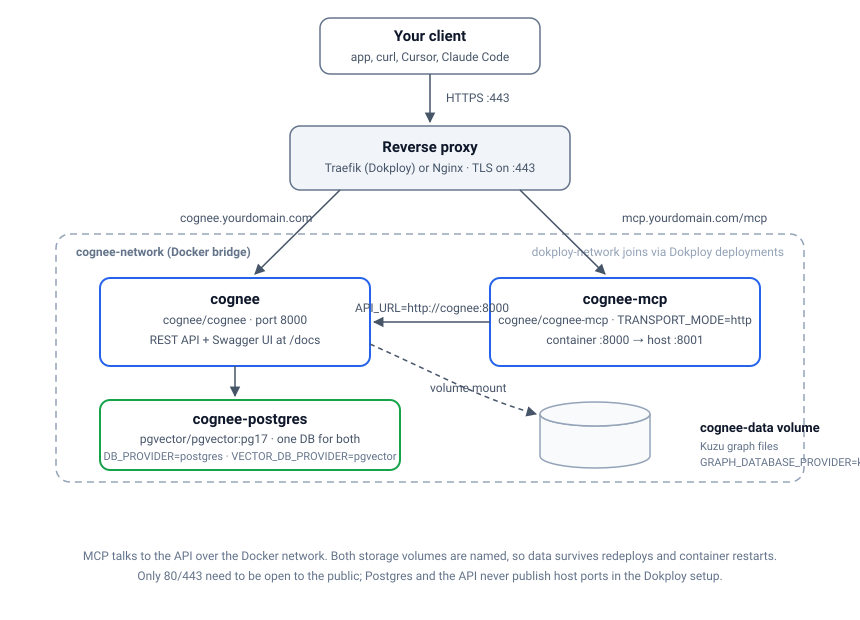
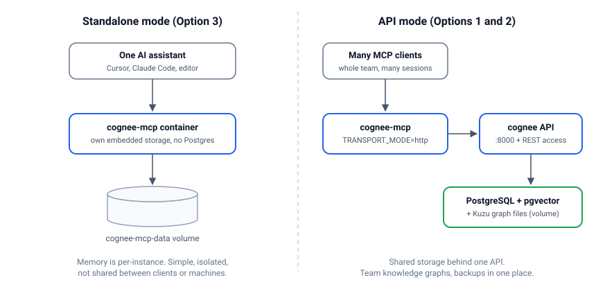

import Button from "@components/widgets/Button.astro";
import Notice from "@components/widgets/Notice.astro";
import ListCheck from "@components/widgets/ListCheck.astro";
import Accordion from "@components/widgets/Accordion.astro";
import Tabs from "@components/widgets/Tabs.astro";
import Tab from "@components/widgets/Tab.astro";

If you're building AI applications that need persistent memory and knowledge graphs, [Cognee](https://github.com/topoteretes/cognee) is an open-source platform worth looking at. It turns your data into structured knowledge graphs with semantic search, and it works well for RAG applications, chatbots, and AI assistants. Self-hosting means you own your data and keep costs predictable.

In this guide, I'll show you how to self-host Cognee on your own infrastructure using Dokploy or Docker Compose. We'll set up a production-ready deployment with PostgreSQL and pgvector for both metadata and vector storage, using OpenAI for the embedding model, plus the MCP server for AI assistant integration.

## What is Cognee?

[Cognee](https://github.com/topoteretes/cognee) is an AI memory platform that organizes your data into knowledge graphs. Where vector databases stop at similarity search, Cognee maps relationships between your data points so AI applications can retrieve and reason across connected information.

### Key Features of Cognee

<ListCheck>
- **Knowledge Graph Construction**: Automatically extracts entities and relationships from your documents
- **Vector Embeddings**: Semantic search using configurable embedding providers (OpenAI, Gemini, Ollama, etc.)
- **Multi-Provider LLM Support**: Works with OpenAI, Anthropic, Google Gemini, Ollama, and more
- **MCP Integration**: Model Context Protocol support for AI coding assistants like Cursor, Claude, and VS Code
- **REST API**: Full-featured API for data ingestion, processing, and search
- **Flexible Storage**: Supports PostgreSQL, SQLite, Neo4j, and various vector stores
- **Code Intelligence**: Special pipelines for analyzing and understanding codebases
- **Dataset Management**: Organize data into separate datasets with permissions
- **Session Memory**: Maintain conversational context across interactions
</ListCheck>

### Why Self-Host Cognee?

**Benefits of self-hosting**:

- Complete data privacy: your documents and embeddings never leave your infrastructure
- No usage limits or per-seat costs beyond what your LLM provider charges
- Full control over model, embedding, and storage choices
- Integrates with private networks, internal services, and your existing backup setup

**Use cases**:

- Building AI assistants with long-term memory (if you want a lighter-weight alternative, you can also [deploy Hindsight agent memory on Docker](https://www.bitdoze.com/hindsight-docker-deploy/))
- RAG applications; for a hands-on example, see how to [build AI agents with memory and RAG](https://www.bitdoze.com/agno-get-start/)
- Code analysis and documentation tools
- Knowledge management and AI-powered search over internal documents

## Prerequisites

Before you begin, make sure you have:

<ListCheck>
- **A VPS or Server**: Minimum 4GB RAM and 2 CPU cores recommended
- **A Domain Name**: For accessing your Cognee API (e.g., `cognee.yourdomain.com`)
- **Docker Installed**: Docker and Docker Compose (Dokploy includes this)
- **OpenAI API Key**: For embeddings and LLM operations (or alternative provider)
- **Basic Command Line Knowledge**: For running deployment commands
</ListCheck>

<Button text="Try Hetzner Cloud Now" link="https://go.bitdoze.com/hetzner" variant="solid" color="blue" size="lg" external={true} icon="rocket-launch" />
<Button text="Try Hostinger VPS" link="https://go.bitdoze.com/hostinger-vps" variant="solid" color="green" size="lg" external={true} icon="rocket-launch" />

_VPS prices jumped across the board in 2026 — if you're rethinking a rented box, see [what changed and when a mini PC wins](/vps-price-increases/)._

<Notice type="info" title="Hosting Recommendations">
For production use, I recommend a VPS with at least 4GB RAM. We use `pgvector/pgvector:pg17` which is PostgreSQL with the pgvector extension - this single database handles both relational data (metadata, users, datasets) AND vector embeddings for semantic search. This simplifies deployment significantly. Providers like Hetzner, [Vultr](https://go.bitdoze.com/vultr), or DigitalOcean work well.
</Notice>

## Understanding the Storage Architecture

Before deploying, it helps to see how the pieces fit together:



<Notice type="info" title="Three Storage Layers">
Cognee uses three storage layers, and our Docker Compose handles all of them:

1. **Relational Database** (`DB_PROVIDER=postgres`): Stores metadata, user accounts, datasets, document information, and pipeline state
2. **Vector Database** (`VECTOR_DB_PROVIDER=pgvector`): Stores embeddings for semantic similarity search using the pgvector extension
3. **Graph Database** (`GRAPH_DATABASE_PROVIDER=kuzu`): Stores knowledge graph data (entities and relationships) in a file-based directory

We use `pgvector/pgvector:pg17` - PostgreSQL 17 with the pgvector extension - for both relational and vector storage. If you want to poke at this database outside Cognee, I have a guide to [deploy pgvector with Docker (and pgAdmin)](https://www.bitdoze.com/deploy-pgvector-pgadmin-docker/). The single-Postgres approach is deliberate: it's the same philosophy behind [what Postgres can replace in your stack](https://www.bitdoze.com/what-postgres-replaces/) - fewer moving parts means fewer things to back up and break. For the graph database, **Kuzu stores data inside the container's filesystem**, so we need a volume to persist it across container restarts.
</Notice>

## Option 1: Deploy with Dokploy

Dokploy is an open-source Platform as a Service that simplifies deploying Docker applications. If you haven't set up Dokploy yet, check out our [Dokploy Installation Guide](https://www.bitdoze.com/dokploy-install/).

### Step 1: Install Dokploy

If not already installed:

```sh
curl -sSL https://dokploy.com/install.sh | sh
```

Access Dokploy at `http://your-vps-ip:3000` and complete the setup.

### Step 2: Create a New Project

1. Log in to Dokploy dashboard
2. Click **"Create Project"** and name it (e.g., "Cognee")
3. Inside the project, click **"Add Service"** → **"Compose"**
4. Select **"Docker Compose"** type (not Stack)
5. Name it "cognee-stack"

### Step 3: Add Docker Compose Configuration

Go to the **General** tab and paste the following Docker Compose configuration. If you get stuck on the Dokploy side of this, the walkthrough on how to [deploy a Docker Compose app in Dokploy](https://www.bitdoze.com/dokploy-docker-compose-app/) covers the UI flow in detail.

```yaml
services:
  cognee:
    image: cognee/cognee:main
    networks:
      - dokploy-network
      - cognee-network
    volumes:
      - cognee-data:/app/.cognee_system
    environment:
      - HOST=0.0.0.0
      - ENVIRONMENT=production
      - LOG_LEVEL=INFO
      # Authentication (REQUIRED for public deployment)
      - REQUIRE_AUTHENTICATION=true
      # LLM Configuration
      - LLM_API_KEY=${LLM_API_KEY}
      - LLM_PROVIDER=${LLM_PROVIDER:-openai}
      - LLM_MODEL=${LLM_MODEL:-gpt-4o-mini}
      # Embedding Configuration (OpenAI)
      - EMBEDDING_PROVIDER=${EMBEDDING_PROVIDER:-openai}
      - EMBEDDING_MODEL=${EMBEDDING_MODEL:-openai/text-embedding-3-small}
      - EMBEDDING_DIMENSIONS=${EMBEDDING_DIMENSIONS:-1536}
      - EMBEDDING_API_KEY=${LLM_API_KEY}
      # Database Configuration (PostgreSQL for relational data)
      - DB_PROVIDER=postgres
      - DB_HOST=cognee-postgres
      - DB_PORT=5432
      - DB_NAME=cognee_db
      - DB_USERNAME=cognee
      - DB_PASSWORD=${DB_PASSWORD}
      # Vector Database (pgvector - uses SAME PostgreSQL instance)
      - VECTOR_DB_PROVIDER=pgvector
      # Graph Database (default Kuzu - file-based)
      - GRAPH_DATABASE_PROVIDER=${GRAPH_DATABASE_PROVIDER:-kuzu}
    depends_on:
      cognee-postgres:
        condition: service_healthy
    healthcheck:
      test: ["CMD", "curl", "-f", "http://localhost:8000/health"]
      interval: 30s
      timeout: 10s
      retries: 3
      start_period: 40s
    deploy:
      resources:
        limits:
          cpus: "2.0"
          memory: 4GB

  cognee-mcp:
    image: cognee/cognee-mcp:main
    networks:
      - dokploy-network
      - cognee-network
    environment:
      - TRANSPORT_MODE=http
      - API_URL=http://cognee:8000
      - LOG_LEVEL=INFO
    depends_on:
      cognee:
        condition: service_healthy
    restart: unless-stopped

  cognee-postgres:
    image: pgvector/pgvector:pg17
    networks:
      - cognee-network
    environment:
      - POSTGRES_USER=cognee
      - POSTGRES_PASSWORD=${DB_PASSWORD}
      - POSTGRES_DB=cognee_db
    volumes:
      - cognee-postgres-data:/var/lib/postgresql/data
    healthcheck:
      test: ["CMD-SHELL", "pg_isready -U cognee -d cognee_db"]
      interval: 5s
      timeout: 5s
      retries: 5
    restart: unless-stopped

networks:
  cognee-network:
    name: cognee-network
  dokploy-network:
    external: true

volumes:
  cognee-data:
  cognee-postgres-data:
```

<Notice type="info" title="Volume Explanation">
- `cognee-data:/app/.cognee_system` - Persists Kuzu graph database and system files
- `cognee-postgres-data:/var/lib/postgresql/data` - Persists PostgreSQL data (relational + vector)

Named volumes persist data across Dokploy deployments.
</Notice>

<Notice type="warning" title="UI Not Available in Docker">
The Cognee frontend Docker image (`cognee-frontend`) is experimental and currently not well-supported. **For the Cognee UI**, you need to run `cognee-cli -ui` locally with a Python installation, which launches both frontend and backend. For Docker deployments, use the Swagger UI at `https://cognee.yourdomain.com/docs` for full API access.
</Notice>

<Notice type="info" title="Configuring Domains in Dokploy">
This Docker Compose configuration doesn't include Traefik labels or exposed ports. Instead, configure domains through **Dokploy's Domain tab**:

1. After deploying, go to the **Domains** tab for your compose service
2. Click **Add Domain** and configure:
   - **Domain**: `cognee.yourdomain.com`
   - **Container**: Select the `cognee` service
   - **Port**: `8000`
   - Enable **HTTPS** for automatic SSL
3. Repeat for the MCP service:
   - **Domain**: `mcp.yourdomain.com`
   - **Container**: Select the `cognee-mcp` service
   - **Port**: `8000`

This approach is cleaner than inline Traefik labels and allows domain management through Dokploy UI.
</Notice>

<Notice type="warning" title="Important Notes">
- The `dokploy-network` is required for Traefik routing
- Don't set `container_name` as it causes issues with Dokploy features
- The same PostgreSQL instance (`cognee-postgres`) is used for BOTH relational data AND vector storage via pgvector
</Notice>

### Step 4: Configure Environment Variables

Go to the **Environment** tab and add these variables:

```sh
# OpenAI API Key (required for LLM and embeddings)
LLM_API_KEY=sk-your-openai-api-key-here

# Database Password (generate a strong password)
DB_PASSWORD=your-secure-database-password-here

# Optional: LLM Configuration
LLM_PROVIDER=openai
LLM_MODEL=gpt-4o-mini

# Optional: Embedding Configuration
EMBEDDING_PROVIDER=openai
EMBEDDING_MODEL=openai/text-embedding-3-small
EMBEDDING_DIMENSIONS=1536

# Optional: Graph Database (kuzu is default, can use neo4j or falkordb)
GRAPH_DATABASE_PROVIDER=kuzu
```

Generate a secure database password:
```sh
openssl rand -base64 32
```

### Step 5: Configure DNS

Before deploying, set up your DNS A records:

1. `cognee.yourdomain.com` → Your VPS IP
2. `mcp.yourdomain.com` → Your VPS IP

### Step 6: Deploy and Configure Domains

1. Click **"Deploy"** and wait for the services to start
2. Monitor the logs in the **Deployments** or **Logs** tab
3. Go to the **Domains** tab and add domains for each service (see notes above)
4. Wait about 30 seconds for Traefik to generate SSL certificates

Once deployed, verify:

```sh
# Check API health (expect HTTP 200)
curl https://cognee.yourdomain.com/health

# Per-component status (database, vector store, etc.)
curl https://cognee.yourdomain.com/health/detailed

# Check MCP health
curl https://mcp.yourdomain.com/health

# Access API documentation
open https://cognee.yourdomain.com/docs
```

If `/health` returns 200, you're good. If it hangs or returns 502, the container is still starting or crashed; check the **Logs** tab in Dokploy. If `/health/detailed` reports a component as down, that usually means the database credentials or host don't match, which is the first troubleshooting entry below.

## Option 2: Deploy with Docker Compose Only

For more manual control or to avoid Dokploy, here's how to deploy with Docker Compose directly.

### Step 1: Prepare Your Server

Update system and install Docker:

```sh
# Update packages
sudo apt update && sudo apt upgrade -y

# Install Docker
curl -fsSL https://get.docker.com -o get-docker.sh
sudo sh get-docker.sh

# Install Docker Compose plugin
sudo apt install docker-compose-plugin -y
```

### Step 2: Create Project Directory

```sh
mkdir -p ~/cognee
cd ~/cognee
```

### Step 3: Create Docker Compose File

```sh
nano docker-compose.yml
```

Paste the following configuration:

```yaml
services:
  cognee:
    image: cognee/cognee:main
    container_name: cognee
    networks:
      - cognee-network
    volumes:
      - cognee-data:/app/.cognee_system
    environment:
      - HOST=0.0.0.0
      - ENVIRONMENT=production
      - LOG_LEVEL=INFO
      # Authentication (REQUIRED for public deployment)
      - REQUIRE_AUTHENTICATION=true
      # LLM Configuration
      - LLM_API_KEY=${LLM_API_KEY}
      - LLM_PROVIDER=${LLM_PROVIDER:-openai}
      - LLM_MODEL=${LLM_MODEL:-gpt-4o-mini}
      # Embedding Configuration (OpenAI)
      - EMBEDDING_PROVIDER=${EMBEDDING_PROVIDER:-openai}
      - EMBEDDING_MODEL=${EMBEDDING_MODEL:-openai/text-embedding-3-small}
      - EMBEDDING_DIMENSIONS=${EMBEDDING_DIMENSIONS:-1536}
      - EMBEDDING_API_KEY=${LLM_API_KEY}
      # Database Configuration (PostgreSQL for relational data)
      - DB_PROVIDER=postgres
      - DB_HOST=postgres
      - DB_PORT=5432
      - DB_NAME=cognee_db
      - DB_USERNAME=cognee
      - DB_PASSWORD=${DB_PASSWORD}
      # Vector Database (pgvector - uses SAME PostgreSQL instance)
      - VECTOR_DB_PROVIDER=pgvector
      # Graph Database
      - GRAPH_DATABASE_PROVIDER=${GRAPH_DATABASE_PROVIDER:-kuzu}
    ports:
      - "8000:8000"
    depends_on:
      postgres:
        condition: service_healthy
    healthcheck:
      test: ["CMD", "curl", "-f", "http://localhost:8000/health"]
      interval: 30s
      timeout: 10s
      retries: 3
      start_period: 40s
    restart: unless-stopped
    deploy:
      resources:
        limits:
          cpus: "2.0"
          memory: 4GB

  cognee-mcp:
    image: cognee/cognee-mcp:main
    container_name: cognee-mcp
    networks:
      - cognee-network
    environment:
      - TRANSPORT_MODE=http
      - API_URL=http://cognee:8000
      - LOG_LEVEL=INFO
    ports:
      - "8001:8000"
    depends_on:
      cognee:
        condition: service_healthy
    restart: unless-stopped

  postgres:
    image: pgvector/pgvector:pg17
    container_name: cognee-postgres
    networks:
      - cognee-network
    environment:
      - POSTGRES_USER=cognee
      - POSTGRES_PASSWORD=${DB_PASSWORD}
      - POSTGRES_DB=cognee_db
    volumes:
      - cognee-postgres-data:/var/lib/postgresql/data
    healthcheck:
      test: ["CMD-SHELL", "pg_isready -U cognee -d cognee_db"]
      interval: 5s
      timeout: 5s
      retries: 5
    restart: unless-stopped

networks:
  cognee-network:
    name: cognee-network

volumes:
  cognee-postgres-data:
  cognee-data:
```

<Notice type="info" title="Volume Explanation">
- `cognee-data:/app/.cognee_system` - Persists Kuzu graph database and Cognee system files
- `cognee-postgres-data:/var/lib/postgresql/data` - Persists PostgreSQL data (relational + vector via pgvector)

The `pgvector/pgvector:pg17` image is PostgreSQL 17 with the pgvector extension. When we set `DB_PROVIDER=postgres` and `VECTOR_DB_PROVIDER=pgvector`, Cognee uses the **same PostgreSQL database** for both relational and vector storage.
</Notice>

<Notice type="warning" title="UI Not Available in Docker">
The Cognee frontend Docker image is experimental and currently not well-supported. **To access the Cognee UI**, you need to run `cognee-cli -ui` locally with a Python installation. For Docker deployments, use the Swagger UI at `http://localhost:8000/docs` for full API access.
</Notice>

### Step 4: Create Environment File

```sh
nano .env
```

Add your configuration:

```sh
# OpenAI API Key (required)
LLM_API_KEY=sk-your-openai-api-key-here

# LLM Configuration
LLM_PROVIDER=openai
LLM_MODEL=gpt-4o-mini

# Embedding Configuration
EMBEDDING_PROVIDER=openai
EMBEDDING_MODEL=openai/text-embedding-3-small
EMBEDDING_DIMENSIONS=1536

# Database Configuration
DB_PASSWORD=your-secure-database-password

# Graph Database Provider (kuzu, neo4j, or falkordb)
GRAPH_DATABASE_PROVIDER=kuzu
```

### Step 5: Start Cognee

```sh
# Start services
docker compose up -d

# View logs
docker compose logs -f

# Check status
docker compose ps
```

### Step 6: Set Up Reverse Proxy with Nginx

For production with custom domains and SSL:

```sh
sudo apt install nginx certbot python3-certbot-nginx -y
```

Create Nginx configuration:

```sh
sudo nano /etc/nginx/sites-available/cognee
```

Paste:

```nginx
# Cognee API
server {
    listen 80;
    server_name cognee.yourdomain.com;

    location / {
        proxy_pass http://localhost:8000;
        proxy_http_version 1.1;
        proxy_set_header Upgrade $http_upgrade;
        proxy_set_header Connection 'upgrade';
        proxy_set_header Host $host;
        proxy_cache_bypass $http_upgrade;
        proxy_set_header X-Real-IP $remote_addr;
        proxy_set_header X-Forwarded-For $proxy_add_x_forwarded_for;
        proxy_set_header X-Forwarded-Proto $scheme;
        proxy_read_timeout 300;
        proxy_connect_timeout 300;
        proxy_send_timeout 300;
    }
}

# MCP Server
server {
    listen 80;
    server_name mcp.yourdomain.com;

    location / {
        proxy_pass http://localhost:8001;
        proxy_http_version 1.1;
        proxy_set_header Upgrade $http_upgrade;
        proxy_set_header Connection 'upgrade';
        proxy_set_header Host $host;
        proxy_cache_bypass $http_upgrade;
        proxy_set_header X-Real-IP $remote_addr;
        proxy_set_header X-Forwarded-For $proxy_add_x_forwarded_for;
        proxy_set_header X-Forwarded-Proto $scheme;
        proxy_read_timeout 300;
        proxy_connect_timeout 300;
        proxy_send_timeout 300;
    }
}
```

Enable and get SSL:

```sh
# Enable site
sudo ln -s /etc/nginx/sites-available/cognee /etc/nginx/sites-enabled/

# Test configuration
sudo nginx -t

# Reload Nginx
sudo systemctl reload nginx

# Get SSL certificates (add --dry-run the first time to avoid rate limits)
sudo certbot --nginx -d cognee.yourdomain.com -d mcp.yourdomain.com
```

Two certbot notes before you run this. First, add `--dry-run` to your first attempt: Let's Encrypt limits failed validations to 5 per week per domain, and the dry-run uses the staging server. Second, if you'd rather not maintain Nginx config files at all, a [Traefik reverse proxy for Docker services](https://www.bitdoze.com/traefik-proxy-docker/) picks up containers via labels, which is the same model Dokploy uses.

### Step 7: Verify the Deployment

```sh
# All three containers should show "healthy" or "running"
docker compose ps

# API, direct and through the proxy
curl http://localhost:8000/health
curl https://cognee.yourdomain.com/health

# MCP server
curl http://localhost:8001/health

# Swagger UI should load in your browser
open https://cognee.yourdomain.com/docs
```

What healthy looks like: `docker compose ps` lists `cognee`, `cognee-mcp`, and `postgres` with no restart counts, and both `/health` calls return HTTP 200. If `cognee` shows `unhealthy` or keeps restarting, jump to the Troubleshooting section below.

## Option 3: Run the Standalone Cognee MCP Server (Without Full API)

If you only need the MCP server for AI coding assistants like Cursor or Claude Code, you can run the MCP server standalone **without the full Cognee API stack**. This is a lightweight option perfect for personal development environments.

<Notice type="info" title="When to Use MCP-Only Mode">
The standalone MCP server is ideal when:
- You only need AI assistant memory features (not the full REST API)
- You want a minimal, single-container deployment
- You're using it for personal development, not shared team knowledge graphs
- You want quick setup without managing PostgreSQL

Each MCP instance maintains its own separate data in this mode.
</Notice>

### Quick Start with Docker

```sh
# Set your API key
export LLM_API_KEY=your_openai_api_key_here

# Create env file
echo "LLM_API_KEY=$LLM_API_KEY" > .env

# Start MCP server
docker run -e TRANSPORT_MODE=http --env-file ./.env -p 8000:8000 --rm -it cognee/cognee-mcp:main
```

### Verify the Server

```sh
curl http://localhost:8000/health
```

### Connect to AI Clients

Once running, connect your AI coding assistant:

**Cursor IDE:**
```json
{
  "mcpServers": {
    "cognee": {
      "url": "http://localhost:8000/mcp"
    }
  }
}
```

**Claude Code:**
```sh
claude mcp add --transport http cognee http://localhost:8000/mcp -s project
```

Other MCP-capable editors like [Windsurf](https://go.bitdoze.com/windsurf) speak the same protocol, so the pattern is identical: point the client at the server URL ending in `/mcp`.

### Docker Compose for MCP-Only (with Persistence)

For persistent storage with the standalone MCP server:

```yaml
services:
  cognee-mcp:
    image: cognee/cognee-mcp:main
    container_name: cognee-mcp
    environment:
      - TRANSPORT_MODE=http
      - LLM_API_KEY=${LLM_API_KEY}
      - LLM_PROVIDER=${LLM_PROVIDER:-openai}
      - LLM_MODEL=${LLM_MODEL:-gpt-4o-mini}
      - LOG_LEVEL=INFO
    volumes:
      - cognee-mcp-data:/app/.cognee_system
    ports:
      - "8000:8000"
    restart: unless-stopped

volumes:
  cognee-mcp-data:
```

Create `.env` file:
```sh
LLM_API_KEY=sk-your-openai-api-key-here
LLM_PROVIDER=openai
LLM_MODEL=gpt-4o-mini
```

Start with:
```sh
docker compose up -d
```

The difference between the two modes, visually:



<Notice type="warning" title="Standalone vs API Mode">
**Standalone Mode** (shown above): Each MCP instance has its own database. Data is not shared between instances.

**API Mode** (Options 1 & 2): Multiple MCP clients connect to a shared Cognee backend with centralized PostgreSQL storage. Use this for team collaboration or when you need the full REST API.
</Notice>

## Configuration Options

Cognee is highly configurable. Here are the key options you can customize.

### LLM Providers

Cognee supports multiple LLM providers. Update the environment variables accordingly:

<Tabs>
<Tab name="OpenAI (default)">

```sh
LLM_PROVIDER=openai
LLM_MODEL=gpt-4o-mini
LLM_API_KEY=sk-your-key
```

The easiest path. `gpt-4o-mini` keeps cognify costs low on large document sets.

</Tab>
<Tab name="Anthropic Claude">

```sh
LLM_PROVIDER=anthropic
LLM_MODEL=claude-3-5-sonnet-20241022
LLM_API_KEY=sk-ant-your-key
```

</Tab>
<Tab name="Google Gemini">

```sh
LLM_PROVIDER=gemini
LLM_MODEL=gemini/gemini-2.0-flash
LLM_API_KEY=AIza-your-key
```

</Tab>
<Tab name="Ollama (local)">

Run Ollama on the host first; my guide to [run Ollama with Docker Compose](https://www.bitdoze.com/ollama-docker-install/) covers the setup. Then point Cognee at it:

```sh
LLM_PROVIDER=ollama
LLM_MODEL=llama3.1:8b
LLM_ENDPOINT=http://host.docker.internal:11434/v1
LLM_API_KEY=ollama
```

On Linux, `host.docker.internal` doesn't resolve by default. Add this to the `cognee` service in your Compose file:

```yaml
extra_hosts:
  - "host.docker.internal:host-gateway"
```

Without it you'll get `Connection refused` from inside the container (troubleshooting entry below).

</Tab>
</Tabs>

### Embedding Providers

Configure embedding models for vector search:

<Tabs>
<Tab name="OpenAI small (default)">

```sh
EMBEDDING_PROVIDER=openai
EMBEDDING_MODEL=openai/text-embedding-3-small
EMBEDDING_DIMENSIONS=1536
```

</Tab>
<Tab name="OpenAI large">

Better retrieval quality, higher cost per call:

```sh
EMBEDDING_PROVIDER=openai
EMBEDDING_MODEL=openai/text-embedding-3-large
EMBEDDING_DIMENSIONS=3072
```

</Tab>
<Tab name="Google Gemini">

```sh
EMBEDDING_PROVIDER=gemini
EMBEDDING_MODEL=gemini/text-embedding-004
EMBEDDING_DIMENSIONS=768
EMBEDDING_API_KEY=AIza-your-key
```

</Tab>
</Tabs>

For a fully local setup, Cognee also supports Fastembed, which runs CPU-friendly embedding models on the same host. You can mix providers, for example a local Ollama LLM with OpenAI embeddings.

<Notice type="warning" title="Dimension Consistency">
If you change embedding dimensions, you must reset your vector database. The dimensions must match between your embedding provider and vector store configuration. Since we use pgvector (same PostgreSQL), resetting means dropping and recreating the vector tables.
</Notice>

### Graph Database Options

Cognee supports different graph databases for knowledge graph storage:

**Kuzu (Default - File-based):**
```sh
GRAPH_DATABASE_PROVIDER=kuzu
```

**Neo4j (For production/multi-agent):**
```sh
GRAPH_DATABASE_PROVIDER=neo4j
GRAPH_DATABASE_URL=bolt://neo4j:7687
GRAPH_DATABASE_USERNAME=neo4j
GRAPH_DATABASE_PASSWORD=your-password
```

To add Neo4j to your Docker Compose:

```yaml
  neo4j:
    image: neo4j:latest
    container_name: cognee-neo4j
    networks:
      - cognee-network
    ports:
      - "7474:7474"
      - "7687:7687"
    environment:
      - NEO4J_AUTH=neo4j/your-password
      - NEO4J_PLUGINS=["apoc", "graph-data-science"]
    volumes:
      - neo4j-data:/data
```

My recommendation: start with Kuzu since it's file-based and needs no extra service. Move to Neo4j when you have concurrent writers, multiple agents hitting the graph at once, or graphs big enough that you want Neo4j's operational tooling.

## Troubleshooting Common Errors

Most Cognee deployment problems come down to two things: a mismatch between environment variables and what's already in a volume, or network reachability between containers. Start every diagnosis the same way:

```sh
docker compose logs -f cognee        # API container
docker compose logs -f cognee-mcp    # MCP container
docker compose ps                    # health/restart status
```

Here are the failures you're most likely to hit, with the fix for each.

### Postgres rejects the password after you changed `DB_PASSWORD`

**Symptom**: `cognee` logs show repeated authentication failures:

```
FATAL: password authentication failed for user "cognee"
```

**Cause**: `POSTGRES_PASSWORD` only takes effect the first time the `cognee-postgres-data` volume initializes. Editing `DB_PASSWORD` in your `.env` afterward changes what Cognee sends, but the database still has the old password.

**Fix** (keep your data): set the password inside Postgres to match your `.env`:

```sh
docker compose exec postgres psql -U cognee -d cognee_db \
  -c "ALTER USER cognee WITH PASSWORD 'your-secure-database-password';"
```

**Fix** (nuke and pave): if you don't care about the data, drop the volume so Postgres re-initializes with the new password:

```sh
docker compose down
docker volume rm cognee_cognee-postgres-data   # project prefix may differ; check `docker volume ls`
docker compose up -d
```

This deletes all users, datasets, and embeddings. Take a `pg_dump` first if there's any doubt (see Maintenance below).

**Verify**: `docker compose logs cognee` stops showing auth errors and `curl http://localhost:8000/health` returns 200.

### `port is already allocated` on 8000 or 8001

**Symptom**: `docker compose up -d` fails with:

```
Error response from daemon: driver failed programming external connectivity on endpoint cognee:
Bind for 0.0.0.0:8000 failed: port is already allocated
```

**Cause**: another container or service already holds the host port. A stale container from a previous compose project is the usual suspect; something else listening on 8000 comes in second.

**Fix**: find the holder and either stop it or move Cognee:

```sh
# What's using the port?
docker ps --format '{{.Names}}\t{{.Ports}}' | grep 8000
sudo ss -ltnp | grep 8000

# If it's a stale compose project
docker compose down && docker compose up -d

# Or change only the host-side port in docker-compose.yml
#   ports:
#     - "18000:8000"
```

**Verify**: `docker compose ps` shows all services up and `curl http://localhost:8000/health` returns 200. If you changed the host port, remember to update the Nginx `proxy_pass` to match.

### Cognee container restarts or fails its health check on startup

**Symptom**: `docker compose ps` shows `cognee` as `unhealthy` or `Restarting`, or it exits with code 137.

**Common causes and fixes**:

- **Missing API key**: logs show a validation error about `LLM_API_KEY`. Check the variable made it into the container: `docker compose exec cognee env | grep LLM_API_KEY`. With Dokploy, confirm the Environment tab saved before deploying.
- **OOM kill (exit 137)**: the 4GB memory limit is a ceiling, and a 4GB VPS running Postgres, Cognee, and MCP in the same budget is tight. Check with `docker inspect cognee --format '{{.State.OOMKilled}}'`. Fixes: add swap (`fallocate -l 4G /swapfile && chmod 600 /swapfile && mkswap /swapfile && swapon /swapfile`), or move to an 8GB VPS if cognify jobs regularly die.
- **Slow first boot**: first startup initializes the database schema and downloads model artifacts, which can outlast the 40s `start_period` on slow disks. If logs show the app alive but health checks flapping, raise `start_period` to `120s`.

**Verify**: after the fix, `docker compose ps` shows `(healthy)` within a couple of minutes and the Swagger UI at `/docs` loads.

### Ollama connection refused from inside the container (Linux)

**Symptom**: cognify fails with `httpx.ConnectError: [Errno 111] Connection refused` while `LLM_ENDPOINT=http://host.docker.internal:11434/v1` works fine from your host shell.

**Cause**: Docker on Linux doesn't provide the `host.docker.internal` DNS name by default (macOS and Windows do).

**Fix**: add the host-gateway mapping to the `cognee` service:

```yaml
extra_hosts:
  - "host.docker.internal:host-gateway"
```

Then `docker compose up -d` to recreate the container. If Ollama binds only to `127.0.0.1`, reconfigure it to listen on `0.0.0.0` or use the Docker bridge IP (`172.17.0.1`) in `LLM_ENDPOINT`.

**Verify**:

```sh
docker compose exec cognee curl -s http://host.docker.internal:11434/api/tags
```

A JSON model list means the path is clear; `Connection refused` means Ollama isn't listening on the interface the container reached.

### Embedding dimension mismatch after switching models

**Symptom**: cognify or search fails with a pgvector error about dimension counts, e.g. complaining the vector has 768 dimensions where 1536 were expected (or vice versa).

**Cause**: the vector tables in Postgres were created with the old model's dimensions. pgvector columns are fixed-width; they don't resize.

**Fix**: reset the vector storage and re-ingest. The exact steps are in the FAQ entry ["How do I reset the database and start fresh?"](#frequently-asked-questions) below. After the reset, run cognify again so documents are re-embedded with the new model.

**Prevention**: pick your embedding model before you load real data, and treat a change of `EMBEDDING_DIMENSIONS` as a migration, not a config tweak.

### MCP client can't reach `https://mcp.yourdomain.com/mcp`

Three separate failure shapes here, in the order I'd check them:

- **404 on the URL**: the client URL must end in `/mcp`. Pointing Cursor or Claude Code at the bare domain gives you a valid server with no tools.
- **TLS or connection errors right after deploying**: the certificate may not exist yet. Give Traefik or certbot about 30 seconds, then `curl -v https://mcp.yourdomain.com/health` to see the actual handshake result.
- **Server up but tools fail**: the MCP container can't reach the API. Check `docker compose logs cognee-mcp` and confirm `API_URL=http://cognee:8000` (the Docker network name, not `localhost`).

## Using the Cognee API

Once deployed, you can interact with Cognee via its REST API. With authentication enabled, you need to register and login first.

<Notice type="info" title="Accessing Cognee">
Cognee provides several ways to interact with it:

1. **Swagger UI** - Interactive API documentation at `/docs` (e.g., `https://cognee.yourdomain.com/docs`) - **Recommended for Docker deployments**
2. **REST API** - All operations via HTTP endpoints
3. **MCP Integration** - Through AI coding assistants like Cursor or Claude
4. **CLI with Web UI** - Run `cognee-cli -ui` locally to launch a full web interface (requires local Python installation)

**Note**: The Cognee Web UI is currently only available through the CLI (`cognee-cli -ui`), not via Docker. For Docker deployments, use the Swagger UI at `/docs` for complete API access.
</Notice>

### Check Health

```sh
curl https://cognee.yourdomain.com/health
```

### Register a User

```sh
curl -X POST "https://cognee.yourdomain.com/api/v1/auth/register" \
  -H "Content-Type: application/json" \
  -d '{"email": "user@example.com", "password": "your-strong-password"}'
```

### Login and Get Token

```sh
TOKEN=$(curl -s -X POST "https://cognee.yourdomain.com/api/v1/auth/login" \
  -H "Content-Type: application/x-www-form-urlencoded" \
  -d "username=user@example.com&password=your-strong-password" | jq -r .access_token)

echo $TOKEN
```

### Create a Dataset

```sh
curl -X POST "https://cognee.yourdomain.com/api/v1/datasets" \
  -H "Content-Type: application/json" \
  -H "Authorization: Bearer $TOKEN" \
  -d '{"name": "my_documents"}'
```

### Add Data

```sh
curl -X POST "https://cognee.yourdomain.com/api/v1/add" \
  -H "Authorization: Bearer $TOKEN" \
  -F "data=@/path/to/document.pdf" \
  -F "datasetName=my_documents"
```

### Build Knowledge Graph (Cognify)

```sh
curl -X POST "https://cognee.yourdomain.com/api/v1/cognify" \
  -H "Content-Type: application/json" \
  -H "Authorization: Bearer $TOKEN" \
  -d '{"datasets": ["my_documents"]}'
```

Cognify runs asynchronously; on a 4GB VPS, expect a small document set to take a few minutes since every chunk hits the LLM and the embedding API. Watch progress in `docker compose logs -f cognee` or poll the dataset status endpoint.

### Search

```sh
curl -X POST "https://cognee.yourdomain.com/api/v1/search" \
  -H "Content-Type: application/json" \
  -H "Authorization: Bearer $TOKEN" \
  -d '{"query": "What are the main topics?", "datasets": ["my_documents"], "top_k": 10}'
```

### View API Documentation (Swagger UI)

The **Swagger UI** is your main interface for exploring and testing the API:
```
https://cognee.yourdomain.com/docs
```

This interactive documentation lets you:
- Browse all available endpoints
- Test API calls directly in the browser
- View request/response schemas
- Authenticate and manage your session

## Using MCP with Self-Hosted Cognee

Cognee's Model Context Protocol (MCP) integration allows AI coding assistants like Cursor, Claude Code, and VS Code extensions to use Cognee as persistent memory.

### What is MCP?

MCP (Model Context Protocol) is a standard for connecting AI assistants to external tools and data sources. The Cognee MCP server exposes a set of memory tools. The ones you'll use most:

- **add**: Store documents and data in memory
- **cognify**: Transform data into knowledge graphs
- **search**: Semantic search across your knowledge
- **codify**: Analyze and index code repositories
- **save_interaction**: Store conversation context
- **get_developer_rules**: Retrieve coding patterns and rules
- **list_datasets**: View all stored datasets
- **prune**: Clear all memory for a fresh start

### MCP is Already Included!

If you followed the Docker Compose configurations above, the MCP server is already running as part of your deployment:

- **Dokploy**: Available at `https://mcp.yourdomain.com`
- **Docker Compose**: Available at `http://localhost:8001` (or your configured domain)

The MCP server connects to the Cognee backend internally via the Docker network (`http://cognee:8000`).

### Connecting Cursor IDE

1. Open Cursor Settings → Tools & MCP
2. Click **+ Add MCP Server**
3. Add this configuration to `mcp.json`:

For local development:
```json
{
  "mcpServers": {
    "cognee": {
      "url": "http://localhost:8001/mcp"
    }
  }
}
```

For your public MCP server:
```json
{
  "mcpServers": {
    "cognee": {
      "url": "https://mcp.yourdomain.com/mcp"
    }
  }
}
```

4. Refresh the MCP connection in Cursor
5. Use Agent mode to access Cognee tools

### Connecting Claude Code

```sh
# For local development
claude mcp add --transport http cognee http://localhost:8001/mcp -s project

# For remote server
claude mcp add --transport http cognee https://mcp.yourdomain.com/mcp -s project
```

### Using MCP Tools

Once connected, you can ask your AI assistant to:

- "Add this file to Cognee memory"
- "Search Cognee for authentication patterns"
- "Codify this repository to build a knowledge graph"
- "Save our conversation as developer rules"
- "List all my Cognee datasets"

The AI will automatically use the appropriate Cognee MCP tools.

<Notice type="info" title="MCP Authentication">
The MCP server connects to your Cognee backend internally. If you need to authenticate MCP requests to the Cognee API, you can add `API_TOKEN` environment variable to the MCP service configuration.
</Notice>

## Maintenance and Backups

### Regular Backups

**For Dokploy deployments**, configure automated backups through Dokploy's interface or follow our [Dokploy Backups Guide](https://www.bitdoze.com/dokploy-backups-cloudflare-r2/).

**For Docker Compose with PostgreSQL:**

```sh
# Manual backup (includes both relational data AND vector embeddings)
docker compose exec postgres pg_dump -U cognee cognee_db > backup-$(date +%Y%m%d).sql

# Restore backup
cat backup-20241127.sql | docker compose exec -T postgres psql -U cognee cognee_db
```

**Automated backup script** (`backup.sh`):

```bash
#!/bin/bash
BACKUP_DIR="/backups/cognee"
DATE=$(date +%Y%m%d-%H%M)
mkdir -p $BACKUP_DIR

# Backup PostgreSQL (contains both relational and vector data)
docker compose exec -T postgres pg_dump -U cognee cognee_db | gzip > $BACKUP_DIR/cognee-$DATE.sql.gz

# Keep only last 7 days
find $BACKUP_DIR -name "cognee-*.sql.gz" -mtime +7 -delete
```

Add to crontab:
```sh
chmod +x backup.sh
crontab -e
# Add: 0 2 * * * /path/to/backup.sh
```

One gap to know about: `pg_dump` captures the relational and vector data, but the Kuzu graph files live in the `cognee-data` volume. If your knowledge graphs matter, back up that volume directory too (or off-site the whole thing with the Dokploy backups route, which covers volumes).

### Updating Cognee

**With Dokploy:**
1. Go to your service
2. Click **"Redeploy"**
3. Dokploy pulls the latest image

The same flow applies to [updating Docker Compose stacks in Dokploy](https://www.bitdoze.com/dokploy-update-docker-compose/) when you've edited the compose file itself.

**With Docker Compose:**
```sh
cd ~/cognee
docker compose pull
docker compose up -d
```

Since data lives in named volumes, an image update doesn't touch your data. That's also why you take a backup first: a major version jump can change the schema Cognee expects.

<Notice type="info" title="Version Pinning">
For production stability, pin to a specific version tag instead of `:main`:

```yaml
image: cognee/cognee:1.5.4
image: cognee/cognee-mcp:latest
```

At the time of this update (September 2026), the current stable release is v1.5.4 and `cognee/cognee` publishes matching version tags on Docker Hub. The `cognee/cognee-mcp` image mostly publishes `main-*` builds and `latest`, so pin the API image to a release tag and leave the MCP image on `latest` unless you find a matching version tag on both [tags pages](https://hub.docker.com/r/cognee/cognee/tags). Check the [GitHub releases](https://github.com/topoteretes/cognee/releases) for current versions.
</Notice>

### Tearing Down Cognee Safely

When you need to remove the deployment (or rebuild it from scratch):

```sh
# Stop and remove containers + networks, KEEP all data
docker compose down

# Stop and remove containers AND volumes (destroys all data)
docker compose down -v
```

<Notice type="warning" title="Down vs Down -v">
`docker compose down` keeps your named volumes, so you can bring the stack back with `docker compose up -d` and lose nothing. `docker compose down -v` deletes `cognee-postgres-data` and `cognee-data`: every user, dataset, embedding, and knowledge graph is gone with no undo. Read the command twice before pressing enter, and if the data matters at all, `pg_dump` first.
</Notice>

On Dokploy, removing the compose service from the dashboard drops the containers but named volumes can linger; clean those up manually via the Dokploy volumes view or `docker volume ls | grep cognee`. Finish the teardown by removing the DNS records for `cognee.yourdomain.com` and `mcp.yourdomain.com`, and revoke any API keys you scoped to this deployment.

If you're migrating rather than deleting, the rollback path is: take a fresh `pg_dump`, run the same Compose file on the new host, and pipe the dump back in (`cat backup.sql | docker compose exec -T postgres psql -U cognee cognee_db`). Copy the `cognee-data` volume contents over too if your graphs matter.

## Security Best Practices

<ListCheck>
- **Authentication Enabled**: We set `REQUIRE_AUTHENTICATION=true` - never disable this for public deployments
- **Use HTTPS**: Always use SSL/TLS in production (Traefik/Certbot handles this)
- **Strong Passwords**: Use complex passwords for database and user accounts
- **Environment Variables**: Never commit `.env` files to version control
- **Firewall**: Only expose necessary ports (80, 443)
- **Regular Updates**: Keep Cognee and Docker images updated
- **Backup Encryption**: Encrypt database backups at rest
- **Network Isolation**: Use Docker networks to isolate services
- **Monitor Logs**: Set up log monitoring for security events
- **Rate Limiting**: Consider adding rate limits via Nginx or Traefik
</ListCheck>

## Conclusion

With this setup, you own your data and pick the infrastructure that fits your needs. PostgreSQL with pgvector keeps things simple by handling both relational data and vector embeddings in one database, and OpenAI covers the embedding side.

What you get:
- **Single PostgreSQL instance** with pgvector handles both metadata AND vector storage
- **MCP server included** so AI assistants can connect out of the box
- **Authentication enabled** for secure public deployment
- **Production-ready** with health checks, resource limits, and proper networking

Dokploy or raw Docker Compose — either way, you can have Cognee running in minutes. The MCP server is the real bonus here: your coding assistants keep persistent memory across sessions without extra setup.

### Next Steps

<ListCheck>
- Explore the [Cognee documentation](https://docs.cognee.ai/) for advanced features
- Set up automated backups with our [Dokploy Backups Guide](https://www.bitdoze.com/dokploy-backups-cloudflare-r2/)
- Try the MCP integration with Cursor or Claude Code
- Experiment with different LLM and embedding providers
- Build custom pipelines for your specific use cases
- Compare with [Hindsight](https://www.bitdoze.com/cognee-vs-hindsight/) to see which agent memory system fits your use case
</ListCheck>

<Button link="https://github.com/topoteretes/cognee" text="View Cognee on GitHub" />

Have questions about self-hosting Cognee? Drop a comment below!

## Frequently Asked Questions

<Accordion label="What's the difference between Cognee and a regular vector database?" group="faq" expanded="true">
Vector databases like Pinecone or Weaviate store embeddings for semantic search. Cognee does that too (via pgvector in our setup), but it also builds knowledge graphs that map relationships between entities. The result is retrieval that understands context and connections on top of similarity scores.

Cognee adds:
- Entity extraction and relationship mapping
- Graph-based reasoning
- Multi-hop queries across related data
- Automatic summarization and chunking
</Accordion>

<Accordion label="Why use pgvector instead of a dedicated vector database?" group="faq">
Using `pgvector/pgvector:pg17` gives you PostgreSQL with the pgvector extension, which serves both purposes:

**Advantages:**
- Single database to manage, backup, and maintain
- ACID transactions across both relational and vector data
- Lower resource usage than running separate databases
- Simpler deployment and networking

**When to consider alternatives:**
- Very large vector datasets (billions of vectors)
- Need for specialized vector search features
- Already have Qdrant/Weaviate/Pinecone infrastructure

For most self-hosted deployments, pgvector works well and keeps operations simple.
</Accordion>

<Accordion label="Do I need OpenAI, or can I use other providers?" group="faq">
OpenAI is the default and easiest option, but Cognee supports multiple providers:

**LLM Providers:**
- OpenAI (GPT-4, GPT-4o-mini)
- Anthropic (Claude)
- Google Gemini
- Ollama (local models)
- Any OpenAI-compatible endpoint

**Embedding Providers:**
- OpenAI (text-embedding-3-small/large)
- Google Gemini
- Ollama
- Fastembed (local, CPU-friendly)

You can mix providers - for example, use a local Ollama LLM with OpenAI embeddings.
</Accordion>

<Accordion label="How much does self-hosting cost?" group="faq">
**Monthly costs** (example):
- VPS with 4GB RAM (Hetzner): $8/month
- Domain: $1/month
- OpenAI API usage: Variable ($5-50/month depending on usage)

**Total**: $15-60/month depending on usage

The main variable cost is LLM/embedding API usage. Using local models with Ollama can reduce this to nearly zero.
</Accordion>

<Accordion label="Can I use Cognee without the MCP integration?" group="faq">
Absolutely! The MCP server is optional. You can remove the `cognee-mcp` service from the Docker Compose and use Cognee purely as a REST API for:
- Building RAG applications
- Creating AI assistants with memory
- Document analysis and search
- Knowledge management systems

The MCP integration is specifically useful for AI coding assistants like Cursor and Claude Code.
</Accordion>

<Accordion label="What's the best graph database for production?" group="faq">
**Kuzu (default)** works well for single-server deployments and is the easiest to set up (file-based, no additional services).

**Neo4j** is recommended for:
- Multi-agent deployments (concurrent access)
- Large-scale knowledge graphs
- When you need Neo4j's visualization tools
- Enterprise features and support

**FalkorDB** is a good middle ground offering both graph and vector capabilities.

Start with Kuzu and migrate to Neo4j if you need more scalability.
</Accordion>

<Accordion label="How do I reset the database and start fresh?" group="faq">
To completely reset Cognee:

```sh
# Stop services
docker compose down

# Remove volumes (WARNING: deletes all data including vectors)
docker volume rm cognee_cognee-postgres-data
docker volume rm cognee_cognee-data

# Start fresh
docker compose up -d
```

For a soft reset (keep user data but clear knowledge graphs), use the Cognee API:
```sh
curl -X POST "https://cognee.yourdomain.com/api/v1/prune" \
  -H "Authorization: Bearer $TOKEN"
```
</Accordion>

<Accordion label="Can I migrate from another vector database to Cognee?" group="faq">
Cognee doesn't directly import from other vector databases, but you can:

1. Export your documents from the source system
2. Re-ingest them into Cognee using the `/add` endpoint
3. Run `cognify` to build the knowledge graph

The knowledge graph structure Cognee creates is different from raw vector embeddings, so re-processing is typically the best approach anyway.
</Accordion>

<Accordion label="How do I monitor Cognee in production?" group="faq">
Cognee provides several monitoring options:

1. **Health endpoint**: `GET /health` for basic liveness checks
2. **Detailed health**: `GET /health/detailed` for component status
3. **Logs**: Container logs show processing status and errors
4. **Dataset status**: `GET /api/v1/datasets/{id}/status` for processing state

For production monitoring:
- Set up uptime checks against `/health` (a self-hosted pairing that works well: [monitor your server with Beszel and Uptime Kuma](https://www.bitdoze.com/beszel-uptime-kuma/))
- Configure log aggregation (Loki, ELK)
- Monitor PostgreSQL metrics
- Track API response times
</Accordion>

<Accordion label="Can I run Cognee on a home server instead of a VPS?" group="faq">
Yes. Anything that runs Docker with 4GB+ RAM works, and a compact machine like a [GMKtec M6 Ultra](/go/gmktec-m6-ultra/) handles this stack comfortably. The tradeoffs are operational, not technical: no datacenter SLA or redundant power, remote access usually bottlenecked by your upload bandwidth, and you own the backup discipline completely. MCP-only mode (Option 3) is especially well suited to a home box since only your local editor talks to it.
</Accordion>
