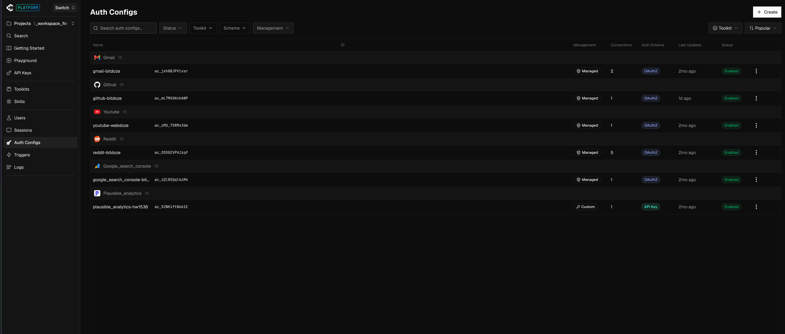
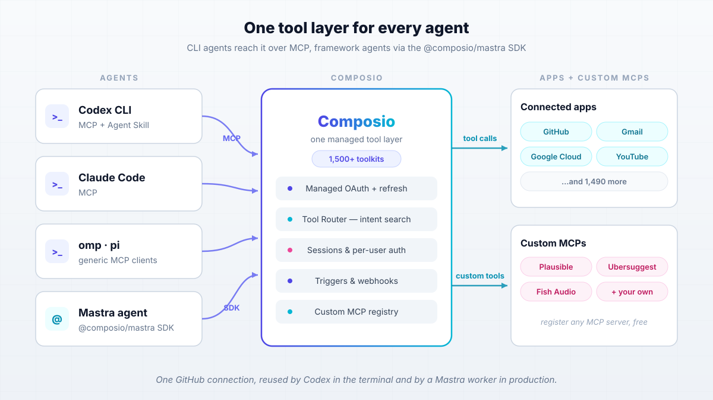
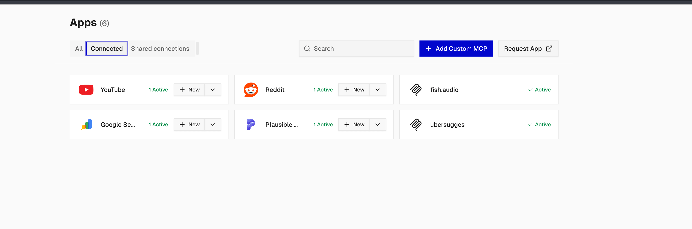
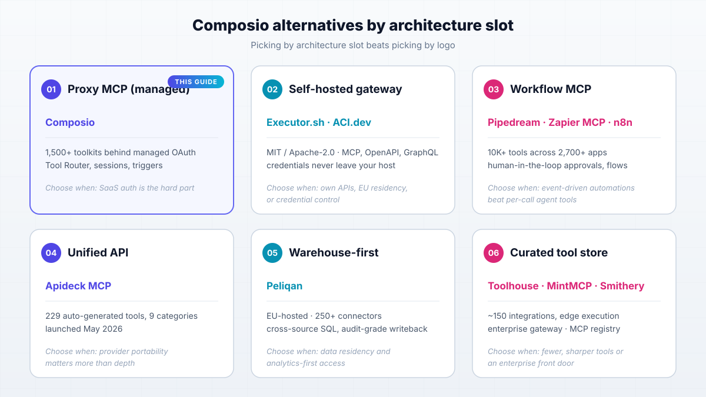
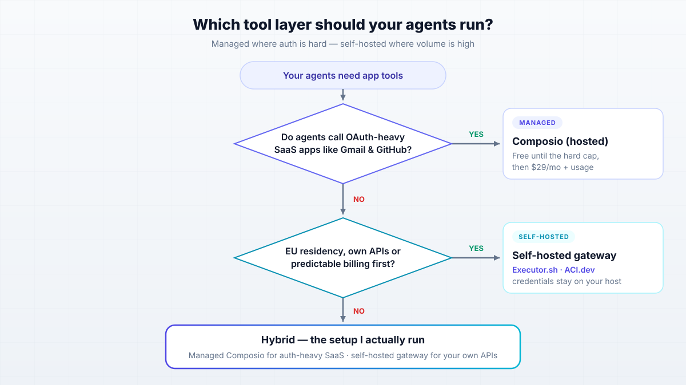

import Button from "@components/widgets/Button.astro";
import Notice from "@components/widgets/Notice.astro";
import ListCheck from "@components/widgets/ListCheck.astro";
import Accordion from "@components/widgets/Accordion.astro";
import Tabs from "@components/widgets/Tabs.astro";
import Tab from "@components/widgets/Tab.astro";

Composio MCP gives every agent you run the same tool layer: 1,500+ app integrations with managed OAuth behind one connection. In my day-to-day that means Codex CLI, omp (oh-my-pi) and pi all reach GitHub, Gmail and YouTube over MCP, while my Mastra agents hit the exact same connected accounts through the `@composio/mastra` SDK. Link an account once, use it from everywhere.

On top of the default catalog apps (Gmail, GitHub, YouTube, Reddit, Google Search Console, Plausible Analytics) my account carries two custom MCP servers, Ubersuggest and Fish Audio, added straight from the Apps screen. That bench turns coding agents into a small content pipeline (keyword research, analytics, video data, voice) without each agent keeping its own copy of every API key.

This guide is the practitioner version of that setup. You get the CLI install, client wiring for Codex and Claude Code (and any generic MCP client like omp and pi), the `successful: true` verification ritual, triggers and Composio Bench for the event-driven side, the 2026 pricing traps nobody else writes down, and the honest "when to self-host instead" call. I covered the self-hosted side in depth before in [my Executor.sh vs Composio comparison](/executor-sh-vs-composio/), so this piece links there instead of repeating the Docker guide. If you are just [getting started with AI programming](/ai-programming-beginners-guide/), skim that beginner guide first, then come back.

<Notice type="info" title="Checked on 2026-09-25">
Prices, CLI flags and endpoints in this guide were checked on 2026-09-25. Composio changes fast: re-check composio.dev/pricing and the SDK changelog on publish day.
</Notice>

## What Is Composio MCP? Managed Auth, 1,500+ Apps, One Connection

Composio sits between your agents and your apps. It stores and refreshes OAuth tokens, holds API keys, and exposes every integration as tools an agent can call. The homepage counts 1,500+ toolkits (GitHub, Gmail, Google Cloud, YouTube, Slack, Notion, and on). If the protocol itself is new to you, read [what MCP (Model Context Protocol) actually is](/mcp-introduction-beginners/) first. Composio is not MCP. It is a tool layer you reach over MCP (CLI agents) or over an SDK (framework agents), and both paths share the same connected accounts. That shared-account model is the whole point: one GitHub connection, reused by Codex in the terminal and by a Mastra worker in production.

Two products sit under one API. **Composio For You** is the personal-agent side: your own accounts, zero code, aimed at automating your life. **Composio Platform** is for application codebases where your users connect their accounts, with sessions and per-user auth. The docs are blunt about the split: "Default to Composio Platform for application codebases... Use Composio For You for a personal agent." For this guide I stay on the personal-agent side, which is what most solo operators need. If you just want a consumer MCP endpoint for Cursor or Claude Desktop, Composio also ships **Rube** (rube.app/mcp) that connects AI tools to 500+ apps with less ceremony.



That screenshot is my actual Auth Configs page. Note the split in the Management column: Google apps run on Composio-managed OAuth2 (fast to connect, but see the managed-app trap under pricing), while Plausible Analytics sits on a **Custom** config holding my own API key. You can flip any toolkit to your own OAuth app from here, which is exactly what the pricing section pushes you to do at volume.

Maturity signals worth knowing before you wire production agents to it: the `ComposioHQ/composio` repo has 28.7k stars and 4.6k forks, MIT licensed, but it contains SDKs and the CLI only. The platform runtime is closed source. Composio claims SOC 2 Type II and ISO 27001 (verify via their Trust Center before you write that in a security questionnaire) and "100M+ tool executions a week" on the hosted side. It is a real, funded product, not a weekend wrapper.

<ListCheck>
<ul>
<li>Managed OAuth and API-key auth, with token refresh handled for you</li>
<li>1,500+ toolkits behind one connection model</li>
<li>Tool Router: intent-based tool search, so 1,500 tools do not land in your context window</li>
<li>Triggers and webhooks for event-driven work</li>
<li>Custom MCP servers you can register for free (this is how Ubersuggest and Fish Audio fit in)</li>
<li>One connected account reused across terminal agents, framework agents and MCP clients</li>
</ul>
</ListCheck>



<Notice type="warning" title="Know what you are trusting">
The runtime is closed source and hosting is US by default. There is no EU region today; zero-data-retention (ZDR), BAA and IP allowlisting are paid add-ons on the Scale plan, and only included on Enterprise. If GDPR or data residency is a hard requirement, read the self-hosting section before you commit. Also assume every tool call routes through their cloud, so blast radius and latency both go through a third party.
</Notice>

## How to Set Up Composio MCP With Your Coding Agents

Here is the happy path from zero to a working agent login, in about 10 minutes. A free account is enough (no credit card, and the free tier is hard-capped, so no surprise bill). There are two login modes and picking the wrong one is the most common setup failure: a **human login** for interactive use, and an **unattended agent login** for CI boxes and headless agents that cannot open a browser. Both are below.

### What You Need Before You Start

<ListCheck>
<ul>
<li>A Composio account (free tier, no credit card). For production SaaS use, plan on registering your own OAuth apps for the toolkits you care about (see the pricing section for why).</li>
<li>Node.js 22.22.3 or newer (the TS SDK is ESM-only) or Python 3.10+ if you use the Python SDK.</li>
<li>A coding agent: Codex CLI or Claude Code officially; omp and pi work as generic MCP clients.</li>
<li>A plan for `COMPOSIO_API_KEY` handling: env var or secret store, never committed. Same for `agent.json` and `.env`.</li>
<li>Optional: Fish Audio and Ubersuggest accounts if you want to follow the custom-MCP demos.</li>
<li>For the self-hosted appendix: any Docker host or small VPS (1 GB RAM is plenty), port 4788.</li>
</ul>
</ListCheck>

Sanity check before you touch Composio:

```bash
node --version    # want v22.22.3+ for the TS SDK path
python3 --version # want 3.10+ for the Python SDK path
```

### Install the Composio CLI and Connect Your First App

Install the CLI. The installer drops the binary at `~/.local/bin/composio`:

```bash
curl -fsSL https://composio.dev/install | sh
export PATH="$HOME/.local/bin:$PATH"
```

<Notice type="warning" title="The installer edits your shell profile">
Recent CLI versions edit zsh/bash/fish startup files by default to set PATH. That fights dotfile managers and pollutes CI images. Opt out and set PATH yourself:

```bash
curl -fsSL https://composio.dev/install | COMPOSIO_INSTALL_SHELL=none sh
```
</Notice>

Now log in and connect your first app:

```bash
composio login                 # browser flow, org/project picker
composio login -y              # scripts/CI: accept session defaults
composio link github           # connect GitHub (opens consent screen)
composio link github --no-wait # non-blocking variant, JSON to stdout
composio whoami                # confirm who you are (no longer prints API keys)
composio upgrade               # self-update when you come back later
```

<Tabs>
<Tab name="Human login">

For interactive use on a laptop:

```bash
composio login
composio link github
composio whoami
```

The browser flow lets you pick org and project. `-y` accepts the session defaults for scripts. A pending login URL expires after 10 minutes, so do not leave one sitting in a CI log. Incomplete OAuth connections also auto-expire after 10 minutes.

</Tab>
<Tab name="Unattended agent login (CI/agents)">

For headless agents that cannot open a browser, create a dedicated agent account:

```bash
composio login --agent
composio agent whoami
COMPOSIO_API_KEY="$(jq -er '.composio.api_key' ~/.composio/agent.json)"
```

`composio agent whoami` must show `account_type: "agent"`, `status: "READY"` and `logged_in: true`. The identity lands in `~/.composio/agent.json` with 0600 permissions. The `composio.api_key` field is your project key.

Two footguns: `--agent` cannot be combined with `--no-browser` or `--key` flags, and the agent account does **not** inherit your human account's connected apps. It is a separate account by design, so run `composio link <app>` for every app the agent needs. Never commit `agent.json`.

</Tab>
</Tabs>

Failure modes in this step: login URL expired (10 minutes) means re-run `composio login`. `composio: command not found` after install means PATH is not exported in this shell. Apps missing on the agent account means you linked them to the human account instead.

### Add Composio MCP to Codex, Claude Code, omp and pi

Coding agents integrate through an Agent Skill plus MCP. The install is one line:

```bash
npx skills add ComposioHQ/composio --skill composio
```

That drops a SKILL.md the agent reads to know how to drive Composio. If the skill format is new to you, see [Agent Skills (SKILL.md files)](/best-ai-skills-for-web-design/). Officially listed clients: Claude Code, OpenAI Codex, Cursor, GitHub Copilot, Gemini CLI, OpenClaw, [OpenCode](https://go.bitdoze.com/opencode-go), Cline and Grok Build (native plugins exist for Claude Code and Codex). omp and pi are not on that list. I run them anyway as generic MCP clients and it works, but treat that as "any MCP client can connect" rather than "officially supported".

<Tabs>
<Tab name="Codex CLI">

```bash
npx skills add ComposioHQ/composio --skill composio
# MCP endpoint comes from the Composio dashboard (session-based MCP)
codex mcp add composio "$COMPOSIO_MCP_URL"
codex mcp list   # verify it is registered
```

Codex also has native Composio plugin support. Either way, the MCP URL must carry your identity (see the error notice below).

</Tab>
<Tab name="Claude Code">

```bash
npx skills add ComposioHQ/composio --skill composio
claude mcp add --transport http composio "$COMPOSIO_MCP_URL"
# then inside Claude Code: /mcp to sign in and confirm tools load
```

Claude Code has a native plugin too; the skill plus MCP path is what keeps it consistent with your other agents.

</Tab>
<Tab name="omp & pi (generic MCP client)">

omp (oh-my-pi) and pi are not on Composio's official client list, but both speak MCP. Point them at the same session-based MCP URL, with the API key as a header:

```bash
# same URL and x-api-key requirements as any other client
export COMPOSIO_API_KEY="ck_..."
# register https://mcp.composio.dev/... ?user_id=... in your client's MCP config
```

I pair this with [giving agents shared memory with Hindsight](/hindsight-docker-deploy/) so omp and pi keep context across sessions while Composio carries the tools. Also consider tightening blast radius before handing agents real tool access: [run AI CLI tools in Docker or Podman](/docker-podman-ai-cli-tools-safe-environment/) so a confused agent cannot touch your host.

</Tab>
</Tabs>

<Notice type="error" title="The 401 footgun (two causes)">
MCP URLs must include `?user_id=` or `?connected_account_id=` (mandatory since Jan 15, 2026), and orgs created after March 5, 2026 require an `x-api-key` header on every MCP request or you get a 401. Both are fixable in config; do not debug your agent prompt when the transport is rejecting you. You can opt out of the API-key requirement via `PATCH /api/v3/org/project/config`, but I would not.
</Notice>

<Notice type="info" title="Regenerate leaked MCP URLs">
Older `@composio/openai` versions printed credential-bearing MCP server URLs to stdout. Per Composio's changelog, treat any such URL as exposed and regenerate the endpoint. Also note the old `mcp.composio.dev` single-toolkit endpoint is decommissioned: tutorials predating late 2025 will fail. Docs now steer you to session-based MCP instead of per-toolkit MCP servers.
</Notice>

One more operational note before you continue. Once an agent can call tools, it can delete mail, push code and rotate infra. That is the point, and it is also the blast radius. Sandbox the CLI (link above), use a dedicated agent account rather than your human one, and know how to undo connections: deleting a connected account does **not** revoke upstream tokens. Call `POST /api/v3.1/connected_accounts/{id}/revoke` first, check `revoked_tokens` in the response (best-effort), then delete.

### Verify It Works: Agent Login and the "successful: true" Test

Do not trust a tool list. A schema lookup proves the tool exists, not that execution works. The official smoke test calls a no-auth tool and must return `"successful": true`:

```bash
curl --fail-with-body --silent https://backend.composio.dev/api/v3.1/tools/execute/HACKERNEWS_GET_USER \
  -H "x-api-key: $COMPOSIO_API_KEY" -H "Content-Type: application/json" \
  -d '{"arguments":{"username":"pg"}}'
```

<Notice type="success" title="successful: true, or it did not happen">
Require `"successful": true` in the response. A 401, a schema payload, or a 200 with `successful: false` does not count. This one curl separates "auth is wired" from "my agent prompt is wrong".
</Notice>

Then run the real end-to-end check: ask the agent to perform one small GitHub or Gmail action ("star this repo" or "draft a test label"), and confirm the call in the Composio dashboard tool-call log. The log is the source of truth for what the agent actually did.

<ListCheck>
<ul>
<li>`composio agent whoami` shows `status: "READY"`</li>
<li>MCP server listed in your client (`codex mcp list`, `/mcp` in Claude Code)</li>
<li>Smoke-test curl returns `"successful": true`</li>
<li>Dashboard tool-call log shows the real end-to-end action</li>
</ul>
</ListCheck>

Compact failure map: 401 on MCP connect means missing `x-api-key` (or wrong key) plus your org's MCP config. URL rejected means missing `?user_id=`. A schema-only response means you queried tools, not executed one. And if you need to opt out of `require_mcp_api_key`, that is `PATCH /api/v3/org/project/config`, again: not recommended.

## Composio Mastra Integration: the @composio/mastra SDK

Terminal agents get tools over MCP. Framework agents get them from the SDK, against the same connected accounts. The `@composio/mastra` provider is TypeScript-only and the 0.10.x line targets Mastra v1 (breaking changes versus the old v0.x provider), so pin your versions. This is the path I use for anything that runs unattended: sessions, typed tools, and a dashboard log I can audit.

### Sessions, Tool Router and Strict Mode Explained

The recommended shape is sessions-first. A session carries toolkits, auth config, sandbox state and files for one user, and `session.tools()` returns the tool set with input and output schemas so Mastra validates results too:

```ts
import { Composio } from "@composio/core";
import { MastraProvider } from "@composio/mastra";
import { Agent } from "@mastra/core/agent";
import { openai } from "@ai-sdk/openai";

const composio = new Composio({ provider: new MastraProvider({ strict: true }) });
const session = await composio.create("user_123");
const tools = await session.tools();

const agent = new Agent({
  id: "seo-agent",
  name: "SEO Agent",
  instructions: "Research keywords and summarize trends.",
  model: openai("gpt-5.2"),
  tools,
});
```

Set `COMPOSIO_API_KEY` in the environment. Sessions are reusable via `session_id` and adjustable with `session.update()`, which is how you swap toolkits per task without re-provisioning auth.

<Tabs>
<Tab name="Minimal session">

```ts
const composio = new Composio({ provider: new MastraProvider() });
const session = await composio.create("user_123");
const tools = await session.tools();
```

Fine for a personal agent. Schemas pass through as-is.

</Tab>
<Tab name="Strict mode + preloaded tools">

```ts
const composio = new Composio({ provider: new MastraProvider({ strict: true }) });
const session = await composio.create("user_123", {
  toolkits: ["GMAIL", "GITHUB"],
});
const tools = await session.tools();
```

Strict mode normalizes schemas for OpenAI structured outputs: all properties required, closed objects, optionals accept `null`, nulls dropped before execution. Preload only the hot toolkits you need (roughly 20 tools or fewer) instead of the whole catalog.

</Tab>
<Tab name="Pin toolkit versions (production)">

```ts
const session = await composio.create("user_123", {
  toolkitVersions: { GMAIL: "2026-08-01", GITHUB: "2026-07-15" },
});
```

Pin anything whose tool slugs your prompts or evals reference by name. Schema churn is real (details under failure modes). Exact version syntax moves between SDK releases; pin `@composio/core` and `@composio/mastra` first, then pin toolkits.

</Tab>
</Tabs>

Tool Router is the context-window fix. Instead of loading 1,500 tool definitions, agents discover tools at runtime through the `COMPOSIO_SEARCH_TOOLS` meta-tool. Use `SESSION_PRESET_DIRECT_TOOLS` for narrow agents that should never search, and keep preloaded tools to the handful the agent needs every run. Custom tools only live in Tool Router sessions.

<Notice type="warning" title="TS SDK rough edges">
The TS SDK is ESM-only and wants Node 22.22.3+. Passing `apiKey: null` disables environment fallback (pass `undefined` to keep it). `verifyWebhook` is async and requires `id` and `timestamp` params. Some Composio tools reference `$defs` entries the backend does not emit; the provider falls back to loose schema with one warning per tool instead of failing `tools.get()`. Schemas that cannot be strictified (arbitrary-key objects, `allOf`, `prefixItems`, unresolved `$ref`) silently fall back to permissive with a warning.
</Notice>

Verify this layer the same way as the CLI layer: `session.tools()` returns a non-empty list, then run one Gmail or GitHub action and confirm it in the dashboard log. Failure modes to expect: unresolved `$ref` warnings (fallback, not fatal), schema drift (1,445 enum slugs were renamed across 37 toolkits and around 230 tools flagged deprecated; pin `toolkitVersions` as your undo), and file handling surprises (presigned URLs with 1-hour TTL, auto upload/download off by default behind `dangerouslyAllowAutoUploadDownloadFiles`, plus a sensitive-path denylist for `.ssh`, `.env`, `.aws` and friends). Proxy execute exists for endpoints that are not wrapped as tools, but it is same-registrable-domain only (`400 OriginMismatch`) with a 250 MB payload cap.

### My Apps Bench: Default Toolkits Plus Custom MCP Servers

This is the part I have not seen written up anywhere else, so here is my actual bench. The Apps view shows six connected apps: four from the default catalog (YouTube, Reddit, Google Search Console and Plausible Analytics) plus two **custom MCP servers** I registered myself: Ubersuggest and Fish Audio. (Gmail and GitHub connections live at the platform level too, as the Auth Configs screenshot earlier shows.) Composio adds custom MCP servers for free (their FAQ: "Yes, if the app has an MCP server. You can easily add custom MCP servers to Composio for free."), and Tool Router keeps the extra servers from bloating context.



The "+ Add Custom MCP" button at the top right is the whole trick: paste a remote MCP URL, sign whatever auth flow it uses, and the server joins the same Apps list as a first-class citizen, reachable by Codex in the terminal and by Mastra through `session.tools()`, same as a native toolkit. The pipeline shape on my end:

- **Ubersuggest** (custom MCP, keyword research), **Google Search Console** (query and ranking data) and **Plausible** (site analytics on an API-key auth config) feed the keyword agent: what people search, what already ranks, what already gets traffic on my sites.
- **YouTube** feeds the content agent: video and topic data. **Gmail, GitHub and Reddit** cover the daily-ops accounts on managed OAuth.
- **Fish Audio** (custom MCP) feeds the narration agent: text-to-speech and voice cloning for the output.

The agents end up with detailed, current information instead of hallucinated keyword volumes. Same idea generalizes: I covered [BrightData MCP for web scraping](/brightdata-mcp-guide/) (it pulls from the [Bright Data](https://go.bitdoze.com/brightdata) web-data platform) as a web-data source, and [self-hosted AI memory via an MCP server](/cognee-self-host/) (Cognee) as a memory source. Both slot into the same custom-MCP registry.

One server has public docs worth walking through: [Fish Audio](https://go.bitdoze.com/fish-audio) exposes a streamable-HTTP MCP at `https://api.fish.audio/mcp`. Auth is OAuth via a browser popup, billing draws from your plan package credits (not developer API credits), image/video generation is price-quoted and needs confirmation, video needs the Plus plan or higher, failed generations are refunded, and uploads auto-delete after 7 days. Connect commands straight from their docs:

<Tabs>
<Tab name="Fish Audio: Codex CLI">

```bash
codex mcp add fish-audio https://api.fish.audio/mcp
codex mcp login fish-audio
codex mcp list   # verify
```

</Tab>
<Tab name="Fish Audio: Claude Code">

```bash
claude mcp add --transport http fish-audio https://api.fish.audio/mcp
# then inside Claude Code: /mcp to sign in
```

</Tab>
</Tabs>

<Notice type="info" title="Fish Audio credit mechanics">
MCP generations draw from plan-package credits, not the separate developer API balance. Video generation requires the Plus plan or higher. One TTS call is enough to verify: watch the credit usage move in the Fish Audio dashboard after the agent runs.
</Notice>

Fish Audio works standalone (as above) or registered inside Composio as a custom MCP so the same voices are available to Mastra agents through `session.tools()`. I run it the second way: putting it behind Composio means one auth story and one tool log shared with the rest of the bench.

<ListCheck>
<ul>
<li>YouTube, Reddit, Google Search Console: connected apps from the default catalog on managed OAuth2</li>
<li>Plausible: catalog app on a custom API-key auth config (self-hosted analytics I trust)</li>
<li>Ubersuggest: keyword research and volumes, added via "+ Add Custom MCP"</li>
<li>Fish Audio: TTS and voice cloning, added via "+ Add Custom MCP"</li>
<li>Gmail and GitHub: connected at platform level for the agents that need them</li>
</ul>
</ListCheck>

Verify with one real run: ask the agent for keyword ideas on a topic, watch it call Ubersuggest, Search Console and Plausible, then ask for a voice line and generate one TTS through Fish Audio. Check the Composio tool-call log and the Fish Audio dashboard afterwards.

## Composio Triggers and Bench: Events In, Benchmarks Out

Tool calls are the pull model: the agent asks, Composio executes. Two more pieces cover the other direction and the "is this even working well" question: triggers push app events to you, and Bench measures whether your agent is any good at using tools in the first place.

### Triggers: app events delivered to your webhook

A **trigger type** is a template an app exposes, like `GITHUB_COMMIT_EVENT`, a new Gmail message or a new Slack DM. A **trigger instance** is that type activated for one connected account, with its own `ti_*` ID you can enable, disable or delete independently. You create instances with `POST /api/v3.1/trigger_instances/{slug}/upsert` (or the SDK), then register one webhook URL per project and Composio POSTs every event there, signed with `webhook-id`, `webhook-timestamp` and `webhook-signature` headers. Store the secret as `COMPOSIO_WEBHOOK_SECRET` and verify before trusting any payload.

Latency depends on the provider, not on you: Slack, Asana, Notion and Outlook push in near-realtime, while Gmail and Google Calendar are polled, clamped to a 15-minute minimum on Composio-managed OAuth (the pricing section covers why your own OAuth app drops it to 1-minute polling). For local development, `composio triggers` CLI streaming or `subscribe()` in the SDK forwards events to your machine over a WebSocket signed exactly like production, so you can test the real handler before you have a public URL.

<ListCheck>
<ul>
<li>One webhook URL per project receives every trigger event, signed</li>
<li>Realtime for push providers, ~15-min polling for Gmail/Calendar on managed auth</li>
<li>Subscribe to lifecycle events: `composio.connected_account.expired` and `composio.trigger.disabled` tell you when auth or a trigger silently dies</li>
<li>Billing: 50K trigger events/mo free; managed-auth events cap at 10K then $0.005 each</li>
</ul>
</ListCheck>

In my stack this is what turns the bench into a pipeline: a Search Console or Plausible change, a new Reddit mention, a YouTube comment: any of them can fire an event that wakes a Mastra agent instead of the agent polling on a cron.

### Composio Bench: check whether your agent can actually use tools

Composio also runs **[Bench](https://composio.dev/bench)**, a public benchmark that executes real agent harnesses against stateful tool-use tasks, not the usual synthetic function-calling quiz. The headline dataset, `composio-hard-30`, is 30 tasks spanning multi-app workflows, exact state reconciliation, guarded writes, batching and pagination. A fixed grader checks the final state of every app the task touched; every check must pass, no partial credit. That is a much harsher bar than "did the model pick the right function".

Each harness page (there is one for [Pi Agent](https://composio.dev/bench/harnesses/pi-agent), among others) reports success rate and time per task per model. Practical use: before wiring a new model or agent to your connected accounts, glance at its Bench numbers: a combo that cannot clear multi-app workflows there will not reliably run a keyword-research pipeline either. It also doubles as a preview of how the underlying models handle real API structures, which is the same thing I care about when picking from the [open source LLMs for coding agents](/best-open-source-llms-claude-alternative/).

## Composio Pricing in 2026: Free Tier Math and the Managed-App Trap

Almost every third-party page out there has stale pricing ("1,000 free actions", "$49/mo Pro"). Those numbers are wrong. Only trust composio.dev/pricing, and re-check it on publish day.

<Notice type="warning" title="Pricing cutover dates">
New pricing applies to signups on or after August 15, 2026. Existing customers are grandfathered through December 31, 2026. Premium tool calls are billed for all customers from September 10, 2026. If you read a comparison written before that, ignore its numbers.
</Notice>

What the current plans actually say:

| Line | Free | Scale ($29/mo) |
|---|---|---|
| Tool calls | 100,000/mo, hard-capped (usage pauses, no surprise bill) | $29 monthly usage credit (no rollover), then $0.0003/call |
| Trigger events | 50,000/mo | credit, then $0.003/event |
| Team members | 3 | more (check the page) |
| API rate limit | 2,000 req/min | 10,000 req/min |
| Connected accounts | unlimited | unlimited |
| Custom tools & MCP | included | included |
| Log retention | 7 days | 30 days |

<Notice type="error" title="The managed-app trap is the #1 cost footgun">
Composio-managed OAuth apps (their shared client apps) only consume **20K of your 100K** free tool calls; past that it is $0.0005/call. Managed trigger events cap at 10K free then $0.005, and managed connections at 1K free then $0.10/connection. Bring your own OAuth app and the full allowance applies. Practical consequence: register your own Google/Microsoft OAuth apps early (review takes days to weeks) or you are paying overage while a "free" plan sits unused.
</Notice>

Premium tools bill separately at provider cost plus 5%: web search via Exa or Tavily around $0.008/search, SerpAPI around $0.011, Browser Use around $0.70/task, Google Veo around $1.20/video, Gemini image around $0.14/image. Treat those as approximate and re-check. Add-ons on Scale: sandbox execution +$0.0001/call (10K free), direct execution outside a Session +$0.0001/call (10K free; execution inside a Session is the included path), proxy execute +$0.0002/call (1K free), plus BAA, IP allowlist and ZDR at small per-call rates. One stale note to ignore: an older changelog entry still says sandboxes are "not billed today". The pricing page already meters sandbox calls, so budget for them. Enterprise adds SSO/SCIM, customer-managed KMS keys and custom volume.

Two more cost realities. Trigger polling is clamped to a 15-minute minimum on managed OAuth (API-enforced since April 15, 2026); 1-minute polling needs your own OAuth app, otherwise use webhook triggers. And every re-query costs money: a third-party comparison from kanopylabs.com describes a bill jumping from $200 to $1,400/month from agents re-checking Salesforce data to "verify", fixed with prompt rules and short result caching. Not my numbers, but the mechanism is obvious once you watch an agent loop.

<ListCheck>
<ul>
<li>Stay on Free until the hard cap actually pauses you; it is realistically months of solo use</li>
<li>If you upgrade to Scale, set spend caps and treat the $29 credit as your budget</li>
<li>Bring your own OAuth apps for anything you call at volume (full free allowance)</li>
<li>Prefer session execution over direct execution, and avoid premium tools or cap them</li>
<li>Prompt agents not to re-query "to verify", and cache results for 30 to 60 seconds</li>
<li>Export logs if you debug from them: 7-day retention on Free, 30 on Scale</li>
</ul>
</ListCheck>

Order of magnitude for a solo operator with several agents: $0 to $29/month on Composio plus your LLM token bill. The subscription itself is small. Managed-app overages and premium tools are what drive the bill up.

## When Not to Use Composio: Self-Hosting and Alternatives

Composio self-hosting is Enterprise-only and sales-gated (GitHub issue #291 asking for self-serve self-hosting has been open since 2024). So the "when not to" question is really "when does someone else win". Composio loses when you call your own APIs at high volume, when EU residency is mandatory, when a closed runtime makes you uncomfortable, or when you need predictable infra cost instead of per-call pricing. The useful way to compare the field is by architecture slot, not by feature checklist: proxy MCP vs workflow MCP vs unified API vs warehouse-first vs self-hosted gateway vs open-source platform.

### Executor.sh: the Self-Hosted Composio Alternative

Executor.sh is the self-hosted option I feature, and I will not repeat the setup here: the full Docker and Dokploy walkthrough lives in [my Executor.sh vs Composio comparison](/executor-sh-vs-composio/). Facts that matter for the decision: MIT licensed, roughly 3,982 GitHub stars as of Sep 25, 2026 (it grew from around 2,600 in July; re-check on publish day), active TypeScript development, MCP plus OpenAPI plus GraphQL plus custom JS tools, a sandboxed execution environment with host-side credential injection, and a policy engine. It is YC S26.

The one-line run hint is `ghcr.io/rhyssullivan/executor-selfhost:latest` on port 4788, and a 1 GB RAM VPS is enough. Cost math: $0 software on a [Hetzner](https://go.bitdoze.com/hetzner)-class VPS at roughly 4.5 to 6 euro per month that you already run for other things (or Cloudflare Workers on the free tier). The trade-off is honest: you bring your own OpenAPI/GraphQL/MCP specs, there is no managed OAuth catalog. What you get back is control over credentials (they never leave your host) and a context trick: thousands of tool definitions collapse to roughly one tool in context (Executor claims around 278,800 tokens down to about 1,044; vendor claim, measure your own).

<Notice type="info" title="Full guide is in the comparison article">
The Docker, Compose and Dokploy steps are already published. This guide keeps to the decision criteria.
</Notice>

<Button text="Read the Executor.sh vs Composio comparison" link="/executor-sh-vs-composio/" variant="solid" color="blue" size="md" icon="arrow-right" />

### ACI.dev, Pipedream, Zapier MCP and the Rest of the Field

Below is the architecture-slot map. Every row has a shape that fits a different problem; picking by slot beats picking by logo.



| Slot | Product | Key facts | Choose this when |
|---|---|---|---|
| Proxy MCP (managed) | Composio | 1,500+ toolkits, managed OAuth, sessions, triggers | SaaS auth is the hard part and you want one connection everywhere |
| Self-hosted gateway | Executor.sh | MIT, Docker/Workers, MCP+OpenAPI+GraphQL, host-side credentials | Own APIs, EU residency, or credential control |
| Open-source platform | ACI.dev | Apache-2.0, ~4,899 stars, Docker+Postgres+Redis, 600+ tools claimed | You want an open platform you can fork; check maintenance (last push May 2026 at research time) |
| Workflow MCP | Pipedream MCP, Zapier MCP | Pipedream: 10K+ tools across 2,700+ apps (acquired by Workday, Nov 2025). Zapier: big catalog with human-in-the-loop approvals | Event-driven automations beat per-call agent tools |
| Workflow MCP (self-host) | n8n | Self-hosted workflow engine with MCP support | You want triggers and flows on your own box: [self-host n8n for workflow automation](/n8n-self-host-workflow-automation/) |
| Unified API | Apideck MCP | 229 auto-generated tools across 9 categories (launched May 2026) | Portability across providers matters more than per-provider depth |
| Warehouse-first | Peliqan | EU-hosted, 250+ connectors, cross-source SQL, audit-grade writeback | Data residency and analytics-first access |
| Curated tool store | Toolhouse, MintMCP, Smithery | Toolhouse: around 150 integrations, edge execution (third-party pricing claims); MintMCP: enterprise gateway; Smithery: MCP registry | You want fewer, sharper tools or an enterprise front door |

<Notice type="warning" title="Unverified numbers flag">
Zapier MCP's current free-tier limits and Toolhouse's pricing were unverified at research time (2026-09-25). Pipedream/Workday and Apideck facts come from secondary sources. Check the vendors' primary pages before you cite any of this in anger. I dropped rows I could not source.
</Notice>

<Accordion label="Why is there no self-hosted Composio?" group="faq">
Composio's runtime is closed source and self-hosting is an Enterprise, sales-gated offer. Community request issue #291 has been open since 2024. The open-source energy in this space went to Executor.sh and ACI.dev instead. If self-hosting is a requirement today, those are your realistic options.
</Accordion>

## The Verdict: One Tool Layer, Three Ways to Run It

Here is the short version of what I actually recommend. Use hosted Composio for OAuth-heavy SaaS (Gmail, YouTube, Google Search Console, GitHub): the free tier is realistically months of solo use, and managed token refresh is genuinely annoying to build. Use a self-hosted gateway (Executor.sh or ACI.dev) for your own APIs, high volume, or EU residency. Run the hybrid when both are true: managed where auth is hard, self-hosted where volume is high. That hybrid is what my stack looks like.



Decision rules, not vibes:

<ListCheck>
<ul>
<li>Choose Composio when agents need Gmail/Google/YouTube/GitHub, you want one connection across Codex, omp, pi and Mastra, and Free/Scale pricing fits (watch the managed-app cap).</li>
<li>Choose self-hosted (Executor.sh/ACI) when the APIs are yours, volume is high, credentials must not leave your network, or EU residency is non-negotiable.</li>
<li>Choose workflow MCP (n8n, Pipedream, Zapier) when the work is event-driven pipelines rather than per-call agent tools.</li>
<li>Whatever layer you pick, decide what model sits behind the tools separately; [open source LLMs for coding agents](/best-open-source-llms-claude-alternative/) are good enough for most tool-calling loops now.</li>
</ul>
</ListCheck>

Then do the boring things that make it survive contact with production: pin toolkit versions, sandbox the CLI, set spend caps, revoke upstream tokens on teardown, and verify with `successful: true` every time. If you have not read the deep dive on the self-hosted side, it is [my Executor.sh vs Composio comparison](/executor-sh-vs-composio/).

<Button text="Get started with Composio" link="https://composio.dev" variant="solid" color="blue" size="md" icon="arrow-right" />
<Button text="Executor.sh self-host guide" link="/executor-sh-vs-composio/" variant="outline" color="gray" size="md" />

## FAQ

<Accordion label="Do I really need another SaaS subscription for agent tools?" group="faq" expanded="true">
Probably not on day one. The Free tier is 100K tool calls and 50K trigger events per month, hard-capped so usage pauses instead of billing you. That covers months of solo multi-agent use. Pay $29/month for Scale only when the cap pauses real work, and treat the included $29 credit plus spend caps as your budget. The line items that actually hurt are managed-app overages and premium tools, not the subscription.
</Accordion>

<Accordion label="Will my credentials leak through their cloud?" group="faq">
Tokens are stored by Composio and redacted in API responses, but the runtime is closed source and hosting is US by default. ZDR, BAA and IP allowlisting are paid add-ons on Scale, included on Enterprise. There is also a self-managed credentials mode where you pass tokens at execution time and Composio never stores or refreshes them (12 apps already require this). If none of that is acceptable, Executor.sh keeps credentials on your host and injects them at call time.
</Accordion>

<Accordion label="Doesn't 1,500 apps bloat my context window?" group="faq">
Not if you use Tool Router. Tools are discovered at runtime via `COMPOSIO_SEARCH_TOOLS` instead of being loaded wholesale. Preload only the hot tools you need each run (roughly 20 or fewer), or use `SESSION_PRESET_DIRECT_TOOLS` for narrow agents. Executor.sh goes further and collapses thousands of tool definitions to roughly one tool in context, which is worth measuring if tokens are your bottleneck.
</Accordion>

<Accordion label="Can I use the same tools in terminal agents and Mastra without duplicating config?" group="faq">
Yes. MCP for CLI agents (Codex, Claude Code, omp, pi), `session.tools()` from `@composio/mastra` for framework agents, and the same connected accounts behind both. The only duplication is the client-side wiring; auth and the tool catalog live in one place.
</Accordion>

<Accordion label="What breaks when Composio's APIs change?" group="faq">
Tool schemas change. 1,445 enum slugs were renamed across 37 toolkits and around 230 tools were flagged deprecated. Your undo is pinning `toolkitVersions` in production and subscribing to lifecycle webhooks: `composio.connected_account.expired` and `composio.trigger.disabled` tell you when auth or a trigger silently dies. Log retention is 7 days on Free and 30 on Scale, so export if you debug from logs.
</Accordion>

<Accordion label="How do I keep the bill predictable?" group="faq">
Stay on the hard-capped Free tier, or set spend caps on Scale. Register your own OAuth apps so the full free allowance applies (managed apps cap at 20K of 100K calls). Avoid premium tools (Exa, Tavily, Browser Use, Veo) or cap them. Prompt agents not to re-query to verify, cache results for 30 to 60 seconds, and prefer execution inside a Session over direct execution. Check the usage metering dashboard after the first real week of agent use.
</Accordion>

<Accordion label="Can I self-host Composio?" group="faq">
Not as a solo operator. Self-hosting is Enterprise-only and sales-gated, and the community request (issue #291) has been open since 2024. Tonight you can self-host Executor.sh (MIT, Docker or Cloudflare Workers) or ACI.dev (Apache-2.0, Docker+Postgres+Redis). The full Docker and Dokploy walkthrough is in [my Executor.sh vs Composio comparison](/executor-sh-vs-composio/).
</Accordion>
