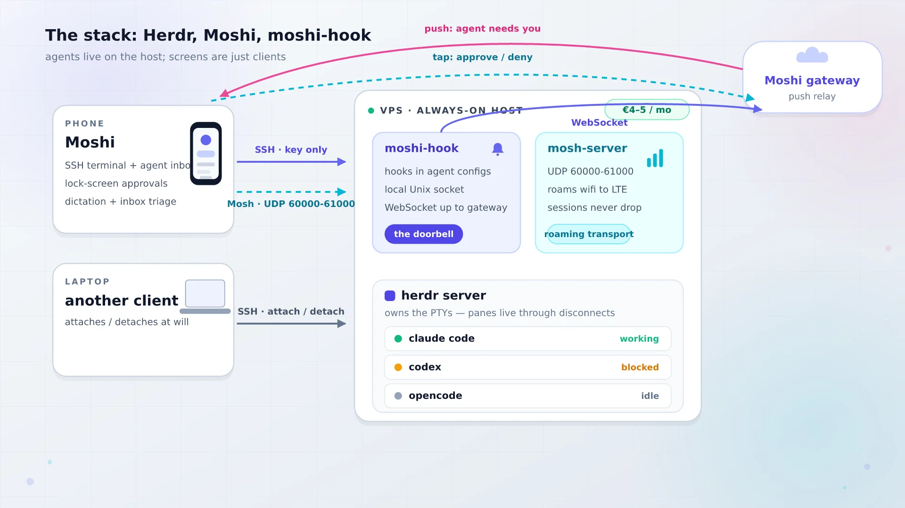
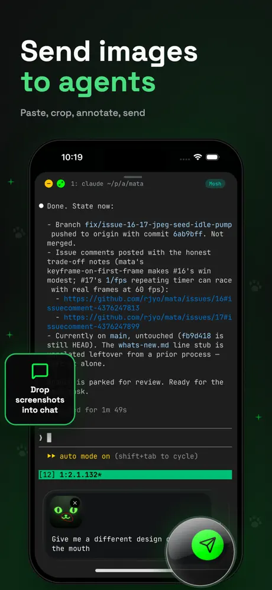
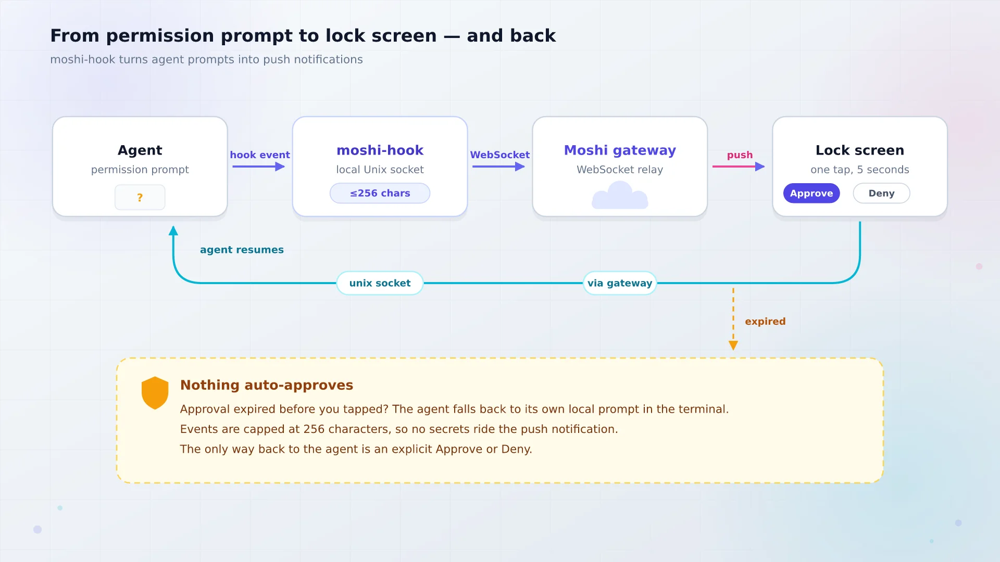

import Button from "@components/widgets/Button.astro";
import Notice from "@components/widgets/Notice.astro";
import ListCheck from "@components/widgets/ListCheck.astro";
import Accordion from "@components/widgets/Accordion.astro";
import Tabs from "@components/widgets/Tabs.astro";
import Tab from "@components/widgets/Tab.astro";
import YouTubeEmbed from "@components/widgets/YouTubeEmbed.astro";

If you want to control AI agents from your phone (approve Claude Code prompts from the lock screen, see which agent is blocked, answer a question by voice), this is the setup. Herdr keeps the agents alive on an always-on VPS. Moshi turns the phone into the terminal that steers them. Both are cheap or free, and the whole thing fits on a €4-5/month box.

The mental model matters more than the commands: the herd lives on the host, and every laptop or phone is just another client that can attach and detach at will.

## Why your AI agents need an always-on host

Coding agents are not interactive in the way a shell is interactive. You kick one off, it works for 20 minutes, and then it needs you for 30 unpredictable seconds: a permission prompt, a clarifying question, a "done, want me to open the PR?". Those 30 seconds are the whole bottleneck.

Chain the agents to your laptop and you are chained too. Close the lid and they stall. Run them on a phone-only setup and you are typing prompts on a glass keyboard. The boring fix is to run the agents on a machine that never sleeps and treat every screen you own as a disposable window onto that machine.

A cheap VPS beats the other always-on options here. A Mac mini works, but it needs power, cooling, and a place on a shelf, and if it ever sleeps your herd stalls. A Hetzner-class VPS costs about the same as a coffee per month, has no lid to close, and I can rebuild it from scratch in 10 minutes when I inevitably break something.

<Notice type="info" title="Claude Code does not install on your iPhone">
The biggest misconception about mobile agents: there is no phone-native Claude Code. The agent runs on a host you control (VPS, home server, always-on Mac). The phone is a terminal and a doorbell. Everything below follows from that split.
</Notice>

What you actually want from the phone is narrow and concrete: see which agent is blocked, approve the prompt it is stuck on, answer a short question, and glance at a diff when you feel like it. That is a 30-second loop, not a coding session. Design for the 30-second loop and the setup stays small.

## The stack: Herdr, Moshi, and moshi-hook

Three pieces, each doing one job. You can stop after any of them and still have something useful.



### Herdr: the runtime your agents live on

Herdr is an agent-aware terminal multiplexer written in Rust. A background server owns the PTYs. Clients attach and detach. Panes keep running when the SSH session drops or the phone screen locks. It ships as a single ~10-11 MB binary, no Electron, no telemetry, no account. The repo sat at ~40.9k stars and Apache-2.0 when I checked on 2026-09-27, and it is under very active development (pre-1.0, seed-funded, mostly a solo dev).

The part that earns its keep over plain tmux is agent state detection. Herdr reads the live bottom buffer of each pane with TOML "screen manifests" (plus optional lifecycle hooks) and rolls states up a sidebar: `working`, `blocked`, `done`, `idle`, `unknown`. If you have ever run five agents and had no idea which one was waiting on you, that sidebar is the feature. For the full comparison with tmux, see [our Herdr review](https://www.bitdoze.com/herdr-agent-multiplexer/).

<Notice type="warning" title="License changed at some point">
My earlier Herdr review lists AGPL-3.0-or-later. The repo README on 2026-09-27 shows Apache-2.0, and the project changelog records the relicense from AGPL-3.0-or-later to Apache-2.0. Still, check the LICENSE file before you build a commercial product on top of it.
</Notice>

### Moshi: a mobile terminal built for AI coding agents

Moshi (iOS 17+, Android 10+) is a terminal app designed around agent CLIs rather than around generic SSH. Free tier gets you a full SSH terminal with unlimited sessions, push notifications for agent events (rate-limited), dictation, and biometric key protection. Pro is $7.99/month or $69.99/year and unlocks the things that make this setup good: Mosh transport, the multiplexer UI (tmux/Zellij/Herdr), image paste, a diff viewer, and unlimited inbox actions. One license covers three devices.

Two things make it more than "Termius with a dark theme". First, native Herdr support: a session picker tab that lists running Herdr sessions, a shortcut panel for `Ctrl-B` chords, and gestures tuned for narrow screens. Second, the agent inbox that triages events into Needs you / Working / Done instead of making you scroll scrollback. As a mobile terminal for AI coding agents, that combination is the one I would pick right now.



### moshi-hook: the doorbell that turns prompts into push approvals

moshi-hook is a free daemon on the host. It installs hooks into the agents' own configs (Claude Code `PreToolUse`/`Notification`/`Stop` in `~/.claude/settings.json`, Codex in `~/.codex/hooks.json`, OpenCode too), listens on a local Unix socket, and holds a WebSocket to Moshi's gateway. When an agent hits a permission prompt, your lock screen lights up with Approve and Deny.

Two safety properties worth knowing before you install it. Approval events are capped at 256 characters, so a prompt cannot dump your env file into a push notification. And if an approval expires before you tap it, the agent falls back to its own local prompt in the terminal. Nothing is silently auto-approved because your phone was on airplane mode.

It also knows about Herdr: it reads `$HERDR_ENV` / `$HERDR_SESSION`, tags inbox events with the session and workspace, and a tap on an inbox card reconnects to that exact session via `moshi://herdr?workspace=<id>&session=<name>`.

## What you need before you start

The rule for this whole guide: prove each layer at a desk before you add the next one. Agents working over SSH first. Then mosh. Then the phone. Then push. Skipping that order is how people end up debugging a lock screen notification when their real problem is a wrong SSH key.

<ListCheck>
<ul>
<li>Ubuntu 22.04+ or Debian 12 VPS. 2 vCPU / 4 GB is comfortable for a few agents plus a dev server. A [Hetzner Cloud](https://go.bitdoze.com/hetzner) CX22-class box is the reference host throughout this guide.</li>
<li>SSH reachable with key-only auth. Public SSH is fine to start; a tailnet is better (covered in the security section).</li>
<li>Agent CLIs already logged in and working on that host from a desk terminal. Claude Code, Codex, or whatever you run. If you are still choosing, see the [best AI coding tools and agents](https://www.bitdoze.com/ai-coding-tools/).</li>
<li>Host packages: `mosh`, `tmux` (as fallback), `git`.</li>
<li>Phone with Moshi installed from the App Store or Google Play, push notifications enabled, SSH key imported with Face ID / biometric protection.</li>
<li>Firewall plan: TCP 22 plus UDP 60000-61000 for Mosh, or Tailscale-only and no public ports.</li>
</ul>
</ListCheck>

If your VPS is not provisioned yet, walk through the [secure VPS setup for AI coding agents](https://www.bitdoze.com/vps-ai-coding-setup/) first. It covers hardening, SSH keys, and getting the agent CLIs installed.

<Button text="VPS setup guide" link="/vps-ai-coding-setup/" variant="outline" color="blue" />

Cost context before we start: the infra is about €4-5/month. Your agent token subscriptions will dwarf it. This guide is about the control plane, which is nearly free.

## Herdr VPS setup: build the host

Everything below assumes a fresh Ubuntu/Debian box and a user with sudo. Commands are copy-pasteable in order.

### Install Herdr on the VPS

<Tabs>
  <Tab name="curl (Linux VPS)">
    ```bash
    curl -fsSL https://herdr.dev/install.sh | sh
    herdr --version
    ```
  </Tab>
  <Tab name="Homebrew (macOS host)">
    ```bash
    brew install herdr
    herdr --version
    ```
  </Tab>
  <Tab name="mise">
    ```bash
    mise use -g herdr
    herdr --version
    ```
  </Tab>
</Tabs>

Now the first footgun. Moshi probes your host with a non-interactive SSH command, which means `~/.bashrc` and `~/.zshrc` are not sourced. If the install script put `herdr` in `~/.local/bin`, Moshi will not find it. Put it somewhere on the default PATH:

```bash
sudo ln -sf ~/.local/bin/herdr /usr/local/bin/herdr
```

**Verify:** run `ssh you@vps 'command -v herdr'` from your laptop. It must print a path. If it prints nothing, the Herdr tab will be missing in Moshi later.

### Install Mosh and fix the UTF-8 locale

```bash
sudo apt update && sudo apt install -y mosh tmux
sudo locale-gen en_US.UTF-8 && sudo update-locale LANG=en_US.UTF-8
```

Mosh is the transport that makes phone terminals viable. Plain SSH is a TCP connection, and phone OSes are aggressively good at killing TCP connections: lock the screen, switch from wifi to LTE, walk between rooms, and the session freezes. Mosh starts over SSH and then switches to UDP (60000-61000 by default) and is designed for exactly this intermittent-link case.

<Notice type="warning" title="Minimal VPS images ship without UTF-8 locales">
Classic failure on a fresh Debian/Ubuntu minimal image: `The locale requested by LC_CTYPE=UTF-8 isn't available here`, and mosh refuses to start. The `locale-gen` + `update-locale` commands above fix it. Cheap to run preemptively, annoying to diagnose later.
</Notice>

**Verify:** `locale` shows `LANG=en_US.UTF-8` (or another UTF-8 locale) and `which mosh-server` returns a path. On a normal laptop connection, `mosh you@vps` should land you in a shell.

### Open the firewall: SSH plus the Mosh UDP range

```bash
sudo ufw allow OpenSSH
sudo ufw allow 60000:61000/udp
sudo ufw status
```

Nothing else needs to be open for this stack. No web ports, no agent dashboards. If you want to see how ugly an over-open firewall gets in practice, the story in [hardening a Hetzner server with ufw](https://www.bitdoze.com/bsi-security-report-docker-ufw/) is a good read before you skip this step.

The alternative to public SSH + UDP: put the VPS on a tailnet and open neither. Moshi's own docs recommend Tailscale when possible. I cover that in the security section below; for now the public path keeps the tutorial simple.

**Verify:** `sudo ufw status verbose` shows both rules. From an external network (phone hotspot is perfect for this), `nc -u -z -v you.vps.ip 60000` should not hang on a filtered port.

### Pair moshi-hook and enable lingering

On the phone, open Moshi → Settings → Hooks and copy the pairing token. Then on the host:

<Tabs>
  <Tab name="Linux (VPS)">
    ```bash
    curl -fsSL https://getmoshi.app/install.sh | sh

    moshi-hook pair --token <token from Moshi: Settings -> Hooks>
    moshi-hook install
    moshi-hook serve

    # separate terminal
    moshi-hook status
    ```
  </Tab>
  <Tab name="macOS">
    ```bash
    brew tap rjyo/moshi
    brew install rjyo/moshi/moshi-hook
    brew trust --formula rjyo/moshi/moshi-hook
    brew services start rjyo/moshi/moshi-hook

    moshi-hook pair --token <token from Moshi: Settings -> Hooks>
    moshi-hook install
    moshi-hook status
    ```
  </Tab>
</Tabs>

`moshi-hook install` writes the hooks into your agent configs. `moshi-hook serve` is the long-running daemon on Linux (macOS gets a brew service).

<Notice type="warning" title="Lingering, or your daemon dies at logout">
On a headless VPS, systemd user services are torn down when the last session of that user ends. Without lingering, moshi-hook dies the moment you disconnect. Run this once:

```bash
sudo loginctl enable-linger $USER
```

Confirm with `loginctl show-user $USER | grep Linger`.
</Notice>

**Verify:** `moshi-hook status` reports a clean daemon with a live connection to the gateway, and one test notification reaches the phone. If status says `herdr: not found`, jump to the failure section: that is a systemd PATH issue with a two-line fix.

### Start your first agent workspace

Now the actual herd.

```bash
ssh you@vps
herdr                 # starts the background server and attaches a client
```

Chords you need on day one: `Ctrl+B v` splits vertically, `Ctrl+B -` splits down, `Ctrl+B c` new tab, `Ctrl+B q` detaches. Launch an agent in a pane:

```bash
claude                # or codex / opencode / pi
```

Then wire up lifecycle integrations. These record native session IDs so conversations survive a server restart:

```bash
herdr integration install claude
herdr integration install codex
herdr session list --json    # this is what Moshi's picker calls
```

This is also where a second agent earns its keep. I like [OpenCode](https://go.bitdoze.com/opencode-go) as a cheap second brain in a second pane; if you want the full install, [run OpenCode on your VPS](https://www.bitdoze.com/opencode-setup-guide/) walks through it. A third option in its own tab is fine too: the [Pi coding agent setup guide](https://www.bitdoze.com/pi-coding-agent-setup-guide/) covers that one.

**Verify:** the Herdr sidebar shows the agent as `working` or `idle` (not `unknown`), and `herdr session list --json` returns the session. If the state is `unknown`, run `herdr agent explain <target> --verbose`; screen manifests lag new agent UI versions and `herdr server update-agent-manifests` pulls fresh ones.

## Run Claude Code from your phone

Host is ready. Now the phone half.

### Connect Moshi to the VPS (SSH key, then Mosh)

Create or import an SSH key in Moshi and turn on biometric key protection. Add a host, connect over plain SSH first, and confirm you see the `herdr` TUI. That proves the key, the user, and the PATH fix from earlier.

Then switch the transport to Mosh (Pro). Everything you installed in the previous section is what Mosh needs: `mosh-server` on the host, a UTF-8 locale, and UDP 60000-61000 reachable.

<Notice type="info" title="The free path works today">
Plain SSH on the Moshi free tier is enough to prove the concept: unlimited sessions, the terminal, even rate-limited agent push events. What you lose is Mosh's roaming and the Herdr multiplexer UI. Try the free path first; see the cost section for what Pro actually buys.
</Notice>

**Verify:** connect, run `htop` or `herdr`, then toggle airplane mode for 10 seconds. With Mosh the session is alive when you come back. With SSH it is not. That single test tells you which transport you are on.

### The Herdr session picker and shortcut panel

Moshi detects Herdr on connect by running a non-interactive SSH probe, then calls `herdr session list --json` and shows running sessions under a Herdr tab. If you have two or three agent sessions, they show up here with their workspace names. A vertical swipe opens the workspace navigator.

The shortcut panel pre-binds Herdr's `Ctrl-B` chords as tappable buttons, which is how you do `Ctrl+B c` on glass. If you remapped the prefix in `~/.config/herdr/config` (or `config.toml`), set the same prefix in Moshi under Settings → Shortcuts → Herdr. Gestures live under Settings → Input → Gestures.

Phone ergonomics worth knowing: use tabs, not many small panes. A phone fits roughly one pane. Fold the sidebar when you are reading. If you want the real thin-client experience, use an iPad with a Magic Keyboard. The bigger screen handles this workflow better than a phone.

### Approve prompts from the lock screen

This is the payoff. With moshi-hook paired and lingering enabled, an agent hitting a permission prompt produces a push notification on the phone. Approve or Deny from the lock screen (or from a Watch, or a Live Activity) and the decision routes back: phone → Moshi gateway → host Unix socket → the agent.



The inbox sorts events into Needs you / Working / Done. Herdr-aware events carry the session and workspace, so tapping a card reattaches that exact pane. A "done while unviewed" state means the agent finished while you were not looking, which is the signal to open the diff viewer and review what it did.

Safety recap, because a lock-screen Approve button deserves skepticism: 256-char event cap, no secret exfiltration via push, expired approvals fall back to the agent's local terminal prompt, and nothing auto-approves silently.

<YouTubeEmbed url="https://youtube.com/embed/o1Zfr4CMt-U" label="Testing Moshi: SSH Client for Coding Agents" />

## The daily loop: steering the herd from the couch

Once the pieces are in place the rhythm is the same every day:

1. At the desk (or from the phone), open 2-3 Herdr workspaces and kick off one agent each. `claude` in one tab, `codex` in another.
2. Close the laptop. The VPS keeps running the agents.
3. Phone buzzes on a permission wall. Approve or Deny from the lock screen. Whole interaction: 5 seconds.
4. Agent asks a clarifying question. Answer by voice (Moshi's on-device dictation handles Whisper/Parakeet/Apple) over Mosh. Whole interaction: 30 seconds.
5. Later, when you want to look at code, sit down and attach properly. Herdr 0.9 (Sept 2026) added `herdr machine add myvps --label "VPS herd"`, which folds remote machines into the same sidebar as your local ones:

```bash
herdr machine add myvps --label "VPS herd"
herdr --remote myvps      # thin client against a single host
```

The thin-client mode is also handy for clipboard image paste bridging from the phone side. Check `herdr --version` on both ends and `herdr status` for client/server version skew before you rely on the multi-machine sidebar.

## What breaks (and how to fix it)

Everything below is a symptom you will actually hit. Each one is titled the way you would search for it.

### Moshi doesn't show the Herdr tab (SSH PATH)

**Symptom:** Moshi connects, you get a shell, but the Herdr tab is empty or missing.

**Cause:** `herdr` is not on the PATH of a non-login, non-interactive SSH command. `~/.bashrc` does not run for `ssh host 'command -v herdr'`. Also: only *running* Herdr servers are listed.

**Fix:**

```bash
ssh you@vps 'command -v herdr'      # if empty, that is the bug
sudo ln -sf ~/.local/bin/herdr /usr/local/bin/herdr
# or set PATH in ~/.ssh/environment
```

Then make sure a server is actually running: `ssh you@vps herdr` starts one. Reconnect in Moshi and the picker populates.

### Mosh won't connect (UDP range, locale, mosh-server)

**Symptom:** Mosh times out, or the session starts and immediately dies with a locale error.

Three causes, in the order I would check them:

1. UDP 60000-61000 blocked. `sudo ufw allow 60000:61000/udp` and check your provider's network ACLs too.
2. No UTF-8 locale on a minimal image. Error text: `The locale requested by LC_CTYPE=UTF-8 isn't available here`. Fix with `sudo locale-gen en_US.UTF-8 && sudo update-locale LANG=en_US.UTF-8`.
3. `mosh-server` not installed. `sudo apt install -y mosh`.

Note the trap: if Mosh fails, Moshi silently falls back to SSH, which looks like it works right up until you walk between rooms and the screen freezes.

### moshi-hook says `herdr: not found` (systemd PATH)

**Symptom:** `moshi-hook status` cannot find `herdr`, but the app detects it fine in an interactive shell.

**Cause:** the systemd user daemon has its own PATH and does not see `~/.local/bin`.

**Fix:**

```bash
systemctl --user edit moshi-hook.service
```

```ini
[Service]
Environment="MOSHI_HERDR_PATH=/absolute/path/to/herdr"
```

```bash
systemctl --user daemon-reload && systemctl --user restart moshi-hook.service
moshi-hook status
```

Related: hooks do not fire for agent sessions started *before* `moshi-hook install`. Restart those agent panes. On macOS, Homebrew now requires `brew trust --formula rjyo/moshi/moshi-hook` for the third-party tap.

### The shortcut panel does nothing (prefix mismatch)

**Symptom:** tapping the Herdr shortcut buttons in Moshi produces no visible effect.

**Cause:** the panel sends the prefix configured in Moshi, but Herdr listens on a different one.

**Fix:** Settings → Shortcuts → Herdr in Moshi must match the prefix in `~/.config/herdr/config` (default `Ctrl-B`). After changing the Herdr config, `herdr server reload-config`. Rebind gestures under Settings → Input → Gestures while you are there.

### Detach is not a reboot (server restart kills panes)

This is the semantic everyone gets wrong once, usually at a bad time.

<Notice type="error" title="Detach is not a reboot">
`Ctrl+B q` (detach) leaves every process running. `herdr server stop`, and most `herdr update` flows that restart the server, **kill the pane processes**. Layout and directories come back. Your running dev server does not. Schedule server restarts like the reboots they are.
</Notice>

| Event | Pane processes | Layout | Agent conversations |
|---|---|---|---|
| Client detach (`Ctrl+B q`) | alive | intact | intact |
| SSH/Mosh drop | alive | intact | intact |
| `herdr server stop` / restart | dead | restored | resumable via recorded session IDs |
| VPS reboot | dead | restored | resumable via recorded session IDs |

Why conversations survive: the lifecycle integrations (`herdr integration install claude|codex`) record native session IDs, so `codex resume <id>` (or the Claude equivalent) picks up where you left off. The terminal contents do not come back, which is why `[experimental] pane_history = true` exists in the config. Leave it off unless you accept screen contents (including secrets in scrollback) being written to disk.

Check `herdr status` for client/server version skew after any update. `herdr update --handoff` is the zero-downtime path and is still experimental. If agent states look wrong, `herdr agent explain <target> --verbose` is the diagnosis tool. Nested tmux inside a Herdr pane hides agents from detection, and sandboxed/wrapped agents need `HERDR_AGENT=claude <wrapper> -- claude`.

One more warning with teeth: both projects are pre-1.0 and moving fast. Pin versions, re-verify the walkthrough quarterly, and do not auto-update the host agent on a Friday.

### Rollback / teardown

Want the whole thing gone? In order:

```bash
# stop the doorbell and remove its hooks from ~/.claude/settings.json, ~/.codex/hooks.json
systemctl --user disable --now moshi-hook.service   # or: brew services stop moshi-hook
sudo loginctl disable-linger $USER

# stop the herd (this kills pane processes - see above)
herdr server stop

# close the Mosh range if you opened it publicly
sudo ufw delete allow 60000:61000/udp
```

Unpair from Moshi → Settings → Hooks. The VPS itself and its working trees stay until you delete the machine; back those up before you do.

## What it costs: the free path vs Moshi Pro

I pulled the prices below from the vendor pages on 2026-09-27. Verify before you buy; both sides of this stack are shipping weekly.

| Piece | Cost | What you get |
|---|---|---|
| VPS ([Hetzner Cloud](https://go.bitdoze.com/hetzner) CX22-class) | ~€4-5/mo | 2 vCPU / 4 GB, comfortable for a few agents |
| Herdr | $0 | Apache-2.0 single binary, no account |
| moshi-hook | $0 | free daemon, push approvals |
| Moshi free tier | $0 | SSH terminal, unlimited sessions, rate-limited agent push |
| Moshi Pro | $7.99/mo, $69.99/yr, ~$199 lifetime (web) | Mosh, Herdr/tmux/Zellij UI, image paste, diff viewer, unlimited inbox, 3 devices |

The lifetime price is $199 on the website and $249 via App Store in-app purchase at the time of writing. Buy on the web if you are going lifetime.

For the host, [Hetzner Cloud](https://go.bitdoze.com/hetzner) is my default, and a [Hostinger VPS](https://go.bitdoze.com/hostinger-vps) is a reasonable budget alternative (KVM, NVMe) if their current promo beats Hetzner on the day. Whatever you pick, [benchmark the VPS before you commit](https://www.bitdoze.com/benchmark-cloud-servers/), and skim what the [2026 VPS price increases](https://www.bitdoze.com/vps-price-increases/) did to the tiers you are comparing.

<Notice type="info" title="The free path is real">
Moshi free + plain SSH + `herdr` over SSH, no moshi-hook, is a working 15-minute setup. You lose roaming, the multiplexer UI, and snappy approvals, but you can see the herd from your phone and prove the workflow before spending anything. I would run that for a week before paying for Pro.
</Notice>

What dwarfs all of this: agent subscription costs. Claude Max or equivalent is an order of magnitude above the control plane. The VPS and the app are the cheap part.

Ops footnote on blast radius: that VPS holds your working trees and your agent logins. Same backup discipline as any other server with data you care about. S3-compatible backups, off-box, tested restores.

## Security: what stays on the host

Moshi's own docs phrase this well: it is "a window and a doorbell, not a sandbox."

<Notice type="info" title="A window and a doorbell, not a sandbox">
Your code, git credentials, and agent logins never leave the host. Moshi does not host your shell, repos, or agent process. The diff viewer is served over your session from the host gateway, not uploaded to a third party.
</Notice>

What crosses the wire: terminal traffic (SSH or Mosh, both encrypted) and approval events capped at 256 characters. What Moshi's gateway sees: push relay traffic, the same as any push service.

Posture I would ship:

- Key-only SSH, no password auth, and biometric key protection on the phone side.
- Prefer a tailnet over public SSH + UDP if you can. Moshi's docs recommend Tailscale when possible, and a [self-hosted Tailscale control server with Headscale](https://www.bitdoze.com/headscale-self-hosted-tailscale-setup/) keeps the control plane on your own VPS. (Mosh works over a tailnet as long as the tailnet passes UDP.)
- Know that `loginctl enable-linger` keeps user services running after logout. That is what you want for moshi-hook, and it is also a fact to remember during incident cleanup.
- Back up the working trees. Agents that never sleep generate a lot of work you have never reviewed.
- Treat both projects as pre-1.0 supply chain: pin versions, watch release notes, and do not run `curl | sh` installers on hosts holding production secrets without reading them first.

## Moshi vs the alternatives: mobile terminals for AI coding agents

Short and honest, not a listicle.

| Tool | What it is | Agent awareness | Push approvals | Cost |
|---|---|---|---|---|
| Moshi + Herdr | mobile terminal + agent multiplexer | native (states, session picker) | moshi-hook | free, Pro $7.99/mo |
| Claude Code Remote Control | first-party Claude remote | Claude only | yes | included with Claude |
| Happy | chat-style mobile client | chat model | yes | free |
| Termius / Blink / JuiceSSH | generic SSH clients | none (scrollback polling) | no | varies |
| TermRover | mobile terminal | Herdr "coming" | no | varies |
| cmux / Conductor | desktop (Mac) orchestration | yes | n/a | varies |
| herdr-mobile-relay | DIY self-hosted web relay | Herdr | DIY | $0 + your time |
| ccgram | Telegram bridge for Herdr notifications | notifications only | via Telegram | $0 |

The clean way to choose: Claude Code Remote Control extends Claude, and it is excellent if you are Claude-only and want zero setup. Moshi extends the machine, so any agent CLI works and your workflow is a real terminal. Happy is the chat-shaped middle. Termius and Blink are great SSH clients with no concept of an agent waiting for you. herdr-mobile-relay and ccgram are the DIY path if you want push without an app dependency. One to watch rather than choose today: [Superlogical Rex](/superlogical-rex/) has an iOS client in the works as part of its terminal-multiplexer, but it is not out yet.

For this article's stack: terminal-level control, agent state visibility, and a €4 VPS as the host. That combination is what Moshi + Herdr is for.

## FAQ

<Accordion label="Can I run Claude Code on my phone itself?" group="faq" expanded="true">
No. There is no phone-native Claude Code (or Codex, or OpenCode). The agent runs on a host you control and the phone is a client: a terminal window plus a notification doorbell. This is a feature, not a workaround. Your repo, credentials, and model access stay on the host, and the agent keeps a machine with real CPU and disk. If you are picking which terminal agent to run on that host, the [OpenCode vs Pi Agent](https://www.bitdoze.com/opencode-vs-pi-agent/) comparison covers two solid options.
</Accordion>

<Accordion label="Does my code or agent session get uploaded anywhere?" group="faq">
No. The agent process, the repos, and the git credentials live on your VPS. Terminal traffic is SSH/Mosh encrypted. Approval events through moshi-hook are capped at 256 characters. The diff viewer is served by a gateway on your host over your session, not uploaded. Moshi's servers relay push notifications; they do not hold your code.
</Accordion>

<Accordion label="What happens when the VPS reboots?" group="faq">
Layout and working directories are restored. Pane processes are not: any dev server or running agent in a pane is gone. Agent conversations come back via the session IDs recorded by `herdr integration install`, so `codex resume <id>` (or the Claude equivalent) continues the thread. This is why a `herdr server stop` should be scheduled like the reboot it effectively is.
</Accordion>

<Accordion label="I already use tmux. Why Herdr?" group="faq">
tmux is still fine and you should keep it installed as a fallback. What Herdr adds for this workflow: the agent-state sidebar (`working`/`blocked`/`done`), detection with lifecycle integrations and resumable session IDs, a Unix socket API so scripts can drive agents (`herdr agent wait --until blocked`), and first-class support in Moshi's session picker and shortcut panel. If you do not care about agent state and only need persistence, tmux does the job.
</Accordion>

## Your herd in your pocket

The setup is small on purpose: Herdr for persistence and state, Moshi for the phone-shaped window, moshi-hook for the doorbell. The host is a €4 VPS that never sleeps. The expensive parts (your time, your agent subscriptions) are untouched.

Before you call it done, run the end-to-end verification checklist. Each item catches a failure class the previous one cannot:

<ListCheck>
<ul>
<li>Agent works at a desk on the host first, over plain SSH.</li>
<li>`mosh` connects from the phone and survives an airplane-mode toggle.</li>
<li>Herdr session persists across that network drop (pane still alive).</li>
<li>One real permission prompt exercised end-to-end from the lock screen.</li>
<li>`herdr status`, `moshi-hook status`, and `herdr agent explain` all clean.</li>
<li>Reboot the VPS once on purpose and note exactly what comes back (layout yes, processes no).</li>
<li>Measure idle RAM/CPU of the herd. If a 2 vCPU / 4 GB box is already sweating, the fix is fewer concurrent agents, not a bigger VPS.</li>
</ul>
</ListCheck>

If you have not provisioned and hardened the host yet, start there. Everything in this article assumes a box you can trust.

<Button text="Secure your VPS first" link="/vps-ai-coding-setup/" variant="solid" color="blue" icon="arrow-right" />
