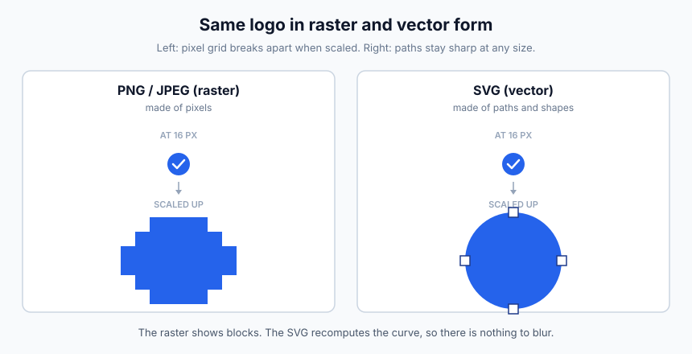
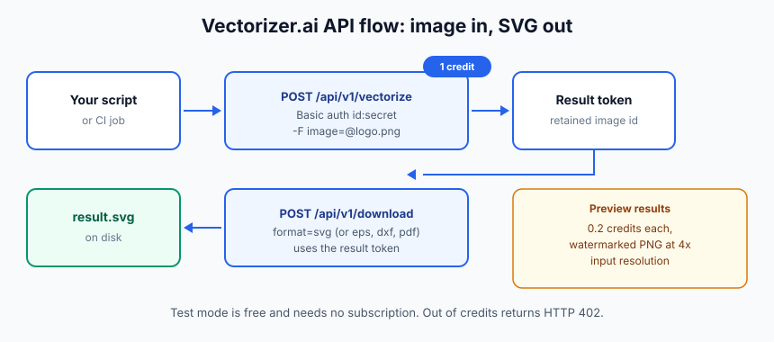
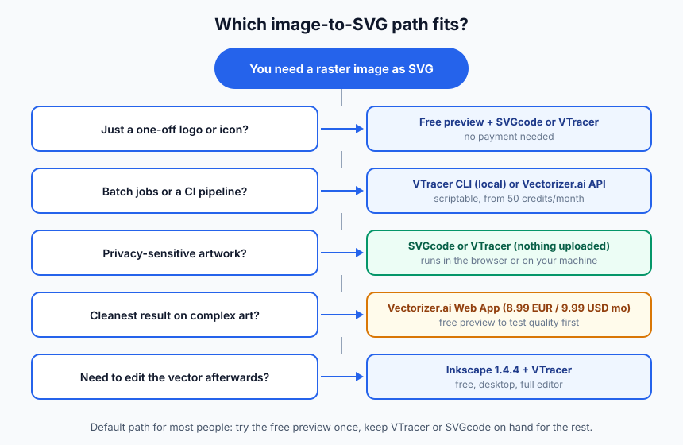

import Button from "@components/widgets/Button.astro";
import Notice from "@components/widgets/Notice.astro";
import ListCheck from "@components/widgets/ListCheck.astro";
import Accordion from "@components/widgets/Accordion.astro";
import Tabs from "@components/widgets/Tabs.astro";
import Tab from "@components/widgets/Tab.astro";
import YouTubeEmbed from "@components/widgets/YouTubeEmbed.astro";

Want to convert images to SVG free? Vectorizer.ai gives you a free interactive preview of any PNG, JPG, or WebP as a clean vector file. You only pay (€8.99/$9.99 a month) to download the result. This guide covers how the web app works in 2026, how to automate conversion with the API and CLI, and six genuinely free converters if you would rather not pay anything.

<Notice type="info" title="The short version">
  Free to upload, vectorize, and inspect the interactive preview. A subscription is required to download production results. In a hurry? Skip to the [free alternatives](#free-alternatives-to-vectorizerai) or the [API and CLI section](#automate-it-the-vectorizerai-api-and-cli).
</Notice>

## Why convert images to SVG?



Scalable Vector Graphics (SVG) is an XML-based format for 2D graphics on the web. Unlike raster formats (PNG, JPEG) that store a grid of pixels, SVG stores mathematical definitions of shapes and lines. That difference is what makes a png to svg conversion worth doing for logos and icons.

<ListCheck>
  <ul>
    <li>One file scales from 16px in a navbar to 1600px on a billboard. No resolution variants to maintain.</li>
    <li>For logos, icons, and illustrations, SVGs are usually smaller than equivalent PNGs. Smaller assets mean faster pages, which matters when you [build a fast blog with Astro and Cloudflare](/build-astro-blog-free/).</li>
    <li>Sharp on any display: standard, Retina, or 4K. No blur on high-DPI screens.</li>
    <li>Change colors, shapes, and animations with a text editor, CSS, or JavaScript. No image editor required.</li>
  </ul>
</ListCheck>

<Notice type="info" title="Wrong format for photos">
  SVG is the wrong choice for photographs. Vectorize logos, icons, line art, and diagrams. For photos, use WebP or AVIF instead.
</Notice>

## What is Vectorizer.ai?

[Vectorizer.ai](https://vectorizer.ai/) converts raster images into vector graphics using AI. It traces edges, detects shapes, and rebuilds them as clean vector paths with smooth curves and precise geometry.

The team has over 15 years of experience in vectorization. Their "Deep Vector Engine" combines deep learning with classical algorithms, and their proprietary "Vector Graph" framework handles automated edits like corner cleanup, curve fairing, and shape fitting.

Features:

- Full shape fitting recognizes circles, ellipses, rounded rectangles, and stars instead of flattening everything into generic Bezier curves
- Multiple curve types cover straight lines, circular arcs, elliptical arcs, and quadratic or cubic Bezier curves, whichever fits best
- Sub-pixel precision extracts features smaller than one pixel using anti-aliasing data
- Clean Corners reconstructs sharp corners that naive tracers round off
- Adaptive Simplification trims redundant points without losing detail, so file size stays sane
- Symmetry detection identifies and preserves mirror and rotational symmetries
- Palette control auto-detects color count, with manual adjustment available
- Pre-crop lets you trim to the area you care about first; only the cropped portion counts against the resolution limit

Supported inputs are PNG, JPG, GIF, BMP, and WebP, up to 3 megapixels and 30 MB. Supported outputs are SVG, EPS, DXF, PDF, and a "cleaned up" PNG.

One 2026 detail worth knowing: their FAQ now calls out AI-generated images as a popular input category and says the algorithm handles them well. If you [generate AI images locally on your Mac with Flux](/ai-images-mac/) and want the result as a flat vector logo, this is a reasonable pipeline: generate, clean up the background, vectorize.

## Vectorizer.ai pricing (2026)

Is Vectorizer.ai free? Free to try and preview, paid to download. That has been the model since the original version of this article, which described it as fully free.

| Plan | Price | What you get |
|------|-------|-------------|
| **Free preview** | $0 | Upload, vectorize, and inspect the interactive preview for as many images as you like. You cannot download production results. |
| **Web App** | €8.99 / $9.99 per month | Unlimited downloads of SVG, EPS, DXF, PDF. Full export options. Cancel anytime. |
| **API** | Credit-based (see below) | For automated workflows. Free to integrate and test; production downloads cost credits. |

The pricing page serves EUR by default (€8.99/month); there is a currency toggle for USD ($9.99/month). Which figure you see can depend on your region, so treat both as valid list prices.

### API credits

One credit equals one API image. Entry plan is 50 credits per month, and the per-image price drops as you buy volume:

| Credits / month | Price | Per image |
|-----------------|-------|-----------|
| 50 | €8.99 | €0.180 |
| 500 | €69.99 | €0.140 |
| 1,000 | €129 | €0.129 |
| 100,000 | €4,499 | €0.045 |

Unused credits roll over up to 5x your monthly allowance. There are also preview results: watermarked PNGs at 4x input resolution for 0.2 credits each, meant for showing a result to end users before charging for the real export.

<Notice type="warning" title="Two gotchas">
  1. The pricing page defaults to EUR. Use the currency toggle if you want USD.
  2. The Web App subscription has **no API access**. If you script conversions, you need an API credit plan even for one image per month. The two plans do not overlap.
</Notice>

<Notice type="info" title="Building a product on top?">
  The 0.2-credit watermarked preview exists so you can show users a result before buying the full export credit. Worth knowing if you are wrapping vectorization into your own app.
</Notice>

Payment and cancellation facts: cards and PayPal only, no purchase orders or invoices, no academic or non-profit discounts listed. You can cancel the Web App plan anytime. If you cancel an API plan, remaining credits are lost and fees are non-refundable, so use them before you cancel. Uploaded images and results are deleted after 24 hours anyway, so there is no data to export on the way out.

## How to convert an image to SVG with Vectorizer.ai

Prerequisites:

<ListCheck>
  <ul>
    <li>An image in PNG, JPG, GIF, BMP, or WebP format</li>
    <li>Image no larger than 3 megapixels and 30 MB</li>
    <li>A browser (no install needed)</li>
    <li>A Web App subscription only when you want to download the result</li>
  </ul>
</ListCheck>

The happy path:

1. Go to [vectorizer.ai](https://vectorizer.ai/)

<Button text="Open Vectorizer.ai free preview" link="https://vectorizer.ai/" variant="solid" color="blue" size="md" icon="arrow-right" />

2. Drag and drop your image onto the page (or use the file picker, or paste with Cmd+V / Ctrl+V)
3. Wait a few seconds for processing
4. Inspect the interactive preview. Zoom in to 400% or more and check corners and thin strokes
5. Adjust the palette if needed: change color count, merge colors, or edit individual swatches
6. Download as SVG, EPS, DXF, or PDF (subscription required)

Verify the result before you move on:

- Zoom the preview at 400%+ on corners and thin strokes. Jagged edges or swallowed detail means you should change the palette count or pre-crop tighter.
- Open the downloaded `.svg` in a browser (`file:///path/to/result.svg`). If it renders there, it is a real SVG and not a renamed raster.
- Check the palette count matches the original artwork. Off-by-one color counts are the most common quality complaint.

Tips:

- Crop to the area you want vectorized before uploading. Only the cropped portion counts against the 3 megapixel limit, and [a fast Mac screenshot tool like Shottr](/shottr-mac-screenshot-tool/) is handy for grabbing and cropping just the logo.
- Logos, icons, and line art produce the cleanest results. Complex photographs vectorize but usually need cleanup.
- If you plan to open the file in Illustrator, look for the compatibility option in the export settings before downloading. The API exposes compatibility-related output options, but the exact label in the web UI changes from version to version, so check the current export dialog.

You can see how Vectorizer.ai handles a complex logo in the video below:

<YouTubeEmbed
  url="https://www.youtube.com/embed/dbbEQssxC6A"
  label="How to convert an image to SVG with Vectorizer.ai (and free alternatives)"
/>

## Automate it: the Vectorizer.ai API and CLI

If you convert images in bulk or need vectorization inside a pipeline, the API is the part of Vectorizer.ai that matters. This is the biggest gap in older write-ups, so here is the operator version.

Prerequisites:

<ListCheck>
  <ul>
    <li>A Vectorizer.ai account with an API Id and API Secret (HTTP Basic auth)</li>
    <li>curl, or any HTTP client</li>
    <li>API credits for production runs (test mode needs none)</li>
  </ul>
</ListCheck>

The flow is simple: send an image in, get a result token, download the format you want. Test mode is free and does not require an API subscription, so you can validate an integration before paying anything.



<Tabs>
  <Tab name="curl">
    ```bash
    curl https://vectorizer.ai/api/v1/vectorize \
      -u xyz123:[secret] \
      -F image=@example.jpeg \
      -o result.svg
    ```

    That is the official quickstart verbatim: one request, Basic auth with your API Id and Secret, multipart `image` field. You can also send an image URL, base64 data, or a retained image token instead of a file.

    Other endpoints:

    ```bash
    # Download a specific format from a result token
    curl https://vectorizer.ai/api/v1/download \
      -u xyz123:[secret] \
      -d "image_token=TOKEN" -d "format=svg" -o result.svg

    # Check your account and credit balance
    curl https://vectorizer.ai/api/v1/account -u xyz123:[secret]

    # Delete a retained image early (otherwise it goes after 24h)
    curl https://vectorizer.ai/api/v1/delete \
      -u xyz123:[secret] -d "image_token=TOKEN"
    ```
  </Tab>
  <Tab name="CLI">
    There is a standalone CLI for Windows, macOS, and Linux, aimed at shell scripts, local folders of artwork, CI jobs, and QA checks. Latest release at the time of writing is v1.0.0 (2026-06-02) from [clv/vectorizer-ai-cli](https://github.com/clv/vectorizer-ai-cli).

    ```bash
    # Install from the GitHub releases page, then:
    vectorizer --help

    # Convert one file (uses VECTORIZER_API_ID and VECTORIZER_API_SECRET env vars)
    vectorizer input.jpeg -o result.svg
    ```

    Verify it works: run `vectorizer --help` first, then convert one file and open the output in a browser. If you get a 402 back, the CLI is fine and you are just out of credits.
  </Tab>
  <Tab name="SDKs">
    Official SDKs cover TypeScript/JavaScript, Java, C#/.NET, Go, PHP, and Ruby. A Python SDK is listed as prepared and pending on PyPI, so check before pinning a workflow to `pip install vectorizer-ai`.

    There is also an OpenAPI 3.0 spec if you would rather generate a client:

    ```bash
    curl -sL https://vectorizer.ai/api/openapi.json -o vectorizer-openapi.json
    ```

    All libraries use the same endpoints (`/api/v1/vectorize`, `/download`, `/delete`, `/account`) and the same Basic auth credentials.
  </Tab>
</Tabs>

Cost math: at the entry tier you pay €0.18 per image (50 credits for €8.99/month). At 5,000 credits that drops to €0.10, and at 100,000 credits it is €0.045 per image. For a one-off batch of 30 logos, 50 credits is the sane starting point. Upgrade the plan only when volume moves.

If you are generating the artwork programmatically as well, you can chain this with an image generation API like [Kie.ai](https://go.bitdoze.com/kie-ai): generate art in a pipeline, then vectorize it. For a full agent setup on that path, see how to [add an AI image agent to your pipeline with Mastra and Kie.ai](/mastra-image-agent-kie-ai/).

<Notice type="warning" title="Failure mode: HTTP 402">
  Running out of credits returns **402 Payment Required**. Nothing is wrong with your request. Check your balance with `/api/v1/account`, buy credits or opt into auto-renew on the account page, and retry. Rollover caps at 5x your monthly credits.
</Notice>

One ops note: if you batch-run the VTracer or Vectorizer CLIs against untrusted files, [run AI CLI tools safely in Docker or Podman](/docker-podman-ai-cli-tools-safe-environment/) first. Keeps a bad image file from becoming a bad day.

## Free alternatives to Vectorizer.ai

If you need a png to svg converter free of charge, options split into two groups: fully free (Inkscape, VTracer, SVGcode, Vectorizer.com) and free tiers with caveats (Recraft, Photopea). The first group is what I would rely on. Inkscape, VTracer, and SVGcode also run locally, so nothing gets uploaded if that matters.

### Recraft AI

[Recraft](https://www.recraft.ai/ai-image-vectorizer) runs a free AI-powered vectorizer in the browser. It accepts JPEG, JPG, PNG, and WebP up to 5 MB, and outputs SVG or Lottie. The converter page now funnels you into Recraft Studio, so you need an account to get the result. Recraft also has an API and integrations with Figma, Framer, Chrome, and Google Docs/Slides.

<Notice type="warning" title="Check before commercial use">
  Recraft's pricing FAQ states that images made on the Free plan are owned by Recraft, appear in a public community gallery, and are not licensed for commercial use. Whether that clause covers uploaded images run through the free vectorizer, or only AI-generated images, is worth checking in their current terms before you ship anything commercial. Paid plans grant full ownership and commercial rights.
</Notice>

Recraft fits if you are already in an AI-assisted design workflow. If you want to see where this is heading more broadly, read about [the AI skills worth learning for web design](/best-ai-skills-for-web-design/).

### Inkscape

[Inkscape](https://inkscape.org/) is free, open-source, and still actively developed. Current stable is 1.4.4 (May 2026). Trace Bitmap handles multiple tracing modes (brightness cutoff, edge detection, color quantization) and outputs editable SVG natively. It works offline. The interface is dated and there is a learning curve, but it is the most capable free desktop option.

### Vectorizer.com

[Vectorizer.com](https://vectorizer.com/) is a completely free online tool with no registration required. Upload up to 20 files at once and get instant SVG results. Quality is decent for simple images but will not match AI-powered tools on complex artwork. Their site advertises short data retention, but check their current policy before uploading anything sensitive.

### Photopea

[Photopea](https://www.photopea.com/) is a free, browser-based image editor that behaves like Photoshop. The vectorization feature is **Image → Vectorize Bitmap**. It gives you two controls (Number of colors, Noise reduction), replaces the raster layer with vector layers, and exports SVG or PDF. Ad-supported, no account required.

To verify it works: open Photopea, drop in a PNG, check the Image menu for Vectorize Bitmap, and confirm the layer type changes to vector after tracing.

### VTracer

[VTracer](https://github.com/visioncortex/vtracer) is the operator's free choice. MIT-licensed, written in Rust, roughly 7k GitHub stars, actively maintained. It ships as a CLI, a desktop GUI, and a Python library (`pip install vtracer`). Everything runs locally, so it batch-scripts well and costs nothing.

<Button text="Get VTracer on GitHub" link="https://github.com/visioncortex/vtracer" variant="outline" color="gray" size="sm" />

```bash
# Quick check once installed
vtracer --help

# Convert one file
vtracer --input logo.png --output logo.svg
```

Quality is below Vectorizer.ai on complex art but solid on logos and line art. For bulk conversions with no subscription, start here.

### SVGcode

[SVGcode](https://svgco.de) is a free installable PWA that converts JPG, PNG, GIF, WebP, and AVIF to SVG entirely client-side via WebAssembly. Images never leave your machine, it works offline, and it uses the File System Access API so you can save straight to disk. If privacy is the constraint, this is the tool.

## Vectorizer.ai vs free alternatives

| Tool | Price | Truly free? | AI-powered | Local or cloud | Best for |
|------|-------|-------------|-----------|----------------|----------|
| Vectorizer.ai | €8.99/$9.99 per month (free preview) | Preview only | Yes | Cloud | Highest-quality vectorization |
| Recraft | Free tier | Free tier with caveats | Yes | Cloud | AI vectorizing in the browser |
| Inkscape | Free | Yes | No | Local | Offline editing + tracing |
| Vectorizer.com | Free | Yes | No | Cloud | Quick, no-signup conversions |
| Photopea | Free (ads) | Yes | No | Cloud | Browser editing + vectorizing |
| VTracer | Free | Yes | No | Local | Batch jobs, CLI, scripts |
| SVGcode | Free | Yes | No | Local (browser) | Privacy-sensitive artwork |

"Free" and "free tier" are not the same thing. Recraft's free tier comes with the ownership caveats above. Everything else in the table is genuinely free to use and keep. Also remember: the Vectorizer.ai Web App plan has no API access, so any scripting means the API credit plans.

<Notice type="info" title="Privacy-sensitive artwork">
  Use SVGcode or VTracer. Nothing gets uploaded to anyone's server.
</Notice>



## Limitations to know

- The web app caps resolution at 3 megapixels. Large photos need to be cropped or downscaled first.
- There is no background removal. Remove or make the background transparent before uploading.
- Data retention is 24 hours. Uploaded images and results are deleted after 24 hours.
- Training ML models on the output is not allowed. Their terms prohibit using output to train machine learning models.
- Downloading requires a subscription. The free preview is inspection-only; you pay to export.

<Notice type="info" title="Privacy and terms">
  The 24-hour deletion window is a privacy plus, but it also means there is no long-term storage of your work on their side. And the ML-training restriction is a ToS constraint, not a technical one, so read it before building anything around the output.
</Notice>

One positive counterpoint: per the vendor FAQ, AI-generated images vectorize well. Photographs work too, they just need more cleanup than logos and line art.

## FAQ

<Accordion label="Is Vectorizer.ai free?" group="faq" expanded="true">
  Free to upload, vectorize, and preview interactively. Downloading production results requires a subscription: €8.99/$9.99 per month for the Web App, or credit-based API plans starting at €8.99 for 50 credits. If you need fully free, use VTracer, SVGcode, or Inkscape.
</Accordion>

<Accordion label="What happens to my uploaded images?" group="faq">
  Uploaded images and results are retained for 24 hours and then permanently deleted. There is no long-term storage to export or clean up. If 24 hours is still too long for your data, run SVGcode or VTracer locally instead.
</Accordion>

<Accordion label="Can I use the output commercially or train ML models on it?" group="faq">
  Commercial use of your own converted artwork is fine under the Web App and API terms. Training machine learning models on the output is explicitly prohibited by their ToS. If you need a license for model training, look elsewhere.
</Accordion>

<Accordion label="Does it work on photos and AI-generated art?" group="faq">
  Yes to both, with caveats. Photos vectorize but need cleanup. AI-generated images are called out in their FAQ as a category the algorithm handles well. Logos, icons, and line art give the cleanest results with the least manual fixing.
</Accordion>

<Accordion label="Which free tool is best for a one-off logo?" group="faq">
  Use the Vectorizer.ai free preview to see what a good result looks like, then convert it with VTracer or SVGcode. Neither costs anything, both run without an account, and for a simple logo the quality difference is small. Only pay if the free output is not clean enough.
</Accordion>

## When Vectorizer.ai is worth paying for

<ListCheck>
  <ul>
    <li>For one-off logos or icons, use the free preview to check quality, then convert for free with VTracer or SVGcode. No payment needed.</li>
    <li>For regular design work, the €8.99/$9.99 per month Web App is easy to justify. AI tracing is cleaner than classical tracers, shape detection saves cleanup time, and unlimited downloads mean no per-image math.</li>
    <li>For pipelines and CI, use the API or CLI. Start at the 50-credit tier (€8.99/month) and upgrade only when volume moves the per-image cost down to where it matters.</li>
  </ul>
</ListCheck>

The build-vs-buy math is straightforward: €0.18 per image at the entry tier, down to €0.045 at 100k credits. For the occasional conversion, free tools already cover you. For paid work with visuals, pair it with [a free mockup generator like Shots.so](/shots-so-mockups/) when you need to present the result.

<Button text="Try the free preview" link="https://vectorizer.ai/" variant="solid" color="blue" size="md" icon="arrow-right" />
