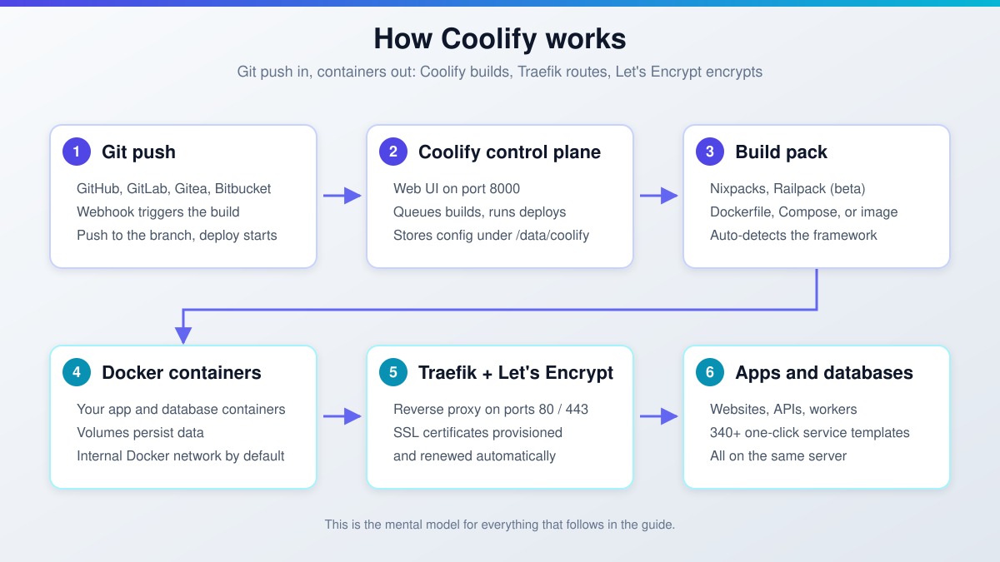
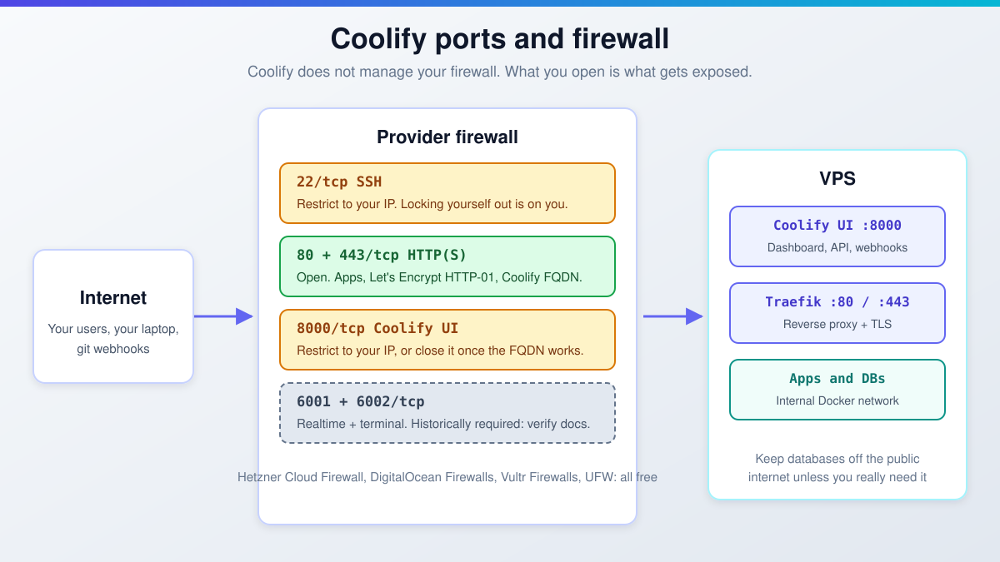

import Button from "@components/widgets/Button.astro";
import Notice from "@components/widgets/Notice.astro";
import ListCheck from "@components/widgets/ListCheck.astro";
import Accordion from "@components/widgets/Accordion.astro";
import Tabs from "@components/widgets/Tabs.astro";
import Tab from "@components/widgets/Tab.astro";
import YouTubeEmbed from "@components/widgets/YouTubeEmbed.astro";
import { Picture } from "astro:assets";
import img1 from "../../assets/images/23/02/admin_url_coolify.jpeg";
import img2 from "../../assets/images/23/02/github-coolify.jpeg";
import img3 from "../../assets/images/23/02/astro-Coolify1.jpeg";
import img4 from "../../assets/images/23/02/astro-deploy-coolify.jpeg";
import img5 from "../../assets/images/23/02/Coolify_astro_build.jpeg";

If you want a free, self-hosted Heroku alternative, the Coolify install takes one command. This guide walks through installing Coolify on a VPS, securing it, and deploying apps, databases, and 340+ one-click services with automatic SSL and Git-push deploys, just like Netlify or Heroku.

Coolify is open-source (Apache-2.0, 62,000+ GitHub stars) and has been in active development since 2021. The first stable v4.0.0 shipped in April 2026 after a long beta. Releases land multiple times a week: v4.3.23 (2026-09-18) is the latest stable as of this update. v5, focused on multi-server scalability, is in development while v4 stays fully supported.

> **Already familiar with Coolify and want a deeper comparison?** See [Coolify vs Dokploy vs Kamal 2](/coolify-vs-dokploy-vs-kamal-2/).

Everything below follows the official docs as of September 2026. The screenshots and the video predate the v4.3 UI redesign from August 2026. Labels moved around, the flow did not.

## What Coolify can deploy: apps, databases, and 340+ one-click services

**Applications.** Coolify builds with Nixpacks, Railpack (beta), a Dockerfile, Docker Compose, or a prebuilt Docker image. Framework auto-detect covers:

<ListCheck>
<ul>
<li>Static sites (Astro, Hugo, Jekyll, plain HTML)</li>
<li>Node.js (Next.js, Nuxt, Express, NestJS)</li>
<li>Vue, React, Svelte/SvelteKit</li>
<li>PHP, Laravel, Symfony</li>
<li>Python (Django, Flask, FastAPI)</li>
<li>Ruby on Rails, Phoenix (Elixir)</li>
<li>Rust, Go, Deno</li>
<li>Any Dockerfile or Docker Compose project</li>
</ul>
</ListCheck>

**Databases.** The picker currently includes PostgreSQL, MySQL, MariaDB, MongoDB, Redis, Valkey, KeyDB, Dragonfly, CouchDB, ClickHouse, and Databasus. The list is not exhaustive and grows with releases.

**One-click services.** The [community templates repo](https://github.com/coollabsio/coolify-community-templates) now powers 340+ services: WordPress, Ghost, n8n, Plausible Analytics, Uptime Kuma, MinIO, Vaultwarden, Appwrite, Supabase, Directus, NocoDB, Meilisearch, Umami, Hasura, Beszel, Langfuse, plus newer entries like InfluxDB, Stalwart, and Termix. If n8n is the one you want, here is how to [self-host n8n with Docker and Traefik](/n8n-self-host-workflow-automation/).

**Git sources.** Coolify deploys from GitHub, GitLab, Gitea, and Bitbucket. Since v4.3.0 it also pulls from private repos on self-hosted GitLab. Push to your branch and Coolify rebuilds, same as Netlify or Heroku.

**Architectures and operating systems.** AMD64 and ARM64. Debian-based (Ubuntu LTS 20.04, 22.04, 24.04, Debian), Red Hat-based (CentOS, Fedora, AlmaLinux, Rocky Linux, plus TencentOS and Asahi), SUSE (SLES, openSUSE), Arch Linux, Alpine Linux, and Raspberry Pi OS 64-bit.

All of this runs on the same VPS. There is no per-app or per-dyno billing.



## New in Coolify v4.2 and v4.3 (2026)

If you last looked at Coolify in early 2026, two releases changed the day-to-day experience. v4.2.0 (2026-07-21) and v4.3.0 (2026-08-12) shipped the features below, plus breaking changes worth reading before you upgrade.

- v4.3.0 brought a full UI redesign: new navigation, a real domain manager with DNS checks, and automatic Cloudflare DNS setup.
- Scheduled volume backups now send persistent storage to a local path or S3, with retention policies, history, and an API. For an off-site target, compare the [cheapest S3-compatible backup storage](/bunny-storage-vs-s3-vs-backblaze/).
- v4.2.0 added cloud-server provisioning: create Hetzner (with firewall, network, and backup options), Vultr, or DigitalOcean servers straight from the dashboard.
- An instance-level [MCP (Model Context Protocol)](/mcp-introduction-beginners/) endpoint lets AI agents inspect Coolify. Read-only tools landed in v4.1.0, v4.3.0 added diagnostics and deployment controls, with a per-team toggle.
- Per-domain search-engine indexing controls keep preview deployments out of Google.
- New one-click services include Buzz, Celld, InfluxDB, Stalwart, and Termix.

<Notice type="warning" title="Breaking changes if you upgrade from v4.1.x or older">
<ul>
<li>Team <strong>Member role is now read-only</strong>. Promote anyone who needs write access before you upgrade.</li>
<li><strong>State-changing API endpoints require POST.</strong> Legacy GET requests return 405, including <code>/deploy</code>, <code>/enable</code>, <code>/disable</code>, and start/restart/stop endpoints. CI scripts and webhooks must change.</li>
<li><strong>Compose proxy router names changed</strong> for service names with dots or hyphens (#11040). Update custom Traefik references.</li>
</ul>
</Notice>

<Notice type="info" title="OIDC/SSO is not production-ready yet">
First-class single sign-on (discovery, JWKS, PKCE) exists only in the v4.4 release candidate (v4.4-rc.1, 2026-08-19). Do not run it in production.
</Notice>

## Coolify VPS requirements

<ListCheck>
<ul>
<li>2 CPU cores</li>
<li>2 GB RAM</li>
<li>10 GB disk (Coolify install floor, not room for your apps)</li>
<li>amd64 or arm64</li>
<li>Root access for the automated install script</li>
<li>A DNS record you control, for the dashboard and app domains</li>
</ul>
</ListCheck>

Those minimums come from the official docs as of September 2026. The disk floor used to be listed as 30 GB; 10 GB is what the docs say now, but Docker images and build caches eat disk fast. Budget for 30 GB+ of real storage on anything you care about.

The docs' budget note: Coolify will technically run on 1 core, 512 MB RAM, and a 4 GB disk, but that is not recommended. Their guidance is to start with 1 core / 1 GB RAM and upgrade as workloads grow.

For a real-world anchor, the docs reference a [Hetzner](https://go.bitdoze.com/hetzner) CAX11 (4 GB ARM, 40 GB disk) comfortably hosting 16 static sites, 9 Rust APIs, 5 full-stack apps, 4 Discord bots, 7 workers, 2 Valkey, 2 PostgreSQL, Umami, Beszel, and Coolify itself, averaging 3.2 GB RAM and 32 GB disk used. That tracks with what I'd expect: disk is the real constraint, not CPU. Provider details are in [our Hetzner Cloud review](/hetzner-cloud-review/), and raw numbers in the [DigitalOcean vs Vultr vs Hetzner VPS benchmarks](/digitalocean-vs-vultr-vs-hetzner/).

The Coolify control plane is free (Apache-2.0). You pay only for the VPS, roughly $5-15/month order of magnitude. VPS prices jumped across the board in 2026, so if you're rethinking a rented box, see [what changed and when a mini PC wins](/vps-price-increases/). Running it at home on [a compact mini PC like the ASUS DC510](https://go.bitdoze.com/asus-dc510) also works; Coolify does not care where the server lives. If you stay on Hetzner, [Hetzner's cost-optimized plans after the 2026 price increase](/hetzner-cloud-cost-optimized-plans/) are still the default pick.

<Notice type="warning" title="Disk is what breaks builds first">
If builds start failing with "no space left on device", the 10 GB floor covers Coolify alone. Apps, images, and databases need more.
</Notice>

## How to install Coolify on a VPS

Any VPS provider works. [Hetzner](https://go.bitdoze.com/hetzner) offers the best price-to-performance for self-hosting in my experience. Other options: [DigitalOcean](https://go.bitdoze.com/do), [Vultr](https://go.bitdoze.com/vultr), [Hostinger](https://go.bitdoze.com/hostinger-vps).

<Button link="https://go.bitdoze.com/do" text="DigitalOcean $100 Free" />
<Button link="https://go.bitdoze.com/vultr" text="Vultr $100 Free" />
<Button link="https://go.bitdoze.com/hetzner" text="Hetzner €20 Free" />
<Button link="https://go.bitdoze.com/hostinger-vps" text="Hostinger VPS" />

<YouTubeEmbed
  url="https://www.youtube.com/embed/dY-hUI3fHEM"
  label="Coolify Install A Free Heroku and Netlify Self-Hosted Alternative"
/>

<Notice type="info" title="Screenshots and video show the pre-v4.3 UI">
The video and screenshots below predate the v4.3.0 (August 2026) UI redesign. Navigation and dialogs look different now, the flow is the same.
</Notice>

### Step 1: run the Coolify install script

SSH to your VPS as root and run the official one-liner:

```bash
curl -fsSL https://cdn.coollabs.io/coolify/install.sh | bash
```

Not root? Prefix the pipeline with `sudo`. The script handles everything: dependencies (curl, wget, git, jq, openssl), Docker Engine 24+, directories under `/data/coolify`, SSH key generation, and starting Coolify. Re-running it is safe.

**Note for Ubuntu users:** the automated script works with Ubuntu LTS versions only (20.04, 22.04, 24.04). On a non-LTS release like 24.10, use the [manual installation method](https://coolify.io/docs/get-started/installation).

<Notice type="warning" title="Docker via Snap is not supported">
If your server has Docker installed via Snap, remove it first and let the Coolify script install Docker Engine.
</Notice>

<Notice type="success" title="Back up /data/coolify/source/.env now">
It contains <code>APP_KEY</code>, and you need it to restore Coolify from a backup. Copy it off the box into your password manager or an encrypted note before you move on:
<code>cp /data/coolify/source/.env ~/coolify-env-backup.txt</code>
</Notice>

**Verify:** `curl -I http://localhost:8000` on the server returns HTTP 200 or 302. `docker ps` shows the Coolify containers. The URL printed by the script opens in a browser.

**What broken looks like:** port 8000 already in use (stop or move the other service); Snap Docker present (remove it, re-run); non-LTS Ubuntu (use the manual install); script dies mid-way (safe to re-run; check ownership and permissions under `/data/coolify`).

### Step 2: create the admin account (or pre-create it securely)

<Tabs>
<Tab name="Secure (recommended)">
Pre-create the admin at install time so the public registration page never exists. Same install command, wrapped with the account env vars:

```bash
env ROOT_USERNAME=dragos \
    ROOT_USER_EMAIL=me@example.com \
    ROOT_USER_PASSWORD='UseALongPassword123!' \
    bash -c 'curl -fsSL https://cdn.coollabs.io/coolify/install.sh | bash'
```

Not root? Prefix with `sudo -E env ...` so the variables survive the privilege change.

Password policy: at least 8 characters with upper, lower, number, and symbol.
</Tab>
<Tab name="Manual registration">
After the install finishes, the script prints your Coolify URL:

```
http://your-server-ip:8000
```

Visit it and register the first admin account immediately.

<Notice type="warning" title="The registration page is public until an account exists">
If someone else finds it first, they get control of your server. If that already happened, treat the instance as compromised: wipe the box and reinstall.
</Notice>
</Tab>
</Tabs>

**Verify:** you are logged into the dashboard at `:8000`. If you used the env-var method, open `http://your-server-ip:8000` in a private browser window: no registration form should be reachable.

**What broken looks like:** password rejected (it must hit the 8+ character, 4-class policy); env vars ignored (they must be in the same `env ... bash -c '...'` invocation; use `sudo -E` when not root).

### Step 3: point a domain to the server

For production, run Coolify over HTTPS on a real domain. Add an A record for `coolify.yourdomain.com` (or similar) pointing at your server IP. Since v4.3, the domain manager can also set up Cloudflare DNS records automatically.

**Verify:** `dig +short coolify.yourdomain.com` returns the server IP before you continue. Let's Encrypt issuance fails on a wrong or missing record.

**What broken looks like:** DNS not propagated yet. Wait it out, or lower the TTL before you change records. `dig` still showing the old IP is your answer.

### Step 4: set the FQDN for free Let's Encrypt SSL

Go to **Settings > Coolify Settings** and set the **URL (FQDN)** field to your domain. Coolify provisions a Let's Encrypt certificate automatically.

<Picture formats={["webp"]} fallbackFormat="webp"
  src={img1}
  alt="Pre-v4.3 Coolify dashboard showing the admin URL (FQDN) settings"
/>

**Verify:** `curl -I https://coolify.yourdomain.com` returns 200 and the browser shows a padlock.

**What broken looks like:** issuance fails on a FQDN typo (check Traefik's logs from the dashboard); ports 80/443 blocked at the provider firewall; Let's Encrypt rate limits after too many retries. Fix the cause before retrying, do not hammer it.

### Step 5: connect a Git source

Go to **Create New Resource** and pick your Git source: GitHub, GitLab, Gitea, or Bitbucket. For GitHub, Coolify walks you through installing its GitHub App on your repositories. The video above covers this in detail. Since v4.3.0, private repos on self-hosted GitLab work too.

<Picture formats={["webp"]} fallbackFormat="webp"
  src={img2}
  alt="Pre-v4.3 Coolify app creation screen with GitHub selected as the source"
/>

**Verify:** the repo list populates after connecting, and a webhook appears in the repo's webhook settings on GitHub.

**What broken looks like:** the GitHub App landed on the wrong account or org (re-run the install flow from Coolify's Git sources page); self-hosted GitLab needs a reachable instance plus app credentials.

### Step 6: deploy your first application

Here is a walkthrough deploying a static Astro site. The flow is the same for any framework.

**Create the application.** Go to **Create New Resource > Application**, select GitHub, choose your repository and branch, then save. Coolify auto-detects the framework:

<Picture formats={["webp"]} fallbackFormat="webp"
  src={img3}
  alt="Pre-v4.3 Coolify dashboard auto-detecting the Astro framework"
/>

**Pick a build pack.** Nixpacks is the default. Railpack is available in beta, and you can always bring a Dockerfile, Compose file, or prebuilt image. For static frameworks, if the deployed site looks empty, check the publish directory in the build pack settings.

**Point the domain.** Add an A record for the app's domain or subdomain pointing to the server IP, then set the URL in the application settings. Coolify configures Traefik and SSL automatically:

<Picture formats={["webp"]} fallbackFormat="webp"
  src={img4}
  alt="Pre-v4.3 Coolify application settings with the custom domain field filled in"
/>

**Deploy.** Hit save, then hit deploy. The first build is slow (Coolify pulls base images and installs dependencies). Later builds are faster thanks to Docker layer caching.

<Picture formats={["webp"]} fallbackFormat="webp"
  src={img5}
  alt="Pre-v4.3 Coolify deployment build logs"
/>

**Enable automatic deployments.** Push a commit to your connected branch and Coolify rebuilds automatically. It is on by default under **Features > Enable Automatic Deployment**, same as Netlify or Vercel deploy hooks.

**Verify:** the build log reaches "Build succeeded"; `curl -I https://app.yourdomain.com` returns 200; push a trivial commit and watch the auto-deploy fire.

**What broken looks like:** build OOM on a 2 GB box (add swap or upgrade RAM, back to the requirements section); wrong publish directory for static frameworks; domain not resolving so Let's Encrypt fails; auto-deploy not firing (check the webhook delivery log in GitHub and the automatic deployment toggle).

### Step 7: deploy a database

From **Create New Resource**, pick a database type and deploy it. Coolify handles the Docker setup and volume persistence. Scheduled backups are first-class now: point them at a local path or S3-compatible storage with a retention policy, then check the backup history after the first run.

<Notice type="warning" title="Do not expose databases publicly without a firewall rule">
Keep databases on the internal Docker network unless an outside service genuinely needs direct access. If you must expose one, firewall it to specific IPs and use a strong password.
</Notice>

**Verify:** the connection string works from your app container (`psql`, `mysql`, or `docker exec` into the DB container). A test backup completes and shows up in the backup history.

**What broken looks like:** the app cannot reach the DB because it uses `localhost` instead of Coolify's internal network hostname; disk fills from unbounded growth; S3 backups return 403 on bad keys or the wrong bucket region.

### Troubleshooting common install problems

<Accordion label="Port 8000 is already in use" group="troubleshooting">
Another service is bound to the Coolify dashboard port. Find it with `ss -tlnp | grep 8000`, stop it or move it, then re-run the install script. The script is safe to re-run.
</Accordion>

<Accordion label="The install script fails on Ubuntu" group="troubleshooting">
Two usual causes: non-LTS release (24.10 and friends need the manual install) or Docker installed via Snap (remove the Snap package first). Both are documented warnings, not bugs.
</Accordion>

<Accordion label="The registration page was already claimed" group="troubleshooting">
Someone registered the first admin before you did. Assume the box is compromised: snapshot it for forensics if you care, then wipe and reinstall using the pre-created admin method in Step 2 so the registration page is never exposed.
</Accordion>

<Accordion label="Builds fail with OOM or 'no space left on device'" group="troubleshooting">
OOM: add swap or upgrade RAM (2 GB is the floor for Coolify itself, not for builds plus apps). No space: the 10 GB disk minimum covers the install only. Prune old Docker images with `docker image prune -a` and give the box real disk headroom.
</Accordion>

<Accordion label="Let's Encrypt certificate fails" group="troubleshooting">
Check `dig +short your.domain` resolves to the server IP, ports 80/443 are open at the provider firewall, and the FQDN in Coolify has no typo. Check Traefik's logs in the dashboard. Stop retrying blindly: Let's Encrypt rate limits will lock you out for a while.
</Accordion>

<Accordion label="An update is blocked or fails" group="troubleshooting">
Updates can conflict with running deploys. Check active deployments first, then re-run. The dated log at `/data/coolify/source/upgrade-YYYY-MM-DD-HH-MM-SS.log` has the details. If the dashboard auto-update toggle and the `AUTOUPDATE` env var disagree, the env var wins.
</Accordion>

## Securing your Coolify instance

Installing is the easy part. Coolify's own security model puts SSH access, firewall rules, and provider network controls on you. The controls below are what turn a fresh install into something I would put a real domain on.

**Pre-create the admin account** (Step 2). The public registration race is the fastest way to lose a box.

**Firewall the box.** At your provider (Hetzner Cloud Firewall, DigitalOcean Firewalls, Vultr Firewalls) or with UFW:

- SSH on 22/tcp: restrict to your IP.
- HTTP and HTTPS on 80 and 443: open. Apps, Let's Encrypt HTTP-01, and your Coolify FQDN need them.
- The Coolify UI on 8000/tcp: restrict to your IP, or close it entirely once the FQDN works over 443.
- Realtime websocket and instant terminal on 6001/6002/tcp: historically required. Check the current Coolify docs before you punch these through; I have not found an explicit current port list to quote.



**Patch on a schedule.** Between June 25 and July 2, 2026, Coolify published a cluster of security advisories: one critical, six high, three low. The worst of them: a cross-team IDOR that let one team deploy to another team's servers, unauthenticated deploy triggers via a webhook HMAC bypass, authenticated RCE to host root, and OS command injection through volume names and database fields. All of it is fixed in current v4.3.x. The fix is "update to latest", not a config change. Full list on the [GitHub security advisories page](https://github.com/coollabsio/coolify/security-advisories).

<Notice type="error" title="Run a current v4.3.x release">
An unpatched Coolify on a public IP is a remote-control panel for your server. Enable auto-update (next section) or put a weekly update slot in your calendar.
</Notice>

**Turn on notifications.** Configure SMTP or the Resend integration (instance SMTP/Resend settings arrived in v4.3.10) so failed deploys and backup errors reach you instead of rotting in a log.

**Back up `/data/coolify/source/.env`** (Step 1). Without `APP_KEY`, you cannot restore Coolify from its own backups.

<ListCheck>
<ul>
<li>Admin account pre-created at install time</li>
<li><code>/data/coolify/source/.env</code> copied off the server</li>
<li>Provider firewall in place, port 8000 restricted</li>
<li>Auto-update enabled, or a weekly update slot</li>
<li>SMTP or notifications configured</li>
<li>First scheduled backup completed and verified</li>
<li>Databases on the internal network, not the public internet</li>
</ul>
</ListCheck>

Provider firewalls and CrowdSec are free. Patching is yours. For host-level hardening beyond Coolify, see [how to secure a VPS server with CrowdSec](/crowdsec-secure-server/) and [how I locked down my Docker server after the BSI Hetzner report](/bsi-security-report-docker-ufw/).

## Keeping Coolify updated

Updates live under **Settings > Configuration > Updates**. Update-check frequency defaults to hourly (cron-configurable). The **Auto Update** toggle defaults to daily at 00:00, also cron-configurable. If `AUTOUPDATE` is set in `/data/coolify/source/.env`, it overrides the dashboard toggle, so keep one source of truth.

Each update writes a log to `/data/coolify/source/upgrade-YYYY-MM-DD-HH-MM-SS.log`. There is a terminal update method as well, and v4.3.10 added manual upgrade controls on the same page.

<Notice type="info" title="Control plane vs your apps">
Updating Coolify updates the self-hosted control plane. It does not update the applications, databases, services, or servers you manage. Your app images still need their own update path.
</Notice>

Before jumping from v4.1.x or older to current, re-read the breaking changes in the v4.2/v4.3 section above. Team roles and GET-based API or webhook scripts will bite you.

**Verify:** after an update, the version in Settings matches the [release page](https://github.com/coollabsio/coolify/releases), and `ls /data/coolify/source/upgrade-*.log` shows a fresh log with no errors.

**What broken looks like:** an update started while a deploy is running (check active deployments first); a failed update (read the dated log, it is not subtle); the dashboard toggle and `AUTOUPDATE` disagreeing (the env var wins).

## Coolify Cloud pricing

Don't want to run the control plane yourself? Coolify Cloud is the managed version: same UI and features, Coolify handles the infrastructure. Pricing as of 2026-09-28: **$5/month base for 2 servers, plus $3/month per additional server**, roughly 20% off on annual billing.

You still bring your own servers (Hetzner, DigitalOcean, AWS, a Raspberry Pi, a laptop at home). Cloud is the management plane, not the compute. You get unlimited deployments per server, managed email alerts, and the dashboard on `app.coolify.io` or your own domain. See [coolify.io/cloud](https://coolify.io/cloud).

<Notice type="info" title="Pricing verified 2026-09-28">
No trial or discount claims beyond what is written here. Check the pricing page before you buy.
</Notice>

Cost math: self-hosted is a $5-10/month VPS plus your time. Cloud is $5/month plus $3 per extra server, on top of the VPS bill. Worth it when your time is the expensive part.

## More Coolify tutorials

<ListCheck>
<ul>
<li><a href="/deploy-uptime-kuma/">Install Uptime Kuma with Coolify</a></li>
<li><a href="/install-plausible-analytics/">Install Plausible Analytics with Coolify</a></li>
<li><a href="/coolify-vs-dokploy-vs-kamal-2/">Coolify vs Dokploy vs Kamal 2</a></li>
<li><a href="/coolify-v5-self-hosted-paas-review/">Coolify v5 review: the self-hosted PaaS that replaces Heroku and Vercel</a></li>
</ul>
</ListCheck>

## Coolify install FAQ

<Accordion label="Does Coolify run on Windows?" group="faq" expanded="true">
No. The install script targets Linux on amd64 and arm64. WSL experiments are unsupported. Run a Linux VPS, it is cheaper than the debugging time.
</Accordion>

<Accordion label="Can I install Coolify on non-LTS Ubuntu?" group="faq">
Not with the automated script. It supports Ubuntu LTS (20.04, 22.04, 24.04) only. On a non-LTS release like 24.10, use the manual installation method from the official docs.
</Accordion>

<Accordion label="Can I use my existing Docker install?" group="faq">
Yes, via the manual install. Snap-packaged Docker is not supported: remove it and install Docker Engine directly, whether through the script or by hand.
</Accordion>

<Accordion label="What port is Coolify on?" group="faq">
The dashboard and API sit on port 8000. Apps go through Traefik on 80 and 443. The realtime websocket and instant terminal have historically used 6001 and 6002; verify against the current docs before opening those.
</Accordion>

<Accordion label="Does Coolify update my applications?" group="faq">
No. Updates cover the control plane only. Your application and database images are on their own update path.
</Accordion>

<Accordion label="Is Coolify really free?" group="faq">
Yes. Apache-2.0 licensed, no per-app billing. You pay for the VPS or use hardware you already own. Coolify Cloud is the optional paid management plane. If you want to compare other control panels first, see the [best self-hosted server panels](/best-self-hosted-panels/).
</Accordion>

## Conclusion: is Coolify worth self-hosting?

Yes, if you want Heroku or Netlify ergonomics without per-app billing. The Coolify install is one command. You get Git-push deploys, automatic SSL, real databases with scheduled backups, and 340+ one-click services on a box that costs $5-15/month instead of $7-25+ per dyno.

The counterweight: you own patching, backups, and uptime. The June/July 2026 advisory cluster is exactly why the Security and Updates sections above are not optional reading. That is the price of admission for self-hosting anything.

v4.3.x is current and ships releases multiple times a week. v5, aimed at multi-server scalability, is in development while v4 stays supported, so there is no dead end. You get the full deployment lifecycle on one box: Git integration, automatic builds, SSL, reverse proxy, databases, backups, preview deployments.

If you are paying for Heroku, Vercel, or Netlify and want to cut costs without losing convenience, Coolify on a $5-10/month VPS does the job.

<Button link="https://go.bitdoze.com/do" text="DigitalOcean $100 Free" />
<Button link="https://go.bitdoze.com/vultr" text="Vultr $100 Free" />
<Button link="https://go.bitdoze.com/hetzner" text="Hetzner €20 Free" />
<Button link="https://go.bitdoze.com/hostinger-vps" text="Hostinger VPS" />

For managing your server with a reverse proxy panel alongside Coolify, check out:

<Button
  link="https://webdoze.net/courses/cloudpanel-setup/"
  text="CloudPanel Setup Course"
/>
