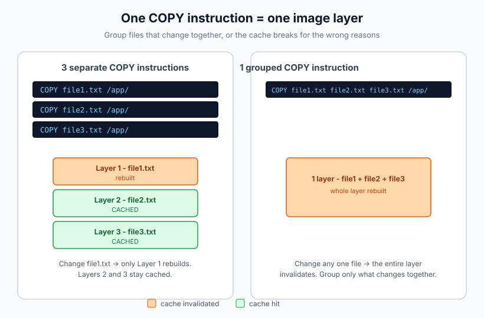
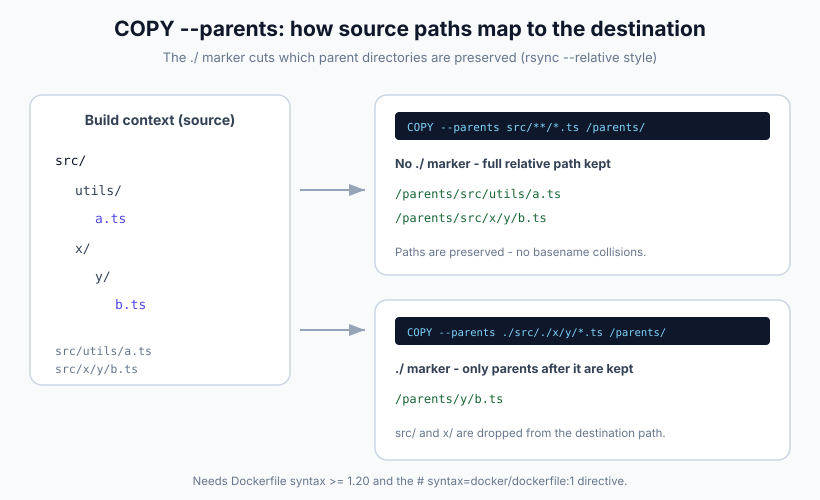

import Button from "@components/widgets/Button.astro";
import Notice from "@components/widgets/Notice.astro";
import ListCheck from "@components/widgets/ListCheck.astro";
import Accordion from "@components/widgets/Accordion.astro";
import Tabs from "@components/widgets/Tabs.astro";
import Tab from "@components/widgets/Tab.astro";

When you build Docker images, you often need to copy multiple files at once. Docker `COPY` lets you list several sources in one instruction, and that instruction creates one filesystem layer for all of them:

```dockerfile
COPY file1.txt file2.txt /app/files/
```

That copies both `file1.txt` and `file2.txt` from the build context into `/app/files/` in the image. One instruction, one layer. Grouping files that change together keeps the build cache from breaking for unrelated reasons, and it keeps the Dockerfile shorter.

The flag surface has grown since this article first went up: `COPY --parents` and `COPY --exclude` are stable now (Dockerfile syntax 1.20 and 1.19), and recursive `**` globs are officially documented. This guide covers the multi-source syntax, the wildcard rules, and the BuildKit flags worth using, plus how to verify your layers look the way you think they do.

Some other Docker articles you might find useful:

- [Add Users to a Docker Container](https://www.bitdoze.com/add-users-to-docker-container/)
- [Install Docker & Docker Compose on Ubuntu ARM](https://www.bitdoze.com/install-docker-ubuntu-arm/)
- [Redirect Docker Logs to a Single File](https://www.bitdoze.com/redirect-docker-logs-to-a-single-file/)
- [ARG and ENV Variables in Docker and Dockerfiles](https://www.bitdoze.com/docker-env-vars/)

### What you need

<ListCheck>
<ul>
<li>Docker Engine 23.0 or newer. BuildKit is the default builder since 23.0, and the legacy builder is deprecated. If Docker isn't installed yet, see [Install Docker & Docker Compose on Ubuntu ARM](https://www.bitdoze.com/install-docker-ubuntu-arm/).</li>
<li>A project directory to use as the build context and a Dockerfile in it.</li>
<li>The `# syntax=docker/dockerfile:1` parser directive at the top of the Dockerfile to unlock the newer COPY flags (explained in the BuildKit section below).</li>
<li>Optional: `jq` for the layer-count check in the verify section.</li>
<li>Optional: Docker Buildx (bundled with current Docker installs) if you want `--no-cache-filter`.</li>
</ul>
</ListCheck>

Everything in this guide runs on a local Docker install or a small build box. No paid services.

## Using the COPY instruction to copy files in a Dockerfile

`COPY` transfers files from your build context (the directory you run `docker build` from, or the context you pass explicitly) into the image filesystem.

One hard limit to keep in mind: `COPY` can't read files outside the build context. If you need something that lives a level up, restructure your context, or use CI to assemble one.

### Basic syntax

```dockerfile
COPY <src> <dest>
```

- `<src>`: file(s) or directory in the build context
- `<dest>`: destination path in the image (created if it doesn't exist)

With a single source you can rename a file on the way in (`COPY app.js /usr/local/bin/start.js`). With multiple sources, you can't.

<Notice type="warning" title="Destination must be a directory with multiple sources">
When you pass more than one source (an explicit list or a wildcard), the destination <strong>must</strong> be a directory, and it should end with a trailing <code>/</code>. This is required, not just a convention. Without the trailing slash, Docker treats the destination as a file path and you get a copy error or an unexpected file overwrite instead of a directory full of files.
</Notice>

Failure modes worth knowing up front:

- Two or more sources and a destination without a trailing `/` → build error or a single mangled file at the destination
- Source path outside the build context → "file not found" while Docker transfers the context, before any layer is even built

### Common use cases

Copy a single file:
```dockerfile
COPY app.js /app/
```

Copy an entire directory (for example, when you [build a Dockerfile for a Python app](https://www.bitdoze.com/docker-run-python/)):
```dockerfile
COPY src/ /app/src/
```

Copy multiple specific files:
```dockerfile
COPY file1.txt file2.txt config.json /app/
```

Copy files with wildcards:
```dockerfile
COPY *.txt /app/
```

That last one copies matching `.txt` files from the context root into `/app/`.

One thing to keep straight: patterns are evaluated by Docker (Go `filepath.Match` plus `**`), not by your shell. Don't expect bash globbing behavior.

## Copying multiple files in one COPY instruction (one layer)

This is the core mechanic: every `COPY` instruction produces one filesystem layer, whether it copies one file or twenty. You can list as many sources as you want and they all land in one layer:

```dockerfile
COPY file1.txt file2.txt config.json /app/
COPY *.csv /data/
COPY src/ /code/
```

What matters here:

- When you provide multiple sources, the destination must be a directory (end it with `/`)
- Group files that change together: configs with configs, scripts with scripts
- If one file in a grouped `COPY` changes, the cache for that whole layer is invalidated and every file in it is copied again
- Fewer `COPY` lines mean fewer layers, but the real win is cache behavior, not layer count. Layers are cheap metadata; a broken cache costs you rebuild time



### Watch out: filename collisions are silently overwritten

<Notice type="warning" title="Silent overwrites on basename collision">
With multiple sources and no <code>--parents</code>, files that land on the same basename in the destination are <strong>silently overwritten</strong> by BuildKit. Plain <code>cp</code> would error out here; the builder just lets the last source win. <code>COPY a/*.conf b/*.conf /etc/app/</code> looks innocent right up until the wrong <code>app.conf</code> is in your image.
</Notice>

Fixes, in order of preference:

1. Use `COPY --parents` so relative paths are preserved and nothing collides by construction
2. Copy each set into its own destination directory
3. List files explicitly and rename on copy when two names must coexist

## Wildcards with Docker COPY: `*`, `?`, `**`, and `--exclude`

Wildcards let you copy every file matching a pattern in one instruction. Dockerfile globbing is close to what you know, with a few differences worth memorizing.

### Wildcard patterns that work

| Pattern | Description | Example |
|---------|-------------|---------|
| `*` | Matches any characters within a single path component | `*.txt` copies all text files in the context root |
| `?` | Matches exactly one character | `file?.txt` matches `file1.txt`, `fileA.txt` |
| `[...]` | Matches one character from a set or range | `file[0-9].txt` matches `file0.txt` through `file9.txt` |
| `**` | Matches any number of path components, including none | `src/**/*.txt` matches `src/a.txt`, `src/x/b.txt`, `src/x/y/c.txt` |

`**` is real. The official Dockerfile reference documents recursive matching across directory levels. The canonical example pairs it with `--parents` so the directory structure survives the copy:

```dockerfile
# syntax=docker/dockerfile:1

FROM scratch
COPY --parents ./src/**/*.txt /parents/
# /parents/src/a.txt
# /parents/src/x/b.txt
# /parents/src/x/y/c.txt
```

One honesty note: the docs demonstrate `**` inside the `--parents` examples. Plain `COPY src/**/*.ts /out/` without `--parents` gets flattened, and I'd verify it with one build before relying on the exact match set. When the structure matters anyway, reach for `--parents`.

### COPY --exclude: skip files without editing .dockerignore

<Notice type="info" title="Stable since Dockerfile syntax 1.19">
<code>--exclude</code> is a repeatable flag. Excluded patterns win even when the source pattern matches them, and they follow the same <code>filepath.Match</code> rules as <code>&lt;src&gt;</code>.
</Notice>

```dockerfile
# syntax=docker/dockerfile:1

# Everything matching hom* except *.txt
COPY --exclude=*.txt hom* /mydir/

# Stack exclusions
COPY --exclude=*.txt --exclude=*.md hom* /mydir/

# The precise answer to "copy my sources but skip tests"
COPY --exclude=*.test.ts --exclude=fixtures/** src/**/*.ts /app/
```

When to prefer `--exclude` over `.dockerignore`:

- `--exclude` applies to a single instruction. Use it when only one `COPY` should skip something and the rest of the build still needs those files in the context.
- `.dockerignore` applies to the whole context. Use it to keep junk out of the build transfer entirely (logs, `.git`, `node_modules`) so every step is faster.

### What still isn't supported

<Notice type="info" title="Brace expansion is a shell feature">
Patterns like `*.{json,yml,yaml}` do not work in a Dockerfile. Only <code>*</code>, <code>?</code>, <code>[...]</code>, and <code>**</code> are recognized. Either list the files explicitly or copy the whole directory.
</Notice>

<Tabs>
<Tab name="Explicit list">
Best for a handful of known files and for cache-critical manifests:

```dockerfile
COPY config.json config.yml config.yaml /app/config/
```
</Tab>
<Tab name="Wildcard + --exclude">
Best for "everything here except these patterns" without touching `.dockerignore`:

```dockerfile
COPY --exclude=*.test.ts --exclude=fixtures/** src/**/*.ts /app/
```
</Tab>
<Tab name="Directory + .dockerignore">
Best default when you control the directory contents. Predictable cache behavior, no glob surprises:

```dockerfile
COPY config/ /app/config/
```
</Tab>
</Tabs>

When in doubt, copy the directory and let `.dockerignore` exclude what you don't want. It's more predictable for caching than a clever glob.

## COPY --parents: preserve the directory structure

`COPY --parents` (stable since Dockerfile syntax 1.20) copies sources while keeping their relative directory structure under the destination. This is the flag you want whenever files from nested directories need to land in matching nested paths, and it eliminates basename collisions by construction.

```dockerfile
# syntax=docker/dockerfile:1

COPY --parents src/utils/*.ts src/components/*.ts /app/
# /app/src/utils/...
# /app/src/components/...
```

Two semantics worth knowing:

1. The `./` marker limits which parents are preserved (same idea as `rsync --relative`). Everything before the marker is dropped from the destination path:

```dockerfile
COPY --parents ./x/./y/*.txt /parents/
# /parents/y/a.txt   (x/ is not preserved)
```

2. It pairs with `--from` in multi-stage builds, where source paths are absolute and you usually only want the tail of the path:

```dockerfile
# syntax=docker/dockerfile:1

FROM build AS build
# ... produces /out/app/bin/ ...

FROM gcr.io/distroless/static
COPY --from=build --parents /out/./app/bin/ /app/
# /app/bin/... only
```



Spot-check after a rebuild: `docker history <image>` should show one COPY step with the expected size, and `docker run --rm <image> ls -R /parents` (or `find`) should show the paths you intended.

## BuildKit COPY flags and Dockerfile syntax versions

You'll see old advice about "Docker Engine 25+" for some of these flags. That's the wrong axis. What gates a Dockerfile feature is the **Dockerfile syntax version**, not the Engine version. The parser directive at the top of your Dockerfile is what pulls in a frontend that understands the newer flags:

```dockerfile
# syntax=docker/dockerfile:1

FROM node:22-alpine
# ... rest of the Dockerfile
```

BuildKit has been the default builder since Docker Engine 23.0, and the legacy builder is deprecated. BuildKit is the only supported path at this point.

### Minimum syntax versions

| Flag | Min. Dockerfile syntax | Status |
|---|---|---|
| `COPY --from` | any | stable |
| `COPY --chown` | any | stable |
| `COPY --chmod` | 1.2 | stable |
| `COPY --link` | 1.4 | stable |
| `ADD --unpack` | 1.17 | stable |
| `COPY --exclude` / `ADD --exclude` | 1.19 | stable |
| `COPY --parents` | 1.20 | stable |

<Notice type="info" title="Add this line at the top of your Dockerfile">
<code># syntax=docker/dockerfile:1</code> floats to the latest stable frontend (1.27.x as of 2026-09-30), so everything in the table above works out of the box on a current install. For reproducible or air-gapped CI, pin an exact tag like <code># syntax=docker/dockerfile:1.20</code> and prefetch the frontend image. The frontend is pulled like any other image, so offline builders need it cached ahead of time. Exact offline behavior with pinned tags is environment-specific; test it on your own runners.
</Notice>

### COPY --link: independent layers and caveats

`--link` copies the sources into an empty destination directory and links that on top of the previous image state. Effectively it builds `FROM scratch; COPY ...` and merges the result. Three consequences follow.

The copy layer gets cache independence: it no longer depends on parent layers, so changing the base image or an earlier instruction doesn't invalidate it. Docs put it plainly: files "remain independent on their own layer and don't get invalidated when commands on previous layers are changed." That enables rebasing an image onto a newer base without rebuilding the copy steps. The trade-off is flattening: multiple sources land flat in that empty directory, so combine `--link` with `--parents` when you need structure. The reference also lists a few caveats: when copying into a subdirectory, `--link` always copies from the root of the filesystem; directory permission modes get overridden (use `--chmod` if you need a permissive directory like `/tmp`); and the docs recommend `--link` "unless you rely on symlink behavior in the destination."

Cache-safe pattern with the modern flags:

```dockerfile
# syntax=docker/dockerfile:1

WORKDIR /app
COPY --link package.json package-lock.json ./
RUN --mount=type=cache,target=/root/.npm npm ci
COPY --link src/ ./src/
```

Version footnote so this section ages gracefully: releases current as of 2026-09-30 are Docker Engine 29.8.x, BuildKit 0.33.x, Buildx 0.37.x, and Dockerfile syntax frontend 1.27.x.

## Organizing files for better caching and maintainability

A well-organized build context makes the Dockerfile easier to maintain and the cache easier to reason about:

```
project/
├── src/           # Application source code
├── config/        # Configuration files
├── scripts/       # Build and deployment scripts
├── assets/        # Static assets
└── Dockerfile
```

Practical rules:

1. Group related files in the same directory
2. Name directories for what's inside, not for when they change
3. Avoid deep nesting
4. Keep the context small, so the build starts faster

Example Dockerfile with that layout:

```dockerfile
# Copy source code
COPY src/ /app/src/

# Copy configuration files
COPY config/*.json /app/config/

# Copy build scripts
COPY scripts/build.sh /app/scripts/
```

## When not to COPY at all: bind mounts and cache mounts

`COPY` bakes files into a layer. That's the right tool for the artifacts your image needs at runtime, and the wrong tool for everything else. BuildKit mounts cover the other cases.

<Tabs>
<Tab name="COPY">
Final artifacts that must exist in the image filesystem:

```dockerfile
COPY src/ /app/src/
```
</Tab>
<Tab name="RUN --mount=type=bind">
Build-time-only input. The source is available during that `RUN` step and is not baked into a layer, so it can't go stale in the image:

```dockerfile
RUN --mount=type=bind,target=/src,rw \
    cp /src/generated/config.json /app/config.json
```
</Tab>
<Tab name="RUN --mount=type=cache">
Dependency caches that should survive across builds without adding layers:

```dockerfile
RUN --mount=type=cache,target=/root/.npm npm ci
```
</Tab>
</Tabs>

Failure modes and ops notes:

- Bind mounts do **not** persist into the final image. People copy files with a bind mount and then wonder why the directory is empty at runtime.
- Cache mounts live in builder storage and grow until pruned. `docker builder prune` clears them. If you run CI builds on a VPS, keep an eye on the disk.

## Verify your layers and build cache

Don't trust the Dockerfile text, trust what the builder produced. Four commands cover almost everything:

```bash
# Watch context transfer size and per-step CACHED markers
docker build --progress=plain -t myimage .

# Layer-by-layer view with sizes
docker history myimage

# Layer count sanity check (needs jq)
docker image inspect myimage | jq '.RootFS.Layers | length'

# Force-rebuild one stage only, leave the rest cached
docker buildx build --no-cache-filter=deps -t myimage .
```

What "good" looks like:

<ListCheck>
<ul>
<li>A rebuild with no source changes shows <code>CACHED</code> on every COPY step in <code>--progress=plain</code> output.</li>
<li>A grouped multi-file <code>COPY</code> shows up as a single entry in <code>docker history</code>.</li>
<li>Context transfer is small. If Docker ships tens of megabytes of context on every build, fix <code>.dockerignore</code> first.</li>
</ul>
</ListCheck>

<Notice type="warning" title="Don't skip the history check">
Cache claims in a Dockerfile are only real if <code>docker history</code> and the build output confirm them. A grouped COPY that secretly matches twice as many files as you think, or a wildcard over a churning directory, will rebuild on every run while the Dockerfile looks fine.
</Notice>

### Common COPY errors and fixes

| Symptom | Likely cause | Fix |
|---|---|---|
| "Destination must be a directory" or a weird single file at the destination | Multiple sources without a trailing `/` on the destination | End the destination with `/` |
| "file not found" during context transfer | Source outside the build context, or filtered out of the build | Fix the path, or check `.dockerignore` |
| Copied script fails with "permission denied" | Built from a Git URL context; permission bits are only 644/755 | `COPY --chmod=755`, a `RUN chmod`, or a local build context |
| Cache never hits, everything rebuilds | Wildcard matching a churning directory, or junk/secrets in the context | Narrow the pattern, trim the context |
| Layer count higher than expected | One COPY per instruction is normal | Not a defect; check sizes with `docker history` instead |
| Wrong file contents at the destination | Basename collision, last source wins | `--parents`, separate dest dirs, or explicit lists |

If builds leave junk behind on the builder, [reclaim disk space from /var/lib/docker/overlay2](https://www.bitdoze.com/clean-docker-overlay2-dir/) and [clean up old Docker images and build cache](https://www.bitdoze.com/cleanup-all-docker-things/) before the disk does it for you at 3 a.m.

## Best practices for efficient file copying

### Use `.dockerignore` (and per-Dockerfile ignore files)

`.dockerignore` reduces build context size, speeds up every build, and keeps you from accidentally copying secrets and junk into the image.

```
node_modules/
*.log
.git/
.DS_Store
.env
.env.*
```

<Notice type="error" title="Never COPY .env or credentials into an image">
A <code>.env</code> file baked into an image layer is a real incident, not a theoretical one. Layers are easy to extract, and "temporary" secrets have a way of landing in registries. See [Docker Compose secrets and secure alternatives to copying .env files](https://www.bitdoze.com/docker-compose-secrets/) for what to do instead.
</Notice>

Newer Docker versions also honor per-Dockerfile ignore files: a file named `<name>.Dockerfile.dockerignore` sitting next to `<name>.Dockerfile` takes precedence over the root `.dockerignore`. That's useful in repos with separate build, lint, and test Dockerfiles that need different contexts.

### Order COPY steps by change frequency

Copy dependency manifests first, install dependencies, then copy the rest. Code changes then don't break your dependency layers.

```dockerfile
WORKDIR /app

# Dependencies (change less often)
COPY package.json package-lock.json ./
RUN npm ci

# App source (changes often)
COPY src/ ./src/
```

### Git-context permission gotcha

<Notice type="warning" title="Git URL contexts drop permission bits">
When you build with a Git repository as the build context, copied files get permissions 644, or 755 if the executable bit was set. Directories get 755. Scripts that "worked locally" fail with <code>permission denied</code> in CI because the bit never made it through. Fix it with <code>COPY --chmod=755 scripts/deploy.sh /app/</code>, a <code>RUN chmod +x</code> step, or build from a local context. For user and ownership handling beyond the executable bit, see [Add Users to a Docker Container](https://www.bitdoze.com/add-users-to-docker-container/).
</Notice>

### Be careful with wildcards

Wildcards are handy, but they can:

- match extra files by accident
- break your cache more than you'd expect, because any new match invalidates the layer

Use explicit copies for critical cache files (dependency manifests), and use `.dockerignore` to keep the context clean.

```dockerfile
# Good when you control the directory contents (and .dockerignore is set)
COPY config/ /app/config/

# Best for dependency caching (explicit, stable)
COPY package.json package-lock.json /app/
```

## Quick reference

<Tabs>
<Tab name="Basic multi-source">
```dockerfile
# Multiple specific files into a directory (dest must end with /)
COPY file1.txt file2.txt config.json /app/

# Simple wildcard at context root
COPY *.conf /etc/app/
```
</Tab>
<Tab name="Wildcards + exclude">
```dockerfile
# syntax=docker/dockerfile:1

# Wildcard set minus exclusions (syntax >= 1.19)
COPY --exclude=*.test.ts --exclude=fixtures/** src/**/*.ts /app/
```
</Tab>
<Tab name="Preserve paths (--parents)">
```dockerfile
# syntax=docker/dockerfile:1

# Recursive glob with preserved structure (syntax >= 1.20)
COPY --parents src/**/*.ts /app/

# Multi-stage: keep only what you need, preserving paths
COPY --from=build --parents /out/./app/bin/ /app/
```
</Tab>
<Tab name="Cache-friendly (--link)">
```dockerfile
# syntax=docker/dockerfile:1

WORKDIR /app
COPY --link package.json package-lock.json ./
RUN --mount=type=cache,target=/root/.npm npm ci
COPY --link src/ ./src/
```
</Tab>
</Tabs>

### The short version

<ListCheck>
<ul>
<li>One <code>COPY</code> instruction is one layer, no matter how many files it moves.</li>
<li>Group files that change together; a change to any of them invalidates the whole layer.</li>
<li>With multiple sources, the destination must be a directory ending in <code>/</code>.</li>
<li><code>--parents</code>, <code>--exclude</code>, and <code>--link</code> are stable. Pull them in with <code># syntax=docker/dockerfile:1</code>.</li>
<li>Keep the context small with <code>.dockerignore</code>, order COPY steps by change frequency, and verify with <code>docker history</code>.</li>
</ul>
</ListCheck>

## FAQ

<Accordion label="How do I copy multiple files with one Docker COPY?" group="faq">
List the sources and end the destination with a slash:

```dockerfile
COPY file1.txt file2.txt config.json /app/
```

One instruction, one layer. The trailing `/` on the destination is required whenever you pass more than one source.
</Accordion>

<Accordion label="Does Dockerfile COPY support ** recursive wildcards?" group="faq" expanded="true">
Yes. `**` matches any number of path components, including none, so `src/**/*.txt` reaches files in nested directories. The official docs demonstrate it with `COPY --parents ./src/**/*.txt /parents/`, where the directory structure is preserved. Patterns follow Go `filepath.Match` rules plus `**`; brace expansion like `*.{json,yml}` is not supported.
</Accordion>

<Accordion label="What is the difference between COPY --link and a normal COPY?" group="faq">
`--link` copies into an empty destination directory and links it over the previous state, so the copy lives on an independent layer. Changing earlier instructions or the base image no longer invalidates it, which lets you rebase images without rebuilding copy steps. Trade-offs: multiple sources get flattened (combine with `--parents` to keep structure), and there are caveats around subdirectory copies and directory modes.
</Accordion>

<Accordion label="How do I copy a directory but exclude some files?" group="faq">
Use a repeatable `--exclude` flag on the instruction:

```dockerfile
COPY --exclude=*.test.ts --exclude=fixtures/** src/ /app/src/
```

If the exclusion should apply to the entire build, not just one `COPY`, put it in `.dockerignore` instead. That also keeps the files out of the context transfer, which speeds up every step. And if you're passing config through environment variables instead of files, see [ARG and ENV Variables in Docker and Dockerfiles](https://www.bitdoze.com/docker-env-vars/).
</Accordion>

<Accordion label="Why is my Docker build cache not working after COPY?" group="faq">
Three usual suspects: a grouped `COPY` where one member file changed (the whole layer rebuilds), a wildcard that matches a churning directory (new matches invalidate the layer), or a bloated build context where unrelated files keep the instruction checksum moving. Narrow the patterns, split groups that don't change together, and trim the context with `.dockerignore`. Then confirm with `docker build --progress=plain` and `docker history`.
</Accordion>

## Conclusion

Two moves cover most of this. First: one `COPY` for files that change together is still the right default, because the cache invalidates the whole layer when any member changes. Second: the flag surface is bigger than it used to be. `--parents`, `--exclude`, and `--link` are stable, and `# syntax=docker/dockerfile:1` pulls them in regardless of how old the Dockerfile looks.

Caching discipline stays the real performance win: small context, COPY ordered by change frequency, dependency manifests before source. Layer golf is noise.

When the rebuild is done and you're rolling the new image out, see [how to update a container with Docker Compose](https://www.bitdoze.com/updating-container-docker-compose/).

<Button text="How to update a container with Docker Compose" link="https://www.bitdoze.com/updating-container-docker-compose/" variant="solid" color="blue" size="md" icon="arrow-right" />

If you build and deploy on a VPS or a self-hosted CI runner, a small [Hetzner Cloud](https://go.bitdoze.com/hetzner) instance is enough for Docker image builds of this size.
