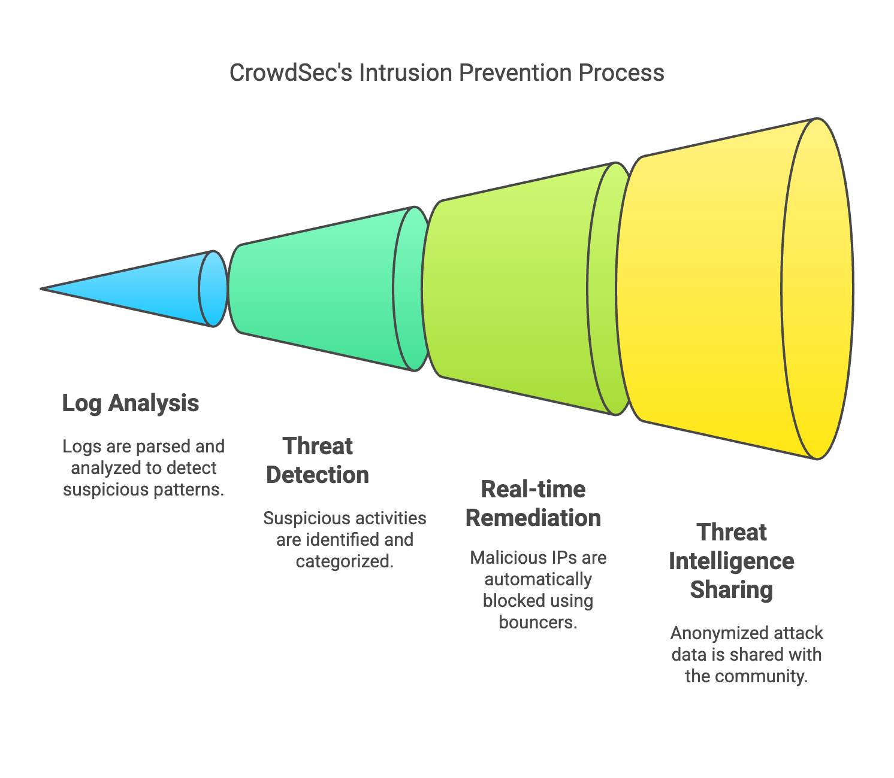

import YouTubeEmbed from "../../components/widgets/YouTubeEmbed.astro";
import Notice from "../../components/widgets/Notice.astro";
import ListCheck from "../../components/widgets/ListCheck.astro";
import Tabs from "../../components/widgets/Tabs.astro";
import Tab from "../../components/widgets/Tab.astro";

VPS servers get scanned constantly: SSH brute force, web exploits, credential stuffing. CrowdSec is an open-source collaborative intrusion prevention system (IPS) that monitors your logs, detects attacks, and blocks malicious IPs at the firewall level. Version 1.7.8 with over 14,000 GitHub stars is the latest stable release, and it handles a lot more than Fail2Ban.

In this guide, you'll install the CrowdSec engine, configure the firewall bouncer for both iptables and nftables, protect SSH, monitor Nginx logs, and deploy the AppSec WAF for inline HTTP protection. If you're [securing your VPS from the ground up](/vps-ai-coding-setup/) or [securing Docker servers against real-world threats](/bsi-security-report-docker-ufw/), CrowdSec fits right into that stack.

<ListCheck>
<ul>
<li>Install CrowdSec 1.7.8 and configure SSH log monitoring</li>
<li>Choose between nftables and iptables firewall bouncer</li>
<li>Allowlist your admin IP before enabling the bouncer (avoid lockout)</li>
<li>Handle Docker/Dokploy ports with the DOCKER-USER chain</li>
<li>Monitor Nginx access and error logs for web attack detection</li>
<li>Deploy the AppSec WAF for inline HTTP request inspection</li>
<li>Use the CrowdSec Console for centralized management</li>
</ul>
</ListCheck>

<YouTubeEmbed
  url="https://www.youtube.com/embed/9y6i2XjCVAw"
  label="CrowdSec Install"
/>


## What is CrowdSec and how can it help you?

CrowdSec is an open-source, collaborative intrusion prevention system. It parses logs from services like SSH, Nginx, and custom applications, detects suspicious patterns using community-maintained scenarios, and pushes blocking decisions to remediation components called "bouncers." The anonymized attack data feeds back into a global threat intelligence network. Your server both consumes and contributes to that pool.



### Understanding CrowdSec

Three pillars make CrowdSec different from a basic fail2ban setup:

1. **Log parsing and detection.** CrowdSec ships with parsers for common services (SSH, Nginx, Apache, MySQL, and more). You install a collection, point it at log files, and it handles the rest.
2. **Bouncer-based remediation.** Decisions from the CrowdSec engine get pushed to bouncers, lightweight daemons that enforce blocks at the firewall, reverse proxy, or application layer. The firewall bouncer is the most critical; the Nginx bouncer adds AppSec WAF capabilities.
3. **Community threat intelligence.** CrowdSec shares anonymized attack data across its user base. When an IP brute-forces another CrowdSec user's server, your instance picks up that block decision too (if you subscribe to community blocklists via the CrowdSec Console).

The [CrowdSec Hub](https://hub.crowdsec.net/) hosts collections, scenarios, parsers, and bouncers maintained by both the CrowdSec team and the community.

### Benefits of using CrowdSec for SSH protection

SSH is the most common attack surface on a VPS. Leaving it exposed leads to brute force attempts, credential stuffing, and exploitation of weak configurations. CrowdSec improves SSH security by:

1. **Detecting intrusions.** Parsing SSH auth logs and identifying patterns like repeated failed login attempts.
2. **Blocking threats.** Pushing decisions to the firewall bouncer, which drops packets from flagged IPs.
3. **Providing visibility.** Metrics, alerts, and log entries that show exactly what was detected and what was blocked.
4. **Adapting dynamically.** Detection scenarios update through the CrowdSec Hub. No manual rule writing needed.

### Why choose CrowdSec over alternatives?

| Feature                   | CrowdSec                  | Fail2Ban                    | Traditional Firewalls       |
|---------------------------|---------------------------|-----------------------------|-----------------------------|
| **Community Intelligence**| Global threat sharing     | None                        | None                        |
| **Ease of Use**           | Simple configuration      | Moderate complexity         | Manual configuration        |
| **Multi-service Support** | SSH, Nginx, AppSec, and more | Limited per service       | Ports only                  |
| **WAF Capability**        | Yes (AppSec component)    | No                          | No                          |
| **Scalability**           | Cloud-friendly            | Local VPS only              | Network-based               |
| **Real-time Blocking**    | Fast with bouncers        | Moderate                    | Reactive only               |


## Install CrowdSec

<Notice type="info" title="Prerequisites">
**Before you start, you need:**
- A Linux VPS running Ubuntu 22.04/24.04 LTS or Debian 12+
- Root or sudo access
- Ports 8080 (LAPI) and 6060 (metrics) available (or willingness to change them)

If you don't have a VPS yet, you can grab [an affordable VPS from Hetzner](https://go.bitdoze.com/hetzner) or a [budget-friendly Hostinger VPS](https://go.bitdoze.com/hostinger-vps).
</Notice>

### Step 1: Add the CrowdSec repository

```bash
curl -s https://install.crowdsec.net | sudo sh
```

This imports the CrowdSec GPG key and sets up the package repository. Expected output:

```
Detected operating system as ubuntu/24.
Detected apt version as 2.7.14
Checking for gpg...
Detected gpg...
...
Installing /etc/apt/sources.list.d/crowdsec_crowdsec.list...
```

### Step 2: Install the CrowdSec package

```bash
sudo apt update && sudo apt install crowdsec
```

<Notice type="warning" title="Port 8080 conflict">
CrowdSec's local API uses port 8080 by default. If something else occupies that port, CrowdSec will fail to start. Check with `netstat -tulpn` before installing. If there's a conflict, see the next step.
</Notice>

Sample installation output:

```
Need to get 62 MB of archives.
After this operation, 255 MB of additional disk space will be used.
...
Setting up crowdsec (1.7.8) ...
Machine successfully added to the local API.
API credentials written to '/etc/crowdsec/local_api_credentials.yaml'.
...
Not attempting to start crowdsec, port 8080 is already used or lapi was disabled.
```

### Step 3: Modify API port (if necessary)

If the install output says port 8080 is already used, edit both config files:

```bash
sudo nano /etc/crowdsec/config.yaml
sudo nano /etc/crowdsec/local_api_credentials.yaml
```

Change `listen_uri` under `api` to a free port like 8081:

```yaml
listen_uri: 127.0.0.1:8081
```

Save, then start and verify:

```bash
sudo service crowdsec start
sudo service crowdsec status
```

Expected output:

```
● crowdsec.service - Crowdsec agent
     Loaded: loaded (/lib/systemd/system/crowdsec.service; enabled; vendor preset: enabled)
     Active: active (running) since ...
```

### Step 4: List installed collections

```bash
sudo cscli collections list
```

```
COLLECTIONS
 Name                               Status    Version  Local Path
─────────────────────────────────────────────────────────────────────
 crowdsecurity/linux                enabled  0.3      ...
 crowdsecurity/sshd                 enabled  0.6      ...
```

The `crowdsecurity/sshd` collection confirms SSH monitoring is active.


## Installing the firewall bouncer (remediation)

<Notice type="info" title="What are bouncers?">
CrowdSec detects threats by analyzing logs. Bouncers enforce the decisions. They're lightweight daemons that block IPs at the firewall, reverse proxy, or application layer. The firewall bouncer is the most important one: it drops packets from flagged IPs before they reach any service.
</Notice>

### Choose your bouncer: iptables vs nftables

Modern Linux distributions (Debian 12+, Ubuntu 24.04) use **nftables** as the native packet filter. iptables survives as a compatibility shim on these systems. CrowdSec offers separate bouncer packages for each backend.

Run this to check which backend your system uses:

```bash
iptables -V
```

<Tabs>
<Tab name="Modern systems (nftables)">
If the output contains `nf_tables`, your system runs nftables natively. Use the nftables bouncer:

```
iptables v1.8.10 (nf_tables)
```

Install command:

```bash
sudo apt install crowdsec-firewall-bouncer-nftables
```

This is the recommended path for new installs on Ubuntu 24.04+ and Debian 12+.
</Tab>
<Tab name="Legacy systems (iptables)">
If the output says `legacy` without `nf_tables`, use the iptables bouncer:

```
iptables v1.8.9 (legacy)
```

Install command:

```bash
sudo apt install crowdsec-firewall-bouncer-iptables
```

This covers older Ubuntu 22.04 installs or systems explicitly configured for iptables.
</Tab>
</Tabs>

### Lock yourself out? Allowlist your IP first

<Notice type="error" title="Do this BEFORE installing the bouncer">
If the firewall bouncer enables blocking on the INPUT chain and your current IP gets flagged (or you mistype something), you can lock yourself out of SSH permanently. Allowlist your admin IP first.
</Notice>

CrowdSec 1.6.8 introduced a proper allowlist system. This is now the preferred method. It integrates with AppSec, scenarios, and console blocklists, and changes take effect immediately without restarting CrowdSec:

```bash
cscli allowlist create admin_ips -d "My trusted admin IPs"
cscli allowlist add admin_ips YOUR.HOME.IP.ADDRESS
```

Replace `YOUR.HOME.IP.ADDRESS` with your actual public IP. You can check it with `curl -s ifconfig.me` from another terminal.

You can also add subnets for VPNs or monitoring services:

```bash
cscli allowlist add admin_ips 10.0.0.0/8
```

Verify the allowlist:

```bash
cscli allowlist inspect admin_ips
```

### Install the firewall bouncer

After allowlisting your IP, install the appropriate bouncer (see the nftables vs iptables tabs above). For example, on a modern system:

```bash
sudo apt install crowdsec-firewall-bouncer-nftables
```

Sample output:

```
Setting up crowdsec-firewall-bouncer (0.0.33) ...
```

The bouncer automatically registers itself with the CrowdSec LAPI and pulls decisions.

### Docker / Dokploy users: add DOCKER-USER chain

<Notice type="warning" title="Docker bypasses the INPUT chain">
Docker-published ports go through the FORWARD → DOCKER chains, not INPUT. The firewall bouncer's default configuration only inserts rules into INPUT, which means your Docker containers remain reachable from banned IPs. If you run Docker or [Dokploy](/dokploy-install/) to manage your containers, this is a critical gap. [Docker can bypass your firewall rules](/docker-bypasses-firewall/) without this fix.
</Notice>

Edit the bouncer configuration:

```bash
sudo nano /etc/crowdsec/bouncers/crowdsec-firewall-bouncer.yaml
```

Find the `iptables_chains` (or `nftables_chains`) section and add `DOCKER-USER`:

```yaml
# For iptables mode:
iptables_chains:
  - INPUT
  - DOCKER-USER

# For nftables mode, add DOCKER-USER to the nftables_chains list
```

Restart the bouncer:

```bash
sudo systemctl restart crowdsec-firewall-bouncer
```

This ensures CrowdSec blocks banned IPs from reaching your Docker containers too. For more on Docker networking and security, see [keeping your Docker server clean](/clean-docker-overlay2-dir/).

### Verify the bouncer installation

```bash
sudo cscli bouncers list
```

Expected output:

```
╭───────────────────────────────────────────────────────────────────────────────────────────────────────────────╮
│ Name                            IP Address  Valid  Last API pull         Type                       Version    │
├───────────────────────────────────────────────────────────────────────────────────────────────────────────────┤
│ cs-firewall-bouncer-...         127.0.0.1   ✔️    2026-06-20T07:00:00Z  crowdsec-firewall-bouncer  v0.0.33    │
╰───────────────────────────────────────────────────────────────────────────────────────────────────────────────╯
```

If the bouncer doesn't appear, restart the service and check logs:

```bash
sudo systemctl restart crowdsec-firewall-bouncer
sudo tail -f /var/log/crowdsec-firewall-bouncer.log
```

### End-to-end smoke test

Verify the bouncer actually blocks traffic. From your VPS, add a test decision for a harmless IP (don't use your own):

```bash
sudo cscli decisions add -i 192.0.2.1 -t ban -r "smoke test"
```

Check that the IP appears in your firewall:

<Tabs>
<Tab name="nftables verification">
```bash
sudo nft list sets | grep crowdsec
# Then check the specific set:
sudo nft list set inet crowdsec crowdsec-blacklists
```

You should see `192.0.2.1` in the set.
</Tab>
<Tab name="iptables verification">
```bash
sudo ipset list crowdsec-blacklists
```

You should see `192.0.2.1` as a member.
</Tab>
</Tabs>

Clean up the test decision:

```bash
sudo cscli decisions delete -i 192.0.2.1
```

<Notice type="info" title="IPv6 support">
IPv6 blocking works out of the box. CrowdSec's default configuration has `disable_ipv6: false`. Don't set it to true unless you've explicitly disabled IPv6 on your system.
</Notice>


## See what logs are monitored by CrowdSec

CrowdSec creates an acquisition file at `/etc/crowdsec/acquis.yaml` that defines which log sources it monitors. View it:

```bash
cat /etc/crowdsec/acquis.yaml
```

Sample output:

```yaml
# Generated acquisition file - wizard.sh (service: ssh) / files :
journalctl_filter:
  - _SYSTEMD_UNIT=ssh.service
labels:
  type: syslog
---
```

This shows CrowdSec monitoring SSH via journald. If you installed additional collections (like Nginx), corresponding entries appear here too.

### CrowdSec log files

CrowdSec generates its own logs for monitoring its operation:

| File                                    | Purpose                                    |
|-----------------------------------------|--------------------------------------------|
| `/var/log/crowdsec.log`                 | Main engine log: detections, parsing      |
| `/var/log/crowdsec_api.log`             | Local API (LAPI) requests and responses    |
| `/var/log/crowdsec-firewall-bouncer.log`| Firewall bouncer activity and errors       |

Watch the engine log in real time:

```bash
sudo tail -f /var/log/crowdsec.log
```


## Linking to the CrowdSec Console (optional)

The CrowdSec Console is a cloud-based dashboard that provides centralized monitoring, attack visualization, and community-sourced threat intelligence across all your CrowdSec instances.

<Notice type="info" title="Free Community tier">
The free tier includes 3 community blocklists with daily updates, centralized alert monitoring, and bouncer management. Premium starts at $31/month for real-time blocklist updates and custom blocklists.
</Notice>

### Step 1: Create an account

Visit the [CrowdSec Console signup page](https://app.crowdsec.net/signup) and register with an email address.

### Step 2: Generate an enrollment token

1. Log in to the Console.
2. Navigate to **Security Engines** → **Engines**.
3. Click **Generate Enrollment Token**.
4. Copy the token.

### Step 3: Enroll your VPS

```bash
sudo cscli console enroll --quick <your-enrollment-token>
```

The `--quick` flag (added in 1.7.8) speeds up enrollment. Sample output:

```
Successfully enrolled machine 'my-vps.example.com' to the Console
```

### Step 4: Verify enrollment

Return to the Console's **Engines** section. Your VPS should appear as an active engine.

Once enrolled, you get centralized alert dashboards, attack trend graphs, and community intelligence feeds. This is useful for [monitoring your server health and security events](/beszel-uptime-kuma/) alongside CrowdSec's own metrics.


## Monitoring application logs (e.g., Nginx)

CrowdSec can detect web attacks by analyzing Nginx logs: bot traffic, SQL injection probes, directory traversal, bad user agents, and more. For full protection, monitor **both** `access.log` and `error.log`.

<Notice type="info" title="Monitor both log files">
The current article's Nginx configuration only tracked `error.log`. Most HTTP attack detection scenarios (SQLi, path traversal, bad bots) parse `access.log`. Add both to get full coverage.
</Notice>

### Step 1: Install the Nginx collection

```bash
sudo cscli collections install crowdsecurity/nginx
```

```
INFO crowdsecurity/nginx installed successfully
```

### Step 2: Update acquis.yaml

Edit `/etc/crowdsec/acquis.yaml` and add the Nginx log entries:

```yaml
filenames:
  - /var/log/nginx/access.log
  - /var/log/nginx/error.log
  - /home/*/logs/nginx/*.log
labels:
  type: nginx
---
```

- `access.log` catches SQL injection probes, directory traversal, bad user agents, crawler abuse
- `error.log` catches upstream failures, rate limiting, connection anomalies
- The `/home/*/logs/nginx/*.log` wildcard covers virtual host logs (useful with Dokploy or similar setups)

### Step 3: Restart CrowdSec

```bash
sudo systemctl restart crowdsec
```

### Step 4: Verify Nginx monitoring is active

```bash
sudo cscli alerts list
sudo cscli decisions list
```

You should see entries related to Nginx scenarios. Tail the engine log to watch detections in real time:

```bash
sudo tail -f /var/log/crowdsec.log
```

For more on managing web traffic and [blocking unwanted traffic at the application layer](/block-ai-crawlers/), CrowdSec's Nginx monitoring is the first step. The AppSec WAF below takes it further.


## Beyond the firewall: AppSec WAF protection

<Notice type="info" title="Firewall bouncer + AppSec = layered protection">
The firewall bouncer blocks IPs at the packet level (reactive — after CrowdSec detects an attack in logs). The AppSec component inspects HTTP requests inline before they reach your application (proactive — blocks in real time). They complement each other. Keep both running.
</Notice>

CrowdSec 1.6 introduced the **AppSec Component** — a full WAF that inspects HTTP requests inline using the Coraza engine (mod_security compatible). It detects SQL injection, XSS, path traversal, CVE exploits, and bad bots at the HTTP layer, before traffic reaches your application.

### What is the AppSec component?

AppSec runs inside the Nginx/OpenResty/Traefik remediation component (bouncer). When an HTTP request arrives, the bouncer forwards it to the AppSec engine for inspection. If the request matches a rule (e.g., SQLi pattern, known CVE exploit), it gets blocked immediately — no log tail, no delay.

This is fundamentally different from the log-based detection you've configured above. Log-based detection analyzes logs after the fact; AppSec blocks malicious requests before they touch your app.

If you use [Traefik as your reverse proxy](/traefik-proxy-docker/), the Traefik bouncer supports AppSec too.

### Install and configure AppSec

Install the AppSec virtual patching collection:

```bash
sudo cscli collections install crowdsecurity/appsec-virtual-patching
```

<Notice type="warning" title="Ensure CrowdSec >= 1.7.8">
CrowdSec 1.7.8 fixes CVE-2026-44982, a WAF bypass vulnerability via chunked transfer-encoding. If you run AppSec, updating to 1.7.8 is critical. Check your version: `cscli version`.
</Notice>

Next, enable AppSec in the Nginx remediation component. Edit the Nginx bouncer configuration:

```bash
sudo nano /etc/crowdsec/bouncers/crowdsec-nginx-bouncer.yaml
```

Ensure the AppSec section is enabled:

```yaml
appsec:
  enabled: true
  # Path to the AppSec configuration
  # CrowdSec will use the default if not specified
```

If you don't have the Nginx bouncer installed yet (it's separate from the firewall bouncer):

```bash
sudo apt install crowdsec-nginx-bouncer
```

Restart CrowdSec and Nginx:

```bash
sudo systemctl restart crowdsec
sudo systemctl restart nginx
```

Verify AppSec is active:

```bash
sudo cscli appsec-configs list
sudo cscli appsec-rules list
```

You should see the virtual patching rules loaded. These cover common web exploits and CVEs without you having to write custom rules.

The AppSec component runs alongside your existing firewall bouncer — they don't interfere with each other. Firewall bouncer handles IP-level blocking (bulk bans from SSH brute force, community blocklists); AppSec handles HTTP-level inspection (inline blocking of web exploits).


## Useful CrowdSec commands

After configuring CrowdSec, these commands help you monitor activity, manage blocks, and troubleshoot issues.


### View active decisions (current blocks/bans)

```bash
sudo cscli decisions list
```

```
╭────────────┬─────────────┬────────────┬──────────────────────╮
│  IP        │  Reason     │  Action    │  Expires at          │
├────────────┼─────────────┼────────────┼──────────────────────┤
│ 192.168.1.1│ ssh-bf      │ ban        │ 2026-06-20T12:00:00Z │
│ 203.0.113.5│ nginx-bot   │ ban        │ 2026-06-20T23:59:59Z │
╰────────────┴─────────────┴────────────┴──────────────────────╯
```


### Check recent alerts

```bash
sudo cscli alerts list
```

```
╭───────┬──────────────────────┬────────────────────┬──────────────╮
│  ID   │  Scenario            │  Source IP         │  Created at  │
├───────┼──────────────────────┼────────────────────┼──────────────┤
│   1   │ ssh-bf               │ 203.0.113.5        │ 2026-06-20   │
│   2   │ nginx-bad-user-agent │ 198.51.100.10      │ 2026-06-20   │
╰───────┴──────────────────────┴────────────────────┴──────────────╯
```


### View security metrics

```bash
sudo cscli metrics
```

This shows parsed log counts, detected threats, bouncer activity, and dropped connections. Use it to get a quick health check.


### Monitor logs in real time

```bash
sudo tail -f /var/log/crowdsec.log
```

Useful for watching detections happen live and troubleshooting parser issues.


### List active detection scenarios

```bash
sudo cscli scenarios list
```

```
╭───────────────────────────────────────┬────────╮
│ Name                                  │ Status │
├───────────────────────────────────────┼────────┤
│ crowdsecurity/ssh-bf                  │ enabled  │
│ crowdsecurity/nginx-bad-user-agent    │ enabled  │
│ crowdsecurity/http-crawl-non_statics  │ enabled  │
╰───────────────────────────────────────┴────────╯
```


### Add or remove a block manually

**Block an IP:**
```bash
sudo cscli decisions add -i <IP> -t ban -r "Manual ban"
```

**Unblock an IP:**
```bash
sudo cscli decisions delete --ip <IP>
```


### Using the allowlist system (cscli allowlist)

The allowlist system (added in CrowdSec 1.6.8) is the preferred method for whitelisting trusted IPs. Unlike the older `cscli decisions add --type whitelist` approach, allowlists integrate with AppSec, scenarios, and console blocklists. Changes take effect immediately — no restart needed.

```bash
# Create an allowlist
cscli allowlist create my_allowlist -d "Trusted admin IPs"

# Add individual IPs or subnets
cscli allowlist add my_allowlist 203.0.113.5
cscli allowlist add my_allowlist 198.51.100.0/24

# Inspect what's in the allowlist
cscli allowlist inspect my_allowlist
```

Practical examples:
- Your home/office IP (dynamic DNS works too — update the allowlist when it changes)
- VPN subnet for your admin access
- Monitoring service IPs (Uptime Kuma, health checkers)

### Summary of useful commands

| Command                                 | Purpose                                    |
|-----------------------------------------|--------------------------------------------|
| `sudo cscli decisions list`             | List all active bans and blocks            |
| `sudo cscli alerts list`               | View recent alerts triggered by attacks    |
| `sudo cscli metrics`                    | Display security metrics and performance   |
| `sudo tail -f /var/log/crowdsec.log`    | Watch logs and detections in real time     |
| `sudo cscli scenarios list`             | Show all active detection scenarios        |
| `sudo cscli decisions add`              | Manually block specific IPs                |
| `sudo cscli decisions delete`           | Remove a block for a specific IP           |
| `cscli allowlist create`               | Create a new allowlist                     |
| `cscli allowlist add`                  | Add an IP/subnet to an allowlist           |
| `cscli allowlist inspect`              | View allowlist contents                    |


## Keeping CrowdSec updated and secure

Keeping CrowdSec up to date is straightforward:

```bash
sudo apt update && sudo apt upgrade crowdsec
```

<Notice type="warning" title="CrowdSec 1.7.8 security release">
CrowdSec 1.7.8 fixes two security vulnerabilities: CVE-2026-44982 (WAF bypass via chunked transfer-encoding) and CVE-2026-44981 (LAPI denial of service). If you run AppSec, updating is critical. If you only use the firewall bouncer, it's still strongly recommended.
</Notice>

Additional notes:

- **RE2 regex engine.** Since version 1.7.7, CrowdSec uses the RE2 regex engine by default on Linux, which brings significant performance improvements for log parsing. This matters on busy servers with high log volume.
- **Security announcements.** Subscribe to CrowdSec's [GitHub releases](https://github.com/crowdsecurity/crowdsec/releases) or the [Discourse forum](https://discourse.crowdsec.net/) to stay informed about security patches.
- **Bouncer updates.** Don't forget to update bouncers too: `sudo apt update && sudo apt upgrade crowdsec-firewall-bouncer-nftables` (or `-iptables`).

The `cscli dashboard` command (Metabase-based local dashboard) was deprecated in CrowdSec 1.7.0. Use the CrowdSec Console instead — it's the officially supported way to visualize your security data.


## Conclusion

CrowdSec gives you community-driven intrusion prevention that covers the full stack — SSH brute force blocking at the firewall level, Nginx log analysis for web attack detection, and inline HTTP inspection through the AppSec WAF. Here's what we walked through:

- Installing CrowdSec 1.7.8 and configuring SSH log monitoring
- Choosing between nftables (recommended for modern systems) and iptables firewall bouncer
- Allowlisting your admin IP to prevent lockout
- Configuring the DOCKER-USER chain for Docker/Dokploy hosts
- Monitoring both Nginx access.log and error.log for web attack detection
- Deploying the AppSec WAF for inline HTTP request blocking
- Connecting to the CrowdSec Console for centralized management
- Using allowlists and commands to manage CrowdSec day-to-day

CrowdSec handles IP-level and HTTP-level threats. Pair it with a [layered security approach with DNS-level protection](/block-ads-malware-dns-protection/) for defense in depth. And if you run [server management panels that integrate with your security stack](/best-self-hosted-panels/), CrowdSec fits alongside those tools without conflicts.

Keep it updated, watch your metrics, and explore the [CrowdSec Hub](https://hub.crowdsec.net/) for additional collections beyond SSH and Nginx — there are parsers for MySQL, PostgreSQL, WordPress, and dozens more services.
