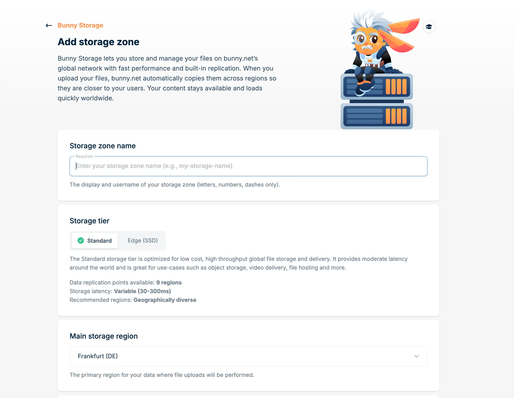
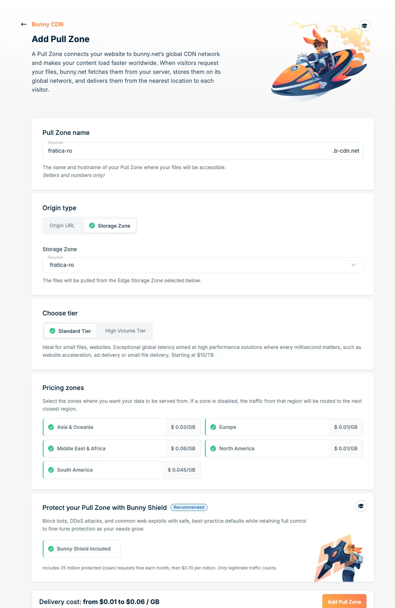
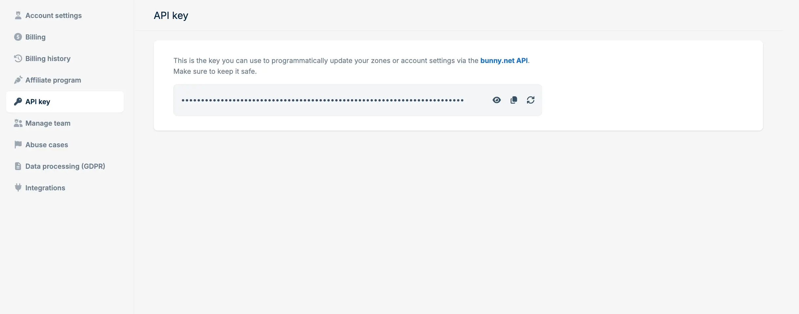

import Button from "@components/widgets/Button.astro";
import Notice from "@components/widgets/Notice.astro";
import ListCheck from "@components/widgets/ListCheck.astro";
import Accordion from "@components/widgets/Accordion.astro";
import Tabs from "@components/widgets/Tabs.astro";
import Tab from "@components/widgets/Tab.astro";

You built an Astro site. It's fast, it's static, and now you need somewhere to host it that won't cost a fortune or require you to maintain a server.

I run my own Astro site on Bunny.net, and after months of using it in production I can say the setup is straightforward once you know the steps. Bunny gives you edge storage with global replication and a CDN with 119+ points of presence. You upload your built files, Bunny serves them from the nearest edge location to every visitor. No VPS to patch, no Nginx config to debug, no Docker container to babysit.

I wrote a full [Bunny.net review](/bunny-net-review/) covering pricing and features in detail. This guide does one thing: walk you through getting your Astro static site deployed and live on Bunny.net.

If you don't have an Astro site yet, I covered how to [build a free blog with Astro](/build-astro-blog-free/) using the [Bitdoze Astro Theme](https://github.com/bitdoze/bitdoze-astro-theme). The same setup applies here, just swap Cloudflare Pages for Bunny.net hosting.

<Notice type="success" title="Try Bunny.net free for 14 days">
  You can follow along with this guide without spending anything. [Sign up at Bunny.net](https://go.bitdoze.com/bunny) with no credit card required and get a full 14-day free trial.
</Notice>

## What you need before starting


- An Astro site configured for static output (or fork the [Bitdoze Astro Theme](https://github.com/bitdoze/bitdoze-astro-theme) to follow along)
- A [Bunny.net account](https://go.bitdoze.com/bunny) (free 14-day trial, no credit card)
- Node.js installed on your machine
- A domain name (optional, but recommended for production)

## Why Bunny.net for static sites


<YouTubeEmbed
  url="https://www.youtube.com/embed/dXW9uA-BAIg"
  label="Astro on Bunny CDN"
/>

A quick aside on why this is worth doing before we get into the setup.

<ListCheck>
- No server maintenance. Upload files, Bunny serves them. No OS updates, no security patches.
- Edge storage replication. Your site files live in multiple regions worldwide, not a single data center.
- Perma-Cache stores content permanently on edge servers so visitors almost always get a cache hit.
- Storage starts at $0.01/GB, bandwidth at $0.01/GB in EU/NA. Most blogs run for under $1/month.
- Let's Encrypt certificates are provisioned automatically. No certbot, no renewal cron jobs.
- Custom domains with full DNS control. Bring your own domain and Bunny handles the rest.
</ListCheck>

Here's how Bunny.net stacks up against other popular static hosting options:

| Feature | Bunny.net | Cloudflare Pages | Netlify | Vercel |
|---------|-----------|-----------------|---------|--------|
| Bandwidth price (EU/NA) | $0.01/GB | Free (limited) | $0.10/GB | $0.15/GB |
| Storage price | $0.01/GB | Free (limited) | Included | Included |
| Edge locations | 119+ | 300+ | ~100 | ~100 |
| Custom domain | Free | Free | Free | Free |
| Free tier | 14-day trial | Yes (generous) | 100GB/mo | 100GB/mo |
| WAF / DDoS protection | Bunny Shield (free tier) | Included | Add-on | Add-on |
| Min. monthly cost | $1 | $0 | $0 | $0 |

Cloudflare Pages has the better free tier if cost is your only concern. But if you want edge storage replication, predictable pricing at scale, or you already use Bunny for CDN or video, hosting your Astro site there keeps everything in one dashboard. I switched from Cloudflare Pages to Bunny for exactly that reason.

## Step 1: Build your Astro site

Make sure your Astro project is configured for static output. Open `astro.config.mjs` and confirm it looks something like this:

```javascript
import { defineConfig } from 'astro/config';

export default defineConfig({
  site: 'https://yourdomain.com',
  // output: 'static' is the default, so you may not see this line at all
});
```

Astro uses static output by default, so unless you explicitly changed it to `server` or `hybrid`, you're already set.

Build the site:

```bash
npm run build
```

This generates a `dist/` folder containing your complete static site — HTML files, CSS, JavaScript, images, everything. You can preview it locally to verify everything looks right:

```bash
npm run preview
```

The `dist/` folder is what we'll deploy to Bunny.net.

## Step 2: Set up Bunny.net infrastructure

You need two things on the Bunny.net side: a storage zone (where your files live) and a pull zone (the CDN layer that serves them to visitors). Neither takes more than a couple of minutes.

### Create a storage zone



1. Log into your [Bunny.net dashboard](https://go.bitdoze.com/bunny)
2. Go to **Storage** in the left sidebar
3. Click **Add Storage Zone**
4. Fill in the details:
   - **Name**: Something like `my-astro-site` (this becomes part of the storage URL)
   - **Main Region**: Pick the region closest to your primary audience (e.g., `DE` for Europe, `NY` for US East)
   - **Replication Regions**: Add regions where you want copies of your files (e.g., add `NY` and `SYD` if you have visitors in the US and Australia)
   - **Tier**: Edge tier (SSD storage) is worth the tiny price difference for better performance

<Notice type="warning" title="Choose regions carefully">
  You cannot change the main region or remove replication regions after creating a storage zone. You can add replication regions later, but start with your primary audience's region and add more as needed.
</Notice>

### Create a pull zone



The pull zone is the CDN configuration that sits in front of your storage zone and serves files to visitors.

1. In your newly created storage zone, go to **Connected Pull Zones**
2. Click **Connect Pull Zone**
3. Configure it:
   - **Name**: Something like `my-astro-site` (this becomes `my-astro-site.b-cdn.net`)
   - **Zones**: Select the geographic zones you want to serve traffic from (EU, NA, Asia, etc.)

That's the basic infrastructure. Your pull zone hostname (`my-astro-site.b-cdn.net`) is already live and will serve whatever is in your storage zone. Right now that's nothing, so let's fix that.

## Step 3: Deploy your site

The deployment uploads files from your `dist/` folder to Bunny Storage via the Bunny API, then purges the CDN cache. You can do this from your local machine or automate it with GitHub Actions.

### Get your credentials

You need four values from the Bunny dashboard:

1. **Storage Zone Name**: The name you chose when creating the storage zone (e.g., `my-astro-site`)
2. **Storage Password**: Go to **Storage** → your storage zone → **FTP & API Access** → copy the Password
3. **Pull Zone ID**: Go to **Pull Zones** → your pull zone → check the URL, it contains the pull zone ID (or find it in the pull zone settings)
4. **Account API Key**: Go to **Account Settings** → copy the API Key



<Tabs>
<Tab name="Deploy Script (Local)">

Create a `.env` file in your project root (add it to `.gitignore` so you don't commit secrets):

```bash
# .env
BUNNY_STORAGE_ZONE=your-storage-zone-name
BUNNY_STORAGE_PASSWORD=your-storage-zone-password
BUNNY_PULL_ZONE_ID=your-pull-zone-id
BUNNY_API_KEY=your-account-api-key
```

Then create the deploy script. Save it as `deploy.sh` in your project root:

```bash
#!/bin/bash
set -euo pipefail

# Load environment variables from .env
if [ ! -f .env ]; then
  echo "Error: .env file not found. Copy .env.example to .env and fill in your credentials."
  exit 1
fi

set -a
source .env
set +a

# Validate required variables
for var in BUNNY_STORAGE_ZONE BUNNY_STORAGE_PASSWORD BUNNY_PULL_ZONE_ID BUNNY_API_KEY; do
  if [ -z "${!var:-}" ]; then
    echo "Error: $var is not set in .env"
    exit 1
  fi
done

DIST_DIR="dist"

# Build the site
echo "Building Astro site..."
npm run build

# Collect file list into a temp file to avoid pipe subshell issues
FILE_LIST=$(mktemp)
trap 'rm -f "$FILE_LIST"' EXIT
find "$DIST_DIR" -type f > "$FILE_LIST"

total=$(wc -l < "$FILE_LIST")
echo "Uploading $total files to Bunny Storage..."

failed=0
count=0
while IFS= read -r file; do
  count=$((count + 1))
  remote_path="${file#$DIST_DIR/}"
  encoded_path=$(python3 -c "import urllib.parse; print(urllib.parse.quote('$remote_path'))")
  printf "  [%d/%d] Uploading: %s" "$count" "$total" "$remote_path"

  http_code=$(curl -s -o /dev/null -w "%{http_code}" -X PUT \
    "https://storage.bunnycdn.com/$BUNNY_STORAGE_ZONE/$encoded_path" \
    -H "AccessKey: $BUNNY_STORAGE_PASSWORD" \
    --data-binary "@$file" || true)

  if [ "$http_code" -eq 201 ] || [ "$http_code" -eq 200 ]; then
    echo " -> OK"
  else
    echo " -> FAILED (HTTP $http_code)"
    failed=$((failed + 1))
  fi
done < "$FILE_LIST"

echo "Upload complete: $((count - failed))/$count succeeded."

if [ "$failed" -gt 0 ]; then
  echo "Warning: $failed file(s) failed to upload."
fi

# Purge CDN cache
echo "Purging CDN cache for pull zone $BUNNY_PULL_ZONE_ID..."
http_code=$(curl -s -o /dev/null -w "%{http_code}" -X POST \
  "https://api.bunny.net/pullzone/$BUNNY_PULL_ZONE_ID/purgeCache" \
  -H "AccessKey: $BUNNY_API_KEY" || true)
if [ "$http_code" -eq 200 ] || [ "$http_code" -eq 204 ]; then
  echo "Cache purged successfully."
else
  echo "Warning: cache purge returned HTTP $http_code"
fi

echo "Deployment complete!"
```

Make it executable and run it:

```bash
chmod +x deploy.sh
./deploy.sh
```

The script builds your Astro site, uploads every file from `dist/` to Bunny Storage using the storage API, then purges the CDN cache so visitors see the fresh version immediately.

</Tab>
<Tab name="GitHub Actions (Automated)">

To deploy automatically on every push to `main`, use the same approach in a GitHub Actions workflow.

### Set up secrets

Go to your GitHub repository → **Settings** → **Secrets and variables** → **Actions** and add these secrets:

| Secret name | Value |
|-------------|-------|
| `BUNNY_STORAGE_ZONE` | Your storage zone name |
| `BUNNY_STORAGE_PASSWORD` | Your storage zone password (from FTP & API Access) |
| `BUNNY_PULL_ZONE_ID` | Your pull zone ID |
| `BUNNY_API_KEY` | Your account API key |

### Create the workflow

Create `.github/workflows/deploy.yml`:

```yaml
name: Deploy to Bunny.net

on:
  push:
    branches: [main]

jobs:
  deploy:
    runs-on: ubuntu-latest
    steps:
      - uses: actions/checkout@v4
      - uses: actions/setup-node@v4
        with:
          node-version: lts

      - name: Install dependencies
        run: npm ci

      - name: Build site
        run: npm run build

      - name: Upload to Bunny Storage
        env:
          BUNNY_STORAGE_ZONE: ${{ secrets.BUNNY_STORAGE_ZONE }}
          BUNNY_STORAGE_PASSWORD: ${{ secrets.BUNNY_STORAGE_PASSWORD }}
        run: |
          DIST_DIR="dist"
          total=$(find "$DIST_DIR" -type f | wc -l)
          echo "Uploading $total files to Bunny Storage..."
          count=0
          failed=0
          while IFS= read -r file; do
            count=$((count + 1))
            remote_path="${file#$DIST_DIR/}"
            encoded_path=$(python3 -c "import urllib.parse; print(urllib.parse.quote('$remote_path'))")
            printf "  [%d/%d] Uploading: %s\n" "$count" "$total" "$remote_path"
            http_code=$(curl -s -o /dev/null -w "%{http_code}" -X PUT \
              "https://storage.bunnycdn.com/$BUNNY_STORAGE_ZONE/$encoded_path" \
              -H "AccessKey: $BUNNY_STORAGE_PASSWORD" \
              --data-binary "@$file" || true)
            if [ "$http_code" -ne 201 ] && [ "$http_code" -ne 200 ]; then
              echo "  -> FAILED (HTTP $http_code)"
              failed=$((failed + 1))
            fi
          done < <(find "$DIST_DIR" -type f)
          echo "Upload complete: $((count - failed))/$count succeeded."
          if [ "$failed" -gt 0 ]; then
            echo "Error: $failed file(s) failed to upload."
            exit 1
          fi

      - name: Purge CDN cache
        env:
          BUNNY_PULL_ZONE_ID: ${{ secrets.BUNNY_PULL_ZONE_ID }}
          BUNNY_API_KEY: ${{ secrets.BUNNY_API_KEY }}
        run: |
          http_code=$(curl -s -o /dev/null -w "%{http_code}" -X POST \
            "https://api.bunny.net/pullzone/$BUNNY_PULL_ZONE_ID/purgeCache" \
            -H "AccessKey: $BUNNY_API_KEY")
          if [ "$http_code" -eq 200 ] || [ "$http_code" -eq 204 ]; then
            echo "Cache purged successfully."
          else
            echo "Warning: cache purge returned HTTP $http_code"
          fi
```

Every push to `main` now triggers: install dependencies, build the Astro site, upload all files to Bunny Storage, purge the CDN cache. Fully automated.

</Tab>
</Tabs>

## Step 4: Configure your custom domain

Your site is already accessible at `your-pull-zone.b-cdn.net`, but you probably want your own domain. Here's how.

### Add the hostname in Bunny

1. Go to **Pull Zones** → your pull zone → **General**
2. Scroll to **Hostnames**
3. Click **Add Custom Hostname**
4. Enter your domain (e.g., `www.yourdomain.com` or `yourdomain.com`)
5. Click **Add**

Bunny generates an SSL certificate automatically (usually within a few minutes).

### Configure DNS at your registrar

How you configure DNS depends on whether you're using a subdomain or the root domain.

**For a subdomain (e.g., `www.yourdomain.com`):**

Add a CNAME record:

| Type | Name | Value |
|------|------|-------|
| CNAME | www | your-pull-zone.b-cdn.net |

CNAME records are the standard approach. They route traffic through Bunny's Anycast network efficiently.

**For a root domain (e.g., `yourdomain.com`):**

Add an ANAME (also called ALIAS) record:

| Type | Name | Value |
|------|------|-------|
| ANAME / ALIAS | @ | your-pull-zone.b-cdn.net |

Not all DNS providers support ANAME records. Cloudflare, DNSMadeEasy, and Bunny's own DNS do. If yours doesn't, use a subdomain like `www` with a CNAME instead, then set up a redirect from the root domain to `www`.

<Notice type="info" title="CNAME vs ANAME for root domains">
  ANAME records resolve to an IP address at the DNS level, which can slightly reduce routing optimization compared to CNAME. If performance matters more than a clean root domain URL, use `www` with a CNAME record instead. Bunny has a [detailed writeup on how ANAME records affect CDN routing](https://bunny.net/blog/how-aname-dns-records-affect-cdn-routing/) if you want the technical details.
</Notice>

### Verify and enforce SSL

1. Wait for the SSL certificate status to change to **Active** (check the Hostnames section in your pull zone)
2. Toggle **Force SSL** to redirect all HTTP traffic to HTTPS
3. Verify by visiting `https://yourdomain.com` in a browser

### DNS propagation

DNS changes can take anywhere from a few minutes to 48 hours to propagate globally, though most updates show up within 15-30 minutes. You can check propagation status with tools like `dig` or online DNS checkers.

## Step 5: Configure caching

Bunny has three caching features worth understanding for a static Astro site. They work together in layers.

### Smart Cache

Smart Cache is enabled by default on pull zones accelerated by Bunny DNS. It decides what gets cached and what passes through to the origin on every request.

For static sites, Smart Cache caches everything with a recognized static file extension (images, fonts, CSS, JS, PDFs, etc.) and never caches `text/html`, `application/json`, or `application/xml` MIME types. This is the right behavior for most Astro sites since your HTML pages will be fetched fresh while assets get cached.

If you need to cache HTML pages (Bunny excludes them by default), create an Edge Rule with the **Override Cache Time** action targeting your HTML files.

### Vary Cache

Vary Cache lets Bunny store different versions of the same URL based on factors like browser capabilities, device type, or location. The relevant options for a static Astro site:

| Setting | What it does |
|---------|-------------|
| **WebP support** | Serves WebP images to browsers that support them, original format to the rest |
| **AVIF support** | Same idea, but for the AVIF format |
| **URL Query String** | Treats different query strings as separate cached files |

<Notice type="warning" title="Watch your cache cardinality">
  Each Vary setting multiplies the number of cached versions per URL. WebP + AVIF + Mobile/Desktop creates `2 x 2 x 2 = 8` cached versions of each file. Only enable settings you actually need, or your cache hit rate drops.
</Notice>

### Perma-Cache

Perma-Cache is a secondary permanent cache layer between the CDN and your origin. When a cache miss occurs on the CDN edge, Bunny checks Perma-Cache storage first before hitting your origin. Files that get fetched from the origin are stored permanently in Perma-Cache in the background.

This is different from regular CDN caching, which expires based on time or available space. Perma-Cache files stick around indefinitely.

<Notice type="info" title="Perma-Cache vs Storage Zone origin">
  If your pull zone is directly connected to a storage zone as its origin (which is the setup in this guide), Perma-Cache is not available because your content is already hosted on Bunny storage. Perma-Cache is useful when your origin is an external server (a VPS, for example) and you want Bunny to cache origin responses permanently.
</Notice>

To enable Perma-Cache:

1. Create a separate storage zone (different from the one holding your site files)
2. Go to **Pull Zones** → your pull zone → **Caching** → **Perma-Cache**
3. Select the storage zone from the dropdown
4. Save configuration

## Step 6: Add security with Bunny Shield

Bunny Shield is Bunny's WAF (Web Application Firewall) and DDoS protection service. It sits in front of your pull zone and filters malicious traffic before it reaches your site. There's a free tier that covers the basics.

### What the free tier gives you

The free Shield tier includes 71 built-in WAF rules and DDoS protection. It blocks common attacks automatically:

- SQL injection attempts in query parameters and forms
- Cross-site scripting (XSS) payloads
- Remote file inclusion (RFI) attacks
- Other OWASP Top 10 threats

For a static Astro site, Shield is mostly defense against DDoS and bot traffic since there's no server-side code to exploit. But it still reduces noise in your logs and can block scrapers or abuse patterns.

### Enable Shield

1. Go to **Shield** in the Bunny dashboard
2. Create a new Shield Zone
3. Connect it to your pull zone
4. The free tier activates automatically

### Optional: rate limiting and custom WAF rules

The paid tiers ($9.50/month for Advanced, $99/month for Business) add:

- Custom WAF rules (10 on Advanced, 25 on Business)
- Advanced bot detection
- Rate limiting per IP or path

For a static blog, the free tier is usually enough. Rate limiting becomes relevant if you notice specific IPs hammering your site or if you want to block traffic from certain countries.

### Set up Edge Rules for security headers

Edge Rules let you add custom headers to responses. Adding security headers is a quick win regardless of whether you use Shield:

1. Go to **Pull Zones** → your pull zone → **Edge Rules**
2. Create rules to add headers:

| Header | Value |
|--------|-------|
| X-Content-Type-Options | nosniff |
| X-Frame-Options | SAMEORIGIN |
| X-XSS-Protection | 1; mode=block |
| Referrer-Policy | strict-origin-when-cross-origin |

## Cost breakdown

What does this actually cost? Here's a realistic scenario for a typical Astro blog:

| Resource | Monthly usage | Cost |
|----------|--------------|------|
| Edge storage | 500 MB | ~$0.01 |
| CDN bandwidth (EU/NA) | 25 GB | ~$0.25 |
| Shield (free tier) | - | $0.00 |
| **Total** | | **~$0.26/month** |

Under $4/year for a blog with moderate traffic, including DDoS protection and WAF. Even at 100 GB of monthly bandwidth you're looking at roughly $1/month.

Bunny has a $1 monthly minimum, so very low-traffic sites still pay $1. But that $1 covers up to 100 GB of EU/NA bandwidth, which is more than most blogs use in a month.

## Troubleshooting

<Accordion label="Site returns 404 errors" group="troubleshoot">

Check that your files are uploaded to the root of your storage zone, not inside a subfolder. The `dist/` folder contents (not the folder itself) should be at the top level. With the deploy script, this is handled by the path stripping logic (`remote_path="${file#$DIST_DIR/}"`). If you uploaded manually, make sure you uploaded the contents of `dist/`, not the `dist/` directory itself.

Also verify your pull zone is connected to the correct storage zone (Pull Zones → your zone → General → Origin Type should show "StorageZone" with the right zone selected).

</Accordion>

<Accordion label="CSS and JavaScript not loading" group="troubleshoot">

This is usually a MIME type issue. Bunny.net should detect and serve correct MIME types automatically, but if something is off:

1. Check the pull zone's **Routing** settings
2. Make sure the **Enable Static File Processing** option is enabled if available
3. Verify that your `dist/` folder contains the referenced assets with correct file extensions

If you're using Astro's default build output, CSS and JS files are placed in `dist/_astro/` with hashed filenames. As long as the full `dist/` folder was uploaded, these should work.

</Accordion>

<Accordion label="Changes not visible after deployment" group="troubleshoot">

The CDN is serving cached content. Purge the cache:

- From the dashboard: Pull Zones → your zone → Purge Cache → Purge All Files
- The deploy script handles this automatically after each upload

Cache purges propagate within seconds on Bunny's network. If you're using Perma-Cache, note that a full pull zone purge doesn't delete Perma-Cache files. It switches to a new directory structure instead.

</Accordion>

<Accordion label="SSL certificate not provisioning" group="troubleshoot">

SSL certificates are provisioned automatically when you add a custom hostname, but they require the DNS record to be pointing to Bunny first. Verify:

1. Your CNAME or ANAME record is correctly configured at your DNS provider
2. DNS has propagated (use `dig yourdomain.com` to check)
3. Wait a few minutes after DNS propagation for the certificate to be issued

If it's been over 30 minutes and the certificate is still pending, remove the hostname from Bunny and re-add it.

</Accordion>

<Accordion label="Deploy script fails with authentication errors" group="troubleshoot">

Double-check your credentials:

- **Storage Password**: This is the password from the storage zone's FTP & API Access page, not your account password
- **API Key**: This is the key from Account Settings, not the storage password
- **Pull Zone ID**: This is a numeric ID, not the pull zone name. You can find it in the pull zone settings or the dashboard URL

Also make sure your `.env` file doesn't have trailing whitespace or quotes around the values.

</Accordion>

## Frequently asked questions

<Accordion label="Can I use this with other static site generators?" group="faq">

Yes. The same setup works with Hugo, Next.js (static export), Gatsby, 11ty, Jekyll, or any tool that outputs a folder of static files. The only Astro-specific step is the build command (`npm run build` producing a `dist/` folder). Replace that with your generator's build command and output directory, and everything else stays the same.

</Accordion>

<Accordion label="Why use the deploy script instead of Bunny Launcher?" group="faq">

Bunny Launcher is a third-party tool that abstracts away the Bunny API. The deploy script in this guide calls the Bunny Storage and CDN APIs directly with `curl`, so you can see exactly what's happening and adapt it to any environment. It works in GitHub Actions, GitLab CI, or a local terminal without installing extra npm packages.

</Accordion>

<Accordion label="What about server-side rendering (SSR)?" group="faq">

This guide covers static sites only. Bunny.net's edge storage and CDN serve pre-built files with no server-side runtime. If your Astro site uses SSR mode (`output: 'server'`), you need a hosting platform that runs Node.js (Vercel, Netlify, or a VPS). You can still put Bunny CDN in front of your SSR server for caching, but that's a different setup.

</Accordion>

<Accordion label="Do I need Bunny Optimizer?" group="faq">

Not necessarily. Astro handles image optimization, CSS minification, and JavaScript bundling during the build process. Your `dist/` folder is already optimized. Bunny Optimizer is worth considering if you serve images that weren't processed during build (user uploads, dynamically referenced assets) or want on-the-fly WebP/AVIF conversion. For a standard Astro blog, it's redundant.

</Accordion>

<Accordion label="How do I handle redirects?" group="faq">

Use Bunny's Edge Rules to set up redirects. Go to Pull Zones → your zone → Edge Rules and create a redirect rule. Common patterns include redirecting `yourdomain.com` to `www.yourdomain.com`, redirecting old URLs after a site migration, or enforcing trailing slash consistency.

For Astro's built-in redirects (configured in `astro.config.mjs`), those generate a `_redirects` file in the `dist/` folder during build. Bunny doesn't process this file, so you'd need to replicate those rules as Edge Rules in the Bunny dashboard.

</Accordion>

## Wrapping up

Your Astro site is now running on Bunny.net's global CDN with edge storage, caching, and DDoS protection via Shield. Storage, CDN, SSL, WAF, and global delivery for under $1/month for most blogs.

If you run into issues, the troubleshooting section above covers the common ones. The GitHub Actions workflow from Step 3 is the logical next step if you want automatic deploys on every push to main.

<Button text="Get Started with Bunny.net" link="https://go.bitdoze.com/bunny" variant="solid" color="blue" size="lg" />
