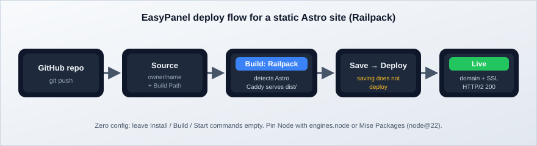

import Button from "../../components/widgets/Button.astro";
import { Picture } from "astro:assets";
import YouTubeEmbed from "../../components/widgets/YouTubeEmbed.astro";
import Notice from "../../components/widgets/Notice.astro";
import ListCheck from "../../components/widgets/ListCheck.astro";
import Accordion from "../../components/widgets/Accordion.astro";
import Tabs from "../../components/widgets/Tabs.astro";
import Tab from "../../components/widgets/Tab.astro";
import imag1 from "../../assets/images/23/11/easypanel-general.png";
import imag2 from "../../assets/images/23/11/ep-domains.png";

Astro renders pages to static HTML by default. Fast load times, no runtime to babysit. You can mix React, Svelte, Vue, or plain Astro components in one project. Astro 7 (June 2026) rewrote the compiler in Rust, and [Astro 7 builds are 15 to 61% faster](https://www.bitdoze.com/astro-7-faster-builds/). The deploy flow for static sites did not change.

This guide walks through deploying an Astro static site on your own VPS with [EasyPanel](https://easypanel.io/). EasyPanel is a self-hosted PaaS on top of Docker with a web UI for apps, databases, and SSL. If it is not installed yet, read the [EasyPanel review (2026)](https://www.bitdoze.com/easypanel-modern-server-control-panel/) first.

**2026 update:** Nixpacks is in maintenance mode, and EasyPanel now recommends **Railpack** as the automatic builder for new apps. This guide is rewritten around Railpack. Railpack serves a static Astro build with zero config (no `serve` package, no custom `start` script), so the old workaround is now a legacy path at the bottom of Step 3.

**Related articles:**

- [Deploy Astro on a VPS with CloudPanel](https://www.bitdoze.com/deploy-astro-on-vps/)
- [Coolify Install: A Free Heroku and Netlify Self-Hosted Alternative](https://www.bitdoze.com/coolify-install-heroku-alternative/)
- [How To Deploy An Astro.JS Blog On Cloudflare](https://www.bitdoze.com/deploy-astrojs-cloudflare/)
- [How To Monitor Server and Docker Resources](https://www.bitdoze.com/sever-monitoring/)

## Prerequisites

Before you start:

<ListCheck>
<ul>
<li>A VPS with EasyPanel installed: fresh Ubuntu, 2 GB RAM minimum, ports 80 and 443 free. Install is one curl command, covered in the <a href="https://www.bitdoze.com/easypanel-modern-server-control-panel/">EasyPanel review</a>.</li>
<li>A GitHub account.</li>
<li>Node.js v22.12.0+ on your local machine, required by Astro 7. You can <a href="https://www.bitdoze.com/install-nodejs-using-nvm-macos-ubuntu/">install Node.js 22 with NVM</a> in a couple of minutes.</li>
<li>A domain with an A record pointed at your VPS IP. You can defer this. EasyPanel gives every service an automatic domain, so the site works before DNS is involved.</li>
</ul>
</ListCheck>

A 2 GB VPS runs this setup fine, on the order of €4-6/month, and the EasyPanel free plan covers up to 3 projects. That is the whole monthly bill for a personal site.

If you don't have a VPS yet, Hetzner is the cheap reliable default I use for this kind of box:

<Button link="https://go.bitdoze.com/hetzner" text="Hetzner €20 free credit" />
<Button link="https://go.bitdoze.com/hostinger-vps" text="Hostinger VPS" />

EasyPanel also ships marketplace images on [DigitalOcean](https://go.bitdoze.com/do) and [Vultr](https://go.bitdoze.com/vultr) if you want the panel preinstalled.

_VPS prices jumped across the board in 2026. If you're rethinking a rented box, see [what changed and when a mini PC wins](https://www.bitdoze.com/vps-price-increases/)._

## Video walkthrough

<YouTubeEmbed
  url="https://www.youtube.com/embed/l-yohC7xD38"
  label="Deploy Astro on Your VPS with EasyPanel"
/>

<Notice type="info" title="The video shows the older Nixpacks UI">
The flow in the video is still the same: repo, project, build, deploy, domain. In the Build step, pick **Railpack** instead of Nixpacks. The text steps below are current for 2026.
</Notice>

## Step 1: Create a GitHub repository

Create a new repo on GitHub. Public or private both work. For a private repo you need a GitHub token in EasyPanel under **Settings > GitHub**. A classic personal access token needs the `repo` and `admin:repo_hook` scopes (the second one only if you want auto-deploy; details in Step 6).

If you need help setting up SSH keys, see [Link GitHub with a SSH key on macOS or Linux](https://www.bitdoze.com/link-github-with-ssh-maco-linux/).

Clone the empty repo locally:

```sh
git clone git@github.com:yourusername/your-astro-site.git
cd your-astro-site
```

## Step 2: Initialize Astro

Run the Astro CLI wizard inside your repo directory:

```sh
npm create astro@latest
```

When prompted (prompt wording shifts a bit between minor releases, but the questions are stable):

- **Project name:** use `.` to scaffold in the current directory
- **Template:** pick a starter template, or "Empty" for a blank project
- **Install dependencies:** yes
- **Initialize git repo:** no (you already have one)

This creates the standard Astro project structure with `src/`, `public/`, and `astro.config.mjs`. The scaffolded `package.json` scripts (`dev`, `build`, `preview`) are all you need for the Railpack path. You do not add a `start` script.

Astro still defaults to static output (`output: 'static'`) unless you opt into SSR. That is what we want for this guide; the SSR case is covered in the FAQ.

## Step 3: Configure Astro for static hosting on EasyPanel

Astro outputs static HTML into `dist/`. EasyPanel needs a builder to compile that output and serve it. Three paths, two recommended:

1. **Railpack**: zero config, the default choice for new services.
2. **Custom Dockerfile**: when you want full control over the runtime image.
3. **Nixpacks + `serve`**: legacy, kept only for services that already use it.

### Option A: Railpack zero-config build (recommended)

Railpack (from the Railway team, built on BuildKit) detects Astro when `astro.config.js` exists and the output type is not `server`. It runs your `build` script, finds the output directory (defaults to `dist`), and serves it with **Caddy**. No `serve` package. No `start` script.

Keep the scaffolded scripts and pin the Node version Astro 7 requires:

```json
{
  "scripts": {
    "dev": "astro dev",
    "build": "astro build",
    "preview": "astro preview"
  },
  "engines": { "node": ">=22.12.0" }
}
```

Railpack reads `engines.node` to pick the build Node version. Alternatives that work the same way: a `.node-version` file, a `mise.toml`, or EasyPanel's **Mise Packages** field (`node@22`) in the service settings. Use one of these (not none) or you inherit whatever default the builder ships with, which is exactly how "works locally, fails in the panel" starts.

<Notice type="success" title="Zero config">
Leave the Install, Build, and Start commands empty in EasyPanel. Railpack detection runs `npm install` and `npm run build`, then serves `dist/` with Caddy. Anything you type in those fields overrides the detection, so only do it when detection is wrong.
</Notice>

Railpack caches `node_modules` and `.astro` between builds on the same server, so redeploys of a small blog are fast once the first image is built.

One ecosystem note: Railpack is the same builder family you get in Dokploy. I cover [Railpack in Dokploy](https://www.bitdoze.com/dokploy-python-railpack-uv/) with a Python/uv project if you want to see the detection output on a different stack.

### Option B: Custom Dockerfile for full control

If you prefer an explicit image, drop a `Dockerfile` in the project root:

```dockerfile
FROM node:22-alpine AS build
WORKDIR /app
COPY package*.json ./
RUN npm ci
COPY . .
RUN npm run build

FROM joseluisq/static-web-server:2-alpine
COPY --from=build /app/dist /public
ENV SERVER_PORT=80
```

`static-web-server` is on v2.44.x at the time of writing; the `2-alpine` tag tracks the 2.x line and is still current.

Two EasyPanel specifics worth knowing: Dockerfiles are built with **Docker Buildx**, and EasyPanel exposes `GIT_SHA` (the deployed commit) to builds for repo deployments. In a Dockerfile, opt in with `ARG GIT_SHA` if you want to bake the commit into the image (handy in a footer or a `/healthz` endpoint).

When a `Dockerfile` exists, EasyPanel auto-selects the Dockerfile builder. You can also pick it explicitly in the Build section.

### Legacy: the Nixpacks + `serve` path

<Notice type="warning" title="Nixpacks is in maintenance mode">
The Nixpacks docs carry a banner saying the project is in maintenance mode and recommending Railpack as the replacement. Use this path only to keep an existing Nixpacks service alive. For anything new, pick Railpack explicitly. EasyPanel only falls back to Nixpacks when there is no Dockerfile and you did not choose another builder.
</Notice>

If you maintain an old service, or you want the same behavior the pre-2026 version of this guide used:

```sh
npm install serve
```

```json
{
  "scripts": {
    "dev": "astro dev",
    "start": "serve dist/",
    "build": "astro build",
    "preview": "astro preview"
  }
}
```

Nixpacks picks up the `build` script, then the `start` script serves `dist/`. `serve` is still maintained (v14.2.x), so nothing breaks today. It is just a dependency and a start command you no longer need on the Railpack path.

## Step 4: Verify the build locally

Pre-flight before you push. Debugging here is much easier than in deployment logs.

```sh
npm run build
npm run preview
```

`astro preview` starts Astro's own preview server on `http://localhost:4321`. Open it, click through a couple of pages, confirm the CSS and images load.

**What broken looks like:** `npm run build` exiting non-zero, or the preview serving unstyled HTML. Fix both here. Astro 7's Rust compiler is strict about markup: unclosed tags and unterminated attributes are hard build errors now, not silently corrected. If the build errors on markup locally, it will error the same way in EasyPanel.

## Step 5: Push to GitHub

```sh
git add .
git commit -m "initial astro site"
git push
```

Once the webhook from Step 6 is on, every later push here triggers a new deployment.

## Step 6: Deploy in EasyPanel

### Create a project and App service

1. In EasyPanel, click **Create Project**.
2. Inside the project, click **Service** and select **App**.
3. Connect your GitHub repository (token flow from Step 1 if the repo is private).

Every App service gets an **automatic `*.easypanel.host` domain**. That means you can verify the deployment end to end before DNS is configured. Do that first, add the custom domain last.

### Configure the Railpack build



In the **Source** section, set the repository owner and name:

<Picture formats={["webp"]} fallbackFormat="webp"
  src={imag1}
  alt="EasyPanel App service Source settings showing GitHub repository owner and name fields"
/>

Monorepos: set **Build Path** to the directory containing `package.json` and `astro.config.mjs`. Leave it empty for a single-site repo.

In the **Build** section:

- Pick **Railpack** from the builder dropdown. This is the important step. The fallback is Nixpacks, and Railpack is not auto-selected.
- Leave **Install Command**, **Build Command**, and **Start Command** empty. Railpack detection runs `npm install` + `npm run build` and serves `dist/` with Caddy.
- Optional Node pin: Mise Packages → `node@22` (or rely on `engines.node` from `package.json`).

<Notice type="warning" title="Save is not Deploy">
Changing and saving the builder does not deploy anything. You must click **Deploy** after saving, or the running container stays on the old build.
</Notice>

Click **Save**, then **Deploy**, and open the deployment action log. EasyPanel streams detection, dependency installation, compilation, and image creation output. The detection line should say Astro.

### Verify the deployment

Before touching DNS:

<ListCheck>
<ul>
<li>Railpack detection line in the build log says Astro, and the build exits cleanly.</li>
<li>Open the automatic <code>*.easypanel.host</code> URL. The site renders with styles and images.</li>
<li><code>curl -I https://your-automatic-domain</code> returns <code>HTTP/2 200</code> (you should also see a Caddy or Traefik <code>server</code> header; Traefik fronts the service and Caddy serves the static files on the Railpack path).</li>
<li>Optional but useful: echo <code>GIT_SHA</code> (injected into builds for repo deployments) somewhere on the page so you always know which commit is live.</li>
</ul>
</ListCheck>

If the automatic domain serves the site, the app is healthy. Anything left is DNS and certificates.

### Enable auto-deploy with a GitHub webhook

Auto-deploy triggers a new build on every push to the repo. Two ways to set it up:

<Tabs>
<Tab name="Auto Deploy button">

If you connected EasyPanel with a GitHub token, open the service and use the **Enable Auto Deploy** toggle (labeled "Auto Deploy" on older UIs). It creates the GitHub webhook for you. The matching **Disable Auto Deploy** state removes it.

Classic personal access token scopes: `repo` and `admin:repo_hook` (the second one is what lets EasyPanel create the webhook). Fine-grained tokens are supported too.

</Tab>
<Tab name="Manual webhook">

Copy the webhook URL from **General** in your project settings. In your GitHub repo go to **Settings > Webhooks**, add the URL, and set the content type to `application/json`. GitHub sends a test ping on save; the recent deliveries list should show a green 200.

</Tab>
</Tabs>

If pushes are not triggering builds, see Troubleshooting below.

### Add your custom domain (free SSL)

<Picture formats={["webp"]} fallbackFormat="webp"
  src={imag2}
  alt="EasyPanel Domains screen with an A record domain and automatic Let's Encrypt SSL"
/>

1. Create an **A record** in your DNS provider pointing the domain (or subdomain) at your VPS IP. DNS propagation is usually minutes, sometimes longer. Check with `dig +short yourdomain.com` before blaming EasyPanel.
2. In EasyPanel, open **Domains** for the service and add the domain.
3. EasyPanel provisions a Let's Encrypt certificate automatically through Traefik. Wildcard domains are supported too if you need them.

Verify after the cert is up:

```sh
curl -I https://yourdomain.com
```

Expect `HTTP/2 200` and a valid certificate chain (`openssl s_client -connect yourdomain.com:443 -servername yourdomain.com | openssl x509 -noout -dates` if you want to see the expiry).

## Project structure tips

For a typical Astro blog or documentation site:

```
your-astro-site/
├── src/
│   ├── pages/          # Route-based pages
│   ├── content/        # Markdown/MDX content
│   ├── components/     # Reusable UI components
│   └── layouts/        # Page layouts
├── public/             # Static assets (images, fonts)
├── astro.config.mjs    # Astro configuration
├── package.json
└── tsconfig.json
```

For most blogs, `src/content/` and `public/` are the only directories you touch regularly. Integrations run at build time, so adding one does not change the deploy flow.

```sh
npx astro add mdx sitemap
```

This installs and configures the MDX and sitemap integrations automatically.

## Railpack extras: output dir, SPA mode, and a custom Caddyfile

Railpack works with zero config for a standard Astro build, but there are four knobs worth knowing:

- If your build does not emit into `dist`, set the `RAILPACK_SPA_OUTPUT_DIR` environment variable to the right directory. Auto-detection covers `dist` for Astro.
- Set `RAILPACK_NO_SPA=1`, or give the service a custom start command, when you want Railpack to run your Node server instead of serving files (the SSR case, see the FAQ).
- Unknown paths return 404 and serve `404.html` when it exists. `index_fallback` defaults to `false`. That is correct for a classic multi-page Astro blog: you want a real 404, not the homepage. Only a client-side-routed SPA build wants `index_fallback: true`, set in a `Staticfile` at the project root.
- Drop a `Caddyfile` in the project root to override Railpack's default template: cache headers, redirects, extra security headers.

Build-time secrets (a private CMS token, for example) are safe to pass: EasyPanel forwards project and service env vars to Railpack builds as BuildKit secrets, so they do not end up in the image layers.

## What EasyPanel gives you beyond the build

The build is half the reason to run a panel. The other half is everything you do not have to script:

<ListCheck>
<ul>
<li>Automatic HTTPS comes from Traefik on 80/443: Let's Encrypt issues and renews the certificate per domain.</li>
<li>A deploy-trigger webhook fires a deployment when its URL is hit. This is the clean fix for CMS-driven sites. Your CMS publishes, CI hits the webhook, and you are done.</li>
<li>HTTP Basic Auth is per-service and per-domain, from the Security tab. Good for staging before you point a real domain at it.</li>
<li>Resource limits cap CPU and memory per service (0 = no limit). Set these on small VPSes so a memory-hungry build cannot take the box down.</li>
<li>Maintenance mode swaps domain traffic to a maintenance page while you fix things.</li>
<li>Replicas run multiple containers of one service. Overkill for a blog, useful when an SSR app needs more than one process.</li>
<li>The deployed commit is injected into builds as <code>GIT_SHA</code>.</li>
</ul>
</ListCheck>

**Undo / rollback:** delete the service (or the whole project) in EasyPanel and disable the GitHub webhook on the repo. Those two actions fully reverse a deployment. For leftover images and volumes on the box, [clean up unused Docker images and reclaim disk space](https://www.bitdoze.com/cleanup-all-docker-things/). To roll back to a previous commit rather than tear down: `git revert` or reset the branch and push, and the webhook rebuilds the old state.

**Hardening:** once the site is public, fronting it with a CDN such as [Bunny.net CDN](https://go.bitdoze.com/bunny) keeps static assets off your VPS and hides the origin IP. Keep SSH key-only, and do not expose any Docker daemon ports.

## Troubleshooting

**Build fails in EasyPanel but works locally.** Node version mismatch. Your laptop runs 22.x, the builder runs something older. Pin it: `"engines": { "node": ">=22.12.0" }` in `package.json`, a `.node-version` file, or Mise Packages `node@22` in the service settings. If the build is slow rather than failing, [speed up large Astro builds](https://www.bitdoze.com/astro-ssg-build-optimization/).

<Notice type="warning" title="New failure class with Astro 7">
Astro 7's Rust compiler treats unclosed tags and unterminated attributes as hard build errors. If the log points at markup that "looks fine in dev", run `npm run build` locally (it fails the same way there) and fix the HTML. Dev mode is more forgiving than the production compiler.
</Notice>

**Blank page or 404 instead of the site.** On the Railpack path this is almost always a wrong start command or the wrong output directory. Clear the Start command (static Astro needs none; Caddy serves `dist/`), confirm `dist/` is the build output dir, and set `RAILPACK_SPA_OUTPUT_DIR` if it is not. If you are running Astro in SPA mode and deep links 404, that is the `index_fallback` behavior described above.

**Deployments don't trigger on push.** Check the webhook first: GitHub repo → **Settings > Webhooks** → the payload URL must match EasyPanel's webhook URL, content type `application/json`, and the last delivery must be a 200. Also confirm the Auto Deploy toggle is enabled on the service.

**Build OOM or the server freezes during deploy.** An Astro build can spike memory on a 2 GB box, especially with image processing. Set a CPU/memory limit on the service so the build cannot starve Docker itself, close other services while deploying, or add swap. If builds are consistently tight on RAM, that is your signal to move to 4 GB or build with more headroom.

**Large Docker images or disk filling up.** Nixpacks and BuildKit layers accumulate fast on a small disk. The Dockerfile multi-stage build above keeps the runtime image tiny. For the debris, [clean up unused Docker images and reclaim disk space](https://www.bitdoze.com/cleanup-all-docker-things/) with `docker system prune` and friends.

**External content not rebuilding.** If the site pulls from a CMS (Sanity, Contentful, and so on), a git push does not fire when only the CMS changed. Hit **Force Rebuild** in EasyPanel. It builds without the Docker cache, which is what you want when content lives outside the repo. The cleaner fix is the deploy-trigger webhook from the section above: the CMS publish step (or its webhook) calls the URL and EasyPanel rebuilds. The `CACHEBUST` env var trick (bump it before a rebuild) still works in a pinch. If you are still [picking a headless CMS for Astro](https://www.bitdoze.com/best-headless-cms-for-astro/), favor one with publish webhooks so you never think about this again.

## FAQ

<Accordion label="Is EasyPanel free?" group="faq" expanded="true">
Yes, and the free tier is real: up to **3 projects**, unlimited services, unlimited deployments, basic monitoring. That covers most personal sites: a blog, a docs site, a staging app. Paid tiers exist for more projects and pro features: Hobby at $14.9/server/month ($10.9 on annual), Growth at $23.9 ($16.9 annual), Business at $37.9 ($29.9 annual), with a 30-day money-back guarantee. Pricing checked October 2026. Re-verify before you buy. The VPS itself is a separate bill: roughly €4-6/month for the 2 GB box this guide needs.
</Accordion>

<Accordion label="Railpack vs Nixpacks: what changed?" group="faq">
Nixpacks is officially in maintenance mode; its docs recommend Railpack as the replacement. EasyPanel now lists Railpack as the preferred automatic builder for new applications and positions Nixpacks for legacy apps. Practically: Railpack is zero-config for static Astro (runs `build`, serves `dist/` with Caddy), caches dependencies between builds, and is actively developed. Nixpacks still works and still needs the `serve` + `start` script dance described in the legacy section. Pick Railpack explicitly in the Build dropdown; EasyPanel falls back to Nixpacks otherwise.
</Accordion>

<Accordion label="Does Astro 7 change the deploy flow?" group="faq">
No. Static output is still the default, the `dist/` directory is the same, and everything in this guide worked the same way on Astro 5 and 6. What you get with Astro 7 is a Rust compiler (builds 15 to 61% faster on large sites), Vite 8, and strict markup errors at build time. The Node floor moved up: `engines.node` must be `>=22.12.0`. Astro 6 already dropped Node 18 and 20, so anything running Astro 6 is already on Node 22. Set the pin and you will not notice a difference beyond faster builds.
</Accordion>

<Accordion label="Can I host SSR (server output) Astro on EasyPanel?" group="faq">
Yes. Select Railpack or a Dockerfile, and do not use the static/SPA serving mode. For `output: 'server'` (or hybrid) Railpack runs the Node server instead of serving files. Set `RAILPACK_NO_SPA=1` or give the service an explicit start command (typically `node dist/server/entry.mjs` for an Astro SSR build), make sure the app listens on the port EasyPanel expects, and let the proxy handle TLS. Same VPS, same panel. The difference is the app keeps a Node process running instead of Caddy serving static files.
</Accordion>

## Conclusions

Deploying Astro on EasyPanel in 2026 is a short job: GitHub repo, `npm create astro@latest`, push, Railpack build, Deploy button, domain. Railpack removed the fiddly part (no `serve` package, no `start` script), and EasyPanel gives you auto SSL, a deploy webhook, and resource limits without extra tooling.

The free plan supports up to 3 projects (paid tiers start at $10.9/server/month on annual), and you still only pay for the VPS. A $0 panel plus a ~€5 VPS is the entire monthly bill for a personal site, cheaper than managed platforms like Netlify or Vercel, with full control over the box.

If you are choosing a panel rather than just following this guide, compare [how EasyPanel stacks up against Coolify, Dokploy, and Kamal](https://www.bitdoze.com/coolify-vs-dokploy-vs-kamal-2/), or scan the [best self-hosted server panels](https://www.bitdoze.com/best-self-hosted-panels/). And if you want the zero-cost path with no server at all, you can [build a free Astro blog with Cloudflare instead](https://www.bitdoze.com/build-astro-blog-free/).

<Button link="https://go.bitdoze.com/hetzner" text="Hetzner €20 free credit" />
<Button link="https://go.bitdoze.com/hostinger-vps" text="Hostinger VPS" />
