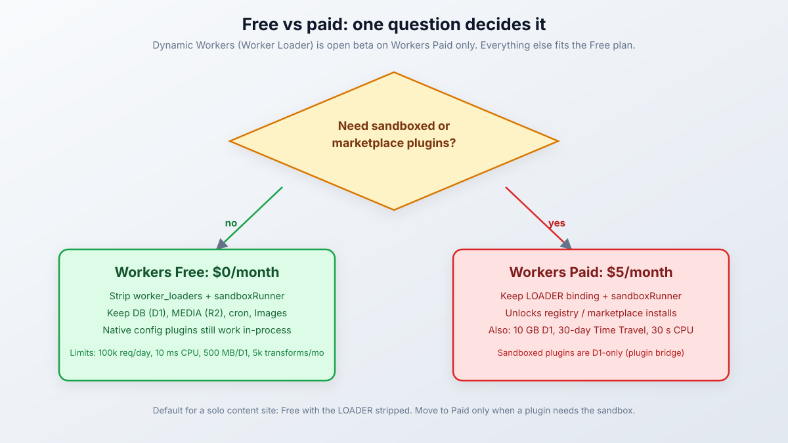
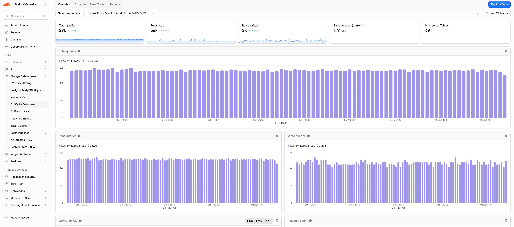
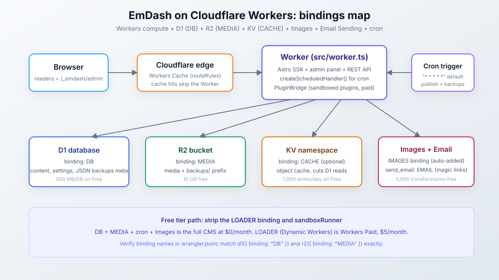
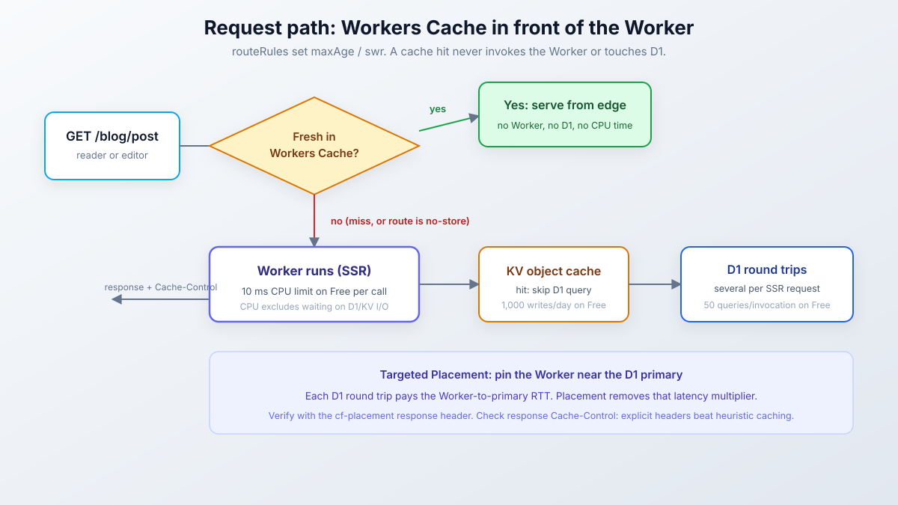
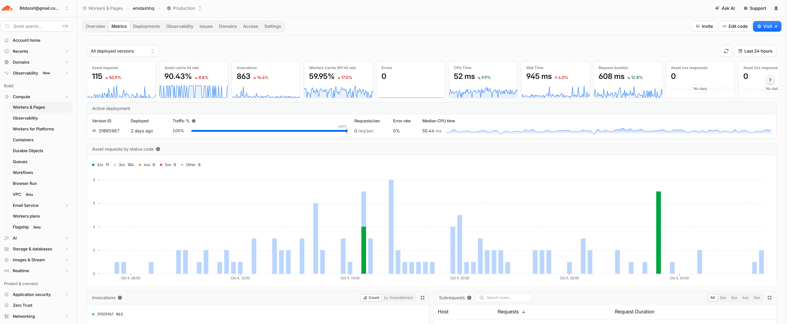
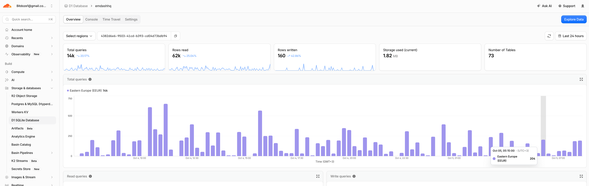

import Button from "@components/widgets/Button.astro";
import Notice from "@components/widgets/Notice.astro";
import ListCheck from "@components/widgets/ListCheck.astro";
import Accordion from "@components/widgets/Accordion.astro";
import Tabs from "@components/widgets/Tabs.astro";
import Tab from "@components/widgets/Tab.astro";
import YouTubeEmbed from "@components/widgets/YouTubeEmbed.astro";

You can deploy EmDash on Cloudflare Workers for $0/month, if you know which bindings to strip and which limits to watch. EmDash is Cloudflare's MIT-licensed, Astro-based CMS. 1.0 shipped in late September 2026, and Cloudflare runs its own blog on it. One deployment carries the site, the admin panel at `/_emdash/admin`, a REST API, passkey auth, a media library, scheduled publishing, and JSON backups. D1 holds the content, R2 holds the media.

The free tier is real, and it has one hard edge: the stock template ships a `LOADER` binding for sandboxed marketplace plugins, and Dynamic Workers is open beta on Workers Paid only ($5/month). Strip that binding and a plain site runs at $0. Keep it and you pay $5. That trade, plus every free-plan limit that will bite you, is what this guide covers end to end: bindings, deploy, domain, caching, media, secrets, real monthly cost, and a checklist that proves the deploy works.

If you are still deciding on the CMS itself, read [our six-month EmDash CMS review](/emdash-cms-review/) first. EmDash also joins our list of [self-hosted apps that run entirely on Cloudflare Workers](/self-hosted-apps-cloudflare-workers/). My own [emdashhq.com](https://emdashhq.com/), a hub for EmDash tutorials, themes and plugins, runs on the exact stack this guide deploys; its real dashboard numbers are near the end.

<Button text="EmDash on GitHub" link="https://github.com/emdash-cms/emdash" variant="solid" color="blue" size="md" icon="arrow-right" />

<YouTubeEmbed
  url="https://www.youtube.com/embed/VIDEO_ID"
  label="Deploy EmDash on Cloudflare Workers"
/>

## What deploying EmDash on Cloudflare Workers costs

Before the how, the money question. EmDash on Cloudflare is not one product, it is seven services stitched together by bindings: Workers runs the code, D1 stores content, R2 stores media, KV can cache query results, a cron trigger publishes scheduled posts and writes backups, an Images binding does transforms, and Email Sending delivers magic links. Every one of those has a free allocation and a paid floor.

There are two honest outcomes:

- **$0/month.** Workers Free plus D1 free plus R2 free plus the free Images allowance. This is a complete CMS for a personal blog or a small brochure site. It costs nothing and it never will, as long as traffic and media stay inside the free allocations below. One non-obvious gate: R2 does not activate until the account has a credit card or PayPal saved as a payment method — nothing is charged inside the free allowance, but the first deploy fails until it exists.
- **$5/month.** Workers Paid. That is the floor the moment you want sandboxed marketplace plugins (SEO helpers, form handlers, anything from the plugin registry). It also buys 30-day D1 Time Travel, 10 GB per D1 database, and real CPU headroom.

<Notice type="info" title="The one-line version">
Free is real, but the template ships a paid-only binding. We strip it in the bindings section below and the deploy works fine without it.
</Notice>

Two numbers to know before you start. First, the template's default cron is `* * * * *`, every minute. That burns 1,440 invocations/day against the free plan's 100,000 daily request budget before a single visitor shows up. Fine for a small site, but it is 1.4% of your daily allowance spent on scheduling. Second, request volume is the usual reason a free EmDash site starts erroring, not storage. Most content databases stay far below the D1 size cap; the 100k requests/day ceiling is what growing sites hit first.

The cost and ops math for this stack is the same story we cover in [the Astro vs WordPress cost and ops breakdown](/astro-vs-wordpress/): the hosting line goes to zero when the compute goes to zero, and what you pay instead is attention to limits.

## EmDash on Cloudflare free tier: what $0 gets you

On Workers Free you get the full CMS. Admin panel, REST API, passkey auth, media library, scheduled publishing, JSON backups, image transforms, magic-link capable auth (needs a plugin setup, noted below). What you give up is the plugin marketplace: sandboxed plugins need Dynamic Workers, which is paid-only. Native config plugins, the ones listed in `plugins: []` in `astro.config.mjs`, still run in-process on free.

**Free tier is enough if:**

<ListCheck>
<ul>
<li>It is a personal blog, portfolio, or brochure site</li>
<li>You do not need sandboxed or marketplace plugins</li>
<li>Traffic stays under roughly 100k requests/day</li>
<li>Media stays under the R2 free allowance (10 GB storage)</li>
<li>Your content database stays well under 500 MB (metadata-heavy WordPress imports excepted)</li>
<li>One editor or a small team, not a newsroom</li>
</ul>
</ListCheck>

**You need Workers Paid ($5/month) if:**

<ListCheck>
<ul>
<li>You want sandboxed plugins from the registry or marketplace</li>
<li>You need a D1 database larger than 500 MB</li>
<li>You want 30-day D1 Time Travel instead of 7-day</li>
<li>You publish heavily and need headroom on KV writes or cron CPU</li>
<li>SSR responses regularly blow past 10 ms of CPU time per invocation</li>
</ul>
</ListCheck>

### Free vs paid: the limits table that matters

This is the table to keep open while you decide. Figures are from Cloudflare's own pricing and limits pages as of the dates stamped in each source (Workers pricing updated Aug 28, 2026; Workers limits Sep 5, 2026; D1 limits Apr 21, 2026; R2 pricing Aug 7, 2026; Images pricing Jul 8, 2026; Email Service limits Sep 25, 2026). Re-check the pages before you budget, these numbers move.

| Capability | Workers Free | Workers Paid ($5/month base) |
|---|---|---|
| Price | $0 | $5/month minimum; +$0.30/M requests over 10M; +$0.02/M CPU-ms over 30M |
| Worker requests | 100,000/day (resets 00:00 UTC, then error 1027) | 10M/month included |
| CPU time | 10 ms per invocation (HTTP and cron) | 30s default, up to 5 min |
| Cron wall time | 15 min | 15 min |
| Cron triggers | 5 per account | 250 per account |
| Subrequests | 50 per request | 10,000 per request |
| Dynamic Workers (sandboxed plugins) | not available | open beta |
| D1 rows read / written | 5M/day / 100k/day | 25B/month / 50M/month included |
| D1 database size | 500 MB per DB, 5 GB/account, 10 DBs | 10 GB per DB, 1 TB/account |
| D1 queries per invocation | 50 | 1,000 |
| D1 Time Travel (PITR) | 7 days | 30 days |
| R2 storage / ops | 10 GB-month; 1M Class A (writes)/month; 10M Class B (reads)/month; egress free | $0.015/GB-month; $4.50/M Class A; $0.36/M Class B |
| KV reads / writes | 100k/day / 1,000/day; 1 GB | 10M + $0.50/M / 1M + $5.00/M; 1 GB + $0.50/GB-month |
| Images (unique transforms) | 5,000/month, then error 9422 on new transforms | 5,000 included + $0.50 per 1,000 |
| Email Sending | works from Workers; new accounts get a conservative auto-ramping daily quota | same mechanics, higher limits on request |
| Static asset requests | free and unlimited | free and unlimited |
| Workers Logs | 200k events/day, 3-day retention | 20M/month included, 7-day retention |

Three things the table does not say out loud:

1. **CPU time excludes I/O wait.** Time spent waiting on D1, KV, or `fetch` does not count against the 10 ms. The problem is the CPU you do use: EmDash SSR makes several D1 round trips per request and assembles responses in Worker code. That is exactly the workload the docs tell you to watch on the free limit. Caching (below) is the mitigation; upgrading is the other one.
2. **Admin responses are never cached.** EmDash sends `Cache-Control: private, no-store` on admin and API routes, so editor traffic does not poison your edge cache. It does mean every admin click is a Worker invocation against your daily budget.
3. **Workers Cache hits still count as requests.** On free, a cache hit is cheaper (no CPU), but it is not free of the request counter. Budget accordingly.

<Notice type="warning" title="Error 1027 locks everyone out, editors included">
When the 100k/day request cap is exhausted, Cloudflare returns error 1027 for further requests. Decide per route whether you prefer fail-open or fail-closed behavior when that happens. A site that grows past 100k requests/day usually discovers this as "the editors cannot get into the CMS at midday", which is a bad way to learn about your traffic.
</Notice>

### The Dynamic Workers catch: sandboxed plugins need paid

This is the recurring confusion on Reddit and in the forums, so it deserves its own section. The EmDash template ships with `worker_loaders` configured by default. Dynamic Workers, the Worker Loader API that runs sandboxed plugins, is in open beta and available to **all paid Workers users**. On a free account, deploying the default template fails or plugin installs refuse to work. If you searched "cloudflare emdash free" and hit a wall, this is almost always the wall.

<Notice type="error" title="This is why your free deploy failed">
Deploying the unmodified template on a free account trips over the `LOADER` binding. The official escape hatch from the deployment docs: if the site does not use marketplace, registry, or `sandboxed` plugins, omit `sandboxRunner` and the `LOADER` binding entirely. The CMS works without them.
</Notice>

The split is clean:

- **Free plan:** full CMS, native config plugins only (`plugins: []` in `astro.config.mjs`, run in-process). No marketplace, no registry, no sandboxed plugins.
- **Workers Paid ($5/month):** sandboxed plugins from the registry install into your R2 bucket and run as Dynamic Workers with per-plugin capability checks (`content:read`, `email:send`, and so on).

One more constraint if you do go paid: sandboxed plugins are D1-only. The sandbox plugin bridge talks to a D1 binding directly, so if you were planning exotic database adapters with sandboxed plugins, do not.



## What you need before deploying EmDash

Nothing exotic, and nothing outside Cloudflare. No VPS, no Docker, no external S3 account, no third-party email provider required.

<ListCheck>
<ul>
<li>A Cloudflare account (Free plan works if you strip the sandbox bindings)</li>
<li>A credit card or PayPal saved on the account as a payment method — R2 will not activate without one, even though 10 GB of storage is free; the first deploy blocks on it</li>
<li>A domain already active on Cloudflare DNS, in the <strong>same account</strong> as the Worker (required for custom domains)</li>
<li>Node.js 20+ and pnpm or npm</li>
<li>Wrangler authenticated: <code>pnpm wrangler login</code></li>
<li>An EmDash project with the Cloudflare adapter in place (next section)</li>
<li>30 to 60 minutes for the full path, including verification</li>
</ul>
</ListCheck>

Local development does not need any of the Cloudflare pieces. The Node.js/SQLite path with `local()` storage and the console email stub runs on a laptop. If you have not built a site locally yet, follow the [EmDash CMS tutorial](/emdash-cms-tutorial/) first, then come back here for the deploy.

## Two starting points: EmDash template or existing Astro site

You either scaffold fresh or port what you have. Both land in the same place: `wrangler.jsonc` with named bindings, `src/worker.ts`, and an EmDash integration wired to D1 and R2. My default for a new site is template-first. It is fewer moving parts and the binding names already match.

<Tabs>
<Tab name="From a template">

```bash
npm create emdash@latest
# pick a Cloudflare template: blog, marketing, portfolio, starter, or blank
npm install
npx wrangler login
npm run build
npm run deploy
```

Cloudflare templates include the complete Worker entry point and the named D1 and R2 bindings preconfigured. You edit names and secrets, you do not write plumbing. This is the path I would take tonight.

</Tab>
<Tab name="Existing Astro site">

It is a config port, not a rewrite. Your Astro pages keep working; EmDash adds `/_emdash` and the collections layer. Four things to add:

1. The `@astrojs/cloudflare` adapter and the `emdash` integration with `d1()` / `r2()` adapters.
2. `src/worker.ts` with the EmDash handler and scheduled handler.
3. Bindings in `wrangler.jsonc`.
4. `react()`, because the admin UI is a React app.

If the existing site is large, budget some build-time sanity checking while you convert. For what changed in the current compiler, see [Astro 7 build-time benchmarks](/astro-7-faster-builds/). And if you are still choosing a CMS at all rather than committing to EmDash, [the best headless CMS options for Astro](/best-headless-cms-for-astro/) puts this stack against the git-based and hosted alternatives.

</Tab>
</Tabs>

<Notice type="warning" title="Rebuilding a template does not preserve your data">
Never re-scaffold over a live site. Content lives in the database, not the repo, but a re-scaffold can still orphan your setup state and seed a database you did not intend to touch. Scaffold in a new directory, deploy, migrate content deliberately.
</Notice>

## A third starting point: the free Biolink theme

If what you want is a link-in-bio page rather than a blog, skip the scaffolding entirely. [Biolink](https://github.com/bitdoze/emdash-biolink-theme) is a free EmDash theme I maintain for exactly that: profile header, 30+ social icons, link cards, link lists, project cards, text, image and embed blocks, all edited as reorderable blocks in the admin. Ten color schemes, light/dark/system modes, per-page theming, and no plugins required, which means it runs on Workers Free with nothing stripped out.

Two deploy paths:

1. **The Deploy to Cloudflare button** in the repo README hands the repo to Workers Builds, which walks you through a form and then clones, builds and deploys for you. What the form asks for:
   - A **project name** and a **GitHub connection** — you authorize GitHub, and Workers Builds creates a private repository under your account that it then builds from on every push.
   - A **new D1 database** (name and location) and an **R2 bucket** (location hint) — the defaults are fine.
   - An **`EMDASH_ENCRYPTION_KEY`** — the one field you bring yourself. Generate it first from any EmDash checkout with `npx emdash secrets generate` and paste it into the form.
   - The build commands come prefilled (`npm run build` + `npm run deploy` equivalent); the run takes a minute or two with the logs streaming in the dashboard.

   Two things trip people up on this path. The first deploy **fails on R2** if the storage service is not yet active on the account — enabling it asks for the credit card or PayPal from the prerequisites, then you hit deploy again. And once the build finishes, `EMDASH_SITE_URL` still has to be set before the setup wizard (the notice below covers why).
2. **CLI**, if you want it local first:

```bash
npm create astro@latest -- my-links --template github:bitdoze/emdash-biolink-theme --no-ai
cd my-links
npm install
npx wrangler login
npm run deploy   # astro build && wrangler deploy
```

First deploy provisions the `emdash-biolink` D1 database and `emdash-biolink-media` R2 bucket by name, same as the template path above. Rename them in `wrangler.jsonc` if you want your own. `npm run dev` works without a Cloudflare account, on workerd with local D1 and R2 emulation, and the setup wizard seeds a Bio Pages collection plus a demo profile you can edit or replace.

<Notice type="warning" title="Set EMDASH_SITE_URL before you run the setup wizard">
Setup records the origin it runs on, and passkeys only work on that origin. After the first deploy, add a plain-text `EMDASH_SITE_URL` variable (Worker -> Settings -> Variables and Secrets) with the production URL, then run the wizard at `https://your-domain/_emdash/admin`, not on localhost or a preview URL. Change the value later and every passkey made on the old origin dies.
</Notice>

What does a deployed Biolink site cost to run? This is its D1 dashboard over 24 hours:



The flat ~400-queries-per-15-minutes rhythm is the every-minute cron doing its rounds: scheduled-publish checks, maintenance, backup bookkeeping. That is ~39k D1 queries and 1,440 Worker invocations a day with almost no visitor traffic, exactly the background cost the limits table above warns about. Total damage on Workers Free: $0, and 1.41 MB of storage used means the D1 size cap is not something this site will ever think about.

<Button text="Deploy Biolink to Cloudflare" link="https://deploy.workers.cloudflare.com/?url=https://github.com/bitdoze/emdash-biolink-theme" variant="solid" color="blue" size="md" icon="arrow-right" />
<Button text="Biolink theme on GitHub" link="https://github.com/bitdoze/emdash-biolink-theme" variant="outline" color="gray" size="md" icon="arrow-right" />

## The bindings explained: wiring EmDash to D1 and R2

This is the section the official deploy doc runs through quickly and the one where deploys fail in practice. EmDash's Cloudflare adapters bind to named resources by string. The names in `wrangler.jsonc` and the names in `astro.config.mjs` must match exactly, or you get "D1 binding not found" at request time.



### wrangler.jsonc: DB, MEDIA, LOADER and the every-minute cron

The template's config, annotated:

```jsonc
{
  "$schema": "node_modules/wrangler/config-schema.json",
  "name": "my-emdash-site",
  "main": "./src/worker.ts",
  "compatibility_date": "2026-02-24",
  "compatibility_flags": ["nodejs_compat"],
  "d1_databases": [
    { "binding": "DB", "database_name": "my-emdash-site" }
  ],
  "r2_buckets": [
    { "binding": "MEDIA", "bucket_name": "my-emdash-media" }
  ],
  "worker_loaders": [{ "binding": "LOADER" }],   // omit on Free plan
  "triggers": { "crons": ["* * * * *"] }
}
```

What each piece does and where it bites:

- **`DB` and `MEDIA` are contract names.** They must match `d1({ binding: "DB" })` and `r2({ binding: "MEDIA" })` in the EmDash integration config. Rename one side and you get a binding-not-found error on the first request.
- **Wrangler creates the D1 database and R2 bucket on first deploy if those names do not exist.** Keep the names stable. Changing `database_name` later does not move your content, it provisions a new empty database and your old one becomes an orphan.
- **`triggers.crons` is the every-minute default.** Scheduled publishing, plugin tasks, automatic JSON backups, and maintenance all ride on it. Adjust it, but adjust it in two places (next subsection).
- **Optional additions:** `"kv_namespaces": [{ "binding": "CACHE" }]` for the object cache, `"send_email": [{ "name": "EMAIL" }]` for magic links, `"images"` (usually auto-added by the adapter), `"routes"` for a custom domain, `"placement"` for targeted placement.

The free plan variant is one deletion. Side by side:

<Tabs>
<Tab name="Free plan (no sandboxed plugins)">

```jsonc
{
  "$schema": "node_modules/wrangler/config-schema.json",
  "name": "my-emdash-site",
  "main": "./src/worker.ts",
  "compatibility_date": "2026-02-24",
  "compatibility_flags": ["nodejs_compat"],
  "d1_databases": [
    { "binding": "DB", "database_name": "my-emdash-site" }
  ],
  "r2_buckets": [
    { "binding": "MEDIA", "bucket_name": "my-emdash-media" }
  ],
  "triggers": { "crons": ["* * * * *"] }
}
```

No `worker_loaders`. Pair it with `sandboxRunner` removed from `astro.config.mjs`. That is the entire free-tier delta.

</Tab>
<Tab name="Workers Paid (sandboxed plugins)">

```jsonc
{
  "$schema": "node_modules/wrangler/config-schema.json",
  "name": "my-emdash-site",
  "main": "./src/worker.ts",
  "compatibility_date": "2026-02-24",
  "compatibility_flags": ["nodejs_compat"],
  "d1_databases": [
    { "binding": "DB", "database_name": "my-emdash-site" }
  ],
  "r2_buckets": [
    { "binding": "MEDIA", "bucket_name": "my-emdash-media" }
  ],
  "worker_loaders": [{ "binding": "LOADER" }],
  "triggers": { "crons": ["* * * * *"] }
}
```

`worker_loaders` is the only structural difference. Keep the binding name `LOADER`, the adapter expects it.

</Tab>
</Tabs>

<Notice type="warning" title="Binding-name mismatch is the number one deploy failure">
"D1 binding not found" or "R2 binding not found" at runtime means the string in `wrangler.jsonc` and the string in `d1({ binding })` / `r2({ binding })` disagree. Check both files before you debug anything cleverer.
</Notice>

For content sites that would rather not run on D1 at all, the alternative in the Astro world is [Astro DB with a Bunny PostgreSQL database](/astro-db-bunny-database/). Inside EmDash on Cloudflare, though, D1 is the path of least resistance and the one the sandboxed plugin bridge requires.

Useful trick for the placement section later: `pnpm wrangler d1 info my-emdash-site` prints the D1 database details including its primary location. You will want that value.

### astro.config.mjs and src/worker.ts

The integration config:

```js
import { defineConfig } from "astro/config";
import cloudflare from "@astrojs/cloudflare";
import react from "@astrojs/react";
import emdash from "emdash/astro";
import { d1, r2, sandbox } from "@emdash-cms/cloudflare";

export default defineConfig({
  output: "server",
  adapter: cloudflare(),
  integrations: [
    react(), // required: admin UI is a React app
    emdash({
      database: d1({ binding: "DB" }),
      storage: r2({ binding: "MEDIA" }),
      sandboxRunner: sandbox(), // omit on Free plan
    }),
  ],
});
```

And the Worker entry:

```ts
import handler, { createScheduledHandler, PluginBridge } from "@emdash-cms/cloudflare/worker";

export { PluginBridge };
export default {
  ...handler,
  scheduled: createScheduledHandler(),
} satisfies ExportedHandler;
```

`createScheduledHandler()` is what runs scheduled publishing, plugin tasks, backups, and maintenance when the cron fires. `PluginBridge` is only needed for sandboxed plugins, but the docs recommend keeping it exported; it is harmless without them.

Two footguns in these files:

1. **Import paths drift between sources.** The GitHub README shows `import { d1 } from "emdash/db"` while the deployment docs use `@emdash-cms/cloudflare`. The project moves fast. Check what the generated template imports and quote that, not a blog post (including this one).
2. **If you change the cron expression, change it in both places.** `triggers.crons` in `wrangler.jsonc` and `createScheduledHandler({ generalCron: "..." })` must agree. If they differ, the handler logs and ignores the unexpected trigger. Scheduled publishing just stops, silently.

<Notice type="warning" title="Cron mismatch fails silently">
There is no error page when `triggers.crons` and `generalCron` disagree. Your scheduled posts sit unpublished and the logs only mention an unexpected trigger. Verify with `pnpm wrangler tail` after any cron change.
</Notice>

## First EmDash wrangler deploy: login, build, ship

```bash
pnpm wrangler login
pnpm build
pnpm wrangler deploy
```

First deploy provisions the D1 database and R2 bucket by name and returns a `workers.dev` URL immediately. Open it. You should get a rendered page (or the setup wizard if the database is empty).

Prove it worked before you move on:

<ListCheck>
<ul>
<li>The public page renders at the <code>workers.dev</code> URL</li>
<li><code>/_emdash/admin</code> loads the setup wizard (site identity + admin account; passkeys are the default auth)</li>
<li><code>pnpm wrangler tail</code> shows requests arriving while you browse</li>
</ul>
</ListCheck>

Failure looks like a 500 on the public page (then `wrangler tail` and read the message) or a missing-binding error (then the name-mismatch check above). The `workers.dev` URL is your clean signal that the app works before DNS enters the picture. Keep it alive while you add the custom domain.

### Migrations, seed data and the first request

EmDash defaults to `auto` migration mode. On Cloudflare that means the **first request** to the deployed Worker applies pending core migrations. The seed file (`.emdash/seed.json`, falling back to `package.json#emdash.seed`, then `seed/seed.json`) is inlined at build time and only applies if the database is empty and setup is not complete. Later deploys leave content alone.

<Notice type="info" title="Warm the site yourself before you announce it">
The first request carries the migration work. Hit the URL yourself after every deploy. Do not let a reader or a crawler be the first visitor after a release.
</Notice>

For CI pipelines that must apply migrations before new code takes traffic, switch to explicit migration mode instead of relying on first-request auto-migration; the docs' "Manage core database migrations" page covers the pipeline setup. If a migration fails, `pnpm wrangler tail`, reproduce the request, and read the underlying message. Migration errors are rarely silent, they are just buried in the stream.

## Custom domain, placement and caching

Once `workers.dev` is green, put it on your domain. In `wrangler.jsonc`:

```jsonc
{
  "routes": [{ "pattern": "www.example.com", "custom_domain": true }]
}
```

The domain must be an active Cloudflare zone in the same account as the Worker. Order of operations matters: get the Worker serving at `workers.dev` first, then add the route, deploy again, and verify both URLs. Keeping `workers.dev` alive during DNS testing helps you tell a routing problem from an application problem. Limits context: 100 custom domains per zone, 1,000 routes per zone.



### Targeted Placement near your D1 primary

EmDash SSR makes several D1 round trips per request. Run the Worker at the visitor's edge and every query pays a network hop to wherever the D1 primary sits. Targeted Placement pins execution near the database instead. It sounds backwards, but it is the right trade for a database-heavy SSR app: when the Worker spends its time waiting on one region's database, running it near the user only adds hops.

The EmDash deploy doc config:

```jsonc
{
  "placement": {
    "mode": "targeted",
    "region": "weur" // exactly one selector: region, host, or hostname
  }
}
```

Pick the selector matching your D1 primary location (`pnpm wrangler d1 info my-emdash-site` prints it). Two hard rules from the docs: do not enable D1 read replicas alongside Targeted Placement, and keep EmDash's `session` setting at the default `"disabled"` so reads and writes hit the nearby primary.

Verify with the `cf-placement` response header: `remote-LHR` versus `local-EWR` tells you where the Worker ran.

<Notice type="warning" title="Verify the placement syntax against your wrangler version">
There is a real discrepancy here. Cloudflare's own Placement doc (updated Apr 23, 2026) documents `mode: "smart"` or top-level `region`/`host`/`hostname` keys and does not use the word "targeted". EmDash's docs specify `placement.mode: "targeted"`. Test the exact syntax with `pnpm wrangler deploy --dry-run` on your installed wrangler before you trust either. One community report also describes targeted placement causing outbound 403s to a non-Cloudflare origin, so if outbound fetches start failing right after you enable placement, suspect placement first.
</Notice>

### KV object cache and Workers Cache (two gotchas)

Two separate caches. People conflate them; Cloudflare does not.

**KV object cache** caches content and config query results to reduce read load on D1:

```js
import { kvCache } from "@emdash-cms/cloudflare";

emdash({
  database: d1({ binding: "DB" }),
  storage: r2({ binding: "MEDIA" }),
  objectCache: kvCache({ binding: "CACHE" }),
});
```

Add the matching `"kv_namespaces"` entry bound as `CACHE` in `wrangler.jsonc`. On the free plan, note the KV write cap: 1,000 writes/day (reads are 100k/day). Object-cache invalidation writes on a busy editorial day are what eats that budget. I am not claiming you will hit it; I am saying the cap exists and cache invalidation is what consumes it.

**Workers Cache** sits in front of the Worker entirely. A hit does not invoke the Worker at all:

```js
import { cacheCloudflare } from "@astrojs/cloudflare/cache";

export default defineConfig({
  adapter: cloudflare(),
  cache: { provider: cacheCloudflare() },
  routeRules: { "/": { maxAge: 300, swr: 86400 } },
});
```

Invalidation goes through `cache.purge()`:

```ts
import { cache } from "cloudflare:workers";

await cache.purge({ purgeEverything: true });
// or targeted: { tags: ["posts"] }
```

The two gotchas, both from EmDash's own deployment docs:

1. **Heuristic caching.** Responses without a `Cache-Control` header are still cached (RFC 9111 heuristic freshness; a headerless 200 is treated as cacheable for a couple of hours). Every custom route needs explicit `Cache-Control`. Anything session-dependent gets `private, no-store`.
2. **Logged-in editors see the cached page.** The cache cannot bypass on cookies, so a signed-in editor can be served the anonymous cached variant: no visual-editing toolbar, no draft preview, until expiry or purge.

<Notice type="warning" title="'My editing toolbar disappeared' is a cache, not a bug">
When an editor reports the toolbar is gone, the Workers Cache is almost always serving them the anonymous page. Nothing leaks the other direction (editor responses are `private, no-store` and never stored). Mitigations: short `maxAge` on routes editors frequent, purge on publish, and tell editors in advance that this happens. Expectation setting is cheaper than a support thread.
</Notice>

Pricing footnote for free-plan budgeting: Workers Cache hits are billed as requests even when they serve from cache (no CPU charged). They still eat the 100k/day free allowance.

## Media on R2: public domains, the backups/ landmine, Images billing

By default media is served through EmDash's authenticated media route at `/_emdash/api/media/file/...`. No public bucket needed, and that is the safe default. Leave it that way until you have a reason not to.

The optional speedup is a bucket custom domain as `publicUrl`:

```js
storage: r2({ binding: "MEDIA", publicUrl: "https://media.example.com" })
```

<Notice type="error" title="Never expose the whole media bucket">
Automatic JSON backups write to the `backups/` prefix in the same storage backend. A public bucket domain serves every object in the bucket, backups included. Public access is not scoped to media. Keep the bucket private and serve through the authenticated media route, or restrict the public origin to media objects only. Also skip `r2.dev` URLs for production: they are rate-limited and Cloudflare says so. Use a custom domain.
</Notice>

If you do use a public domain, know the trade-off: bucket-URL media goes through the adapter's transform endpoint that fetches over HTTP, while internal-route media reads straight from the R2 binding with no fetch and keeps working behind Cloudflare Access or `global_fetch_strictly_public`.

Then there is the billing surprise hiding in the Images binding. The `@astrojs/cloudflare` adapter auto-adds the `IMAGES` binding at build time when the runtime image service is `cloudflare-binding`. To see what a deploy really got, read the generated `dist/server/wrangler.json` (or `.wrangler/deploy/config.json`), not your `wrangler.jsonc`. Verify the deployment you got, not the one you wrote.

Transform billing counts each unique combination of source image and parameter set once per calendar month; repeats in-month are free. 500 images times (thumbnail + hero) is 1,000 unique transforms/month, which fits free. 2,000 images times 5 sizes is 10,000, which is over.

<Notice type="warning" title="Error 9422 is what month 5,001 looks like">
On the free plan, once you pass 5,000 unique transforms in a calendar month, already-cached transforms keep serving but new ones fail with error 9422. You are not charged on free, the transforms just stop working until the month rolls over. On paid, the same volume costs $0.50 per 1,000 over the included 5,000. The thumbnail trap is regenerating a new parameter set (a new width, a new quality value) across a large media library at once.
</Notice>

Last media warning: database backups contain media **metadata**, not the stored files. R2 media is not in your D1 backups or your JSON backups. Back up the storage backend separately if the files matter. This is the one gap versus an S3-backed setup where you already have a sync pipeline running.

## Email for magic links: a separate setup

Production Workers have no default email delivery. Magic links, invites, and notifications return `503 EMAIL_NOT_CONFIGURED` until an email plugin is active. This burned plenty of people pre-1.0 (GitHub issue #1431, "No production email provider on Cloudflare Workers", closed via #1433 for the 1.0 milestone). The fix is the first-party `cloudflareEmail` plugin on Cloudflare Email Sending: sender-domain onboarding, a `send_email` binding in `wrangler.jsonc`, then activation under Extensions and Settings -> Email. That chain has enough moving parts that it gets its own tutorial in this series rather than a compressed version here.

<Notice type="info" title="Passkeys-only is a legitimate free-tier configuration">
Passkeys are the default auth. Magic links are the fallback. A solo operator can run the whole CMS with no email at all: register a passkey, use the invite copy-link for anyone else. Teams will want email working, because "copy this invite URL and paste it to them" stops being funny at about the third person.
</Notice>

## Secrets and preview environments

Plugin secrets are encrypted at rest, and the encryption key is yours to manage. Generate a value, then store it as a Worker secret:

```bash
npx emdash secrets generate
pnpm wrangler secret put EMDASH_ENCRYPTION_KEY
```

Set it **before** saving any plugin secret in the admin. Keep a copy of the key outside the D1 backups; if you lose it, the encrypted secrets are unrecoverable. Rotation is two-phase: add the new key first, keep old keys comma-separated, re-save every plugin secret, then drop the old keys.

Preview secrets go to the named env: `pnpm wrangler secret put <NAME> --env preview`.

<Notice type="error" title="Never read secrets via import.meta.env">
EmDash reads secrets from `process.env`. That works because the template pins `nodejs_compat` and a compatibility date of 2026-02-24; anything on or after 2025-04-01 populates `process.env` automatically. Older compatibility dates need the `nodejs_compat_populate_process_env` flag or encrypted settings break in confusing ways. The reverse mistake is worse: reading secrets through `import.meta.env` lets Vite inline them into the server bundle at build time. Your encryption key would ship in the deployed artifact.
</Notice>

**Preview environments.** Named Wrangler environments do not inherit bindings from the top-level config. Every binding must be repeated under `env.preview`:

```bash
pnpm wrangler d1 create my-emdash-site-preview --binding DB --env preview --update-config
pnpm wrangler r2 bucket create my-emdash-media-preview --binding MEDIA --env preview --update-config
pnpm build
pnpm wrangler deploy --env preview
```

Repeat optional bindings (KV, email, loader) the same way. Preview-only secrets use `--env preview`. Two rules: never point a preview binding at production D1 or R2, and remember the first preview request applies migrations, same as production. On the free plan, preview resources count against the same quotas (10 D1 databases per account fits prod plus a few previews; R2 storage doubles with each preview bucket).

## Real monthly cost: three worked examples

**1. Personal blog or small brochure site: $0/month.** Workers Free, one D1 database that stays metadata-sized (nowhere near 500 MB unless you import a WordPress archive with years of revisions), R2 media under 10 GB, KV object cache, a few thousand image transforms per month. The every-minute cron costs 1,440 requests/day of your 100k. A small site with caching in front will not notice the rest.

**2. Small or medium site with plugins: $5/month.** Workers Paid gets you sandboxed plugins (SEO, forms, anything from the registry), 10 GB D1 databases, 30-day Time Travel, KV write headroom, and a 30-second default CPU limit. Most sites in this class never approach the included 10M requests and 30M CPU-ms.

**3. $5/month plus overages: the tripwires.** Images past 5,000 unique transforms ($0.50 per 1,000: 500 source images at 2 sizes stays free, 2,000 at 5 sizes runs about $2.50/month). KV writes past 1M/month ($5/M, only if object-cache invalidation churns heavily). D1 reads past 25B/month ($0.001/M, a number you will not reach on a content site).

The ops win versus a server path: no server to patch, no backup pipeline to S3 to babysit (EmDash writes JSON backups to R2 on the cron), and D1 Time Travel replaces point-in-time-restore rituals. The caveat is the one from the media section: R2 media is not in those database backups. If you already run S3 backups elsewhere, media sync is the one gap to close.

## A live site's real numbers: emdashhq.com

[emdashhq.com](https://emdashhq.com/) is my own EmDash hub (the tutorials, themes and plugins for this CMS, including the Biolink theme above) running on this exact stack: Workers, D1, R2, custom domain, Workers Cache in front. Since the worked examples above are estimates, here is what a real deployment looked like over the last 24 hours.



Read the dashboard like this:

- **863 invocations, 0 errors.** A low-traffic content site. Even at 10x this, the 100k/day free request cap is nowhere near.
- **Median CPU time ~50 ms.** This is the number that matters for plan choice: above the free plan's 10 ms line, so a site shaped like this needs Workers Paid or much more aggressive caching. SSR assembly is real CPU work, exactly what the limits table warned about.
- **59.95% Workers Cache API hit rate, 90.43% asset cache hit rate.** The cache absorbs most repeats; the invocations that remain are admin traffic, cache misses and the cron.
- **Request duration ~600 ms median against ~50 ms CPU.** Most of the wall clock is waiting on D1 and R2, which is why Targeted Placement near the D1 primary (EEUR, see below) matters more than shaving code.

And the database side of the same site:



Two takeaways. First, ~14k queries against 863 invocations is roughly 16 D1 round trips per Worker invocation, cron ticks included: the "several D1 round trips per request" claim is not theoretical. Second, 1.82 MB across 73 tables. EmDash's schema is wide but the data is tiny, and reads outnumber writes 400 to 1 on a content site. D1 size and write limits are the last things you will hit; request count and CPU are the first.

## Troubleshooting: what breaks on EmDash Cloudflare Workers

Symptom, cause, fix. The first four account for most deploy-night failures.

| Symptom | Cause | Fix |
|---|---|---|
| "D1 binding not found" / "R2 binding not found" | Binding name mismatch between `wrangler.jsonc` and the `d1()` / `r2()` calls | Make the strings identical on both sides |
| Free deploy fails or plugins will not install | `worker_loaders` / `sandboxRunner` shipped on by default; Dynamic Workers is paid-only | Omit `LOADER` and `sandboxRunner` on Free |
| `503 EMAIL_NOT_CONFIGURED` | No email plugin active in production | Needs `cloudflareEmail` on Email Sending (separate guide in this series); passkeys work with no email at all |
| Scheduled publishing silently not running | `triggers.crons` and `createScheduledHandler({ generalCron })` disagree | Make them identical; verify with `pnpm wrangler tail` |
| Images broken mid-month | 5,000 unique transforms exhausted on Free (error 9422) | Wait for month rollover or buy Images Paid |
| Editor cannot see the visual-editing toolbar | Workers Cache serving the cached anonymous page | Shorten `maxAge`, purge on publish |
| Migration errors on deploy | First-request auto-migration hit a bad state | `wrangler tail`, read the message; switch CI to explicit migration mode |
| Backup files readable on the internet | Public R2 custom domain serving the `backups/` prefix | Keep the bucket private or scope the public origin to media only |
| KV writes failing | 1,000 writes/day free cap reached | Reduce invalidation churn or move to paid |
| Error 1027 for everyone | 100k/day free request cap reached | Add caching, or upgrade; decide fail-open vs fail-closed per route |
| Error 1102 / `exceededCpu` | 10 ms free CPU limit hit by SSR | Add the KV object cache and Workers Cache, or move to paid |
| Encrypted settings misbehave, `process.env` empty | Compatibility date older than 2025-04-01 | Bump the date or add `nodejs_compat_populate_process_env` |

## Pre-flight verification checklist

Run this before you call the deploy done. It is the docs' "Verify the deployment" plus the operator checks the docs assume you already know.

<ListCheck>
<ul>
<li>Public page renders at the <code>workers.dev</code> URL, then at the custom domain</li>
<li><code>/_emdash/admin</code> sign-in works: setup wizard completed, passkey registered, magic-link arrives if email is configured</li>
<li>Upload a test media file and retrieve it (validates the R2 binding and the Images transform path)</li>
<li><code>pnpm wrangler tail</code> shows the scheduled handler firing when the cron should run</li>
<li><code>cf-placement</code> response header matches expectation if Targeted Placement is enabled</li>
<li>Generated <code>dist/server/wrangler.json</code> contains the <code>images</code> entry and, on Free, no <code>worker_loaders</code></li>
<li>If a public media domain is configured, it does not list <code>backups/</code> objects</li>
<li>Preview environment (if any) points at preview D1 and R2 only, never production</li>
</ul>
</ListCheck>

If you want a rollback path before you need one: `pnpm wrangler rollback` restores the previous deployment version. For teardown, `pnpm wrangler delete` removes the Worker, and `pnpm wrangler d1 delete` / `pnpm wrangler r2 bucket delete` remove the data stores (irreversible; export first if there is content you care about).

## EmDash on Cloudflare Workers vs a 5 euro VPS

I spend most of my working life on server fleets, and my default for self-hosted projects is a cheap VPS running a self-hosted PaaS. So here is how the two compare.

EmDash on Cloudflare wins on: zero servers to patch, scale-to-zero economics, D1 Time Travel for point-in-time recovery, and everything in one account (no email vendor, no S3 vendor, no DNS juggling). For a solo content site that should cost nothing, this is the correct default.

The VPS path wins on: shell access when something is wrong, cron flexibility beyond the Workers model, no vendor coupling, one flat box price that includes as much CPU as the kernel will give you, and the ability to run the rest of your stack on the same machine. For that side of the trade, see [how to deploy Astro on a VPS with CloudPanel](/deploy-astro-on-vps/) and our [Coolify vs Dokploy vs Kamal 2](/coolify-vs-dokploy-vs-kamal-2/) comparison of self-hosted PaaS options. My own default is roughly a 5 euro per month [Hetzner Cloud](https://go.bitdoze.com/hetzner) VPS running Dokploy, with S3-compatible backups for anything that matters.

Rule of thumb: solo content site that should cost zero, stays inside one domain, and needs no background jobs beyond a publish cron -> Workers. Anything that needs other services, long-running work, or freedom from Cloudflare specifically -> the VPS. If you keep a homelab and want Cloudflare-grade exposure without Cloudflare, [Pangolin is a self-hosted alternative to Cloudflare Tunnels](/pangolin-cloudflare-tunnels-alternative/).

## FAQ: deploying EmDash on Cloudflare

<Accordion label="Is EmDash on Cloudflare actually free? What's the catch?" group="faq" expanded="true">
Yes, for a plain site. The catch is one binding: `worker_loaders` (Dynamic Workers) is Workers Paid only, and the template ships it by default. Remove `sandboxRunner` and the `LOADER` binding and you have a full CMS on Workers Free: admin, API, auth, media, scheduled publishing, backups. What you lose is the sandboxed plugin marketplace. Native config plugins still run in-process on free.
</Accordion>

<Accordion label="Will 10 ms CPU and 100k requests/day survive a real CMS workload?" group="faq">
For a small or medium content site, yes, with caching. CPU time excludes I/O wait, so D1 round trips do not eat the 10 ms directly, but SSR assembly does. Put the KV object cache and Workers Cache in front (the Workers Cache means hits never invoke the Worker at all) and watch the request counter. The every-minute cron alone burns 1,440 requests/day. Growing sites hit the 100k/day request ceiling before any storage limit; that is error 1027, and it locks editors out along with readers.
</Accordion>

<Accordion label="Why do my magic links fail with 'Email is not configured'?" group="faq">
Production Workers have no default email delivery — this was GitHub issue #1431 before 1.0. Magic links need the `cloudflareEmail` plugin on Cloudflare Email Sending (sender domain, `send_email` binding, plugin activation), which is its own guide in this series. Until email is configured, passkeys and invite copy-links cover sign-in fine.
</Accordion>

<Accordion label="Why can't I see the editing toolbar on my own site?" group="faq">
The Workers Cache is serving you the anonymous cached page. The cache cannot bypass on cookies, so a signed-in editor can receive the public variant until it expires or is purged. Editor responses are `private, no-store` and never leak the other direction. Fix: shorter `maxAge` on routes editors visit, purge on publish, and set expectations.
</Accordion>

<Accordion label="What happens at 5,001 image transforms?" group="faq">
On the free plan, new transforms fail with error 9422 until the calendar month rolls over. Cached transforms keep serving. You are not billed on free. On Workers Paid, the same overage costs $0.50 per 1,000 transforms above the included 5,000. Note the count is per unique source image and parameter set per month, so a redeploy that regenerates every image at a new width is the classic way to blow through it.
</Accordion>

<Accordion label="Can I run EmDash without email at all?" group="faq">
Yes. Passkeys are the default auth; magic links are the fallback. Register a passkey for yourself, use the invite copy-link for anyone else, and skip Email Sending entirely until a team makes it worth the setup. If you are building the site locally first, the [EmDash CMS tutorial](/emdash-cms-tutorial/) covers the passkey setup path.
</Accordion>

## Closing

Deploy EmDash on Cloudflare Workers tonight and it costs nothing if you strip the `LOADER` binding, or $5/month if you want the plugin marketplace. The bindings are the whole game: `DB` to D1, `MEDIA` to R2, optional `CACHE` to KV, a cron that must match in two places, and a media bucket that must never expose `backups/`. Run the pre-flight checklist before you call the deploy done.

That is part 4 of the EmDash CMS series: the Cloudflare deployment path, its limits, and its price.

<Button text="Start with the EmDash CMS tutorial" link="/emdash-cms-tutorial/" variant="outline" color="gray" size="md" />
