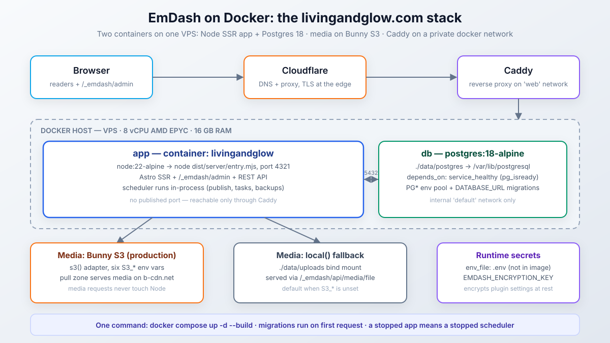
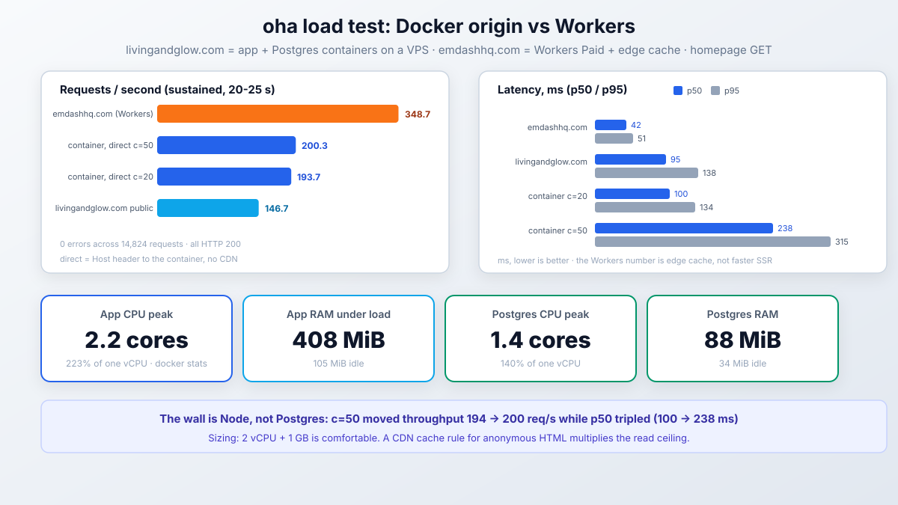

import Button from "@components/widgets/Button.astro";
import Notice from "@components/widgets/Notice.astro";
import Accordion from "@components/widgets/Accordion.astro";
import Tabs from "@components/widgets/Tabs.astro";
import Tab from "@components/widgets/Tab.astro";

Part 4 covered [EmDash on Cloudflare Workers](/deploy-emdash-cloudflare-workers/). This is the other path: a plain Docker container on a VPS, running the same CMS on Node instead of Workers. It is not a theoretical exercise. [livingandglow.com](https://livingandglow.com/), my lifestyle affiliate site, runs on exactly the stack in this article: an app container plus Postgres, media on Bunny S3 behind a pull zone, Caddy in front, Cloudflare on DNS. Everything below is lifted from its real config, then benchmarked against my Workers-hosted [emdashhq.com](https://emdashhq.com/) so you can see what the trade actually looks like.

The short version: one `docker compose up -d --build` gives you the whole CMS. The decisions that matter are the database (Postgres, and why), the media backend (S3 or local disk), and how much hardware a containerized EmDash actually needs. That last question has a measured answer at the end, not a guessed one.


<YouTubeEmbed
  url="https://www.youtube.com/embed/w4FuWn5ybbY"
  label="Is Self-Hosted EmDash Faster? Benchmarks + Complete Docker Setup"
/>


<Button text="EmDash on GitHub" link="https://github.com/emdash-cms/emdash" variant="solid" color="blue" size="md" icon="arrow-right" />

## What the Docker stack looks like

Two containers and a shared network. The app container runs the Astro Node standalone server on port 4321 with no host port published. Postgres runs beside it on an internal network. A reverse proxy on a shared `web` network (Caddy, in my case) is the only thing that can reach the app.

The reasons this shape works for a CMS:

- The Node process stays up, which matters more than it sounds: EmDash's scheduler (scheduled publishing, plugin tasks, maintenance) only runs while a Node process is running. `restart: unless-stopped` is not optional decoration.
- Postgres lives in its own container with its own volume. Rebuild or replace the app image and the database does not care.
- Media can leave the container entirely. With S3 configured, uploads go to object storage and are served by a CDN pull zone; the Node app never touches a media request.
- `/_emdash/admin`, the REST API, and the public site all live in the one Node process. SSR every page, which is why CPU numbers matter later.



## The Dockerfile

Three stages: install, build, run. The interesting part is that the database and storage adapters are chosen with build args, not runtime env vars, because EmDash bakes adapter descriptors into the bundle at build time. Secrets never enter the image.

```dockerfile
FROM node:22-alpine AS deps
WORKDIR /app
COPY package.json package-lock.json ./
COPY plugins ./plugins
RUN npm ci

FROM deps AS build
# Adapter selection is baked at build time — flags carry no secrets.
ARG EMDASH_DB=sqlite
ARG EMDASH_STORAGE=local
ENV EMDASH_DB=$EMDASH_DB EMDASH_STORAGE=$EMDASH_STORAGE
COPY . .
RUN npm run build

FROM node:22-alpine AS runner
WORKDIR /app
ENV NODE_ENV=production \
	HOST=0.0.0.0 \
	PORT=4321
COPY --from=build /app/node_modules ./node_modules
COPY --from=build /app/dist ./dist
COPY --from=build /app/seed ./seed
COPY scripts ./scripts
EXPOSE 4321
CMD ["node", "./dist/server/entry.mjs"]
```

Notes on what is here and why:

- `node:22-alpine` matches EmDash's Node 22.16+ floor. On Node 22 the built-in SQLite driver prints an `ExperimentalWarning` when used; harmless, and gone in Node 24.
- `COPY plugins ./plugins` before `npm ci` exists because `lg-blocks` is a `file:` dependency; without it the install fails on the missing path. If you have no local plugins, drop the line.
- `COPY --from=build /app/seed` ships the seed file for the first-boot setup wizard. EmDash inlines the seed into the bundle at build time anyway; keeping it in the image is for tooling, not required by the runtime.
- The result is a 1.24 GB image. Most of it is production `node_modules` (sharp, pg, the AWS SDK, React admin). Slimming is possible; I have not bothered.

And a `.dockerignore` so the build context stays small and secrets stay out:

```plain
.git
node_modules
dist
.astro
.env
.env.*
!.env.example
uploads
data.db
data.db-*
data/
*.md
```

## docker-compose.yml, annotated

This is the real file, comments preserved:

```yaml
services:
  app:
    build:
      context: .
      args:
        # Adapter types are baked at build time; secrets stay runtime-only.
        EMDASH_DB: postgres
        EMDASH_STORAGE: ${S3_ENDPOINT:+s3}
    container_name: livingandglow
    env_file: .env
    # No host port mapping — Caddy reaches the container on the shared
    # "web" network as livingandglow:4321.
    environment:
      DATABASE_URL: postgres://${POSTGRES_USER}:${POSTGRES_PASSWORD}@db:5432/${POSTGRES_DB}
      EMDASH_SITE_URL: ${EMDASH_SITE_URL:-http://localhost:4321}
      # The build bakes postgres() without a literal connectionString, so the
      # runtime pool resolves these standard libpq vars.
      PGHOST: db
      PGPORT: "5432"
      PGDATABASE: ${POSTGRES_DB}
      PGUSER: ${POSTGRES_USER}
      PGPASSWORD: ${POSTGRES_PASSWORD}
    volumes:
      # Local-storage fallback for media when S3_* (Bunny) is not set.
      - ./data/uploads:/app/uploads
    depends_on:
      db:
        condition: service_healthy
    restart: unless-stopped
    networks:
      - default
      - web

  db:
    image: postgres:18-alpine
    container_name: livingandglow-db
    env_file: .env
    volumes:
      # PG18+ stores data at /var/lib/postgresql/18/docker and declares
      # /var/lib/postgresql as the volume root — mount there, not .../data.
      - ./data/postgres:/var/lib/postgresql
    healthcheck:
      test: ["CMD-SHELL", "pg_isready -U ${POSTGRES_USER} -d ${POSTGRES_DB}"]
      interval: 5s
      timeout: 3s
      retries: 10
    restart: unless-stopped
    networks:
      - default

networks:
  web:
    external: true
```

The parts that are easy to get wrong:

- `EMDASH_STORAGE: ${S3_ENDPOINT:+s3}` is the whole S3 switch. If `S3_ENDPOINT` is set in `.env`, the image builds with `s3()`; if not, it builds `local()`. One env var decides, at build time.
- `DATABASE_URL` and the `PG*` vars are both set on purpose. `postgres({ connectionString })` without a literal string in the config resolves the standard libpq `PG*` variables for the runtime pool, while `DATABASE_URL` is what migration tooling reads. Set both, point them at the same place.
- `depends_on: condition: service_healthy` plus the `pg_isready` healthcheck stops the app from booting against a half-started Postgres.
- The Postgres volume mounts `/var/lib/postgresql`, not `/var/lib/postgresql/data`. Postgres 18 moved `PGDATA` to `/var/lib/postgresql/18/docker` and declared the parent as the volume root. Mount the old path and your data lands in anonymous volumes anyway (or init fails); this one bit people hard when 18 shipped.
- `web` is an external network I create once (`docker network create web`) and share between all site containers and Caddy.

## Database: Postgres, and why it is the right default

EmDash gives you a real choice here: `sqlite()` or `postgres()` on Node. Both work. I run Postgres, and for a production site I think it is the correct default rather than a premature upgrade.

SQLite is genuinely fine for a single small site on one container. EmDash opens it in WAL mode, readers do not block the writer, and a blog's write load is tiny. The problems are operational, not throughput:

- **One writer, ever.** WAL allows concurrent readers with a single writer, and a CMS has more writers than it looks: public SSR reads, admin saves, the scheduler ticking, plugin writes. They serialize. It works until the exact moment an editor publishes during a traffic spike.
- **Backups are a footgun.** Copying `data.db` while the app runs can hand you a file missing the last commits, because committed pages sit in `data.db-wal`. The correct way is the SQLite online backup API, which nobody scripts on their first try. `pg_dump` has no equivalent trap.
- **The mount has to be exactly right.** WAL needs shared memory, so the database must live on a local disk or block volume, never NFS or SMB, and you have to mount the directory (all three files), not just the `.db` file.
- **The database cannot outlive the container cleanly.** With Postgres, `docker compose up -d --build` on the app leaves the db service untouched. With SQLite, the file is on a bind mount that your next careless `docker system prune` or volume cleanup can eat.
- **It caps the architecture.** The official guidance is plain: Postgres when several Node.js processes need one shared database. Even if you never scale horizontally, migrations, seeding scripts, and inspection tools (psql, `docker exec`, any GUI) assume a server, not a file.

The measured cost on this site: `livingandglow-db` idles at 34 MiB and peaks at 88 MiB under load. That is cheap insurance.

The SQLite variant is a five-line change if you want it anyway:

```js
// astro.config.mjs
database: sqlite({ url: "file:./data/emdash.db" }),
```

```yaml
# compose: drop the db service, add a volume for the app
volumes:
  - ./data:/app/data
```

Mount a directory, not the file, so `-wal` and `-shm` have somewhere to live. `EMDASH_DB=sqlite` (or just `DATABASE_URL` unset) picks the adapter at build time. And on Node 22, expect the harmless `ExperimentalWarning` line in the logs.

## Media: Bunny S3 or local disk

Same pattern as the database: two working options, one clearly better past a certain size.

<Button text="Check Bunny.net" link="https://go.bitdoze.com/bunny" variant="solid" color="blue" size="md" icon="arrow-right" />

<Tabs>
<Tab name="S3 storage (what runs in prod)">

`s3()` reads six `S3_*` variables from the process environment; the site ships them through `.env`:

```bash
# Bunny dashboard -> Storage -> your zone -> FTP & API Access
S3_ENDPOINT=https://de-s3.storage.bunnycdn.com   # note the "-s3" infix, per region
S3_BUCKET=livingandglow                          # bucket = storage zone name
S3_ACCESS_KEY_ID=livingandglow                   # key id = zone name
S3_SECRET_ACCESS_KEY=                            # secret = zone password/access key
S3_REGION=de                                     # signing region: de, ny, sg, uk...
S3_PUBLIC_URL=https://livingandglow.b-cdn.net    # pull zone in front of the zone
```

Three Bunny specifics worth knowing:

- The endpoint host carries `-s3` (`de-s3.storage.bunnycdn.com`), not the CDN hostname you might guess. The zone's FTP & API Access page shows the exact one.
- `S3_PUBLIC_URL` should point at a pull zone in front of the storage zone, not the raw storage hostname. That is what turns every media URL into a CDN-served request. [Bunny.net](https://go.bitdoze.com/bunny) storage plus a pull zone is a couple of dollars a month at this scale.
- Astro's `<Image>` transform needs the media host authorized, or images come through unoptimized:

```js
// astro.config.mjs
image: {
	remotePatterns: [{ protocol: "https", hostname: "**.b-cdn.net" }],
},
```

Any S3-compatible service works here (R2, MinIO, whatever); the env names are the same. The win over local disk is architectural: media requests never touch the Node process, uploads survive container rebuilds without a volume dance, and backup splits cleanly into "dump the database" plus "sync the bucket".

</Tab>
<Tab name="Local storage (default)">

Without `S3_*`, the build bakes `local()`:

```js
// astro.config.mjs
storage: local({
	directory: "./uploads",
	baseUrl: "/_emdash/api/media/file",
}),
```

Uploads land in `./data/uploads` on the host through the bind mount, and every file is served back through the Node app at `/_emdash/api/media/file`. It works fine at brochure-site volume and asks for nothing extra. The two things to know: every media request is work for the same process that renders pages, and the files share the host disk's fate, so they belong in your backup plan.

</Tab>
</Tabs>

<Notice type="warning" title="EMDASH_SITE_URL matters at build time, not just runtime">
Behind a proxy, `EMDASH_SITE_URL` makes absolute URLs (sitemap, RSS, auth redirects) correct at runtime, everyone gets that. The less obvious part from the deploy docs: the build also reads it to enable image optimization for locally stored media. Build without it on `local()` storage and images serve as unoptimized originals. With S3 it is a runtime concern only.
</Notice>

## The .env file

Everything compose and the app read, values redacted:

```bash
EMDASH_SITE_URL=https://livingandglow.com
EMDASH_ENCRYPTION_KEY=          # npx emdash secrets generate

POSTGRES_DB=livingandglow
POSTGRES_USER=livingandglow
POSTGRES_PASSWORD=

S3_ENDPOINT=
S3_BUCKET=
S3_ACCESS_KEY_ID=
S3_SECRET_ACCESS_KEY=
S3_REGION=
S3_PUBLIC_URL=
```

`.env` is in `.gitignore` and `.dockerignore`. `EMDASH_ENCRYPTION_KEY` encrypts plugin settings at rest; set it before saving any plugin secret in the admin and keep a copy outside the server, because losing it makes stored plugin secrets unreadable (the [secrets section of the deploy guide](/deploy-emdash-cloudflare-workers/) covers rotation).

## Going live: Caddy, first boot, deploys

The Caddyfile is one block on the shared `web` network:

```caddy
livingandglow.com {
	reverse_proxy livingandglow:4321
}
```

First boot: `docker compose up -d --build` builds the image, waits for `pg_isready`, starts the app. With the default `auto` migration mode the first request applies pending core migrations, and a fresh database gets the embedded seed schema; the setup wizard at `/_emdash/admin` then offers the starter content. Existing data is never overwritten by the seed.

Deploys after that are `git pull && docker compose up -d --build`. Migrations run on first request after the new container comes up, so there is a few-second window where the first hit does the migration work; on a bigger site you would run `npx emdash migrate` explicitly before restarting, the same runbook as the Workers path.

The remaining env vars you might meet: `HOST`/`PORT` if 4321 collides, `EMDASH_PREVIEW_SECRET`/`EMDASH_IP_SALT` only if you need pinned values across processes, and nothing else. And if you want marketplace/registry plugins on Node, they need the `@emdash-cms/sandbox-workerd` runner rather than the Cloudflare `LOADER` binding.

## Benchmarks: Docker vs Workers, measured

Method: [oha](https://github.com/hatoo/oha) (the same tool from my [website load testing guide](/oha-website-load-testing/)), three scenarios, all after warmup, homepage GET only.

- **Direct to the container:** `oha -H "Host: livingandglow.com" http://172.20.0.23:4321/` hits the app with no CDN and no proxy. The `Host` header is required because `security.allowedDomains` in the config restricts which hostnames the site serves.
- **Public livingandglow.com:** through Caddy and Cloudflare, exactly what a visitor gets.
- **Public emdashhq.com:** the Workers Paid deploy from part 4, D1 + R2 + KV + Workers Cache.

While the load ran I sampled `docker stats` every second for both containers.

### Response times

| Target | Concurrency | Requests | Req/s | p50 | p95 | p99 | Errors |
| --- | --- | --- | --- | --- | --- | --- | --- |
| Container, direct | 20 | 3,855 | 193.7 | 100 ms | 134 ms | 160 ms | 0 |
| Container, direct | 50 | 5,008 | 200.3 | 238 ms | 315 ms | 414 ms | 0 |
| livingandglow.com (public) | 15 | 2,934 | 146.7 | 95 ms | 138 ms | 186 ms | 0 |
| emdashhq.com (public) | 15 | 6,961 | 348.7 | 42 ms | 51 ms | 60 ms | 0 |

### Container load under fire

The VPS is an 8-vCPU AMD EPYC box with 16 GB RAM that also hosts a dozen other containers. CPU% is docker stats convention: 100% = one core.

| | idle | ~194 req/s (c=20) | ~200 req/s (c=50) |
| --- | --- | --- | --- |
| **app CPU** | 0% | 117-170% (peak 170%, ~1.7 cores) | peak 223% (~2.2 cores) |
| **app memory** | 105 MiB | ramps to 362 MiB | peak 408 MiB |
| **db CPU** | 0% | 113-150% (peak ~1.5 cores) | peak 140% (~1.4 cores) |
| **db memory** | 34 MiB | 78-82 MiB | peak 88 MiB |



### What the numbers actually say

- **~200 req/s is the single-process ceiling for this homepage**, and the wall is Node, not Postgres. Going from 20 to 50 connections moved throughput from 194 to 200 req/s while p50 went from 100 ms to 238 ms. The app peaks at 2.2 cores (the event loop plus GC) against Postgres's 1.4; the database still had headroom when Node was saturated.
- **Memory is boring, in a good way.** The app ramps to ~400 MiB RSS under load and stays warm around there; Postgres never crossed 90 MiB. A 1 GB VPS runs this stack with room to spare; the constraint is CPU, not RAM.
- **Sizing:** 2 vCPU is comfortable for a CMS site shaped like this. 1 vCPU would pin the process under a hundred-ish concurrent-ish requests and the scheduler would compete for the same core. 4+ only helps if you run more than one app process.
- **Public versus direct is nearly identical** on the VPS (95 ms p50 vs 100 ms direct): Cloudflare is not caching this site's HTML, it just adds transit and TLS. Every public request lands on the Node process, which is exactly why origin performance matters here.
- **Workers is faster under the same test, and mostly not for the flattering reason.** emdashhq.com at 42 ms p50 is Workers Cache serving most requests at the edge plus a much lighter page (12 KiB versus 35 KiB on this homepage). It is a different architecture with a cache in front, not a faster runtime rendering the same work. Both numbers are what real visitors get, which is the fair way to compare them.

The honest summary: a VPS container serves roughly 200 uncached SSR pages per second before latency degrades, and a CDN cache rule in front of it multiplies that by however much of your traffic is anonymous repeat reads. For a content site, that ceiling is far above what it will ever need.

## Docker vs Workers: which deploy should you pick

Not a benchmark verdict, an ops preference:

- **Pick Docker/VPS** if you want shell access when something is wrong, Postgres with real `pg_dump` backups, S3 media you fully own, plugins that expect Node (generic SMTP, local transports, the sandbox-workerd runner), or you already run a Docker host and this is one more service on it.
- **Pick Workers** if you want zero servers, edge-served reads that make load tests boring, and you accept the binding model plus its paid tier edges (the [deploy guide](/deploy-emdash-cloudflare-workers/) has the full limits table).
- **Email works on both** now, differently: `send_email` binding on Workers, `emdash-smtp` generic SMTP on Node (the [email guide](/emdash-send-email/) covers both).

My own split says it plainly: the affiliate content site is on the VPS because it lives next to other self-hosted services and I like `pg_dump`; the EmDash hub is on Workers because it should cost nothing to run and be fast everywhere. Both are the same `emdash` package.

## Troubleshooting the Docker deploy

| Symptom | Likely cause | Fix |
| --- | --- | --- |
| `npm ci` fails on `file:` plugin | `plugins/` not copied before install | `COPY plugins ./plugins` before `npm ci` in the Dockerfile |
| App crashes at boot: DB connection refused | Postgres not ready yet | `depends_on: db: condition: service_healthy` + the `pg_isready` healthcheck |
| DB data gone after recreating the db container | Volume mounted at `/var/lib/postgresql/data` (PG17 path) | Mount `/var/lib/postgresql`; PG18 stores under `…/18/docker` |
| Media 404s after switching to S3 | `S3_PUBLIC_URL` wrong or files only exist in the old volume | Point it at the pull zone; upload through the admin or migrate files |
| Images unoptimized with local storage | `EMDASH_SITE_URL` missing at build time | Set it for `npm run build`, not only at runtime |
| Remote images render raw | Host not in `image.remotePatterns` | Add the media hostname (`**.b-cdn.net`) |
| Scheduled posts never publish | No Node process running | `restart: unless-stopped`; the scheduler only runs inside a live process |
| `503 EMAIL_NOT_CONFIGURED` | No email provider active | `emdash-smtp` on Node; see the [email guide](/emdash-send-email/) |
| `ExperimentalWarning: SQLite` in logs | Node 22's built-in driver | Harmless; gone on Node 24, or switch to Postgres |
| Plugin secrets unreadable after restore | `EMDASH_ENCRYPTION_KEY` lost or rotated | Restore the key; rotation is two-phase (deploy guide) |

## FAQ: EmDash on Docker

<Accordion label="Do I need Postgres, or is SQLite enough for a real site?" group="faq" expanded="true">
SQLite is genuinely enough for a single small site: WAL mode handles concurrent readers, and a blog's write volume is tiny. Postgres earns its keep the moment you care about correct backups (`pg_dump`, not copying WAL files mid-write), concurrent writers (admin + scheduler + public), a database that survives the app container cleanly, or ever running a second app instance. Its cost here is under 90 MiB of RAM. I treat it as the default, not the upgrade.
</Accordion>

<Accordion label="Can I run the whole thing in one container without compose?" group="faq">
Yes, for SQLite plus local storage: the official Dockerfile plus `docker run -p 4321:4321 -v emdash-data:/app/data` is a complete deploy. You give up the Postgres benefits above, and scheduled tasks still need the process running. It is a fine first deploy; the compose version is the one I would keep.
</Accordion>

<Accordion label="Does EmDash need env vars for SMTP on Docker?" group="faq">
No new ones per provider. `emdash-smtp` takes credentials in the admin (Plugins > SMTP Providers) and stores them encrypted in the database, exactly like on Workers. The only key that must already exist is `EMDASH_ENCRYPTION_KEY`. The [email guide](/emdash-send-email/) walks through both provider options.
</Accordion>

<Accordion label="Why is my Docker EmDash slower than the Workers numbers you show?" group="faq">
It probably is not slower at the origin; it is missing a cache. The Workers site serves most requests from Workers Cache at the edge, while a bare VPS render lands on Node every time. Add a CDN cache rule for anonymous HTML or Astro's route cache and the gap mostly closes. The uncached ceiling measured here, ~200 req/s, is still far above what a normal content site sees.
</Accordion>

<Accordion label="How do I back up a Docker EmDash site?" group="faq">
Three pieces: `docker exec livingandglow-db pg_dump -U livingandglow livingandglow` for the database, the `./data/uploads` volume (or the S3 bucket) for media, and `EMDASH_ENCRYPTION_KEY` from your secret store. EmDash also writes its own JSON backups on the scheduler; keep those, but do not rely on them alone since media binaries live outside the database.
</Accordion>

<Accordion label="Can I put marketplace plugins on the Docker deploy?" group="faq">
Yes, with a different runner than on Workers. On Node.js the sandbox runner is `@emdash-cms/sandbox-workerd`, which spawns a `workerd` child process for sandboxed plugins. Native plugins (the `plugins:` array) run in-process on either platform and need nothing extra.
</Accordion>

## Closing

`docker compose up -d --build` with Postgres and an S3 backend is a production EmDash deploy in one command: the adapter types bake at build, secrets arrive through `.env`, Postgres holds the content, Bunny serves the media, and Caddy fronts it on a private network. Measured, not guessed: ~200 req/s per Node process, ~400 MiB RSS for the app, under 90 MiB for Postgres, and zero errors across 8,800 requests of load testing. A 2-vCPU VPS at five or six euros a month runs it with headroom, and the Workers numbers in the table show what you are trading that monthly bill for.

That is part 6 of the EmDash CMS series: the self-hosted Docker path, end to end.

<Button text="The Cloudflare Workers deploy (part 4)" link="/deploy-emdash-cloudflare-workers/" variant="outline" color="gray" size="md" />
