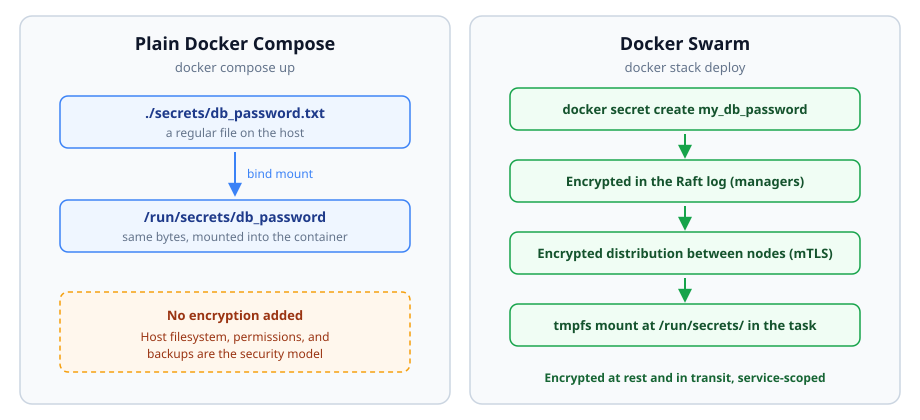

import Notice from "@components/widgets/Notice.astro";
import ListCheck from "@components/widgets/ListCheck.astro";
import Tabs from "@components/widgets/Tabs.astro";
import Tab from "@components/widgets/Tab.astro";
import Accordion from "@components/widgets/Accordion.astro";
import Button from "@components/widgets/Button.astro";

Docker Compose secrets are one of the most misunderstood corners of the Docker ecosystem: plain Compose only mounts secret files, while real encrypted, service-scoped secrets are a Swarm-only feature. This guide shows how to inject database passwords, API keys, and private keys without leaking them into Git, image layers, logs, or environment variables.

Two things matter up front:

- **"Docker secrets" with encryption are a Swarm feature.** Plain Docker Compose doesn't encrypt secrets at rest; it mounts files. Real encryption and service-scoped access only happen in **Docker Swarm**.
- **Docker Compose can still mount secret data as files.** That's what the `secrets:` key does in plain Compose. The security comes down to your host filesystem, your backups, and your discipline.

I'll cover both paths: real Swarm secrets and how to reference them from Compose (Option A), then Compose secret files for local and self-hosted setups, plus production alternatives (Option B). If you just want `docker compose up` to work with a password file, jump to Option B.

## Prerequisites

<ListCheck>
<ul>
<li>Docker Engine 27+ with Compose v2 on any Linux host. Confirm with <code>docker version</code> and <code>docker compose version</code>.</li>
<li>Root or sudo on that host.</li>
<li>A test image to wire secrets into. Postgres works out of the box because it supports <code>POSTGRES_PASSWORD_FILE</code>.</li>
<li><code>git</code>, for the <code>.gitignore</code> step.</li>
<li>Option A only: a single machine is enough. A single-node Swarm is fine for learning this.</li>
</ul>
</ListCheck>

You can follow along on a laptop, or on [a small Hetzner Cloud VPS (~€4/month)](https://go.bitdoze.com/hetzner) if you want a disposable box you can break and rebuild.

_VPS prices jumped across the board in 2026 — if you're rethinking a rented box, see [what changed and when a mini PC wins](/vps-price-increases/)._

<Notice type="info" title="Versions">Syntax here targets Docker Engine 27+ with Compose v2 (current on Ubuntu 24.04). The <code>secrets:</code> syntax has been stable since Compose v2, but verify flags against docs.docker.com if your Engine is older.</Notice>

## Docker secrets vs Docker Compose secrets: what's the difference

### What are Docker secrets (Swarm secrets)?

**Docker secrets** are a Swarm feature for managing sensitive data: passwords, API keys, TLS private keys, and so on. When you run Swarm services, secrets are:

- **Encrypted at rest** in the Swarm Raft log on managers
- **Encrypted in transit** between Swarm nodes
- **Exposed to containers as files** under `/run/secrets/<name>`
- **Scoped to services** that explicitly request them
- **Rotatable**: create a new version, update the service, remove the old one

This is the security model people mean when they say "real Docker secrets."

### What are "secrets" in Docker Compose (non-Swarm)?

In plain Docker Compose, a `secrets:` entry is a tidy bind mount: the file lands at `/run/secrets/<name>` inside the container with a standardized path. Nothing is encrypted. Nothing is stored inside Docker. What you do get:

1. **Secrets stay out of image layers** because they're injected at runtime.
2. **Cleaner app config** because apps read `/run/secrets/...` instead of hardcoded values.
3. **Version-control-friendly files** because the Compose file references secret *files*, and those files stay out of Git.

That's genuinely useful. Just remember the value is only as safe as the host it sits on.



*Plain Compose bind-mounts a file and stops there. Swarm adds an encrypted store, encrypted distribution, and service scoping.*

Quick picker before the details:

| Approach | Reach for it when |
|---|---|
| Swarm secrets | You run Swarm and want encryption at rest, service scoping, and real rotation |
| Compose secret files | Dev, homelab, single-host self-hosting; you protect the host yourself |
| Secret manager (Vault, cloud) | Multiple hosts or platforms, compliance requirements, automated rotation |

## Option A (production-grade): Docker Swarm secrets

Docker secrets require Swarm mode. If you're not running Swarm, skip to Option B.

### 1) Initialize Swarm (one-time)

```sh
docker swarm init
```

A single node is fine.

### 2) Create a secret

Avoid `echo "secret" > file` when you can. It lands in shell history and drags a trailing newline along (more on that under failure modes). Read from stdin instead:

```sh
printf '%s' 'mysupersecretpassword' | docker secret create my_db_password -
```

The command prints the new secret's ID. That's your confirmation it exists.

Or from a file:

```sh
docker secret create my_db_password db_password.txt
chmod 400 db_password.txt
```

List secrets:

```sh
docker secret ls
```

**Common commands**

| Command                       | Description                        |
|------------------------------|------------------------------------|
| `docker secret create`       | Creates a new secret               |
| `docker secret ls`           | Lists all secrets                  |
| `docker secret inspect`      | Shows secret metadata (not value)  |
| `docker secret rm <secret>`  | Removes a secret                   |

Docker won't let you read a secret's value back through the CLI. That's by design. For the wider command set, the [essential Docker commands cheat sheet](https://www.bitdoze.com/docker-commands/) is worth keeping open in a second tab.

### Using Swarm secrets from a Compose file

If you deploy your stack to Swarm (via `docker stack deploy`), reference an **external** Swarm secret:

```yaml
services:
  app:
    image: myapp:latest
    secrets:
      - my_db_password
    environment:
      DB_PASSWORD_FILE: /run/secrets/my_db_password

secrets:
  my_db_password:
    external: true
```

```sh
docker stack deploy -c compose.yml demo
```

**Verify the secret actually arrived**, from the outside in:

```sh
docker service ls
# expect: demo_app  replicated  1/1

docker service inspect demo_app --format '{{json .Spec.TaskTemplate.ContainerSpec.Secrets}}'
# expect: [{"SecretName":"my_db_password","File":{...}}]

docker exec "$(docker ps -q --filter name=demo_app)" cat /run/secrets/my_db_password
# expect: mysupersecretpassword
```

If `docker service inspect` prints `null`, the service never got the secret. Fix the Compose file before debugging inside the container.

### Reading secrets in containers

Secrets are mounted as files under `/run/secrets/<secret_name>`. Read the file at startup rather than passing the value through an environment variable:

<Tabs>
<Tab name="Python">

```python
from pathlib import Path

db_password = Path("/run/secrets/my_db_password").read_text(encoding="utf-8").strip()
```

</Tab>
<Tab name="Node.js">

```js
const fs = require("node:fs");

const dbPassword = fs.readFileSync("/run/secrets/my_db_password", "utf8").trim();
```

</Tab>
<Tab name="Bash">

```sh
DB_PASSWORD="$(cat /run/secrets/my_db_password)"
```

</Tab>
</Tabs>

All three read the file at startup, which keeps the value out of the environment. That's the surface `docker inspect`, crash dumps, and child processes expose.

**Where Option A bites:**

- `docker stack deploy` fails with `secret my_db_password not found` if the secret doesn't exist yet. External secrets must be created **before** the deploy; the stack file won't create them for you.
- A trailing newline from `echo` or an editor becomes part of the value. Auth failures with a "correct" password are almost always this. Regenerate with `printf '%s'`.
- If your container image drops privileges to a non-root user, a root-owned `600` file becomes unreadable to it. Fix ownership or run the container as a matching UID; see how to [run containers as a non-root user](https://www.bitdoze.com/add-users-to-docker-container/).

### Rolling back Option A

Remove a secret from a running service, then delete it:

```sh
docker service update --secret-rm my_db_password demo_app
docker secret rm my_db_password
```

The service update triggers a rolling restart of tasks, so do this during a quiet window. Note that secrets are immutable: there is no edit. "Changing" a secret always means create-new, point the service at it, delete the old one, which is covered under rotation below.

## Option B (Compose-friendly): Docker Compose secrets files

This is the path for most readers: local development and single-host self-hosting, whether that's a VPS or a [compact mini PC for a home server](/go/gmktec-m5-ultra/). If you manage several Compose stacks by hand, [manage your Compose stacks with Dockge](https://www.bitdoze.com/dockge-install/) pairs well with this workflow.

### Step 1: Create a secrets directory (and keep it out of Git)

```sh
mkdir -p secrets
printf '%s' 'change-me-before-use' > secrets/db_password.txt
chmod 600 secrets/db_password.txt
```

`.gitignore`:

```
secrets/
*.env
```

### Step 2: Declare the secret in compose.yml

```yaml
services:
  db:
    image: postgres:17
    environment:
      POSTGRES_PASSWORD_FILE: /run/secrets/db_password
    secrets:
      - db_password

secrets:
  db_password:
    file: ./secrets/db_password.txt
```

No `version:` key needed; Compose v2 ignores it and prints a warning if present. `POSTGRES_PASSWORD_FILE` is read by the Postgres entrypoint on first initialization, so create the data volume after the secret exists.

### Step 3: Verify

```sh
docker compose config --quiet && echo "compose file OK"
# resolves the file, catches YAML errors; silence is good

docker compose up -d

docker compose exec db ls -l /run/secrets/
# expect: -rw------- ... db_password  (bind mount keeps host permissions)

docker compose exec db env | grep change-me
# expect: no output, the value never entered the environment
```

And on the host:

```sh
stat -c '%a %U:%G' secrets/db_password.txt
# expect: 600 root:root
```

What broken looks like: `docker compose config` failing with a "secret not found" error means you wrote `external: true` instead of `file:`. An empty `/run/secrets/` inside the container means that service never declared the secret.

Secret files aren't only for passwords. TLS private keys follow the same mount pattern, and you can see it end to end in the [Traefik wildcard certificates with Let's Encrypt and Cloudflare](https://www.bitdoze.com/traefik-wildcard-certificate/) setup.

### Taking this to production

The same compose file deploys on a self-hosted PaaS with a real deploy flow, env handling, and proxying on top. If that's the direction you're heading, here's how to [deploy a Docker Compose app on Dokploy](https://www.bitdoze.com/dokploy-docker-compose-app/).

### External vs file-based Docker Compose secrets

You'll see two patterns:

- **File-based (`file: ...`)**: "mount this host file into the container as `/run/secrets/<name>`." This is what most people use in plain Docker Compose.
- **External (`external: true`)**: "the secret already exists in the platform." Relevant for **Swarm secrets**, created with `docker secret create` and shared across services and stacks, managed independently of the Compose file, and rotatable without touching the file.

| | `file:` (plain Compose) | `external: true` (Swarm) |
|---|---|---|
| Where the value lives | A file on the host | Swarm's encrypted store |
| Encrypted at rest | No | Yes |
| Works with `docker compose up` | Yes | No: "secret not found" |
| Works with `docker stack deploy` | Yes (mounted as-is) | Yes (the intended use) |
| Rotation | Overwrite the file, recreate containers | Immutable: add v2, update service, remove v1 |

Use file-based for development, testing, and single-host self-hosting. Use external Swarm secrets in Swarm deployments, especially when one secret is shared by several services.

#### Docker secrets vs environment variables in Compose

<Notice type="warning" title="Don't put secret values in environment variables">Some older guides show secrets defined directly in the Compose file or pulled in from environment variables. Skip that pattern. Values passed through <code>environment:</code> are readable in <code>docker inspect</code>, they end up in crash dumps, and every child process the app spawns inherits them.</Notice>

If you need environment variables anyway, keep the roles separate:

- `.env` for non-sensitive configuration: ports, image tags, feature flags
- a proper secret manager for sensitive values in production (Vault or a cloud provider)
- generate the secret file during deployment and mount it (never commit it)

For the full mechanics of injection, see [how ARG and ENV work in Docker and Docker Compose](https://www.bitdoze.com/docker-env-vars/).

## Docker Compose secrets best practices

The core goal never changes: keep secrets out of images, Git, and logs, and minimize the blast radius when something leaks.

### Naming conventions

- Descriptive names: `prod_db_password` instead of `secret1`.
- Consistent prefixes: `prod_` for production, `dev_` for development.
- No sensitive information in the names themselves.

### Version control

- Never commit secret values.
- Add the secrets directory to `.gitignore` (`secrets/`).
- Keep a `secrets.example/` directory with placeholder files, or document required filenames in a README.
- Treat `.env` files as secrets if they contain passwords or tokens.

### Rotating secrets

In Swarm, rotation is create-new, switch, delete-old:

```sh
printf '%s' 'new-password' | docker secret create my_db_password_v2 -

docker service update \
  --secret-rm my_db_password \
  --secret-add source=my_db_password_v2,target=my_db_password \
  demo_app

# after the rollout verifies:
docker secret rm my_db_password
```

The `source=...,target=...` trick keeps the in-container path stable so app config doesn't change.

If the rollout fails, roll back while the old secret still exists:

```sh
docker service update \
  --secret-rm my_db_password_v2 \
  --secret-add my_db_password \
  demo_app
```

That's why you delete the old secret last, never first.

In plain Compose, rotation is: overwrite the file, then `docker compose up -d --force-recreate db`. Compose mounts the file once at container creation and does not watch it, so without recreation the container keeps serving the old value.

And rotate the credential at the source (the database role, the cloud API key), not only inside Docker. Rotating the mount but not the credential rotates nothing that matters.

### Lock down the host

With plain Compose, the host is the security model:

```sh
sudo chown root:root secrets
sudo chmod 700 secrets
sudo chown root:root secrets/*
sudo chmod 600 secrets/*
```

If a container runs as a non-root UID, `chown` the specific file to that UID or chgrp it to a group that UID belongs to.

Backups need the same treatment: your secrets directory will end up inside host backups, so encrypt backups (restic with an age key, or S3-compatible storage with server-side encryption and restricted credentials) instead of shipping plaintext secret files next to your database dumps.

For a server facing the internet, start with [how to secure a Docker server exposed to the internet](https://www.bitdoze.com/bsi-security-report-docker-ufw/), and add automated blocking with [CrowdSec to secure your VPS](https://www.bitdoze.com/crowdsec-secure-server/).

<Notice type="warning" title="A mounted secret doesn't protect a published port">A secret-bearing service published on <code>0.0.0.0</code> is exposed no matter how well you mount the secret. Docker publishes ports through iptables and can bypass UFW rules; read [why Docker bypasses UFW firewall rules](https://www.bitdoze.com/docker-bypasses-firewall/) before trusting a firewall you haven't verified.</Notice>

### Additional habits that matter

- Declare secrets per service. Only the services that need a secret should see it.
- Prefer file-based consumption: use `*_FILE` variables instead of putting values into the environment.
- Don't print secrets. Skip logging config objects that include secret paths or values.
- For serious production across hosts, move to a real secret manager, covered in the alternatives below.

## Troubleshooting Docker Compose secrets

| Symptom / error | Cause | Fix |
|---|---|---|
| `secret my_db_password not found` on `docker compose up` | `external: true` only resolves under Swarm / `docker stack deploy` | In plain Compose use `file:` with a path, or create the secret in Swarm first |
| App auth fails although the password looks right | Trailing newline from `echo` or an editor became part of the value | Regenerate with `printf '%s'`; check the last byte with `xxd secrets/db_password.txt` (it must not end in `0a`). Postgres trims trailing newlines, most other images don't |
| `permission denied` reading `/run/secrets/<name>` | Container runs as non-root and the bind mount keeps root ownership | `chown` the host file to the container UID, or set `user:` in compose (see failure modes under Option A) |
| Secret value baked into the image | Tried to `COPY` it or pass it as a build `ARG` | Secrets are runtime-only by design; use BuildKit `--secret` mounts for builds, which don't persist in layers |
| Value visible in `docker inspect` or `docker compose config` output | It was passed via `environment:` | Move it to `secrets:` plus a `*_FILE` variable |
| App has no `*_FILE` support | The app only reads plain env vars | Tiny entrypoint wrapper: `export DB_PASSWORD="$(cat /run/secrets/db_password)"` then `exec "$@"`. Tradeoff: the value is back in the environment for that process tree |
| Edited the host file, container still shows the old value | Compose mounts the file once at container create; editors replace the file (new inode), breaking the bind mount | `docker compose up -d --force-recreate <service>` |

## Docker Compose secrets examples

Four common cases. The Postgres tab is the full happy path; the others are drop-in fragments. All use `file:` because that's what plain Compose supports. Under Swarm, swap `file:` for `external: true` and create the secret with the CLI first.

<Tabs>
<Tab name="Postgres">

```yaml
services:
  db:
    image: postgres:17
    environment:
      POSTGRES_PASSWORD_FILE: /run/secrets/db_password
    secrets:
      - db_password
    volumes:
      - pgdata:/var/lib/postgresql/data

  app:
    image: myapp:latest
    secrets:
      - db_password
    environment:
      DB_PASSWORD_FILE: /run/secrets/db_password

secrets:
  db_password:
    file: ./secrets/db_password.txt

volumes:
  pgdata:
```

Generate and verify:

```sh
printf '%s' "$(openssl rand -base64 24)" > secrets/db_password.txt
chmod 600 secrets/db_password.txt
docker compose up -d
docker compose logs db | grep -m1 "database system is ready"
# expect: ... database system is ready to accept connections

docker compose exec app ls -l /run/secrets/
# expect: db_password listed with restrictive permissions
```

</Tab>
<Tab name="API key">

```yaml
services:
  worker:
    image: myapp:latest
    secrets:
      - api_key
    environment:
      API_KEY_FILE: /run/secrets/api_key

secrets:
  api_key:
    file: ./secrets/api_key.txt
```

If the app doesn't support a `*_FILE` convention, use the entrypoint wrapper from the troubleshooting table.

</Tab>
<Tab name="TLS certs">

```yaml
services:
  web:
    image: nginx:1.27
    secrets:
      - source: site_certificate
        target: site.crt
      - source: site_key
        target: site.key
    volumes:
      - ./nginx.conf:/etc/nginx/nginx.conf:ro

secrets:
  site_certificate:
    file: ./certs/site.crt
  site_key:
    file: ./certs/site.key
```

With `target:`, the files appear at `/run/secrets/site.crt` and `/run/secrets/site.key`. Point your `nginx.conf` `ssl_certificate` directives there. Nginx's master process runs as root, so a `600` key is readable. This is the same pattern the Traefik wildcard certificate guide (linked under Option B) walks end to end.

</Tab>
<Tab name="JWT keys">

```yaml
services:
  auth:
    image: myapp:latest
    secrets:
      - jwt_private_key
      - jwt_public_key
    environment:
      JWT_PRIVATE_KEY_FILE: /run/secrets/jwt_private_key
      JWT_PUBLIC_KEY_FILE: /run/secrets/jwt_public_key

secrets:
  jwt_private_key:
    file: ./secrets/jwt_private_key.pem
  jwt_public_key:
    file: ./secrets/jwt_public_key.pem
```

`chmod 600` the private key. The public key can stay `644`; services often need to verify tokens without holding the private half.

</Tab>
</Tabs>

## Docker Compose secrets limitations and secure alternatives

### The Swarm mode requirement

True Docker secrets require **Swarm**. Plain Compose gives you file mounts only, no encrypted store, no service scoping enforced by an orchestrator. For Kubernetes, use Kubernetes Secrets (ideally with encryption at rest enabled and an external secret manager integration).

Given that, here are the alternatives, with the honest ops cost of each:

1. **Secret files mounted via Compose**
   - Pros: simple, keeps secrets out of image layers, works everywhere Compose runs
   - Cons: security depends on host filesystem, backups, and ops discipline
   - This is the sensible default for a single host.

2. **Environment variables (use with caution)**
   - Pros: simple, universally supported
   - Cons: easy to leak via `docker inspect`, crash dumps, logs, or child processes
   - Avoid for highly sensitive values when a file-based option exists.

3. **Cloud secret managers**
   - AWS Secrets Manager, SSM Parameter Store, Google Secret Manager, Azure Key Vault
   - Pros: IAM-based access, audit logs, managed rotation
   - Cons: platform coupling; pricing is per-secret plus per-lookup, though free tiers usually cover a homelab's worth of secrets

4. **HashiCorp Vault**
   - Pros: platform-agnostic, dynamic secrets, auditability
   - Cons: one more stateful service to back up, upgrade, and unseal. Overkill below roughly five services or below an actual compliance requirement

5. **Kubernetes Secrets (plus external secret operators)**
   - Pros: first-class in the k8s ecosystem, integrates with secret stores
   - Cons: requires k8s; base Secrets are stored in etcd unencrypted unless you enable encryption at rest
   - Pair with the External Secrets Operator to sync from a cloud secret manager.

6. **Docker Config**
   - The same Swarm machinery for *non-sensitive* configuration. Use it alongside secrets to keep config and credentials in consistent shapes

My honest ranking for a solo self-hoster: Compose secret files first, a self-hosted PaaS second, Vault or a cloud manager only when a requirement actually demands it. If managing secret files by hand sounds like a chore, the middle ground is a self-hosted PaaS: [self-hosted PaaS platforms compared](https://www.bitdoze.com/coolify-vs-dokploy-vs-kamal-2/) covers the options, and they store per-app env and secrets for you while keeping your compose files.

## FAQ

<Accordion label="Are Docker Compose secrets encrypted?" group="faq" expanded="true">

No. In plain Compose, `secrets:` is a file mount and adds no encryption. Encryption at rest in the Raft log and encrypted distribution between nodes are Docker Swarm features only. With plain Compose, your security model is the host filesystem: permissions, disk encryption, and backups.

</Accordion>

<Accordion label="Do Compose secrets work without Swarm?" group="faq" expanded="false">

Yes, as plain file mounts. Declare the secret with `file:` in your compose file and the app reads it at `/run/secrets/<name>`. The `external: true` variant is the one that requires Swarm.

</Accordion>

<Accordion label="Are Docker secrets better than environment variables?" group="faq" expanded="false">

Generally yes for sensitive values. Reading a file at startup keeps the value out of `docker inspect` output, out of crash dumps, and out of the environment inherited by child processes. It's not perfect (a memory dump can still leak it), but it closes the most common leak paths. Some leak surface remains by design when an app only accepts env vars; use an entrypoint wrapper as a last resort.

</Accordion>

<Accordion label="Where are Compose secrets stored on the host?" group="faq" expanded="false">

Exactly where your `file:` points, for example `./secrets/db_password.txt`. Compose bind-mounts the file into the container at creation time and copies nothing into the image or into Docker's own storage. Delete the file and the secret is gone for future containers. In Swarm, values live in the encrypted Raft log on manager nodes instead.

</Accordion>

<Accordion label="How do I rotate a secret without downtime?" group="faq" expanded="false">

In Swarm: create a versioned new secret, `docker service update` to point the service at it, remove the old secret after the rollout verifies. Secrets are immutable, so there is no in-place edit. In plain Compose: overwrite the file, then `docker compose up -d --force-recreate`. The rotation commands and the rollback path are in the best practices section above.

</Accordion>

<Accordion label="Can I use secrets during docker build?" group="faq" expanded="false">

Not with `secrets:`. Compose secrets are runtime constructs; anything you bake into a layer stays in the image forever, including in layers you thought you removed. For builds, use BuildKit secret mounts: `docker build --secret id=mytoken,src=./secrets/token.txt` with `RUN --mount=type=secret,id=mytoken` in the Dockerfile. Those are exposed at build time only and don't persist in layers.

</Accordion>

## Conclusion: which Docker secrets approach should you use?

The decision rule I'd apply:

- Running multi-node Swarm, or you want Docker-managed encryption and scoping? Use Swarm secrets (Option A).
- Plain Compose on a single host? Use secret files (Option B), lock down the host, encrypt the backups.
- Compliance requirements, multiple platforms, or Kubernetes? A real secret manager, or k8s Secrets with encryption at rest.

<ListCheck>
<ul>
<li>Encryption is Swarm-only. Plain Compose secrets are file mounts, nothing more.</li>
<li>Secrets and environment variables are different tools. Prefer <code>*_FILE</code> reads and keep values out of <code>docker inspect</code>.</li>
<li>Verify delivery with <code>cat /run/secrets/...</code> inside the container instead of assuming the mount worked.</li>
<li>In plain Compose, the host is the perimeter: file permissions, encrypted backups, verified firewall.</li>
</ul>
</ListCheck>

Whichever path you pick, prefer applications that read from `/run/secrets/...`, and keep secret values out of images, Git, and logs. If host hardening is next on your list, start here:

<Button text="Secure your Docker server next" link="/bsi-security-report-docker-ufw/" variant="solid" color="blue" size="md" />
