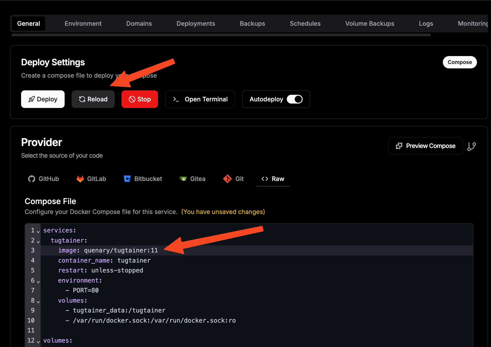

import Button from "../../layouts/components/widgets/Button.astro";
import Notice from "../../layouts/components/widgets/Notice.astro";
import ListCheck from "../../layouts/components/widgets/ListCheck.astro";

When you deploy Docker Compose apps in Dokploy, you eventually need to update them. Whether it's for security patches, bug fixes, or new features, knowing the right way to update matters. This guide covers the two main approaches—manual SSH updates and automated solutions.

New to Dokploy? Start with our [installation guide](https://www.bitdoze.com/dokploy-install/). For deploying your first app, see [How To Deploy A Docker Compose App in Dokploy](https://www.bitdoze.com/dokploy-docker-compose-app/).

## Why bother with updates?

Old container images sit there with known vulnerabilities. Regular updates give you:

<ListCheck>
<ul>
<li>**Security patches** - CVE fixes for discovered vulnerabilities</li>
<li>**Bug fixes** - Issues the maintainers finally resolved</li>
<li>**New features** - Capabilities added since your last deployment</li>
<li>**Compatibility** - Keeping up with API changes and dependencies</li>
</ul>
</ListCheck>

<Notice type="warning" title="Backup before updates">
Have backups ready before you start. Our [Dokploy backups guide](https://www.bitdoze.com/dokploy-backups-cloudflare-r2/) shows how to set them up.
</Notice>

## Option A: Using the latest tag

When your compose file uses `latest` tags, you have two update methods.

### Method 1: Manual SSH update

Connect to your server and pull the new images manually.

**Step 1: SSH into your server**

```bash
ssh username@your-vps-ip
```

**Step 2: Find your application directory**

Dokploy stores compose files here:

```bash
cd /etc/dokploy/compose/[app-name]-[random-suffix]/code
```

For example:

```bash
cd /etc/dokploy/compose/myapp-a1b2c3d/code
```

**Step 3: Pull the latest images**

```bash
docker compose pull
```

This grabs the newest versions of all images using the `latest` tag.

**Step 4: Reload in Dokploy**

1. Open Dokploy dashboard
2. Go to your project
3. Click **General** tab
4. Hit **Reload**



The reload recreates containers with fresh images while keeping your volumes intact.

### Method 2: Automated updates with Tugtainer

[Tugtainer](https://www.bitdoze.com/tugtainer-docker-autoupdate/) is a self-hosted tool that watches your containers and handles updates automatically. No more SSH sessions just to pull new images.

**What Tugtainer gives you:**

<ListCheck>
<ul>
<li>**Web interface** - Manage everything from a browser</li>
<li>**Scheduled checks** - Automatically polls for new images</li>
<li>**Smart ordering** - Updates containers in the right sequence</li>
<li>**Notifications** - Alerts via Discord, Telegram, Slack, or email</li>
<li>**Multi-server** - One interface for multiple hosts</li>
</ul>
</ListCheck>

Set it up once, and Tugtainer handles the rest. You can enable full auto-updates or just get notified when new versions appear. I use it on my own servers—it beats SSHing in every time an update drops.

<Button link="https://www.bitdoze.com/tugtainer-docker-autoupdate/" text="Tugtainer setup guide" />

## Option B: Using pinned versions

If you specify exact versions (like `image: postgres:16-alpine` instead of `latest`), the update workflow changes slightly.

### Updating pinned versions

**Step 1: Edit your compose file in Dokploy**

1. Go to your project in the Dokploy UI
2. Click **General** tab
3. Find the **Raw** section
4. Change the image version

Example:
```yaml
image: flowiseai/flowise:1.0.0
```

Becomes:
```yaml
image: flowiseai/flowise:1.1.0
```


**Step 2: Save**

Click **Save** to store the change.

**Step 3: Reload**

Click **Reload** to apply it. Dokploy pulls the new version and recreates the container.

<Notice type="info" title="Why pin versions?">
Pinned versions let you control exactly what runs in production. You decide when to upgrade, and you know what changed. `latest` tags can surprise you with breaking changes.
</Notice>

## Best practices for updates

### Test before production

Never push updates straight to production without checking them first:

1. **Use a staging environment** - Mirror your production setup somewhere safe
2. **Read the changelogs** - Know what you're getting into
3. **Verify compatibility** - Make sure your config still works

### When to update

<ListCheck>
<ul>
<li>**Security patches** - Apply these as soon as you've tested them</li>
<li>**Feature updates** - Schedule during your maintenance windows</li>
<li>**Major versions** - Plan these carefully, test thoroughly</li>
</ul>
</ListCheck>

### Rolling back

When an update breaks something:

1. **Revert the compose file** (for pinned versions) or pull the old image
2. **Click Reload** in Dokploy to go back
3. **Check the logs** to see what went wrong

If you followed our [backup guide](https://www.bitdoze.com/dokploy-backups-cloudflare-r2/), you can restore data if needed.

## Related guides

<Button link="https://www.bitdoze.com/dokploy-install/" text="Dokploy installation" />

<Button link="https://www.bitdoze.com/dokploy-docker-compose-app/" text="Deploy Docker Compose apps" />

<Button link="https://www.bitdoze.com/tanstack-start-dokploy-deploy/" text="Deploy TanStack Start" />

<Button link="https://www.bitdoze.com/dokploy-python-railpack-uv/" text="Deploy Python with uv" />

<Button link="https://www.bitdoze.com/dokploy-backups-cloudflare-r2/" text="Configure backups" />

<Button link="https://www.bitdoze.com/tugtainer-docker-autoupdate/" text="Tugtainer auto-updater" />

## Final thoughts

There are two main ways to handle updates in Dokploy. `latest` tags are convenient but need either manual SSH work or a tool like Tugtainer. Pinned versions give you control—you decide exactly when and what to update.

Pick what works for you:

- **Manual SSH** for simple setups with occasional updates
- **Tugtainer** for hands-off automation across multiple apps
- **Pinned versions** when stability matters most

Keep your apps updated, keep backups ready, and you'll avoid most self-hosting headaches.
