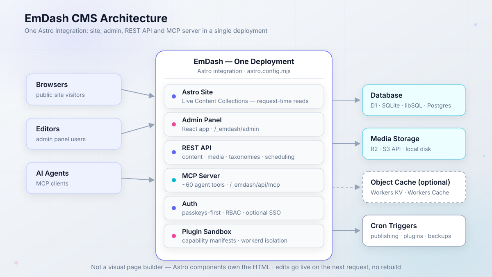
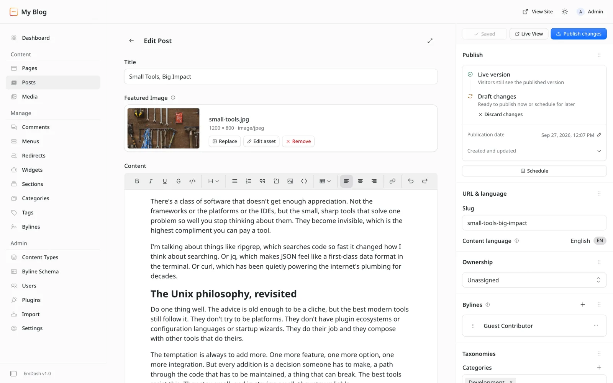
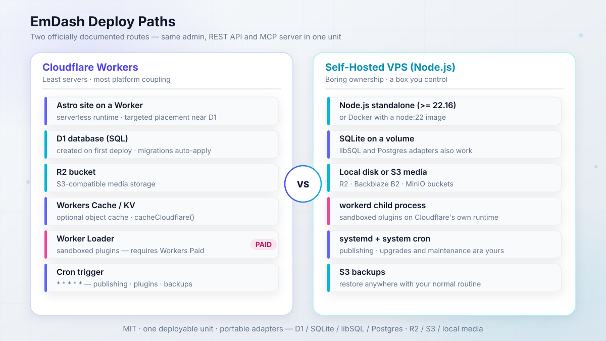
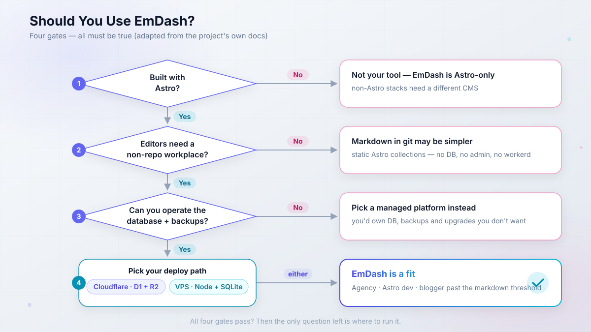

import Button from "@components/widgets/Button.astro";
import Notice from "@components/widgets/Notice.astro";
import ListCheck from "@components/widgets/ListCheck.astro";
import Accordion from "@components/widgets/Accordion.astro";
import Tabs from "@components/widgets/Tabs.astro";
import Tab from "@components/widgets/Tab.astro";

This EmDash CMS review is written six months after Cloudflare's WordPress successor shipped on April 1, 2026, and days after the 1.0 release. Every independent take you will find right now is an April first impression of a 0.x beta. That beta is gone. `emdash@1.0.1` is live on npm, the plugin registry is up, and the Cloudflare Blog itself has been running on EmDash since August 12.

If you are searching "what is EmDash CMS" and whether it is production-ready, the short version: it is a real CMS now, with production proof at a scale almost nothing else in this market can show, and a genuinely novel plugin security model. It is also still Astro-only, you own the database, and the admin UX is young. Whether that trade works for you comes down to one fork in the road, and this review walks it end to end: Cloudflare all-in (Workers + D1 + R2) versus self-hosted Node.js on a cheap VPS with SQLite and S3 backups.

What follows is the ops depth no April piece had: real deploy configs, order-of-magnitude cost math, the failure modes from EmDash's own troubleshooting docs, and a verdict per persona. All metrics are dated "as of September 2026" so you can sanity-check them at publish time.


<YouTubeEmbed
  url="https://www.youtube.com/embed/1X6KwMjbv-Y"
  label="WordPress Is Broken. Can emdash Replace It?"
/>

## What is EmDash CMS? Cloudflare's WordPress successor, explained

EmDash is a full-stack TypeScript CMS built as an Astro integration. MIT licensed, no WordPress code, announced April 1, 2026 as a "spiritual successor to WordPress," and shipped as `emdash@1.0.1` in late September 2026. One deployment carries the Astro site, the admin panel, a REST API, passkey-first auth, a media library, and a plugin system. That is the whole point: CMS plus website in one application.

The architecture matters more than the feature list:

- **Astro integration**, configured in `astro.config.mjs` as `emdash({ database, storage, sandboxRunner })`. The peer dependency is `astro >= 6`.
- **Live Content Collections**: server-rendered pages read published content at request time. An editor's change shows up on the next request with no rebuild. Prerendered pages stay static until you rebuild.
- **Content lives in the database**, not in your repo. Editors work in the admin at `/_emdash/admin`; developers run `npx emdash types` to generate TypeScript declarations (`emdash-env.d.ts` refreshes itself in dev).
- **Portable Text** content format (structured JSON, not serialized HTML). TipTap is the rich-text editor. There is a `gutenberg-to-portable-text` converter for WordPress imports.
- **Kysely SQL adapters**: D1, SQLite, libSQL, or Postgres. Media goes to R2, any S3 API, or local disk.
- **MCP server built into every install** at `/_emdash/api/mcp`, with around 60 tools (content CRUD, publish, schedule, media, schema, taxonomies) plus plugin tools. Bearer-token auth only: OAuth 2.1 with PKCE, personal access tokens, or `emdash login` device grant. Since 0.37.0, updates require the `_rev` concurrency token, so an agent cannot blind-write over an editor's changes.
- **x402 payments built in**: mark content paid, set a price and a wallet address, and agents get HTTP 402, pay, and read. Interesting primitive, not a revenue plan (real x402 volume was still around $28k/day ecosystem-wide in April).
- **Five templates** at `create-emdash` time, each with a Cloudflare and a Node/SQLite variant: blog, marketing, portfolio, starter, and blank.

Node.js `>= 22.16` is required if you self-host. And one thing the docs state plainly: EmDash is not a visual page builder. Astro components own the HTML. If you want drag-and-drop layout, this is not your tool.



<Notice type="info" title="The react() footgun">
The admin UI is a React app, so the `react()` Astro integration is required even on a pure-Astro site. Forget it and the admin breaks. It is an easy miss in a minimal config, and it is the first thing to check when `/_emdash/admin` misbehaves.
</Notice>

That React dependency buys you the admin below: the EmDash v1.0 post editor, via the official site.



If you are comparing this against the SaaS field, our write-up on [the best headless CMS options for Astro](/best-headless-cms-for-astro/) is the right place to see where a DB-backed, in-app CMS sits versus git-based and hosted alternatives. For build-speed context on the underlying framework, see [what Astro 7 changed for build speed](/astro-7-faster-builds/) (EmDash 1.0.1 already tracks Astro 7 in its devDependencies).

## Six-month health check: 12.9k stars, 126k downloads, and one big migration

April reviews were judging a 0.1 preview. Six months of shipping later, here is the project health snapshot as of late September 2026:

| Metric | Value (as of Sep 2026) | Source |
|---|---|---|
| GitHub stars | ~12.9k (API snapshot: 12,971) | GitHub API |
| Forks | ~1.2k | GitHub API |
| Contributors | 175+ | Cloudflare 1.0 post |
| Commits | 1,800+ | Cloudflare 1.0 post |
| Open issues | 304 | GitHub API |
| npm downloads (`emdash`) | 126,332/month (Aug 29 to Sep 27) | api.npmjs.org |
| npm downloads (`create-emdash`) | 3,228/month | api.npmjs.org |
| Releases | ~37 in 6 months (0.1.0 to 1.0.1) | GitHub releases |
| Discord | 800+ members | Cloudflare 1.0 post |
| UI languages | 25 | Cloudflare 1.0 post |
| Package size | 23.1 MB unpacked, 2,489 files | npm registry |

Releases were changesets-driven and signed, with npm provenance via GitHub Actions OIDC trusted publishing and SLSA attestations on 1.0.1. That is serious supply-chain hygiene for a CMS project half a year old. The cadence is real too: 0.19.0 landed in August (the release that finally made scheduled publishing work), 0.37.0 on September 9 brought registry verification and the `_rev` concurrency requirement, and 1.0.1 arrived in late September. Maintainers are Matt Kane (the `author` field on npm) and Noah Pham, who went from intern to second maintainer with 80-plus changesets, plus Cloudflare staff in the contributor list. Six months in, this is not a one-person repo.

Then there is customer zero. The Cloudflare Blog migrated to EmDash on August 12, 2026, and the numbers are the strongest production proof in this market all year:

- ~75 RPS baseline, spikes above 5,000 RPS, up to 850 RPS served in steady state.
- k6 load testing with ramp, breakpoint, and 7,000 RPS burst profiles. Thresholds: under 0.01% 5xx, P95 under 500ms, P99 under 1s.
- ~70% of all requests served from cache (99.5% of static files), with flat p95 latency where the legacy platform was spiky.
- Agents Week stress: 28 posts in 9 days, ~3M pageviews, 450 RPS sustained. A 28,000 RPS DDoS was absorbed on August 10 at the Cloudflare edge, not by EmDash.
- Rollout was a proxy Worker with a version cookie, 1% to 5% to 15% to 100% in one day, with auto-fallback to the legacy blog on 500s.

Two honest caveats. First, their stack is not a normal deploy: Workers Cache, an EmDash object cache on Workers KV, and Hyperdrive to PlanetScale. They used Postgres/MySQL via Hyperdrive, not D1. Your blog will not need that. Second, scheduled publishing **did not work at all until v0.19.0**, a gap Cloudflare discovered mid-migration. That is the kind of bug that only shows up when someone eats their own dog food, and it is worth remembering when people say "1.0 means mature."

Cloudflare's migration post also published their own editing bug list: custom HTML blocks were hard to find in the block picker, the formatting toolbar scrolled away on long posts, in-entity editor bugs, and the scheduled-post problems above. Those are not third-party smears. That is the vendor logging its own papercuts in public, which is more useful to you as a buyer than any feature matrix.

## EmDash 1.0 and the plugin registry: what shipped

Between April's beta and late-September 1.0, the headline change is a decentralized plugin registry built on AT Protocol, the same protocol that powers Bluesky. Publishers keep ownership, identity, and release history in their own signed records (Merkle Search Trees with inclusion proofs). EmDash runs a default catalog, an aggregator, and a Workers AI labeler for moderation, all open source. That means no single company can silently rewrite a plugin's history or take a publisher's identity away. If the aggregator record and the publisher's own record disagree, EmDash flags it (`AGGREGATOR_RECORD_MISMATCH` was added in 0.37.0) instead of shrugging.

Install-time verification is where this gets interesting. EmDash checks checksums (base32 multibase sha2-256, required since 0.37.0), package name, version, and capability manifest identity. Optional Sigstore and SLSA provenance is verified when present. Delegated releases go through GitHub OIDC with workflow pinning via `releases.emdashcms.com`, and publisher onboarding uses a browser-approval step. Think of the install dialog like a mobile app store permission prompt: you see what the plugin can do before you approve it.

<Notice type="info" title="The genuinely novel part">
CMS plugin ecosystems have historically been a trust dumpster. Cloudflare's own launch post for EmDash cited that 96% of security issues for WordPress sites originate in plugins. A signed, decentralized registry with install-time capability review is unusually serious for this space. It is a counter-argument, not proof, that the ecosystem will grow safely.
</Notice>

Ecosystem at 1.0 is small but no longer empty: Lexington Themes ships 44 Astro themes with EmDash variants, Urumi is the first eCommerce plugin, and Empress targets multi-brand fleets. Paid plugins are not in the registry yet (Cloudflare is watching Atproto Spaces Alpha for that). And a caveat I cannot resolve for you: the exact count of installable sandboxed plugins in the catalog right now needs a live check inside the admin. That number is the one the ecosystem argument lives or dies on. Everything else in 1.0 is the boring kind of maturity: the WordPress importer (WXR, REST API, WordPress.com via an EmDash Exporter plugin with Application Passwords), localization with translation groups, revisions, drafts, trash, FTS5 search, audit log, and the agent tooling (MCP, `npx emdash types`, agent skills).

### Sandboxed plugins and capability manifests

EmDash has two plugin formats. **Native plugins** go in `plugins: []` and run in-process with full host access. That is for first-party or fully trusted code: forms, embeds, SEO, audit log, Cloudflare email.

**Sandboxed plugins** are the interesting ones. They are declared in `sandboxed: []` or installed from the registry, and they ship a capability manifest such as `capabilities: ["content:read", "email:send"]`. The admin approves those capabilities at install. The docs' own example is the right way to think about it: a plugin that indexes articles for search can read content and call a search service, and cannot edit articles or contact other hosts. Hooks like `content:afterSave` run in an isolated runtime with private storage only, and no network access unless exact hostnames were declared.

Enforcement is physical, not honor-system. On Cloudflare each plugin is a Dynamic Worker via Worker Loader. On Node.js it is a `workerd` child process, Cloudflare's own runtime running on your box. Limits are fixed with no config knob: 50ms CPU and 10 subrequests (Cloudflare only), 128MB memory, 30s wall time on both. A hook timeout is logged and the request continues without the plugin. A route timeout fails the caller.

`sandbox: false` runs sandboxed plugins in-process. Debugging only. It refuses to start on Cloudflare Workers.

### EmDash Build: the AI site builder alpha

EmDash Build is an open-source alpha AI site builder (demo at `build.emdashcms.com`): a per-project Cloudflare Sandbox container, the Agents SDK, changes tracked as git commits, publishing into Workers for Platforms. Watch it. Do not build client work on it yet.

## Who EmDash is for (and when its own docs say to pick something else)

Credit where it is due: EmDash's docs are unusually honest about who should not use this. The "good fit" checklist requires all four of these to be true:

<ListCheck>
<ul>
<li>The website is built with Astro</li>
<li>Editors need to manage content without editing repo files</li>
<li>You want the CMS and the website in one application and one deployment</li>
<li>You can operate a database and media storage alongside the site</li>
</ul>
</ListCheck>

If you cannot tick all four, stop here. The docs' "reasons to choose another approach" are near-verbatim: the project is not Astro; all content must stay in the source repository; several unrelated frontends need a CMS that deploys independently; or you do not want the ops burden. That last one is spelled out in plain words: the team is responsible for the database, media storage, backups, upgrades, and the application that serves the admin panel.

This pre-empts the number one objection on Reddit ("you need to manage a database to use it"). Yes. You do. The docs agree and tell git-based CMS users to use file-based collections instead.

The docs' own comparison table is worth stealing for your decision meeting:

<Tabs>
<Tab name="EmDash">
<p>Editors work in a web admin UI. Pages load content at request time via Live Content Collections (or at build time for prerendered pages). The content model lives in the database, versioned through the app. Your team operates the database, media storage, backups, upgrades, and the app itself. Site and CMS ship together with no release separation.</p>
</Tab>
<Tab name="File-based Astro collections">
<p>Editors work in git, or a git-backed UI. Pages load content at build time. The content model lives in markdown/MDX files in the repo. Your team operates the build pipeline and the repo. Content changes are commits and rebuilds.</p>
</Tab>
<Tab name="Separate headless CMS">
<p>Editors work in a third-party admin. Pages load content at build time or request time, via API. The content model lives in the vendor's database. Your team operates the frontend plus the integration; the vendor runs the CMS. CMS and frontends deploy independently with full release separation.</p>
</Tab>
</Tabs>

## EmDash vs WordPress: what April's critics got right and wrong

The April takes aged in interesting ways. Here is the scorecard, revisited against six months of evidence.

For context on what EmDash is competing with: WordPress still runs a huge share of the web, with 60k+ plugins and a theme market that no one is matching in 2026. Cloudflare's launch angle was security and architecture: it cited that 96% of security issues for WordPress sites originate in plugins, and positioned sandboxed plugins plus passkeys as the answer. Community reaction split along predictable lines. The WordPress crowd on Reddit called it a "vibe coded CMS that barely works" and noted the ecosystem catch-22 (one thread had someone say their team demoed it and gave it a "hard no"). The Astro crowd was intrigued. Both were judging a beta.

| Critic | April claim | What 1.0 evidence says | Verdict |
|---|---|---|---|
| Matt Mullenweg | "Uncanny valley" UI, TinyMCE regression, suggested Gutenberg; praised Agent Skills as "amazing" | TipTap is still not Gutenberg. Cloudflare's own migration post logged editor gripes: custom HTML blocks hard to find, formatting toolbar scrolling away on long posts | Half right. The editor is better than v0.1, still young |
| WPJohnny | "Almost zero" market-share threat; serverless pitch "not relatable for 99.99%" of WP use cases | 126k npm downloads/month and the Cloudflare Blog in production are not zero. But market-share realism stands | Right about 2026 share, wrong about trajectory |
| Maciek Palmowski | Likes the sandboxing and AI-first design, but "does it solve the right problem?" for someone happy on markdown | His point survives: EmDash adds database ops that markdown does not have | Right for markdown users, which the docs now admit |
| CMSWire | "Right architecture, empty ecosystem" | Lexington (44 themes), Urumi, Empress, and a real plugin registry. The catalog is still tiny next to 60k+ WP plugins | Still the core risk, less acute than in April |

The lock-in question deserves a straight answer, since Mullenweg raised it. EmDash is MIT. Adapters are portable: D1, SQLite, libSQL, Postgres, R2, any S3 API, local disk. The Node deploy docs are not Cloudflare-first. The lock-in risk is gravity (ecosystem, polish, who fixes bugs fastest), not licensing. Mullenweg also wrote "I'd be surprised if this doesn't get tens of thousands of sites on it"; WPJohnny said the threat is "almost zero." Six months of download data sits between those two claims. And on the WordPress side of the fence, the cost and ops math is exactly what [our Astro vs WordPress cost and ops breakdown](/astro-vs-wordpress/) is for.

One more WordPress comparison that matters if you are migrating: the importer is real but bounded. Posts, pages, media, taxonomies, and custom post types come across (CPTs map to collections, Gutenberg content converts to Portable Text). Your theme does not come across. Custom plugin behavior does not come across. The docs say that plainly. Budget for a rebuild of the presentation layer, not just an export-import.

<Notice type="warning" title="The catch-22 is still real">
No plugins without users, no users without plugins. The 1.0 registry is the counter-argument to that loop, not proof it is solved. If your project needs a mature plugin store in 2026, WordPress still wins, and pretending otherwise wastes your time.
</Notice>

## Deploying EmDash: Cloudflare Workers vs self-hosted on a VPS

Both deploy paths are officially documented, and both ship admin plus API plus MCP as one unit. The operator framing is simple. The Cloudflare path is the fewest servers and the most platform coupling, with sandboxed plugins gated behind Workers Paid. The VPS path is boring ownership: the database, backups, and upgrades are yours, on a box you control. Below are both, with the configs you need.



### The Cloudflare path: Workers + D1 + R2 (and where Workers Paid is required)

Fastest happy path: hit the "Deploy to Cloudflare" button on the `blog-cloudflare` template in the `emdash-cms/templates` repo (the full set is blog, marketing, portfolio, starter, and blank, each with a Cloudflare and a Node variant). Wrangler creates the D1 database and R2 bucket on first deploy, and migrations apply automatically on first request in the default `auto` mode. Templates leave the Worker Loader binding commented out, which is why new projects deploy on the free plan by default.

If you are wiring it up yourself, the essentials look like this:

```jsonc
// wrangler.jsonc (essentials)
{
  "name": "my-emdash-site",
  "main": "./src/worker.ts",
  "compatibility_date": "2026-02-24",
  "compatibility_flags": ["nodejs_compat"],
  "d1_databases": [{ "binding": "DB", "database_name": "my-emdash-site" }],
  "r2_buckets": [{ "binding": "MEDIA", "bucket_name": "my-emdash-media" }],
  "worker_loaders": [{ "binding": "LOADER" }],   // only for sandboxed plugins (Workers Paid)
  "triggers": { "crons": ["* * * * *"] },        // publishing, plugin tasks, backups, maintenance
  "placement": { "mode": "targeted", "region": "..." } // near the D1 primary
}
```

```ts
// astro.config.mjs (Cloudflare)
import cloudflare from "@astrojs/cloudflare";
import react from "@astrojs/react";                 // REQUIRED - admin UI is React
import emdash from "emdash/astro";
import { d1, r2, sandbox, kvCache } from "@emdash-cms/cloudflare";

export default defineConfig({
  output: "server",
  adapter: cloudflare(),
  integrations: [react(), emdash({
    database: d1({ binding: "DB" }),
    storage: r2({ binding: "MEDIA" }),
    sandboxRunner: sandbox(),                 // omit + drop LOADER to stay on the free plan
    objectCache: kvCache({ binding: "CACHE" }) // optional KV object cache
  })]
});
```

```ts
// src/worker.ts
import handler, { createScheduledHandler, PluginBridge } from "@emdash-cms/cloudflare/worker";
export { PluginBridge };
export default { ...handler, scheduled: createScheduledHandler() } satisfies ExportedHandler;
```

Deploy with `pnpm build && pnpm wrangler deploy`. Cloudflare-specific extras in one pass: Targeted Placement near the D1 primary (do not combine with D1 read replicas, and keep `session` at its default `"disabled"`), Workers Cache via the `cacheCloudflare()` provider with `routeRules`, image transforms through the `IMAGES` binding (billed as Cloudflare Images: 5,000 unique transformations/month free on the Free plan, then new ones fail with error `9422`), Cloudflare Access SSO with role mapping (secret via `wrangler secret put CF_ACCESS_AUDIENCE`), and email via the Cloudflare email plugin with a `send_email` binding. That last one matters: magic links and invites fail with "Email is not configured" until you set it up, and passwordless auth is the default flow.

<Notice type="warning" title="Where Workers Paid is required">
Sandboxed plugins and marketplace installs need the Worker Loader binding, which requires a Workers Paid plan (commonly quoted at $5/month, verify current pricing before you budget). Without it the build warns "Sandboxed plugins are disabled because wrangler.jsonc has no LOADER Worker Loader binding" and runtime installs fail with `SANDBOX_NOT_AVAILABLE`. The site otherwise runs fine, which is exactly why people miss it.
</Notice>

Verify before you call it done:

1. `pnpm wrangler tail` and confirm the scheduled handler ticks (the `* * * * *` cron).
2. Open `/_emdash/admin`, sign in, and check the dashboard loads.
3. Publish a draft and confirm the public page updates on the next request.

If you are building on Workers generally (more than just EmDash), our guide to [running self-hosted apps on Cloudflare Workers](/self-hosted-apps-cloudflare-workers/) covers the platform patterns this stack sits on.

### Self-hosting EmDash on Node.js: SQLite, Docker, and S3 backups

This is the Bitdoze home-turf path: Node.js standalone, SQLite on a volume, S3-compatible media, Docker, and your normal backup routine. Any Hetzner-class box in the 4 to 5 euro a month range runs a blog-scale EmDash site comfortably. That is a [Hetzner Cloud VPS](https://go.bitdoze.com/hetzner) in practice, or a budget KVM box like [Hostinger VPS](https://go.bitdoze.com/hostinger-vps) if you want other regions or prefer their panel.

What you need first:

<ListCheck>
<ul>
<li>Node.js <code>&gt;= 22.16</code> (or Docker with a node:22 image)</li>
<li>A VPS with 1 to 2 GB RAM and a DNS record pointing at it</li>
<li>Optional: an S3-compatible bucket (R2, Backblaze B2, MinIO) for media</li>
<li>Secrets from <code>npx emdash secrets generate</code> (EMDASH_ENCRYPTION_KEY and friends)</li>
</ul>
</ListCheck>

The Node config is shorter than the Cloudflare one:

```ts
// astro.config.mjs (Node.js)
import node from "@astrojs/node";
import emdash, { local, s3 } from "emdash/astro";
import { sqlite } from "emdash/db";   // also: libsql, postgres adapters

export default defineConfig({
  output: "server",
  adapter: node({ mode: "standalone" }),
  integrations: [emdash({
    database: sqlite({ url: `file:${process.env.DATABASE_PATH}` }),
    storage: local({ directory: "./data/uploads", baseUrl: "/_emdash/api/media/file" }),
    // storage: s3() for S3-compatible media (R2, AWS S3, any S3 API)
    sandboxRunner: "@emdash-cms/sandbox-workerd/sandbox" // needs @emdash-cms/sandbox-workerd + workerd
  })]
});
```

Run it with `node --env-file=.env ./dist/server/entry.mjs` (port 4321 by default, `HOST` and `PORT` env vars respected). The standalone entry does not auto-load `.env`. Forgetting `--env-file` is the most common first-run failure here.

The official docs ship a Dockerfile and docker-compose.yaml (node:22-alpine multi-stage, named volume for `/app/data`), which drops straight into a Dokploy-style deploy. Adapted to the essentials, the compose side looks like this:

```yaml
# adapted from the official docs.emdashcms.com/deployment/nodejs/ compose file
services:
  emdash:
    build: .
    ports:
      - "4321:4321"
    env_file: .env
    volumes:
      - emdash-data:/app/data   # SQLite db + local uploads live here
    restart: unless-stopped

volumes:
  emdash-data:
```

One Docker footgun: `workerd` is a platform-specific binary installed via optional dependencies. In multi-stage builds, install it on the same platform as the runtime stage with optional deps enabled, then verify:

```bash
./node_modules/.bin/workerd --version
```

Environment variables worth knowing: `DATABASE_PATH`, `HOST`, `PORT`, `S3_ENDPOINT`, `S3_BUCKET`, `S3_ACCESS_KEY_ID`, `S3_SECRET_ACCESS_KEY`, `S3_REGION`, `S3_PUBLIC_URL`, `EMDASH_ENCRYPTION_KEY`, and optionally `EMDASH_PREVIEW_SECRET`, `EMDASH_AUTH_SECRET`, `EMDASH_IP_SALT`, `EMDASH_WORKERD_PASSTHROUGH_ENV`. Never read secrets from `import.meta.env`; Vite inlines them into the client bundle at build time.

Backup posture: keep SQLite on a named volume, media on S3, and remember that automatic JSON snapshots live under `backups/` in the same storage backend. Stop the process before replacing the DB file, which is the docs' own restore procedure. Keep a recovery copy of `EMDASH_ENCRYPTION_KEY` outside your database backups, or restored plugin settings will be unreadable. Rollback is whatever your volume snapshot plus key copy allows; there is no EmDash-native point-in-time recovery to save you.

For panel-based ops instead of raw systemd, you can [host Node.js apps on CloudPanel](/install-cloudpanel-host-nodejs/) (we run Strapi 5 there), or follow [how to deploy Astro on a VPS with CloudPanel](/deploy-astro-on-vps/) once the CMS itself is running. If you want a one-click Docker Compose route, [Coolify, the self-hosted PaaS](/coolify-v5-self-hosted-paas-review/) fits, and [Coolify vs Dokploy vs Kamal compared](/coolify-vs-dokploy-vs-kamal-2/) is the pick-the-tool write-up. For the media side, [mounting S3-compatible storage on a VPS](/s3-bucket-filesystem-vps/) covers the bucket-as-filesystem options.

Verify block, in order, before you point DNS at it:

1. `npx emdash migrate --check` reports clean.
2. A public page returns 200 with expected content.
3. You can sign in at `/_emdash/admin`.
4. Media upload, retrieve, and delete round-trip works.
5. A draft publishes and the public page updates.
6. A sandboxed plugin invocation works (if you use them).
7. Scheduler ticks show up in process logs.

### Cost math: free-tier Workers vs a 4 euro VPS

Order-of-magnitude figures as of September 2026. Do not treat these as quotes.

| Path | Monthly cost | What you get | What you own |
|---|---|---|---|
| Workers Free | $0 | Basic site (templates leave the LOADER binding commented out), D1/R2/KV free allowances | No sandboxed plugins; Images transforms cap at 5k unique/month; watch SSR + D1 request economics |
| Workers Paid | ~$5/mo (verify) | Worker Loader for sandboxed plugins and marketplace installs | Same, plus platform coupling |
| VPS (Hetzner-class) | ~EUR 4-5/mo | Full control, SQLite + S3 media, workerd child, Docker | DB/media backups, upgrades, uptime, security patches |

Two notes the table hides. The package is heavy: 23 MB unpacked and 2,489 files, so Worker cold starts and container image sizes are not trivial. And the Cloudflare Blog needed KV object cache plus Hyperdrive plus Workers Cache to hit its numbers. Normal sites will not.

A third note, since free-tier economics are the usual question: EmDash is server-rendered, so every uncached page hit does D1 round trips. A low-traffic blog will sit inside the free allowances comfortably. A busy marketing site should model requests rather than assume "scales to zero means free." The Cloudflare Blog hit ~70% cache coverage only after adding the Workers Cache layer; your defaults will be lower.

<Notice type="info" title="Re-check pricing before budgeting">
EmDash's docs quote plan requirements, not dollar figures. Verify Workers Paid and Cloudflare Images pricing on Cloudflare's pricing page before you put numbers in a client proposal.
</Notice>

If you want data before you commit to a box, [how to benchmark cloud servers before you commit](/benchmark-cloud-servers/) is the YABS workflow I use.

## Ops footguns you'll hit

This is the troubleshooting layer no April review had. Everything below comes from EmDash's own deployment and troubleshooting docs plus the migration post-mortem. The docs are honest about these. The failure mode is operators not reading them.

### workerd on Node: crash loops and the 10-second startup window

On Node.js, sandboxed plugins run inside Cloudflare's `workerd` runtime as a child process. That is a real process with real crash semantics. Startup must answer within 10 seconds. An unexpected exit triggers a restart with 1 to 30 second doubling backoff. And here is the sharp edge: 5 crashes in 60 seconds and the runner gives up until you restart the server. The log line is blunt: "workerd crashed 5 times in 60 seconds, giving up." Every sandboxed hook and route fails from then on, while the site keeps serving.

The child process also gets a stripped environment: only `PATH`, `HOME`, `TMPDIR`, `TMP`, `TEMP`, `LANG`, `LC_ALL`. Secrets do not leak into the sandbox. Widen it with `EMDASH_WORKERD_PASSTHROUGH_ENV` if a plugin genuinely needs more.

If sandboxed plugin features go dead while the site keeps serving, the workerd crash loop has exhausted its retries. Restart the app process, then check `./node_modules/.bin/workerd --version` and confirm the binary matches your container platform. If the sandbox instead crashes at startup inside Docker, the workerd binary was probably built for the wrong platform: a multi-stage build installed it on the builder's platform. Reinstall it with optional deps enabled on the runtime stage's platform.

### EMDASH_ENCRYPTION_KEY rotation and backup traps

Set `EMDASH_ENCRYPTION_KEY` before you save the first plugin secret. Generate it with `npx emdash secrets generate`. Keep a recovery copy outside your D1 or SQLite backups, because restoring the database without the key leaves plugin settings unreadable.

Rotation is manual and slightly scary: generate a new key, keep the old keys listed comma-separated until every plugin secret has been re-saved under the new key, then drop the old ones. EmDash does not report which key IDs are still in use. That is a documented gap, not a bug you are imagining.

<Notice type="error" title="Treat EMDASH_ENCRYPTION_KEY like a production secret">
Store it in your password manager or secret store. Never ship a database backup without a separate copy of its key. And never read secrets from `import.meta.env` in your config: Vite inlines environment variables into the bundle at build time, which turns a config convenience into a leak vector.
</Notice>

### Workers Cache serving stale pages to logged-in editors

Responses without an explicit `Cache-Control` header get cached for roughly 2 hours via the RFC 9111 heuristic. Set explicit headers on every custom route: `private, no-store` for anything session-dependent.

<Notice type="warning" title="Editors can get the cached anonymous page">
The classic symptom: a logged-in editor opens a public page and gets the cached anonymous variant, with no visual-editing toolbar, until the cache expires. Admin and API responses already send `private, no-store`; your custom routes will not. Set explicit headers on every route you add.
</Notice>

If you want edge caching without Workers Cache, self-hosters can front static and media with a CDN such as [Bunny.net](https://go.bitdoze.com/bunny) and keep origin caching explicit.

<Notice type="warning" title="R2 publicUrl exposes everything">
If you set `publicUrl` on a public R2 bucket, every object in it is reachable, including automatic JSON backups under `backups/`. Keep backups in a private path or a separate bucket, and see [mounting S3-compatible storage on a VPS](/s3-bucket-filesystem-vps/) if you want the bucket handled separately from the app.
</Notice>

### Why the health endpoint lies

The docs suggest adding `src/pages/health.ts` returning 200. Do it, but understand the limit: a 200 only proves Astro is serving requests. Database health, storage health, migrations, and the sandbox are not covered. The docs say this explicitly.

<Notice type="warning" title="A green /health is not a deploy gate">
Use the checklist below as your deploy gate. `/health` is a liveness probe, nothing more.
</Notice>

<ListCheck>
<ul>
<li>Request a public page and confirm the expected content</li>
<li><code>npx emdash migrate --check</code> reports clean</li>
<li>Draft publish round-trip: publish, verify the public page, unpublish</li>
<li>Media upload, retrieve, and delete round-trip</li>
<li>Invoke a sandboxed plugin (if you run any)</li>
<li>Confirm the scheduled handler fires: <code>pnpm wrangler tail</code> on Cloudflare, process logs on Node</li>
</ul>
</ListCheck>

### More footguns worth knowing

<Accordion label="react() missing" group="footguns">
The admin UI is a React app. Omitting the `react()` Astro integration breaks the admin, even on a pure-Astro site. It is the first config line to check.
</Accordion>

<Accordion label="Migrations auto-apply on first request" group="footguns">
Default `auto` mode runs migrations on the first request after a deploy. That is blast radius in production. Run `npx emdash migrate --check` in CI first, which is what the docs recommend for pipelines.
</Accordion>

<Accordion label="Node scheduler pauses with the process" group="footguns">
Scheduled publishing and plugin tasks only run while a process is up. Keep at least one process running. On Cloudflare the `* * * * *` cron covers this. And remember: scheduled posts did not work at all until v0.19.0.
</Accordion>

<Accordion label="Preview environments and version pins" group="footguns">
Wrangler named environments do not inherit bindings; repeat every binding in preview, and never point preview at the production database or bucket. Also pin `>= 0.37`: a D1 row-scan spike in scheduled media-usage cleanup (hundreds of thousands of rows per cron tick on large sites) was fixed in 0.37.0.
</Accordion>

## Pros and cons after 1.0

So what does this EmDash CMS review come down to? Eight paired tradeoffs. Read the right column twice before you commit; that is where the operating cost lives.

| Pros | Cons |
|---|---|
| Genuinely novel plugin security model: capability manifests, sandbox, now backed by a signed decentralized registry | The plugin and theme catalog is tiny versus WordPress's 60k+ plugins; ecosystem maturity is unproven |
| Real production proof at scale: Cloudflare Blog serving up to 850 RPS, 5k+ spikes, 28k RPS DDoS absorbed at the edge, ~70% cache hit rate | You operate a database, media storage, backups, and upgrades. The docs say so in plain words |
| One deployable unit: Astro site + admin + REST API + MCP; Live Content Collections means edits appear on next request with no rebuild | Astro-only. Content-in-git users are explicitly not the target |
| Agent-native without the hype tax: MCP in every install, `_rev` concurrency since 0.37.0, agent skills, CLI, WP importer | Admin UX is still maturing. April's critics were not wrong about that; Cloudflare's own migration logged editor bugs |
| Portable adapters: D1/SQLite/libSQL/Postgres, R2/S3/local; official Docker and compose path for a cheap VPS | The sandbox story is strongest on Cloudflare (Workers Paid). On Node you run `workerd`, Cloudflare's runtime, as a child process with its own crash semantics |
| Ship velocity: ~37 releases in 6 months, signed builds, npm provenance, 175+ contributors, MIT | Velocity cuts both ways: breaking changes inside 0.x (the `_rev` requirement landed in 0.37.0), and docs drift (README still says "beta" and lists 3 templates where the repo has 5) |
| Passkeys-first auth, RBAC roles, optional Cloudflare Access SSO | Email is not configured out of the box on Workers; magic links and invites fail until you add the email plugin and binding |
| x402 built in: free to ignore, interesting if you want agent-paywalled content | x402 is nascent (~$28k/day ecosystem-wide in April) and scheduled publishing broke until 0.19.0. Early-days risk is real |

## Verdict: who should use EmDash (and who shouldn't)



**Agency.** The most credible new platform-build bet in years: templates for handoff, sandboxed plugins as support blast-radius control, Workers for Platforms and EmDash Build as white-label site machinery. But pick it for new Astro builds where you control the theme, not for clients who demand the WordPress plugin store. Watch the registry for paid plugins; they are not there yet. Conditional yes.

**Astro developer.** If you already wanted a database-backed CMS on Astro, this is the obvious default versus bolting on a SaaS headless CMS. `npx emdash types` plus MCP make it agent-friendly, and the Node + SQLite path means Cloudflare is optional. If you are a content-in-git loyalist, do not switch; the docs agree with you. Yes, with that caveat.

**WordPress refugee.** The import path is real: WXR, REST API, or WordPress.com via the EmDash Exporter plugin with an Application Password. Custom post types map to collections, Gutenberg converts to Portable Text. Passkeys plus RBAC are a security upgrade. But the theme and any serious plugin behavior are a rebuild, the editor is TipTap rather than Gutenberg, and you accept database ops. Migrate a low-stakes site first. Avulux moved a microsite in under a day with agent skills; your 40-plugin site will not be that. If you decide the rebuild is not worth it and you stay on WordPress, you can at least offload the ops side to managed cloud hosting such as [Cloudways](https://go.bitdoze.com/cloudways). Conditional.

**Solo blogger.** The honest comparison is EmDash versus markdown-in-git. If all you do is publish, static Astro plus markdown stays simpler and cheaper: no database, no admin, no workerd. EmDash earns its keep the moment you want an admin UI, scheduled posts, media management, or non-dev co-editors. The free-ish Cloudflare deploy (without sandboxed plugins) or a 4 euro VPS keeps it cheap. Yes, but only past that threshold.

Where it goes next: EmDash Build toward GA, paid plugins via Atproto Spaces Alpha, continued editor maturity, and whatever WordPress does next. The bottom line of this EmDash CMS review: recommended for Astro teams who want a real CMS and are willing to own a database. Not yet a WordPress replacement for plugin-dependent sites. That is a much better position than it held in April.

<Button text="Deploy Astro on a VPS tonight" link="/deploy-astro-on-vps/" variant="solid" color="blue" size="md" icon="arrow-right" />

## EmDash CMS FAQ

<Accordion label="Is EmDash free?" group="faq" expanded="true">
Yes. MIT licensed, open source, self-hostable. The Cloudflare free tier works for a basic site (the templates leave the Worker Loader binding commented out). Sandboxed plugins need Workers Paid, commonly quoted at $5/month (verify current pricing). The VPS path costs whatever the box costs: 4 to 5 euros a month is the realistic floor.
</Accordion>

<Accordion label="Does EmDash work without Cloudflare?" group="faq">
Yes. Node.js with SQLite, libSQL, or Postgres plus S3 or local storage is a documented, first-class deploy path. The only Cloudflare code in that stack is the sandbox runtime (`workerd`), which runs as a child process on your server. Database, media, backups, and upgrades are yours.
</Accordion>

<Accordion label="Can it import from WordPress?" group="faq">
Yes for content. WXR export, REST API, or WordPress.com via the EmDash Exporter plugin with an Application Password. Custom post types become collections and Gutenberg content converts to Portable Text. Themes and custom plugin behavior are a rebuild. The docs say that plainly.
</Accordion>

<Accordion label="Is EmDash production-ready?" group="faq">
1.0 plus the Cloudflare Blog in production (up to 850 RPS, 5k+ spikes) says yes for teams who own the ops. Ecosystem and admin UX are still young. Pin `>= 0.37.x`, run the verify checklist before traffic, and treat scheduled publishing with respect (it did not exist until 0.19.0).
</Accordion>

<Accordion label="Is EmDash just Cloudflare lock-in?" group="faq">
No. MIT license, portable adapters (D1/SQLite/libSQL/Postgres, R2/S3/local), and Node deploy docs that are not Cloudflare-first. The lock-in risk is ecosystem and polish gravity, not licensing. The sandbox runtime is Cloudflare code, but it runs on your own server too.
</Accordion>

This is a snapshot. At the three-month mark I will re-check the registry catalog size, paid plugin availability, editor fixes from Cloudflare's own migration bug list, and whether templates pin Astro 7. Until then, the internal links above cover the wider decisions: CMS choice for Astro, Astro versus WordPress economics, and the self-hosting paths on both Workers and VPS.

<Button text="Compare headless CMS options for Astro" link="/best-headless-cms-for-astro/" variant="outline" color="gray" size="md" />
