import Button from "@components/widgets/Button.astro";
import Notice from "@components/widgets/Notice.astro";
import ListCheck from "@components/widgets/ListCheck.astro";
import Accordion from "@components/widgets/Accordion.astro";
import Tabs from "@components/widgets/Tabs.astro";
import Tab from "@components/widgets/Tab.astro";

This EmDash CMS tutorial takes you from a blank terminal to a published post: install the requirements, scaffold a project with `npm create emdash`, work through the setup wizard, and write your first `getEmDashCollection` query. Getting started takes 15 to 30 minutes and costs nothing. Everything runs on your machine.

EmDash is a full-stack TypeScript CMS built on Astro, shipped by Cloudflare under MIT. `emdash@1.0.1` is the version this guide was written against (late September 2026; run `npm view emdash version` before you start, the project ships fast). One deployment gives you the site, the admin panel at `/_emdash/admin`, a REST API, passkey auth, and a media library. If you are still deciding whether to leave WordPress, read [the real cost and ops tradeoffs of Astro vs WordPress](/astro-vs-wordpress/) first. For how EmDash sits against other Astro-native options, see [how EmDash compares to other headless CMS options for Astro](/best-headless-cms-for-astro/).

No Cloudflare account. No Docker. No database server to babysit. Just Node.js and SQLite on your laptop.

## What you'll build in this EmDash CMS tutorial


<YouTubeEmbed
  url="https://www.youtube.com/embed/1X6KwMjbv-Y"
  label="WordPress Is Broken. Can emdash Replace It?"
/>

End state: a local Astro site with the EmDash admin panel wired in, sample content edited and published, and a working `getEmDashCollection("posts")` query on the home page. You will understand which file does what, so nothing about the generated project feels like magic.

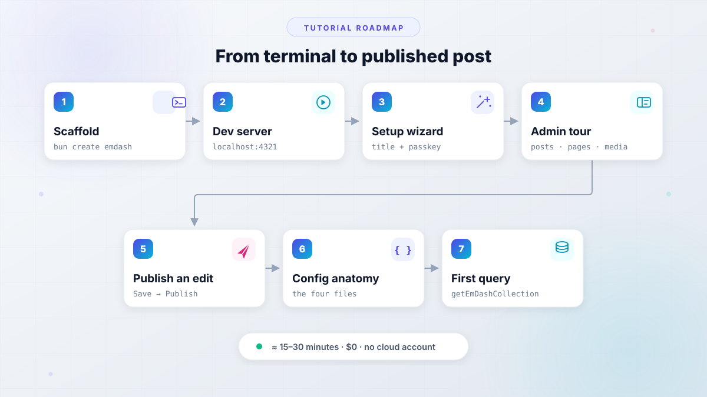

This is Part 2 of a series. [Our six-month EmDash CMS review](/emdash-cms-review/) covers what changed at 1.0 and who the CMS is really for. This tutorial stays on the no-cloud-account local path (Node.js + SQLite + local uploads). Deploy comes next: Cloudflare Workers with D1 and R2 in Part 3, and a VPS with Docker in Part 4.

**Cost of this tutorial: $0.** No cloud account, no paid tier, no trial period. State lives in three local paths: `data.db`, `uploads/`, and `.env`. Delete the folder and you are back to zero.

<Button text="Read the EmDash CMS review" link="/emdash-cms-review/" variant="outline" color="blue" size="md" icon="arrow-right" />

## Prerequisites: what you need to install EmDash CMS

Before you install EmDash CMS tooling, tick this list. The requirements are small, but one of them is a hard floor. (The official [getting-started docs](https://docs.emdashcms.com/getting-started/) list the same floor; this guide adds the prompts, the admin tour, and the failure modes.)

<ListCheck>
<ul>
<li>Node.js v22.16.0 or newer (hard requirement)</li>
<li>npm 10+ (or Bun 1.x; both paths are shown below)</li>
<li>A passkey-capable browser: Chrome, Edge, Safari, or Firefox</li>
<li>~15-30 minutes and ~500 MB of free disk for `node_modules`</li>
<li>No cloud account (SQLite plus local files are enough)</li>
</ul>
</ListCheck>

The `emdash` package is roughly 23 MB unpacked across around 2,500 files, so the first dependency install is slower than a typical Astro project. That is expected. You need no Cloudflare account, no Docker daemon, no Postgres, and no Redis. Port 4321 should be free (Astro picks another port if it is not; more on that in Step 2).

If you already run pnpm or yarn, the scaffolder supports them too (`pnpm create emdash@latest`, `yarn create emdash`). The rest of the guide uses npm, with the bun equivalent next to it.

### Check your Node.js version (22.16+)

```bash
node --version
```

It must print `v22.16.0` or later. On a distro with an older default Node, do not fight the package manager; use a version manager:

```bash
nvm install 22 && nvm use 22   # or: fnm install 22
```

**Verify:** run `node --version` again. If you see `v22.15.0` or anything below `v22.16.0`, the scaffolder and the dev server will both complain later. Fix it now.

## Step 1: scaffold a new project with `npm create emdash`

The scaffolder is `create-emdash`, and every package manager can run it. I used npm for this run, so that is the default path here.

<Tabs>
<Tab name="npm">

```bash
npm create emdash@latest
```

</Tab>
<Tab name="Bun">

```bash
bun create emdash@latest
```

</Tab>
</Tabs>

**Scaffolder run (Node.js deploy target, Blog template, npm):**

```sh
— E M D A S H —

┌  Create a new EmDash project
│
◇  Project name? (use "." for current directory)
│  my-emdash-site
│
◇  Where will you deploy?
│  Node.js
│
◇  Which template?
│  Blog
│
◇  Which package manager?
│  npm
│
◇  Install dependencies?
│  Yes
│
◇  Project created!
│
●  Wrote EMDASH_ENCRYPTION_KEY to .env.
│
●  Installing dependencies with npm...

added 750 packages, and audited 751 packages in 38s

234 packages are looking for funding
  run `npm fund` for details

found 0 vulnerabilities
│
◆  Dependencies installed!
│
◇  Next steps ──────╮
│                   │
│  cd my-emdash-site  │
│  npm run dev        │
│                   │
├───────────────────╯
│

```

`pnpm create emdash@latest` and `yarn create emdash` work the same way and ask the same questions. Answer the prompts as follows.

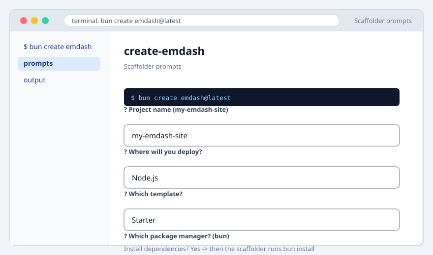

### Every scaffolder prompt, explained

Five prompts, and only two of them matter for this tutorial.

1. **Project name.** `my-emdash-site` is fine. This becomes the folder name and the npm package name.
2. **Where will you deploy?** Choose **Node.js**. This is the decision that shapes the generated `astro.config.mjs`: the Node adapter in `standalone` mode plus a SQLite database file. The Cloudflare option wires D1 and R2 bindings into the config instead; that path is Part 3 of this series.

<Tabs>
<Tab name="Node.js (this tutorial)">

SQLite `data.db`, Node adapter, local `uploads/` directory. Runs on a laptop today and on any VPS later. No cloud account at any point.

</Tab>
<Tab name="Cloudflare">

Generated config targets D1 (database) and R2 (media) bindings, deployed with Wrangler. You need a Cloudflare account, and sandboxed plugins push you onto Workers Paid (around $5/mo as of September 2026, verify pricing at deploy time). Full walkthrough is Part 3.

</Tab>
</Tabs>

3. **Which template?** Choose **Blog**. Five templates ship with `create-emdash`: blog, marketing, portfolio, starter, and blank. Blog seeds Posts, Pages, comments, and sample posts. That is the richest starting point for learning the content model, and it is the template behind every screenshot below. Starter is the trimmed-down variant for later projects. (The GitHub README still says "three starter templates"; trust the `templates/` folder in the repo.)
4. **Which package manager?** Keep whatever the scaffolder detected from the command you ran.
5. **Install dependencies?** Yes.

<Notice type="warning" title="If the dependency install fails">
The project files are already written at that point, so nothing is lost. The scaffolder prints a retry command; run it inside the project folder and continue. Deleting the folder and re-scaffolding also works, it just costs another download.
</Notice>

### What the scaffolder generated (project tree)

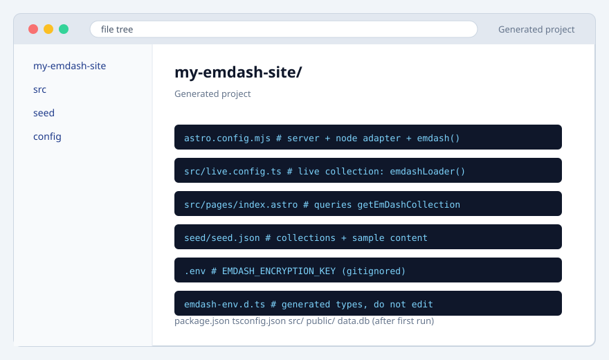

The interesting parts of `my-emdash-site/`:

- `astro.config.mjs`: server output, Node adapter, `react()`, and the `emdash()` integration with a SQLite database and local media storage. Dissected in Step 6.
- `src/live.config.ts`: connects EmDash content to Astro's Live Content Collections. Six lines. Also Step 6.
- `src/pages/index.astro`: the generated home page. It already calls `getEmDashCollection("posts")`, which is Step 7's subject.
- `seed/seed.json`: the content model, meaning collections, fields, and the sample content the setup wizard will apply.
- `.env`: generated and gitignored, containing `EMDASH_ENCRYPTION_KEY`. You did not type it; the scaffolder wrote it. Do not commit it.
- `emdash-env.d.ts`: generated TypeScript types. The dev server refreshes it. Never hand-edit it.

**Verify:** the folder exists, `.env` is present and listed in `.gitignore`, and `node_modules` is populated. If you use git, commit the code and `seed/seed.json` now and confirm `.env` does not show up in `git status`.

Already have an Astro project? Do not scaffold a new one. The official guide to [adding EmDash to an existing Astro project](https://docs.emdashcms.com/existing-project/) covers the five packages you install by hand (`emdash @astrojs/node @astrojs/react react react-dom`) plus the same config wiring this tutorial walks through.

## Step 2: start the dev server

```bash
cd my-emdash-site
npm run dev    # or: bun dev
```

The start will look like:

```sh
➤ npm run dev

> my-emdash-site@0.0.3 dev
> astro dev

13:12:05 [@astrojs/node] Enabling sessions with filesystem storage


  — E M D A S H —  v1.0.1

13:12:05 [vite] connected.
13:12:05 [types] Generated 1ms
13:12:05 [vite] connected.

  › Admin UI    http://127.0.0.1:4321/_emdash/admin
  › MCP server  http://127.0.0.1:4321/_emdash/api/mcp
  › Dev bypass  http://127.0.0.1:4321/_emdash/api/setup/dev-bypass?redirect=/_emdash/admin
    Skips passkey setup/auth and signs you in as a dev admin

 astro  v7.3.5 ready in 2752 ms
┃ Local    http://localhost:4321/
┃ Network  use --host to expose
13:12:07 watching for file changes...
13:12:08 [vite] [optimizer] bundling dependencies...
(node:44901) ExperimentalWarning: SQLite is an experimental feature and might change at any time
(Use `node --trace-warnings ...` to show where the warning was created)
[datetime migration] 0 noncanonical values (0 naive) using UTC
Auto-seeded default collections
13:12:10 [200] POST /_emdash/api/typegen 2207ms
13:12:10 [200] POST /_emdash/api/typegen 2ms

```

You get Astro's dev server banner pointing at `http://localhost:4321/`. Keep this terminal open; the dev server is your rebuild, your type generator, and your runtime all at once.

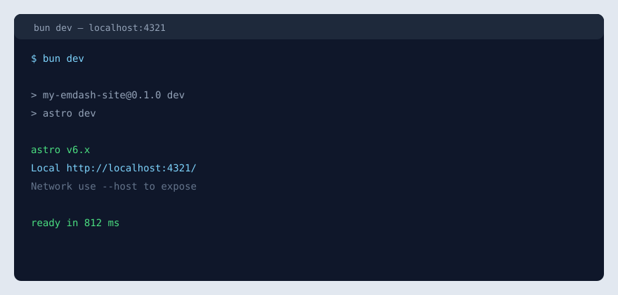

Open `http://localhost:4321/` and you should see the Blog template's home page. Open `http://localhost:4321/_emdash/admin/` and a brand-new site redirects you into the setup wizard, which is Step 3.

The first request can feel slow. Astro is transpiling the admin bundle and EmDash is applying its database migrations on first request (default migration mode is `runtime: "auto"`). Subsequent loads are fast.

**Verify:**

```bash
curl -s -o /dev/null -w "%{http_code}\n" http://localhost:4321/
# expect: 200
```

**Failure mode:** if port 4321 is taken, Astro picks the next free port and prints it. Use the URL it prints, not the one in this article. The setup wizard URL and any passkey you register later are tied to whatever origin you opened.

## Step 3: getting started with the EmDash setup wizard

The wizard at `http://localhost:4321/_emdash/admin/` runs once, on an empty database. Three screens.

**Screen 1: site info.** Enter a **Site Title** (and an optional tagline). Leave **Include sample content** selected. That checkbox is where the Welcome post and About page come from; without it the admin looks emptier than the screenshots below.

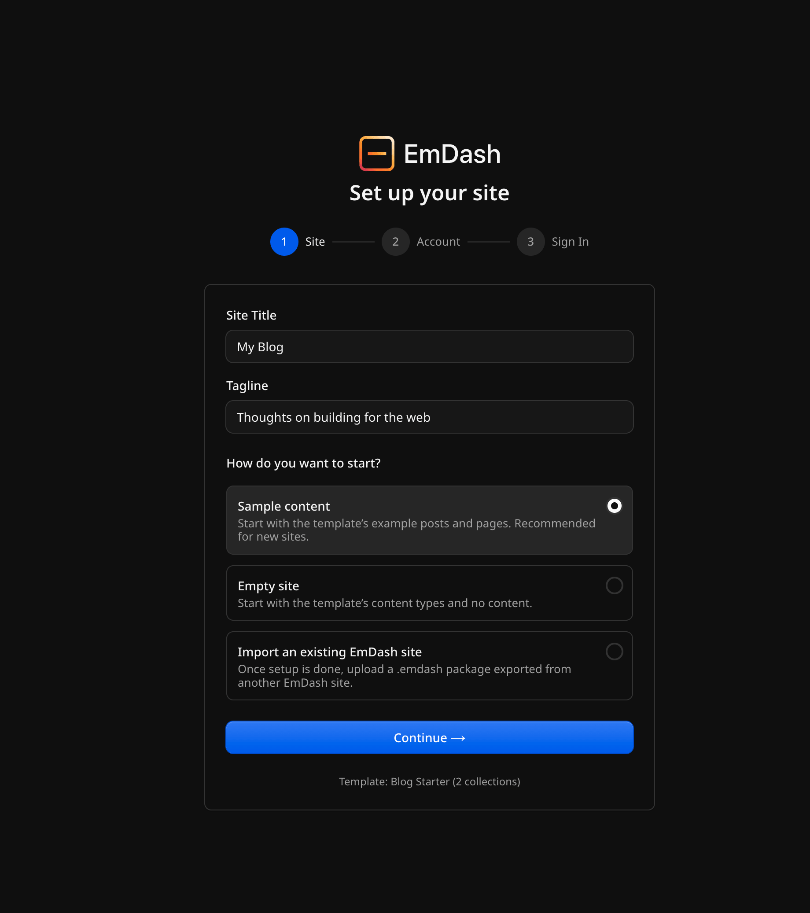

**Screen 2: your account.** Email is required; name is optional. The first user is always an Admin, which is the role with full access to settings, plugins, schema, and other users. Roles below Admin are Subscriber, Contributor, Author, and Editor (in that order of capability). You will not need them until someone else edits with you.

**Screen 3: register a passkey.** When the browser credential prompt appears, approve it. Then click **Open the dashboard**.


**Verify:** `/_emdash/admin` loads the dashboard with no login form in between. That single check proves the React admin mounted, the database is reachable, and your passkey works. If the dashboard appears, the rest of this tutorial is bookkeeping.

### Registering your first passkey (and the localhost gotcha)

A passkey is a WebAuthn credential. The prompt looks different per platform: Touch ID or device password on macOS, Windows Hello on Windows, Face ID or fingerprint on mobile, or a physical security key anywhere. Passkeys sync through iCloud Keychain, Google Password Manager, or 1Password, so you usually get a recovery path for free.

EmDash allows up to 10 passkeys per user and refuses to remove the last one. Register a backup passkey in account settings before you have anything worth losing.

<Notice type="warning" title="Passkeys are domain-bound">
A passkey registered on `localhost:4321` will never work on `example.com`, and the reverse is also true. After you deploy (Parts 3 and 4), you register again on the real domain. Plan for it now so the first deploy-day lockout does not surprise you.
</Notice>

Worth knowing before you rely on it: the magic-link fallback only works if you configure email, and rate limits apply (passkey options are limited per IP per minute). If you are the only admin, you lose every passkey, and no email is configured, recovery means resetting the database. Register a backup passkey.

## Step 4: a tour of the EmDash admin panel

One conceptual anchor before clicking around: **EmDash edits data, Astro components own the HTML.** This is not a visual page builder. There is no drag-and-drop layout. Editors change content, menus, and widgets; your templates decide what renders and where.

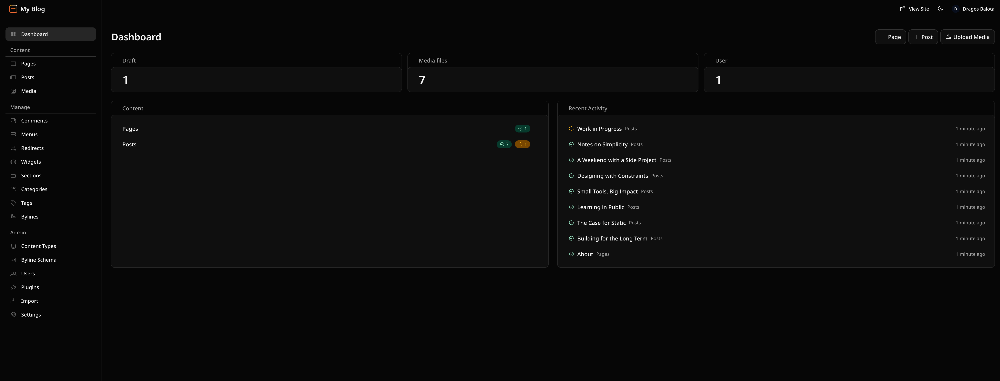

The sidebar groups into three sections. **Content** holds Pages, Posts, Media, and any content type you create later. **Manage** covers Comments, Menus, Redirects, Widgets, Sections, Categories, Tags, and Bylines. **Admin** is the operator end: Content Types, Byline Schema, Users, Plugins, Import, and Settings. Spend your time on the areas below; the rest are obvious when you need them.

### Posts and pages: drafts vs. published

Posts and Pages are the two collections the Blog template seeds. The list view shows status (draft, published, scheduled, trash), and the editor is TipTap over Portable Text (structured JSON, not raw HTML in the database).

Opening an entry takes an edit lock. If someone else (or another tab) has it open, your stale save is refused instead of silently winning. That behavior matters more than it sounds when an agent is also editing through the MCP server later.

<Notice type="info" title="Save vs Publish">
**Save** writes a private draft. **Publish changes** makes it public. Nothing appears on the site until you publish. The schedule control records a go-live time for a draft, so "publish later" is a first-class action, not a cron hack.
</Notice>

### Media library: uploads, crop, and limits

Drag and drop uploads with per-file queue states. Accepted formats: PNG, JPEG, GIF, WebP, AVIF, MP4, WebM, MOV, MP3, WAV, Ogg, and PDF. Images get crop presets (Original, Freeform, Square, 4:3, 3:2, 16:9) plus a focal point. Folders, type filters, and filename search keep it usable past a few dozen files.

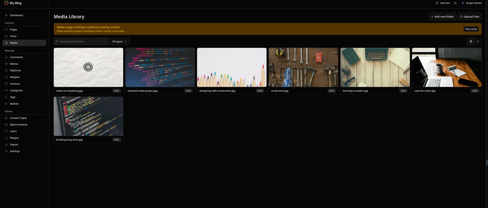

Two behaviors to know up front:

- **Replace image** keeps the media ID, so every reference to that image updates at once. Use it for "same slot, new artwork" instead of deleting and re-uploading.
- **Used in** (usage tracking) is off until you enable it once in Settings. It is one-way: once enabled, it cannot be disabled.

<Notice type="warning" title="SVG uploads are blocked by default">
SVGs are excluded because they can carry active content. Your logo in SVG form will fail on upload; export a PNG or WebP copy. The default `maxUploadSize` is 50 MB. Both limits are configurable, but leave them alone until you have a reason not to.
</Notice>

### Menus and widget areas (why the site doesn't change yet)

This is the section that trips everyone. Create a menu in **Menus** (name it `primary`, label it "Primary nav") and add a custom link. Then open **Widget Areas** (`/_emdash/admin/widgets`), add a `sidebar` area, and drop in a content widget and `core:recent-posts`.

Now reload the public site. Nothing changed.

That is correct behavior. EmDash stored your menu and widgets; no Astro template is rendering them yet. Templates call `getMenu("primary", { locale })` (returns `null` when the menu does not exist) and `getWidgetArea("sidebar")` with a small widget renderer. Until you write that code, admin-side changes stay invisible. Widget types cover content (Portable Text), menus, and components like `core:recent-posts`, `core:categories`, `core:tags`, `core:search`, and `core:archives`.

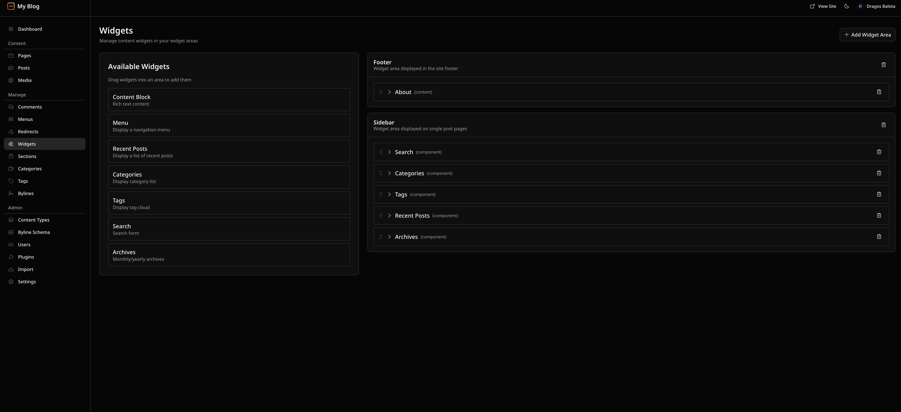

Nothing in the generated Astro pages renders widget areas yet, so creating one now is the honest way to see the data get stored. The rendering side belongs in your templates, not in this tutorial.

### Content Types and Settings: the schema and the knobs

Two screens in the Admin group finish the tour. Skim them now, change them later.

**Content Types** is the schema editor: the same model `seed/seed.json` wrote during setup, editable in the UI. Creating a type asks for singular and plural labels plus a slug. The slug is what your code passes to `getEmDashCollection("testimonials")` and what API endpoints use. The toggles are worth reading once: **Routable** requires a slug before an entry can publish, **Edit locking** is the hold-the-entry behavior from the Posts section, and **URL pattern** takes `{slug}`, `{id}`, and date tokens, so a WordPress-style `/{year}/{month}/{day}/{slug}` permalink is one line of config. A navigation group folds related types into one collapsible sidebar folder, and the icon field takes a Phosphor icon name. New types show up under Content as soon as you save.

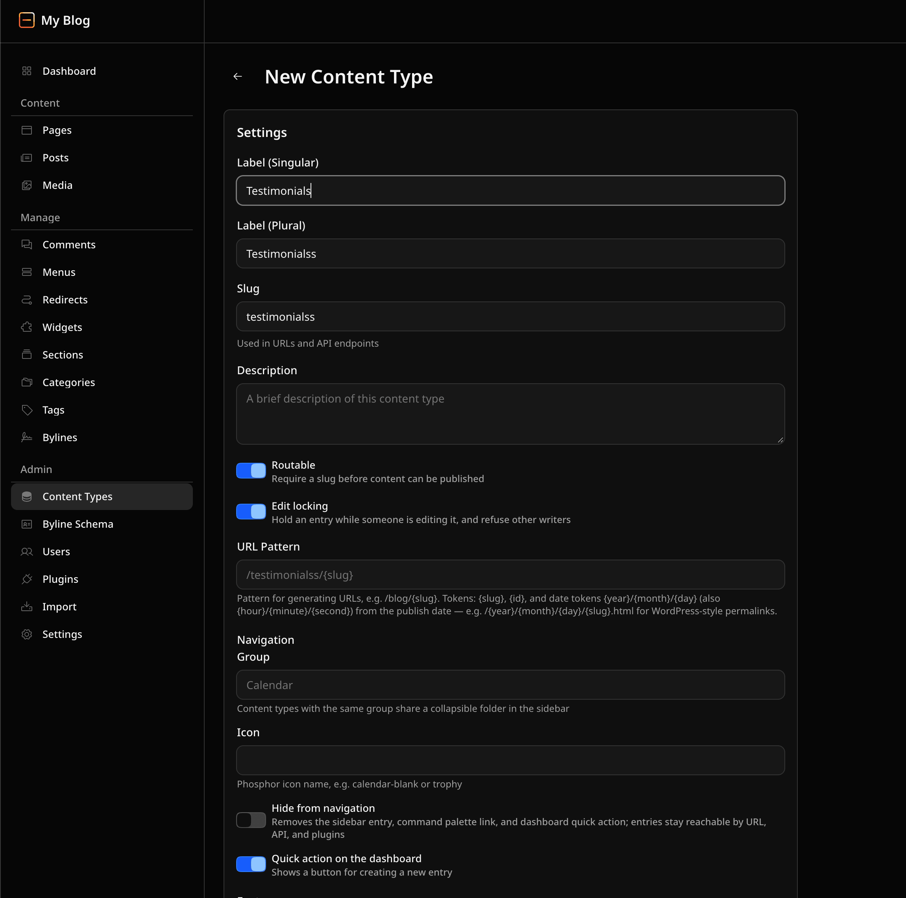

Two schema gotchas to file away: adding a field to an existing type does not backfill values on old entries (they get the new field only when you edit and save them), and every model change regenerates `emdash-env.d.ts` on the next dev tick, so your query code stays typed.

**Settings** collects the operational knobs in one screen: Site (identity, logo, social links, SEO fields), Media (the one-way usage-tracking toggle from the media section), Security (passkeys and self-signup domains), API Tokens (personal access tokens for the REST API and the MCP server), Email (provider status and test mail, the same magic-link dependency from Step 3), Backups (manual download plus scheduled automatic backups), Transfer (export this site into another EmDash install), and Language for the admin UI.

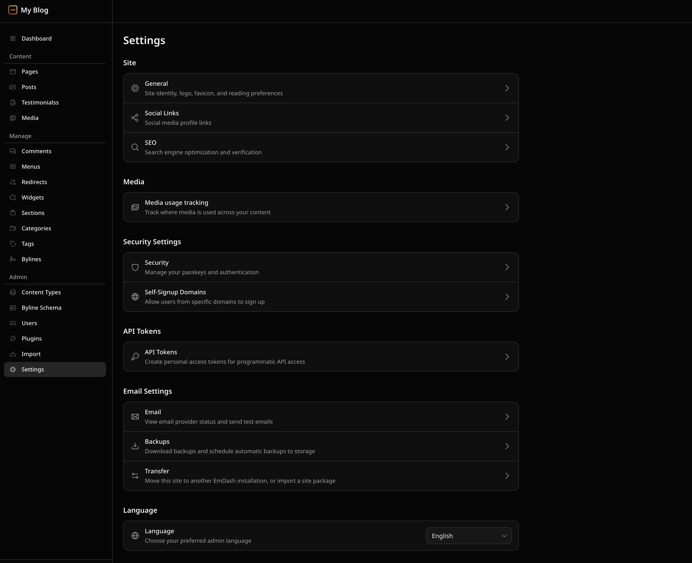

The two worth remembering on day one: **API Tokens** is where a contributor-scoped token comes from when you wire an agent in later, and **Backups** is the button that makes the `data.db` + `uploads/` + encryption-key tripod from Step 6 into a downloadable file.

## Step 5: publish your first edit (a mini EmDash CMS demo)

This is the demo moment: an edit in the admin appearing on the public site with no rebuild.

1. Go to **Posts** and open the sample **Welcome** post.
2. Change the title to `Hello from EmDash`.
3. Click **Save**. The entry is now a draft with your change.
4. Click **Publish changes**.
5. Reload `http://localhost:4321/`.

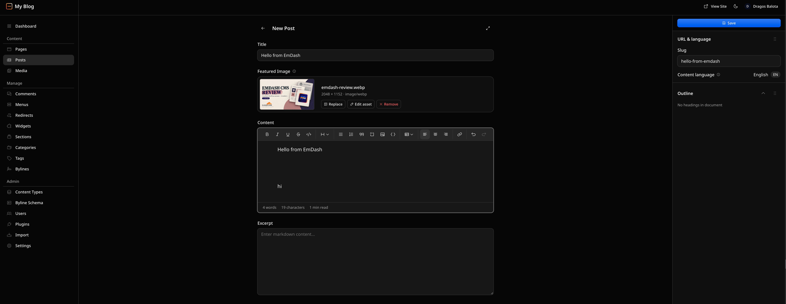

The home page now lists "Hello from EmDash". Nothing rebuilt, nothing redeployed: the dev server never restarted and `astro build` never ran.


Why that worked in two seconds: the Blog template's home page calls `getEmDashCollection("posts")` at render time. With Live Content Collections, the query reads published content from the database on each request, so the next page load sees the next version.

**Verify:** rename the post again, save, publish, reload. Round trip works. Now unpublish it and reload; the post disappears from the list. If either direction fails, the page is probably prerendered. That is the number-one cause of "my edit did not show up", and Step 7 explains the fix.

## Step 6: how the config files fit together

Four files explain the entire project. The mental model first: **the schema lives in the database, types are generated from it, content lives in the database, and HTML is owned by Astro.** Your repo holds code and the starting model, not the content.

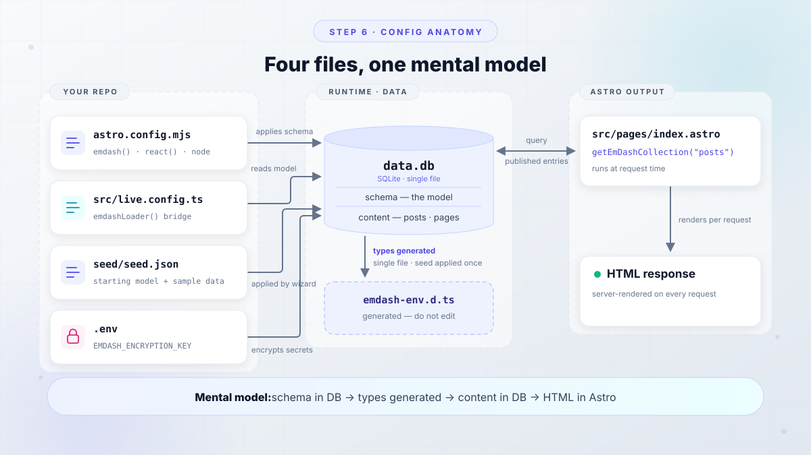

### `astro.config.mjs`: server output, Node adapter, and `react()`

This is the shape the Node/SQLite path generates (also the shape you would hand-write into an existing project):

```js
import node from "@astrojs/node";
import react from "@astrojs/react";
import { defineConfig } from "astro/config";
import emdash, { local } from "emdash/astro";
import { sqlite } from "emdash/db";

export default defineConfig({
  output: "server",
  adapter: node({ mode: "standalone" }),
  integrations: [
    react(),
    emdash({
      database: sqlite({ url: "file:./data.db" }),
      storage: local({
        directory: "./uploads",
        baseUrl: "/_emdash/api/media/file",
      }),
    }),
  ],
});
```

Line by line: `output: "server"` makes pages render at request time, which is what gives you instant publish-to-live. `node({ mode: "standalone" })` produces a self-contained Node server in `dist/server/entry.mjs`. `react()` registers React because the admin panel is a React app. `sqlite({ url: "file:./data.db" })` is your entire database, one file. `local({ directory: "./uploads", ... })` stores media on disk and serves it through the EmDash media route; if you omit `storage`, EmDash defaults to `./.emdash/uploads` with the same `baseUrl`.

<Notice type="error" title="react() is mandatory, even on a pure-Astro site">
Forgetting `react()` in `integrations` is the classic EmDash footgun. Installing `@astrojs/react`, `react`, and `react-dom` is not enough; the integration must be registered. Symptom: `/_emdash/admin` hangs on "Loading EmDash…". Fix the config and restart the dev server.
</Notice>

For what the underlying framework is doing with server output and builds these days, see [what's new in Astro's build performance](/astro-7-faster-builds/).

### `src/live.config.ts`: bridging the database to Astro

```ts
import { defineLiveCollection } from "astro:content";
import { emdashLoader } from "emdash/runtime";

export const collections = {
  _emdash: defineLiveCollection({ loader: emdashLoader() }),
};
```

This is the wire between database-backed content and Astro's content layer. `emdashLoader()` reads the model that lives in the database and exposes it as a live collection, so `getEmDashCollection("posts")` is typed and queryable. If a `src/live.config.ts` already exists in your project, add the `_emdash` entry to its `collections` object instead of overwriting the file. A file-based `src/content.config.ts` keeps working alongside it.

The dev server also refreshes `emdash-env.d.ts` as the model changes, so your editor picks up new fields without a manual step. Do not edit that file; regenerate, never patch. (For remote schemas there is a separate path: `npx emdash types` writes `.emdash/types.ts` and `.emdash/schema.json`.)

### `seed/seed.json`, `.env`, and `EMDASH_ENCRYPTION_KEY`

`seed/seed.json` declares your starting model: collections, their fields, and sample content. The setup wizard applies it to an empty database. It never overwrites existing data on later runs. This file is the thing you commit to git and version as your schema evolves; the content itself is not in the repo.

`.env` holds `EMDASH_ENCRYPTION_KEY`, generated by the scaffolder. You can generate one yourself:

```bash
npx emdash secrets generate --write .env
```

`--write` refuses to overwrite an existing key without `--force`, which is a good default. What the key does: it encrypts plugin secrets at rest. The key itself is never stored in the database.

<Notice type="warning" title="Back up the encryption key separately">
Restore the database without `EMDASH_ENCRYPTION_KEY` and every encrypted plugin setting is unreadable. Keep a recovery copy outside your normal DB backups, the same place you would keep a password manager export. This is the third leg of the backup tripod: `data.db` + `uploads/` + the key.
</Notice>

Environment variables worth knowing (full list in the [configuration reference](https://docs.emdashcms.com/reference/configuration/)):

| Variable | What it does |
|---|---|
| `EMDASH_SITE_URL` | Public site URL. Required on any non-loopback host; setup fails with `SITE_URL_REQUIRED` otherwise. Falls back to `SITE_URL`. |
| `EMDASH_DATABASE_URL` | Overrides the database location outside `astro.config.mjs`. |
| `EMDASH_ALLOWED_ORIGINS` | Extra browser origins accepted at passkey verification (multi-hostname deployments). |
| `EMDASH_PREVIEW_SECRET` | Secret for draft preview URLs. |
| `EMDASH_IP_SALT` | Salt for commenter-IP hashing. |
| `EMDASH_MIGRATIONS_MODE` | `auto` (default: apply on first request), `check` (503 while pending), `manual`. |

## EmDash plugins: how they work and how to add one

Yes, plugins install with npm, but which npm package you reach for depends on which of EmDash's two plugin formats you mean. The distinction is the whole design.

**Native plugins** are ordinary npm packages that run in-process with full access to your site. They are for code you trust: first-party packages like forms, SEO, audit log, and email integrations. Install and register one in `astro.config.mjs`:

```bash
npm install @emdash-cms/plugin-forms
```

```js
// astro.config.mjs
import forms from "@emdash-cms/plugin-forms";

export default defineConfig({
  output: "server",
  adapter: node({ mode: "standalone" }),
  integrations: [
    react(),
    emdash({
      database: sqlite({ url: "file:./data.db" }),
      storage: local({
        directory: "./uploads",
        baseUrl: "/_emdash/api/media/file",
      }),
      plugins: [forms()],
    }),
  ],
});
```

`npm install`, import, add to the `plugins: []` array, restart the dev server. The plugin's screens and hooks join the admin on the next request, and its entries show up under **Admin > Plugins**. Upgrading is `npm update` like any other dependency, which is the point: trusted code behaves like trusted code.

**Sandboxed plugins** are the registry installs. Each ships a capability manifest (`content:read`, `email:send`, declared hostnames for outbound calls) that the admin makes you approve at install time, and every hook and route runs in an isolated `workerd` process with fixed limits: 128 MB memory, 30 seconds wall time, no network access to undeclared hosts. You install them from the Plugins screen inside `/_emdash/admin`, not from a package.json edit.

On this Node.js path, sandboxed plugins need one extra package, because the isolation layer is Cloudflare's `workerd` runtime running as a child process on your own machine:

```bash
npm install @emdash-cms/sandbox-workerd workerd
```

```js
sandboxRunner: "@emdash-cms/sandbox-workerd/sandbox",
```

Without it the site runs fine but every registry install fails with `SANDBOX_NOT_AVAILABLE`, which confuses people because nothing looks broken until you try. (On Cloudflare the equivalent is the Worker Loader binding, which needs Workers Paid; Part 3 covers it. `sandbox: false` runs sandboxed code in-process, but that is a debugging switch, not a posture.)

<Notice type="info" title="Do you need plugins today?">
No. This tutorial works end to end without any, and the Blog template already covers posts, pages, media, menus, and widgets. Come back to this section when you want a form plugin, a registry install, or automated SEO fields. It is a two-minute add-on, not a setup step.
</Notice>

## Step 7: query your first posts with `getEmDashCollection`

The Blog template's `src/pages/index.astro` already does the basic version. Here is the shape worth learning, with error handling and the cache hint:

```astro
---
import { getEmDashCollection } from "emdash";

const { entries: posts, error, cacheHint } = await getEmDashCollection("posts", {
  orderBy: { published_at: "desc" },
  limit: 7,
});

if (error) {
  console.error("Failed to load posts:", error);
  return new Response("Unable to load posts", { status: 500 });
}
if (Astro.cache?.enabled) Astro.cache.set(cacheHint);
---
<ul>
  {posts.map((post) => <li>{post.data.title}</li>)}
</ul>
```

Five things this teaches:

1. **Errors come back as data, not exceptions.** The result object is `{ entries, error, cacheHint, nextCursor, hasMore }`. An empty `entries` array means both "no matches" and "query failed", so check `error` before you trust an empty list.
2. **Public queries default to `status: "published"`**. Drafts are invisible to `getEmDashCollection` until you publish (or hand someone a preview URL).
3. **`orderBy` uses database column names**: `published_at`, `created_at`, `updated_at`. The camelCase field names you see on `entry.data` (like `entry.data.publishedAt`) are not valid in `orderBy`. Use the snake_case form everywhere; a couple of older examples in the docs use camelCase there, and the querying guide is the one to trust.
4. **`entry.id` is the URL-facing slug; `entry.data.id` is the stable content ID**, which survives a slug change. Link to the first, store references to the second.
5. **`where` filters are AND-combined** (object of key/value pairs) with array values meaning OR, and taxonomy keys matching term slugs. Pagination cursors come back as `nextCursor` plus a `hasMore` flag.

For a single post page, switch to `getEmDashEntry`:

```astro
---
import { getEmDashEntry } from "emdash";
import { PortableText, Image } from "emdash/ui";

const { entry: post, error, isPreview } = await getEmDashEntry("posts", Astro.params.slug!);
if (error) return new Response("Unable to load post", { status: 500 });
if (!post) return new Response(null, { status: 404 });
---
<h1>{post.data.title}</h1>
<PortableText value={post.data.content} />
<Image image={post.data.featured_image} priority />
```

`isPreview` is true on preview-token requests, so you can label draft views. `PortableText` and `Image` come from `emdash/ui`; `getSeoMeta(post, { siteTitle, siteUrl, path })` fills your meta tags. When Astro's cache is enabled, `Astro.cache.set(cacheHint)` tags the page and publish events invalidate it.

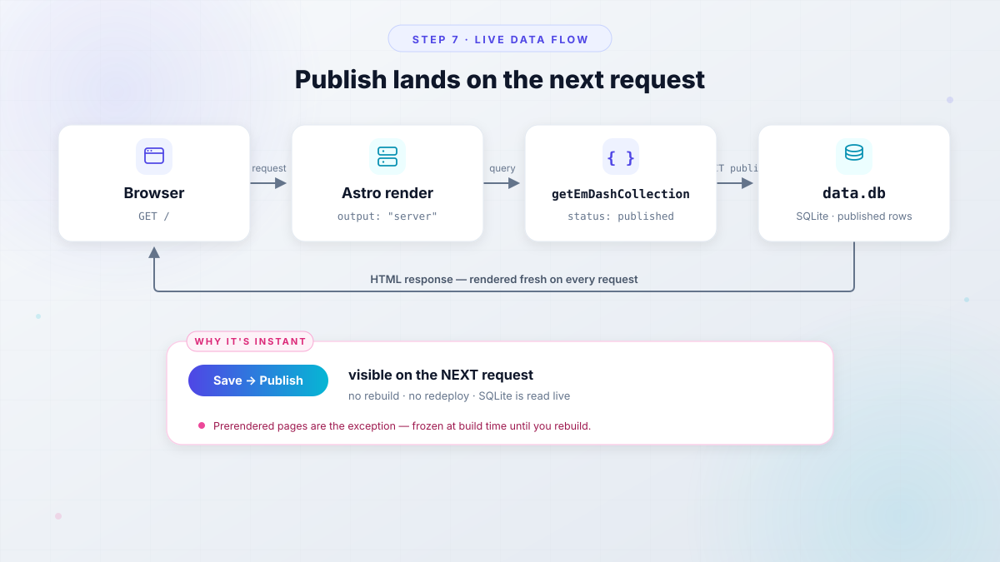

**Verify:** edit the post title one more time, save, publish, reload. The change appears on the next request because the page is server-rendered (`output: "server"` in Step 6). Prerendered pages are the opposite: frozen at build time until you rebuild. If your edits never show up, check which one your page is.

## Troubleshooting common EmDash CMS setup errors

Symptom, cause, fix. These are the failures people hit in the first hour.

| Symptom | Cause | Fix |
|---|---|---|
| Admin stuck on "Loading EmDash…" | `react()` missing from `integrations` | Register `react()` in `astro.config.mjs`; installing the packages alone is not enough. Restart the dev server. |
| `getEmDashCollection()` errors about a live collection | `src/live.config.ts` missing the `_emdash` entry | Add `defineLiveCollection({ loader: emdashLoader() })` to the `collections` object. |
| Edits do not appear on the page | Page is prerendered, or the site is not `output: "server"` | Server-render to see publishes on the next request; prerendered pages need a rebuild. |
| Passkey rejected after deploy | Passkeys are domain-bound | Register a new passkey on the new domain. The `localhost` one stays on `localhost`. |
| `orderBy` rejects camelCase fields | `orderBy` takes DB column names | Use `published_at`, `created_at`, `updated_at`. |
| Dependency install died mid-scaffold | Network or registry hiccup | Project files remain. Run the retry command the scaffolder printed. |
| Dev server on an unexpected port | 4321 already in use | Use the URL Astro prints. Passkeys and the wizard URL match that origin. |
| Setup fails with `SITE_URL_REQUIRED` | Setup on a non-loopback host without `EMDASH_SITE_URL` | Set `EMDASH_SITE_URL` (or `siteUrl` in config) before running setup outside localhost. |

**Rollback and clean slate.** Ctrl+C the dev server, then delete the project folder; that is a complete undo, since `data.db`, `uploads/`, and `.env` live inside it. Two caveats for later versions of this project: `npx emdash migrate` has no `down` and no `--dry-run` (check pending work with `npx emdash migrate --check`), so "rolling back" a schema change means restoring files, not running a down migration. Stop the process before you swap in a backup `data.db`; a live server holding the old file handle will corrupt your afternoon.

Two quick health checks once anything feels off:

```bash
npx emdash doctor      # local DB: connection, migrations, collections, users
npx emdash whoami      # dev-bypass auth on localhost shows your admin user
```

## Verify: your first EmDash site is working

Run this list before you move on to deployment. Each item maps to something this tutorial built.

<ListCheck>
<ul>
<li>`http://localhost:4321/` renders and lists the renamed post</li>
<li>`/_emdash/admin` loads the dashboard (proves `react()` + database + auth)</li>
<li>Draft round trip works: edit → Save → Publish changes → visible; Unpublish → gone</li>
<li>A media upload appears inside a Portable Text page, and delete works</li>
<li>`npx emdash doctor` passes against the local database</li>
<li>Optional: `npx emdash whoami` shows your admin user</li>
</ul>
</ListCheck>

## FAQ: common questions about getting started with EmDash

<Accordion label="Do I need a Cloudflare account to follow this tutorial?" group="faq" expanded="true">
No. This entire tutorial runs on Node.js with SQLite (`data.db`) and a local `uploads/` directory. Cloudflare enters only when you choose the Cloudflare deploy target or deploy to Workers, which is Part 3 of the series. Nothing here requires a card, a trial, or an account.
</Accordion>

<Accordion label="Where does my content live? Can I still use git?" group="faq">
Content lives in the SQLite database (`data.db`), not in your repo. That is deliberate: Portable Text JSON in a database is what lets editors work without touching git. What you do commit is code plus `seed/seed.json`, the versioned starting model. Back up three things together: `data.db`, `uploads/`, and `EMDASH_ENCRYPTION_KEY` from `.env`.
</Accordion>

<Accordion label="What is a passkey and what if my browser does not support one?" group="faq">
A passkey is a WebAuthn credential, usually backed by Touch ID, Windows Hello, Face ID, or a hardware key, and synced by iCloud Keychain, Google Password Manager, or 1Password. Every current desktop browser handles them on localhost. The magic-link fallback exists but needs email configured. Practical advice: register a backup passkey in account settings the day you create your admin.
</Accordion>

<Accordion label="Why do I need React on a non-React site?" group="faq">
The admin panel at `/_emdash/admin` is a React application. The `react()` Astro integration is what mounts it. Forget it and the admin hangs on "Loading EmDash…". Your site templates can stay pure Astro; React ships for the editing UI.
</Accordion>

<Accordion label="Save vs Publish: which one makes content public?" group="faq">
**Publish changes**. Save writes a private draft that only editors (and preview URLs) can see. Because pages are server-rendered and backed by Live Content Collections, a published edit appears on the next request with no rebuild and no dev-server restart. Scheduled posts record a go-live time and flip automatically.
</Accordion>

<Accordion label="Why did my menu or widget not change the site?" group="faq">
Because the admin stores data and your Astro templates render it. A menu named `primary` only shows up once a template calls `getMenu("primary", { locale })`; widgets need `getWidgetArea("sidebar")` plus a renderer. EmDash is not a visual page builder, so admin-side layout data stays invisible until your code asks for it.
</Accordion>

<Accordion label="What does EMDASH_ENCRYPTION_KEY encrypt, and what happens if I lose it?" group="faq">
It encrypts plugin secrets at rest. The key is operator-provided and never stored in the database, so restoring `data.db` without the key leaves plugin settings unreadable. Keep a recovery copy outside your DB backups. Also remember: it is gitignored on purpose. Committing it defeats the entire point of encrypting secrets.
</Accordion>

## Next steps: deploy your EmDash site

You now have a running local EmDash site and a working mental model of its parts. Local is fine for building. It is not a website yet.

Three forward paths, in the order this series covers them:

1. **Part 3: Cloudflare Workers + D1 + R2.** The all-in Cloudflare path, same platform the Cloudflare Blog runs on. The free tier covers a basic site (templates ship without the Worker Loader binding); sandboxed plugins need Workers Paid, around $5/mo as of September 2026. Verify pricing before you commit.
2. **Part 4: your own VPS with Node.js and Docker.** The official Node.js deploy docs give you a `node:22-alpine` multi-stage Dockerfile and a compose file with a named volume for `/app/data` (that volume holds your database and uploads in one place). A 1-2 GB VPS like a [Hetzner Cloud VPS](https://go.bitdoze.com/hetzner) runs blog-scale comfortably at around €4-5/mo. If you want the surrounding stack in the meantime, [deploy an Astro site on a VPS with CloudPanel](/deploy-astro-on-vps/) or [host Node.js apps on a VPS with CloudPanel and PM2](/install-cloudpanel-host-nodejs/) cover the two halves of that setup.
3. **Zero-ops alternative.** [Deploying apps on your own server with Coolify](/coolify-install-heroku-alternative/) gets you git-push deploys and an HTTPS proxy without hand-rolling systemd units.

Production hardening, previewed now and covered properly in Parts 3 and 4: set `EMDASH_SITE_URL` on any host that is not localhost, run the three-legged backup (`data.db` + `uploads/` + the encryption key), keep the 50 MB upload cap and the SVG ban until you have a reason to change them, and set `trustedProxyHeaders` behind a reverse proxy so per-IP auth rate limits behave.

CLI commands worth keeping open in a second terminal:

```bash
npx emdash doctor                    # local database health check
npx emdash whoami                    # who the dev bypass says you are
npx emdash content list posts        # list content from the terminal
npx emdash seed --validate           # CI-safe seed check
npx emdash secrets generate --write .env

npm run build
node --env-file=.env ./dist/server/entry.mjs   # standalone does NOT auto-load .env
```

That last line is the Part 4 cliffhanger: the standalone server expects you to pass `--env-file`. Miss it and the app boots without `EMDASH_ENCRYPTION_KEY`.

<Button text="Start with our EmDash CMS review" link="/emdash-cms-review/" variant="solid" color="blue" size="md" icon="arrow-right" />
