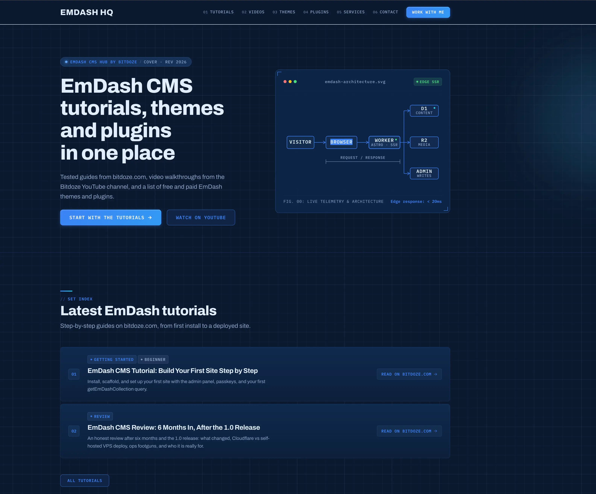

import Button from "@components/widgets/Button.astro";
import Notice from "@components/widgets/Notice.astro";
import ListCheck from "@components/widgets/ListCheck.astro";
import Accordion from "@components/widgets/Accordion.astro";

This is Part 3 of the EmDash series. [Part 1 reviewed the CMS at 1.0](/emdash-cms-review/) and [Part 2 got a site running locally](/emdash-cms-tutorial/) on Node.js and SQLite. This part is about the layer you actually own: the theme. It covers how an EmDash theme is put together and how to build your own: design tokens, the seed schema, block types, routes, menus, and seeded content.

The running example is real: [emdashhq.com](https://emdashhq.com/), the EmDash hub site, started from the stock marketing template and was restyled into a blueprint drawing-sheet look with six custom block types. Deploy is deliberately out of scope; the next part covers Cloudflare Workers, D1, and R2.



<Button text="Read Part 2: the tutorial" link="/emdash-cms-tutorial/" variant="outline" color="blue" size="md" icon="arrow-right" />

## What an EmDash theme actually is

<YouTubeEmbed
  url="https://www.youtube.com/embed/6puJmWg8e3Y"
  label="EMDash Build Theme"
/>

There is no theme store, no parent/child theme hierarchy, and no theme runtime. Per the official [theme docs](https://docs.emdashcms.com/themes/creating-themes/), an EmDash theme is a complete Astro project: routes, layouts, components, styles, and a `seed/seed.json` that declares the content model the templates expect. After scaffolding, every file is yours to edit directly.

That splits a custom theme into two halves:

- **The look**: design tokens in `src/styles/tokens.css`, your overrides in `src/styles/theme.css`, fonts in `astro.config.mjs`, and one Astro component per page block.
- **The model**: `seed/seed.json` declares collections, fields, block types, taxonomies, menus, widget areas, and sample content. The setup wizard applies it once, to an empty database.

Both halves live in your repo. Content lives in the database and is never in the repo.

## Step 1: pick the right base template

`create-emdash` ships five templates, each with a Node.js and a Cloudflare variant. Start from the one closest to your target. You keep its routes and seed conventions instead of rebuilding them:

| Template | Content model | Use it when |
|---|---|---|
| `blank` | Built-in default seed | You want zero opinions and will write everything |
| `starter` | Basic pages | A thin starting point for a custom design |
| `blog` | Posts, pages, categories, tags, widgets | A content site with a standard post archive |
| `portfolio` | Projects + pages | A showcase site |
| `marketing` | Pages composed from versioned blocks | Landing-style sites where editors assemble pages |

The marketing template is the most instructive base: it ships the `blocks` field editor, five block types (hero, features, testimonials, pricing, FAQ), a catch-all page route, and the two-layer token system. Every block pattern below comes from it.

```bash
npm create emdash@latest
# Project name: my-site
# Where will you deploy? Node.js     (swap later; the theme is adapter-agnostic)
# Which template? Marketing
```

## Step 2: the theme file map

Before styling anything, know which file owns what:

| File | Owns |
|---|---|
| `astro.config.mjs` | Adapter, integrations, `emdash()` options, fonts, icon include list |
| `src/live.config.ts` | The `_emdash` live collection. Boilerplate; don't touch |
| `src/styles/tokens.css` | Design token defaults inside `@layer base` |
| `src/styles/theme.css` | Your overrides. Unlayered, so they always win |
| `seed/seed.json` | Content model + sample content + menus + settings |
| `emdash-env.d.ts` | Generated types for every collection and block. Regenerate, never edit |
| `src/layouts/Base.astro` | Document shell: settings, menus, `<EmDashHead>`, fonts, theme toggle |
| `src/pages/[...slug].astro` | One route rendering every `pages` entry |
| `src/components/blocks/*.astro` | One component per block type |

`package.json#emdash.seed` points at the seed path; keep it if you move the file.

## Step 3: re-skin with design tokens

The fastest rebrand touches one file. `tokens.css` declares every default inside `@layer base`; `theme.css` is unlayered, so a declaration there beats the default with no specificity games. Colors use `light-dark(light, dark)`, which carries both modes in one token:

```css
/* src/styles/theme.css */
:root {
	/* Paper and ink */
	--color-bg: light-dark(#f6f8fb, #0a192f);
	--color-text: light-dark(#0a1c38, #e2edfd);
	--color-muted: light-dark(#475c7e, #8ea6cc);
	--color-border: light-dark(#d3dfef, #1e3a66);
	--color-surface: light-dark(#ffffff, #0f274a);

	/* Brand */
	--color-brand: light-dark(#1d4ed8, #60a5fa);
	--color-brand-strong: light-dark(#1e40af, #3b82f6);
	--color-accent: light-dark(#0284c7, #22d3ee);
	--radius: 8px;
}
```

The token surface covers everything a theme needs:

| Group | Tokens |
|---|---|
| Colors | `--color-bg`, `--color-surface`, `--color-text`, `--color-muted`, `--color-border`, `--color-brand(-strong/-soft/-ring)`, `--color-accent`, `--color-on-brand`, `--color-success/-warning/-danger` |
| Gradients | `--gradient-brand(-strong/-soft)`, `--gradient-headline`; derive from brand colors, or use solid colors for a flat look |
| Typography | `--font-body`, `--font-heading`, `--font-mono`, `--font-weight-heading/-display`, `--font-size-xs` through `--font-size-6xl`, `--leading-*`, `--tracking-*` |
| Layout | `--spacing-xs`–`--spacing-5xl`, `--max-width`, `--wide-width`, `--radius-*` |
| Detail | `--line-hair`, `--line-ink`, `--transition-fast/-base/-slow`, `--shadow-sm` through `--shadow-xl` |

Two rules keep the dual-mode system honest. First, override a `light-dark()` token with `light-dark()`. A plain value repaints both modes at once, which is sometimes what you want and often not. Second, keep the `@supports not (color: light-dark(#000,#fff))` fallback block in `theme.css` mirroring your light values for older browsers.

Fonts come from Astro's font pipeline in `astro.config.mjs`, not from CSS imports:

```js
fonts: [
	{
		provider: fontProviders.google(),
		name: "Archivo",
		cssVariable: "--font-body",
		weights: [400, 500, 600, 700, 800],
		fallbacks: ["system-ui", "sans-serif"],
	},
	{
		provider: fontProviders.google(),
		name: "IBM Plex Mono",
		cssVariable: "--font-mono",
		weights: [400, 500, 600],
		fallbacks: ["ui-monospace", "monospace"],
	},
],
```

The layout emits each face with `<Font cssVariable="--font-body" preload />` from `astro:assets`, which handles the download, the CSS variable, and preloading. Swap the `name`, keep the variable name, and the whole site follows. Keep `--font-heading` pointing at `--font-body` for a single voice, or bind a second face for headings.

## Step 4: declare the content model in seed.json

`seed/seed.json` is the schema your theme assumes. Top-level keys: `$schema`, `version`, `meta`, `settings`, `blockTypes`, `collections`, `taxonomies`, `menus`, `widgetAreas`, `sections`, `bylines`, `content`.

### Collections

Each collection becomes an admin sidebar entry and a database table:

```json
{
	"slug": "tutorials",
	"label": "Tutorials",
	"labelSingular": "Tutorial",
	"supports": ["drafts", "revisions", "search"],
	"group": "Content hub",
	"sortOrder": 10,
	"fields": [
		{ "slug": "title", "label": "Title", "type": "string", "required": true, "searchable": true },
		{ "slug": "summary", "label": "Summary", "type": "text", "searchable": true },
		{ "slug": "url", "label": "External URL", "type": "url", "required": true },
		{ "slug": "image", "label": "Cover", "type": "image" },
		{ "slug": "topic", "label": "Topic", "type": "select",
			"validation": { "options": ["install", "theme", "deploy", "plugins"] } },
		{ "slug": "featured", "label": "Featured", "type": "boolean", "defaultValue": false }
	]
}
```

Things worth knowing:

- `supports` toggles workflows per collection: `drafts`, `revisions`, `preview`, `scheduling`, `search`, `seo`, plus `commentsEnabled` for the built-in comment system.
- `group` folds related collections under one collapsible admin section; `sortOrder` controls sidebar order.
- `urlPattern` (e.g. `/posts/{slug}`) defines permalinks for routable collections; match it to your Astro routes.
- `searchable: true` on a field feeds the full-text index. Along with the `search` support, it's required before `LiveSearch` returns anything.

Field types: `string`, `text`, `url`, `number`, `integer`, `boolean`, `datetime`, `select`, `multiSelect`, `image`, `file`, `reference`, `slug`, `repeater`, `portableText`, `blocks`, `json`. Two shapes matter most: `image` is an object `{ id, src?, alt?, width?, height? }`, never a string, and `blocks` is the ordered page composition covered next.

### Taxonomies, menus, widget areas, sections, settings

The smaller seed keys map to admin features:

- **`taxonomies`** attach term systems to collections: `{ "name": "category", "hierarchical": true, "collections": ["posts"], "terms": [...] }`. Query them with `getTaxonomyTerms("category")`. The name argument must match the seed's `name` exactly, or you get empty results with no error.
- **`menus`** seeds named menus (`primary`, `header_cta`, footer columns). Items are `{ "type": "custom", "label": "Tutorials", "url": "/tutorials/" }`; editors reorder and extend them without code.
- **`widgetAreas`** seeds named regions (like a `sidebar`) holding `content` (rich text), `menu`, or `component` widgets; core components include `core:search`, `core:categories`, `core:tags`, `core:recent-posts`, `core:archives`.
- **`sections`** seeds reusable Portable Text snippets editors insert via the `/section` slash command. Handy for a repeated CTA or notice pattern.
- **`settings`** seeds site identity: `title`, `tagline`, `logo`, `favicon`, `social`, `timezone`, `dateFormat`.

## Step 5: block types, the page builder half of the theme

This is the part that makes EmDash feel like a page builder while staying code-driven. A `blocks` field on a collection stores an ordered list of typed blocks; each `_type` maps to one Astro component.

### blocks field vs portableText

Use a **`blocks` field** when the value is a page-level composition: an ordered stack of sections an editor adds, removes, and reorders. Use **`portableText`** for a rich-text document (paragraphs, headings, lists, images) where custom objects live *inside* the flow, rendered via `<PortableText components={{ type: customMap }} />`. emdashhq's `pages` collection is all `blocks`; a blog post body would be `portableText`.

```json
{
	"slug": "content",
	"label": "Content",
	"type": "blocks",
	"validation": {
		"allowedTypes": ["marketing_hero", "marketing_features", "site_cta"],
		"maxItems": 30
	}
}
```

### Declaring a block type

Block types live in `blockTypes` and are versioned. A real one, trimmed:

```json
{
	"slug": "site_cta",
	"label": "Call to action",
	"description": "A banner with one or two buttons",
	"category": "Content hub",
	"currentVersion": 1,
	"versions": [
		{
			"version": 1,
			"fields": [
				{ "slug": "anchor_id", "label": "Anchor ID", "type": "string",
					"validation": { "pattern": "^(?:$|[a-z][a-z0-9_-]*)$" } },
				{ "slug": "headline", "label": "Headline", "type": "string", "required": true },
				{ "slug": "subheadline", "label": "Subheadline", "type": "text" },
				{ "slug": "primary_cta_label", "label": "Button label", "type": "string" },
				{ "slug": "primary_cta_url", "label": "Button URL", "type": "string" },
				{ "slug": "style", "label": "Style", "type": "select",
					"validation": { "options": ["gradient", "plain"] }, "defaultValue": "gradient" }
			]
		}
	]
}
```

The `category` groups blocks in the admin picker. Repeaters add structured rows inside a block; emdashhq's hero uses one for its spec strip:

```json
{
	"slug": "specs",
	"label": "Architecture highlights",
	"type": "repeater",
	"validation": {
		"maxItems": 4,
		"subFields": [
			{ "slug": "icon", "label": "Icon", "type": "select", "required": true,
				"options": ["zap", "database", "code", "cloud"] },
			{ "slug": "label", "label": "Label", "type": "string", "required": true }
		]
	}
}
```

Two hard limits to design around: block fields **cannot** contain references, `json`, `slug`, nested `blocks`, or nested repeaters, and a `repeater` cannot contain another repeater. Keep block schemas flat — if you need nesting, that's a collection, not a block.

### Versioning rules

Every stored block carries `_type`, `_version`, and a stable `_key`. When fields change:

- **Compatible changes** (new optional field, label tweak) amend the active version in place.
- **Breaking changes** (renaming or removing a field, changing its type) need a new entry in `versions`; the old version stays so existing stored blocks still render. Ship renderers that handle both before activating the new version.
- **Removing a type** from `allowedTypes` moves it to a `retiredTypes` list rather than deleting stored data.
- Adding a **required** blocks field to a collection that already has entries is not additive; backfill entries first.

## Step 6: block components

Each block type maps to one Astro component. The wrapper the template ships (`MarketingBlocks.astro` on emdashhq) is a typed dictionary:

```astro
---
import { Blocks, defineBlockComponents } from "emdash/ui";
import type { PageContentBlock } from "../../emdash-env";
import Hero from "./blocks/Hero.astro";
import SiteCta from "./blocks/SiteCta.astro";

const components = defineBlockComponents<PageContentBlock>({
	marketing_hero: Hero,
	site_cta: SiteCta,
	// ... one entry per allowed type
});
---

<Blocks value={Astro.props.value} components={components} />
```

`defineBlockComponents<PageContentBlock>` is typed off the generated union in `emdash-env.d.ts`. After editing the seed, restart the dev server and the union regenerates, so a missing or misspelled `_type` fails typecheck instead of failing silently. An unmapped block type renders a visible placeholder in dev and nothing (or your `fallback` component) in production.

A block component receives `{ value, index, blockKey }`; `value` is the stored fields plus `_type`/`_version`/`_key`, typed by narrowing the union:

```astro
---
// src/components/blocks/SiteCta.astro
import type { BlockComponentProps } from "emdash/ui";
import type { PageContentBlock } from "../../emdash-env";

type CtaBlock = Extract<PageContentBlock, { _type: "site_cta" }>;
type Props = BlockComponentProps<CtaBlock>;

const { value } = Astro.props;
---

<section class="section" id={value.anchor_id || undefined}>
	<h2>{value.headline}</h2>
	{value.subheadline && <p>{value.subheadline}</p>}
	{value.primary_cta_url && (
		<a href={value.primary_cta_url} class="btn btn-primary">
			{value.primary_cta_label}
		</a>
	)}
</section>
```

`Blocks` itself does no queries; it walks the stored array and calls components. But the components can query anything; they are ordinary Astro frontmatter:

```astro
---
// inside a block component: cards fed by a collection
import { getEmDashCollection } from "emdash";

const { entries } = await getEmDashCollection("tutorials", {
	status: "published",
	orderBy: { published_at: "desc" },
	limit: 100,
});

let items = value.featured_only ? entries.filter((e) => e.data.featured) : entries;
if (value.limit > 0) items = items.slice(0, value.limit);
---
```

That pattern (collection in the seed, block options as fields, `getEmDashCollection` inside the component) is how every card section on emdashhq works. Shared partials (`SectionHeader`, `FilterBar`, `SectionLink`) keep section chrome consistent across blocks, and shared classes (`.card-grid`, `.hub-card`, `.badge`) in `theme.css` keep the look unified without a component library.

## Step 7: routes and layout

### One route for every page

The marketing template's `src/pages/[...slug].astro` renders every `pages` entry: the slug is the URL, and a page seeded with slug `home` serves `/`:

```astro
---
import { getEmDashEntry, getSeoMeta } from "emdash";
import MarketingBlocks from "../components/MarketingBlocks.astro";
import Base from "../layouts/Base.astro";

const requested = Astro.params.slug;
if (requested === "home") return Astro.redirect("/", 301);

const slug = requested ?? "home";
const { entry: page, cacheHint } = await getEmDashEntry("pages", slug);

if (Astro.cache?.enabled) Astro.cache.set(cacheHint);
if (!page && slug !== "home") return Astro.rewrite("/404");

const seo = page && getSeoMeta(page, {
	siteUrl: Astro.url.origin,
	path: slug === "home" ? "/" : `/${slug}/`,
});
---

<Base title={seo?.title} description={seo?.description} image={seo?.ogImage}
	canonical={seo?.canonical} robots={seo?.robots}
	content={page ? { collection: "pages", id: page.data.id, slug: page.id } : undefined}
>
	<div {...page?.edit.content}>
		<MarketingBlocks value={page?.data.content} />
	</div>
</Base>
```

New pages need no code: create an entry in the admin, get a URL. Other collections get their own routes the same way (`getEmDashCollection` for archives, `getEmDashEntry` for detail pages).

### The layout wires in the admin-managed chrome

`Base.astro` is where the theme meets the admin. The load-bearing pieces:

```astro
---
import { getMenuWithCacheHint, getSiteSettingsWithCacheHint } from "emdash";
import { EmDashBodyEnd, EmDashBodyStart, EmDashHead } from "emdash/ui";
import { createPublicPageContext } from "emdash/page";
import { Font } from "astro:assets";

const [settings, primary, headerCta, footerLearn] = await Promise.all([
	getSiteSettingsWithCacheHint(),
	getMenuWithCacheHint("primary"),
	getMenuWithCacheHint("header_cta"),
	getMenuWithCacheHint("footer_learn"),
]);
if (Astro.cache?.enabled)
	[settings, primary, headerCta, footerLearn].forEach((r) => Astro.cache.set(r.cacheHint));

const pageCtx = createPublicPageContext({ Astro, kind: "content", pageType: "website", /* title, description, image, content */ });
---
<head>
	<Font cssVariable="--font-body" preload />
	<Font cssVariable="--font-mono" preload />
	<EmDashHead page={pageCtx} />
</head>
<body>
	<EmDashBodyStart page={pageCtx} />
	<!-- header, nav from getMenu(), slot, footer -->
	<EmDashBodyEnd page={pageCtx} />
</body>
```

Three things this buys you:

- **Admin-managed identity and navigation.** `getSiteSettings()` returns title, tagline, logo, favicon, social URLs; `getMenu("primary")` returns items editors control (each with `label`, resolved `url`, `target`, `children` for dropdowns). Editors change the nav without a deploy.
- **Plugin page contributions.** `EmDashHead`/`EmDashBodyStart`/`EmDashBodyEnd` render whatever plugins contribute to those slots: the site-scripts plugin's analytics snippets on emdashhq, for example. Leave them in even with no plugins installed; adding one later needs no layout change.
- **Automatic SEO overlay.** On server-rendered pages that fetch an entry and render `<EmDashHead>` with a `content` context, the SEO panel's description, image, canonical, and noindex apply with no extra query. `<EmDashHead>` can't set `<title>`; that's what `getSeoMeta()` is for.

### Click-to-edit

Every entry carries an `edit` proxy. Spread `entry.edit.<field>` onto the element rendering that field and a logged-in admin gets click-to-edit on the public page:

```astro
<h1 {...post.edit.title}>{post.data.title}</h1>
<div {...page.edit.content}><MarketingBlocks value={page.data.content} /></div>
```

Cheap to add, invisible to visitors, and it makes the theme feel integrated instead of bolted on.

## Step 8: seed content so the theme demos itself

A theme that installs empty is a theme nobody evaluates. The `content` key seeds entries per collection; the home page seeds its blocks as literal values:

```json
"content": {
	"pages": [
		{
			"id": "home",
			"slug": "home",
			"status": "published",
			"data": {
				"title": "Home",
				"content": [
					{
						"_type": "marketing_hero",
						"_version": 1,
						"_key": "home-hero",
						"headline": "EmDash tutorials, themes and plugins in one place",
						"specs": [{ "icon": "zap", "label": "Cloudflare Workers SSR" }]
					},
					{ "_type": "site_tutorials", "_version": 1, "_key": "home-tutorials",
						"headline": "Latest tutorials", "limit": 3 }
				]
			}
		}
	]
}
```

Seed-content rules that save debugging time:

- Give every block and span a stable `_key`; it's required, and duplicated keys produce broken editing behavior.
- Image fields take `{ "$media": { "url": "...", "alt": "...", "filename": "..." } }`. EmDash downloads and stores the file. A bare URL string skips the download but renders.
- Reference other seeded entries with `"$ref:seed-id"`, never raw IDs.
- `"status": "draft"` seeds unpublished content for testing draft views.
- `npx emdash export-seed --with-content` snapshots a working site back into a seed file. The fastest way to author `content` is to build the pages in the admin, then export.

Seed is applied once, on first request to an empty database before setup completes; it never overwrites existing data. Schema changes to a live database go through [schema evolution](https://docs.emdashcms.com/deployment/schema-evolution/), not re-seeding.

## Step 9: the conventions that keep a theme coherent

Small things, but they are where DIY themes drift:

- **Icons.** Keep a fixed icon vocabulary. On emdashhq a `select` field's options map through `src/lib/icons.ts` (`ICON_MAP`) to Phosphor names, and every icon is also listed in the `astro-iconset` `include` config. That's three places per new icon: seed options, the map, the build list. Miss the build list and the icon silently doesn't ship.
- **Stored URLs.** Anything an editor can type into a `url`/`string` field goes through `sanitizeHref()` before `href`. A `linkAttrs()` helper wraps it and adds `target="_blank" rel="noopener noreferrer"` to absolute web links.
- **Images.** Always `<Image image={post.data.featured_image} />` from `emdash/ui`. `` on an object renders `[object Object]`, the single most common EmDash template bug.
- **Search.** `LiveSearch` from `emdash/ui/search` drops into the header; it only indexes collections with the `search` support and fields flagged `searchable`, and it's skinned with `--emdash-search-*` CSS variables so it matches the theme.
- **Dark mode.** The cookie-toggle pattern: a tiny `is:inline` script in `<head>` adds `.light`/`.dark` (or nothing = follow OS) before paint, and `light-dark()` tokens do the rest. On emdashhq, `html:not(.light):not(.dark) { color-scheme: light dark }` overrides the admin stylesheet's `color-scheme: light` pin in system mode. Copy that fix or dark mode will stick light.

<Notice type="warning" title="The five mistakes every new EmDash theme makes">
Image fields rendered as strings (``; use `<Image>`). Querying a taxonomy by the plural name (`"categories"` when the seed says `"category"` gives empty results with no error). Passing `entry.id` (the slug) where `data.id` (the ULID) is required, as in `getEntryTerms` and `Comments`. `getStaticPaths` on CMS routes: content is dynamic, so stay on `output: "server"`. And forgetting `Astro.cache.set(cacheHint)` on cached routes, which makes publish events not invalidate the page.
</Notice>

## Verify the theme works

<ListCheck>
<ul>
<li><code>npm run dev</code> regenerates <code>emdash-env.d.ts</code> with your new collection and block types</li>
<li>The admin block picker shows your block types under their categories, with the fields you declared</li>
<li>A page composed of seeded blocks renders on <code>/</code>; a new admin-created page works with no code change</li>
<li>Menus, site title, and social links edited in the admin appear on the public site</li>
<li>Click-to-edit works for a logged-in admin on rendered fields</li>
<li>Both color modes render; no hard-coded light-only colors in components</li>
<li><code>/definitely-missing</code> hits your 404 route, not a blank page</li>
</ul>
</ListCheck>

## Distributing the theme

A finished theme is just a repo. To make it scaffoldable like the official ones, keep `package.json#emdash.seed` set, keep the template paths (`src/pages`, `src/layouts`, `src/components`, `seed/`), and someone else can run `npm create astro@latest -- --template your-org/your-repo`. The official `@emdash-cms/template-*` packages on npm work the same way. What ships is the code plus the seed; content always starts empty in the new owner's database.

## FAQ

<Accordion label="blocks field or portableText — which one do I use?" group="faq" expanded="true">
Use `blocks` for page-level composition: an ordered stack of typed sections (hero, features, CTA) that editors add and reorder. Use `portableText` for document content: a post body, an about page, anything paragraph-flow. Custom objects inside rich text render through the `PortableText` component's `components.type` map and need a plugin for a custom editor UI; page-level blocks get their editing UI from the seed declaration alone.
</Accordion>

<Accordion label="Can I change a block's fields after content uses it?" group="faq">
Yes, carefully. Adding optional fields is compatible; amend the active version. Renaming, removing, or retyping a field is breaking: add a new entry to `versions`, keep the old version so stored blocks still render, and update your component to handle both shapes before activating it. The generated `PageContentBlock` union keeps every retained version typed.
</Accordion>

<Accordion label="Does the theme ever touch my content?" group="faq">
No. The theme is repo code plus `seed/seed.json`. The seed applies once to an empty database; content lives in D1/SQLite and media in R2/disk after that. Redeploying or editing theme files never overwrites entries, and editors' changes never touch your repo.
</Accordion>

## Next: ship it

You now have the theme surface end to end: tokens and fonts for the look, seed.json for the model, block types for the editor experience, routes and a layout for the wiring, and seeded content for the first-run impression. To see every pattern in this article running in production, browse [emdashhq.com](https://emdashhq.com/), where the blueprint tokens, the custom block types in the page editor, and the single catch-all route are all live.

The only thing left is infrastructure: Part 4 deploys this exact stack to Cloudflare Workers, D1, and R2.
