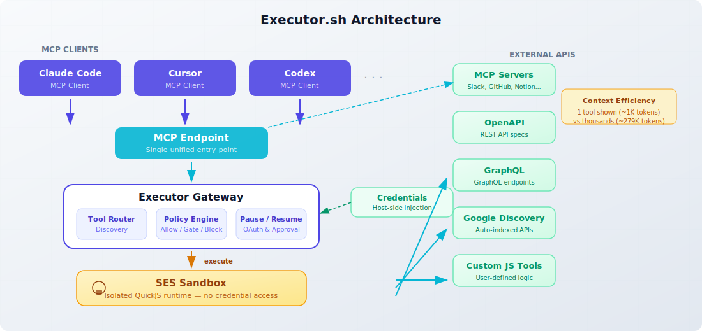
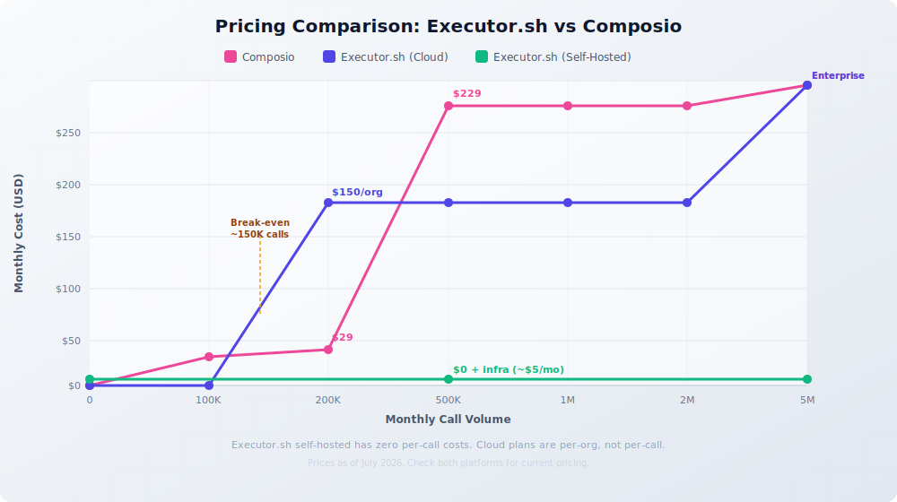

import Button from "@components/widgets/Button.astro";
import Notice from "@components/widgets/Notice.astro";
import ListCheck from "@components/widgets/ListCheck.astro";
import Accordion from "@components/widgets/Accordion.astro";
import Tabs from "@components/widgets/Tabs.astro";
import Tab from "@components/widgets/Tab.astro";

Every AI agent needs tools. Whether it is sending Slack messages, querying a database, or calling a third-party API, the agent has to connect to external services somehow. Composio built a business around this: 1,000+ pre-built toolkits, managed OAuth, and a hosted runtime that handles everything for you. It works, and it works well for teams that want a fully managed platform.

But if you want to self-host, inspect the runtime, or avoid per-call pricing at scale, Composio's story falls apart. The runtime is closed source. Self-hosting requires an Enterprise contract. And credentials flow through their cloud on self-serve plans.

That is where [Executor.sh](https://executor.sh/) comes in. It is a fully open-source MCP gateway. Configure your integrations once, and every MCP-compatible agent shares them through one endpoint. You can run it on your own infrastructure with a single Docker command. No sales calls. No vendor lock-in. No per-call fees when self-hosted.

This article gives you a direct comparison between the two platforms, honest trade-offs, and a step-by-step guide to self-hosting Executor.sh with Docker.

<Notice type="info" title="First of its kind">
As of July 2026, this is the first direct Executor.sh vs Composio comparison on the web. Most existing comparison articles predate Executor or do not include it.
</Notice>

## What is Composio?

Composio launched in 2024 and became the default platform for AI agent tool calling. It raised a $25M Series A from Lightspeed Ventures in July 2025 (total funding: ~$29M) and has roughly 28,700 GitHub stars. The pitch: give your AI agent access to 1,000+ pre-built, pre-authenticated SaaS toolkits (Gmail, Slack, GitHub, Notion, Jira, Salesforce, and hundreds more) without writing integration code.

The platform handles OAuth flows end-to-end, manages token refresh, and scopes credentials per user. It provides SDKs for 25+ frameworks (OpenAI, Anthropic, LangChain, CrewAI, Vercel AI SDK, and the [Mastra AI agent framework](/build-ai-agent-mastra/)), a Tool Router for intent-based discovery, a sandboxed workbench for remote Python/JS execution, and bidirectional triggers for real-time communication with connected apps.

Composio is SOC 2 Type II and ISO 27001 certified. If your team needs compliance credentials out of the box, this is a real advantage.

Under the hood, Composio is a managed platform. The backend that stores credentials and executes tool calls is proprietary. The open-source GitHub repository contains SDKs and CLI tooling only, not the runtime. Your credentials and execution data flow through Composio's cloud infrastructure on all self-serve plans.

## Why look for a Composio alternative?

Composio is not bad software. But it has structural limitations that push developers to look elsewhere:

<ListCheck>
<ul>
<li>Closed-source runtime. The GitHub repo contains SDKs only, not the platform that stores and executes tool calls</li>
<li>Enterprise-only self-hosting. GitHub Issue #291 requesting self-serve self-hosting has been open since 2024 with no resolution</li>
<li>Credentials pass through Composio's cloud on self-serve plans, a non-starter for teams with compliance requirements</li>
<li>Per-call pricing scales poorly. $229/month for 2M calls, with $0.249 per additional 1K calls, adds up fast in multi-agent workflows</li>
<li>Custom integrations are marked "experimental." You cannot inspect, fork, or modify the integration runtime code</li>
<li>Context window bloat. Loading thousands of tool definitions consumes significant tokens even with the Tool Router</li>
</ul>
</ListCheck>

If any of these hit close to home, [open-source alternatives](/best-open-source-llms-claude-alternative/) deserve a serious look.

## What is Executor.sh?

Executor.sh is an open-source MCP gateway built by Rhys Sullivan, a former OpenCode engineer. It went through Y Combinator's S26 batch and has around 2,600 GitHub stars as of July 2026. The entire platform is MIT licensed.

The core idea: configure your integrations once (MCP servers, OpenAPI specs, GraphQL endpoints, custom JS tools), and every MCP-compatible agent shares them through one endpoint. Claude Code, Cursor, Codex, VS Code extensions, anything that speaks [MCP (Model Context Protocol)](/mcp-introduction-beginners/) works out of the box.



### Key differentiators

**Context efficiency.** Instead of showing an agent thousands of tool definitions (~278,800 tokens), Executor shows one tool (~1,044 tokens). Tool schemas load dynamically only when needed. This can cut API costs noticeably on long agent sessions.

**Protocol-level depth.** Native connectors for MCP, OpenAPI, GraphQL, and Google Discovery. Point Executor at any spec and it auto-indexes every endpoint as a typed tool.

**Semantic tool discovery.** Agents search for tools by intent rather than memorizing names:

```js
tools.discover({ query: "send a slack message" })
```

**SES sandbox.** Tool calls run in an isolated QuickJS sandbox. Credentials are injected host-side at call time and never enter the sandbox heap. This is a real security improvement over platforms where credentials live in the execution environment.

**Pause/resume.** Execution pauses for OAuth flows or human approval, then resumes cleanly. No hacky workarounds needed.

**Policy engine.** Each tool can be allowed, gated behind approval, or blocked. Policies are derived from spec semantics: `GET` vs `DELETE` for OpenAPI, `destructiveHint` for MCP.

**Five deployment options:** Cloud (hosted), Desktop app (Mac/Windows/Linux), CLI (`npm i -g executor`), Docker, and Cloudflare Workers.

<Notice type="success" title="Fully open source">
Every deployment option, including Docker and CLI self-hosting, is MIT licensed. You can inspect, modify, and fork the entire codebase.
</Notice>

You can add [MCP server integrations like BrightData](/brightdata-mcp-guide/) or any other MCP server to extend what your agents can do. And if you need to manage [essential Docker commands](/docker-commands/) for your deployment, we have a guide for that too.

## Executor.sh vs Composio: head-to-head comparison

| Dimension | Executor.sh | Composio |
|-----------|------------|----------|
| **License** | MIT (fully open source) | MIT (SDK only); runtime closed |
| **Self-hosting** | Docker / Cloudflare (free, self-serve) | Enterprise only (sales-gated) |
| **Architecture** | MCP gateway / integration proxy | Managed toolkit platform |
| **Tool sources** | MCP, OpenAPI, GraphQL, custom JS | 1,000+ pre-built SaaS toolkits |
| **Context efficiency** | Dynamic loading (1 tool shown) | Tool Router for catalog search |
| **Security model** | SES sandbox + host-side credential injection | Managed OAuth + sandboxed workbench |
| **Custom integrations** | Add any OpenAPI/GraphQL/MCP spec | Custom tools marked experimental |
| **Framework support** | Any MCP-compatible client | 25+ framework adapters |
| **Pricing model** | Per-execution + per-member | Per-tool-call |
| **Free tier** | 3 members, 10K execs/month | 20K tool calls/month |
| **Entry paid** | $150/org/month (unlimited members) | $29/month (200K calls) |
| **Stars** | ~2,600 | ~28,700 |
| **Maturity** | Feb 2026 (5 months old) | 2024+ (2+ years) |
| **SOC 2/ISO** | On request (Enterprise) | SOC 2 Type II, ISO 27001 |

The most important differences are architectural. Composio gives you a curated catalog of pre-built integrations: you pick what you need and the platform handles auth, execution, and monitoring. Executor gives you a protocol-level proxy: you bring your own specs and it indexes, sandboxes, and exposes them as MCP tools.

Composio wins on breadth of pre-built integrations and framework adapter coverage. Executor wins on openness, self-hosting, context efficiency, and security model (credentials never touching the sandbox heap).

### Executor.sh pricing vs Composio

At low volumes, Composio's $29/month plan is cheaper than Executor's $150/org/month Team plan. But the math flips as you scale:

<Tabs>
<Tab name="Low usage (< 200K calls)">

| Platform | Plan | Monthly Cost |
|----------|------|-------------|
| Composio | Free | $0 (20K calls) |
| Executor | Free | $0 (10K execs, 3 members) |
| Composio | Starter | $29/mo (200K calls) |
| Executor | Team | $150/org/mo (250K execs) |

At low volumes, Composio is cheaper. If you are a solo developer with light tool-calling needs, Composio's free or $29/mo plan is hard to beat.

</Tab>
<Tab name="Scale (500K+ calls)">

| Volume | Composio Cost | Executor Cloud | Executor Self-Hosted |
|--------|--------------|---------------|---------------------|
| 500K calls/mo | $229/mo | $150/org/mo | $0 (infra only) |
| 1M calls/mo | $229/mo + overages | $150/org/mo | $0 (infra only) |
| 2M calls/mo | $229/mo | $150/org/mo | $0 (infra only) |
| 5M calls/mo | Enterprise (custom) | Enterprise (custom) | $0 (infra only) |

Self-hosted Executor has zero per-call costs. You pay only for the server it runs on. At 2M calls/month, that is a $229+/month saving over Composio.

</Tab>
</Tabs>

<Notice type="warning" title="Pricing changes">
Both platforms may update their pricing. Check the [Executor pricing page](https://executor.sh/pricing) and [Composio pricing page](https://composio.dev/pricing) for current numbers.
</Notice>



## Self-hosting Executor.sh with Docker

This is the section that matters most. If you are reading this article, you probably want to run this on your own infrastructure. The good news: it is genuinely simple.

### Prerequisites

<ListCheck>
<ul>
<li>Docker installed on your machine or VPS</li>
<li>A VPS or local machine with 1GB+ RAM</li>
<li>A domain name (optional, for reverse proxy with HTTPS)</li>
</ul>
</ListCheck>

If you need a VPS, [Hetzner Cloud](https://go.bitdoze.com/hetzner) offers affordable European servers starting at around €4.49/month, more than enough for running Docker containers like this. [Hostinger VPS](https://go.bitdoze.com/hostinger-vps) is another budget-friendly option with NVMe SSD storage if you prefer a different provider.

For managing your Docker deployments, [Dokploy](/dokploy-install/) or [Coolify](/coolify-install-heroku-alternative/) give you a self-hosted PaaS experience with web dashboards and automatic HTTPS. You can also check our guide on [self-hosted backends with Docker](/convex-self-host/) for more patterns.

### Quick start with Docker run

One command gets you running:

```bash
docker run -d \
  --name executor-selfhost \
  -p 4788:4788 \
  -v executor-data:/data \
  ghcr.io/rhyssullivan/executor-selfhost:latest
```

That is it. Here is what each flag does:

- `-p 4788:4788`: exposes the Executor web console and MCP endpoint on port 4788
- `-v executor-data:/data`: persists all data (SQLite database, credentials, config) in a named Docker volume
- The image bundles everything: typed API, MCP server, authentication, QuickJS code execution, and web console

Open `http://localhost:4788` in your browser. The first account you create becomes the owner. All subsequent users join via single-use invite links.

For headless setups (CI/CD, automated provisioning), pass bootstrap credentials:

```bash
docker run -d \
  --name executor-selfhost \
  -p 4788:4788 \
  -v executor-data:/data \
  -e EXECUTOR_BOOTSTRAP_ADMIN_EMAIL=admin@example.com \
  -e EXECUTOR_BOOTSTRAP_ADMIN_PASSWORD=your-secure-password \
  -e EXECUTOR_WEB_BASE_URL=https://executor.yourdomain.com \
  ghcr.io/rhyssullivan/executor-selfhost:latest
```

### Docker Compose setup

For a more maintainable setup, use Docker Compose:

```yaml
services:
  executor:
    image: ghcr.io/rhyssullivan/executor-selfhost:latest
    container_name: executor-selfhost
    restart: unless-stopped
    ports:
      - "4788:4788"
    volumes:
      - executor-data:/data
    environment:
      - PORT=4788
      - EXECUTOR_DATA_DIR=/data
      # Optional: set your public URL
      # - EXECUTOR_WEB_BASE_URL=https://executor.yourdomain.com
      # Optional: headless bootstrap
      # - EXECUTOR_BOOTSTRAP_ADMIN_EMAIL=admin@example.com
      # - EXECUTOR_BOOTSTRAP_ADMIN_PASSWORD=changeme

volumes:
  executor-data:
```

Save this as `docker-compose.yml` and run:

```bash
docker compose up -d
```

Backing up is straightforward. Snapshot the `data.db` file inside the `/data` volume. That single SQLite database contains everything: config, credentials, tool definitions, and user accounts.

If you are looking for more [Docker-based AI deployments](/cognee-self-host/) to run alongside Executor, there are plenty of options.

### Reverse proxy with Caddy

For HTTPS on a custom domain, put Caddy in front:

```
executor.yourdomain.com {
    reverse_proxy localhost:4788
}
```

Caddy automatically provisions and renews TLS certificates. No config needed beyond the reverse proxy line.

### Deploying with Dokploy

If you want a web UI to manage your Executor.sh deployment instead of SSH-ing into a server and editing compose files manually, [Dokploy](https://dokploy.com/) is a solid option. It is an open-source, self-hostable PaaS that runs on top of Docker and Traefik. You get a dashboard for deployments, automatic HTTPS, monitoring, and database backups without touching the command line after initial setup.

If you do not have Dokploy installed yet, follow our [Dokploy installation guide](/dokploy-install/) to get it running on your VPS first.

**Step 1: Create a new project and compose service**

In the Dokploy dashboard, create a new project, then add a **Docker Compose** service. Paste the following compose file:

```yaml
services:
  executor:
    image: ghcr.io/rhyssullivan/executor-selfhost:latest
    container_name: executor-selfhost
    networks:
      - dokploy-network
    restart: unless-stopped
    volumes:
      - executor-data:/data
    environment:
      - PORT=4788
      - EXECUTOR_DATA_DIR=/data
    labels:
      - "traefik.enable=true"
      - "traefik.http.routers.executor.rule=Host(`executor.yourdomain.com`)"
      - "traefik.http.routers.executor.entrypoints=websecure"
      - "traefik.http.routers.executor.tls.certresolver=letsencrypt"
      - "traefik.http.services.executor.loadbalancer.server.port=4788"

volumes:
  executor-data:

networks:
  dokploy-network:
    external: true
```

Replace `executor.yourdomain.com` with your actual domain. The `dokploy-network` is created automatically when Dokploy is installed.

**Step 2: Set environment variables**

Switch to the **Environment** tab and add any bootstrap variables you need:

```
EXECUTOR_BOOTSTRAP_ADMIN_EMAIL=admin@yourdomain.com
EXECUTOR_BOOTSTRAP_ADMIN_PASSWORD=your-secure-password
EXECUTOR_WEB_BASE_URL=https://executor.yourdomain.com
```

**Step 3: Point your domain and deploy**

Add an A record in your DNS pointing `executor.yourdomain.com` to your server IP. Then go to the **Domains** tab in Dokploy, add the domain, and enable HTTPS. Hit **Deploy** and Dokploy handles the rest: pulling the image, starting the container, and configuring Traefik with a TLS certificate.

For a full walkthrough on deploying Docker Compose apps in Dokploy, including domain setup and Traefik label configuration, see our guide on [deploying a Docker Compose app in Dokploy](/dokploy-docker-compose-app/).

Once deployed, open `https://executor.yourdomain.com` in your browser. The first account you create becomes the owner, just like the standalone Docker setup.

Keeping the deployment up to date is simple. Dokploy lets you redeploy from the dashboard whenever a new image is pushed. For detailed update strategies including automated updates with Tugtainer, see our guide on [updating Docker Compose stacks in Dokploy](/dokploy-update-docker-compose/).

<Notice type="info" title="Dokploy advantages">
Dokploy gives you a web dashboard to manage deployments, view logs, monitor resource usage, and configure automatic backups. If you are running multiple self-hosted services alongside Executor, it keeps everything in one place. See our [Dokploy backups with Cloudflare R2 guide](/dokploy-backups-cloudflare-r2/) for setting up automated backups.
</Notice>

### Connecting AI agents

Once your instance is running, point any MCP client at it. For Claude Code:

```bash
claude mcp add executor --transport sse https://executor.yourdomain.com/mcp
```

Or use the generic `npx add-mcp` command:

```bash
npx add-mcp https://executor.yourdomain.com/mcp
```

For Cursor, add the MCP server URL in Settings → MCP Servers. Any client that supports the MCP protocol works. The self-hosted endpoint behaves identically to the cloud version.

<Notice type="info" title="First user becomes owner">
The first account created on your self-hosted instance becomes the organization owner. Invite team members through single-use invite links from the admin panel. The self-hosted version supports unlimited members, with no per-seat charges.
</Notice>

## Self-hosting Executor.sh on Cloudflare Workers

If you do not want to manage a VPS, Executor also deploys to Cloudflare Workers. The architecture: a single Cloudflare Worker + D1 storage + Cloudflare Access for authentication.

```bash
git clone https://github.com/UsefulSoftwareCo/executor.git
cd executor/apps/host-cloudflare
bun run deploy:setup
```

The MCP endpoint lives at `/mcp`, gated by Cloudflare Access. No separate login app needed. Cloudflare handles authentication.

<Notice type="info" title="Zero infrastructure cost">
Cloudflare's free tier covers low-volume Executor deployments. No server to manage, no Docker to maintain. The trade-off is less control and a dependency on Cloudflare's infrastructure.
</Notice>

This option works well for personal use or small teams. For production workloads where you need full control over the runtime environment, Docker is the better path.

## Adding integrations to your self-hosted Executor

Deploying Executor is step one. Connecting it to actual services is where the value comes from.

<Tabs>
<Tab name="OpenAPI">

Point Executor at any OpenAPI spec and it auto-indexes every endpoint as a typed tool:

```bash
executor call executor openapi addIntegration \
  --spec-url https://api.example.com/openapi.json \
  --name "my-api" \
  --base-url https://api.example.com
```

All `GET`, `POST`, `PUT`, `DELETE` endpoints become callable tools. The policy engine automatically gates destructive operations.

</Tab>
<Tab name="MCP Server">

Add any MCP server to your Executor instance:

```bash
executor call executor mcp addServer \
  --name "my-mcp-server" \
  --command "npx" \
  --args '["@my-org/mcp-server"]'
```

You can add [MCP server integrations like BrightData](/brightdata-mcp-guide/) for web data access, or any community MCP server from npm.

</Tab>
<Tab name="GraphQL">

Connect a GraphQL endpoint and every query and mutation becomes a tool:

```bash
executor call executor graphql addIntegration \
  --endpoint https://api.example.com/graphql \
  --name "my-graphql-api" \
  --headers '{"Authorization": "Bearer $TOKEN"}'
```

The schema introspection runs automatically, so no manual tool definitions needed.

</Tab>
</Tabs>

Semantic tool discovery means agents do not need to know tool names. They describe what they want to do and Executor finds the right tool:

```bash
executor tools search "send email"
```

If you are [creating your own AI agent](/create-your-own-ai-agent/) or building with the [Mastra framework](/build-ai-agent-mastra/), Executor gives you a single MCP endpoint that bundles all your integrations. For routing between multiple AI coding agents like Claude Code and Codex, [Agent Router](https://go.bitdoze.com/agentrouter) provides unified access alongside your Executor gateway. And for web data integrations, [Bright Data](https://go.bitdoze.com/brightdata) offers structured data APIs you can connect via MCP.

## When to choose Executor.sh (and when to stick with Composio)

This is not a "Composio bad, Executor good" article. Both platforms serve different needs. Here is an honest breakdown:

<Tabs>
<Tab name="Choose Executor.sh">

- You need self-hosting for compliance, cost, or data sovereignty reasons
- You want full source code access and the ability to modify the runtime
- You bring your own API specs (OpenAPI, GraphQL, MCP) rather than needing 1,000+ pre-built toolkits
- You want to minimize context window usage for your agents
- You are running multi-agent workflows at scale and per-call pricing is a concern
- You prefer the MCP protocol standard over framework-specific adapters

</Tab>
<Tab name="Choose Composio">

- You need 1,000+ pre-built, pre-authenticated SaaS integrations out of the box
- You need managed OAuth handling for many third-party apps with zero config
- You require SOC 2 Type II / ISO 27001 compliance today (not on request)
- Your team uses LangChain, CrewAI, or other frameworks that need dedicated adapters
- You prefer a fully managed platform with no infrastructure to maintain
- You are a small team or solo developer who needs the cheapest entry point

</Tab>
</Tabs>

<Notice type="warning" title="Honest trade-offs">
Executor.sh is 5 months old (as of July 2026). It has a smaller community, fewer production deployments, and less battle-testing than Composio. The self-hosted Docker option is stable, but evaluate it for your specific workload before committing to production.
</Notice>

For teams exploring self-hosted AI infrastructure, guides on [running AI agents on your own server](/hermes-agent-setup-guide/) can help you build the broader picture.

## Frequently asked questions

<Accordion label="Is Executor.sh really fully open source?" group="faq" expanded="true">
Yes. Every deployment option (Cloud, Desktop, CLI, Docker, and Cloudflare Workers) is MIT licensed. The full source code is on [GitHub](https://github.com/UsefulSoftwareCo/executor). You can inspect, modify, and fork any part of it.
</Accordion>

<Accordion label="Can I migrate from Composio to Executor.sh?" group="faq">
There is no direct migration tool. The integration models are different: Composio uses pre-built SaaS toolkits, while Executor uses spec-based integrations (OpenAPI, GraphQL, MCP). You would bring your own API specs and configure them in Executor. If your workflows depend heavily on Composio's pre-built toolkits, migration takes more effort.
</Accordion>

<Accordion label="Does Executor.sh support MCP?" group="faq">
Yes. Executor is built as an MCP gateway. Any MCP-compatible client (Claude Code, Cursor, Codex, VS Code extensions) connects directly. See our [beginner's guide to MCP](/mcp-introduction-beginners/) if you are new to the protocol.
</Accordion>

<Accordion label="How does Executor.sh handle credentials and secrets?" group="faq">
Credentials are stored in the SQLite database (encrypted). The SES sandbox uses host-side injection: credentials are injected into tool calls at execution time and never enter the sandbox heap. This is a real security boundary. Even if a tool call is compromised, the sandbox cannot access raw credentials.
</Accordion>

<Accordion label="Is Executor.sh production-ready?" group="faq">
It is young but backed by Y Combinator S26. Self-hosted Docker deployments are stable for small-to-medium workloads. The core functionality (MCP gateway, OpenAPI/GraphQL indexing, SES sandbox) works well. For critical production systems, run a thorough evaluation first. The project's momentum (2,600 stars in 5 months) suggests active development and growing adoption.
</Accordion>

<Accordion label="Can I self-host Composio instead?" group="faq">
Only on Enterprise plans through a sales process. The GitHub repository contains only SDKs and CLI tooling, not the platform runtime. [GitHub Issue #291](https://github.com/ComposioHQ/composio/issues/291) requesting self-serve self-hosting has been open since July 2024 with no resolution.
</Accordion>

## Is Executor.sh the right Composio alternative for you?

If you are a self-hosting enthusiast, an open-source advocate, or a cost-conscious developer running multi-agent workflows, Executor.sh is worth a serious look. It solves the core pain points that push developers away from Composio: closed runtime, no self-hosting, and per-call pricing that scales poorly.

The self-hosted Docker deployment takes under a minute. You get a fully MIT-licensed MCP gateway with dynamic tool loading, sandboxed execution, and credential isolation, running entirely on your infrastructure.

Composio remains the stronger choice if you need 1,000+ pre-built integrations and managed OAuth without touching infrastructure. That is a valid need, and Composio fills it well.

But if you want control, transparency, and zero per-call costs at scale, Executor.sh is the open-source alternative worth trying.

<Button text="Try Executor.sh Self-Hosted" link="https://executor.sh/docs/hosted/docker" variant="solid" color="blue" size="lg" icon="arrow-right" />
<Button text="View on GitHub" link="https://github.com/UsefulSoftwareCo/executor" variant="outline" color="gray" size="md" />
