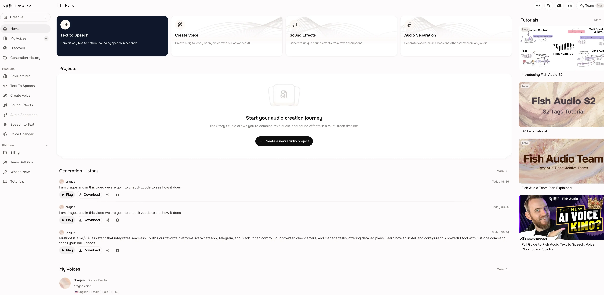
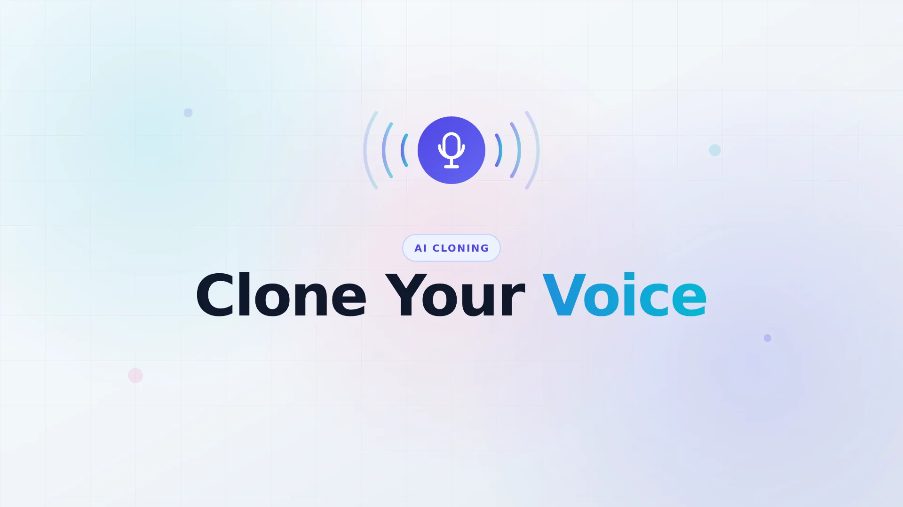

import Button from "@components/widgets/Button.astro";
import Notice from "@components/widgets/Notice.astro";
import ListCheck from "@components/widgets/ListCheck.astro";
import Accordion from "@components/widgets/Accordion.astro";
import fishAudioInterface from "@assets/images/26/07/fish-audio-inerface.webp";
import fishAudioClone from "@assets/images/26/07/fish-audio-clone-voice.webp";

I signed up for Fish Audio last week to clone my voice for video projects. I had been using ElevenLabs for a while, but the pricing was eating into my budget and the multilingual support was not cutting it for what I needed. After a few days with Fish Audio, here is my honest take.

<Button text="Try Fish Audio Free" link="https://go.bitdoze.com/fish-audio" variant="solid" color="blue" size="md" icon="arrow-right" />

## What is Fish Audio

Fish Audio is a voice AI platform that does text-to-speech, voice cloning, speech-to-text, and a handful of other audio tasks. You can use it through their web app with no code, or through their REST API and Python SDK if you want to build something on top of it.

The thing that got my attention was the emotion control. Most TTS tools give you a flat, monotone output unless you spend time tweaking SSML tags. Fish Audio lets you mark sections of text with emotion tags like `(excited)` or `(whisper)` and the voice actually changes delivery. It sounds like a small thing, but it makes a real difference when you are narrating a 10-minute video and need the tone to shift.

They have over 2 million community-uploaded voices in their library. You can pick a voice someone else created, or clone your own from about 10 to 15 seconds of audio. The cloning quality is solid. Not perfect, but good enough that my wife could not tell the difference in a blind test between my real voice and the clone in a video narration.

## The models

Fish Audio runs three main TTS models:

- **S2.1 Pro** — their current production model. Better quality, lower latency, and higher throughput than the previous generation. This is the one I use.
- **S2 Pro** — the previous generation. Still solid, supports multi-speaker and natural language expression control.
- **S1** — the older model that uses parenthesis-based emotion tags like `(happy)` or `(sad)`.

Here is the part that surprised me: they made S2.1 Pro free for developers. Same model that powers their paid tier, free API access, 83 languages, no hard usage cap. You just set `model: "s2.1-pro-free"` in your API call and you are on S2.1 Pro. If you are building an app or testing TTS in a project, this is a good deal.

<Notice type="info" title="Free S2.1 Pro API">
Fish Audio made their best model free for developers. Set `model: "s2.1-pro-free"` and you get the same S2.1 Pro quality at no cost. No hard usage cap. Same endpoint as the paid version.
</Notice>

## What Fish Audio actually does well

**Voice cloning is fast.** I recorded about 15 seconds of myself reading a paragraph, uploaded it, and had a working clone in under two minutes. ElevenLabs requires 60 seconds of audio for cloning, and the clone sits behind their $22/month tier. Fish Audio does it faster and cheaper.

**Emotion control works.** The tag system takes some getting used to. You cannot just sprinkle `(excited)` everywhere and expect good results. But once you figure out where to place them, the output sounds noticeably more natural than flat TTS. I use it for YouTube narration and the difference is obvious.

**Multilingual support is strong.** Fish Audio handles 83 languages. I tested it with mixed English and Romanian content and the pronunciation was clean. No robotic accent bleed that you get with some other tools. If you create content in multiple languages, this is where Fish Audio pulls ahead of ElevenLabs.

**The community voice library is large.** Two million voices means you will probably find something close to what you need without cloning anything. You can search by language, style, and use case. Some of the community voices are surprisingly good.

**Pricing is reasonable.** The free tier gives you enough to test properly. Paid plans start at around $15/month with pay-as-you-go pricing. No credit expiry nonsense. You pay for what you use.

<Button text="Get Started with Fish Audio" link="https://go.bitdoze.com/fish-audio" variant="solid" color="blue" size="md" icon="arrow-right" />

## Where it falls short

**The web app can be slow.** Generating long audio through the browser interface takes a while. The API is faster, but if you are a non-technical user who just wants to paste text and get audio, the web experience could be better.

**Emotion tags have a learning curve.** The documentation explains what tags are available, but not much about placement strategy. I had to experiment for about an hour before I got results I was happy with. A few example scripts with before/after audio would help.

**Voice library quality varies.** Two million voices is a lot, and not all of them are good. The search and filtering could be improved. I spent more time than I wanted browsing through mediocre voices before finding ones I liked.

**No desktop app.** It is web-only or API. If you want a native app for offline work, you are out of luck. There is a mobile app on Google Play, but I have not tested it.

## Fish Audio vs ElevenLabs

This is the comparison most people want to know about. I have used both, so here is how they stack up:

| Feature | Fish Audio | ElevenLabs |
|---------|-----------|------------|
| Voice cloning audio needed | 10-15 seconds | 60+ seconds |
| Cheapest plan with cloning | Free / $15/mo | $22/mo |
| Languages | 83 | 32 |
| Emotion control | Tag-based | Limited |
| Community voices | 2 million+ | Large library |
| English voice quality | Very good | Best in class |
| API pricing | $15/million chars | ~$30/million chars |
| Free tier | Yes | Yes (no cloning) |

ElevenLabs still has the edge on raw English voice quality. If you only produce English content and budget is not a concern, ElevenLabs is hard to beat. But for multilingual work, emotion control, and cost, Fish Audio is the better pick. The free S2.1 Pro API makes it even more compelling for developers.

One thing worth noting: ElevenLabs updated their terms of service to claim perpetual rights over voice data. Fish Audio does not have that clause. If you are cloning your own voice, read the fine print.

<Notice type="warning" title="Voice data ownership">
Before cloning your voice on any platform, read the terms of service. ElevenLabs claims perpetual, royalty-free rights over voice data. Fish Audio's terms are more standard. This matters if you are using your own voice commercially.
</Notice>

## Pricing

Fish Audio keeps pricing straightforward:

| Plan | Price | What you get |
|------|-------|-------------|
| Free | $0 | Limited generations, access to community voices, S2.1 Pro free API |
| Starter | ~$15/month | More generations, voice cloning, priority processing |
| Pro | ~$45/month | Higher limits, commercial rights, faster processing |
| Enterprise | Custom | Dedicated support, SLA, custom integrations |

The free tier is enough to test voice cloning and generate a few audio clips. If you are producing content regularly, the Starter plan covers most use cases. The pay-as-you-go model means you are not losing credits at the end of the month.

For developers, the free S2.1 Pro API is hard to argue with. Same model quality as the paid tier, no hard usage cap. If you are building a product that needs TTS, start here.

## How to get started

1. Go to [Fish Audio](https://go.bitdoze.com/fish-audio) and create a free account
2. Pick a voice from the community library or clone your own
3. Paste your text, select emotions where needed, and generate
4. Download the audio or use the API in your project

For voice cloning, record yourself reading a paragraph clearly for about 15 seconds. Upload the audio, wait a minute or two, and your clone is ready. Test it with a few different scripts before committing to a paid plan.

If you want to use the API, their documentation at [docs.fish.audio](https://docs.fish.audio/overview/capabilities) covers the Python SDK and REST endpoints. The `s2.1-pro-free` model is a good starting point.

<Accordion label="How does voice cloning work?" group="faq">
Fish Audio analyzes a short audio clip (10-15 seconds) to capture your voice characteristics: tone, pitch, speaking style, and rhythm. It builds a model from that clip that can then generate speech in your voice from any text input. The clone can speak in 83 languages, though quality varies by language.
</Accordion>

<Accordion label="Is Fish Audio free?" group="faq">
Yes, there is a free tier with limited generations and access to community voices. The S2.1 Pro API is also free for developers with no hard usage cap. Paid plans start at around $15/month for higher limits and voice cloning features.
</Accordion>

<Accordion label="Is Fish Audio safe?" group="faq">
Fish Audio uses standard encryption and does not claim perpetual rights over your voice data (unlike some competitors). That said, read the terms of service before uploading sensitive audio. For commercial use of cloned voices, paid plans include proper licensing.
</Accordion>

<Accordion label="Fish Audio vs ElevenLabs: which should I pick?" group="faq">
Fish Audio is better for multilingual content, emotion control, and budget-conscious projects. ElevenLabs edges ahead on raw English voice quality. If you create content in multiple languages or want the free API, go with Fish Audio. If you only do English narration and want the absolute best quality, ElevenLabs is worth the extra cost.
</Accordion>

## Who should use Fish Audio

**Content creators** producing videos, podcasts, or audiobooks in multiple languages. The emotion tags make narration sound less robotic, and the pricing will not wreck your budget.

**Developers** building apps that need TTS. The free S2.1 Pro API is generous and the documentation is decent. Python SDK and REST endpoints are both available.

**Teams** that need a consistent brand voice across content. Clone one voice, use it everywhere. The multilingual support means you can localize without hiring voice actors for each language.

**Anyone testing AI voice tools.** The free tier is enough to get a real feel for the platform before spending money.

## Who should look elsewhere

If you only produce English content and want the absolute highest voice fidelity, ElevenLabs is still the benchmark. If you need a desktop app for offline work, Fish Audio does not have one. And if you want a tool that works perfectly out of the box with no experimentation, the emotion tag system will frustrate you at first.

## Final thoughts

I signed up for Fish Audio to clone my voice and save money compared to ElevenLabs. A week in, I am sticking with it. The clone quality is good enough for my YouTube videos, the emotion control is a feature I did not know I needed, and the free API is useful for side projects.

It is not perfect. The web app could be faster, the voice library needs better filtering, and the emotion tags take practice. But for the price, the feature set, and the multilingual support, it is the best option I have found for my use case.

If you want to try it, start with the free tier and test your own voice clone. Fifteen seconds of audio and two minutes of waiting is all it takes.

<Button text="Try Fish Audio Free" link="https://go.bitdoze.com/fish-audio" variant="solid" color="blue" size="md" icon="arrow-right" />

<Notice type="info" title="Related">
If you are interested in building TTS scripts locally, check out [Text-to-Speech with uv: Create Audio from Text in Python](/uv-text-to-speech-script/) for a guide on running TTS from the command line.
</Notice>

## Related articles

- [Fish Audio vs ElevenLabs: Which AI Voice Tool Should You Pick?](/fish-audio-vs-elevenlabs/) — deep dive comparison with pricing breakdowns
- [How to Clone Your Voice with Fish Audio (Step-by-Step)](/fish-audio-clone-voice/) — detailed walkthrough with screenshots
- [Fish Audio vs MiniMax: AI Voice Tools Compared](/fish-audio-vs-minimax/) — how Fish Audio stacks up against MiniMax Speech-02

**Lee en espanol:** [Resena Fish Audio](/es/resena-fish-audio/) | [Fish Audio vs ElevenLabs](/es/fish-audio-vs-elevenlabs/) | [Clonar Tu Voz](/es/fish-audio-clonar-voz/) | [Fish Audio vs MiniMax](/es/fish-audio-vs-minimax/)
