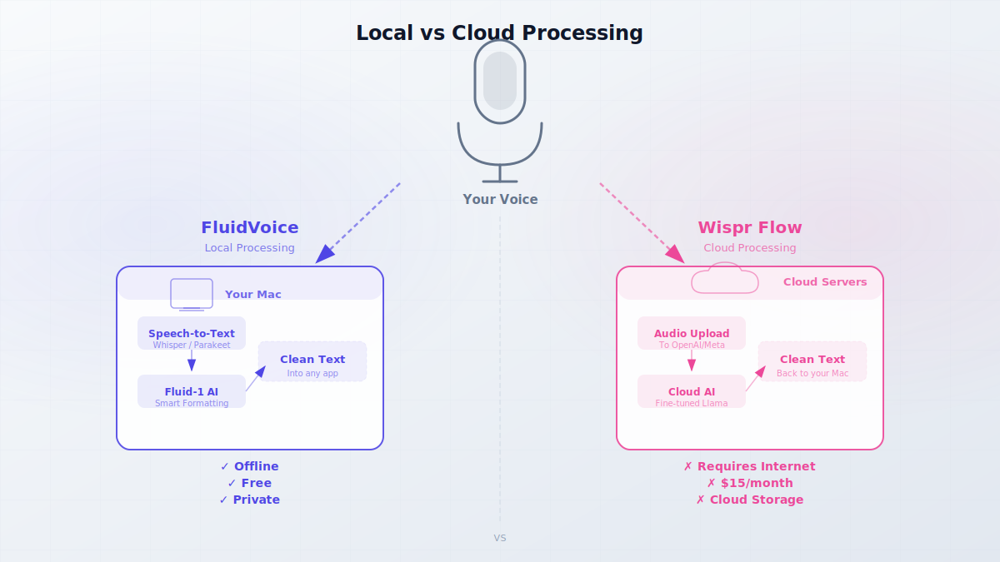
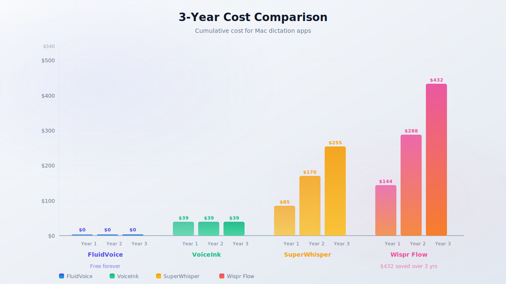

import Button from "@components/widgets/Button.astro";
import Notice from "@components/widgets/Notice.astro";
import ListCheck from "@components/widgets/ListCheck.astro";
import Accordion from "@components/widgets/Accordion.astro";
import Tabs from "@components/widgets/Tabs.astro";
import Tab from "@components/widgets/Tab.astro";

A solo developer got frustrated with paying $15/month for Wispr Flow and decided to build his own dictation app. Less than a year later, that project, FluidVoice, has ~2,600 GitHub stars, 100,000+ downloads, and an active Discord community.

The pitch is simple: FluidVoice runs speech-to-text models directly on your Mac. No cloud servers. No subscriptions. It supports 99 languages through Whisper, has a custom AI model called Fluid-1 for smart formatting, and it's free under the GPL-3.0 license.

If you've been dealing with subscription fatigue or privacy concerns about cloud dictation, this is worth trying. This guide covers installation, features, comparisons with Wispr Flow and other tools, five developer workflows, and an honest assessment of where FluidVoice falls short.

<Button text="View on GitHub" link="https://github.com/altic-dev/FluidVoice" variant="outline" color="gray" size="md" />

## What is FluidVoice?

<YouTubeEmbed
  url="https://www.youtube.com/embed/IFuT-BsdHT4"
  label="Your Mac's New Superpower Local AI Transcription"
/>

FluidVoice is a free, open-source dictation app for macOS built in Swift. It runs speech-to-text models entirely on your Mac. Audio never leaves the device for transcription. The app supports Apple Silicon (all models) and Intel Macs (Whisper models only), and requires macOS 15.0 Sequoia or later.

The project launched in September 2025 and grew fast. It went from 300 stars to ~2,600 in about ten months. The developer (altic-dev on GitHub) maintains the project solo with community support through GitHub Sponsors.

Key specs: 99 languages via Whisper, fewer through other models (~40 via Nemotron, 25 via Parakeet TDT v3, 14 via Cohere). Perceived latency is under 100ms. The app inserts text directly into any application through macOS accessibility APIs.

<Notice type="info" title="Open source vs. private runtime">
FluidVoice the app is GPL-3.0. You can read, audit, and modify the code. However, Fluid Intelligence (the AI enhancement model for smart formatting) is a privately maintained runtime and is **not** open source. This distinction matters if code auditability is a priority for you.
</Notice>

The [local-first philosophy](/why-need-home-server/) behind FluidVoice fits the same mindset as self-hosting: keep your data on hardware you control.

## How to install FluidVoice on Mac

Two install paths: Homebrew (fastest) or manual download from GitHub. If you want to contribute or audit the code, you can build from source.

### Install via Homebrew

If you use [Homebrew in your terminal](/enable-syntax-highlighting-zsh/), this is the cleanest path:

```bash
brew install --cask fluidvoice
```

That's it. Homebrew handles the download, places the app in `/Applications`, and keeps it updated with `brew upgrade`.

For manual download, grab the latest `.dmg` from [GitHub Releases](https://github.com/altic-dev/FluidVoice/releases/latest).

To build from source:

```bash
git clone https://github.com/altic-dev/FluidVoice.git
cd FluidVoice
open Fluid.xcodeproj
```

This opens the project in Xcode. Build and run from there.

### First-run setup and permissions

When you first launch FluidVoice, macOS will ask for several permissions:

1. **Microphone access.** Required for speech capture. No way around this.
2. **Accessibility permissions.** Required for FluidVoice to type into other applications. Go to System Settings → Privacy & Security → Accessibility and enable FluidVoice.
3. **Notification permissions.** Optional, for status updates.

After permissions, you'll see the onboarding flow. Pick a voice model:

- **Parakeet Flash (Beta):** Fast, English-focused. Good starting point for English users.
- **Nemotron Speech 3.5:** Better multilingual support, slightly slower.
- **Whisper Small/Medium:** Works on Intel Macs too, but slower than the other models.

You can change models later in settings. The base model download is roughly 1 GB.

If you want Fluid Intelligence (the AI formatting model), you can download it separately. It's about 3.5 GB. It's optional but makes a noticeable difference in output quality.

<Notice type="warning" title="macOS 15 required">
FluidVoice requires macOS 15.0 Sequoia or later. Users on older macOS versions cannot run it. Intel Macs get Whisper-only support. The faster models (Parakeet, Nemotron) require Apple Silicon.
</Notice>

## Key features at a glance

FluidVoice has more features than most free apps.

### Local speech-to-text models

All transcription runs on your Mac. No internet required. These are the available models:

| Model | Best For | Languages | Speed | Size |
|-------|----------|-----------|-------|------|
| Parakeet Flash (Beta) | English dictation | English (primarily) | Fastest | ~800 MB |
| Parakeet TDT v3 | Multilingual dictation | 25 | Fast | ~800 MB |
| Nemotron Speech 3.5 | Multilingual, balanced | ~40 | Fast | ~1 GB |
| Nemotron 3.5 Multilingual | Non-English languages | ~40 | Fast | ~1 GB |
| Cohere Transcribe | Alternative multilingual | 14 | Medium | ~1 GB |
| Apple Speech | System integration | System languages | Fast | Built-in |
| Whisper Tiny/Base/Small | Lightweight fallback | 99 | Slowest | 200 MB to 1 GB |
| Whisper Medium/Large | Best accuracy, any language | 99 | Slow | 1.5 to 3 GB |

For most English users on Apple Silicon, start with Parakeet Flash. Switch to Nemotron if you need multilingual support.

<ListCheck>

**What you need to get started:**
- macOS 15.0 Sequoia or later
- Apple Silicon Mac (recommended) or Intel Mac (Whisper only)
- ~1 GB disk space for voice model
- Microphone access granted in System Settings
- Accessibility permissions enabled

</ListCheck>

### Fluid Intelligence (Fluid-1)

Fluid-1 is a custom-trained local AI model based on Gemma. The developer trained it on 100,000+ real-world dictation examples. It handles smart formatting, capitalization, punctuation, and cleanup, turning raw speech-to-text output into polished text.

On the developer's evaluation set of 10,000 examples, Fluid-1 scored 77.31%. For context, GPT-5.4 scored 56.73% and the base Gemma model scored 34.72%. These are task-specific benchmarks (dictation cleanup), not general LLM benchmarks, so take them with a grain of salt. In daily use, the difference is noticeable. Raw Whisper output reads like a transcript, while Fluid-1 output reads like something you'd actually send.

Size: ~3.5 GB download. A smaller Fluid-1 Mini (~1 GB) is planned but not yet released.

<Notice type="info" title="Fluid-1 is not open source">
This is worth repeating: while FluidVoice itself is GPL-3.0, Fluid Intelligence is a private, separately maintained runtime. The developer hasn't announced monetization plans, but keeping Fluid-1 closed-source leaves the door open for future commercial licensing.
</Notice>

### Command Mode and Write Mode

FluidVoice has two advanced modes beyond standard dictation.

<Tabs>
<Tab name="Command Mode">
Voice-control your Mac. Press the hotkey and speak a command:

- **"Open Safari and search for FluidVoice"** launches Safari and performs the search
- **"Create a new note in Bear"** opens Bear with a new note
- **"Send a Slack message to #team saying the deploy is done"** composes and sends
- **"Run my deployment script"** triggers macOS Shortcuts or scripts
- **"Ask Mastra to search for the latest GitHub stars"** triggers [AI agent workflows](/build-ai-agent-mastra/)

Command Mode can launch apps, run macOS Shortcuts, trigger system actions, and automate multi-step workflows through voice alone.
</Tab>
<Tab name="Write Mode">
Dictate new content or rewrite existing text in any application:

1. Select text in any app (Slack, email, Cursor, Notion, anywhere)
2. Press the global hotkey
3. Say: **"Make this more concise"** or **"Rewrite in a professional tone"**
4. FluidVoice replaces the selected text in place

Write Mode works with per-app prompt sets. You can configure different behavior for different apps: formal tone for email, concise for Slack, technical for code editors. This goes beyond Wispr Flow's limited context-awareness.
</Tab>
</Tabs>

## FluidVoice vs Wispr Flow

FluidVoice directly positions itself as the free alternative to Wispr Flow. The differences are real.

| Feature | FluidVoice | Wispr Flow |
|---------|-----------|------------|
| **Price** | $0 forever | $15/mo or $144/yr (Pro). Free tier: 2,000 words/week |
| **Processing** | On-device (local) | Cloud (OpenAI/Meta servers) |
| **Open source** | Yes (GPL-3.0) | No |
| **Offline** | Yes | No |
| **Platforms** | Mac only | Mac, Windows, iOS, Android |
| **Languages** | Up to 99 (Whisper) | 100+ |
| **AI enhancement** | Fluid-1 local or BYOK cloud | Cloud AI (fine-tuned Llama) |
| **Command Mode** | Yes (free) | Yes (Pro only) |
| **Per-app prompts** | Full custom prompt sets | Limited context-awareness |
| **Funding** | Solo dev, GitHub Sponsors | $81M raised, $700M valuation |
| **Team size** | 1 developer | ~50 employees |
| **Trustpilot** | N/A (free) | 2.7/5 |

The fundamental tradeoff: Wispr Flow is multi-platform and has better cloud AI for some use cases. FluidVoice is local, free, and open source.

Wispr Flow's Trustpilot rating (2.7/5) reflects common complaints about reliability after the trial period and aggressive upselling. FluidVoice has no paid tier to complain about.



The data flow is straightforward. Wispr Flow sends your audio to cloud servers for processing. FluidVoice keeps everything on your Mac. If you care about [subscription fatigue](/freebuff-free-ai-coding-agent/) and data privacy, FluidVoice is the better fit. If you need Windows or iOS support today, Wispr Flow is your only option from these two.

## FluidVoice vs SuperWhisper and VoiceInk

Wispr Flow isn't the only alternative. Two other tools compete in this space.

**VoiceInk** is the closest open-source competitor. GPL-3.0, 5,514 GitHub stars, $25-49 one-time purchase (or free if you build from source). It runs on-device Whisper via whisper.cpp and uses Parakeet models too. The main gap: no Fluid-1 equivalent. VoiceInk needs external LLM API keys for AI enhancement, which means either paying for an API or running a local LLM separately. macOS 14+ minimum (one version older than FluidVoice).

**SuperWhisper** is the popular paid option. $84.99/year or $249.99 lifetime. It has deep customization with intelligent modes and multiple model choices. But it stores API keys in plaintext and saves audio recordings by default with no opt-out, which is concerning for a tool that captures everything you say. Rated 4.9/5 on Product Hunt.

| Feature | FluidVoice | VoiceInk | SuperWhisper |
|---------|-----------|----------|--------------|
| **Price** | $0 | $25-49 one-time (or free build) | $84.99/yr or $249.99 lifetime |
| **License** | GPL-3.0 | GPL-3.0 | Proprietary |
| **macOS** | 15.0+ | 14.0+ | 13.0+ |
| **AI enhancement** | Fluid-1 (included) | External LLM keys needed | External LLM keys needed |
| **Offline** | Yes | Yes | Yes (with local models) |
| **API key storage** | macOS Keychain | Varies | Plaintext |
| **Audio recording** | Local, optional | Local | Saved by default |

FluidVoice's edge is Fluid-1. It's the only free tool that includes a local AI model for smart formatting without requiring API keys or separate LLM setup.

<Accordion label="What about MacWhisper and Apple Dictation?" group="faq">

**MacWhisper** focuses on file transcription, turning audio files, podcasts, and meeting recordings into text. It's a different use case from real-time dictation. If you need to transcribe a recorded meeting, MacWhisper is great. If you need to dictate emails and messages in real time, FluidVoice is the better tool.

**Apple Dictation** is the free baseline built into macOS. It works, but accuracy is lower, customization is minimal, and there's no AI formatting. It's fine for quick voice memos. For professional daily use, FluidVoice is a significant upgrade.

</Accordion>

## Real-world workflows for developers

Features are nice, but workflows matter more. These are five concrete ways developers use FluidVoice day-to-day.

<Tabs>
<Tab name="Code Comments & Commits">
Press your hotkey in VS Code or Cursor. Dictate commit messages, code comments, or documentation directly.

Set up a per-app prompt for your code editor to format output as conventional commits:

```
git commit -m "feat: add user authentication flow with OAuth2 support"
```

Or dictate inline code comments without taking your hands off the keyboard for mouse navigation. FluidVoice inserts text at the cursor position in any text field.
</Tab>
<Tab name="Emails & Slack">
Dictate long emails, Slack messages, or Notion notes. Fluid-1 handles formatting, punctuation, and professional tone automatically.

No more typing three-paragraph Slack messages. Press hotkey, talk for 30 seconds, get formatted text. The per-app prompt system lets you configure different tones: formal for email, concise for Slack, technical for Notion.
</Tab>
<Tab name="AI Agent Voice Control">
Use Command Mode to trigger [AI agent workflows](/build-ai-agent-mastra/). Voice-to-agent pipelines are becoming practical: speak a command, have an AI agent execute a multi-step task.

Example: "Search my notes for the deployment checklist and summarize it." If you've built agent workflows with tools like Mastra, FluidVoice becomes a voice interface for those agents.

For the broader voice and audio tools ecosystem, [Fish Audio's AI voice cloning](/fish-audio-review/) covers the text-to-speech side if you need output as well as input.
</Tab>
<Tab name="Meeting Notes">
Dictate meeting notes in real-time while you're in a call. FluidVoice handles the transcription. Then use Write Mode to clean up and reformat the raw notes into structured documentation.

Select the messy notes → hotkey → "Format as meeting notes with action items" → done.
</Tab>
<Tab name="Text Rewriting">
Select any text in any app. Press hotkey. Say "make this more concise" or "rewrite in a professional tone" or "fix the grammar."

Fluid-1 processes the rewrite locally. No API calls, no latency, no data leaving your Mac. Works in Slack, email, documents, code editors, anywhere you can select text.
</Tab>
</Tabs>

## Cost comparison over time

This is where the cost difference gets hard to argue against.

| Tool | Year 1 | Year 2 | Year 3 |
|------|--------|--------|--------|
| **FluidVoice** | $0 | $0 | $0 |
| **VoiceInk** | $39 | $39 | $39 |
| **SuperWhisper (annual)** | $84.99 | $169.98 | $254.97 |
| **SuperWhisper (lifetime)** | $249.99 | $249.99 | $249.99 |
| **Wispr Flow (annual)** | $144 | $288 | $432 |
| **Wispr Flow (monthly)** | $180 | $360 | $540 |

Over three years, FluidVoice saves you $432-$540 compared to Wispr Flow. Even compared to VoiceInk's $39 one-time purchase, FluidVoice's included Fluid-1 model adds value that VoiceInk can't match without external API keys, which cost money per token.



The "free" here isn't a teaser. There are no paid tiers, no word limits, no feature gates, and no "upgrade to Pro" popups. Everything the app does is available at $0. If you're tired of [subscription fatigue](/freebuff-free-ai-coding-agent/), this is what the alternative looks like.

## Privacy and data handling

If you handle sensitive information (client data, proprietary code, confidential communications), privacy isn't optional. This is what FluidVoice does with your data.

<ListCheck>

**Privacy checklist:**
- On-device transcription: audio never leaves your Mac for STT
- Audio history stored locally with budget controls and ZIP export
- API keys stored in macOS Keychain (not plaintext)
- Optional anonymous analytics: can be fully disabled in settings
- No voice data or transcript data collected, ever
- GPL-3.0 auditable code: verify these claims yourself

</ListCheck>

<Notice type="success" title="Local-first by default">
Unlike Wispr Flow, where your audio goes to cloud servers by default, FluidVoice processes everything on your Mac. You have to actively opt in to any cloud processing (OpenAI, Groq, or custom providers). The default is fully local.
</Notice>

Compare this to the competition:
- **Wispr Flow** sends audio to OpenAI and Meta cloud servers. No local processing option.
- **SuperWhisper** saves audio recordings by default with no opt-out and stores API keys in plaintext.

FluidVoice fits the same [local-first philosophy](/why-need-home-server/) that drives the self-hosting community. Keep your data on hardware you control.

## Honest limitations and caveats

FluidVoice isn't perfect. These are the tradeoffs to know before switching.

1. **Mac-only.** No Windows, iOS, or Android versions yet. All three are on the waitlist. Linux is planned but no timeline.
2. **Solo developer risk.** One person maintains this. He's responsive and shipping fast, but it's a single point of failure. No SLA. Community Discord only.
3. **Fluid-1 is closed source.** The most differentiated feature is not open source. Future monetization is unknown.
4. **macOS 15.0 requirement.** Users on older macOS versions are locked out.
5. **Intel Mac degradation.** Whisper-only support on Intel. Slower, less accurate than Apple Silicon models.
6. **3.5 GB model download.** Fluid Intelligence is substantial. The Mini version (~1 GB) is planned but not released.
7. **Language gaps.** Parakeet Flash is English-only. Multilingual coverage varies by model. Not all 99 languages get the same quality.
8. **Competing with $81M.** Wispr Flow has massive resources and 50 employees. FluidVoice has goodwill and GitHub Sponsors.

<Notice type="warning" title="The solo-dev tradeoff">
A solo developer means passionate, responsive, and building fast. It also means one person's burnout, health issues, or career change could stall the project. The GPL-3.0 license means the code survives even if development stops. Someone could fork it. But active maintenance and feature development depend on one person. Go in with eyes open.
</Notice>

## Should you switch to FluidVoice?

**Switch if:**
- You're on a Mac with macOS 15+
- You want to save $144+/year on dictation
- Privacy matters: you don't want audio going to cloud servers
- You want local AI enhancement without API keys
- You're comfortable with a solo-dev project
- You value open-source transparency

**Don't switch if:**
- You need Windows, iOS, or Android support today
- You need enterprise support with an SLA
- You want the absolute best cloud AI accuracy (Wispr Flow's fine-tuned Llama is still better for some use cases)
- You're on macOS 14 or older

**Try it if:**
- You're curious. It's free. The only cost is your time. Install via Homebrew, use it for a week, and decide for yourself.

If you find FluidVoice useful, consider supporting the developer through [GitHub Sponsors](https://github.com/sponsors/altic-dev). A solo developer building a credible alternative to an $81M-funded product deserves support.

<Accordion label="Frequently Asked Questions" group="faq">

**Does FluidVoice work offline?**
Yes. All speech-to-text models run on-device. No internet connection required for transcription. Fluid Intelligence (the AI formatting model) also runs locally. The only time you need internet is for the initial model download and optional cloud AI enhancement (if you choose to enable it).

**Can I use FluidVoice for coding?**
Yes. FluidVoice works in any text field, including VS Code, Cursor, and other code editors. You can dictate code comments, commit messages, documentation, and even code snippets. Set up per-app prompts to configure formatting behavior for your editor.

**What languages does FluidVoice support?**
Up to 99 languages via Whisper, ~40 via Nemotron, 25 via Parakeet TDT v3, and 14 via Cohere Transcribe. Apple Speech adds system language support. English gets the best performance across all models. Non-English users should test Nemotron or Whisper Medium/Large for their specific language.

**How does the solo developer sustain this?**
GitHub Sponsors and community support. There are no paid tiers currently. Fluid Intelligence being privately maintained (not open source) leaves the door open for future monetization, possibly a hosted API, premium model tiers, or enterprise licensing. But nothing has been announced.

</Accordion>

## Get started with FluidVoice

FluidVoice is a genuinely free, local-first, open-source dictation app that makes subscription dictation feel overpriced. It's not perfect. Mac-only, solo developer, 3.5 GB model download. But for Mac users who value privacy and hate subscriptions, it's the best option available right now.

Pair it with other Mac tools like [Shottr for screenshots](/shottr-mac-screenshot-tool/) and [Screen Studio for screen recordings](https://go.bitdoze.com/screen-studio) to round out your local-first Mac toolkit.

Install it. Use it for a week. See if it sticks.

<Button text="Install FluidVoice via Homebrew" link="https://github.com/altic-dev/FluidVoice/releases/latest" variant="solid" color="blue" size="md" icon="arrow-right" />

<Button text="View on GitHub" link="https://github.com/altic-dev/FluidVoice" variant="outline" color="gray" size="md" />
