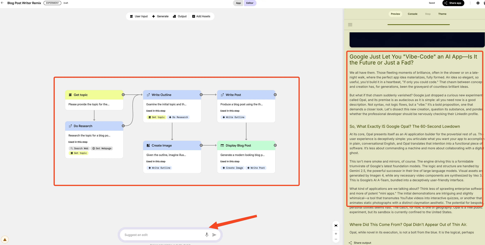
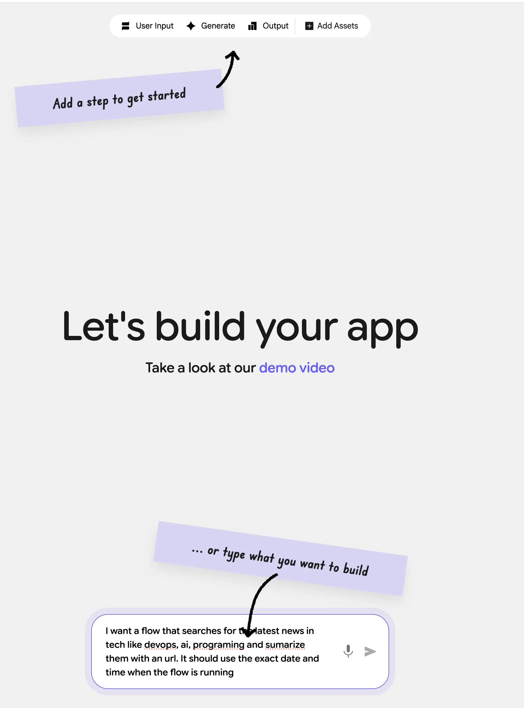
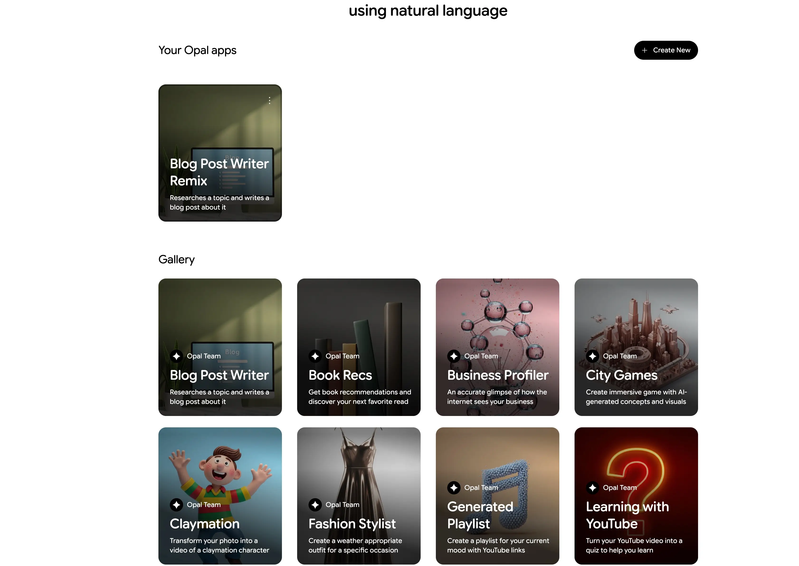

The world of app development is experiencing a seismic shift. What once required months of coding, debugging, and testing can now be accomplished in minutes through simple conversations with AI. Google has just unveiled **[Opal](https://opal.withgoogle.com/)**, a revolutionary experimental tool that's set to democratize app creation like never before. Combined with their recently launched **[Jules](https://jules.google)** coding agent and **[Gemini CLI](https://github.com/google-gemini/gemini-cli)**, Google is building a comprehensive AI-powered development ecosystem that's reshaping how we think about software creation.

In this deep dive, we'll explore Google Opal's game-changing capabilities, examine how it compares to existing no-code solutions, and discover how it fits into Google's broader AI development strategy alongside Jules and Gemini CLI.

<Notice type="info" title="Public Beta Access">

Google Opal is currently available in US-only public beta through Google Labs. No waitlist required - you can start building AI mini-apps today at opal.google.com.

</Notice>

## What Is Google Opal?

Google Opal represents a paradigm shift in application development. Unlike traditional no-code platforms that require you to learn their specific interfaces and limitations, Opal allows you to build sophisticated AI mini-apps using nothing but natural language descriptions and visual editing tools.



At its core, Opal is designed to bridge the gap between having an idea and seeing it come to life as a functional application. It harnesses Google's most advanced AI models - including **Gemini 2.5**, **Veo 3**, and **Imagen 4** - to create comprehensive workflows that chain together prompts, model calls, and various tools.

### The Magic Behind Opal

What makes Opal truly revolutionary is its approach to app creation:

<ListCheck>

- **Natural Language Input**: Describe your app idea in plain English
- **Visual Workflow Generation**: Opal automatically creates illustrated workflows showing each step
- **Multi-Model Integration**: Seamlessly combines text, image, and video generation capabilities
- **Real-Time Editing**: Modify workflows using conversational commands or visual editors
- **Instant Sharing**: Deploy and share apps immediately with anyone who has a Google account

</ListCheck>

## Core Features That Set Opal Apart

### 1. Conversational App Building

Traditional app development requires learning programming languages, frameworks, and deployment processes. Opal eliminates these barriers entirely. You simply describe what you want your app to do, and Opal translates your instructions into a functional workflow.

**Example Interaction:**



```
User: "Create an app that generates personalized workout plans based on user fitness goals and available equipment"

Opal: *Creates workflow with input collection, goal analysis, equipment matching, and personalized plan generation*
```

### 2. Visual Workflow Editor

Every app in Opal is represented as a visual workflow with three main components:

- **Inputs**: What information your app needs from users
- **Generation Steps**: The AI processes and transformations applied
- **Outputs**: The final results delivered to users


This visual approach makes complex AI workflows understandable and editable by anyone, regardless of technical background.

### 3. Multi-Modal AI Integration

Opal's integration with Google's AI model suite enables unprecedented creative possibilities:

| AI Model | Capability | Use Cases |
|----------|------------|-----------|
| **Gemini 2.5** | Advanced text generation and reasoning | Blog posts, analysis, conversational interfaces |
| **Veo 3** | Video generation with audio | Marketing videos, educational content, presentations |
| **Imagen 4** | High-quality image generation | Visual assets, illustrations, product mockups |

### 4. Template Gallery and Remix Culture

Opal launches with a curated gallery of starter templates, each designed for specific use cases:

<ListCheck>

- **Immersive Virtual Games**: Interactive entertainment experiences
- **Video Ad Generators**: Targeted marketing content creation
- **Educational Tools**: Learning and training applications
- **Productivity Apps**: Workflow automation and organization tools
- **Creative Projects**: Art generation and design assistance

</ListCheck>



Users can start with these templates and remix them to fit their exact needs, fostering a culture of collaborative innovation.

### 5. Seamless Sharing and Deployment

Once your app is ready, Opal makes sharing effortless. With the click of a button, you can:
- Generate a shareable URL
- Toggle between private and public access
- Deploy instantly without server setup or hosting concerns
- Allow others to use your app with their Google accounts

## Google's AI Development Ecosystem: The Complete Picture

Opal doesn't exist in isolation. It's part of Google's comprehensive strategy to revolutionize software development through AI. Let's explore how it fits with Jules and Gemini CLI.

### Jules: The Autonomous Coding Agent


**Jules** represents Google's vision of autonomous coding assistance. Unlike traditional code completion tools, Jules is a true coding agent that:

<ListCheck>

- **Operates Asynchronously**: Works in the background while you focus on other tasks
- **Understands Full Context**: Analyzes entire codebases, not just individual files
- **Performs Complex Tasks**: Writes tests, builds features, fixes bugs, and updates dependencies
- **Integrates with GitHub**: Works directly within your existing development workflow
- **Provides Audio Summaries**: Converts commit history into contextual audio changelogs

</ListCheck>

#### Jules Key Capabilities

| Feature | Description | Benefit |
|---------|-------------|---------|
| **Real Codebase Analysis** | Works with actual projects, not sandboxed environments | Accurate, context-aware solutions |
| **Parallel Execution** | Handles multiple tasks simultaneously in cloud VMs | Faster development cycles |
| **Visible Workflow** | Shows planning and reasoning before making changes | Transparent, controllable development |
| **User Steerability** | Allows modification of plans during execution | Maintains developer control |

Jules is currently in public beta worldwide, available wherever Gemini models are accessible, with free usage during the beta period.

### Gemini CLI: Command-Line AI Workflows

The **Gemini CLI** completes Google's AI development triangle by bringing powerful AI capabilities directly to your terminal. This open-source tool excels at:

<ListCheck>

- **Large Codebase Analysis**: Query and edit codebases beyond Gemini's 1M token context window
- **Multimodal App Generation**: Create applications from PDFs, sketches, or other visual inputs
- **Operational Automation**: Handle complex tasks like pull request analysis and code rebases
- **Tool Integration**: Connect with MCP servers and external tools for extended capabilities
- **Media Generation**: Access Imagen, Veo, and Lyria for creative content creation

</ListCheck>

#### Popular Gemini CLI Use Cases

**Codebase Exploration:**
```bash
gemini
> Describe the main pieces of this system's architecture
> What security mechanisms are in place?
> Generate a README section for the authentication module
```

**Workflow Automation:**
```bash
> Make me a slide deck showing git history from the last 7 days
> Create a wall display app for our most active GitHub issues
> Convert all images in this directory to PNG with EXIF date naming
```

## How Opal Compares to Existing Solutions

The no-code/low-code market is crowded with solutions like Bubble, Webflow, and Microsoft Power Apps. Here's how Opal differentiates itself:

### Comparison Matrix


| Feature | Google Opal | Traditional No-Code | AI Coding Tools |
|---------|-------------|-------------------|-----------------|
| **Learning Curve** | Minimal (natural language) | Moderate (platform-specific) | High (coding required) |
| **AI Integration** | Native multi-modal AI | Limited or external | Code-focused only |
| **Workflow Visualization** | Automatic generation | Manual drag-and-drop | No visual representation |
| **Deployment Speed** | Instant | Minutes to hours | Hours to days |
| **Customization Depth** | AI-driven flexibility | Template constraints | Unlimited but complex |
| **Collaboration** | Built-in sharing | Platform-dependent | Developer-only |

### Unique Advantages of Opal

<Notice type="success" title="Opal's Competitive Edge">

Unlike traditional no-code platforms that force you to think in terms of their components and limitations, Opal lets you think in terms of your actual goals and desired outcomes.

</Notice>

1. **True Natural Language Interface**: No need to learn platform-specific terminology or workflows
2. **AI-First Architecture**: Built around AI capabilities rather than retrofitting AI into existing frameworks
3. **Instant Iteration**: Modify apps through conversation rather than navigating complex interfaces
4. **Multi-Modal by Default**: Seamlessly incorporates text, images, and video without additional setup

## Real-World Applications and Use Cases

### Business and Marketing

**Scenario**: A small business owner wants to create personalized video advertisements for different customer segments.

**Traditional Approach**: Hire a video production team, create multiple versions manually, weeks of production time.

**Opal Approach**:
```
"Create an app that generates personalized video ads based on customer demographics and product interests"
```
Result: Automated video generation system ready in minutes.

### Education and Training

**Scenario**: A teacher needs interactive learning modules for different learning styles.

**Opal Solution**:
- Input: Learning objectives and student preferences
- Process: Generate visual explanations, audio summaries, and interactive quizzes
- Output: Personalized learning experiences for each student

### Content Creation

**Scenario**: A content creator wants to maintain consistent publishing across multiple platforms.

**Opal Workflow**:
1. Input article topic and target audience
2. Generate blog post, social media variants, and accompanying visuals
3. Output optimized content for each platform

### Internal Tools and Automation

**Scenario**: A startup needs custom tools for project management and reporting.

**Opal Advantage**: Create specialized mini-apps for specific workflows without hiring developers or purchasing expensive software licenses.

## Getting Started with Google Opal

### Prerequisites and Setup

<ListCheck>

- **Location**: Currently US-only (expanding soon)
- **Account**: Google account required
- **Access**: No waitlist - immediate beta access
- **Cost**: Free during public beta phase
- **Browser**: Modern web browser with JavaScript enabled

</ListCheck>

### Step-by-Step Quick Start

1. **Visit Opal**: Navigate to opal.google.com
2. **Sign In**: Use your Google account credentials
3. **Explore Templates**: Browse the demo gallery for inspiration
4. **Create Your First App**: Click "Create New" and describe your idea
5. **Customize Workflow**: Use the visual editor to refine your app
6. **Test and Share**: Deploy your app and share the URL


## The Future of AI-Powered Development

### Current Limitations and Challenges

While Opal represents a significant advancement, it's important to understand its current limitations:

**Technical Constraints:**
- US-only availability during beta
- Dependent on Google's AI model capabilities and limitations
- Limited to mini-app scope (not full enterprise applications)
- Requires internet connectivity for all operations

**Design Considerations:**
- Apps are constrained by Opal's workflow paradigm
- Complex business logic may require multiple connected apps
- Integration with external systems is limited to available tools

### What's Coming Next

Based on Google's roadmap and industry trends, we can expect:

<ListCheck>

- **Global Expansion**: Availability in more countries and languages
- **Enhanced Model Integration**: Access to newer, more capable AI models
- **Advanced Tool Connectivity**: Better integration with enterprise systems
- **Collaborative Features**: Team-based app development and sharing
- **Performance Optimizations**: Faster execution and better reliability

</ListCheck>

### The Broader Impact on Software Development

Opal, Jules, and Gemini CLI represent more than just individual tools - they signal a fundamental shift in how software gets built:

- **Democratization of Development**: Non-technical users can create sophisticated applications
- **Speed of Innovation**: Ideas can be prototyped and tested in minutes rather than months
- **Reduced Development Costs**: Fewer resources needed for custom software solutions
- **Enhanced Creativity**: Focus shifts from technical implementation to creative problem-solving


## Conclusion: The Dawn of Conversational Development

Google Opal represents more than just another no-code platform - it's the beginning of a new era where the barrier between having an idea and creating a functional application has virtually disappeared. Combined with Jules for serious development work and Gemini CLI for operational automation, Google has created the most comprehensive AI-powered development ecosystem available today.

### Why Opal Matters

**For Individual Creators:**
- Transform ideas into reality without technical barriers
- Rapid prototyping and iteration capabilities
- Access to enterprise-grade AI models without infrastructure costs

**For Businesses:**
- Dramatically reduced time-to-market for new solutions
- Lower development costs for custom applications
- Enhanced ability to test and validate concepts quickly

**For Developers:**
- Focus on high-level problem solving rather than implementation details
- Enhanced productivity through AI assistance
- New opportunities in AI-powered application development

### The Road Ahead

As Opal moves beyond its beta phase and expands globally, we can expect to see:
- More sophisticated AI models integrated into the platform
- Enhanced collaboration features for team development
- Better integration with existing business systems
- A thriving ecosystem of shared templates and components

The convergence of natural language processing, visual workflow design, and multi-modal AI capabilities in Opal creates unprecedented opportunities for innovation. Whether you're a solo entrepreneur, a startup team, or an enterprise looking to accelerate digital transformation, Google's AI development ecosystem offers tools that can dramatically change how you approach software creation.

**Ready to start building?** Visit Opal today and experience the future of application development firsthand.

<Button text="Try Google Opal" url="https://opal.google.com" size="lg" color="blue" variant="solid" icon="arrow-right" iconPosition="right" />

<Button text="Explore Jules" url="https://jules.google" size="lg" color="green" variant="solid" icon="arrow-right" iconPosition="right" />

<Button text="Get Gemini CLI" url="https://github.com/google-gemini/gemini-cli" size="lg" color="purple" variant="solid" icon="arrow-right" iconPosition="right" />

<Notice type="info" title="Stay Updated">

Google's AI development tools are rapidly evolving. Follow Google Labs and the Gemini developer community for the latest updates, new features, and expanded availability.

</Notice>
